# 自定义适配器开发

<cite>
**本文档引用的文件**
- [interfaces.ts](file://server/src/framework/core/interfaces.ts)
- [node-adapter.ts](file://server/src/framework/runtime/node-adapter.ts)
- [skynet-adapter.ts](file://server/src/framework/runtime/skynet-adapter.ts)
- [node-adapter.lua](file://docker/lua/framework/runtime/node-adapter.lua)
- [skynet-adapter.lua](file://docker/lua/framework/runtime/skynet-adapter.lua)
- [node-pb-codec.ts](file://server/src/framework/runtime/node-pb-codec.ts)
- [skynet-pb-codec.ts](file://server/src/framework/runtime/skynet-pb-codec.ts)
- [node-pb-codec.lua](file://docker/lua/framework/runtime/node-pb-codec.lua)
- [skynet-pb-codec.lua](file://docker/lua/framework/runtime/skynet-pb-codec.lua)
- [bootstrap-node.ts](file://server/src/app/bootstrap-node.ts)
- [bootstrap-skynet.ts](file://server/src/app/bootstrap-skynet.ts)
- [gateway/index.ts](file://server/src/app/services/gateway/index.ts)
- [login/index.ts](file://server/src/app/services/login/index.ts)
- [game/index.ts](file://server/src/app/services/game/index.ts)
- [async-bridge.ts](file://server/src/framework/runtime/async-bridge.ts)
</cite>

## 目录
1. [简介](#简介)
2. [项目结构](#项目结构)
3. [核心组件](#核心组件)
4. [架构概览](#架构概览)
5. [详细组件分析](#详细组件分析)
6. [依赖关系分析](#依赖关系分析)
7. [性能考虑](#性能考虑)
8. [故障排除指南](#故障排除指南)
9. [结论](#结论)
10. [附录](#附录)

## 简介

本指南面向需要为新运行时环境开发适配器的开发者，详细说明如何实现 IRuntime 接口及其相关接口（ILogger、ITimer、INetwork、IService、IPbCodec）。文档基于现有的 Node.js 和 Skynet 适配器实现，提供完整的开发模板、最佳实践和调试技巧。

## 项目结构

该代码库采用分层架构设计，核心抽象接口位于 `framework/core` 目录，具体运行时适配器位于 `framework/runtime` 目录。项目同时支持 TypeScript 和 Lua 双语言实现。

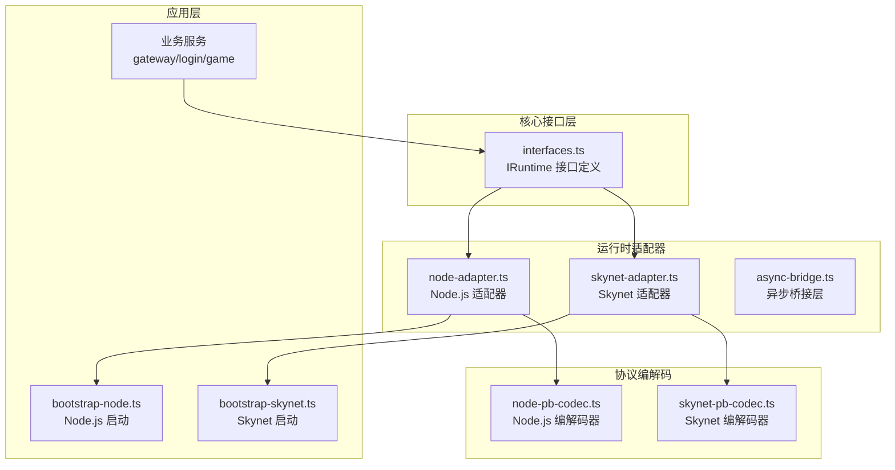

**图表来源**
- [interfaces.ts:1-226](file://server/src/framework/core/interfaces.ts#L1-L226)
- [node-adapter.ts:1-194](file://server/src/framework/runtime/node-adapter.ts#L1-L194)
- [skynet-adapter.ts:1-221](file://server/src/framework/runtime/skynet-adapter.ts#L1-L221)

**章节来源**
- [interfaces.ts:1-226](file://server/src/framework/core/interfaces.ts#L1-L226)
- [node-adapter.ts:1-194](file://server/src/framework/runtime/node-adapter.ts#L1-L194)
- [skynet-adapter.ts:1-221](file://server/src/framework/runtime/skynet-adapter.ts#L1-L221)

## 核心组件

### IRuntime 接口定义

IRuntime 接口是整个系统的核心抽象层，定义了运行时环境必须提供的基础能力：

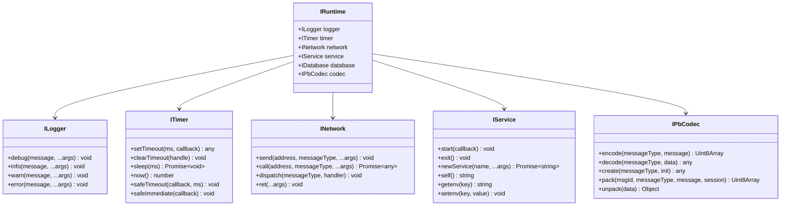

**图表来源**
- [interfaces.ts:9-196](file://server/src/framework/core/interfaces.ts#L9-L196)

### 接口方法规范

每个接口都有明确的方法规范和实现要求：

**ILogger 接口**
- debug/info/warn/error 方法接受可变参数，用于格式化输出
- 参数处理：支持任意数量的参数，内部使用字符串模板进行格式化

**ITimer 接口**
- setTimeout/clearTimeout：标准定时器操作
- sleep：异步睡眠，返回 Promise<void>
- now：获取当前时间戳（秒）
- safeTimeout/safeImmediate：协程安全的定时器，支持 async/await

**INetwork 接口**
- send：发送消息（不等待响应）
- call：调用远程服务（等待响应），返回 Promise
- dispatch：注册消息处理器
- ret：返回响应

**IService 接口**
- start：启动服务，回调必须是同步函数
- exit：退出服务
- newService：创建新服务
- self/getenv/setenv：服务地址和环境变量操作

**IPbCodec 接口**
- encode/decode：消息编解码
- create：创建消息对象
- pack/unpack：Packet 消息打包解包

**章节来源**
- [interfaces.ts:9-196](file://server/src/framework/core/interfaces.ts#L9-L196)

## 架构概览

系统采用运行时抽象层 + 具体适配器的架构模式，通过 `setRuntime()` 函数注入具体的运行时实现。

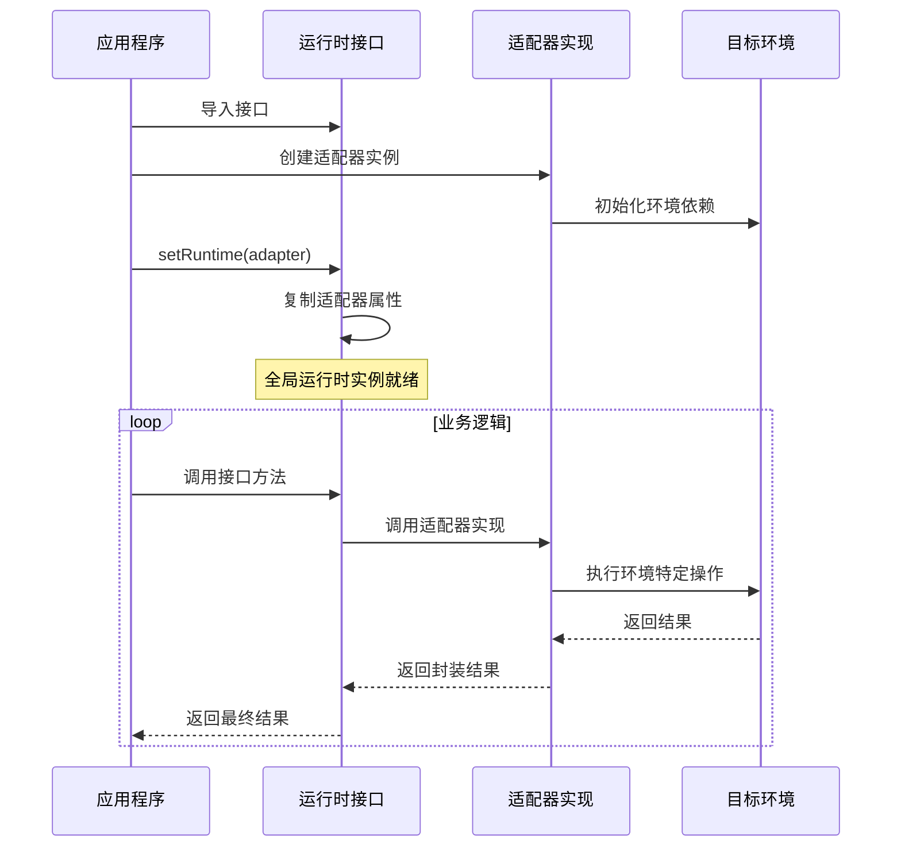

**图表来源**
- [interfaces.ts:214-225](file://server/src/framework/core/interfaces.ts#L214-L225)
- [node-adapter.ts:177-193](file://server/src/framework/runtime/node-adapter.ts#L177-L193)
- [skynet-adapter.ts:204-220](file://server/src/framework/runtime/skynet-adapter.ts#L204-L220)

## 详细组件分析

### Node.js 适配器实现

Node.js 适配器提供了最简单的运行时实现，适合本地开发和测试。

#### NodeLogger 类实现

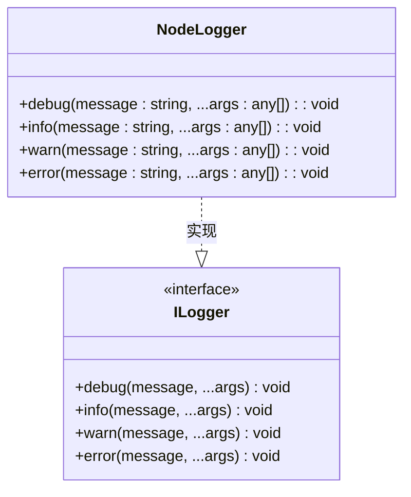

**图表来源**
- [node-adapter.ts:19-35](file://server/src/framework/runtime/node-adapter.ts#L19-L35)

#### NodeTimer 类实现

NodeTimer 实现了完整的定时器功能，包括协程安全的定时器：

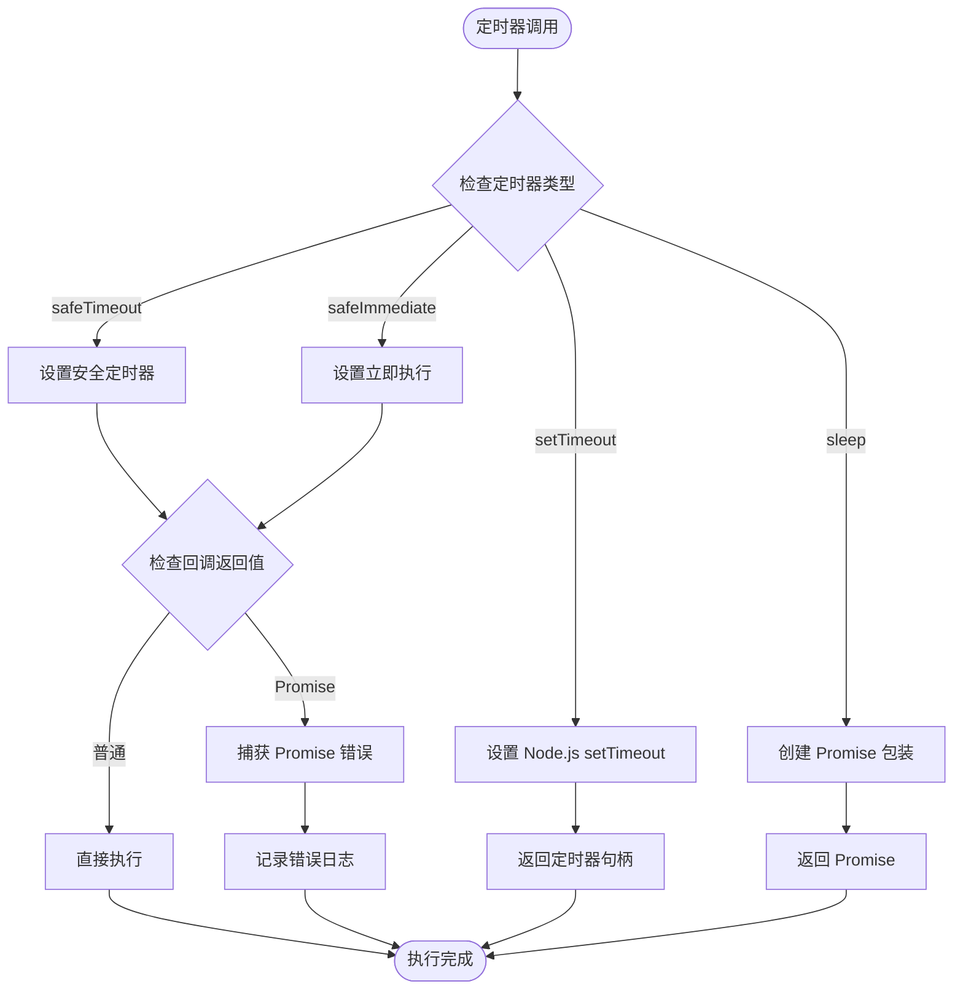

**图表来源**
- [node-adapter.ts:40-84](file://server/src/framework/runtime/node-adapter.ts#L40-L84)

#### NodeNetwork 类实现

NodeNetwork 提供了消息发送和接收功能，使用 Map 存储处理器：

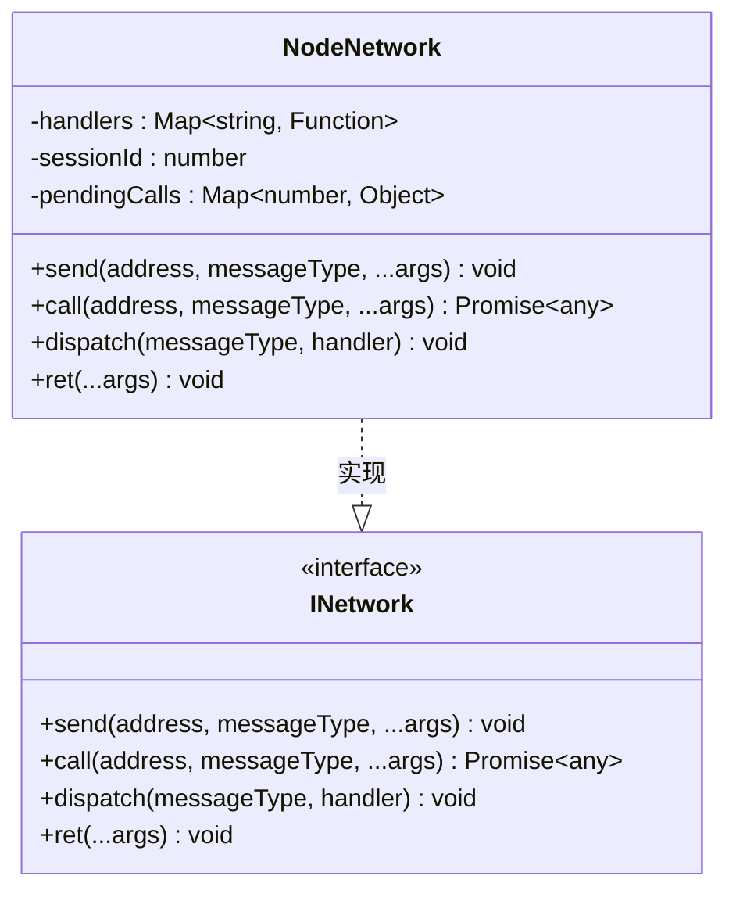

**图表来源**
- [node-adapter.ts:91-128](file://server/src/framework/runtime/node-adapter.ts#L91-L128)

#### NodeService 类实现

NodeService 最简单，直接使用 Node.js 的进程模型：

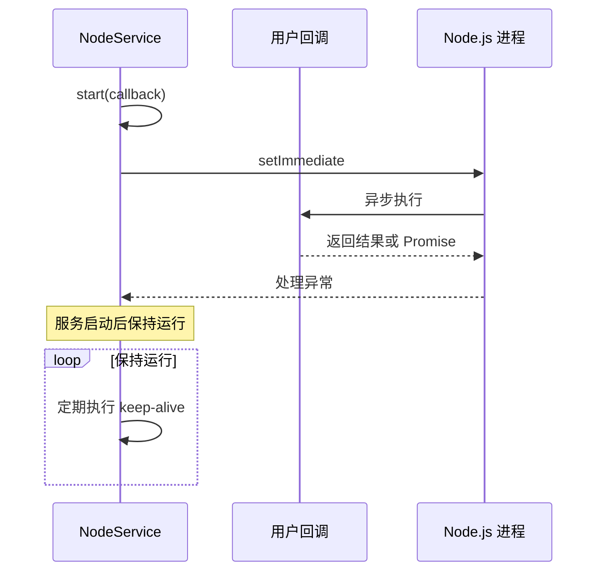

**图表来源**
- [node-adapter.ts:133-172](file://server/src/framework/runtime/node-adapter.ts#L133-L172)

**章节来源**
- [node-adapter.ts:1-194](file://server/src/framework/runtime/node-adapter.ts#L1-L194)

### Skynet 适配器实现

Skynet 适配器是最复杂的实现，需要处理协程管理和异步操作。

#### SkynetLogger 类实现

SkynetLogger 实现了时间戳格式化和参数序列化：

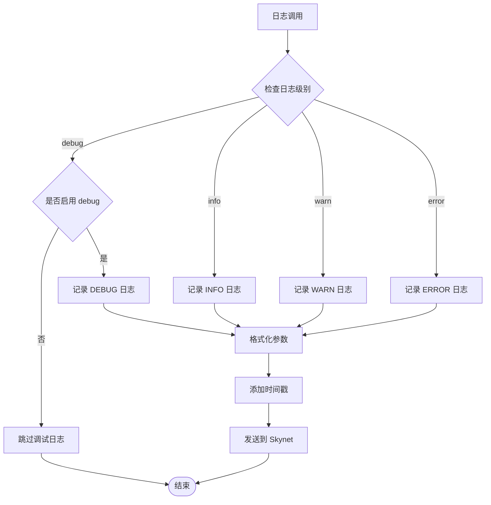

**图表来源**
- [skynet-adapter.ts:28-63](file://server/src/framework/runtime/skynet-adapter.ts#L28-L63)

#### SkynetTimer 类实现

SkynetTimer 需要处理厘秒（1/100秒）的时间单位转换：

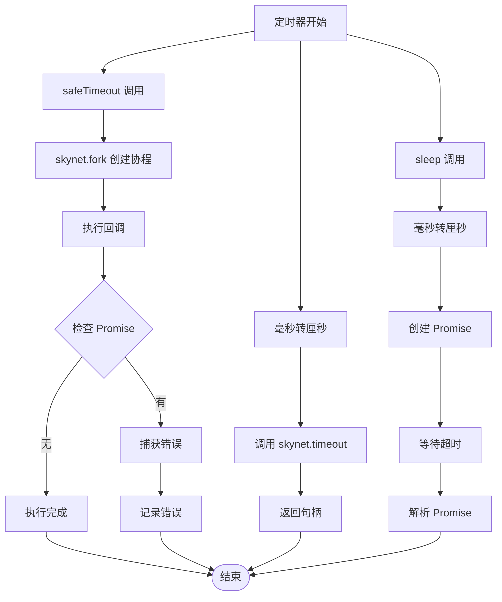

**图表来源**
- [skynet-adapter.ts:69-122](file://server/src/framework/runtime/skynet-adapter.ts#L69-L122)

#### SkynetNetwork 类实现

SkynetNetwork 直接封装了 Skynet 的网络 API：

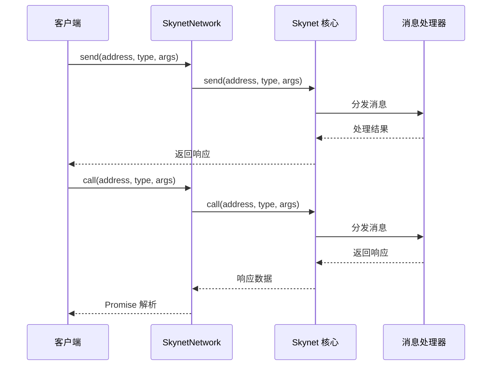

**图表来源**
- [skynet-adapter.ts:127-155](file://server/src/framework/runtime/skynet-adapter.ts#L127-L155)

**章节来源**
- [skynet-adapter.ts:1-221](file://server/src/framework/runtime/skynet-adapter.ts#L1-L221)

### 协议编解码器实现

#### NodePbCodec 类实现

NodePbCodec 使用 protobuf.js 库进行编解码：

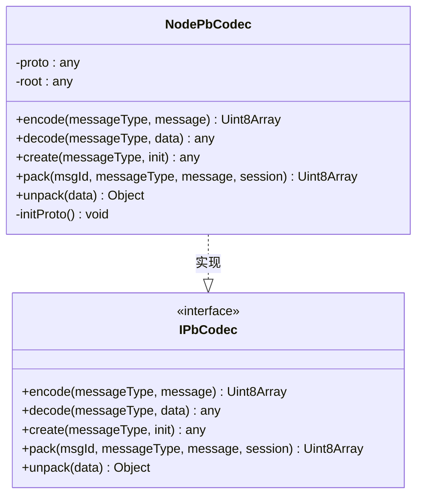

**图表来源**
- [node-pb-codec.ts:53-183](file://server/src/framework/runtime/node-pb-codec.ts#L53-L183)

#### SkynetPbCodec 类实现

SkynetPbCodec 使用 lua-protobuf 库：

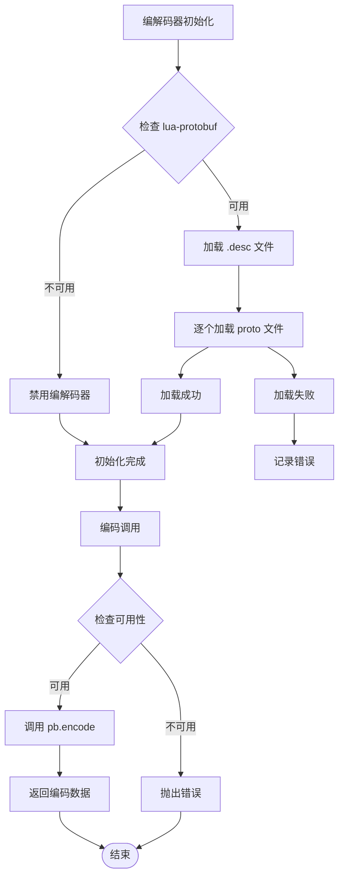

**图表来源**
- [skynet-pb-codec.ts:59-162](file://server/src/framework/runtime/skynet-pb-codec.ts#L59-L162)

**章节来源**
- [node-pb-codec.ts:1-185](file://server/src/framework/runtime/node-pb-codec.ts#L1-L185)
- [skynet-pb-codec.ts:1-164](file://server/src/framework/runtime/skynet-pb-codec.ts#L1-L164)

## 依赖关系分析

系统采用松耦合设计，通过接口抽象实现依赖注入。

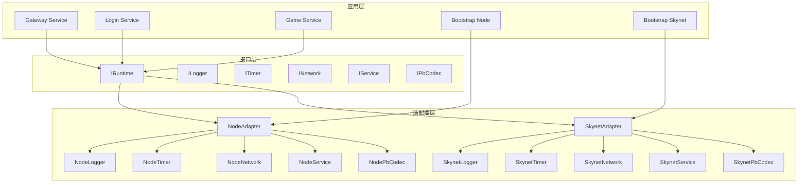

**图表来源**
- [interfaces.ts:1-226](file://server/src/framework/core/interfaces.ts#L1-L226)
- [node-adapter.ts:1-194](file://server/src/framework/runtime/node-adapter.ts#L1-L194)
- [skynet-adapter.ts:1-221](file://server/src/framework/runtime/skynet-adapter.ts#L1-L221)

**章节来源**
- [interfaces.ts:1-226](file://server/src/framework/core/interfaces.ts#L1-L226)
- [node-adapter.ts:1-194](file://server/src/framework/runtime/node-adapter.ts#L1-L194)
- [skynet-adapter.ts:1-221](file://server/src/framework/runtime/skynet-adapter.ts#L1-L221)

## 性能考虑

### 时间复杂度分析

1. **定时器操作**：O(1) 时间复杂度，直接调用底层 API
2. **网络通信**：O(1) 平均复杂度，取决于消息大小和网络延迟
3. **编解码操作**：O(n) 复杂度，n 为消息大小
4. **服务启动**：O(1) 复杂度，但可能涉及磁盘 I/O

### 内存管理

1. **定时器句柄**：需要适当的清理机制，避免内存泄漏
2. **消息队列**：使用 Map 结构存储待处理消息
3. **Promise 链**：注意避免深层嵌套导致的内存占用

### 并发处理

1. **协程安全**：Skynet 环境使用 `skynet.fork` 创建独立协程
2. **异步桥接**：通过自定义 Promise 实现桥接不同环境的异步模型

## 故障排除指南

### 常见问题及解决方案

#### 1. 运行时未正确设置

**问题症状**：调用 `runtime.service.start()` 抛出异常
**解决方案**：确保在导入任何业务代码前调用 `setRuntime()`

#### 2. 定时器回调未执行

**问题症状**：`safeTimeout` 和 `safeImmediate` 不生效
**解决方案**：检查回调函数的返回值，确保正确处理 Promise

#### 3. 网络消息丢失

**问题症状**：`call` 方法没有收到响应
**解决方案**：检查 `pendingCalls` 映射表，确认会话 ID 管理

#### 4. 编解码器初始化失败

**问题症状**：`codec` 对象为 undefined
**解决方案**：检查 proto 文件加载和消息类型映射配置

**章节来源**
- [node-adapter.ts:177-193](file://server/src/framework/runtime/node-adapter.ts#L177-L193)
- [skynet-adapter.ts:204-220](file://server/src/framework/runtime/skynet-adapter.ts#L204-L220)

## 结论

本文档提供了完整的自定义适配器开发指南，基于现有的 Node.js 和 Skynet 适配器实现。通过遵循接口规范和最佳实践，开发者可以快速为新的运行时环境创建适配器。关键要点包括：

1. **严格遵循接口规范**：确保所有方法都正确实现
2. **处理异步操作**：特别是在 Skynet 环境中正确使用协程
3. **错误处理**：提供完善的错误处理和日志记录
4. **性能优化**：注意内存管理和并发处理
5. **测试验证**：通过单元测试和集成测试确保稳定性

## 附录

### 开发模板

以下是一个最小化的适配器开发模板：

```typescript
// 自定义运行时适配器模板
import {
  ILogger,
  ITimer,
  INetwork,
  IService,
  IRuntime,
  IPbCodec,
} from '../core/interfaces';

// 实现日志接口
class CustomLogger implements ILogger {
  debug(message: string, ...args: any[]): void {
    // 实现自定义日志逻辑
  }
  // ... 其他方法
}

// 实现定时器接口
class CustomTimer implements ITimer {
  setTimeout(ms: number, callback: () => void): any {
    // 实现自定义定时器
  }
  // ... 其他方法
}

// 实现网络接口
class CustomNetwork implements INetwork {
  send(address: string, messageType: string, ...args: any[]): void {
    // 实现自定义网络发送
  }
  // ... 其他方法
}

// 实现服务接口
class CustomService implements IService {
  start(callback: () => void | Promise<void>): void {
    // 实现自定义服务启动
  }
  // ... 其他方法
}

// 创建运行时实例
export function createCustomRuntime(): IRuntime {
  return {
    logger: new CustomLogger(),
    timer: new CustomTimer(),
    network: new CustomNetwork(),
    service: new CustomService(),
    // codec 可选
  };
}
```

### 测试建议

1. **单元测试**：为每个接口方法编写测试用例
2. **集成测试**：测试完整的工作流程
3. **性能测试**：评估高负载下的表现
4. **兼容性测试**：验证与其他组件的兼容性

### 调试技巧

1. **日志记录**：在关键路径添加详细的日志
2. **断点调试**：使用 IDE 断点调试异步代码
3. **内存监控**：定期检查内存使用情况
4. **性能分析**：使用性能分析工具识别瓶颈