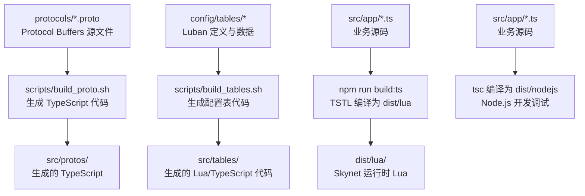
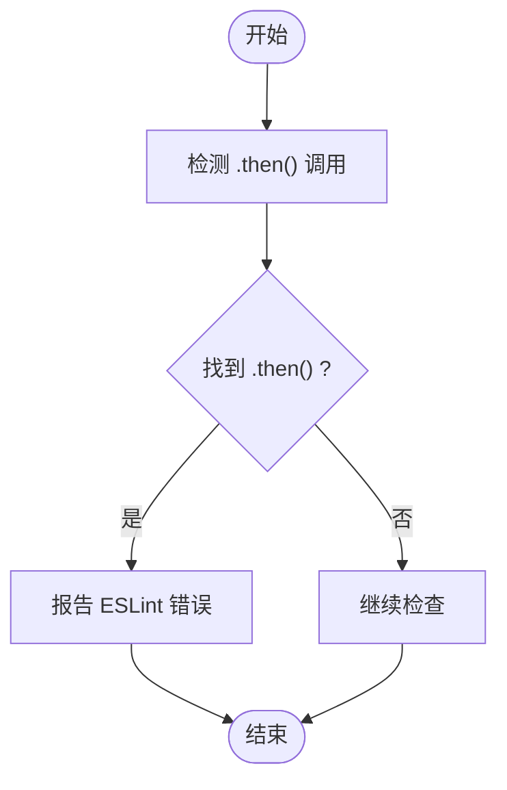
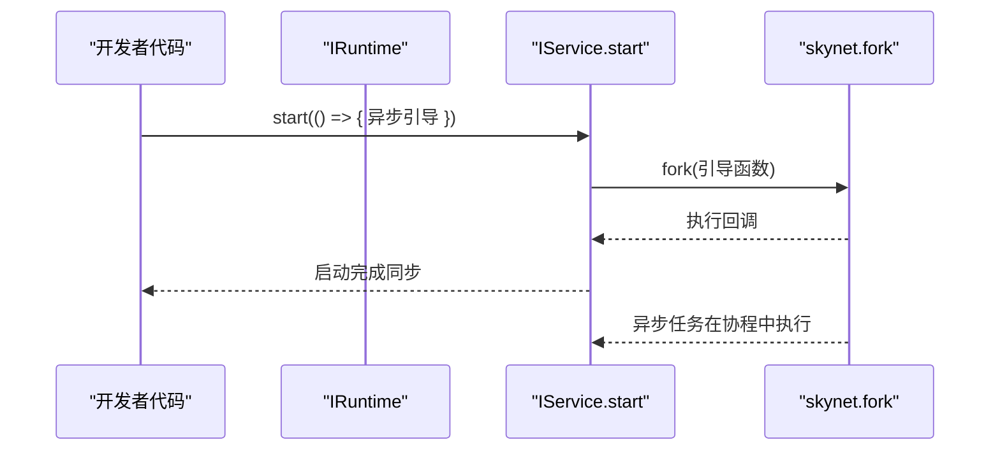
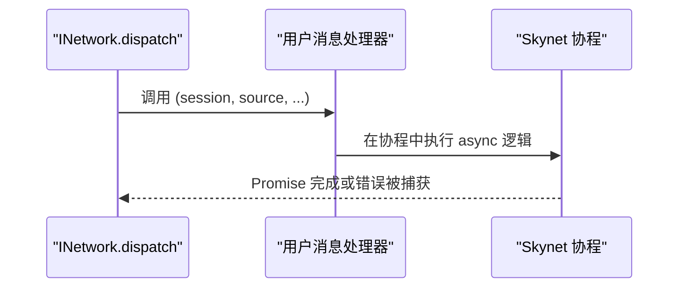
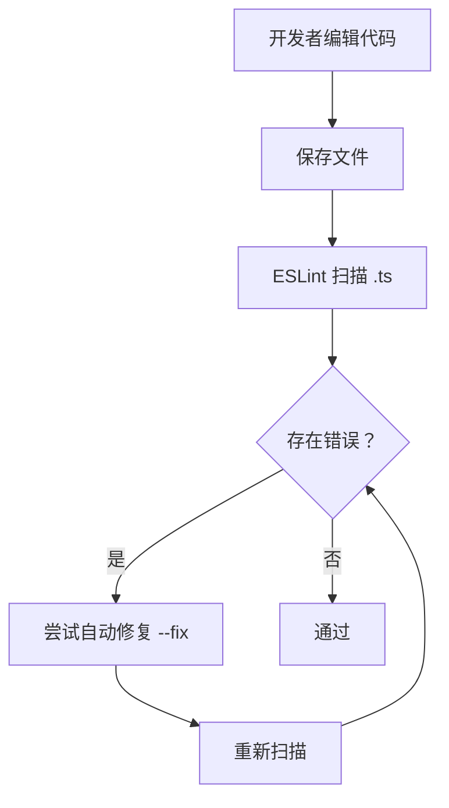
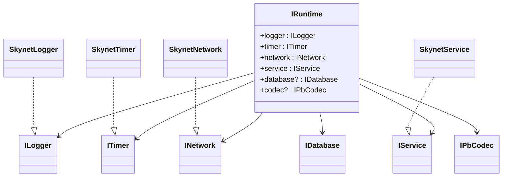

# 代码规范

<cite>
**本文引用的文件**
- [TS-Skynet 异步编程规范.md](file://docs/TS-Skynet 异步编程规范.md)
- [eslint/index.js](file://server/eslint/index.js)
- [eslint/.eslintrc.cjs](file://server/.eslintrc.cjs)
- [eslint/rules/no-async-in-service-start.js](file://server/eslint/rules/no-async-in-service-start.js)
- [eslint/rules/no-promise-then.js](file://server/eslint/rules/no-promise-then.js)
- [package.json](file://server/package.json)
- [目录结构说明.md](file://docs/目录结构说明.md)
- [skynet-adapter.ts](file://server/src/framework/runtime/skynet-adapter.ts)
- [interfaces.ts](file://server/src/framework/core/interfaces.ts)
- [start.sh](file://server/start.sh)
</cite>

## 目录
1. [简介](#简介)
2. [项目结构](#项目结构)
3. [核心组件](#核心组件)
4. [架构总览](#架构总览)
5. [详细组件分析](#详细组件分析)
6. [依赖关系分析](#依赖关系分析)
7. [性能考量](#性能考量)
8. [故障排查指南](#故障排查指南)
9. [结论](#结论)
10. [附录](#附录)

## 简介
本文件为 TypeScriptToLua（TSTL）在 Skynet 环境下的代码规范与最佳实践指南。内容覆盖命名约定、代码组织结构、注释规范、Skynet 运行时特定的编码限制（如服务初始化必须使用同步函数、消息处理器可使用 async 等）、ESLint 规则配置与使用方法、风格检查与自动修复流程，以及常见错误的识别与规避策略。

## 项目结构
TS-Skynet 采用“多语言混合”工程：TypeScript 源码经 TSTL 编译为 Lua，部署于 Skynet；同时保留 TypeScript 编译为 Node.js 的能力用于开发调试。项目目录与数据流如下：

图表来源
- [目录结构说明.md:102-127](file://docs/目录结构说明.md#L102-L127)

章节来源
- [目录结构说明.md:1-174](file://docs/目录结构说明.md#L1-L174)

## 核心组件
- 运行时抽象层：通过接口定义统一日志、定时器、网络、服务、数据库、协议编解码等能力，业务代码只依赖接口，不直接耦合 Skynet 或 Node.js API。
- Skynet 适配器：实现上述接口，封装 Skynet Lua API，并对协程、消息循环、Promise 等进行兼容处理。
- ESLint 插件与规则：提供针对 Skynet 环境的定制规则，强制约束服务启动回调、Promise 链式调用、动态 require、正则特性、空值判断、浮点比较、BigInt、字符串长度、NaN 作为 Map 键等。

章节来源
- [interfaces.ts:1-226](file://server/src/framework/core/interfaces.ts#L1-L226)
- [skynet-adapter.ts:1-221](file://server/src/framework/runtime/skynet-adapter.ts#L1-L221)
- [eslint/index.js:1-52](file://server/eslint/index.js#L1-L52)
- [eslint/.eslintrc.cjs:1-35](file://server/.eslintrc.cjs#L1-L35)

## 架构总览
TS-Skynet 的运行时与编译链路如下：

```mermaid
graph TB
subgraph "开发与构建"
TS["TypeScript 源码<br/>src/app/*.ts"] --> TSTL["TSTL 编译器<br/>config/tsconfig.lua.json"]
TS --> TSC["TypeScript 编译器<br/>config/tsconfig.json"]
end
subgraph "编译输出"
LUA["Lua 代码<br/>dist/lua/"]
NODEJS["Node.js 代码<br/>dist/nodejs/"]
end
subgraph "运行时"
SKYNET["Skynet 引擎"]
RUNTIME["运行时抽象层<br/>IRuntime 接口"]
ADAPTER["Skynet 适配器<br/>skynet-adapter.ts"]
end
TSTL --> LUA
TSC --> NODEJS
LUA --> SKYNET
RUNTIME --> ADAPTER
ADAPTER --> SKYNET
```

图表来源
- [目录结构说明.md:102-127](file://docs/目录结构说明.md#L102-L127)
- [skynet-adapter.ts:204-221](file://server/src/framework/runtime/skynet-adapter.ts#L204-L221)
- [interfaces.ts:189-196](file://server/src/framework/core/interfaces.ts#L189-L196)

## 详细组件分析

### 命名约定
- 接口与类：采用名词短语或抽象概念命名，如 ILogger、ITimer、SkynetLogger、SkynetTimer。
- 方法：动宾结构，如 sleep、call、dispatch、ret、newService、self、getenv、setenv。
- 常量与枚举：全大写加下划线，如 RuntimeEnvironment。
- 文件与模块：按功能域划分，如 runtime、core、services 下的子目录。

章节来源
- [interfaces.ts:9-196](file://server/src/framework/core/interfaces.ts#L9-L196)
- [skynet-adapter.ts:28-199](file://server/src/framework/runtime/skynet-adapter.ts#L28-L199)

### 代码组织结构
- 源码分层：src/app（业务服务）、src/framework（核心与运行时）、src/protos（生成的协议代码）、src/tables（生成的配置表代码）。
- 配置分层：config/tsconfig.json（Node.js 调试）、config/tsconfig.lua.json（TSTL 编译）、config/tables（Luban 配置）。
- 构建脚本：start.sh、scripts/start.sh 提供菜单式启动与常用命令。

章节来源
- [目录结构说明.md:13-74](file://docs/目录结构说明.md#L13-L74)
- [目录结构说明.md:151-160](file://docs/目录结构说明.md#L151-L160)
- [start.sh:1-66](file://server/start.sh#L1-L66)

### 注释规范
- 接口与类：对职责、参数、返回值、异常进行简要说明。
- 方法：说明用途、前置条件、副作用、协程与异步行为。
- 复杂逻辑：在关键步骤添加注释，解释与 Skynet 协程模型相关的注意事项。

章节来源
- [interfaces.ts:28-199](file://server/src/framework/core/interfaces.ts#L28-L199)
- [skynet-adapter.ts:28-199](file://server/src/framework/runtime/skynet-adapter.ts#L28-L199)

### Skynet 运行时特定编码限制与最佳实践

#### 规则1：禁止使用 Promise.then() 链式调用
- 问题：在 Skynet 环境中，.then() 回调不在协程管理下，服务退出时会导致“无法恢复死亡协程”的错误。
- 正确写法：使用 async/await，并在 try/catch 中处理错误。
- 豁免：框架底层（Promise polyfill 实现）可使用，但业务代码不应使用。

图表来源
- [eslint/rules/no-promise-then.js:37-76](file://server/eslint/rules/no-promise-then.js#L37-L76)

章节来源
- [TS-Skynet 异步编程规范.md:20-62](file://docs/TS-Skynet 异步编程规范.md#L20-L62)
- [eslint/rules/no-promise-then.js:1-76](file://server/eslint/rules/no-promise-then.js#L1-L76)

#### 规则2：禁止在 service.start 回调中使用 async
- 问题：Skynet 要求服务启动回调同步完成，使用 async 会导致服务启动后立即退出。
- 正确写法：将异步引导逻辑拆分为独立 async 函数，在同步回调中启动它，并在失败时调用 service.exit() 保持服务稳定。

图表来源
- [skynet-adapter.ts:160-174](file://server/src/framework/runtime/skynet-adapter.ts#L160-L174)
- [eslint/rules/no-async-in-service-start.js:24-81](file://server/eslint/rules/no-async-in-service-start.js#L24-L81)

章节来源
- [TS-Skynet 异步编程规范.md:94-130](file://docs/TS-Skynet 异步编程规范.md#L94-L130)
- [eslint/rules/no-async-in-service-start.js:1-81](file://server/eslint/rules/no-async-in-service-start.js#L1-L81)

#### 规则3：dispatch 消息处理器可以使用 async
- 说明：dispatch 回调在消息循环内执行，协程管理机制已就绪，可安全使用 async/await。
- 注意：框架底层会正确处理 async handler 的 Promise 结果。

图表来源
- [skynet-adapter.ts:139-150](file://server/src/framework/runtime/skynet-adapter.ts#L139-L150)

章节来源
- [TS-Skynet 异步编程规范.md:142-156](file://docs/TS-Skynet 异步编程规范.md#L142-L156)
- [skynet-adapter.ts:139-150](file://server/src/framework/runtime/skynet-adapter.ts#L139-L150)

#### 规则4：禁止直接使用 Node.js/浏览器 API
- 说明：Skynet 环境不提供 Node.js 模块系统与浏览器 API，应改用 runtime.* 抽象层。
- 全局对象：console、process、global、Buffer、Date 等通过注入实现，可直接使用。

章节来源
- [TS-Skynet 异步编程规范.md:169-208](file://docs/TS-Skynet 异步编程规范.md#L169-L208)

#### 规则5：避免动态模块加载
- 问题：动态 require 路径在编译期无法解析，会导致运行时错误；条件导入会被全部打包，无法实现懒加载。
- 正确写法：静态导入 + 映射表替代动态加载。

章节来源
- [TS-Skynet 异步编程规范.md:355-391](file://docs/TS-Skynet 异步编程规范.md#L355-L391)

#### 规则6：注意数组边界与索引
- 说明：Lua 数组索引从 1 开始，负索引行为与 JS 不同，应显式计算正索引或使用辅助函数。

章节来源
- [TS-Skynet 异步编程规范.md:402-423](file://docs/TS-Skynet 异步编程规范.md#L402-L423)

#### 规则7：避免高级正则特性
- 说明：Lua pattern 不支持环视、反向引用、非贪婪量词等特性，应使用简单 pattern 或手写解析。

章节来源
- [TS-Skynet 异步编程规范.md:441-466](file://docs/TS-Skynet 异步编程规范.md#L441-L466)

#### 规则8：统一空值判断方式
- 说明：在 Skynet 环境中，undefined 与 nil 的行为差异导致 if (obj.foo === undefined) 可能不匹配，推荐使用 == null 或显式类型检查。

章节来源
- [TS-Skynet 异步编程规范.md:473-503](file://docs/TS-Skynet 异步编程规范.md#L473-L503)

#### 规则9：注意时间处理差异
- 说明：Date.now()、toISOString() 等已通过 polyfill 实现，但方法调用需使用冒号语法，且支持格式有限。

章节来源
- [TS-Skynet 异步编程规范.md:519-584](file://docs/TS-Skynet 异步编程规范.md#L519-L584)

#### 规则10：禁止 BigInt，位运算已支持
- 说明：BigInt 在 Lua 中不可用，应使用字符串或分段处理；位运算符直接编译为 Lua 原生支持。

章节来源
- [TS-Skynet 异步编程规范.md:594-647](file://docs/TS-Skynet 异步编程规范.md#L594-L647)

#### 规则11：字符串长度计算（已支持 UTF-8）
- 说明：str.length 返回字节数，应使用 String.length(str) 获取字符数；方法调用使用冒号语法。

章节来源
- [TS-Skynet 异步编程规范.md:650-713](file://docs/TS-Skynet 异步编程规范.md#L650-L713)

#### 规则12：Map/Set 使用注意事项
- 说明：NaN 不能作为 Map 键；对象键使用引用比较；支持 for...of、forEach 等迭代。

章节来源
- [TS-Skynet 异步编程规范.md:716-782](file://docs/TS-Skynet 异步编程规范.md#L716-L782)

### ESLint 规则配置与使用

#### 规则清单与级别
- no-async-in-service-start：error（禁止在 service.start 中使用 async）
- no-promise-then：error（禁止使用 Promise.then）
- no-dynamic-require：error（禁止动态 require）
- no-bigint：error（禁止 BigInt）
- no-string-length：error（禁止使用 str.length 获取字符数）
- no-nan-map-key：error（禁止 NaN 作为 Map 键）
- no-conditional-require：warn（条件导入）
- no-advanced-regex：warn（高级正则）
- no-strict-null-compare：warn（严格空值比较）
- no-implicit-null-check：warn（隐式空值检查）
- no-floating-point-compare：warn（浮点比较）

章节来源
- [eslint/index.js:19-51](file://server/eslint/index.js#L19-L51)
- [.eslintrc.cjs:17-25](file://server/.eslintrc.cjs#L17-L25)

#### 规则实现要点
- no-async-in-service-start：检测 runtime.service.start 或 service.start 的回调是否为 async，若是则报错。
- no-promise-then：检测 MemberExpression 的 property 是否为 then，若是则报错；对框架底层豁免。

章节来源
- [eslint/rules/no-async-in-service-start.js:24-81](file://server/eslint/rules/no-async-in-service-start.js#L24-L81)
- [eslint/rules/no-promise-then.js:37-76](file://server/eslint/rules/no-promise-then.js#L37-L76)

#### 使用方法与自动修复
- 安装依赖：确保已安装 eslint、typescript、@typescript-eslint/*、typescript-to-lua。
- 执行检查：npm run lint 或 npx eslint src --ext .ts。
- 自动修复：npm run lint:fix 或 npx eslint src --ext .ts --fix。
- 集成 IDE：VSCode 安装 ESLint 扩展，启用保存时自动修复。

章节来源
- [package.json:24-25](file://server/package.json#L24-L25)
- [.eslintrc.cjs:1-35](file://server/.eslintrc.cjs#L1-L35)

### 代码风格检查与自动修复流程

图表来源
- [package.json:24-25](file://server/package.json#L24-L25)
- [.eslintrc.cjs:17-35](file://server/.eslintrc.cjs#L17-L35)

## 依赖关系分析
- 业务代码依赖 IRuntime 接口，不直接依赖 Skynet 或 Node.js API。
- Skynet 适配器实现 IRuntime，封装 skynet.* Lua API。
- ESLint 插件注册自定义规则，扩展基础 TypeScript 规则集。

图表来源
- [interfaces.ts:9-196](file://server/src/framework/core/interfaces.ts#L9-L196)
- [skynet-adapter.ts:28-199](file://server/src/framework/runtime/skynet-adapter.ts#L28-L199)

章节来源
- [interfaces.ts:189-226](file://server/src/framework/core/interfaces.ts#L189-L226)
- [skynet-adapter.ts:204-221](file://server/src/framework/runtime/skynet-adapter.ts#L204-L221)

## 性能考量
- 高频使用 setTimeout/setImmediate 会频繁创建协程，可能影响性能；建议评估必要性。
- 避免在循环中进行大量动态 require 或条件导入，减少打包体积与启动时间。
- 使用 safeTimeout/safeImmediate 时注意回调中的 Promise 错误处理，避免未捕获异常导致协程崩溃。

章节来源
- [TS-Skynet 异步编程规范.md:318-344](file://docs/TS-Skynet 异步编程规范.md#L318-L344)
- [skynet-adapter.ts:100-122](file://server/src/framework/runtime/skynet-adapter.ts#L100-L122)

## 故障排查指南
- “无法恢复死亡协程”：检查是否存在 .then() 链式调用，改为 async/await。
- 服务启动后立即退出：确认 service.start 回调为同步，异步引导逻辑在回调内启动并捕获错误。
- 空值判断异常：使用 == null 或显式类型检查，避免依赖隐式 falsy 判断。
- 正则匹配失败：改用简单 pattern 或手写解析。
- 字符串长度错误：使用 String.length(str) 获取字符数，而非 str.length。
- Map 键异常：避免使用 NaN 作为键，使用特殊字符串占位或对象键的引用比较。

章节来源
- [TS-Skynet 异步编程规范.md:64-90](file://docs/TS-Skynet 异步编程规范.md#L64-L90)
- [eslint/rules/no-promise-then.js:37-76](file://server/eslint/rules/no-promise-then.js#L37-L76)
- [eslint/rules/no-async-in-service-start.js:24-81](file://server/eslint/rules/no-async-in-service-start.js#L24-L81)
- [eslint/rules/no-strict-null-compare.js](file://server/eslint/rules/no-strict-null-compare.js)
- [eslint/rules/no-implicit-null-check.js](file://server/eslint/rules/no-implicit-null-check.js)
- [eslint/rules/no-advanced-regex.js](file://server/eslint/rules/no-advanced-regex.js)
- [eslint/rules/no-string-length.js](file://server/eslint/rules/no-string-length.js)
- [eslint/rules/no-nan-map-key.js](file://server/eslint/rules/no-nan-map-key.js)

## 结论
遵循本规范可有效避免 Skynet 环境下的运行时错误，提升代码一致性与可维护性。建议团队在开发流程中强制执行 ESLint 规则，并结合 IDE 自动修复与 CI 检查，确保新旧代码均符合规范。

## 附录
- 快速启动与常用命令可通过 start.sh 与 scripts/start.sh 使用菜单式交互。
- 构建流程包括 Protobuf 与配置表生成、TypeScript 编译为 Lua 与 Node.js 两套产物。

章节来源
- [目录结构说明.md:151-160](file://docs/目录结构说明.md#L151-L160)
- [start.sh:1-66](file://server/start.sh#L1-L66)