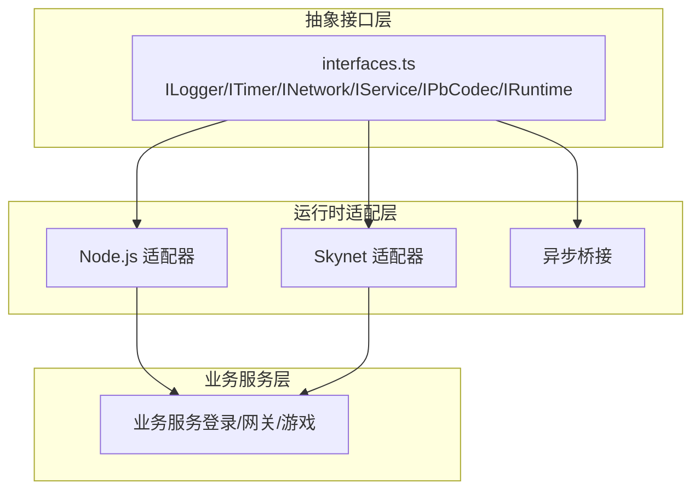
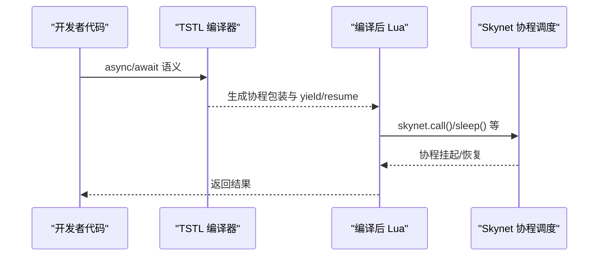
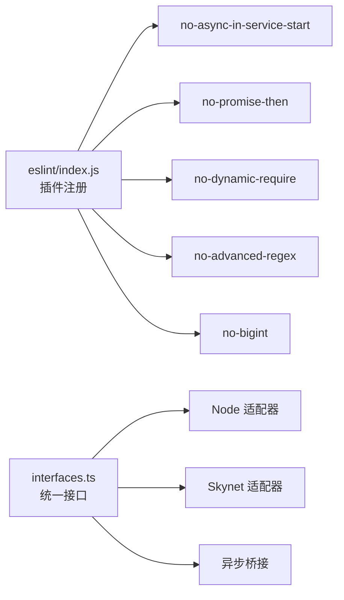

# 常见问题解决

<cite>
**本文引用的文件**
- [README.md](file://README.md)
- [TS-Skynet 异步编程规范.md](file://docs/TS-Skynet 异步编程规范.md)
- [架构设计文档.md](file://docs/架构设计文档.md)
- [eslint/index.js](file://server/eslint/index.js)
- [no-async-in-service-start.js](file://server/eslint/rules/no-async-in-service-start.js)
- [no-promise-then.js](file://server/eslint/rules/no-promise-then.js)
- [interfaces.ts](file://server/src/framework/core/interfaces.ts)
</cite>

## 目录
1. [简介](#简介)
2. [项目结构](#项目结构)
3. [核心组件](#核心组件)
4. [架构总览](#架构总览)
5. [详细组件分析](#详细组件分析)
6. [依赖分析](#依赖分析)
7. [性能考虑](#性能考虑)
8. [故障排查指南](#故障排查指南)
9. [结论](#结论)
10. [附录](#附录)

## 简介
本指南聚焦于 TS-Skynet 混合开发框架在实际开发中常遇问题的系统化解析，覆盖服务启动失败、异步编程错误、内存与协程泄漏、日志与调试、性能瓶颈识别与优化、常见编程陷阱与反模式、以及预防最佳实践。内容基于项目源码与官方文档，提供可操作的诊断方法、修复步骤与规避策略。

## 项目结构
- 代码按“抽象接口层 → 运行时适配层 → 业务服务层”分层组织，保证在 Node.js 与 Skynet 双环境的一致性。
- 关键运行时接口集中在核心接口定义文件中，统一日志、定时器、网络、服务与可选数据库、协议编解码能力。
- ESLint 插件与规则在开发阶段即拦截不合规写法，降低运行时风险。

图表来源
- [架构设计文档.md](file://docs/架构设计文档.md)
- [interfaces.ts](file://server/src/framework/core/interfaces.ts)

章节来源
- [README.md](file://README.md)
- [架构设计文档.md](file://docs/架构设计文档.md)

## 核心组件
- 抽象接口层：定义跨平台统一能力，业务代码仅依赖接口，避免直接耦合 Node.js 或 Skynet API。
- 运行时适配层：分别在 Node.js 与 Skynet 环境提供具体实现，屏蔽异步模型差异。
- 异步桥接：将 TypeScript 的 async/await 在 Skynet 环境转换为 Lua 协程，确保协程安全与生命周期可控。
- ESLint 规则：在编码阶段拦截典型错误写法，如禁止在服务启动回调中使用 async、禁止使用 Promise.then 等。

章节来源
- [架构设计文档.md](file://docs/架构设计文档.md)
- [eslint/index.js](file://server/eslint/index.js)
- [no-async-in-service-start.js](file://server/eslint/rules/no-async-in-service-start.js)
- [no-promise-then.js](file://server/eslint/rules/no-promise-then.js)
- [interfaces.ts](file://server/src/framework/core/interfaces.ts)

## 架构总览
TS 代码通过 TSTL 编译为 Lua，Skynet 协程负责挂起与恢复，从而在 Skynet 环境中无缝执行 async/await。Node.js 环境直接映射为 Promise，便于本地调试与测试。

图表来源
- [TS-Skynet 异步编程规范.md](file://docs/TS-Skynet 异步编程规范.md)
- [架构设计文档.md](file://docs/架构设计文档.md)

## 详细组件分析

### 服务启动失败
- 症状：服务启动后立即退出或未进入消息循环。
- 根因：在 runtime.service.start 回调中使用了 async 函数，导致回调返回 Promise，Skynet 要求启动回调同步完成。
- 诊断要点：
  - 检查服务启动回调是否为 async。
  - 使用 ESLint 规则 no-async-in-service-start 进行静态检查。
- 修复步骤：
  - 将启动回调改为同步；在其中启动异步引导流程，并在异常时主动退出服务。
  - 保持服务存活的主循环应使用受控协程（如定时器循环）。
- 预防措施：
  - 固化启动流程模板，避免在启动回调中进行耗时或异步初始化。
  - 使用 ESLint 规则自动拦截违规写法。

章节来源
- [TS-Skynet 异步编程规范.md](file://docs/TS-Skynet 异步编程规范.md)
- [no-async-in-service-start.js](file://server/eslint/rules/no-async-in-service-start.js)

### 异步编程错误（Promise.then 链式调用）
- 症状：服务退出时出现“无法恢复死协程”类错误。
- 根因：.then() 回调不在协程管理范围内，服务退出后回调无法被恢复。
- 诊断要点：
  - 搜索代码中是否存在 Promise.then() 链式调用。
  - 使用 ESLint 规则 no-promise-then 进行静态检查。
- 修复步骤：
  - 将函数改为 async，并用 await 替代 .then()。
  - 在 dispatch 消息处理器中直接使用 async 函数。
- 预防措施：
  - 统一采用 async/await 语法，避免混合使用 then/catch。
  - 在团队内强化异步规范培训与代码评审。

章节来源
- [TS-Skynet 异步编程规范.md](file://docs/TS-Skynet 异步编程规范.md)
- [no-promise-then.js](file://server/eslint/rules/no-promise-then.js)

### 消息处理与回调生命周期
- 症状：消息处理回调未执行或崩溃。
- 根因：回调未在协程上下文中执行，或在服务退出时仍在等待。
- 修复步骤：
  - 在 dispatch 中使用 async 回调，确保在消息循环内执行。
  - 对异常进行 try/catch 并返回错误结果。
- 预防措施：
  - 将所有消息处理逻辑封装为 async 函数，避免直接返回普通函数。

章节来源
- [TS-Skynet 异步编程规范.md](file://docs/TS-Skynet 异步编程规范.md)

### 定时器与协程安全
- 症状：定时器回调未触发或协程泄漏。
- 根因：直接使用 Node.js 的 setTimeout/setImmediate，或在 Skynet 环境中不当使用。
- 修复步骤：
  - 使用 runtime.timer.safeTimeout/safeImmediate（由 TSTL 插件在编译期转换），确保回调在受管协程中执行。
  - 避免高频创建协程，必要时合并任务。
- 预防措施：
  - 统一使用 runtime.timer.* 接口，避免平台特有 API。

章节来源
- [TS-Skynet 异步编程规范.md](file://docs/TS-Skynet 异步编程规范.md)

### 网络调用与返回
- 症状：RPC 调用无响应或返回异常。
- 根因：未正确等待异步结果或返回参数不一致。
- 修复步骤：
  - 使用 runtime.network.call 并 await 其返回值。
  - 使用 runtime.network.ret 返回统一格式的结果。
- 预防措施：
  - 统一消息类型与参数约定，避免跨服务参数不一致。

章节来源
- [TS-Skynet 异步编程规范.md](file://docs/TS-Skynet 异步编程规范.md)
- [interfaces.ts](file://server/src/framework/core/interfaces.ts)

### 日志与调试
- 症状：难以定位问题或日志缺失。
- 修复步骤：
  - 使用 runtime.logger 输出多级别日志，配合时间戳与上下文信息。
  - 在 Skynet 环境下查看容器日志；在 Node.js 环境下使用断点调试。
- 预防措施：
  - 在关键节点增加日志埋点，形成调用链路追踪。

章节来源
- [README.md](file://README.md)
- [架构设计文档.md](file://docs/架构设计文档.md)

### 内存与协程泄漏
- 症状：内存持续增长、CPU 占用升高。
- 根因：未清理定时器、未退出协程、未释放引用。
- 修复步骤：
  - 确保在服务退出时清理所有定时器与监听。
  - 避免在循环中创建大量一次性协程；使用池化或批处理。
  - 检查 Map/Set/数组引用，及时删除不再使用的条目。
- 预防措施：
  - 建立“启动/销毁”清单，确保每一步都有对应的释放逻辑。

章节来源
- [TS-Skynet 异步编程规范.md](file://docs/TS-Skynet 异步编程规范.md)

### 性能问题识别与优化
- 识别手段：
  - 使用 runtime.timer.now() 记录关键路径耗时。
  - 通过日志统计 RPC 调用次数与平均耗时。
  - 在 Skynet 中观察服务队列长度与消息积压。
- 优化建议：
  - 合并频繁的小请求，减少网络往返。
  - 使用批量处理与流水线化。
  - 避免在热路径中进行阻塞操作，尽量异步化。

章节来源
- [TS-Skynet 异步编程规范.md](file://docs/TS-Skynet 异步编程规范.md)
- [架构设计文档.md](file://docs/架构设计文档.md)

### 常见编程陷阱与反模式
- 直接使用 Node.js API：在 Skynet 环境不可用。
- 使用浏览器 API：服务端无对应实现。
- 动态模块加载：TSTL 编译期无法解析动态 require。
- 使用 Promise.then：在 Skynet 中不受协程管理。
- 在服务启动回调中使用 async：导致服务提前退出。
- 使用不兼容的全局对象或 API（如 BigInt、高级正则、字符串 length 等）。

章节来源
- [TS-Skynet 异步编程规范.md](file://docs/TS-Skynet 异步编程规范.md)
- [eslint/index.js](file://server/eslint/index.js)

## 依赖分析
- ESLint 插件集中管理规则，覆盖异步、模块加载、空值判断、正则、数值比较、BigInt、字符串长度、Map 键等。
- 规则与核心接口定义共同构成“编译期防护 + 运行时约束”的双重保障。

图表来源
- [eslint/index.js](file://server/eslint/index.js)
- [interfaces.ts](file://server/src/framework/core/interfaces.ts)

章节来源
- [eslint/index.js](file://server/eslint/index.js)
- [interfaces.ts](file://server/src/framework/core/interfaces.ts)

## 性能考虑
- 异步模型统一：在 Skynet 中通过协程 yield/resume 实现非阻塞等待，避免线程阻塞。
- 定时器与回调：优先使用 safeTimeout/safeImmediate，减少协程碎片化。
- 网络调用：合并请求、设置超时与重试策略，避免长时间挂起。
- 资源管理：建立“启动/销毁”清单，确保定时器、监听、缓存与连接池得到正确回收。

章节来源
- [TS-Skynet 异步编程规范.md](file://docs/TS-Skynet 异步编程规范.md)
- [架构设计文档.md](file://docs/架构设计文档.md)

## 故障排查指南
- 服务启动失败
  - 检查启动回调是否为 async。
  - 使用 ESLint 规则 no-async-in-service-start 定位。
  - 修正为同步启动 + 异步引导，并在异常时退出服务。
- 异步崩溃或“无法恢复死协程”
  - 检查是否存在 Promise.then 链式调用。
  - 使用 ESLint 规则 no-promise-then 定位。
  - 改为 async/await，并在 dispatch 中使用 async 回调。
- 日志与定位
  - 使用 runtime.logger 输出关键路径日志。
  - 在 Skynet 环境查看容器日志；在 Node.js 环境使用断点调试。
- 性能问题
  - 记录关键路径耗时，统计 RPC 次数与耗时分布。
  - 合并请求、减少协程数量、避免阻塞操作。
- 内存与协程泄漏
  - 清理定时器、监听与引用；避免在循环中创建大量一次性协程。
  - 建立“启动/销毁”清单，逐项核对。

章节来源
- [TS-Skynet 异步编程规范.md](file://docs/TS-Skynet 异步编程规范.md)
- [README.md](file://README.md)

## 结论
通过统一的抽象接口、严格的 ESLint 规则与运行时适配，TS-Skynet 框架在双环境下实现了“一套代码、双环境运行”。遵循本文提供的诊断方法、修复步骤与预防策略，可显著降低服务启动失败、异步错误、内存与协程泄漏等问题的发生概率，并提升整体性能与稳定性。

## 附录
- 快速命令
  - 一键启动：npm run quick
  - 开发模式：npm run dev
  - 编译 TS→Lua：npm run build:ts
  - 启动 Skynet 服务：npm run server:start
  - 查看状态/日志：npm run server:status / npm run server:logs
- 参考文档
  - 异步编程规范
  - 架构设计文档

章节来源
- [README.md](file://README.md)