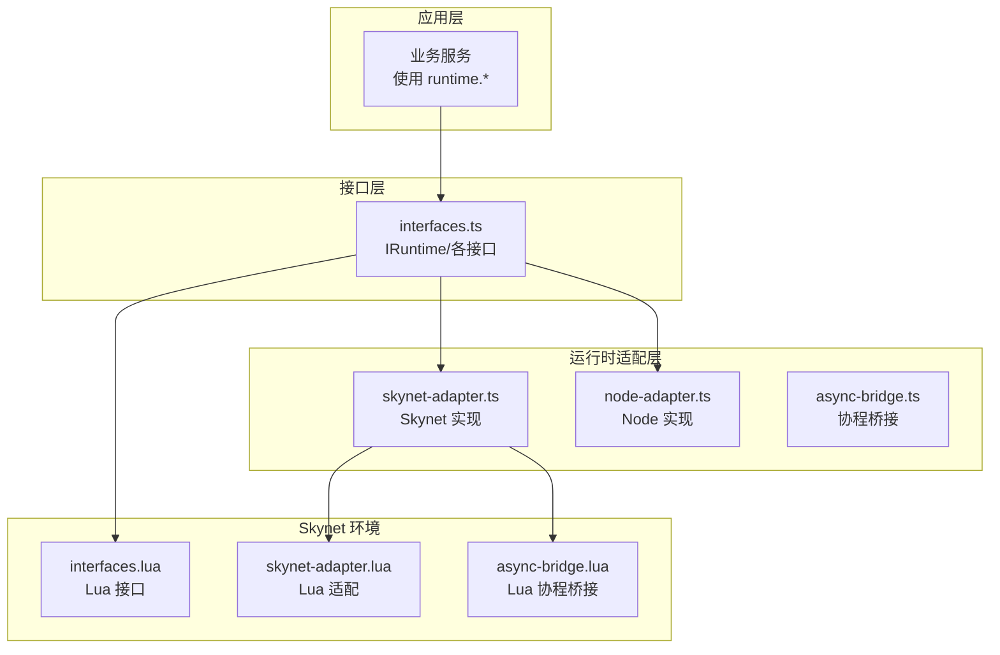
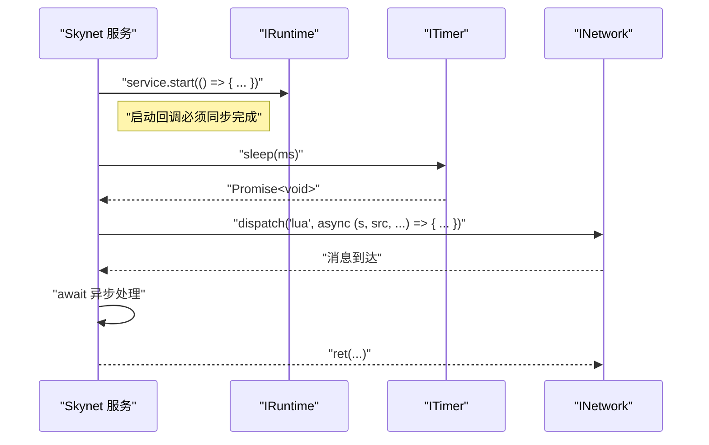
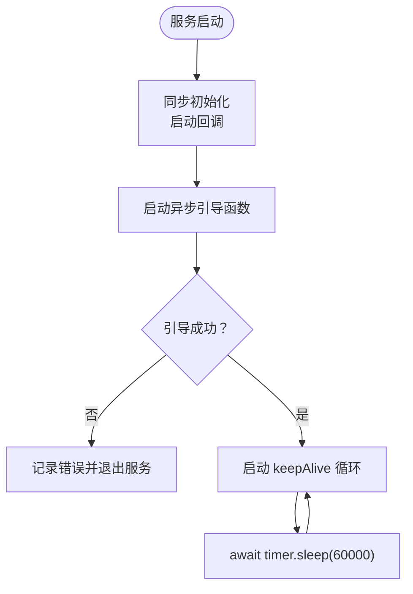
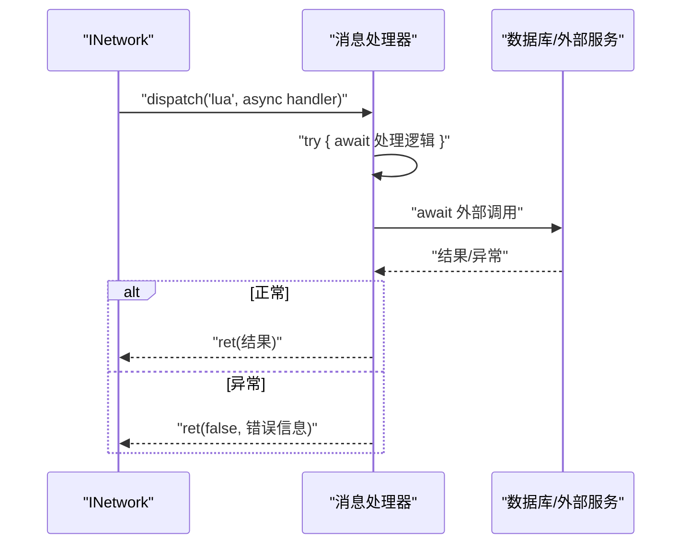
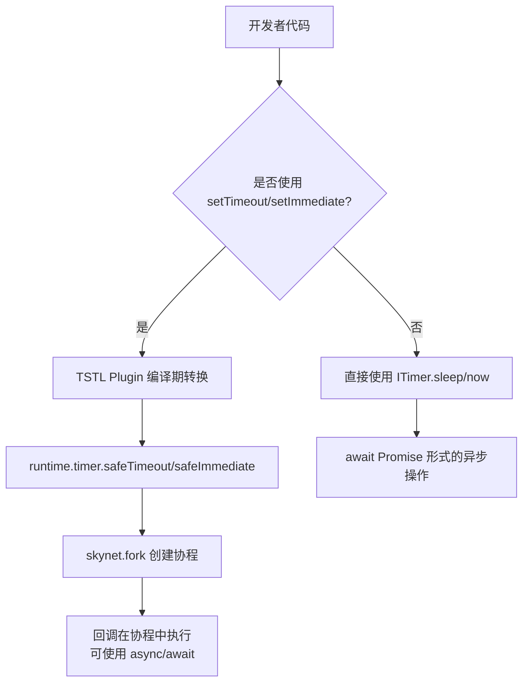
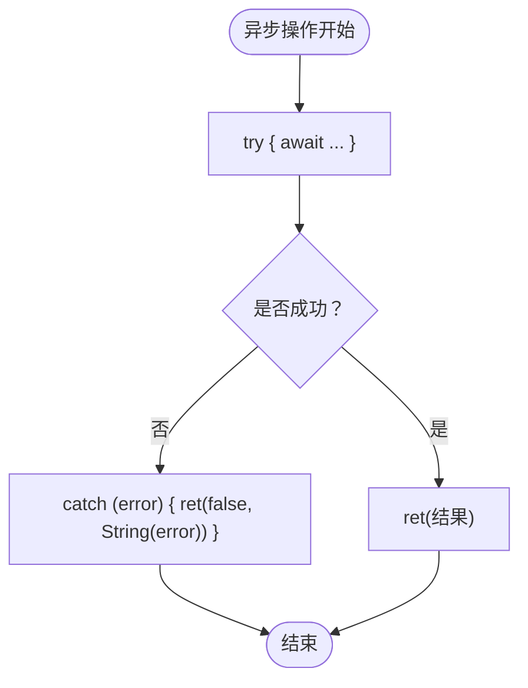
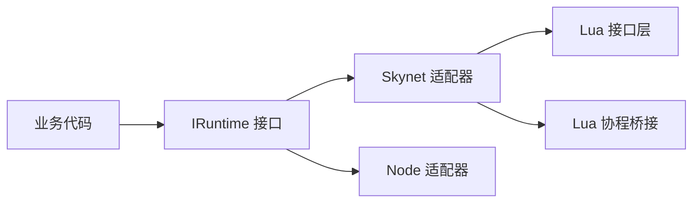

# 异步编程规范

<cite>
**本文引用的文件**
- [TS-Skynet 异步编程规范.md](file://docs/TS-Skynet 异步编程规范.md)
- [interfaces.ts](file://server/src/framework/core/interfaces.ts)
- [bootstrap-skynet.ts](file://server/src/app/bootstrap-skynet.ts)
- [async-bridge.ts](file://server/src/framework/runtime/async-bridge.ts)
- [skynet-adapter.ts](file://server/src/framework/runtime/skynet-adapter.ts)
- [node-adapter.ts](file://server/src/framework/runtime/node-adapter.ts)
- [async-bridge.lua](file://docker/lua/framework/runtime/async-bridge.lua)
- [skynet-adapter.lua](file://docker/lua/framework/runtime/skynet-adapter.lua)
- [interfaces.lua](file://docker/lua/framework/core/interfaces.lua)
</cite>

## 目录
1. [简介](#简介)
2. [项目结构](#项目结构)
3. [核心组件](#核心组件)
4. [架构总览](#架构总览)
5. [详细组件分析](#详细组件分析)
6. [依赖关系分析](#依赖关系分析)
7. [性能考量](#性能考量)
8. [故障排查指南](#故障排查指南)
9. [结论](#结论)
10. [附录](#附录)

## 简介
本规范面向在 Skynet 环境中使用 TypeScriptToLua (TSTL) 编译运行的项目，系统阐述如何在 Skynet 的协程模型与 Lua 5.4 运行时约束下，正确使用 async/await、定时器、Promise 与协程；明确服务启动回调中的异步限制与替代方案；给出消息处理器中异步操作的最佳实践；并提供错误处理与异常传播策略及与传统 JavaScript 异步编程的差异说明。

## 项目结构
围绕异步编程的关键文件组织如下：
- 核心接口层：定义统一的运行时抽象（日志、定时器、网络、服务、PB 编解码等），业务代码仅依赖该层。
- 运行时适配层：分别针对 Skynet 与 Node.js 提供具体实现，负责桥接底层能力。
- 启动入口：在 Skynet 环境中初始化运行时并预加载服务模块。
- 文档规范：提供异步编程的规则、示例与原因分析。

图表来源
- [interfaces.ts:189-226](file://server/src/framework/core/interfaces.ts#L189-L226)
- [skynet-adapter.ts](file://server/src/framework/runtime/skynet-adapter.ts)
- [node-adapter.ts](file://server/src/framework/runtime/node-adapter.ts)
- [async-bridge.ts](file://server/src/framework/runtime/async-bridge.ts)
- [interfaces.lua](file://docker/lua/framework/core/interfaces.lua)
- [skynet-adapter.lua](file://docker/lua/framework/runtime/skynet-adapter.lua)
- [async-bridge.lua](file://docker/lua/framework/runtime/async-bridge.lua)

章节来源
- [bootstrap-skynet.ts:1-20](file://server/src/app/bootstrap-skynet.ts#L1-L20)
- [interfaces.ts:189-226](file://server/src/framework/core/interfaces.ts#L189-L226)

## 核心组件
- 运行时接口 IRuntime：统一暴露 logger、timer、network、service、database、codec 等能力，业务代码仅依赖该抽象。
- 定时器接口 ITimer：提供 sleep、safeTimeout、safeImmediate 等协程安全的定时器能力。
- 网络接口 INetwork：提供消息发送、远程调用、消息分发与响应返回。
- 服务接口 IService：提供服务启动、退出、创建、自地址查询与环境变量读写。
- Skynet 适配器：在 Lua 环境中实现上述接口，确保 async/await 在协程中正确运行。
- Node 适配器：在 Node 环境中实现上述接口，便于开发调试与测试。

章节来源
- [interfaces.ts:9-226](file://server/src/framework/core/interfaces.ts#L9-L226)

## 架构总览
Skynet 的协程模型要求：
- 服务启动回调必须同步完成，否则消息循环不会启动。
- 消息处理器在消息循环内执行，协程管理机制已就绪，可安全使用 async/await。
- 定时器与网络调用需通过 runtime 抽象层，保证在协程上下文中正确调度。

图表来源
- [interfaces.ts:108-138](file://server/src/framework/core/interfaces.ts#L108-L138)
- [interfaces.ts:19-58](file://server/src/framework/core/interfaces.ts#L19-L58)
- [interfaces.ts:63-83](file://server/src/framework/core/interfaces.ts#L63-L83)

## 详细组件分析

### 服务启动回调中的异步限制与替代方案
- 禁止：在 service.start 回调中使用 async/await，因为 Skynet 要求启动回调同步完成。
- 推荐：将异步初始化逻辑抽离为独立 async 函数，并在启动回调中以同步方式启动它，捕获错误后决定是否退出服务。
- 保活：服务启动后应维持一个无限循环的 keepAlive 协程，避免服务提前退出。

图表来源
- [TS-Skynet 异步编程规范.md:94-130](file://docs/TS-Skynet 异步编程规范.md#L94-L130)

章节来源
- [TS-Skynet 异步编程规范.md:94-130](file://docs/TS-Skynet 异步编程规范.md#L94-L130)

### 消息处理器中的异步操作最佳实践
- 允许：在 dispatch 注册的消息处理器中使用 async/await。
- 建议：使用 try/catch 包裹异步逻辑，统一通过 ret 返回结果或错误信息。
- 注意：不要在消息处理器中直接返回 Promise，应 await 后再返回。

图表来源
- [TS-Skynet 异步编程规范.md:142-166](file://docs/TS-Skynet 异步编程规范.md#L142-L166)
- [interfaces.ts:77](file://server/src/framework/core/interfaces.ts#L77)

章节来源
- [TS-Skynet 异步编程规范.md:142-166](file://docs/TS-Skynet 异步编程规范.md#L142-L166)
- [interfaces.ts:77](file://server/src/framework/core/interfaces.ts#L77)

### 定时器、Promise 与协程的正确使用
- 禁止：直接使用 Promise.then()/catch() 链式调用，这会导致回调脱离协程管理，服务退出时会崩溃。
- 推荐：使用 async/await + try/catch；或使用 ITimer.safeTimeout/safeImmediate 在协程中执行回调。
- 注意：编译期 TSTL Plugin 会将 setTimeout/setImmediate 转换为 runtime.timer.safeTimeout/safeImmediate，内部可使用 async/await。

图表来源
- [TS-Skynet 异步编程规范.md:20-91](file://docs/TS-Skynet 异步编程规范.md#L20-L91)
- [TS-Skynet 异步编程规范.md:318-352](file://docs/TS-Skynet 异步编程规范.md#L318-L352)
- [interfaces.ts:37](file://server/src/framework/core/interfaces.ts#L37)
- [interfaces.ts:50](file://server/src/framework/core/interfaces.ts#L50)

章节来源
- [TS-Skynet 异步编程规范.md:20-91](file://docs/TS-Skynet 异步编程规范.md#L20-L91)
- [TS-Skynet 异步编程规范.md:318-352](file://docs/TS-Skynet 异步编程规范.md#L318-L352)
- [interfaces.ts:37](file://server/src/framework/core/interfaces.ts#L37)
- [interfaces.ts:50](file://server/src/framework/core/interfaces.ts#L50)

### 错误处理与异常传播策略
- 在消息处理器中使用 try/catch 捕获异常，统一通过 ret 返回错误信息，避免异常冒泡导致服务不稳定。
- 在服务启动回调中，对异步引导函数使用 .catch 捕获错误，并根据情况决定是否退出服务。
- 在协程中抛出的异常由 Skynet 的协程调度器接管，确保不会破坏服务生命周期。

图表来源
- [TS-Skynet 异步编程规范.md:142-166](file://docs/TS-Skynet 异步编程规范.md#L142-L166)
- [TS-Skynet 异步编程规范.md:115-130](file://docs/TS-Skynet 异步编程规范.md#L115-L130)

章节来源
- [TS-Skynet 异步编程规范.md:142-166](file://docs/TS-Skynet 异步编程规范.md#L142-L166)
- [TS-Skynet 异步编程规范.md:115-130](file://docs/TS-Skynet 异步编程规范.md#L115-L130)

### 与传统 JavaScript 异步编程的区别与注意事项
- 不支持的全局对象：console、process、global 等在 Skynet 环境中不可用，需通过 runtime.* 或注入的 Lua 实现替代。
- Promise.then() 链式调用被禁用：回调不在协程管理下，服务退出时会崩溃。
- 定时器 API：直接使用 setTimeout/setImmediate 会被编译期转换为协程安全的 safeTimeout/safeImmediate。
- 数组索引：Lua 数组索引从 1 开始，负索引行为与 JavaScript 不同，需显式计算正索引。
- 空值判断：在 Lua 环境中 undefined/null 与 nil 行为不同，推荐使用 == null 或 != null 明确判断。
- BigInt：Lua 无原生 BigInt，TSTL 无法编译，需采用字符串或分段处理替代方案。

章节来源
- [TS-Skynet 异步编程规范.md:169-208](file://docs/TS-Skynet 异步编程规范.md#L169-L208)
- [TS-Skynet 异步编程规范.md:402-439](file://docs/TS-Skynet 异步编程规范.md#L402-L439)
- [TS-Skynet 异步编程规范.md:473-517](file://docs/TS-Skynet 异步编程规范.md#L473-L517)
- [TS-Skynet 异步编程规范.md:594-647](file://docs/TS-Skynet 异步编程规范.md#L594-L647)

## 依赖关系分析
- 应用层仅依赖接口层 IRuntime，通过 setRuntime 注入具体实现。
- Skynet 适配器在 Lua 环境中实现 ITimer/INetwork/IService 等接口，确保协程安全。
- Node 适配器用于开发与测试环境，行为与 Skynet 适配器保持一致的接口契约。
- 启动入口在 Skynet 环境中初始化运行时并预加载服务模块。

图表来源
- [interfaces.ts:189-226](file://server/src/framework/core/interfaces.ts#L189-L226)
- [skynet-adapter.ts](file://server/src/framework/runtime/skynet-adapter.ts)
- [node-adapter.ts](file://server/src/framework/runtime/node-adapter.ts)
- [interfaces.lua](file://docker/lua/framework/core/interfaces.lua)
- [async-bridge.lua](file://docker/lua/framework/runtime/async-bridge.lua)

章节来源
- [bootstrap-skynet.ts:1-20](file://server/src/app/bootstrap-skynet.ts#L1-L20)
- [interfaces.ts:189-226](file://server/src/framework/core/interfaces.ts#L189-L226)

## 性能考量
- 高频使用 safeTimeout 可能带来协程创建开销，建议在批量定时任务场景中合并或复用。
- 避免在消息处理器中进行阻塞操作，尽量使用 await 异步 IO。
- 合理使用 keepAlive 循环，避免不必要的 CPU 占用。

## 故障排查指南
- 症状："cannot resume dead coroutine"
  - 原因：使用 Promise.then() 链式调用，回调不在协程管理下。
  - 解决：改用 async/await，并确保在协程中执行。
- 症状：服务启动后立即退出
  - 原因：service.start 回调返回 Promise。
  - 解决：将异步引导逻辑抽离为独立函数，在启动回调中同步启动并捕获错误。
- 症状：消息处理异常未返回错误
  - 原因：未使用 try/catch 包裹异步逻辑。
  - 解决：在消息处理器中使用 try/catch，并通过 ret 返回错误信息。

章节来源
- [TS-Skynet 异步编程规范.md:20-91](file://docs/TS-Skynet 异步编程规范.md#L20-L91)
- [TS-Skynet 异步编程规范.md:94-130](file://docs/TS-Skynet 异步编程规范.md#L94-L130)
- [TS-Skynet 异步编程规范.md:142-166](file://docs/TS-Skynet 异步编程规范.md#L142-L166)

## 结论
在 Skynet 环境中，正确的异步编程范式是：所有异步操作使用 async/await，通过 runtime 抽象层访问系统能力，服务启动回调必须同步完成，消息处理器在协程中安全使用异步操作，错误处理统一通过 try/catch 与 ret 返回。遵循本规范可有效避免协程生命周期与异常传播问题，提升系统的稳定性与可维护性。

## 附录
- 示例与规则对照：详见文档规范中的“完整对照表”与各条规则的示例与原因分析。
- 启动入口：Skynet 环境通过 bootstrap-skynet.ts 初始化运行时并预加载服务模块。

章节来源
- [TS-Skynet 异步编程规范.md:785-800](file://docs/TS-Skynet 异步编程规范.md#L785-L800)
- [bootstrap-skynet.ts:1-20](file://server/src/app/bootstrap-skynet.ts#L1-L20)