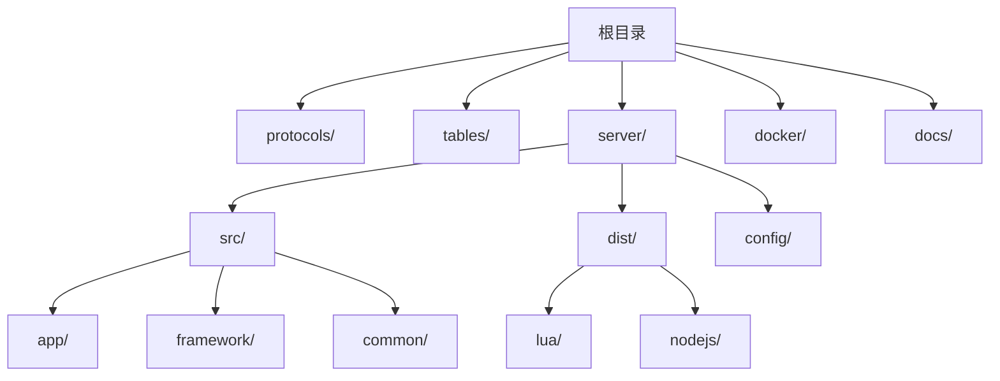
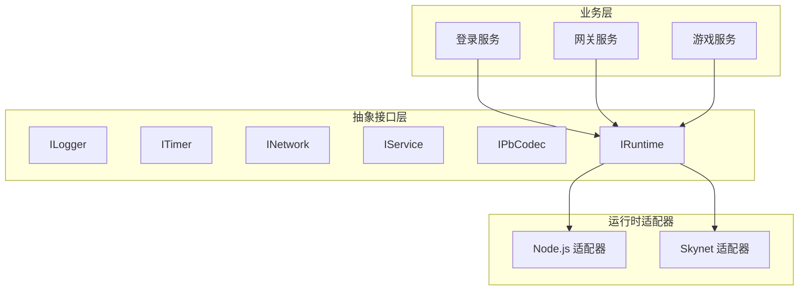
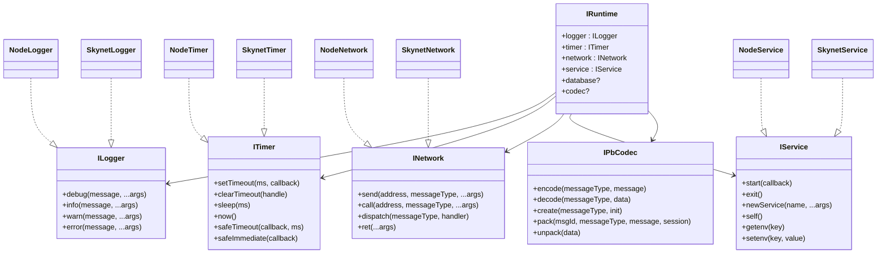
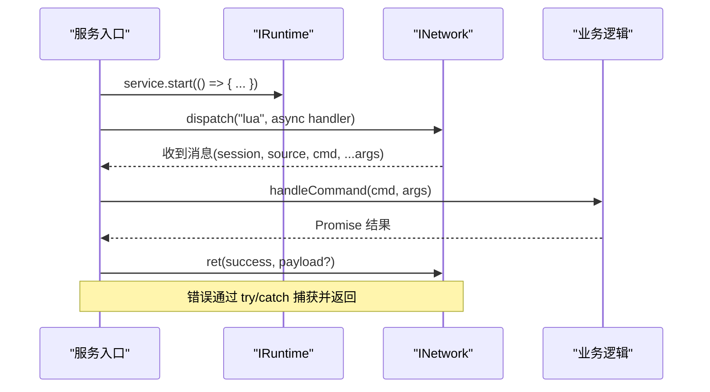
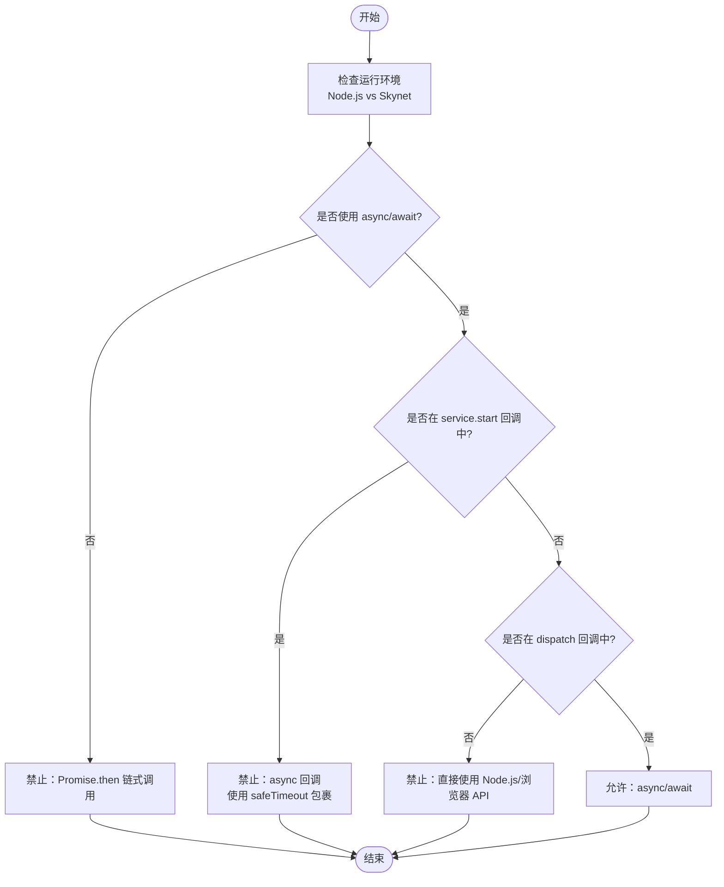
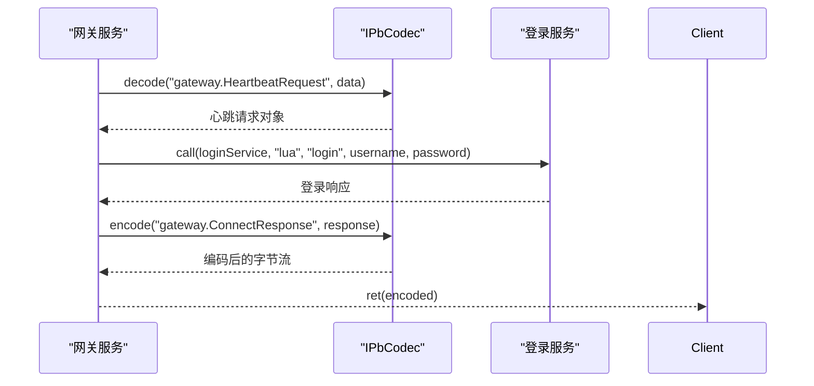
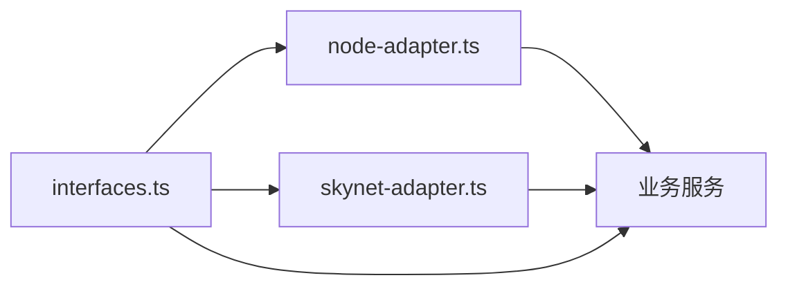

# 最佳实践

<cite>
**本文引用的文件**
- [README.md](file://README.md)
- [TS-Skynet 异步编程规范.md](file://docs/TS-Skynet 异步编程规范.md)
- [目录结构说明.md](file://docs/目录结构说明.md)
- [eslint.config.mjs](file://server/eslint.config.mjs)
- [package.json](file://server/package.json)
- [start.sh](file://server/start.sh)
- [interfaces.ts](file://server/src/framework/core/interfaces.ts)
- [skynet-adapter.ts](file://server/src/framework/runtime/skynet-adapter.ts)
- [node-adapter.ts](file://server/src/framework/runtime/node-adapter.ts)
- [main.ts](file://server/src/app/main.ts)
- [index.ts（登录服务）](file://server/src/app/services/login/index.ts)
- [index.ts（网关服务）](file://server/src/app/services/gateway/index.ts)
- [index.ts（游戏服务）](file://server/src/app/services/game/index.ts)
</cite>

## 目录
1. [简介](#简介)
2. [项目结构](#项目结构)
3. [核心组件](#核心组件)
4. [架构总览](#架构总览)
5. [详细组件分析](#详细组件分析)
6. [依赖分析](#依赖分析)
7. [性能考虑](#性能考虑)
8. [故障排查指南](#故障排查指南)
9. [结论](#结论)
10. [附录](#附录)

## 简介
本指南面向使用 TypeScript 开发并在 Skynet 上运行的混合型服务端项目，围绕代码组织、命名规范、错误处理、性能优化、异步编程规范、代码质量保证、项目结构与模块化、团队协作与版本控制、常见问题与反模式、重构案例以及持续集成与持续部署等方面，提供系统性的最佳实践建议。内容基于仓库中的文档与源码进行提炼总结，旨在帮助团队建立一致、可维护、可扩展且高性能的服务端工程体系。

## 项目结构
项目采用“协议/配置表 + 框架核心 + 业务服务 + 运行时适配”的分层组织方式，配合 TypeScriptToLua（TSTL）实现“一套代码、双环境运行”（Node.js 开发测试 + Skynet 生产部署）。关键目录与职责如下：
- protocols/：Protocol Buffers 源文件，前后端共享
- tables/：配置表定义（Excel/XML）与生成代码
- server/src/：TypeScript 源码，按 app/framework/common 分层
- server/dist/：编译输出（dist/lua 用于 Skynet；dist/nodejs 用于 Node.js）
- server/config/：TypeScript 与 TSTL 编译配置
- docker/：Skynet 框架与容器化配置
- docs/：项目文档与规范

**图表来源**
- [目录结构说明.md:1-174](file://docs/目录结构说明.md#L1-L174)

**章节来源**
- [目录结构说明.md:1-174](file://docs/目录结构说明.md#L1-L174)
- [README.md:136-193](file://README.md#L136-L193)

## 核心组件
- 抽象接口层（interfaces.ts）：定义 ILogger、ITimer、INetwork、IService、IPbCodec、IRuntime 等统一抽象，业务代码仅依赖接口，不直接耦合 Node.js 或 Skynet 实现。
- 运行时适配器：
  - Node.js 适配器（node-adapter.ts）：在 Node.js 环境下使用原生 API 实现接口，便于开发与测试。
  - Skynet 适配器（skynet-adapter.ts）：在 Skynet 环境下封装 skynet.* API，实现日志、定时器、网络、服务管理与 PB 编解码。
- 业务服务（app/services/*）：登录、网关、游戏等服务，均遵循“启动逻辑稳定 + 业务逻辑可热更”的分层模式，使用 runtime.* 统一访问系统能力。
- 启动入口（main.ts）：集中管理服务启动顺序与健康状态输出，保证 Skynet 服务启动回调同步完成。

**章节来源**
- [interfaces.ts:1-226](file://server/src/framework/core/interfaces.ts#L1-L226)
- [node-adapter.ts:1-194](file://server/src/framework/runtime/node-adapter.ts#L1-L194)
- [skynet-adapter.ts:1-221](file://server/src/framework/runtime/skynet-adapter.ts#L1-L221)
- [main.ts:1-106](file://server/src/app/main.ts#L1-L106)

## 架构总览
下图展示了“TypeScript 业务层 → 抽象接口层 → 运行时适配器（Node.js/Skynet）”的统一架构，强调跨平台一致性与隔离性。

**图表来源**
- [interfaces.ts:189-226](file://server/src/framework/core/interfaces.ts#L189-L226)
- [node-adapter.ts:177-194](file://server/src/framework/runtime/node-adapter.ts#L177-L194)
- [skynet-adapter.ts:204-221](file://server/src/framework/runtime/skynet-adapter.ts#L204-L221)

## 详细组件分析

### 组件A：抽象接口层与运行时切换
- 设计要点
  - 通过 IRuntime 将业务与具体运行时解耦，setRuntime 在不同环境注入不同实现。
  - Skynet 适配器在 dispatch 与 service.start 中分别处理协程与同步约束。
- 命名与职责
  - ILogger/ITimer/INetwork/IService/IPbCodec/IRuntime：职责单一、方法语义清晰。
- 错误处理
  - 适配器内部对 Promise 的错误进行捕获与日志记录，避免协程泄漏。
- 性能与一致性
  - Node.js 与 Skynet 的 sleep/timeout 实现差异通过接口屏蔽，保证业务逻辑一致。

**图表来源**
- [interfaces.ts:9-196](file://server/src/framework/core/interfaces.ts#L9-L196)
- [node-adapter.ts:19-194](file://server/src/framework/runtime/node-adapter.ts#L19-L194)
- [skynet-adapter.ts:28-221](file://server/src/framework/runtime/skynet-adapter.ts#L28-L221)

**章节来源**
- [interfaces.ts:1-226](file://server/src/framework/core/interfaces.ts#L1-L226)
- [skynet-adapter.ts:100-174](file://server/src/framework/runtime/skynet-adapter.ts#L100-L174)
- [node-adapter.ts:57-85](file://server/src/framework/runtime/node-adapter.ts#L57-L85)

### 组件B：服务启动与消息处理（以登录服务为例）
- 启动约束
  - service.start 回调必须同步完成；异步引导通过 setImmediate/fork 或 safeTimeout 包裹。
- 消息处理
  - dispatch 回调在消息循环内执行，可使用 async/await；错误通过 try/catch 捕获并返回。
- 保活机制
  - 使用 while(true) + sleep 的协程循环维持服务存活，避免 Skynet 服务退出。
- 协议编解码
  - 若存在 codec，则使用 protobuf 编解码；否则回退到普通返回。

**图表来源**
- [index.ts（登录服务）:124-154](file://server/src/app/services/login/index.ts#L124-L154)
- [interfaces.ts:63-83](file://server/src/framework/core/interfaces.ts#L63-L83)

**章节来源**
- [index.ts（登录服务）:124-154](file://server/src/app/services/login/index.ts#L124-L154)
- [index.ts（网关服务）:170-206](file://server/src/app/services/gateway/index.ts#L170-L206)
- [index.ts（游戏服务）:108-136](file://server/src/app/services/game/index.ts#L108-L136)

### 组件C：异步编程规范与反模式
- 必须使用 async/await，禁止 Promise.then 链式调用（否则协程生命周期不受控）。
- service.start 回调必须同步完成；若需异步，使用 safeTimeout 或 fork 包裹。
- dispatch 回调在消息循环内，可安全使用 async。
- 禁止直接使用 Node.js/浏览器 API；统一通过 runtime.* 访问。
- 动态模块加载（require 动态路径）禁止；静态导入或映射表替代。
- 避免 NaN 作为 Map/Set 键；字符串/数字/对象键均可。
- 避免 BigInt；使用字符串或分段处理大整数。
- 字符串长度使用 String.length；避免 str.length（字节 vs 字符）。
- 注意数组索引：Lua 从 1 开始，负索引行为与 JS 不同。

**图表来源**
- [TS-Skynet 异步编程规范.md:20-166](file://docs/TS-Skynet 异步编程规范.md#L20-L166)

**章节来源**
- [TS-Skynet 异步编程规范.md:11-166](file://docs/TS-Skynet 异步编程规范.md#L11-L166)

### 组件D：协议编解码与消息序列化
- 使用 IPbCodec 统一编码/解码与打包/解包，支持 protobuf 消息在服务间传输。
- 登录/网关/游戏服务在处理命令时根据是否存在 codec 决定返回格式。

**图表来源**
- [interfaces.ts:144-183](file://server/src/framework/core/interfaces.ts#L144-L183)
- [index.ts（网关服务）:138-167](file://server/src/app/services/gateway/index.ts#L138-L167)

**章节来源**
- [interfaces.ts:144-183](file://server/src/framework/core/interfaces.ts#L144-L183)
- [index.ts（网关服务）:111-133](file://server/src/app/services/gateway/index.ts#L111-L133)

## 依赖分析
- 耦合与内聚
  - 业务服务仅依赖 IRuntime 接口，内聚度高、耦合度低。
  - 适配器实现与业务逻辑隔离，便于替换与测试。
- 外部依赖
  - TSTL：将 TypeScript 编译为 Lua，需关注其语言映射限制（如 BigInt、正则、数组索引等）。
  - Protobuf：通过 IPbCodec 统一编解码，提升跨服务通信一致性。
- 潜在循环依赖
  - 通过接口与工厂函数（createNodeRuntime/createSkynetRuntime）避免直接 import 导致的循环。

**图表来源**
- [interfaces.ts:189-226](file://server/src/framework/core/interfaces.ts#L189-L226)
- [node-adapter.ts:177-194](file://server/src/framework/runtime/node-adapter.ts#L177-L194)
- [skynet-adapter.ts:204-221](file://server/src/framework/runtime/skynet-adapter.ts#L204-L221)

**章节来源**
- [interfaces.ts:189-226](file://server/src/framework/core/interfaces.ts#L189-L226)
- [node-adapter.ts:177-194](file://server/src/framework/runtime/node-adapter.ts#L177-L194)
- [skynet-adapter.ts:204-221](file://server/src/framework/runtime/skynet-adapter.ts#L204-L221)

## 性能考虑
- 协程与事件循环
  - Skynet 服务必须至少维持一个活跃协程（如 keepAlive），避免服务退出。
  - 使用 runtime.timer.safeTimeout 包裹高频定时任务，避免频繁 fork 带来的开销。
- 网络与序列化
  - 优先使用 IPbCodec 进行消息编解码，减少序列化成本与跨语言差异。
  - dispatch 回调内部的异步调用应尽量批量处理，降低上下文切换。
- 数据结构
  - Map/Set 键使用字符串/数字/对象（引用比较），避免 NaN 作为键导致不可预期行为。
  - 数组访问使用正索引，避免负索引带来的 Lua 行为差异。
- 编译与运行
  - Node.js 环境下使用 TSTL 的 safeTimeout 替代 setTimeout/setImmediate，减少协程泄漏风险。

**章节来源**
- [skynet-adapter.ts:96-122](file://server/src/framework/runtime/skynet-adapter.ts#L96-L122)
- [TS-Skynet 异步编程规范.md:318-344](file://docs/TS-Skynet 异步编程规范.md#L318-L344)

## 故障排查指南
- 启动失败
  - 确认 service.start 回调同步完成；异步初始化通过 safeTimeout 包裹。
  - 检查 setRuntime 是否在入口处正确设置（Node.js vs Skynet）。
- 协程崩溃或服务退出
  - 检查是否存在 Promise.then 链式调用；改为 async/await。
  - 确保至少有一个 keepAlive 协程在运行。
- 日志与错误
  - 适配器内部对 Promise 错误进行捕获与日志记录；查看对应错误信息定位问题。
- 网络调用无响应
  - 确认 dispatch 回调内部使用 async/await；检查 codec 是否可用。
- Node.js 与 Skynet 行为差异
  - 使用 runtime.* 接口屏蔽差异；避免直接使用 Node.js/浏览器 API。

**章节来源**
- [skynet-adapter.ts:100-174](file://server/src/framework/runtime/skynet-adapter.ts#L100-L174)
- [node-adapter.ts:57-85](file://server/src/framework/runtime/node-adapter.ts#L57-L85)
- [TS-Skynet 异步编程规范.md:20-166](file://docs/TS-Skynet 异步编程规范.md#L20-L166)

## 结论
本项目通过“抽象接口层 + 运行时适配器”的架构，实现了 TypeScript 在 Node.js 与 Skynet 之间的无缝迁移。结合严格的异步编程规范、统一的错误处理策略、清晰的项目结构与模块化设计，能够有效提升代码质量、可维护性与性能表现。建议团队在日常开发中持续遵循本文最佳实践，并通过 ESLint 规则与自动化脚本保障规范落地。

## 附录

### A. 异步编程规范清单
- 必须使用 async/await；禁止 Promise.then
- service.start 回调必须同步；异步通过 safeTimeout 包裹
- dispatch 回调可使用 async/await
- 禁止直接使用 Node.js/浏览器 API
- 禁止动态模块加载（require 动态路径）
- 避免 NaN 作为 Map/Set 键
- 避免 BigInt；使用字符串或分段处理
- 字符串长度使用 String.length；避免 str.length
- 数组索引使用正索引，避免负索引

**章节来源**
- [TS-Skynet 异步编程规范.md:20-800](file://docs/TS-Skynet 异步编程规范.md#L20-L800)

### B. 代码质量保证
- ESLint 规则
  - 禁止在 service.start 中使用 async
  - 禁止使用 Promise.then
  - 禁止动态 require
  - 禁止 BigInt
  - 禁止字符串长度直接使用 str.length
  - 禁止 NaN 作为 Map 键
  - 警告：条件 require、高级正则、严格空值比较、隐式空值判断、浮点数直接比较
- 建议
  - 引入单元测试与集成测试（当前开发路线图包含单元测试框架集成）
  - 使用 ESLint 自动修复（lint:fix）

**章节来源**
- [eslint.config.mjs:19-31](file://server/eslint.config.mjs#L19-L31)

### C. 项目结构与模块化最佳实践
- 目录分离：协议源文件与生成文件分离；配置表定义与生成代码分离
- 业务分层：app/services/* 保持“启动逻辑稳定 + 业务逻辑可热更”
- 接口驱动：业务仅依赖 IRuntime 接口，避免环境耦合
- 配置集中：TypeScript 与 TSTL 编译配置分离，便于差异化管理

**章节来源**
- [目录结构说明.md:1-174](file://docs/目录结构说明.md#L1-L174)

### D. 团队协作与版本控制建议
- 统一规范：强制执行 ESLint 规则，CI 中开启 lint 检查
- 提交规范：建议引入 Commitizen 或约定式提交
- 分支策略：采用 Git Flow 或 GitHub Flow，主干保持稳定
- 代码审查：PR 必须通过 CI 与至少一名 reviewer 通过

**章节来源**
- [eslint.config.mjs:19-31](file://server/eslint.config.mjs#L19-L31)
- [package.json:6-26](file://server/package.json#L6-L26)

### E. 常见问题与反模式
- 反模式
  - 在 service.start 中使用 async
  - 使用 Promise.then 链式调用
  - 直接使用 Node.js/浏览器 API
  - 动态模块加载
  - 使用 NaN 作为 Map 键
  - 使用 BigInt
  - 使用 str.length 获取字符数
  - 使用负索引访问数组
- 识别与规避
  - 通过 ESLint 规则自动检测
  - 在 CI 中强制执行
  - 代码审查重点关注

**章节来源**
- [TS-Skynet 异步编程规范.md:20-800](file://docs/TS-Skynet 异步编程规范.md#L20-L800)
- [eslint.config.mjs:19-31](file://server/eslint.config.mjs#L19-L31)

### F. 实际示例与重构案例
- 示例
  - 登录服务：命令分发、会话清理、保活协程
  - 网关服务：心跳处理、服务间转发、protobuf 编解码
  - 游戏服务：玩家信息查询、状态更新、保活协程
- 重构建议
  - 将公共逻辑抽取为通用模块（如定时器、日志、网络包装）
  - 使用工厂/映射表替代动态 require
  - 统一封装错误处理与返回格式

**章节来源**
- [index.ts（登录服务）:106-154](file://server/src/app/services/login/index.ts#L106-L154)
- [index.ts（网关服务）:108-206](file://server/src/app/services/gateway/index.ts#L108-L206)
- [index.ts（游戏服务）:108-136](file://server/src/app/services/game/index.ts#L108-L136)

### G. 持续集成与持续部署建议
- CI/CD
  - 构建：编译 TypeScript → Lua 与 Node.js 输出
  - 测试：在 Node.js 环境运行单元/集成测试
  - 部署：Docker 镜像构建与 Skynet 服务启动
- 建议
  - 在 CI 中执行 ESLint、构建与测试
  - 使用 Docker Compose 管理多服务部署
  - 支持热更新（hotfix）流程自动化

**章节来源**
- [README.md:197-277](file://README.md#L197-L277)
- [start.sh:1-66](file://server/start.sh#L1-L66)