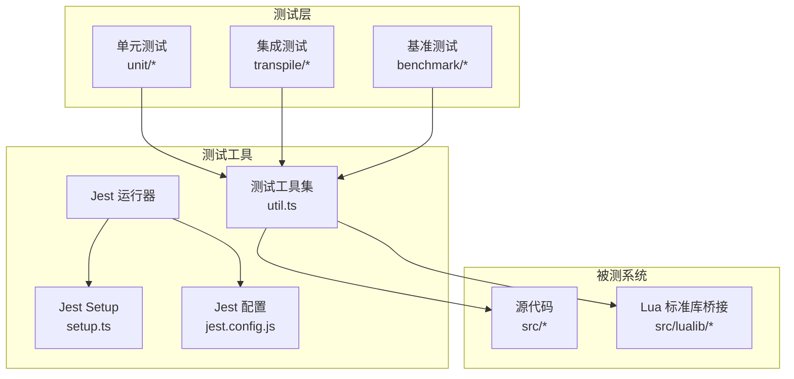
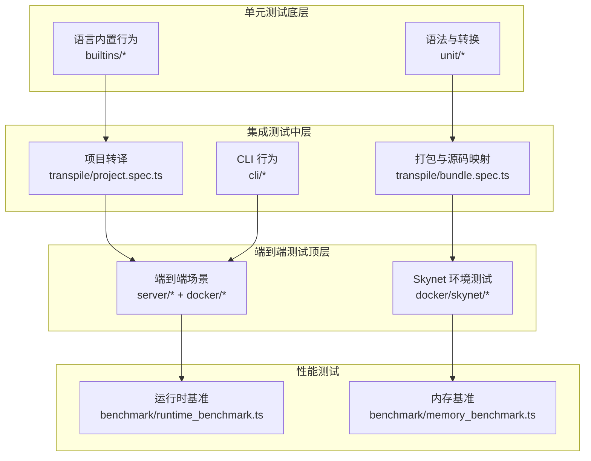
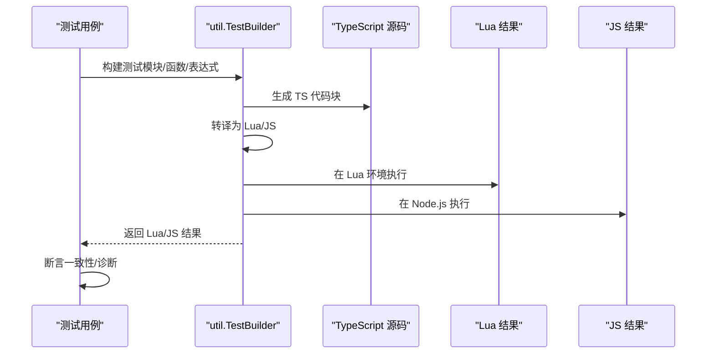
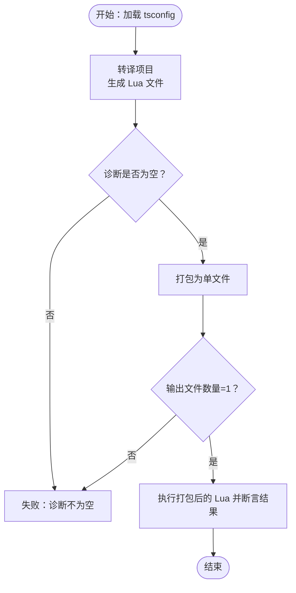
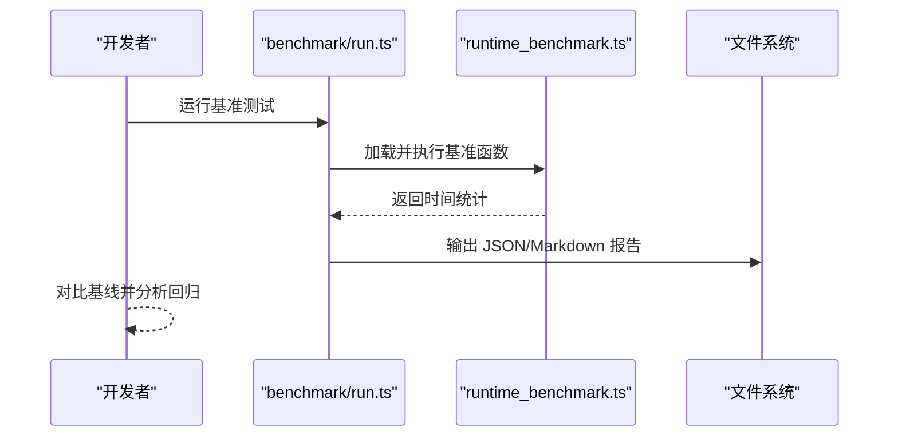
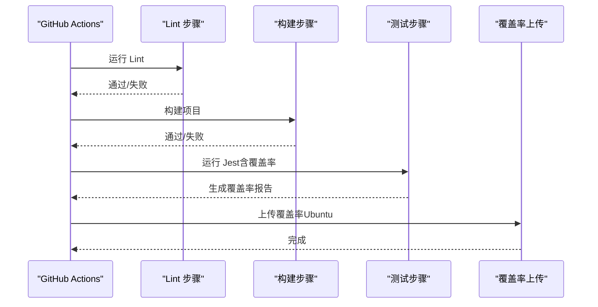
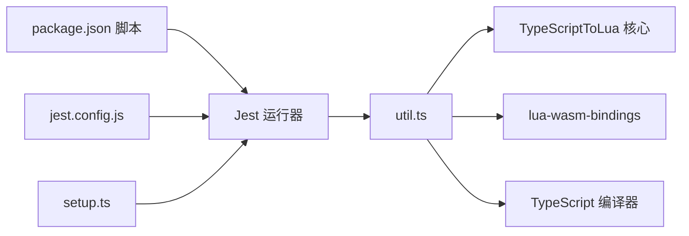

# 测试策略

<cite>
**本文引用的文件**
- [package.json](file://tool/TypeScriptToLua_skynet/package.json)
- [jest.config.js](file://tool/TypeScriptToLua_skynet/jest.config.js)
- [setup.ts](file://tool/TypeScriptToLua_skynet/test/setup.ts)
- [tsconfig.json](file://tool/TypeScriptToLua_skynet/test/tsconfig.json)
- [util.ts](file://tool/TypeScriptToLua_skynet/test/util.ts)
- [array.spec.ts](file://tool/TypeScriptToLua_skynet/test/unit/builtins/array.spec.ts)
- [bundle.spec.ts](file://tool/TypeScriptToLua_skynet/test/transpile/bundle.spec.ts)
- [run.ts](file://tool/TypeScriptToLua_skynet/benchmark/src/run.ts)
- [runtime_benchmark.ts](file://tool/TypeScriptToLua_skynet/benchmark/src/runtime_benchmark.ts)
- [ci.yml](file://tool/TypeScriptToLua_skynet/.github/workflows/ci.yml)
- [eslint.config.mjs](file://tool/TypeScriptToLua_skynet/eslint.config.mjs)
</cite>

## 目录
1. [引言](#引言)
2. [项目结构](#项目结构)
3. [核心组件](#核心组件)
4. [架构总览](#架构总览)
5. [详细组件分析](#详细组件分析)
6. [依赖关系分析](#依赖关系分析)
7. [性能考虑](#性能考虑)
8. [故障排除指南](#故障排除指南)
9. [结论](#结论)
10. [附录](#附录)

## 引言
本测试策略文档面向 TypeScriptToLua（TSTL）项目，聚焦于在 TypeScriptToLua 环境中构建高质量的测试体系，覆盖单元测试、集成测试与端到端测试，并针对 Node.js 环境与 Skynet 环境提供可操作的测试方法。文档同时给出测试用例设计原则、Mock/Stub 使用建议、性能与压力测试策略、覆盖率要求与检查方法，以及在持续集成中的自动化流程。

## 项目结构
TSTL 的测试基础设施主要位于 tool/TypeScriptToLua_skynet 目录下，采用 Jest 作为测试运行器，结合自定义的测试工具集（util.ts）实现对 TypeScript 到 Lua 的转译与执行对比验证。测试分为三类：
- 单元测试：验证语言内置行为、语义转换与诊断输出（如 array.spec.ts）。
- 集成测试：验证项目级转译、打包与源码映射（如 bundle.spec.ts）。
- 基准测试：评估运行时与内存性能（benchmark 子目录）。

图表来源
- [jest.config.js:1-28](file://tool/TypeScriptToLua_skynet/jest.config.js#L1-L28)
- [setup.ts:1-49](file://tool/TypeScriptToLua_skynet/test/setup.ts#L1-L49)
- [util.ts:1-684](file://tool/TypeScriptToLua_skynet/test/util.ts#L1-L684)

章节来源
- [jest.config.js:1-28](file://tool/TypeScriptToLua_skynet/jest.config.js#L1-L28)
- [setup.ts:1-49](file://tool/TypeScriptToLua_skynet/test/setup.ts#L1-L49)
- [tsconfig.json:1-19](file://tool/TypeScriptToLua_skynet/test/tsconfig.json#L1-L19)

## 核心组件
- Jest 配置与运行环境
  - 测试匹配规则、覆盖率收集范围、预设与转换器、测试环境等均在 jest.config.js 中集中配置。
  - setup.ts 扩展了自定义断言 toHaveDiagnostics，用于诊断校验。
- 测试工具集 util.ts
  - 提供多种测试构建器（模块、函数、表达式、打包、项目）以生成 Lua/JS 双侧代码与结果，支持跨版本 Lua 目标（Lua50/Lua51/Lua52/Lua53/Lua54/LuaJIT/Luau 等）执行对比。
  - 封装了 Lua 与 Node.js 执行环境，统一断言接口（expectToMatchJsResult、expectToEqual、expectToHaveDiagnostics 等）。
- 覆盖率与 CI
  - package.json 中定义了 pretest、test、lint 等脚本；CI 工作流在 GitHub Actions 中执行 lint 与测试，并在 Ubuntu 上上传覆盖率报告。

章节来源
- [jest.config.js:1-28](file://tool/TypeScriptToLua_skynet/jest.config.js#L1-L28)
- [setup.ts:1-49](file://tool/TypeScriptToLua_skynet/test/setup.ts#L1-L49)
- [util.ts:1-684](file://tool/TypeScriptToLua_skynet/test/util.ts#L1-L684)
- [package.json:25-36](file://tool/TypeScriptToLua_skynet/package.json#L25-L36)
- [ci.yml:1-45](file://tool/TypeScriptToLua_skynet/.github/workflows/ci.yml#L1-L45)

## 架构总览
下图展示了测试金字塔在 TSTL 中的落地方式：底层是单元测试（语言特性与内置行为），中间是集成测试（项目转译、打包、源码映射），顶层是基准测试（性能回归）。

图表来源
- [array.spec.ts:1-930](file://tool/TypeScriptToLua_skynet/test/unit/builtins/array.spec.ts#L1-L930)
- [bundle.spec.ts:1-133](file://tool/TypeScriptToLua_skynet/test/transpile/bundle.spec.ts#L1-L133)
- [run.ts:1-106](file://tool/TypeScriptToLua_skynet/benchmark/src/run.ts#L1-L106)
- [runtime_benchmark.ts:1-44](file://tool/TypeScriptToLua_skynet/benchmark/src/runtime_benchmark.ts#L1-L44)

## 详细组件分析

### 单元测试：语言内置与转换行为
- 设计目标
  - 验证数组、字符串、对象、Promise、异步等语言特性的转译一致性与边界条件。
  - 对比 Lua 执行结果与 Node.js 编译结果，确保行为一致。
- 关键实践
  - 使用 testModule/testFunction/testExpression 构造测试用例，通过 expectToMatchJsResult 断言结果一致性。
  - 使用 expectToHaveDiagnostics/expectToHaveNoDiagnostics 校验编译诊断。
  - 使用 testEachVersion/expectEachVersionExceptJit 覆盖多 Lua 版本差异。
- 示例路径
  - 数组行为与边界：[array.spec.ts:1-930](file://tool/TypeScriptToLua_skynet/test/unit/builtins/array.spec.ts#L1-L930)

图表来源
- [util.ts:398-408](file://tool/TypeScriptToLua_skynet/test/util.ts#L398-L408)
- [array.spec.ts:1-930](file://tool/TypeScriptToLua_skynet/test/unit/builtins/array.spec.ts#L1-L930)

章节来源
- [array.spec.ts:1-930](file://tool/TypeScriptToLua_skynet/test/unit/builtins/array.spec.ts#L1-L930)
- [util.ts:1-684](file://tool/TypeScriptToLua_skynet/test/util.ts#L1-L684)

### 集成测试：项目转译与打包
- 设计目标
  - 验证多文件项目转译、打包输出、源码映射与执行正确性。
- 关键实践
  - 使用 testProject 加载 tsconfig.json，执行完整项目转译。
  - 校验打包后仅有一个输出文件、导出行为符合预期。
  - 校验源码映射正确性与 SourceMapTraceback 处理。
- 示例路径
  - 打包与源码映射：[bundle.spec.ts:1-133](file://tool/TypeScriptToLua_skynet/test/transpile/bundle.spec.ts#L1-L133)

图表来源
- [bundle.spec.ts:7-37](file://tool/TypeScriptToLua_skynet/test/transpile/bundle.spec.ts#L7-L37)

章节来源
- [bundle.spec.ts:1-133](file://tool/TypeScriptToLua_skynet/test/transpile/bundle.spec.ts#L1-L133)
- [util.ts:641-655](file://tool/TypeScriptToLua_skynet/test/util.ts#L641-L655)

### 端到端测试：Node.js 与 Skynet 环境
- Node.js 环境测试
  - 通过 util.ts 的 Lua 执行器与 Node.js VM 执行器对比结果，验证转译正确性。
  - 支持多 Lua 目标版本，便于发现版本差异导致的行为偏差。
- Skynet 环境测试
  - 利用 docker/skynet 目录下的服务与配置，部署 Skynet 实例，运行游戏/网关/登录等服务模块，验证消息协议、异步桥接与运行时行为。
  - 建议在 CI 中以容器化方式拉起 Skynet，执行端到端场景（登录、网关转发、游戏逻辑）。
- Mock 与 Stub
  - 在 Node.js 环境中，可通过注入额外 Lua 文件或修改 require 缓存模拟外部依赖。
  - 在 Skynet 环境中，可利用服务间消息契约进行行为替换与隔离。

章节来源
- [util.ts:444-521](file://tool/TypeScriptToLua_skynet/test/util.ts#L444-L521)
- [util.ts:523-593](file://tool/TypeScriptToLua_skynet/test/util.ts#L523-L593)

### 性能与压力测试策略
- 运行时性能
  - 使用 benchmark/src/runtime_benchmark.ts 定义基准函数，统计执行时间并比较基线。
  - 通过 benchmark/src/run.ts 统一运行与输出比较报告。
- 内存性能
  - 参考内存基准框架（同 benchmark 目录下），在相同输入条件下测量内存占用变化。
- 压力测试
  - 构造大规模数据处理、高并发消息场景，观察 LuaJIT/Lua54 等不同目标下的吞吐与延迟。
  - 建议在 CI 中定期运行基准测试，记录趋势并触发回归告警。

图表来源
- [run.ts:20-44](file://tool/TypeScriptToLua_skynet/benchmark/src/run.ts#L20-L44)
- [runtime_benchmark.ts:5-22](file://tool/TypeScriptToLua_skynet/benchmark/src/runtime_benchmark.ts#L5-L22)

章节来源
- [run.ts:1-106](file://tool/TypeScriptToLua_skynet/benchmark/src/run.ts#L1-L106)
- [runtime_benchmark.ts:1-44](file://tool/TypeScriptToLua_skynet/benchmark/src/runtime_benchmark.ts#L1-L44)

### 测试用例设计原则与编写规范
- 原则
  - 单一职责：每个测试聚焦一个功能点或边界条件。
  - 可重复性：使用固定输入与期望输出，避免随机性。
  - 可读性：命名清晰、注释充分，必要时添加测试描述。
  - 全面性：覆盖正常路径、异常路径与边界值。
- 规范
  - 使用 testModule/testFunction/testExpression 构造最小可验证单元。
  - 使用 expectToMatchJsResult 对比 Lua 与 JS 结果，确保行为一致。
  - 使用 expectToHaveDiagnostics 校验编译诊断，避免静默错误。
  - 使用 testEachVersion/expectEachVersionExceptJit 覆盖多 Lua 版本。
- Lint 规则
  - 项目使用 typescript-eslint 与 eslint-plugin-jest，遵循严格规则（如 no-restricted-globals、no-restricted-syntax 等）。

章节来源
- [eslint.config.mjs:1-45](file://tool/TypeScriptToLua_skynet/eslint.config.mjs#L1-L45)
- [util.ts:398-408](file://tool/TypeScriptToLua_skynet/test/util.ts#L398-L408)

### Mock 与 Stub 的使用方法
- 在 Lua 环境中
  - 通过 injectLuaFile 将模拟模块注入到 Lua 的 package.preload 或 _LOADED 中，实现对 require 的替换。
- 在 Node.js 环境中
  - 通过自定义 require 实现（见 util.ts 中的 VM 执行器），拦截模块解析，返回模拟导出。
- 最佳实践
  - 优先使用最小化替身，避免过度耦合。
  - 明确作用域与生命周期，及时清理。

章节来源
- [util.ts:501-521](file://tool/TypeScriptToLua_skynet/test/util.ts#L501-L521)
- [util.ts:523-593](file://tool/TypeScriptToLua_skynet/test/util.ts#L523-L593)

### 测试覆盖率要求与检查方法
- 覆盖率收集
  - Jest 配置中已指定收集范围与忽略项，确保核心源码被覆盖，Lua 标准库桥接不计入。
- 要求
  - 建议核心模块行覆盖率不低于 80%，分支与函数覆盖率不低于 70%。
  - 对关键路径（诊断、转换器、打包器）应达到更高覆盖率。
- 检查方法
  - 在本地运行 npm test 后查看覆盖率报告。
  - 在 CI 中启用覆盖率上传（Ubuntu 作业已配置 codecov）。

章节来源
- [jest.config.js:6-11](file://tool/TypeScriptToLua_skynet/jest.config.js#L6-L11)
- [ci.yml:41-45](file://tool/TypeScriptToLua_skynet/.github/workflows/ci.yml#L41-L45)

### 持续集成中的测试自动化流程
- 流程概览
  - 拉取代码 → 安装依赖 → 构建 → Lint → 运行测试（含覆盖率）→ 上传覆盖率（Ubuntu）。
- 关键步骤
  - 使用 GitHub Actions 的 matrix 策略在 Ubuntu 与 Windows 上并行测试。
  - 在 CI 环境中，Jest 的诊断模式切换为警告模式，避免阻塞流水线。
- 建议
  - 将基准测试纳入定时任务，定期生成报告并与基线对比。
  - 对 Skynet 端到端测试可按需触发（如 PR 合并前）。

图表来源
- [ci.yml:1-45](file://tool/TypeScriptToLua_skynet/.github/workflows/ci.yml#L1-L45)

章节来源
- [ci.yml:1-45](file://tool/TypeScriptToLua_skynet/.github/workflows/ci.yml#L1-L45)
- [jest.config.js:1-27](file://tool/TypeScriptToLua_skynet/jest.config.js#L1-L27)

## 依赖关系分析
- 测试运行器与工具
  - Jest 作为核心运行器，配合 ts-jest、jest-circus 与自定义 setup。
  - util.ts 依赖 lua-wasm-bindings、TypeScript 编译器与 TSTL 转译器。
- 配置与脚本
  - package.json 中的 pretest、test、lint 脚本串联开发与测试流程。
  - jest.config.js 控制测试匹配、环境与转换器。

图表来源
- [package.json:25-36](file://tool/TypeScriptToLua_skynet/package.json#L25-L36)
- [jest.config.js:1-27](file://tool/TypeScriptToLua_skynet/jest.config.js#L1-L27)
- [setup.ts:1-49](file://tool/TypeScriptToLua_skynet/test/setup.ts#L1-L49)
- [util.ts:1-18](file://tool/TypeScriptToLua_skynet/test/util.ts#L1-L18)

章节来源
- [package.json:25-36](file://tool/TypeScriptToLua_skynet/package.json#L25-L36)
- [jest.config.js:1-27](file://tool/TypeScriptToLua_skynet/jest.config.js#L1-L27)
- [setup.ts:1-49](file://tool/TypeScriptToLua_skynet/test/setup.ts#L1-L49)
- [util.ts:1-18](file://tool/TypeScriptToLua_skynet/test/util.ts#L1-L18)

## 性能考虑
- 选择合适的 Lua 目标版本
  - 不同版本在性能与兼容性上存在差异，建议在 CI 中对关键路径进行多版本对比。
- 基准测试设计
  - 控制变量：输入规模、循环次数、数据结构类型。
  - 多轮采样：减少噪声，提高稳定性。
- 压力测试
  - 模拟高并发消息、大数据量处理，观察内存与 CPU 使用情况。
  - 对比 LuaJIT 与 Lua54 的表现差异。

## 故障排除指南
- 常见问题
  - 诊断未通过：使用 expectToHaveDiagnostics 查看具体诊断代码与消息，定位问题。
  - 执行错误：使用 expectNoExecutionError 捕获 Lua 执行异常，结合 debug 输出 Lua 代码与结果。
  - 版本差异：使用 testEachVersion/expectEachVersionExceptJit 验证特定版本行为。
- 排错流程
  - 复现最小化案例 → 对比 Lua/JS 结果 → 检查诊断 → 定位版本差异 → 修复并回归。

章节来源
- [setup.ts:14-48](file://tool/TypeScriptToLua_skynet/test/setup.ts#L14-L48)
- [util.ts:359-408](file://tool/TypeScriptToLua_skynet/test/util.ts#L359-L408)

## 结论
通过单元测试、集成测试与基准测试的分层设计，结合 Node.js 与 Skynet 环境的端到端验证，TSTL 能够在多版本 Lua 目标下保持高质量与高性能。建议在日常开发中坚持“先写测试再写实现”，在 CI 中强制覆盖率与基准回归检查，持续优化测试效率与覆盖面。

## 附录
- 关键文件索引
  - 测试运行与配置：[jest.config.js:1-27](file://tool/TypeScriptToLua_skynet/jest.config.js#L1-L27)、[setup.ts:1-49](file://tool/TypeScriptToLua_skynet/test/setup.ts#L1-L49)、[tsconfig.json:1-19](file://tool/TypeScriptToLua_skynet/test/tsconfig.json#L1-L19)
  - 测试工具集：[util.ts:1-684](file://tool/TypeScriptToLua_skynet/test/util.ts#L1-L684)
  - 单元测试示例：[array.spec.ts:1-930](file://tool/TypeScriptToLua_skynet/test/unit/builtins/array.spec.ts#L1-L930)
  - 集成测试示例：[bundle.spec.ts:1-133](file://tool/TypeScriptToLua_skynet/test/transpile/bundle.spec.ts#L1-L133)
  - 基准测试入口：[run.ts:1-106](file://tool/TypeScriptToLua_skynet/benchmark/src/run.ts#L1-L106)、[runtime_benchmark.ts:1-44](file://tool/TypeScriptToLua_skynet/benchmark/src/runtime_benchmark.ts#L1-L44)
  - CI 配置：[ci.yml:1-45](file://tool/TypeScriptToLua_skynet/.github/workflows/ci.yml#L1-L45)
  - Lint 规则：[eslint.config.mjs:1-45](file://tool/TypeScriptToLua_skynet/eslint.config.mjs#L1-L45)