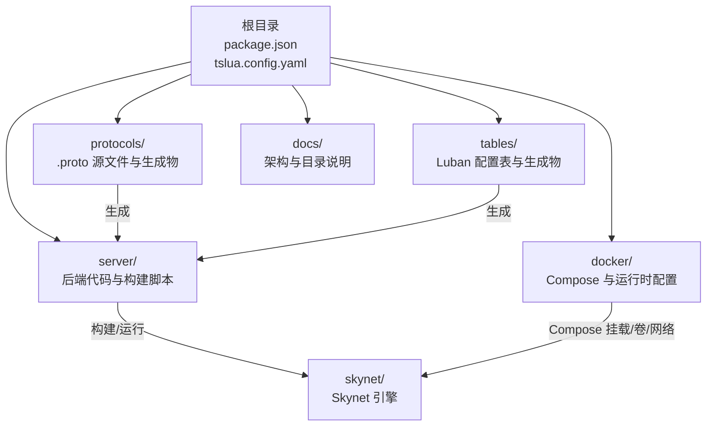
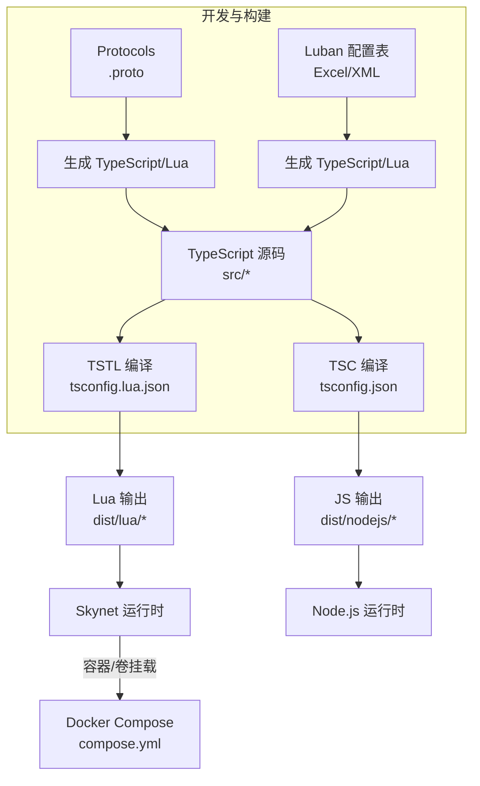
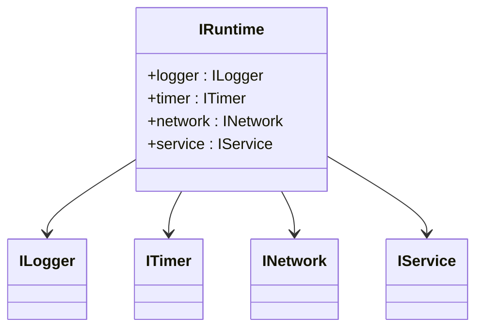
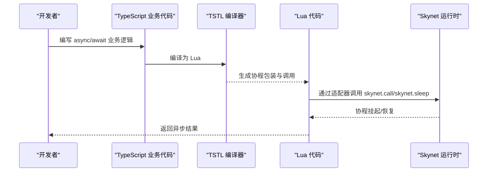
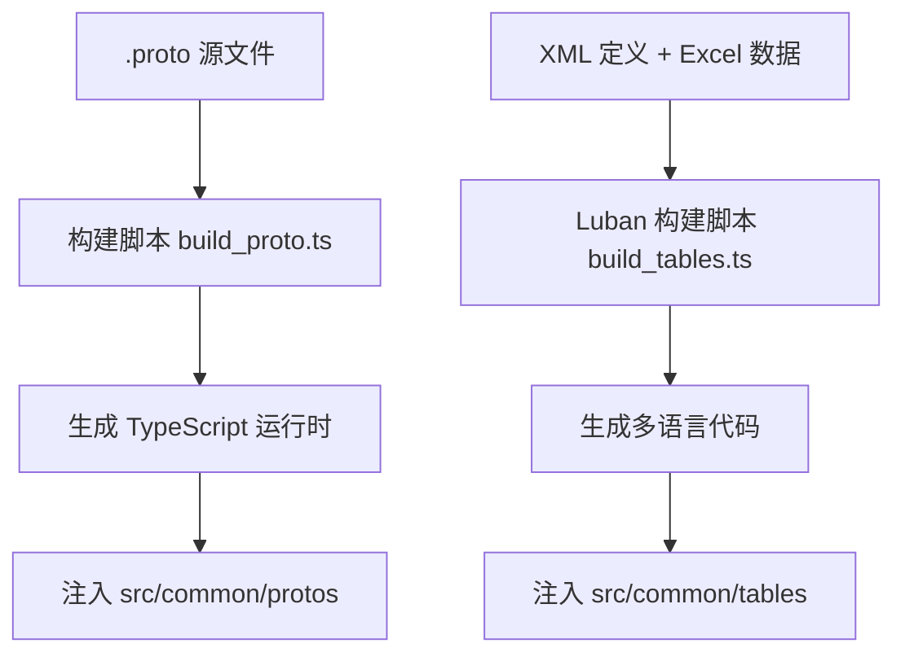
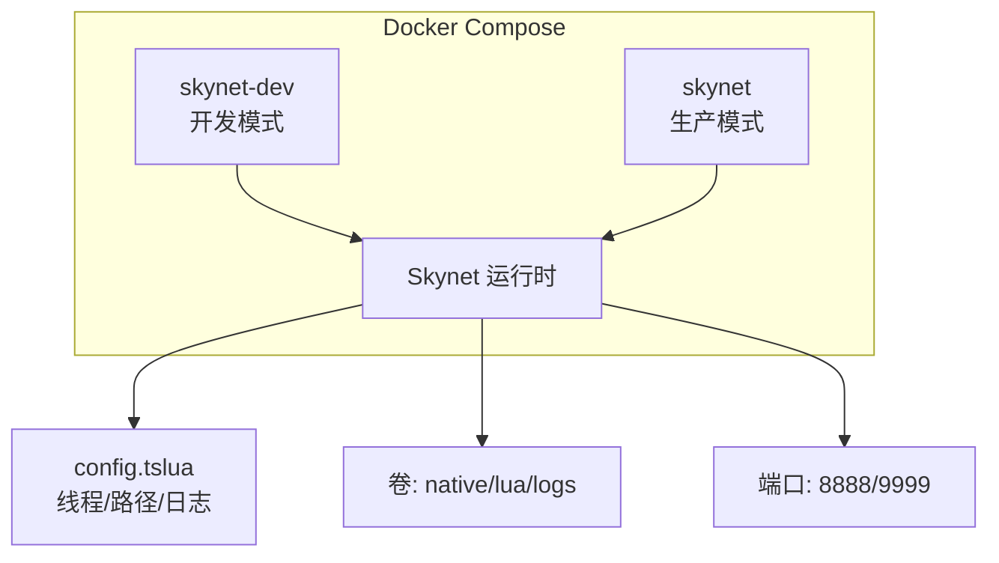
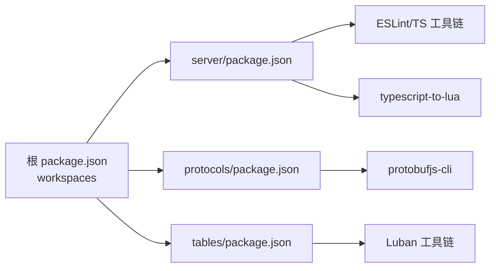

# 项目管理

<cite>
**本文引用的文件**
- [README.md](file://README.md)
- [package.json](file://package.json)
- [tslua.config.yaml](file://tslua.config.yaml)
- [docker/compose.yml](file://docker/compose.yml)
- [docker/config/skynet/config.tslua](file://docker/config/skynet/config.tslua)
- [docs/架构设计文档.md](file://docs/架构设计文档.md)
- [docs/目录结构说明.md](file://docs/目录结构说明.md)
- [server/package.json](file://server/package.json)
- [protocols/package.json](file://protocols/package.json)
- [tables/package.json](file://tables/package.json)
</cite>

## 目录
1. [引言](#引言)
2. [项目结构](#项目结构)
3. [核心组件](#核心组件)
4. [架构总览](#架构总览)
5. [详细组件分析](#详细组件分析)
6. [依赖分析](#依赖分析)
7. [性能考虑](#性能考虑)
8. [故障排查指南](#故障排查指南)
9. [结论](#结论)
10. [附录](#附录)

## 引言
本指南面向使用 TS-Skynet 混合开发框架的团队，提供从项目结构组织、模块化原则、版本控制分支策略与提交规范、代码审查流程与检查清单、依赖管理与版本升级策略、文档维护与更新规范、团队协作沟通与协调方法、发布流程与变更管理，以及项目度量与进度跟踪的系统性最佳实践。内容基于仓库现有文件与文档进行提炼与扩展，确保可落地、可追踪、可复用。

## 项目结构
本项目采用多包工作区（monorepo）组织方式，围绕“协议（protocols）—配置表（tables）—服务端（server）—容器（docker）—文档（docs）”的边界清晰的模块划分，配合统一的配置文件与构建脚本，形成“一套代码、双环境运行”的工程化体系。

**图表来源**
- [package.json:1-48](file://package.json#L1-L48)
- [tslua.config.yaml:1-52](file://tslua.config.yaml#L1-L52)
- [docker/compose.yml:1-70](file://docker/compose.yml#L1-L70)
- [docs/目录结构说明.md:1-174](file://docs/目录结构说明.md#L1-L174)

**章节来源**
- [docs/目录结构说明.md:1-174](file://docs/目录结构说明.md#L1-L174)
- [package.json:1-48](file://package.json#L1-L48)
- [tslua.config.yaml:1-52](file://tslua.config.yaml#L1-L52)

## 核心组件
- 核心接口层（抽象层）：定义 ILogger、ITimer、INetwork、IService 等跨平台接口，约束业务代码只能依赖接口而非具体实现，保证 Node.js 与 Skynet 双环境一致性。
- 运行时适配层（适配器层）：分别实现 Node.js 与 Skynet 的具体适配器，负责将抽象接口映射到真实 API，并在 Skynet 侧完成 Promise/async/await 到协程的桥接。
- 业务服务层（应用层）：按领域拆分 login/gateway/game 等服务，遵循统一的入口与生命周期管理。
- 协议与配置表：通过 protocols 与 tables 子项目独立管理，生成对应的 TypeScript/Lua 代码，供应用层按需使用。
- 构建与运行：server 提供 CLI 与脚本，根目录 package.json 统一转发命令；docker 提供容器化部署与开发/生产两种模式。

**章节来源**
- [docs/架构设计文档.md:80-178](file://docs/架构设计文档.md#L80-L178)
- [docs/架构设计文档.md:181-384](file://docs/架构设计文档.md#L181-L384)
- [docs/目录结构说明.md:13-74](file://docs/目录结构说明.md#L13-L74)

## 架构总览
下图展示从源代码到运行时的关键流转：TypeScript 源码经 TSTL 编译为 Lua，再由 Skynet 加载执行；同时可在 Node.js 环境中编译为 JS 进行开发与测试；协议与配置表分别独立构建并注入应用层。

**图表来源**
- [docs/目录结构说明.md:78-127](file://docs/目录结构说明.md#L78-L127)
- [docker/compose.yml:1-70](file://docker/compose.yml#L1-L70)

**章节来源**
- [docs/目录结构说明.md:78-127](file://docs/目录结构说明.md#L78-L127)
- [docker/compose.yml:1-70](file://docker/compose.yml#L1-L70)

## 详细组件分析

### 组件A：抽象接口层与异步桥接
- 接口设计：ILogger、ITimer、INetwork、IService 聚合为 IRuntime，业务代码仅依赖 IRuntime，避免平台耦合。
- 异步桥接：TSTL 将 async/await 转换为 Lua 协程，Skynet 适配器内部通过 skynet.call/skynet.sleep 等实现 yield/resume，从而在 Skynet 环境中保持一致的异步语义。
- 双入口：main.ts（Skynet）与 main-node.ts（Node.js），分别注入对应运行时。

**图表来源**
- [docs/架构设计文档.md:80-178](file://docs/架构设计文档.md#L80-L178)

**图表来源**
- [docs/架构设计文档.md:220-384](file://docs/架构设计文档.md#L220-L384)

**章节来源**
- [docs/架构设计文档.md:80-178](file://docs/架构设计文档.md#L80-L178)
- [docs/架构设计文档.md:181-384](file://docs/架构设计文档.md#L181-L384)

### 组件B：协议与配置表流水线
- 协议（Protobuf）：在 protocols 子项目中维护 .proto 源文件，通过独立脚本生成 TypeScript 与描述文件，供应用层使用。
- 配置表（Luban）：在 tables 子项目中维护 XML 定义与 Excel 数据，通过 Luban 工具生成多语言代码，供应用层读取。
- 产出注入：生成物被复制/放置到 server/src/common/protos 与 server/src/common/tables，供业务代码导入使用。

**图表来源**
- [docs/目录结构说明.md:80-127](file://docs/目录结构说明.md#L80-L127)
- [protocols/package.json:1-28](file://protocols/package.json#L1-L28)
- [tables/package.json:1-23](file://tables/package.json#L1-L23)

**章节来源**
- [docs/目录结构说明.md:80-127](file://docs/目录结构说明.md#L80-L127)
- [protocols/package.json:1-28](file://protocols/package.json#L1-L28)
- [tables/package.json:1-23](file://tables/package.json#L1-L23)

### 组件C：容器化与部署
- Docker Compose：提供开发（skynet-dev）与生产（skynet）两种服务形态，支持卷挂载、端口映射、日志卷等。
- Skynet 配置：config.tslua 控制线程数、启动模块、Lua 路径、日志输出等，容器内固定工作目录为 /skynet。
- 根配置：tslua.config.yaml 统一管理路径、构建输出与 Docker 服务名等，便于 CLI 与脚本复用。

**图表来源**
- [docker/compose.yml:1-70](file://docker/compose.yml#L1-L70)
- [docker/config/skynet/config.tslua:1-54](file://docker/config/skynet/config.tslua#L1-L54)
- [tslua.config.yaml:31-52](file://tslua.config.yaml#L31-L52)

**章节来源**
- [docker/compose.yml:1-70](file://docker/compose.yml#L1-L70)
- [docker/config/skynet/config.tslua:1-54](file://docker/config/skynet/config.tslua#L1-L54)
- [tslua.config.yaml:31-52](file://tslua.config.yaml#L31-L52)

## 依赖分析
- 工作区（Workspaces）：根 package.json 声明 server、protocols、tables 三个子包，统一管理脚本与依赖转发。
- 子包依赖：
  - server：包含 ESLint、ts-node、tsx、typescript、typescript-to-lua 等开发与构建依赖。
  - protocols：protobufjs-cli 用于生成。
  - tables：Luban 工具链用于生成配置表代码。
- 运行时与引擎：skynet 作为 git 子模块或外部依赖存在于 docker/skynet 目录，实际运行由容器内的 Skynet 引擎提供。

**图表来源**
- [package.json:6-10](file://package.json#L6-L10)
- [server/package.json:36-49](file://server/package.json#L36-L49)
- [protocols/package.json:18-26](file://protocols/package.json#L18-L26)
- [tables/package.json:18-22](file://tables/package.json#L18-L22)

**章节来源**
- [package.json:6-10](file://package.json#L6-L10)
- [server/package.json:36-49](file://server/package.json#L36-L49)
- [protocols/package.json:18-26](file://protocols/package.json#L18-L26)
- [tables/package.json:18-22](file://tables/package.json#L18-L22)

## 性能考虑
- 异步模型统一：通过 TSTL 与 Skynet 协程桥接，避免阻塞调用，提升并发效率。
- 构建优化：利用增量编译与 watch 模式（如 server 的 build:ts:watch），缩短迭代周期。
- 容器资源：根据 CPU 核心数调整 Skynet 线程数（config.tslua），合理分配内存与日志卷，减少 I/O 抖动。
- 生成物复用：协议与配置表生成物集中放置，避免重复构建带来的资源浪费。

[本节为通用指导，不直接分析具体文件]

## 故障排查指南
- 启动失败（Docker/Compose）
  - 检查端口占用与卷挂载路径，确认 compose.yml 中的 volumes 与 ports 配置。
  - 查看容器日志：docker-compose logs -f skynet 或 skynet-dev。
- Skynet 配置问题
  - 确认 config.tslua 的 luaservice、lua_path、logger、daemon 等参数与容器工作目录匹配。
- 构建失败（TypeScript/Lua）
  - 检查 server 的 tsconfig.lua.json 与 tsconfig.json 是否正确，TSTL 版本与工具链是否匹配。
- 协议/配置表未生效
  - 确认 protocols 与 tables 的构建脚本已执行，生成物已复制到 server/src/common/*。
- Node.js 调试
  - 使用 server 的 dev 脚本与 VS Code 调试配置，结合 SourceMap 定位问题。

**章节来源**
- [docker/compose.yml:1-70](file://docker/compose.yml#L1-L70)
- [docker/config/skynet/config.tslua:1-54](file://docker/config/skynet/config.tslua#L1-L54)
- [server/package.json:9-25](file://server/package.json#L9-L25)
- [docs/目录结构说明.md:78-127](file://docs/目录结构说明.md#L78-L127)

## 结论
本项目通过“抽象接口层 + 运行时适配层 + 业务服务层”的分层设计，结合 protocols 与 tables 的独立构建流水线，实现了“一套代码、双环境运行”。配合 Docker 容器化部署与统一的 monorepo 工作区，形成了可扩展、可维护、可协作的工程化基座。建议在后续阶段补充 CI/CD、单元测试、热更新与性能监控等能力，持续完善工程化体系。

[本节为总结性内容，不直接分析具体文件]

## 附录

### 项目管理最佳实践清单（可对照执行）
- 项目结构与模块化
  - 严格区分抽象层、适配层、应用层与工具层，避免跨层依赖。
  - 协议与配置表独立子项目，明确输入/输出边界与生成物路径。
- 版本控制与分支策略
  - 主干保护：master/main 仅允许通过 PR 合并。
  - 分支命名：feature/xxx、bugfix/xxx、chore/xxx、release/vX.Y.Z。
  - 提交规范：约定式提交（如 feat/fix/docs/chore/style/refactor/test/build/ci）。
- 代码审查流程与检查清单
  - PR 规模：单次 PR 控制在 200 行以内，聚焦单一主题。
  - 检查清单：接口契约、异常处理、日志记录、性能影响、兼容性、测试覆盖、文档更新。
  - 审查要点：抽象层是否被滥用具体实现、异步桥接是否正确、生成物是否同步更新。
- 依赖管理与版本升级
  - 使用 workspaces 统一管理子包依赖，锁定关键工具链版本（TSTL、ESLint、Protobuf、Luban）。
  - 升级策略：先在 dev 环境验证，再在 PR 中评估影响范围，最后在 release 分支合并。
- 文档维护与更新规范
  - 文档与代码同版本演进，新增/变更接口与流程需同步更新架构与目录说明。
  - 文档文件名与链接保持稳定，避免破坏性重构。
- 团队协作与沟通
  - 周会/站会同步进度与风险，使用 Issue/PR 模板标准化描述与验收条件。
  - 代码评审优先，避免“事后补救”，建立知识库沉淀常见问题与最佳实践。
- 发布流程与变更管理
  - 发布分支：release/vX.Y.Z，冻结非必要变更。
  - 变更日志：按功能/修复/改进分类记录，明确影响面与回滚策略。
  - 部署验证：先在 dev 环境全链路回归，再灰度到 prod。
- 项目度量与进度跟踪
  - 关键指标：构建成功率、测试覆盖率、平均 PR 审阅时长、平均发布周期、故障率与恢复时间。
  - 工具：Jira/Azure DevOps/GitHub Projects 等跟踪任务与里程碑，结合自动化报告。

[本节为通用指导，不直接分析具体文件]