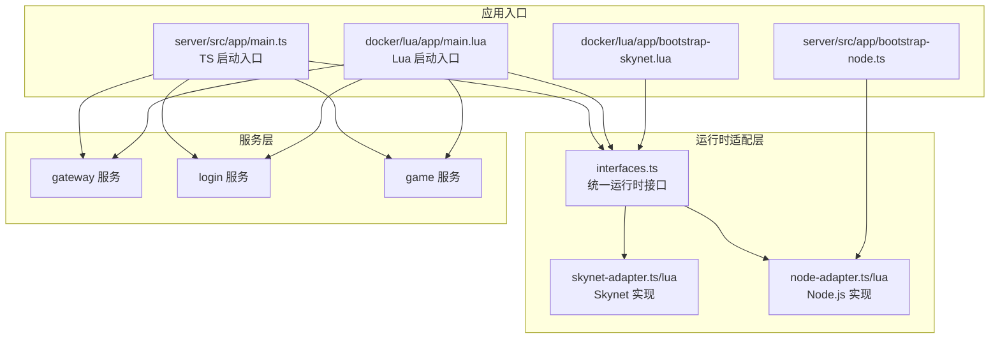
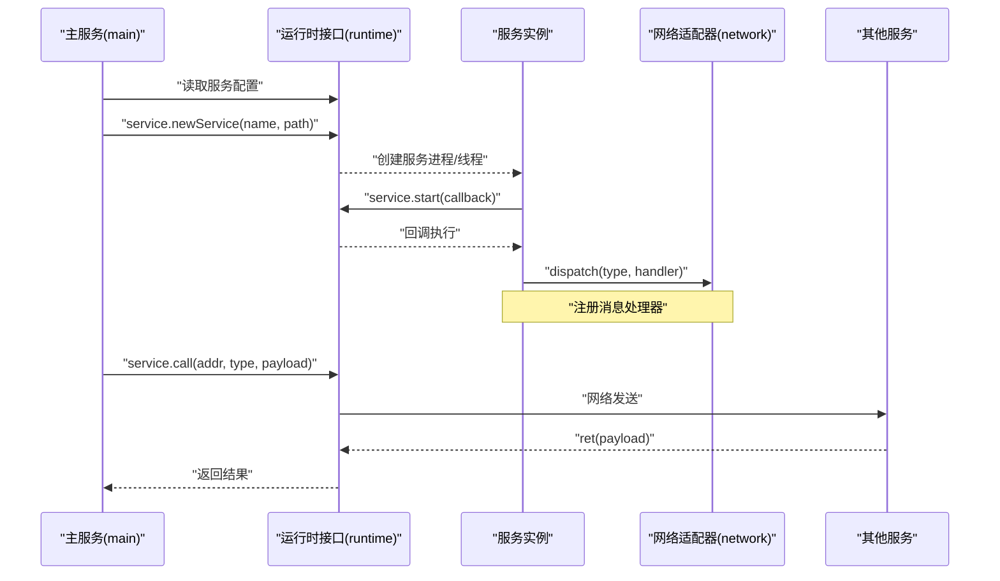
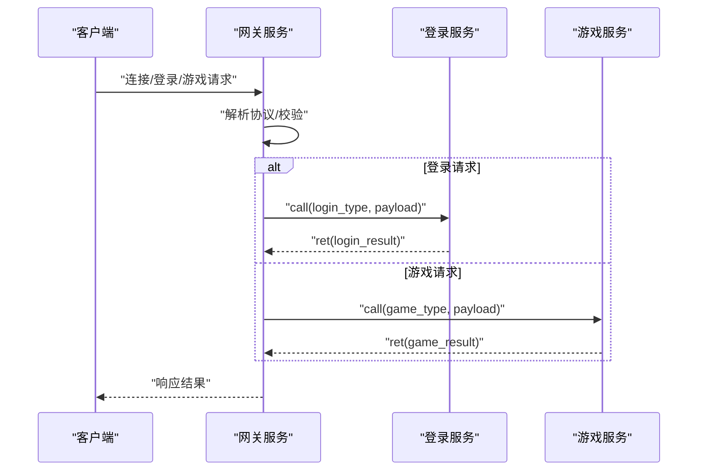
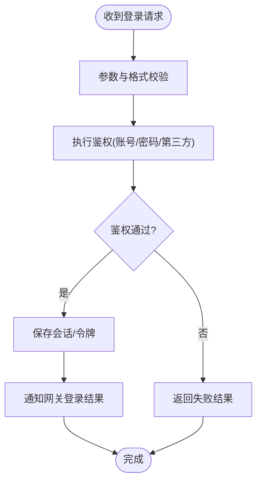
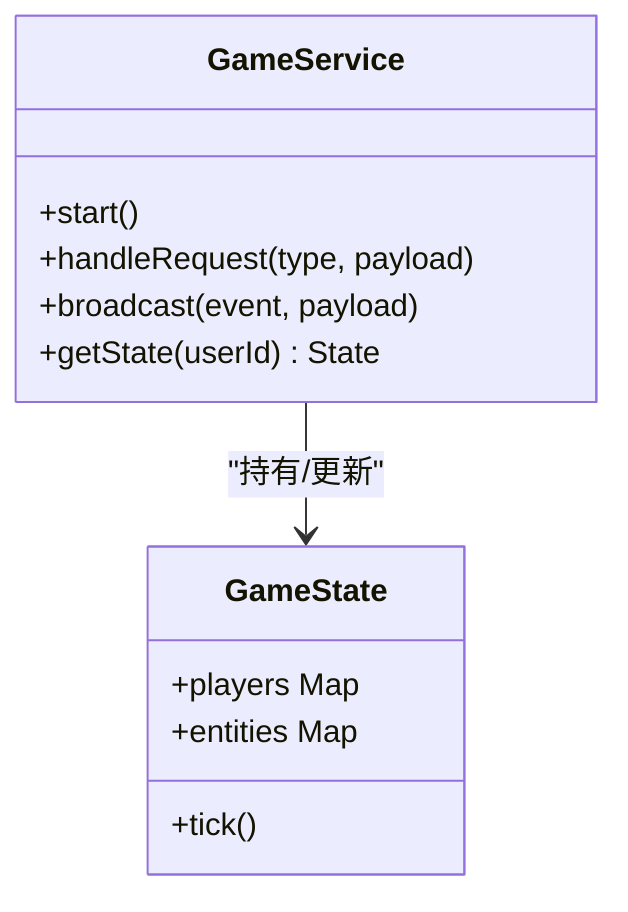
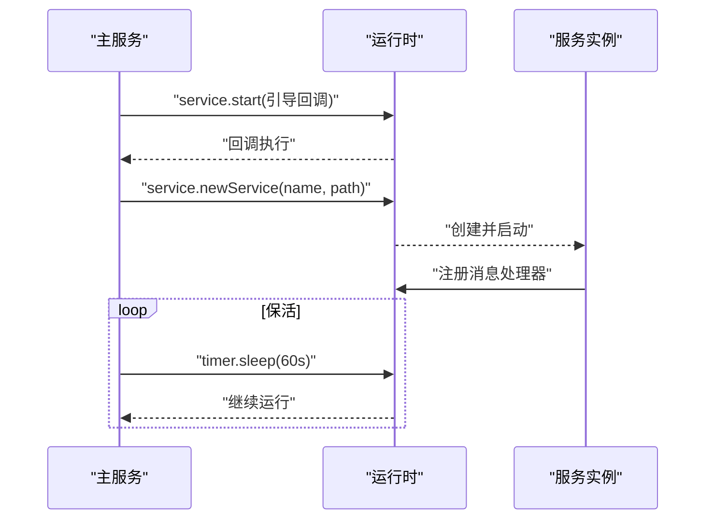
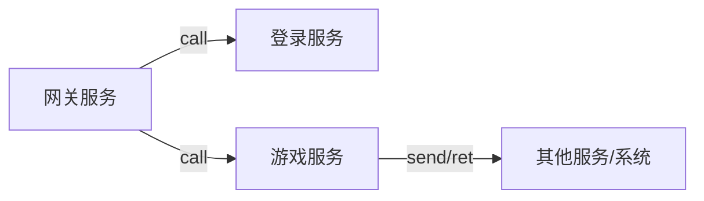
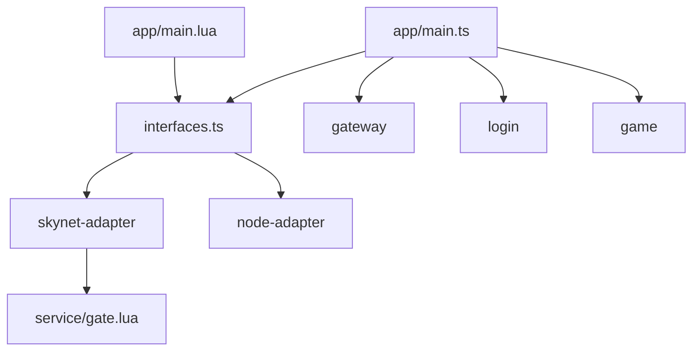

# 服务架构

<cite>
**本文引用的文件**
- [docker\lua\app\main.lua](file://docker\lua\app\main.lua)
- [server\src\app\main.ts](file://server\src\app\main.ts)
- [docker\lua\app\bootstrap-skynet.lua](file://docker\lua\app\bootstrap-skynet.lua)
- [server\src\app\bootstrap-node.ts](file://server\src\app\bootstrap-node.ts)
- [docker\lua\framework\runtime\skynet-adapter.lua](file://docker\lua\framework\runtime\skynet-adapter.lua)
- [server\src\framework\runtime\node-adapter.ts](file://server\src\framework\runtime\node-adapter.ts)
- [docker\lua\framework\runtime\node-adapter.lua](file://docker\lua\framework\runtime\node-adapter.lua)
- [server\src\framework\core\interfaces.ts](file://server\src\framework\core\interfaces.ts)
- [docker\lua\app\services\gateway\index.lua](file://docker\lua\app\services\gateway\index.lua)
- [server\src\app\services\gateway\index.ts](file://server\src\app\services\gateway\index.ts)
- [server\src\app\services\gateway\logic.ts](file://server\src\app\services\gateway\logic.ts)
- [server\src\app\services\login\index.ts](file://server\src\app\services\login\index.ts)
- [server\src\app\services\game\index.ts](file://server\src\app\services\game\index.ts)
- [protocols\proto\gateway.proto](file://protocols\proto\gateway.proto)
- [protocols\proto\login.proto](file://protocols\proto\login.proto)
- [protocols\proto\game.proto](file://protocols\proto\game.proto)
- [docker\lua\service\gate.lua](file://docker\lua\service\gate.lua)
</cite>

## 目录
1. [引言](#引言)
2. [项目结构](#项目结构)
3. [核心组件](#核心组件)
4. [架构总览](#架构总览)
5. [详细组件分析](#详细组件分析)
6. [依赖分析](#依赖分析)
7. [性能考虑](#性能考虑)
8. [故障排查指南](#故障排查指南)
9. [结论](#结论)
10. [附录](#附录)

## 引言
本文件系统性梳理 TS-Skynet 框架中的服务架构，重点覆盖三大核心服务：网关服务、登录服务与游戏服务。文档从职责边界、功能特性、实现原理出发，解释服务间通信机制、消息路由与数据流转；给出服务生命周期管理、启动顺序与依赖关系；并提供扩展与自定义开发指导。同时，结合 Actor 模型对消息传递、状态管理与并发处理进行深入解析，并配套监控、日志与错误处理策略。

## 项目结构
TS-Skynet 采用 TypeScript 与 Skynet 的混合运行时方案：
- TypeScript 层负责业务逻辑与服务编排，通过接口抽象屏蔽底层差异。
- Skynet 层提供高性能消息传递、定时器、网络与服务生命周期管理。
- Node.js 适配层用于本地开发与测试，便于快速验证。

图表来源
- [server\src\framework\core\interfaces.ts](file://server\src\framework\core\interfaces.ts)
- [server\src\framework\runtime\node-adapter.ts](file://server\src\framework\runtime\node-adapter.ts)
- [docker\lua\framework\runtime\skynet-adapter.lua](file://docker\lua\framework\runtime\skynet-adapter.lua)
- [server\src\app\main.ts](file://server\src\app\main.ts)
- [docker\lua\app\main.lua](file://docker\lua\app\main.lua)
- [docker\lua\app\bootstrap-skynet.lua](file://docker\lua\app\bootstrap-skynet.lua)
- [server\src\app\bootstrap-node.ts](file://server\src\app\bootstrap-node.ts)

章节来源
- [server\src\app\main.ts](file://server\src\app\main.ts)
- [docker\lua\app\main.lua](file://docker\lua\app\main.lua)
- [server\src\framework\core\interfaces.ts](file://server\src\framework\core\interfaces.ts)

## 核心组件
- 统一运行时接口：通过 interfaces.ts 抽象出 logger、timer、network、service、codec 等能力，屏蔽 Skynet 与 Node.js 的差异。
- Skynet 适配器：实现日志、定时器、网络与服务管理，封装 send/call/dispatch/ret 等消息通道。
- Node.js 适配器：提供本地开发用的日志、定时器、网络与服务管理，便于测试与调试。
- 应用启动器：TS 与 Lua 双入口分别加载对应运行时并启动服务配置列表中的服务实例。

章节来源
- [server\src\framework\core\interfaces.ts](file://server\src\framework\core\interfaces.ts)
- [docker\lua\framework\runtime\skynet-adapter.lua](file://docker\lua\framework\runtime\skynet-adapter.lua)
- [server\src\framework\runtime\node-adapter.ts](file://server\src\framework\runtime\node-adapter.ts)
- [docker\lua\framework\runtime\node-adapter.lua](file://docker\lua\framework\runtime\node-adapter.lua)
- [server\src\app\main.ts](file://server\src\app\main.ts)
- [docker\lua\app\main.lua](file://docker\lua\app\main.lua)

## 架构总览
TS-Skynet 的服务架构以“服务即 Actor”为核心思想：
- 每个服务是一个独立的 Actor，拥有唯一地址与私有状态。
- 服务之间通过消息传递进行通信，支持 fire-and-forget（send）与请求-响应（call/ret）两种模式。
- 服务生命周期由运行时管理：启动、注册、销毁。
- 协议编解码通过 codec 提供，支持 Protobuf 等格式。

图表来源
- [server\src\framework\core\interfaces.ts](file://server\src\framework\core\interfaces.ts)
- [docker\lua\framework\runtime\skynet-adapter.lua](file://docker\lua\framework\runtime\skynet-adapter.lua)
- [server\src\app\main.ts](file://server\src\app\main.ts)

## 详细组件分析

### 网关服务（Gateway）
职责与特点
- 接收客户端连接，作为外部流量入口。
- 负责协议解析、鉴权前置校验与消息转发。
- 维护连接池与会话状态，向上游登录与游戏服务分发消息。

实现要点
- 通过运行时接口注册消息处理器，监听来自客户端的消息类型。
- 将登录相关请求转发至登录服务，将游戏逻辑请求转发至游戏服务。
- 借助 Protobuf 编解码协议，确保消息格式一致与高效传输。

图表来源
- [server\src\app\services\gateway\index.ts](file://server\src\app\services\gateway\index.ts)
- [server\src\app\services\gateway\logic.ts](file://server\src\app\services\gateway\logic.ts)
- [protocols\proto\gateway.proto](file://protocols\proto\gateway.proto)

章节来源
- [server\src\app\services\gateway\index.ts](file://server\src\app\services\gateway\index.ts)
- [server\src\app\services\gateway\logic.ts](file://server\src\app\services\gateway\logic.ts)
- [protocols\proto\gateway.proto](file://protocols\proto\gateway.proto)

### 登录服务（Login）
职责与特点
- 处理用户认证与授权，生成/校验令牌。
- 维护用户会话与在线状态，向网关返回登录结果。
- 与数据库或缓存交互，保证高并发下的会话一致性。

实现要点
- 注册登录相关的消息处理器，接收来自网关的登录请求。
- 通过运行时接口访问存储与外部服务，完成鉴权流程。
- 将登录成功后的用户上下文回传给网关，以便后续路由到对应游戏服务。

图表来源
- [server\src\app\services\login\index.ts](file://server\src\app\services\login\index.ts)
- [protocols\proto\login.proto](file://protocols\proto\login.proto)

章节来源
- [server\src\app\services\login\index.ts](file://server\src\app\services\login\index.ts)
- [protocols\proto\login.proto](file://protocols\proto\login.proto)

### 游戏服务（Game）
职责与特点
- 承载具体的游戏逻辑，处理玩家操作与状态变更。
- 与世界/场景/副本等子系统协作，维护全局状态一致性。
- 对外暴露稳定的 API，内部通过 Actor 模式实现高并发与低耦合。

实现要点
- 注册游戏协议类型的消息处理器，接收来自网关的业务请求。
- 通过运行时接口与其他服务交互，必要时进行跨服务查询或广播。
- 使用 Protobuf 编解码，确保消息体积与性能平衡。

图表来源
- [server\src\app\services\game\index.ts](file://server\src\app\services\game\index.ts)
- [protocols\proto\game.proto](file://protocols\proto\game.proto)

章节来源
- [server\src\app\services\game\index.ts](file://server\src\app\services\game\index.ts)
- [protocols\proto\game.proto](file://protocols\proto\game.proto)

### 服务启动与生命周期
- 启动顺序：主服务先加载运行时，再按配置逐个启动网关、登录与游戏服务实例。
- 生命周期：服务启动后注册消息处理器，持续处理请求；主服务通过 keep-alive 保活。
- 错误处理：启动失败时记录错误并退出；运行时捕获异常，避免崩溃传播。

图表来源
- [server\src\app\main.ts](file://server\src\app\main.ts)
- [docker\lua\app\main.lua](file://docker\lua\app\main.lua)
- [docker\lua\framework\runtime\skynet-adapter.lua](file://docker\lua\framework\runtime\skynet-adapter.lua)

章节来源
- [server\src\app\main.ts](file://server\src\app\main.ts)
- [docker\lua\app\main.lua](file://docker\lua\app\main.lua)

### 服务间通信与消息路由
- 发送/接收：服务通过 network.send/fire-and-forget，通过 network.call/ret 请求-响应。
- 路由策略：网关根据消息类型将请求分发至登录或游戏服务；游戏服务内部可进一步分发至子系统。
- 并发模型：Skynet 的 Actor 模型天然支持高并发，消息串行处理单个服务实例内的状态。

图表来源
- [docker\lua\framework\runtime\skynet-adapter.lua](file://docker\lua\framework\runtime\skynet-adapter.lua)
- [server\src\framework\runtime\node-adapter.ts](file://server\src\framework\runtime\node-adapter.ts)

章节来源
- [docker\lua\framework\runtime\skynet-adapter.lua](file://docker\lua\framework\runtime\skynet-adapter.lua)
- [server\src\framework\runtime\node-adapter.ts](file://server\src\framework\runtime\node-adapter.ts)

### Actor 模型与并发处理
- 消息传递：服务通过 dispatch 注册处理器，收到消息后异步处理，避免阻塞。
- 状态管理：服务内状态仅由消息驱动的状态机维护，避免共享可变状态。
- 并发控制：Skynet 的多核调度与消息队列保证高吞吐；Node.js 适配器使用事件循环模拟。

章节来源
- [docker\lua\framework\runtime\skynet-adapter.lua](file://docker\lua\framework\runtime\skynet-adapter.lua)
- [server\src\framework\runtime\node-adapter.ts](file://server\src\framework\runtime\node-adapter.ts)

### 协议与数据流转
- 协议定义：各服务的消息类型在 Protobuf 中集中定义，确保前后端一致。
- 数据流转：网关负责协议转换与转发，登录服务负责会话管理，游戏服务负责业务状态。

章节来源
- [protocols\proto\gateway.proto](file://protocols\proto\gateway.proto)
- [protocols\proto\login.proto](file://protocols\proto\login.proto)
- [protocols\proto\game.proto](file://protocols\proto\game.proto)

## 依赖分析
- 运行时依赖：所有服务依赖 interfaces.ts 提供的统一接口，Skynet 与 Node.js 通过适配器注入。
- 启动依赖：主服务负责服务发现与启动顺序，服务之间通过地址与消息类型解耦。
- 协议依赖：服务间消息严格遵循 Protobuf 定义，减少耦合并提升性能。

图表来源
- [server\src\framework\core\interfaces.ts](file://server\src\framework\core\interfaces.ts)
- [server\src\app\main.ts](file://server\src\app\main.ts)
- [docker\lua\app\main.lua](file://docker\lua\app\main.lua)
- [docker\lua\service\gate.lua](file://docker\lua\service\gate.lua)

章节来源
- [server\src\framework\core\interfaces.ts](file://server\src\framework\core\interfaces.ts)
- [server\src\app\main.ts](file://server\src\app\main.ts)
- [docker\lua\app\main.lua](file://docker\lua\app\main.lua)

## 性能考虑
- 服务拆分：网关、登录、游戏分离，降低单点压力，便于水平扩展。
- 消息最小化：使用 Protobuf 减少序列化开销，避免冗余字段。
- 并发模型：利用 Actor 模型与 Skynet 的多核调度，提高吞吐量。
- 缓存策略：登录服务与游戏服务可引入缓存层，降低数据库压力。
- 监控埋点：在关键路径增加计时与指标上报，辅助容量规划。

## 故障排查指南
- 启动失败：检查服务配置与路径是否正确，查看运行时日志输出。
- 消息超时：确认目标服务是否存活，消息类型是否匹配，必要时增加重试与降级。
- 内存泄漏：排查长连接与会话清理逻辑，确保无未释放的引用。
- 日志定位：使用运行时日志接口输出关键事件，结合时间戳与服务地址快速定位。

章节来源
- [docker\lua\framework\runtime\skynet-adapter.lua](file://docker\lua\framework\runtime\skynet-adapter.lua)
- [server\src\framework\runtime\node-adapter.ts](file://server\src\framework\runtime\node-adapter.ts)

## 结论
TS-Skynet 的服务架构以 Actor 模型为基础，通过统一运行时接口与清晰的服务边界，实现了高并发、可扩展且易维护的分布式服务框架。三大核心服务分工明确：网关负责接入与路由，登录负责鉴权与会话，游戏负责业务状态与逻辑。配合 Protobuf 协议与完善的运行时适配，既能在生产环境稳定运行，也能在开发阶段快速迭代。

## 附录
- 启动入口
  - TypeScript 启动入口：[server\src\app\main.ts](file://server\src\app\main.ts)
  - Lua 启动入口：[docker\lua\app\main.lua](file://docker\lua\app\main.lua)
- 运行时适配
  - Skynet 适配器：[docker\lua\framework\runtime\skynet-adapter.lua](file://docker\lua\framework\runtime\skynet-adapter.lua)
  - Node.js 适配器：[server\src\framework\runtime\node-adapter.ts](file://server\src\framework\runtime\node-adapter.ts)
- 服务实现
  - 网关服务：[server\src\app\services\gateway\index.ts](file://server\src\app\services\gateway\index.ts)
  - 登录服务：[server\src\app\services\login\index.ts](file://server\src\app\services\login\index.ts)
  - 游戏服务：[server\src\app\services\game\index.ts](file://server\src\app\services\game\index.ts)
- 协议定义
  - 网关协议：[protocols\proto\gateway.proto](file://protocols\proto\gateway.proto)
  - 登录协议：[protocols\proto\login.proto](file://protocols\proto\login.proto)
  - 游戏协议：[protocols\proto\game.proto](file://protocols\proto\game.proto)