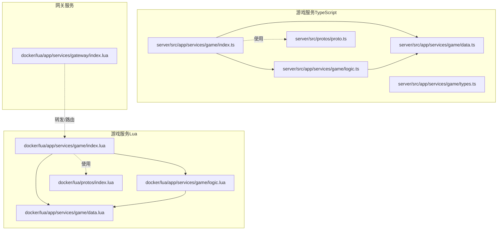
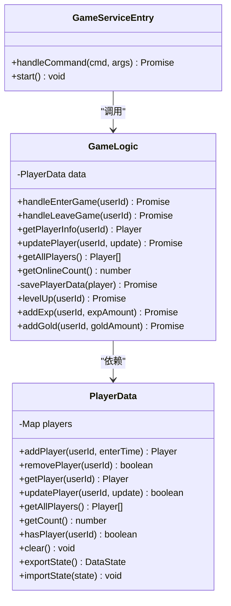
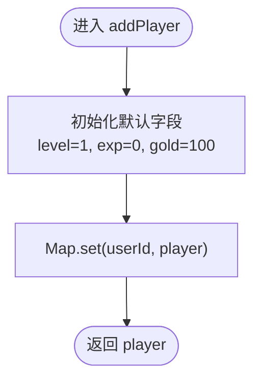
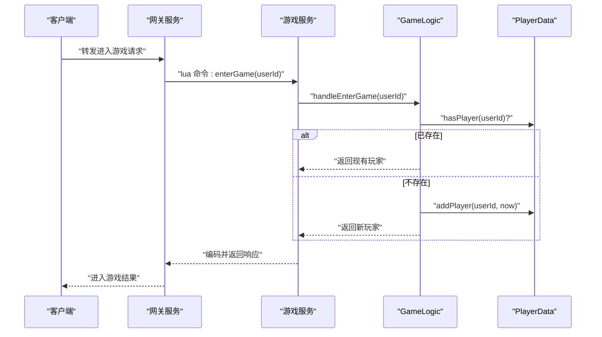
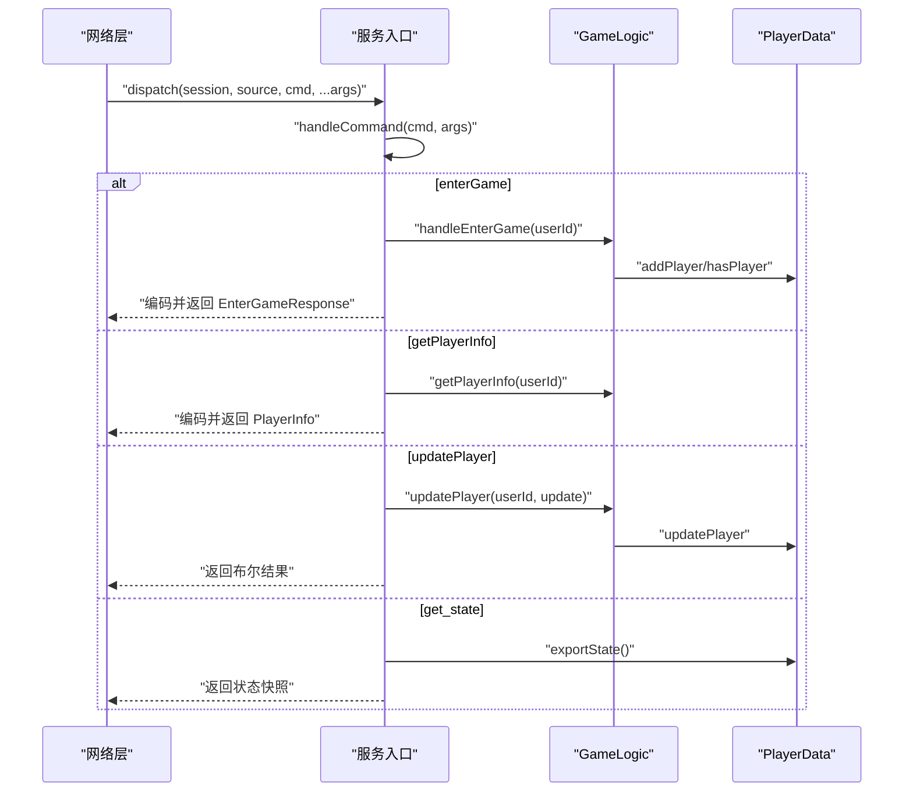
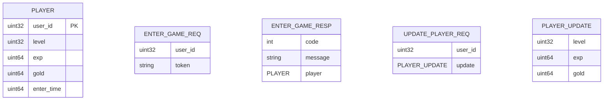
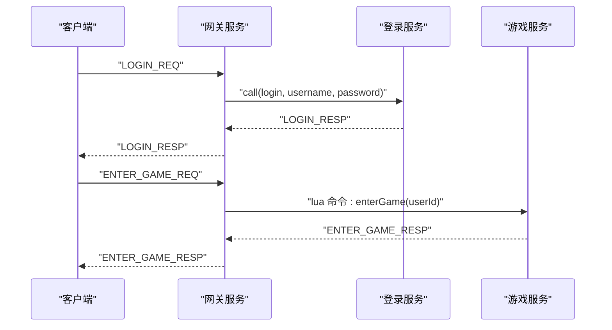
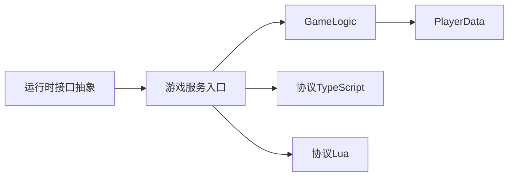

# 游戏服务

<cite>
**本文引用的文件**
- [server/src/app/services/game/index.ts](file://server/src/app/services/game/index.ts)
- [server/src/app/services/game/data.ts](file://server/src/app/services/game/data.ts)
- [server/src/app/services/game/logic.ts](file://server/src/app/services/game/logic.ts)
- [server/src/app/services/game/types.ts](file://server/src/app/services/game/types.ts)
- [server/src/framework/core/interfaces.ts](file://server/src/framework/core/interfaces.ts)
- [server/src/protos/proto.ts](file://server/src/protos/proto.ts)
- [protocols/proto/game.proto](file://protocols/proto/game.proto)
- [docker/lua/app/services/game/index.lua](file://docker/lua/app/services/game/index.lua)
- [docker/lua/app/services/game/data.lua](file://docker/lua/app/services/game/data.lua)
- [docker/lua/app/services/game/logic.lua](file://docker/lua/app/services/game/logic.lua)
- [docker/lua/protos/index.lua](file://docker/lua/protos/index.lua)
- [docker/lua/app/services/gateway/index.lua](file://docker/lua/app/services/gateway/index.lua)
</cite>

## 目录
1. [简介](#简介)
2. [项目结构](#项目结构)
3. [核心组件](#核心组件)
4. [架构总览](#架构总览)
5. [详细组件分析](#详细组件分析)
6. [依赖分析](#依赖分析)
7. [性能考虑](#性能考虑)
8. [故障排查指南](#故障排查指南)
9. [结论](#结论)
10. [附录](#附录)

## 简介
本文件为“游戏服务”的技术文档，聚焦于其在整体系统中的业务核心地位，涵盖游戏状态管理、玩家数据处理、游戏规则执行等能力。文档同时阐述了服务的架构设计（数据持久化策略、状态同步机制、并发控制）、与登录服务和网关服务的协作关系、数据模型设计思路、扩展开发指南以及性能优化策略，并提供可操作的开发示例路径，帮助开发者快速上手。

## 项目结构
游戏服务位于 TypeScript 源码与 Lua 运行时两套实现中，分别对应 Node.js 开发环境与 Skynet 生产环境。核心目录与文件如下：
- 服务入口与命令分发：server/src/app/services/game/index.ts
- 数据层（不热更）：server/src/app/services/game/data.ts
- 逻辑层（可热更）：server/src/app/services/game/logic.ts
- 类型定义：server/src/app/services/game/types.ts
- 运行时接口抽象：server/src/framework/core/interfaces.ts
- 协议定义（TypeScript）：server/src/protos/proto.ts
- 协议定义（ProtoBuf）：protocols/proto/game.proto
- Lua 对应实现：docker/lua/app/services/game/*.lua
- 网关服务（消息路由与转发）：docker/lua/app/services/gateway/index.lua

**图表来源**
- [server/src/app/services/game/index.ts:108-136](file://server/src/app/services/game/index.ts#L108-L136)
- [server/src/app/services/game/data.ts:13-112](file://server/src/app/services/game/data.ts#L13-L112)
- [server/src/app/services/game/logic.ts:15-161](file://server/src/app/services/game/logic.ts#L15-L161)
- [server/src/protos/proto.ts:160-289](file://server/src/protos/proto.ts#L160-L289)
- [docker/lua/app/services/game/index.lua:118-154](file://docker/lua/app/services/game/index.lua#L118-L154)
- [docker/lua/app/services/game/data.lua:11-69](file://docker/lua/app/services/game/data.lua#L11-L69)
- [docker/lua/app/services/game/logic.lua:13-123](file://docker/lua/app/services/game/logic.lua#L13-L123)
- [docker/lua/protos/index.lua:5-13](file://docker/lua/protos/index.lua#L5-L13)
- [docker/lua/app/services/gateway/index.lua:181-223](file://docker/lua/app/services/gateway/index.lua#L181-L223)

**章节来源**
- [server/src/app/services/game/index.ts:108-136](file://server/src/app/services/game/index.ts#L108-L136)
- [docker/lua/app/services/game/index.lua:118-154](file://docker/lua/app/services/game/index.lua#L118-L154)

## 核心组件
- 数据层（PlayerData）
  - 职责：管理玩家数据，不包含业务逻辑；不热更新，保证状态持久化。
  - 关键方法：添加/移除/查询玩家，批量查询、计数、导入导出状态。
- 逻辑层（GameLogic）
  - 职责：处理业务逻辑，不持有状态；通过依赖注入使用数据层；支持热更新。
  - 关键方法：进入/离开游戏、查询/更新玩家、在线人数统计、经验/金币变更、升级判定。
- 服务入口（index.ts / index.lua）
  - 职责：注册网络消息分发、命令分发、错误处理、保活日志。
  - 关键流程：接收命令 -> 分发到逻辑层 -> 读写数据层 -> 编解码返回。
- 类型与协议
  - 类型定义：Player、PlayerUpdate、DataState、CommandArgs 等。
  - 协议定义：game.proto 中的消息体与 proto.ts 中的简化实现（Node/Skynet 兼容）。

**章节来源**
- [server/src/app/services/game/data.ts:13-112](file://server/src/app/services/game/data.ts#L13-L112)
- [server/src/app/services/game/logic.ts:15-161](file://server/src/app/services/game/logic.ts#L15-L161)
- [server/src/app/services/game/types.ts:14-56](file://server/src/app/services/game/types.ts#L14-L56)
- [protocols/proto/game.proto:10-141](file://protocols/proto/game.proto#L10-L141)
- [server/src/protos/proto.ts:257-289](file://server/src/protos/proto.ts#L257-L289)

## 架构总览
游戏服务采用“数据层 + 逻辑层 + 接口层”的三层架构：
- 数据层（不可热更）：以 Map 存储玩家状态，提供导入导出能力，保障热更新时的状态迁移。
- 逻辑层（可热更）：封装业务规则（进入/离开、经验/金币变更、升级），通过异步操作模拟外部依赖（如数据库保存）。
- 接口层（服务入口）：统一命令分发、日志记录、错误处理、保活心跳；支持 protobuf 编解码与返回。

**图表来源**
- [server/src/app/services/game/data.ts:13-112](file://server/src/app/services/game/data.ts#L13-L112)
- [server/src/app/services/game/logic.ts:15-161](file://server/src/app/services/game/logic.ts#L15-L161)
- [server/src/app/services/game/index.ts:23-106](file://server/src/app/services/game/index.ts#L23-L106)

## 详细组件分析

### 数据层（PlayerData）
- 设计要点
  - 使用 Map 存储玩家，键为 userId，值为 Player 结构。
  - 提供批量导出/导入状态，便于热更新时迁移。
  - 不暴露业务规则，仅负责数据读写与聚合查询。
- 复杂度
  - Map 查找/插入/删除平均 O(1)，批量转换为数组 O(n)。
- 并发与一致性
  - 该实现未显式加锁，需配合运行时的协程调度与服务内串行化处理，避免竞态。

**图表来源**
- [server/src/app/services/game/data.ts:19-29](file://server/src/app/services/game/data.ts#L19-L29)

**章节来源**
- [server/src/app/services/game/data.ts:13-112](file://server/src/app/services/game/data.ts#L13-L112)

### 逻辑层（GameLogic）
- 设计要点
  - 通过构造函数注入 PlayerData，不持有状态，支持热更新。
  - 封装业务规则：进入/离开游戏、经验/金币变更、升级判定。
  - 异步保存玩家数据（模拟），可在真实环境中对接数据库服务。
- 复杂度
  - 查询/更新均为 O(1)，批量获取 O(n)。
- 错误处理
  - 未找到玩家时返回失败；更新失败时记录警告日志。

**图表来源**
- [docker/lua/app/services/gateway/index.lua:184-211](file://docker/lua/app/services/gateway/index.lua#L184-L211)
- [server/src/app/services/game/index.ts:23-47](file://server/src/app/services/game/index.ts#L23-L47)
- [server/src/app/services/game/logic.ts:22-39](file://server/src/app/services/game/logic.ts#L22-L39)
- [server/src/app/services/game/data.ts:19-29](file://server/src/app/services/game/data.ts#L19-L29)

**章节来源**
- [server/src/app/services/game/logic.ts:15-161](file://server/src/app/services/game/logic.ts#L15-L161)

### 服务入口（命令分发与编解码）
- 设计要点
  - 注册网络消息分发器，接收命令并进行分发。
  - 使用 protobuf 编解码返回消息（若可用），否则回退为原生序列化。
  - 统一错误处理与日志记录。
- 并发控制
  - 分发器回调为异步，但每个命令处理串行化，避免并发写冲突。
- 状态同步
  - 提供 get_state 命令导出内部状态，便于运维与热更新迁移。

**图表来源**
- [server/src/app/services/game/index.ts:115-124](file://server/src/app/services/game/index.ts#L115-L124)
- [server/src/app/services/game/index.ts:23-106](file://server/src/app/services/game/index.ts#L23-L106)
- [server/src/app/services/game/logic.ts:67-84](file://server/src/app/services/game/logic.ts#L67-L84)
- [server/src/app/services/game/data.ts:98-111](file://server/src/app/services/game/data.ts#L98-L111)

**章节来源**
- [server/src/app/services/game/index.ts:23-106](file://server/src/app/services/game/index.ts#L23-L106)

### 协议与消息模型
- 协议定义
  - game.proto 定义了 PlayerInfo、EnterGameRequest/Response、LeaveGameRequest/Response、GetPlayerInfo、UpdatePlayer、AddExp、AddGold 等消息。
  - proto.ts 提供 Node/Skynet 兼容的简化实现（JSON 序列化），生产环境由 lua-protobuf 驱动。
- 消息映射
  - MessageId 与消息类型映射，便于网关服务进行消息打包/解包与路由。

**图表来源**
- [protocols/proto/game.proto:10-90](file://protocols/proto/game.proto#L10-L90)
- [server/src/protos/proto.ts:257-289](file://server/src/protos/proto.ts#L257-L289)

**章节来源**
- [protocols/proto/game.proto:10-141](file://protocols/proto/game.proto#L10-L141)
- [server/src/protos/proto.ts:160-289](file://server/src/protos/proto.ts#L160-L289)

### 与登录服务、网关服务的协作
- 网关服务职责
  - 维护连接、心跳、广播、踢人、绑定用户、转发消息。
  - 可将特定消息（如登录请求）转发至登录服务并回传结果。
- 游戏服务协作
  - 网关将客户端消息转发至游戏服务（如进入/离开游戏），游戏服务返回 protobuf 编码响应。
  - 网关可向游戏服务查询在线人数、导出状态等。

**图表来源**
- [docker/lua/app/services/gateway/index.lua:143-180](file://docker/lua/app/services/gateway/index.lua#L143-L180)
- [docker/lua/app/services/gateway/index.lua:184-211](file://docker/lua/app/services/gateway/index.lua#L184-L211)

**章节来源**
- [docker/lua/app/services/gateway/index.lua:143-180](file://docker/lua/app/services/gateway/index.lua#L143-L180)
- [docker/lua/app/services/gateway/index.lua:184-211](file://docker/lua/app/services/gateway/index.lua#L184-L211)

## 依赖分析
- 组件耦合
  - GameLogic 依赖 PlayerData（依赖注入），二者低耦合、高内聚。
  - 服务入口依赖 GameLogic 与运行时接口（logger/timer/network/service/codec）。
- 外部依赖
  - 运行时接口抽象屏蔽底层差异（Node/Skynet）。
  - 协议编解码在 Node 环境使用 JSON，在 Skynet 环境使用 lua-protobuf。
- 循环依赖
  - 未发现循环依赖；数据层与逻辑层之间为单向依赖。

**图表来源**
- [server/src/framework/core/interfaces.ts:189-225](file://server/src/framework/core/interfaces.ts#L189-L225)
- [server/src/app/services/game/index.ts:7-12](file://server/src/app/services/game/index.ts#L7-L12)
- [server/src/protos/proto.ts:160-289](file://server/src/protos/proto.ts#L160-L289)
- [docker/lua/protos/index.lua:5-13](file://docker/lua/protos/index.lua#L5-L13)

**章节来源**
- [server/src/framework/core/interfaces.ts:189-225](file://server/src/framework/core/interfaces.ts#L189-L225)
- [server/src/app/services/game/index.ts:7-12](file://server/src/app/services/game/index.ts#L7-L12)

## 性能考虑
- 内存管理
  - 使用 Map 存储玩家，避免频繁 GC；及时清理离线玩家（handleLeaveGame）。
- 数据库/持久化
  - 逻辑层提供 savePlayerData 抽象，建议在真实环境实现异步持久化与批处理写入。
- 编解码与序列化
  - 生产环境优先使用 lua-protobuf；Node 环境使用 JSON 作为降级方案。
- 并发与锁
  - 服务内命令串行化处理，避免并发写冲突；必要时引入细粒度锁或队列化写入。
- 缓存策略
  - 对热点查询（如在线人数、玩家信息）可引入本地缓存，结合失效策略。
- 热更新
  - 数据层不热更，逻辑层可热更；导出/导入状态保证平滑迁移。

[本节为通用指导，无需列出具体文件来源]

## 故障排查指南
- 常见问题
  - 未知命令：服务入口会记录警告并返回失败，检查命令名称与参数类型。
  - 玩家不存在：逻辑层在更新/查询时返回失败并记录警告，检查用户状态。
  - 编解码失败：确认 protobuf 类型名与消息体一致，检查 MessageId 映射。
- 日志定位
  - 服务启动/就绪日志、命令处理日志、错误异常日志，均通过 runtime.logger 输出。
- 排查步骤
  - 使用 get_state 导出现有状态，核对玩家列表与关键字段。
  - 检查网关转发链路，确认消息打包/解包与路由正确。

**章节来源**
- [server/src/app/services/game/index.ts:102-105](file://server/src/app/services/game/index.ts#L102-L105)
- [server/src/app/services/game/logic.ts:47-51](file://server/src/app/services/game/logic.ts#L47-L51)
- [server/src/protos/proto.ts:317-338](file://server/src/protos/proto.ts#L317-L338)

## 结论
游戏服务通过清晰的三层架构实现了稳定的业务核心：数据层确保状态持久与热更新迁移，逻辑层承载业务规则与可热更特性，接口层统一命令分发与编解码。配合网关服务的消息路由与登录服务的权限校验，形成完整的端到端链路。按本文提供的扩展与优化建议，可进一步提升系统的稳定性、性能与可维护性。

[本节为总结，无需列出具体文件来源]

## 附录

### 扩展开发指南
- 新增命令
  - 在服务入口新增命令分支，调用 GameLogic 方法，必要时扩展 proto 定义并在入口处编码返回。
  - 示例路径：[server/src/app/services/game/index.ts:23-106](file://server/src/app/services/game/index.ts#L23-L106)
- 自定义游戏规则
  - 在 GameLogic 中新增方法（如道具使用、副本挑战），保持对 PlayerData 的只读/写入约束。
  - 示例路径：[server/src/app/services/game/logic.ts:112-160](file://server/src/app/services/game/logic.ts#L112-L160)
- 数据模型演进
  - 修改 Player/PlayerUpdate 结构时，同步更新 proto 定义与两端实现。
  - 示例路径：[server/src/app/services/game/types.ts:14-30](file://server/src/app/services/game/types.ts#L14-L30)，[protocols/proto/game.proto:10-73](file://protocols/proto/game.proto#L10-L73)

### 开发示例（路径指引）
- 启动与调试
  - 服务入口启动与保活：[server/src/app/services/game/index.ts:108-136](file://server/src/app/services/game/index.ts#L108-L136)
  - Lua 端等价实现：[docker/lua/app/services/game/index.lua:118-154](file://docker/lua/app/services/game/index.lua#L118-L154)
- 命令处理流程
  - 命令分发与返回：[server/src/app/services/game/index.ts:23-106](file://server/src/app/services/game/index.ts#L23-L106)
  - 网关转发与登录服务交互：[docker/lua/app/services/gateway/index.lua:143-180](file://docker/lua/app/services/gateway/index.lua#L143-L180)
- 协议与消息
  - Proto 定义：[protocols/proto/game.proto:10-141](file://protocols/proto/game.proto#L10-L141)
  - TypeScript 简化实现：[server/src/protos/proto.ts:257-289](file://server/src/protos/proto.ts#L257-L289)
  - Lua 协议索引：[docker/lua/protos/index.lua:5-13](file://docker/lua/protos/index.lua#L5-L13)