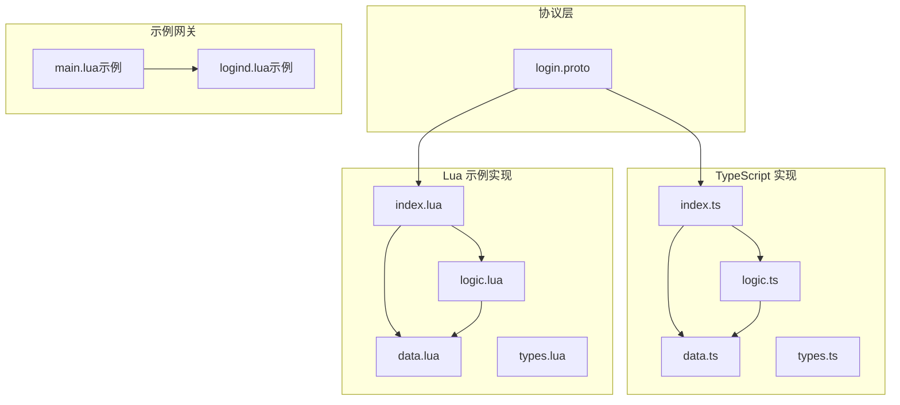
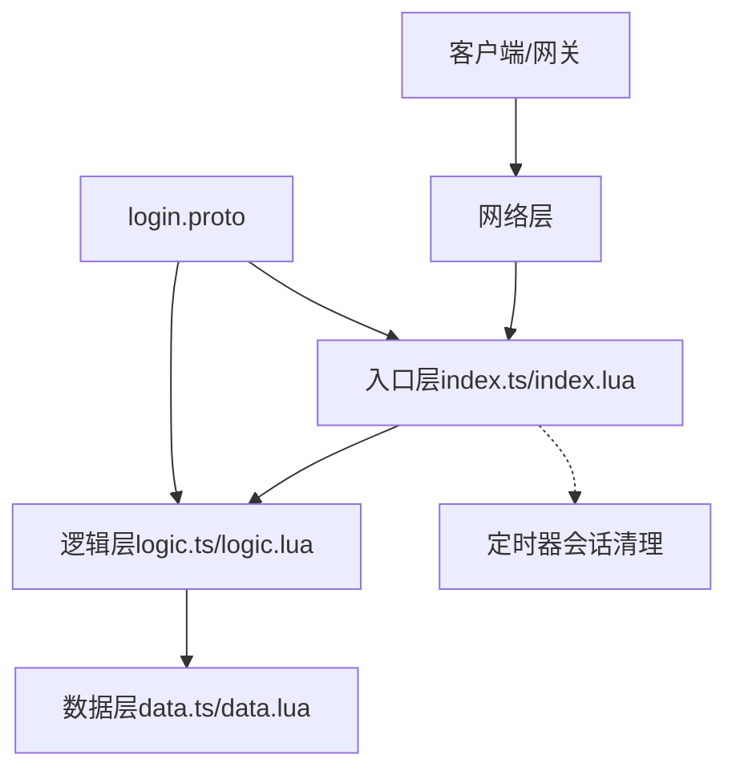
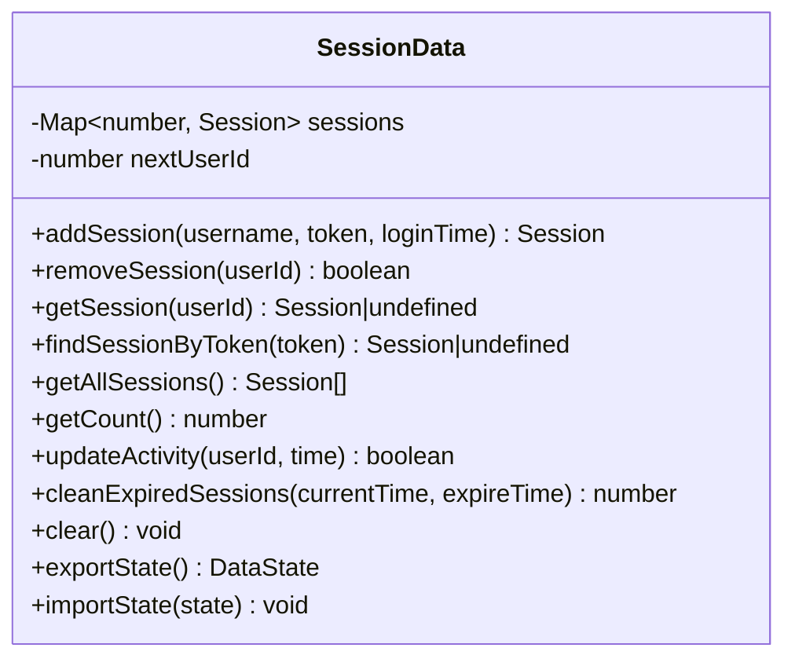
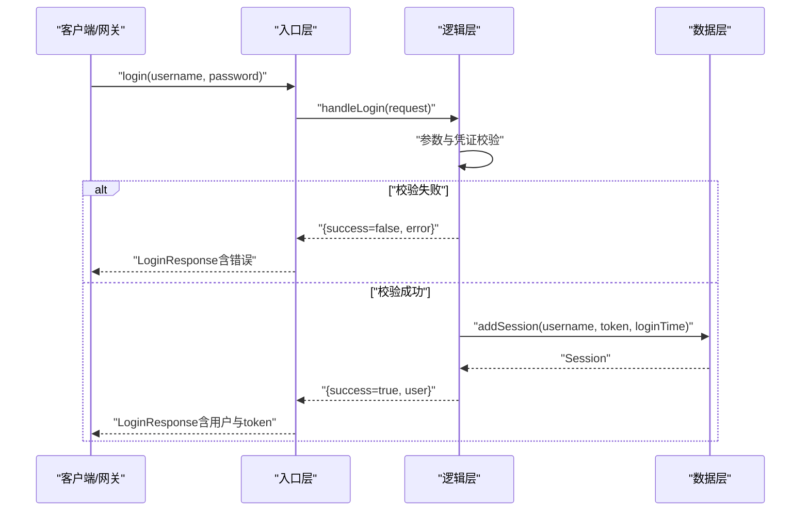
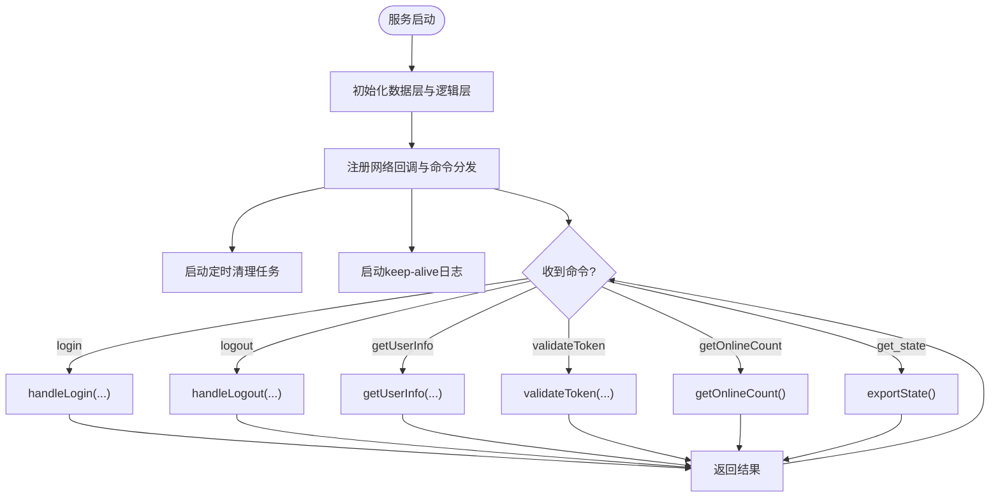
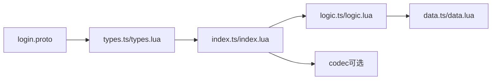
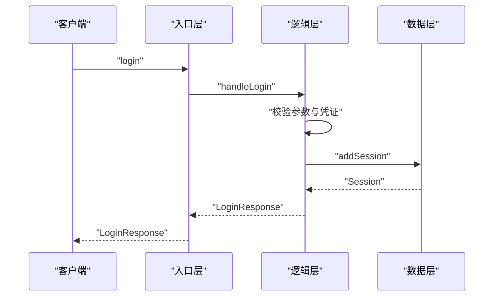

# 登录服务

<cite>
**本文引用的文件**
- [login.proto](file://protocols/proto/login.proto)
- [login_service.lua（示例）](file://docker/skynet/examples/login/logind.lua)
- [data.ts](file://server/src/app/services/login/data.ts)
- [logic.ts](file://server/src/app/services/login/logic.ts)
- [index.ts](file://server/src/app/services/login/index.ts)
- [types.ts](file://server/src/app/services/login/types.ts)
- [data.lua](file://docker/lua/app/services/login/data.lua)
- [logic.lua](file://docker/lua/app/services/login/logic.lua)
- [index.lua](file://docker/lua/app/services/login/index.lua)
- [types.lua](file://docker/lua/app/services/login/types.lua)
</cite>

## 目录
1. [简介](#简介)
2. [项目结构](#项目结构)
3. [核心组件](#核心组件)
4. [架构总览](#架构总览)
5. [详细组件分析](#详细组件分析)
6. [依赖关系分析](#依赖关系分析)
7. [性能考量](#性能考量)
8. [故障排查指南](#故障排查指南)
9. [结论](#结论)
10. [附录](#附录)

## 简介
本文件系统性阐述 TS-Skynet 框架中的登录服务，重点覆盖以下方面：
- 用户身份验证、会话管理与令牌生成的核心流程
- 数据层与逻辑层的职责分离及热更新支持机制
- 登录流程从请求到会话建立的完整实现
- 用户信息管理、密码验证、会话状态跟踪等关键技术点
- 登录服务与网关服务的协作机制（用户绑定、权限验证等）
- 安全考虑（密码加密存储、会话安全、防暴力破解等）
- 开发示例（扩展第三方登录、多设备登录管理等）
- 监控指标与性能优化策略

## 项目结构
登录服务采用 TypeScript 与 Lua 双栈实现，分别位于 server 与 docker/lua 目录。核心文件组织如下：
- 协议定义：protocols/proto/login.proto
- TypeScript 实现：server/src/app/services/login/*
- Lua 示例实现：docker/lua/app/services/login/*
- 网关示例：docker/skynet/examples/login/*

图表来源
- [login.proto:1-83](file://protocols/proto/login.proto#L1-L83)
- [index.ts:1-154](file://server/src/app/services/login/index.ts#L1-L154)
- [logic.ts:1-151](file://server/src/app/services/login/logic.ts#L1-L151)
- [data.ts:1-128](file://server/src/app/services/login/data.ts#L1-L128)
- [types.ts:1-81](file://server/src/app/services/login/types.ts#L1-L81)
- [index.lua:1-162](file://docker/lua/app/services/login/index.lua#L1-L162)
- [logic.lua:1-106](file://docker/lua/app/services/login/logic.lua#L1-L106)
- [data.lua:1-92](file://docker/lua/app/services/login/data.lua#L1-L92)
- [types.lua:1-6](file://docker/lua/app/services/login/types.lua#L1-L6)
- [login_service.lua（示例）](file://docker/skynet/examples/login/logind.lua)

章节来源
- [login.proto:1-83](file://protocols/proto/login.proto#L1-L83)
- [index.ts:1-154](file://server/src/app/services/login/index.ts#L1-L154)
- [index.lua:1-162](file://docker/lua/app/services/login/index.lua#L1-L162)

## 核心组件
- 协议层（Protocol Layer）
  - 定义登录、登出、令牌验证、在线人数等消息格式，确保跨语言/跨进程一致的通信契约。
- 数据层（Data Layer）
  - 负责会话数据的持久化与状态管理，不包含业务逻辑；支持热更新时的状态导出/导入。
- 逻辑层（Logic Layer）
  - 负责业务规则与流程控制，不持有状态；通过依赖注入与数据层交互。
- 入口层（Entry Layer）
  - 服务启动、命令分发、网络回调注册、定时任务调度等稳定逻辑。

章节来源
- [data.ts:1-128](file://server/src/app/services/login/data.ts#L1-L128)
- [logic.ts:1-151](file://server/src/app/services/login/logic.ts#L1-L151)
- [index.ts:1-154](file://server/src/app/services/login/index.ts#L1-L154)
- [data.lua:1-92](file://docker/lua/app/services/login/data.lua#L1-L92)
- [logic.lua:1-106](file://docker/lua/app/services/login/logic.lua#L1-L106)
- [index.lua:1-162](file://docker/lua/app/services/login/index.lua#L1-L162)

## 架构总览
登录服务遵循“数据层不热更、逻辑层可热更”的设计原则，入口层负责服务生命周期与网络事件分发，协议层统一消息格式。

图表来源
- [index.ts:123-154](file://server/src/app/services/login/index.ts#L123-L154)
- [logic.ts:1-151](file://server/src/app/services/login/logic.ts#L1-L151)
- [data.ts:1-128](file://server/src/app/services/login/data.ts#L1-L128)
- [index.lua:122-162](file://docker/lua/app/services/login/index.lua#L122-L162)
- [logic.lua:1-106](file://docker/lua/app/services/login/logic.lua#L1-L106)
- [data.lua:1-92](file://docker/lua/app/services/login/data.lua#L1-L92)
- [login.proto:1-83](file://protocols/proto/login.proto#L1-L83)

## 详细组件分析

### 协议层（login.proto）
- 登录请求/响应：包含用户名、密码、设备信息、平台信息、用户信息、令牌等字段。
- 令牌验证：提供 token 校验接口，返回用户标识与有效性。
- 在线统计：提供获取当前在线人数的接口。

章节来源
- [login.proto:1-83](file://protocols/proto/login.proto#L1-L83)

### 数据层（SessionData）
职责与特性
- 不热更新，保证会话状态持久性
- 提供会话增删查改、批量清理、导出/导入状态等能力
- 维护下一个可用用户 ID，确保全局唯一性

关键方法与复杂度
- addSession/getSession/findSessionByToken：基于 Map 的 O(1) 查找
- cleanExpiredSessions：遍历 O(n)，适合中低并发场景
- exportState/importState：支持热更新时的状态迁移

图表来源
- [data.ts:13-127](file://server/src/app/services/login/data.ts#L13-L127)
- [data.lua:12-91](file://docker/lua/app/services/login/data.lua#L12-L91)

章节来源
- [data.ts:1-128](file://server/src/app/services/login/data.ts#L1-L128)
- [data.lua:1-92](file://docker/lua/app/services/login/data.lua#L1-L92)

### 逻辑层（LoginLogic）
职责与特性
- 不持有状态，仅封装业务逻辑
- 依赖注入 SessionData，实现无状态可热更
- 提供登录、登出、用户信息查询、令牌校验、在线统计、过期清理等能力

登录流程（简化）
- 参数校验
- 凭证校验（示例中为固定密码比对）
- 生成令牌与会话
- 记录登录时间与活动时间
- 返回成功响应或错误信息

图表来源
- [index.ts:46-101](file://server/src/app/services/login/index.ts#L46-L101)
- [logic.ts:21-69](file://server/src/app/services/login/logic.ts#L21-L69)
- [data.ts:20-31](file://server/src/app/services/login/data.ts#L20-L31)

章节来源
- [logic.ts:1-151](file://server/src/app/services/login/logic.ts#L1-L151)
- [logic.lua:1-106](file://docker/lua/app/services/login/logic.lua#L1-L106)

### 入口层（服务启动与命令分发）
职责
- 初始化数据层与逻辑层实例
- 注册网络回调，分发命令（login/logout/getUserInfo/validateToken/getOnlineCount/get_state）
- 启动定时清理任务
- 提供 keep-alive 日志与服务状态输出

命令分发表
- login：登录请求处理
- logout：按用户 ID 注销
- getUserInfo：按用户 ID 查询用户信息
- validateToken：按令牌查询会话
- getOnlineCount：查询在线人数
- get_state：导出数据层状态（用于调试/监控）

图表来源
- [index.ts:123-154](file://server/src/app/services/login/index.ts#L123-L154)
- [index.lua:122-162](file://docker/lua/app/services/login/index.lua#L122-L162)

章节来源
- [index.ts:1-154](file://server/src/app/services/login/index.ts#L1-L154)
- [index.lua:1-162](file://docker/lua/app/services/login/index.lua#L1-L162)

### 类型系统（types.ts/types.lua）
- 内部类型：User、LoginRequest、LoginResponse、Session、DataState、CommandArgs、CommandName
- 协议类型：通过 proto.common.ErrorCode 与 login.* 消息对应
- 作用：在编译期约束数据结构，避免跨模块耦合

章节来源
- [types.ts:1-81](file://server/src/app/services/login/types.ts#L1-L81)
- [types.lua:1-6](file://docker/lua/app/services/login/types.lua#L1-L6)

## 依赖关系分析
- 入口层依赖逻辑层与数据层
- 逻辑层依赖数据层
- 入口层依赖协议编解码（当存在 codec 时）
- 网关示例依赖登录服务提供的命令接口

图表来源
- [login.proto:1-83](file://protocols/proto/login.proto#L1-L83)
- [types.ts:1-81](file://server/src/app/services/login/types.ts#L1-L81)
- [types.lua:1-6](file://docker/lua/app/services/login/types.lua#L1-L6)
- [index.ts:1-154](file://server/src/app/services/login/index.ts#L1-L154)
- [index.lua:1-162](file://docker/lua/app/services/login/index.lua#L1-L162)
- [logic.ts:1-151](file://server/src/app/services/login/logic.ts#L1-L151)
- [logic.lua:1-106](file://docker/lua/app/services/login/logic.lua#L1-L106)
- [data.ts:1-128](file://server/src/app/services/login/data.ts#L1-L128)
- [data.lua:1-92](file://docker/lua/app/services/login/data.lua#L1-L92)

章节来源
- [index.ts:1-154](file://server/src/app/services/login/index.ts#L1-L154)
- [logic.ts:1-151](file://server/src/app/services/login/logic.ts#L1-L151)
- [data.ts:1-128](file://server/src/app/services/login/data.ts#L1-L128)
- [index.lua:1-162](file://docker/lua/app/services/login/index.lua#L1-L162)
- [logic.lua:1-106](file://docker/lua/app/services/login/logic.lua#L1-L106)
- [data.lua:1-92](file://docker/lua/app/services/login/data.lua#L1-L92)

## 性能考量
- 会话存储
  - 使用 Map 结构，查找/插入/删除均为 O(1)
  - 批量清理采用单次遍历，复杂度 O(n)
- 定时清理
  - 默认每分钟清理一次，过期阈值 1 小时
  - 可根据业务规模调整清理频率与过期时间
- 编解码
  - 当存在 codec 时优先使用 proto 序列化，减少序列化开销
- 日志与监控
  - 入口层提供 keep-alive 日志与在线人数统计，便于观察服务健康度

章节来源
- [data.ts:88-97](file://server/src/app/services/login/data.ts#L88-L97)
- [index.ts:106-121](file://server/src/app/services/login/index.ts#L106-L121)
- [index.ts:148-152](file://server/src/app/services/login/index.ts#L148-L152)

## 故障排查指南
常见问题与定位建议
- 登录失败
  - 检查用户名/密码是否为空
  - 核对凭证校验逻辑（示例中为固定密码比对）
  - 查看入口层日志与异常捕获
- 令牌无效
  - 确认 token 生成与存储一致性
  - 使用 validateToken 接口核对会话是否存在
- 会话未清理
  - 检查定时器是否正常运行
  - 核对过期时间与当前时间差
- 热更新后状态丢失
  - 确认 get_state 命令导出与导入流程
  - 检查导出/导入状态的数据结构一致性

章节来源
- [logic.ts:28-41](file://server/src/app/services/login/logic.ts#L28-L41)
- [logic.ts:111-113](file://server/src/app/services/login/logic.ts#L111-L113)
- [index.ts:110-121](file://server/src/app/services/login/index.ts#L110-L121)
- [data.ts:109-126](file://server/src/app/services/login/data.ts#L109-L126)

## 结论
登录服务通过清晰的分层设计与热更新支持，实现了高内聚、低耦合的服务架构。协议层统一消息格式，数据层保障状态持久性，逻辑层承载业务规则，入口层负责生命周期与网络交互。结合定时清理与日志监控，能够在保证安全性的同时维持良好的运行效率。

## 附录

### 登录流程完整实现（从请求到会话建立）
- 客户端发送登录请求（用户名/密码/设备信息/平台）
- 入口层接收并分发命令
- 逻辑层执行参数与凭证校验
- 生成令牌并创建会话
- 返回登录响应（包含用户信息与令牌）
- 定时器周期性清理过期会话

图表来源
- [index.ts:46-61](file://server/src/app/services/login/index.ts#L46-L61)
- [logic.ts:21-69](file://server/src/app/services/login/logic.ts#L21-L69)
- [data.ts:20-31](file://server/src/app/services/login/data.ts#L20-L31)

### 登录服务与网关协作机制
- 网关向登录服务发送 login/logout/getUserInfo/validateToken 等命令
- 登录服务返回标准化响应（含错误码与消息）
- 网关根据响应进行用户绑定与权限验证

章节来源
- [index.ts:46-101](file://server/src/app/services/login/index.ts#L46-L101)
- [login.proto:10-25](file://protocols/proto/login.proto#L10-L25)

### 安全考虑
- 密码存储
  - 示例中使用明文比对，生产环境需采用安全散列算法与盐值存储
- 会话安全
  - 令牌应具备足够熵值与有效期控制
  - 建议引入刷新令牌与双因子认证
- 防暴力破解
  - 引入速率限制与账户锁定策略
  - 记录登录尝试日志并设置告警阈值

章节来源
- [logic.ts:28-41](file://server/src/app/services/login/logic.ts#L28-L41)
- [logic.ts:146-149](file://server/src/app/services/login/logic.ts#L146-L149)

### 开发示例：扩展登录功能
- 第三方登录
  - 在逻辑层新增第三方认证流程，调用外部 OAuth 接口
  - 生成并返回自定义令牌，同时维护会话状态
- 多设备登录管理
  - 在数据层记录设备维度的会话列表
  - 提供踢下线、设备切换等接口
- 会话续期
  - 在逻辑层增加令牌刷新接口，延长登录有效期

章节来源
- [logic.ts:1-151](file://server/src/app/services/login/logic.ts#L1-L151)
- [data.ts:1-128](file://server/src/app/services/login/data.ts#L1-L128)

### 监控指标与性能优化
- 指标
  - 在线人数、登录成功率、令牌校验命中率、会话清理数量
- 优化
  - 调整定时清理频率与过期阈值
  - 使用缓存热点用户信息
  - 引入连接池与异步 I/O

章节来源
- [index.ts:148-152](file://server/src/app/services/login/index.ts#L148-L152)
- [index.ts:106-121](file://server/src/app/services/login/index.ts#L106-L121)