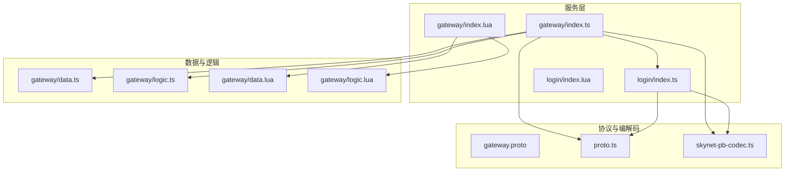
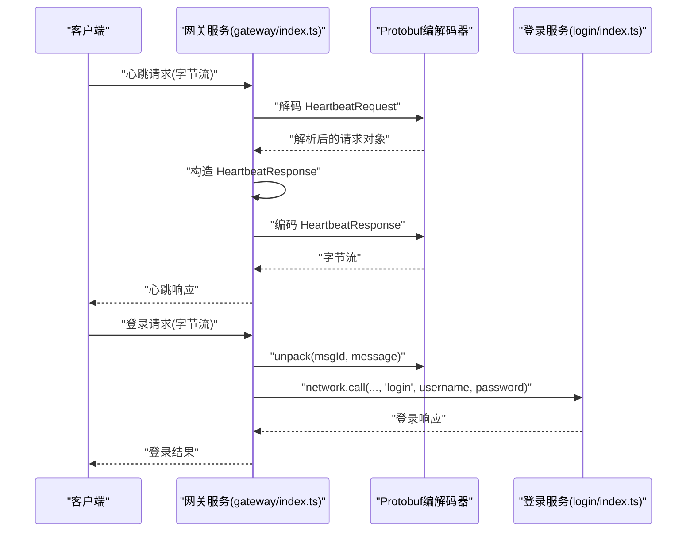
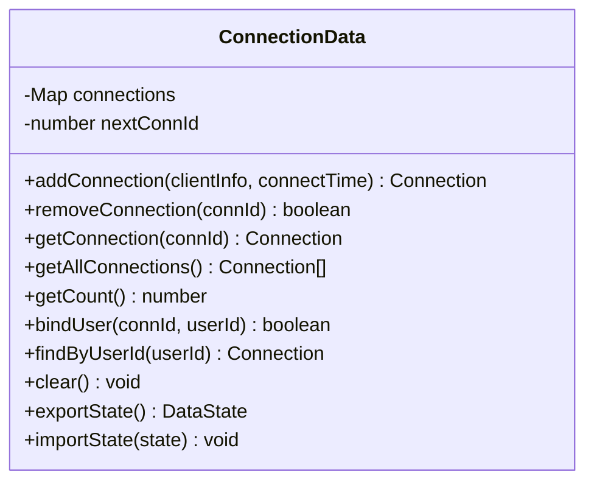
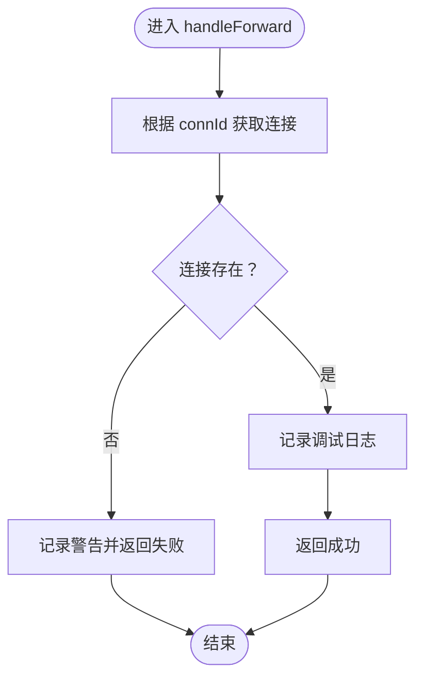
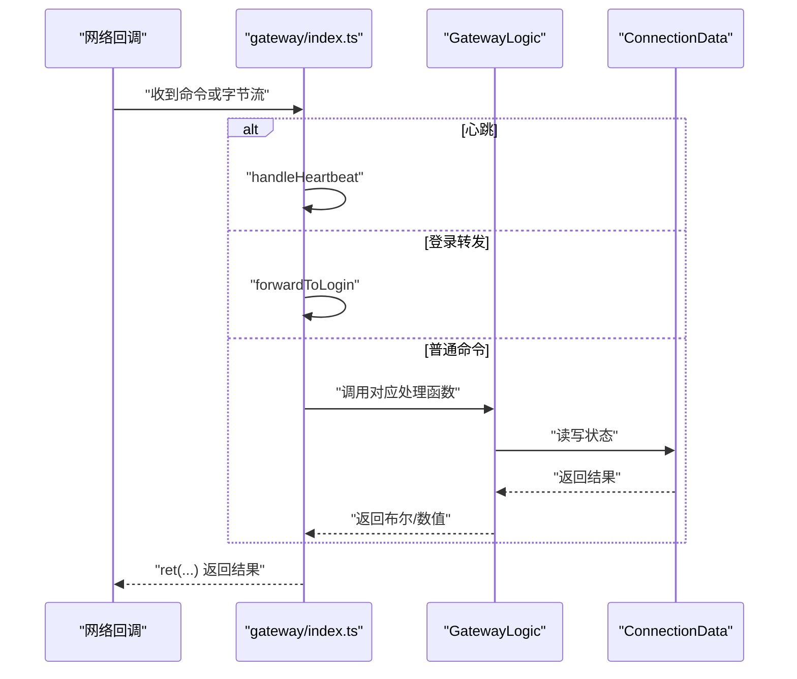
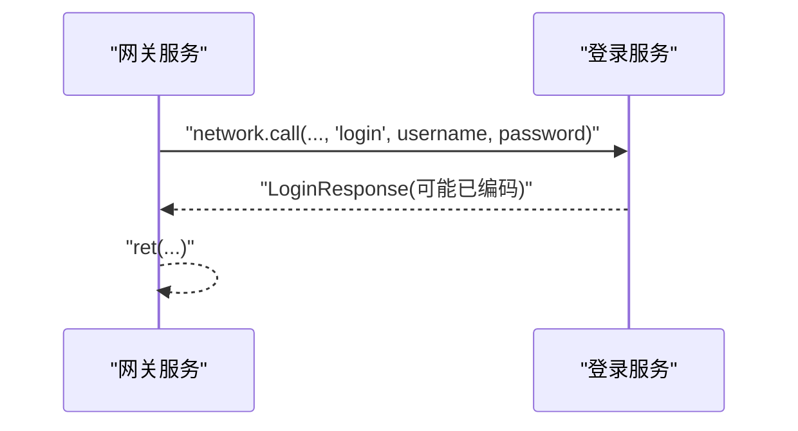
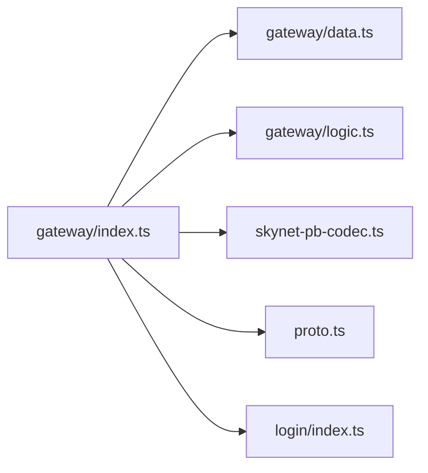

# 网关服务

<cite>
**本文引用的文件**
- [gateway/index.ts](file://server/src/app/services/gateway/index.ts)
- [gateway/data.ts](file://server/src/app/services/gateway/data.ts)
- [gateway/logic.ts](file://server/src/app/services/gateway/logic.ts)
- [gateway/types.ts](file://server/src/app/services/gateway/types.ts)
- [gateway.proto](file://protocols/proto/gateway.proto)
- [proto.ts](file://server/src/protos/proto.ts)
- [skynet-pb-codec.ts](file://server/src/framework/runtime/skynet-pb-codec.ts)
- [login/index.ts](file://server/src/app/services/login/index.ts)
- [gateway/index.lua](file://docker/lua/app/services/gateway/index.lua)
- [gateway/data.lua](file://docker/lua/app/services/gateway/data.lua)
- [gateway/logic.lua](file://docker/lua/app/services/gateway/logic.lua)
- [login/index.lua](file://docker/lua/app/services/login/index.lua)
</cite>

## 目录
1. [简介](#简介)
2. [项目结构](#项目结构)
3. [核心组件](#核心组件)
4. [架构总览](#架构总览)
5. [详细组件分析](#详细组件分析)
6. [依赖关系分析](#依赖关系分析)
7. [性能考量](#性能考量)
8. [故障排查指南](#故障排查指南)
9. [结论](#结论)
10. [附录](#附录)

## 简介
本文件系统化阐述网关服务在游戏服务器中的核心定位与实现细节，重点覆盖以下方面：
- 作为客户端接入入口的职责：连接管理、消息转发、用户绑定
- 数据层与逻辑层的职责分离：数据层不支持热更新、逻辑层支持热更新的架构考量
- 命令处理函数：handleConnect、handleDisconnect、handleForward、handleBindUser 等的实现原理与使用场景
- Protobuf 消息处理流程：心跳包处理、登录请求转发
- 服务启动流程、消息路由机制与错误处理策略
- 与登录服务的交互模式与扩展实践（自定义消息处理、连接状态监控）

## 项目结构
网关服务位于 server/src/app/services/gateway 目录，采用 TypeScript 实现，并通过 TypeScriptToLua 编译为 Lua 运行于 Skynet 环境。同时提供 docker/lua 目录下的 Lua 源码，便于理解编译后的实现。



**图表来源**
- [gateway/index.ts:1-206](file://server/src/app/services/gateway/index.ts#L1-L206)
- [gateway/index.lua:1-225](file://docker/lua/app/services/gateway/index.lua#L1-L225)
- [login/index.ts:1-154](file://server/src/app/services/login/index.ts#L1-L154)
- [login/index.lua:1-162](file://docker/lua/app/services/login/index.lua#L1-L162)
- [gateway.proto:1-70](file://protocols/proto/gateway.proto#L1-L70)
- [proto.ts:1-333](file://server/src/protos/proto.ts#L1-L333)
- [skynet-pb-codec.ts:1-184](file://server/src/framework/runtime/skynet-pb-codec.ts#L1-L184)

**章节来源**
- [gateway/index.ts:1-206](file://server/src/app/services/gateway/index.ts#L1-L206)
- [gateway/index.lua:1-225](file://docker/lua/app/services/gateway/index.lua#L1-L225)

## 核心组件
- 数据层（ConnectionData）：负责连接状态的持久化存储，不参与业务逻辑，保证热更新不影响运行时状态
- 逻辑层（GatewayLogic）：封装业务逻辑，通过依赖注入使用数据层，支持热更新
- 协议与编解码：基于 Protobuf 的消息定义与编码器，支持 Skynet 环境下的打包/解包
- 服务入口：统一的消息分发与命令处理，包含心跳与登录请求转发示例

**章节来源**
- [gateway/data.ts:1-115](file://server/src/app/services/gateway/data.ts#L1-L115)
- [gateway/logic.ts:1-148](file://server/src/app/services/gateway/logic.ts#L1-L148)
- [gateway/types.ts:1-145](file://server/src/app/services/gateway/types.ts#L1-L145)
- [gateway/index.ts:1-206](file://server/src/app/services/gateway/index.ts#L1-L206)
- [proto.ts:1-333](file://server/src/protos/proto.ts#L1-L333)
- [skynet-pb-codec.ts:1-184](file://server/src/framework/runtime/skynet-pb-codec.ts#L1-L184)

## 架构总览
网关服务采用“数据层 + 逻辑层”的双层架构，入口负责消息分发与特殊协议处理（心跳、登录），逻辑层执行业务操作并通过数据层维护状态。Protobuf 编解码器在 Skynet 环境下加载 proto 描述文件，实现跨服务的强类型消息通信。



**图表来源**
- [gateway/index.ts:111-167](file://server/src/app/services/gateway/index.ts#L111-L167)
- [login/index.ts:46-61](file://server/src/app/services/login/index.ts#L46-L61)
- [skynet-pb-codec.ts:146-182](file://server/src/framework/runtime/skynet-pb-codec.ts#L146-L182)

## 详细组件分析

### 数据层：ConnectionData
职责与特性
- 维护连接映射与下一个连接 ID
- 提供连接的增删查、用户绑定、导出/导入状态等能力
- 不支持热更新，确保状态一致性

关键方法与复杂度
- addConnection/removeConnection/getConnection：基于 Map，平均 O(1)
- bindUser/findConnectionByUserId：遍历 Map，最坏 O(n)
- exportState/importState：序列化/反序列化状态，O(n)



**图表来源**
- [gateway/data.ts:15-114](file://server/src/app/services/gateway/data.ts#L15-L114)

**章节来源**
- [gateway/data.ts:1-115](file://server/src/app/services/gateway/data.ts#L1-L115)

### 逻辑层：GatewayLogic
职责与特性
- 通过依赖注入使用数据层，不持有状态，支持热更新
- 提供连接、断开、转发、绑定、广播、踢人等业务逻辑

关键流程
- handleConnect：新增连接并返回 connId
- handleDisconnect：移除连接并返回布尔结果
- handleForward：根据 connId 进行消息转发（可扩展为按 userId 路由）
- handleBindUser：将用户 ID 绑定到连接
- broadcast/kickConnection：广播与踢人



**图表来源**
- [gateway/logic.ts:59-77](file://server/src/app/services/gateway/logic.ts#L59-L77)

**章节来源**
- [gateway/logic.ts:1-148](file://server/src/app/services/gateway/logic.ts#L1-L148)

### 类型系统：gateway/types.ts
- 定义 ClientInfo、Connection、MessageType、Message、AnyMessage 等类型
- 为数据层与逻辑层提供类型安全的契约

**章节来源**
- [gateway/types.ts:1-145](file://server/src/app/services/gateway/types.ts#L1-L145)

### 协议与编解码：gateway.proto 与 proto.ts
- gateway.proto 定义了心跳、连接、断开等消息结构
- proto.ts 提供 Node/Lua 环境下的简化 Protobuf 实现与消息工厂
- skynet-pb-codec.ts 在 Skynet 环境下加载 .desc 描述文件，实现 pack/unpack 与 encode/decode

```mermaid
erDiagram
HEARTBEAT_REQUEST {
uint64 client_time
}
HEARTBEAT_RESPONSE {
uint64 server_time
uint32 online_count
}
CONNECT_REQUEST {
ClientInfo client_info
string token
}
CONNECT_RESPONSE {
common.ErrorCode code
string message
uint32 conn_id
uint64 server_time
}
DISCONNECT_NOTIFY {
uint32 conn_id
string reason
}
```

**图表来源**
- [gateway.proto:10-57](file://protocols/proto/gateway.proto#L10-L57)
- [proto.ts:80-104](file://server/src/protos/proto.ts#L80-L104)

**章节来源**
- [gateway.proto:1-70](file://protocols/proto/gateway.proto#L1-L70)
- [proto.ts:1-333](file://server/src/protos/proto.ts#L1-L333)
- [skynet-pb-codec.ts:37-182](file://server/src/framework/runtime/skynet-pb-codec.ts#L37-L182)

### 服务入口与消息分发：gateway/index.ts
- 启动阶段注册网络回调，区分命令与特殊协议处理
- 特殊处理：心跳（字节流解码）、登录转发（unpack + network.call）
- 命令分发：connect/disconnect/forward/bind_user/broadcast/kick/get_state 等



**图表来源**
- [gateway/index.ts:172-193](file://server/src/app/services/gateway/index.ts#L172-L193)
- [gateway/index.ts:24-106](file://server/src/app/services/gateway/index.ts#L24-L106)
- [gateway/index.ts:111-167](file://server/src/app/services/gateway/index.ts#L111-L167)

**章节来源**
- [gateway/index.ts:1-206](file://server/src/app/services/gateway/index.ts#L1-L206)

### 与登录服务的交互：login/index.ts
- 提供 login/logout/getUserInfo/validateToken 等命令处理
- 通过 codec 将响应序列化为 Protobuf 字节流返回
- 网关服务通过 network.call 调用登录服务并返回结果



**图表来源**
- [gateway/index.ts:138-167](file://server/src/app/services/gateway/index.ts#L138-L167)
- [login/index.ts:46-61](file://server/src/app/services/login/index.ts#L46-L61)

**章节来源**
- [login/index.ts:1-154](file://server/src/app/services/login/index.ts#L1-L154)

## 依赖关系分析
- 网关服务依赖：
  - 数据层（ConnectionData）：提供状态存储
  - 逻辑层（GatewayLogic）：提供业务逻辑
  - Protobuf 编解码器（skynet-pb-codec.ts）：提供 pack/unpack 与 encode/decode
  - 协议定义（gateway.proto 与 proto.ts）：提供消息结构与工厂
  - 登录服务：用于登录请求的转发与验证



**图表来源**
- [gateway/index.ts:7-13](file://server/src/app/services/gateway/index.ts#L7-L13)
- [gateway/data.ts:7-9](file://server/src/app/services/gateway/data.ts#L7-L9)
- [gateway/logic.ts:7-9](file://server/src/app/services/gateway/logic.ts#L7-L9)
- [skynet-pb-codec.ts:11-21](file://server/src/framework/runtime/skynet-pb-codec.ts#L11-L21)
- [proto.ts:154-283](file://server/src/protos/proto.ts#L154-L283)
- [login/index.ts:7-14](file://server/src/app/services/login/index.ts#L7-L14)

**章节来源**
- [gateway/index.ts:1-206](file://server/src/app/services/gateway/index.ts#L1-L206)
- [gateway/data.ts:1-115](file://server/src/app/services/gateway/data.ts#L1-L115)
- [gateway/logic.ts:1-148](file://server/src/app/services/gateway/logic.ts#L1-L148)
- [skynet-pb-codec.ts:1-184](file://server/src/framework/runtime/skynet-pb-codec.ts#L1-L184)
- [proto.ts:1-333](file://server/src/protos/proto.ts#L1-L333)
- [login/index.ts:1-154](file://server/src/app/services/login/index.ts#L1-L154)

## 性能考量
- 数据层使用 Map 存储连接，增删查平均 O(1)，适合高并发连接管理
- 用户绑定与按用户查找为 O(n) 遍历，建议在用户量较大时引入索引优化
- Protobuf 编解码在 Skynet 环境下通过 lua-protobuf 实现，性能稳定；注意描述文件加载与缓存
- 服务需维持活跃协程（keepAlive）避免被 Skynet 回收

[本节为通用指导，无需列出具体文件来源]

## 故障排查指南
常见问题与处理
- Codec 不可用：心跳与登录转发会记录警告并返回失败，检查 Skynet 环境是否正确加载 lua-protobuf
- 连接不存在：handleDisconnect/handleForward 在找不到连接时记录警告并返回失败
- 网络回调异常：入口处对命令处理进行 try/catch 包裹，记录错误并回传错误信息
- 登录服务不可达：forwardToLogin 通过 network.call 调用，若目标服务未启动或返回异常，需检查登录服务状态

**章节来源**
- [gateway/index.ts:111-167](file://server/src/app/services/gateway/index.ts#L111-L167)
- [gateway/logic.ts:36-54](file://server/src/app/services/gateway/logic.ts#L36-L54)

## 结论
网关服务通过清晰的“数据层 + 逻辑层”分离，实现了稳定的连接状态管理与灵活的业务逻辑扩展。结合 Protobuf 编解码与 Skynet 环境，能够高效地处理心跳与登录等关键消息，并与登录服务形成可靠的协作模式。该架构既满足了热更新需求，又保证了运行时状态的持久性与一致性。

[本节为总结性内容，无需列出具体文件来源]

## 附录

### 命令处理函数详解
- handleConnect
  - 输入：ClientInfo
  - 行为：在数据层新增连接并返回 connId
  - 返回：连接成功与否
  - 示例路径：[gateway/index.ts:26-43](file://server/src/app/services/gateway/index.ts#L26-L43)、[gateway/logic.ts:21-31](file://server/src/app/services/gateway/logic.ts#L21-L31)
- handleDisconnect
  - 输入：connId
  - 行为：移除连接并返回布尔结果
  - 返回：断开成功与否
  - 示例路径：[gateway/index.ts:45-60](file://server/src/app/services/gateway/index.ts#L45-L60)、[gateway/logic.ts:36-54](file://server/src/app/services/gateway/logic.ts#L36-L54)
- handleForward
  - 输入：connId, AnyMessage
  - 行为：根据 connId 查找连接并转发（可扩展为按 userId 路由）
  - 返回：转发成功与否
  - 示例路径：[gateway/index.ts:62-67](file://server/src/app/services/gateway/index.ts#L62-L67)、[gateway/logic.ts:59-77](file://server/src/app/services/gateway/logic.ts#L59-L77)
- handleBindUser
  - 输入：connId, userId
  - 行为：将用户 ID 绑定到连接
  - 返回：绑定成功与否
  - 示例路径：[gateway/index.ts:69-74](file://server/src/app/services/gateway/index.ts#L69-L74)、[gateway/logic.ts:82-90](file://server/src/app/services/gateway/logic.ts#L82-L90)

### Protobuf 消息处理流程
- 心跳处理
  - 步骤：解码 HeartbeatRequest -> 构造 HeartbeatResponse -> 编码返回
  - 示例路径：[gateway/index.ts:111-133](file://server/src/app/services/gateway/index.ts#L111-L133)、[skynet-pb-codec.ts:146-182](file://server/src/framework/runtime/skynet-pb-codec.ts#L146-L182)
- 登录请求转发
  - 步骤：unpack(msgId, message) -> 校验消息类型 -> 调用登录服务 -> 返回结果
  - 示例路径：[gateway/index.ts:138-167](file://server/src/app/services/gateway/index.ts#L138-L167)、[login/index.ts:46-61](file://server/src/app/services/login/index.ts#L46-L61)

### 服务启动流程
- 启动回调必须为同步函数（Skynet 要求）
- 注册网络回调，区分命令与字节流处理
- 启动 keepAlive 协程保持服务活跃
- 示例路径：[gateway/index.ts:172-206](file://server/src/app/services/gateway/index.ts#L172-L206)

### 错误处理策略
- 入口层：对命令处理进行 try/catch，记录错误并回传错误信息
- 逻辑层：对连接不存在等边界条件进行显式判断与日志记录
- 编解码层：在 Codec 不可用或解码失败时抛出错误并记录日志
- 示例路径：[gateway/index.ts:189-192](file://server/src/app/services/gateway/index.ts#L189-L192)、[gateway/logic.ts:36-54](file://server/src/app/services/gateway/logic.ts#L36-L54)

### 扩展实践示例（路径指引）
- 自定义消息处理
  - 在入口命令分发中增加新命令分支，参考：[gateway/index.ts:24-106](file://server/src/app/services/gateway/index.ts#L24-L106)
- 连接状态监控
  - 使用 get_state 导出状态，参考：[gateway/index.ts:96-100](file://server/src/app/services/gateway/index.ts#L96-L100)、[gateway/data.ts:96-113](file://server/src/app/services/gateway/data.ts#L96-L113)
- 按用户路由转发
  - 在 handleForward 中根据 userId 查找目标服务，参考：[gateway/logic.ts:59-77](file://server/src/app/services/gateway/logic.ts#L59-L77)、[gateway/logic.ts:109-111](file://server/src/app/services/gateway/logic.ts#L109-L111)