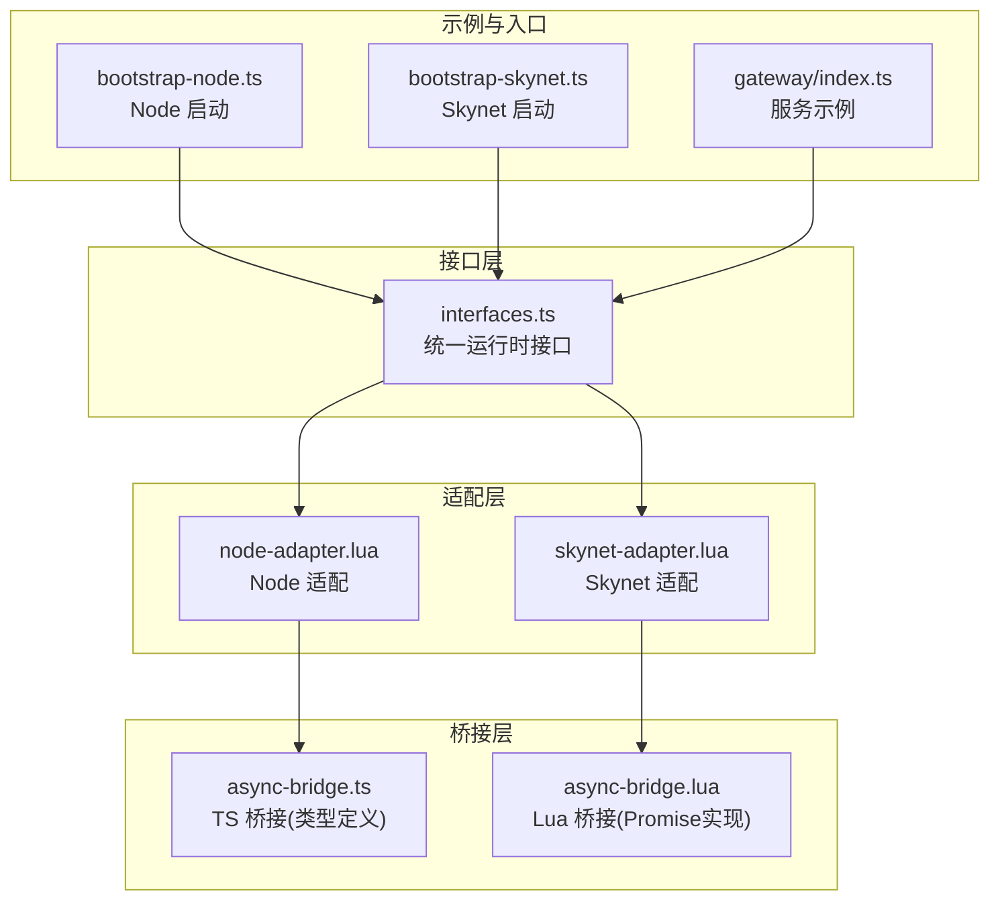
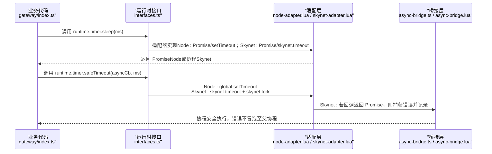
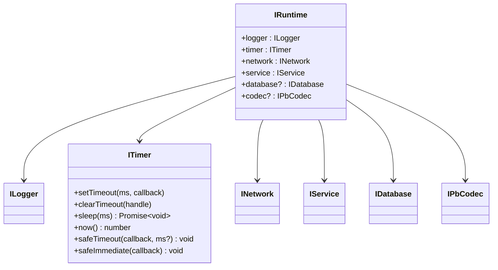
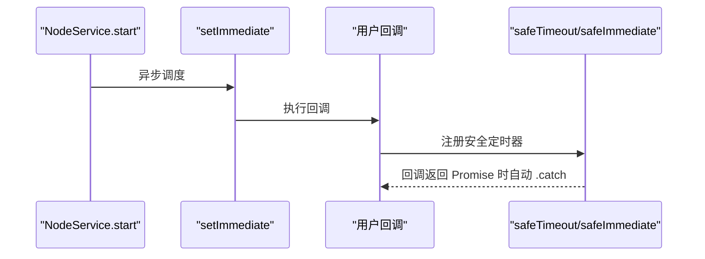
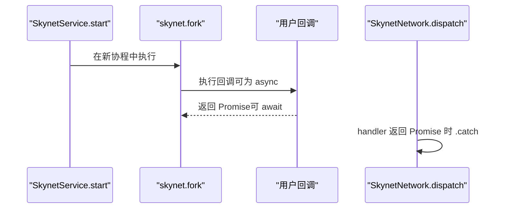
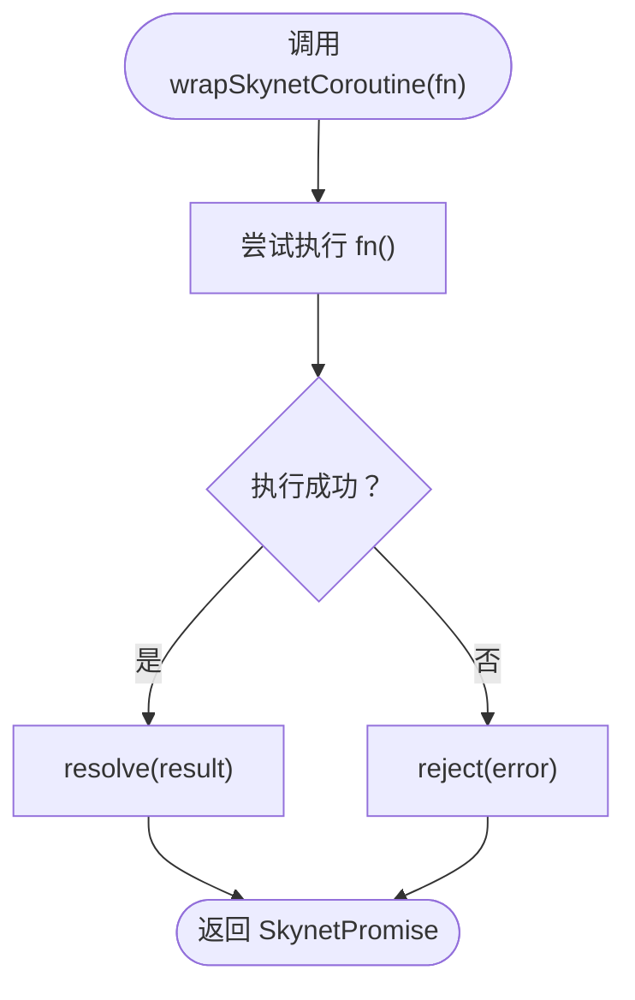
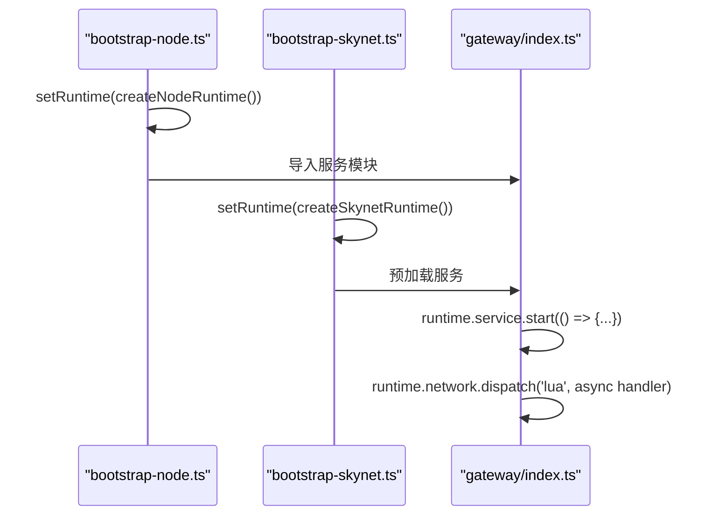
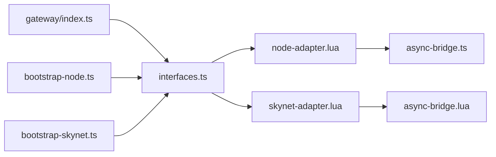

# 异步模型统一

<cite>
**本文引用的文件**
- [TS-Skynet 异步编程规范.md](file://docs/TS-Skynet 异步编程规范.md)
- [async-bridge.ts](file://server/src/framework/runtime/async-bridge.ts)
- [async-bridge.lua](file://docker/lua/framework/runtime/async-bridge.lua)
- [interfaces.ts](file://server/src/framework/core/interfaces.ts)
- [skynet-adapter.lua](file://docker/lua/framework/runtime/skynet-adapter.lua)
- [node-adapter.lua](file://docker/lua/framework/runtime/node-adapter.lua)
- [bootstrap-node.ts](file://server/src/app/bootstrap-node.ts)
- [bootstrap-skynet.ts](file://server/src/app/bootstrap-skynet.ts)
- [gateway/index.ts](file://server/src/app/services/gateway/index.ts)
</cite>

## 目录
1. [简介](#简介)
2. [项目结构](#项目结构)
3. [核心组件](#核心组件)
4. [架构总览](#架构总览)
5. [详细组件分析](#详细组件分析)
6. [依赖关系分析](#依赖关系分析)
7. [性能考量](#性能考量)
8. [故障排查指南](#故障排查指南)
9. [结论](#结论)
10. [附录](#附录)

## 简介
本文件面向 TS-Skynet 框架，系统化阐述如何在 Node.js 的 Promise 与 Skynet 的协程模型之间建立统一的异步编程接口。重点覆盖：
- async/await 在不同运行时的映射机制
- safeTimeout、safeImmediate 等协程安全方法的设计原理
- 异步桥接器（AsyncBridge）如何处理回调函数、Promise 包装与错误传播
- 异步编程最佳实践（错误处理、超时管理、资源清理）
- 业务代码示例路径与常见陷阱规避

## 项目结构
围绕“统一异步模型”的关键文件组织如下：
- 接口层：定义跨环境一致的运行时接口，屏蔽 Node/Skynet 差异
- 适配层：分别实现 Node 与 Skynet 的日志、定时器、网络、服务等能力
- 桥接层：提供 Skynet 环境下的 Promise 实现与协程包装工具
- 示例与规范：给出服务启动、消息处理、定时器使用的正确范式

图表来源
- [interfaces.ts:189-226](file://server/src/framework/core/interfaces.ts#L189-L226)
- [node-adapter.lua:185-207](file://docker/lua/framework/runtime/node-adapter.lua#L185-L207)
- [skynet-adapter.lua:205-227](file://docker/lua/framework/runtime/skynet-adapter.lua#L205-L227)
- [async-bridge.ts:1-208](file://server/src/framework/runtime/async-bridge.ts#L1-L208)
- [async-bridge.lua:1-243](file://docker/lua/framework/runtime/async-bridge.lua#L1-L243)
- [bootstrap-node.ts:1-22](file://server/src/app/bootstrap-node.ts#L1-L22)
- [bootstrap-skynet.ts:1-20](file://server/src/app/bootstrap-skynet.ts#L1-L20)
- [gateway/index.ts:1-206](file://server/src/app/services/gateway/index.ts#L1-L206)

章节来源
- [interfaces.ts:1-226](file://server/src/framework/core/interfaces.ts#L1-L226)
- [node-adapter.lua:1-207](file://docker/lua/framework/runtime/node-adapter.lua#L1-L207)
- [skynet-adapter.lua:1-227](file://docker/lua/framework/runtime/skynet-adapter.lua#L1-L227)
- [async-bridge.ts:1-208](file://server/src/framework/runtime/async-bridge.ts#L1-L208)
- [async-bridge.lua:1-243](file://docker/lua/framework/runtime/async-bridge.lua#L1-L243)
- [bootstrap-node.ts:1-22](file://server/src/app/bootstrap-node.ts#L1-L22)
- [bootstrap-skynet.ts:1-20](file://server/src/app/bootstrap-skynet.ts#L1-L20)
- [gateway/index.ts:1-206](file://server/src/app/services/gateway/index.ts#L1-L206)

## 核心组件
- 统一运行时接口（IRuntime）：封装 logger、timer、network、service、database、codec 等能力，屏蔽底层差异
- Node 适配：提供 Node 环境下的日志、定时器（含 safeTimeout/safeImmediate）、网络、服务等实现
- Skynet 适配：提供 Skynet 环境下的日志、定时器（含 safeTimeout/safeImmediate）、网络、服务等实现
- AsyncBridge（TS/Lua）：在 Skynet 环境下提供 Promise 实现与协程包装，使 async/await 与 Skynet 协程无缝衔接
- 规范与示例：约束 service.start 必须同步、dispatch 可用 async；演示 keep-alive 循环、消息处理与错误捕获

章节来源
- [interfaces.ts:189-226](file://server/src/framework/core/interfaces.ts#L189-L226)
- [node-adapter.lua:14-207](file://docker/lua/framework/runtime/node-adapter.lua#L14-L207)
- [skynet-adapter.lua:16-227](file://docker/lua/framework/runtime/skynet-adapter.lua#L16-L227)
- [async-bridge.ts:1-208](file://server/src/framework/runtime/async-bridge.ts#L1-L208)
- [async-bridge.lua:15-243](file://docker/lua/framework/runtime/async-bridge.lua#L15-L243)
- [TS-Skynet 异步编程规范.md:94-130](file://docs/TS-Skynet 异步编程规范.md#L94-L130)
- [gateway/index.ts:170-206](file://server/src/app/services/gateway/index.ts#L170-L206)

## 架构总览
TS-Skynet 通过“接口层 + 适配层 + 桥接层”实现跨运行时的统一异步模型：
- Node 环境：async/await 直接映射 ES Promise，safeTimeout/safeImmediate 使用全局 setTimeout/setImmediate
- Skynet 环境：TSTL 将 async/await 转换为协程，桥接层提供 SkynetPromise 与 wrapSkynetCoroutine，确保 await 正确 yield/resume
- 业务代码仅依赖 interfaces.ts 中的 IRuntime，无需感知底层差异

图表来源
- [interfaces.ts:19-58](file://server/src/framework/core/interfaces.ts#L19-L58)
- [node-adapter.lua:38-86](file://docker/lua/framework/runtime/node-adapter.lua#L38-L86)
- [skynet-adapter.lua:109-127](file://docker/lua/framework/runtime/skynet-adapter.lua#L109-L127)
- [async-bridge.lua:206-224](file://docker/lua/framework/runtime/async-bridge.lua#L206-L224)

章节来源
- [interfaces.ts:1-226](file://server/src/framework/core/interfaces.ts#L1-L226)
- [node-adapter.lua:1-207](file://docker/lua/framework/runtime/node-adapter.lua#L1-L207)
- [skynet-adapter.lua:1-227](file://docker/lua/framework/runtime/skynet-adapter.lua#L1-L227)
- [async-bridge.ts:1-208](file://server/src/framework/runtime/async-bridge.ts#L1-L208)
- [async-bridge.lua:1-243](file://docker/lua/framework/runtime/async-bridge.lua#L1-L243)

## 详细组件分析

### 组件一：接口层（IRuntime 与 ITimer）
- 设计要点
  - 将日志、定时器、网络、服务等能力抽象为统一接口，业务代码只依赖接口
  - ITimer 提供 setTimeout/clearTimeout/sleep/now，以及协程安全的 safeTimeout/safeImmediate
- 与运行时的关系
  - Node 适配：基于全局 setTimeout/setImmediate 实现
  - Skynet 适配：基于 skynet.timeout/fork 实现，保证回调在协程中执行

图表来源
- [interfaces.ts:189-226](file://server/src/framework/core/interfaces.ts#L189-L226)
- [interfaces.ts:19-58](file://server/src/framework/core/interfaces.ts#L19-L58)

章节来源
- [interfaces.ts:1-226](file://server/src/framework/core/interfaces.ts#L1-L226)

### 组件二：Node 适配（NodeAdapter）
- 设计要点
  - NodeTimer：setTimeout/clearTimeout 直接映射到全局 API；sleep 通过 __TS__Promise 与 setTimeout 实现；safeTimeout/safeImmediate 在回调返回 Promise 时自动捕获错误
  - NodeNetwork：基于 Map 维护 handlers/pendingCalls，模拟 call/ret 流程
  - NodeService：start 使用 setImmediate 包裹回调，确保在异步队列中执行
- 与规范的对应
  - 遵循“service.start 必须同步”的约束，start 内部通过 setImmediate 异步执行用户回调

图表来源
- [node-adapter.lua:148-163](file://docker/lua/framework/runtime/node-adapter.lua#L148-L163)
- [node-adapter.lua:64-86](file://docker/lua/framework/runtime/node-adapter.lua#L64-L86)

章节来源
- [node-adapter.lua:1-207](file://docker/lua/framework/runtime/node-adapter.lua#L1-L207)

### 组件三：Skynet 适配（SkynetAdapter）
- 设计要点
  - SkynetTimer：setTimeout 将毫秒转换为“厘秒”传给 skynet.timeout；sleep 返回 Promise，内部使用 skynet.timeout；safeTimeout 使用 skynet.fork 包裹回调，确保内部 async/await 正常工作
  - SkynetNetwork：dispatch 内对 handler 的 Promise 结果进行 .catch 错误处理
  - SkynetService：start 使用 skynet.fork 包裹回调，避免服务启动阶段阻塞消息循环
- 与规范的对应
  - 遵循“service.start 必须同步”，start 内部 fork 新协程执行用户回调

图表来源
- [skynet-adapter.lua:174-184](file://docker/lua/framework/runtime/skynet-adapter.lua#L174-L184)
- [skynet-adapter.lua:148-163](file://docker/lua/framework/runtime/skynet-adapter.lua#L148-L163)
- [skynet-adapter.lua:109-127](file://docker/lua/framework/runtime/skynet-adapter.lua#L109-L127)

章节来源
- [skynet-adapter.lua:1-227](file://docker/lua/framework/runtime/skynet-adapter.lua#L1-L227)

### 组件四：异步桥接器（AsyncBridge）
- 设计要点（TS）
  - SkynetPromise：在 Skynet 环境下提供 Promise 行为，支持 then/catch/static.all，并在回调抛错时忽略（避免破坏协程）
  - wrapSkynetCoroutine：将任意函数包装为 Promise，内部由 TSTL 负责协程的 yield/resume
  - sleep：在 Node 环境返回 ES Promise，在 Skynet 环境返回 SkynetPromise（由 TSTL 转换为 skynet.sleep）
- 设计要点（Lua）
  - SkynetPromise：完整实现 then/catch/all，内部使用 __TS__AsyncAwaiterSkynet/__TS__AwaitSkynet 与协程交互
  - wrapSkynetCoroutine：将函数执行结果包装为 SkynetPromise
  - sleep：运行时检测环境，Node 环境使用 __TS__Promise + setTimeout，Skynet 环境返回空 Promise（由 TSTL 转换）

图表来源
- [async-bridge.ts:175-186](file://server/src/framework/runtime/async-bridge.ts#L175-L186)
- [async-bridge.lua:206-224](file://docker/lua/framework/runtime/async-bridge.lua#L206-L224)

章节来源
- [async-bridge.ts:1-208](file://server/src/framework/runtime/async-bridge.ts#L1-L208)
- [async-bridge.lua:1-243](file://docker/lua/framework/runtime/async-bridge.lua#L1-L243)

### 组件五：入口与示例（Bootstrap 与 Gateway）
- Bootstrap（Node）
  - 设置运行时为 Node 适配，随后导入服务模块，触发顶层 service.start 异步启动
- Bootstrap（Skynet）
  - 设置运行时为 Skynet 适配，预加载服务模块，Skynet 通过 runtime.service.start 启动
- Gateway 示例
  - service.start 必须同步；dispatch 回调可为 async；通过 keepAlive 循环维持服务活跃

图表来源
- [bootstrap-node.ts:1-22](file://server/src/app/bootstrap-node.ts#L1-L22)
- [bootstrap-skynet.ts:1-20](file://server/src/app/bootstrap-skynet.ts#L1-L20)
- [gateway/index.ts:170-206](file://server/src/app/services/gateway/index.ts#L170-L206)

章节来源
- [bootstrap-node.ts:1-22](file://server/src/app/bootstrap-node.ts#L1-L22)
- [bootstrap-skynet.ts:1-20](file://server/src/app/bootstrap-skynet.ts#L1-L20)
- [gateway/index.ts:1-206](file://server/src/app/services/gateway/index.ts#L1-L206)

## 依赖关系分析
- 接口层依赖适配层提供的具体实现
- 适配层依赖桥接层在 Skynet 环境下的 Promise/协程能力
- 业务代码仅依赖接口层，不直接依赖 Node/Skynet API

图表来源
- [interfaces.ts:189-226](file://server/src/framework/core/interfaces.ts#L189-L226)
- [node-adapter.lua:185-207](file://docker/lua/framework/runtime/node-adapter.lua#L185-L207)
- [skynet-adapter.lua:205-227](file://docker/lua/framework/runtime/skynet-adapter.lua#L205-L227)
- [async-bridge.ts:1-208](file://server/src/framework/runtime/async-bridge.ts#L1-L208)
- [async-bridge.lua:1-243](file://docker/lua/framework/runtime/async-bridge.lua#L1-L243)
- [gateway/index.ts:1-206](file://server/src/app/services/gateway/index.ts#L1-L206)
- [bootstrap-node.ts:1-22](file://server/src/app/bootstrap-node.ts#L1-L22)
- [bootstrap-skynet.ts:1-20](file://server/src/app/bootstrap-skynet.ts#L1-L20)

章节来源
- [interfaces.ts:1-226](file://server/src/framework/core/interfaces.ts#L1-L226)
- [node-adapter.lua:1-207](file://docker/lua/framework/runtime/node-adapter.lua#L1-L207)
- [skynet-adapter.lua:1-227](file://docker/lua/framework/runtime/skynet-adapter.lua#L1-L227)
- [async-bridge.ts:1-208](file://server/src/framework/runtime/async-bridge.ts#L1-L208)
- [async-bridge.lua:1-243](file://docker/lua/framework/runtime/async-bridge.lua#L1-L243)

## 性能考量
- safeTimeout 高频调用可能频繁创建协程，需评估性能影响
- Skynet 定时器单位为“厘秒”，计算时应避免精度损失
- Promise.all 在 Skynet 下通过协程并发执行，注意错误传播与资源释放
- keepAlive 循环应避免过短周期导致 CPU 占用过高

## 故障排查指南
- “服务启动后立即退出”
  - 检查是否在 service.start 中使用了 async；应改为同步回调并在内部启动异步流程
  - 参考：[TS-Skynet 异步编程规范.md:94-130](file://docs/TS-Skynet 异步编程规范.md#L94-L130)
- “dispatch 中使用 .then() 导致崩溃”
  - 必须改用 async/await；回调在协程管理下执行
  - 参考：[TS-Skynet 异步编程规范.md:20-62](file://docs/TS-Skynet 异步编程规范.md#L20-L62)
- “safeTimeout 内部 async/await 无效”
  - 确认使用 runtime.timer.safeTimeout；Node 环境直接映射全局 API，Skynet 环境通过 skynet.fork 包裹
  - 参考：[skynet-adapter.lua:109-127](file://docker/lua/framework/runtime/skynet-adapter.lua#L109-L127)
- “错误未被捕获”
  - Node：safeTimeout/safeImmediate 会在回调返回 Promise 时自动 .catch
  - Skynet：dispatch 与 service.start 的 Promise 结果会 .catch 并记录
  - 参考：[node-adapter.lua:64-86](file://docker/lua/framework/runtime/node-adapter.lua#L64-L86), [skynet-adapter.lua:148-163](file://docker/lua/framework/runtime/skynet-adapter.lua#L148-L163)

章节来源
- [TS-Skynet 异步编程规范.md:20-130](file://docs/TS-Skynet 异步编程规范.md#L20-L130)
- [skynet-adapter.lua:109-163](file://docker/lua/framework/runtime/skynet-adapter.lua#L109-L163)
- [node-adapter.lua:64-86](file://docker/lua/framework/runtime/node-adapter.lua#L64-L86)

## 结论
TS-Skynet 通过接口层抽象、适配层实现与桥接层协同，成功在 Node.js Promise 与 Skynet 协程之间建立了统一的异步编程模型。遵循规范（service.start 同步、dispatch 可 async、使用 safeTimeout/safeImmediate）是保障稳定性的关键；结合 keepAlive 循环与完善的错误处理策略，可在生产环境中可靠运行。

## 附录
- 最佳实践清单
  - service.start 必须同步；内部通过 setImmediate/skynet.fork 启动异步流程
  - dispatch 回调可使用 async/await；对 Promise 结果进行 .catch
  - 使用 runtime.timer.safeTimeout/safeImmediate 替代原生 setTimeout/setImmediate
  - 使用 runtime.timer.sleep 替代原生 sleep；避免 .then() 链式调用
  - 保持服务活跃：通过 keepAlive 循环维持至少一个活跃协程
- 示例路径
  - Node 启动入口：[bootstrap-node.ts:1-22](file://server/src/app/bootstrap-node.ts#L1-L22)
  - Skynet 启动入口：[bootstrap-skynet.ts:1-20](file://server/src/app/bootstrap-skynet.ts#L1-L20)
  - 网关服务示例（含 keepAlive）：[gateway/index.ts:170-206](file://server/src/app/services/gateway/index.ts#L170-L206)
- 规范参考
  - [TS-Skynet 异步编程规范.md:94-130](file://docs/TS-Skynet 异步编程规范.md#L94-L130)
  - [TS-Skynet 异步编程规范.md:142-156](file://docs/TS-Skynet 异步编程规范.md#L142-L156)
  - [TS-Skynet 异步编程规范.md:169-188](file://docs/TS-Skynet 异步编程规范.md#L169-L188)