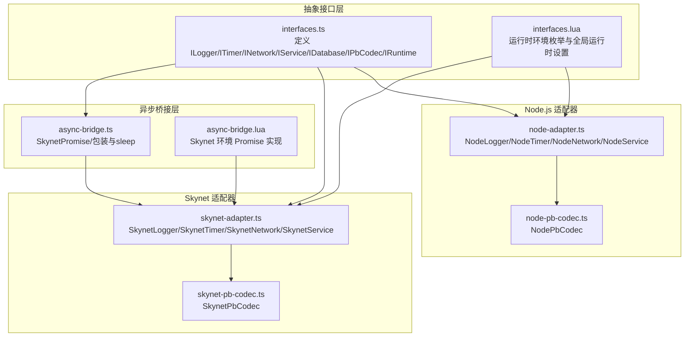
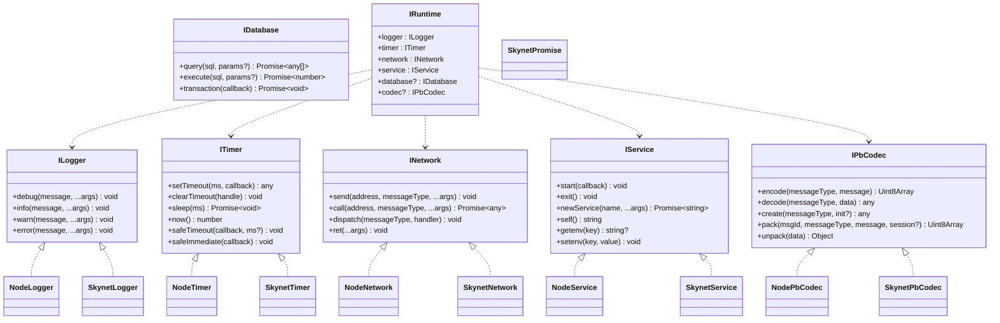
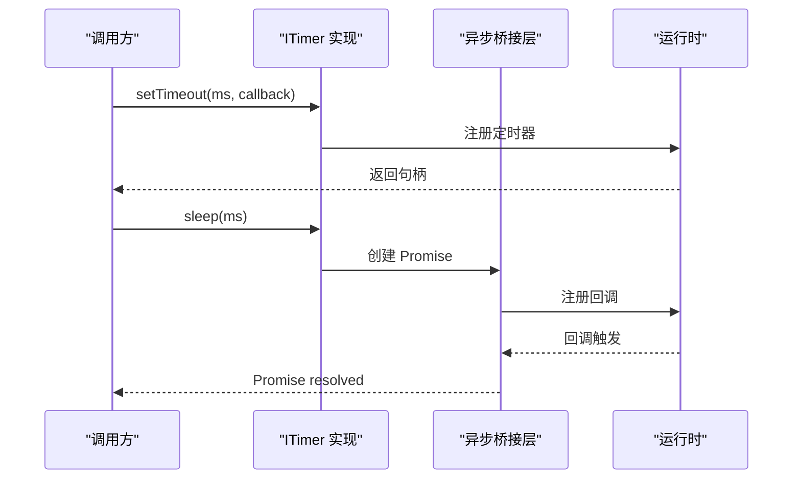
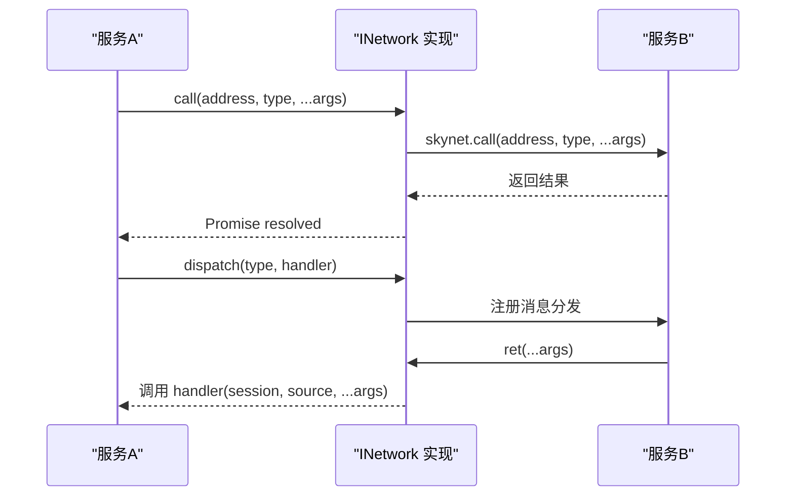
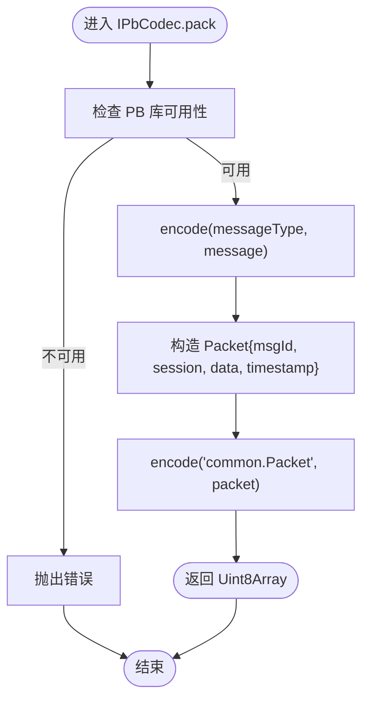
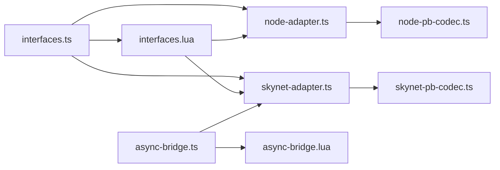

# 接口抽象层

<cite>
**本文档引用的文件**
- [interfaces.ts](file://server/src/framework/core/interfaces.ts)
- [interfaces.lua](file://docker/lua/framework/core/interfaces.lua)
- [node-adapter.ts](file://server/src/framework/runtime/node-adapter.ts)
- [skynet-adapter.ts](file://server/src/framework/runtime/skynet-adapter.ts)
- [node-pb-codec.ts](file://server/src/framework/runtime/node-pb-codec.ts)
- [skynet-pb-codec.ts](file://server/src/framework/runtime/skynet-pb-codec.ts)
- [node-pb-codec.lua](file://docker/lua/framework/runtime/node-pb-codec.lua)
- [skynet-pb-codec.lua](file://docker/lua/framework/runtime/skynet-pb-codec.lua)
- [async-bridge.ts](file://server/src/framework/runtime/async-bridge.ts)
- [async-bridge.lua](file://docker/lua/framework/runtime/async-bridge.lua)
- [node-adapter.lua](file://docker/lua/framework/runtime/node-adapter.lua)
- [skynet-adapter.lua](file://docker/lua/framework/runtime/skynet-adapter.lua)
</cite>

## 目录
1. [简介](#简介)
2. [项目结构](#项目结构)
3. [核心组件](#核心组件)
4. [架构总览](#架构总览)
5. [详细组件分析](#详细组件分析)
6. [依赖关系分析](#依赖关系分析)
7. [性能考量](#性能考量)
8. [故障排查指南](#故障排查指南)
9. [结论](#结论)
10. [附录](#附录)

## 简介
本文件系统化梳理 TS-Skynet 框架的接口抽象层设计与实现，重点覆盖以下核心接口：
- ILogger：日志接口
- ITimer：定时器与异步睡眠接口
- INetwork：跨服务通信接口
- IService：服务生命周期与环境接口
- IDatabase：数据库访问接口（预留）
- IPbCodec：Protocol Buffer 编解码接口

通过统一的接口抽象，屏蔽 Node.js 与 Skynet 两大运行时的差异，提供一致的编程模型。文档同时给出在两种运行时环境中的实现策略、最佳实践、扩展指导以及常见问题排查方法。

## 项目结构
接口抽象层由 TypeScript 定义的接口与运行时适配器组成，配合可选的协议编解码器与异步桥接层，形成完整的跨运行时抽象体系。

**图表来源**
- [interfaces.ts:1-226](file://server/src/framework/core/interfaces.ts#L1-L226)
- [interfaces.lua:1-24](file://docker/lua/framework/core/interfaces.lua#L1-L24)
- [node-adapter.ts:1-194](file://server/src/framework/runtime/node-adapter.ts#L1-L194)
- [skynet-adapter.ts:1-221](file://server/src/framework/runtime/skynet-adapter.ts#L1-L221)
- [node-pb-codec.ts:1-162](file://server/src/framework/runtime/node-pb-codec.ts#L1-L162)
- [skynet-pb-codec.ts:1-184](file://server/src/framework/runtime/skynet-pb-codec.ts#L1-L184)
- [async-bridge.ts:1-208](file://server/src/framework/runtime/async-bridge.ts#L1-L208)
- [async-bridge.lua:1-243](file://docker/lua/framework/runtime/async-bridge.lua#L1-L243)

**章节来源**
- [interfaces.ts:1-226](file://server/src/framework/core/interfaces.ts#L1-L226)
- [interfaces.lua:1-24](file://docker/lua/framework/core/interfaces.lua#L1-L24)

## 核心组件
本节对各接口进行逐项解析，包括方法签名、参数类型、返回值与典型使用场景。

- ILogger（日志接口）
  - 方法
    - debug(message: string, ...args: any[]): void
    - info(message: string, ...args: any[]): void
    - warn(message: string, ...args: any[]): void
    - error(message: string, ...args: any[]): void
  - 用途：统一日志输出，支持多级别日志记录
  - 场景：调试、信息、警告、错误信息输出

- ITimer（定时器与异步睡眠）
  - 方法
    - setTimeout(ms: number, callback: () => void): any
    - clearTimeout(handle: any): void
    - sleep(ms: number): Promise<void>
    - now(): number
    - safeTimeout(callback: () => void | Promise<void>, ms?: number): void
    - safeImmediate(callback: () => void | Promise<void>): void
  - 用途：延迟执行、睡眠、安全的协程执行（Skynet）
  - 场景：定时任务、延时处理、协程安全的异步回调

- INetwork（网络通信）
  - 方法
    - send(address: string, messageType: string, ...args: any[]): void
    - call(address: string, messageType: string, ...args: any[]): Promise<any>
    - dispatch(messageType: string, handler: (session: number, source: string, ...args: any[]) => void | Promise<void>): void
    - ret(...args: any[]): void
  - 用途：服务间消息发送、请求-响应调用、消息分发与返回
  - 场景：网关、登录、游戏等服务间的通信

- IService（服务生命周期）
  - 方法
    - start(callback: () => void | Promise<void>): void
    - exit(): void
    - newService(name: string, ...args: any[]): Promise<string>
    - self(): string
    - getenv(key: string): string | undefined
    - setenv(key: string, value: string): void
  - 用途：服务启动、退出、创建子服务、环境变量读写
  - 场景：服务注册、动态服务创建、配置管理

- IDatabase（数据库接口，预留）
  - 方法
    - query(sql: string, params?: any[]): Promise<any[]>
    - execute(sql: string, params?: any[]): Promise<number>
    - transaction(callback: (db: IDatabase) => Promise<void>): Promise<void>
  - 用途：查询、执行、事务
  - 场景：业务数据读写与事务控制

- IPbCodec（Protocol Buffer 编解码）
  - 方法
    - encode(messageType: string, message: any): Uint8Array
    - decode(messageType: string, data: Uint8Array): any
    - create(messageType: string, init?: any): any
    - pack(msgId: number, messageType: string, message: any, session?: number): Uint8Array
    - unpack(data: Uint8Array): { msgId: number; messageType: string; message: any; session: number }
  - 用途：消息编码、解码、打包、解包
  - 场景：跨语言/跨运行时的消息序列化与反序列化

- IRuntime（运行时上下文）
  - 字段
    - logger: ILogger
    - timer: ITimer
    - network: INetwork
    - service: IService
    - database?: IDatabase
    - codec?: IPbCodec
  - 用途：统一注入与访问各抽象接口实例
  - 场景：全局运行时初始化与切换

**章节来源**
- [interfaces.ts:9-196](file://server/src/framework/core/interfaces.ts#L9-L196)

## 架构总览
TS-Skynet 通过“接口抽象层 + 运行时适配器 + 可选编解码器 + 异步桥接层”的组合，实现跨运行时的一致编程体验。

**图表来源**
- [interfaces.ts:9-196](file://server/src/framework/core/interfaces.ts#L9-L196)
- [node-adapter.ts:19-172](file://server/src/framework/runtime/node-adapter.ts#L19-L172)
- [skynet-adapter.ts:28-199](file://server/src/framework/runtime/skynet-adapter.ts#L28-L199)
- [node-pb-codec.ts:49-161](file://server/src/framework/runtime/node-pb-codec.ts#L49-L161)
- [skynet-pb-codec.ts:65-183](file://server/src/framework/runtime/skynet-pb-codec.ts#L65-L183)
- [async-bridge.ts:23-168](file://server/src/framework/runtime/async-bridge.ts#L23-L168)

## 详细组件分析

### ILogger 接口与实现
- 设计要点
  - 统一日志级别，屏蔽底层实现差异
  - Node.js 环境直接使用 console.* 输出
  - Skynet 环境通过 skynet.error 输出并带时间戳格式化
- 使用建议
  - 优先使用 info/warn/error 记录业务状态与异常
  - debug 仅在开发阶段启用，避免生产环境冗余日志

**章节来源**
- [interfaces.ts:9-14](file://server/src/framework/core/interfaces.ts#L9-L14)
- [node-adapter.ts:19-35](file://server/src/framework/runtime/node-adapter.ts#L19-L35)
- [skynet-adapter.ts:28-63](file://server/src/framework/runtime/skynet-adapter.ts#L28-L63)

### ITimer 接口与实现
- 设计要点
  - setTimeout/clearTimeout 提供基础定时能力
  - sleep 提供非阻塞等待，Node.js 使用 Promise，Skynet 使用 Promise polyfill
  - now 提供时间戳（秒），Skynet 使用 skynet.time，Node.js 使用 Date
  - safeTimeout/safeImmediate 在 Skynet 中通过协程安全执行回调
- 异步桥接
  - SkynetPromise 实现 Promise 规范，使 async/await 在 Skynet 下正确 yield/resume
  - async-bridge.ts 提供 wrapSkynetCoroutine 与 sleep 辅助函数

**图表来源**
- [interfaces.ts:19-58](file://server/src/framework/core/interfaces.ts#L19-L58)
- [skynet-adapter.ts:69-122](file://server/src/framework/runtime/skynet-adapter.ts#L69-L122)
- [async-bridge.ts:23-168](file://server/src/framework/runtime/async-bridge.ts#L23-L168)

**章节来源**
- [interfaces.ts:19-58](file://server/src/framework/core/interfaces.ts#L19-L58)
- [node-adapter.ts:40-85](file://server/src/framework/runtime/node-adapter.ts#L40-L85)
- [skynet-adapter.ts:69-122](file://server/src/framework/runtime/skynet-adapter.ts#L69-L122)
- [async-bridge.ts:23-168](file://server/src/framework/runtime/async-bridge.ts#L23-L168)

### INetwork 接口与实现
- 设计要点
  - send/call/dispatch/ret 提供完整的消息通路
  - call 返回 Promise，Node.js 环境模拟异步响应；Skynet 环境使用 skynet.call 阻塞等待
  - dispatch 将底层回调包装为 Promise 友好的形式，并捕获错误
- Node.js 环境
  - 使用 Map 维护处理器与待处理调用，模拟会话与响应
- Skynet 环境
  - 直接调用 skynet API，底层由 TSTL 转换为协程

**图表来源**
- [interfaces.ts:63-83](file://server/src/framework/core/interfaces.ts#L63-L83)
- [skynet-adapter.ts:127-155](file://server/src/framework/runtime/skynet-adapter.ts#L127-L155)
- [node-adapter.ts:91-128](file://server/src/framework/runtime/node-adapter.ts#L91-L128)

**章节来源**
- [interfaces.ts:63-83](file://server/src/framework/core/interfaces.ts#L63-L83)
- [node-adapter.ts:91-128](file://server/src/framework/runtime/node-adapter.ts#L91-L128)
- [skynet-adapter.ts:127-155](file://server/src/framework/runtime/skynet-adapter.ts#L127-L155)

### IService 接口与实现
- 设计要点
  - start 使用协程安全方式执行回调，避免阻塞启动流程
  - newService 在 Node.js 环境返回模拟地址，在 Skynet 环境调用 newservice
  - getenv/setenv 提供环境变量读写
- Node.js 环境
  - 使用 setImmediate 模拟启动，process.env 读写
- Skynet 环境
  - 使用 skynet.start/fork/newservice/getenv/setenv

**章节来源**
- [interfaces.ts:108-138](file://server/src/framework/core/interfaces.ts#L108-L138)
- [node-adapter.ts:133-172](file://server/src/framework/runtime/node-adapter.ts#L133-L172)
- [skynet-adapter.ts:160-199](file://server/src/framework/runtime/skynet-adapter.ts#L160-L199)

### IPbCodec 接口与实现
- 设计要点
  - encode/decode/create/pack/unpack 提供统一的 PB 操作
  - Node.js 环境基于 protobufjs，Skynet 环境基于 lua-protobuf
  - pack/unpack 支持通用 Packet 结构，便于跨服务传输
- Node.js 环境
  - 通过 require 加载 proto 模块，提供 encode/decode/create
  - pack/unpack 使用 common.Packet 类型
- Skynet 环境
  - 动态加载 pb/protoc，按文件列表加载描述符
  - pack/unpack 使用 common.Packet 类型

**图表来源**
- [interfaces.ts:144-183](file://server/src/framework/core/interfaces.ts#L144-L183)
- [node-pb-codec.ts:130-142](file://server/src/framework/runtime/node-pb-codec.ts#L130-L142)
- [skynet-pb-codec.ts:146-161](file://server/src/framework/runtime/skynet-pb-codec.ts#L146-L161)

**章节来源**
- [interfaces.ts:144-183](file://server/src/framework/core/interfaces.ts#L144-L183)
- [node-pb-codec.ts:49-161](file://server/src/framework/runtime/node-pb-codec.ts#L49-L161)
- [skynet-pb-codec.ts:65-183](file://server/src/framework/runtime/skynet-pb-codec.ts#L65-L183)

### 运行时上下文与环境切换
- 设计要点
  - IRuntime 统一持有各接口实例
  - interfaces.lua 提供 RuntimeEnvironment 枚举与全局 runtime 设置
  - createNodeRuntime/createSkynetRuntime 分别构建对应运行时
- 环境切换
  - 通过 setRuntime 将具体实现注入全局 runtime，业务代码仅依赖抽象接口

**章节来源**
- [interfaces.ts:189-226](file://server/src/framework/core/interfaces.ts#L189-L226)
- [interfaces.lua:6-23](file://docker/lua/framework/core/interfaces.lua#L6-L23)
- [node-adapter.ts:177-193](file://server/src/framework/runtime/node-adapter.ts#L177-L193)
- [skynet-adapter.ts:204-220](file://server/src/framework/runtime/skynet-adapter.ts#L204-L220)

## 依赖关系分析
- 抽象接口层
  - interfaces.ts 定义所有核心接口，被各运行时适配器实现
  - interfaces.lua 提供运行时环境常量与全局运行时设置
- 适配器层
  - Node.js 适配器：NodeLogger/NodeTimer/NodeNetwork/NodeService
  - Skynet 适配器：SkynetLogger/SkynetTimer/SkynetNetwork/SkynetService
- 编解码器
  - NodePbCodec 与 SkynetPbCodec 分别实现 IPbCodec
- 异步桥接层
  - SkynetPromise 与 async-bridge.ts 提供协程安全的 Promise 实现与工具函数

**图表来源**
- [interfaces.ts:1-226](file://server/src/framework/core/interfaces.ts#L1-L226)
- [interfaces.lua:1-24](file://docker/lua/framework/core/interfaces.lua#L1-L24)
- [node-adapter.ts:1-194](file://server/src/framework/runtime/node-adapter.ts#L1-L194)
- [skynet-adapter.ts:1-221](file://server/src/framework/runtime/skynet-adapter.ts#L1-L221)
- [node-pb-codec.ts:1-162](file://server/src/framework/runtime/node-pb-codec.ts#L1-L162)
- [skynet-pb-codec.ts:1-184](file://server/src/framework/runtime/skynet-pb-codec.ts#L1-L184)
- [async-bridge.ts:1-208](file://server/src/framework/runtime/async-bridge.ts#L1-L208)
- [async-bridge.lua:1-243](file://docker/lua/framework/runtime/async-bridge.lua#L1-L243)

**章节来源**
- [interfaces.ts:1-226](file://server/src/framework/core/interfaces.ts#L1-L226)
- [interfaces.lua:1-24](file://docker/lua/framework/core/interfaces.lua#L1-L24)

## 性能考量
- 定时器与睡眠
  - Skynet 使用厘秒（1/100 秒）为单位，注意换算精度
  - 避免频繁创建短周期定时器，尽量合并任务
- 网络通信
  - call 为阻塞等待，应避免在高频路径上大量并发调用
  - 使用 dispatch 注册处理器时，确保回调内无长时间同步阻塞
- 编解码性能
  - PB 编解码在 Skynet 环境下直接使用 Lua 字符串，避免不必要的拷贝
  - Node.js 环境建议预加载 proto 模块，减少运行时开销
- 异步桥接
  - SkynetPromise 保证协程安全，但回调链过长可能影响调度效率

[本节为通用指导，无需特定文件引用]

## 故障排查指南
- 日志问题
  - Skynet 环境需确认日志级别与格式化逻辑
  - Node.js 环境检查 console 输出是否被重定向
- 定时器问题
  - Skynet clearTimeout 不支持取消，可通过标志位控制
  - safeTimeout 内部 Promise 错误会被捕获并记录
- 网络通信问题
  - call 无响应时检查目标服务是否正确 dispatch
  - ret 参数需与调用端期望一致
- 编解码问题
  - 检查消息类型映射与 msgId 是否匹配
  - PB 库缺失时会抛出明确错误
- 异步桥接问题
  - 确认 async/await 在 Skynet 下通过 TSTL 正确转换为协程

**章节来源**
- [skynet-adapter.ts:76-121](file://server/src/framework/runtime/skynet-adapter.ts#L76-L121)
- [skynet-pb-codec.ts:74-114](file://server/src/framework/runtime/skynet-pb-codec.ts#L74-L114)
- [async-bridge.ts:175-186](file://server/src/framework/runtime/async-bridge.ts#L175-L186)

## 结论
TS-Skynet 的接口抽象层通过清晰的接口定义与完善的运行时适配器，成功屏蔽了 Node.js 与 Skynet 的底层差异，提供了统一且可扩展的编程模型。结合协议编解码器与异步桥接层，开发者可以在两种运行时之间无缝迁移，同时保持业务逻辑的一致性与可维护性。

[本节为总结性内容，无需特定文件引用]

## 附录

### 最佳实践清单
- 依赖抽象接口而非具体实现
- 使用 safeTimeout/safeImmediate 处理协程内的异步回调
- 在 Skynet 环境中谨慎使用 long-running 操作，避免阻塞事件循环
- 统一使用 IPbCodec 进行消息编解码，确保跨服务兼容
- 通过 IRuntime 注入与切换运行时，便于测试与部署

### 扩展与自定义指导
- 新增接口
  - 在 interfaces.ts 中定义新接口
  - 在各运行时适配器中实现对应类
  - 在 createNodeRuntime/createSkynetRuntime 中注入新接口实例
- 自定义运行时
  - 参考现有适配器实现，遵循相同方法签名与语义
  - 确保异步桥接与错误处理符合现有约定

**章节来源**
- [interfaces.ts:189-226](file://server/src/framework/core/interfaces.ts#L189-L226)
- [node-adapter.ts:177-193](file://server/src/framework/runtime/node-adapter.ts#L177-L193)
- [skynet-adapter.ts:204-220](file://server/src/framework/runtime/skynet-adapter.ts#L204-L220)