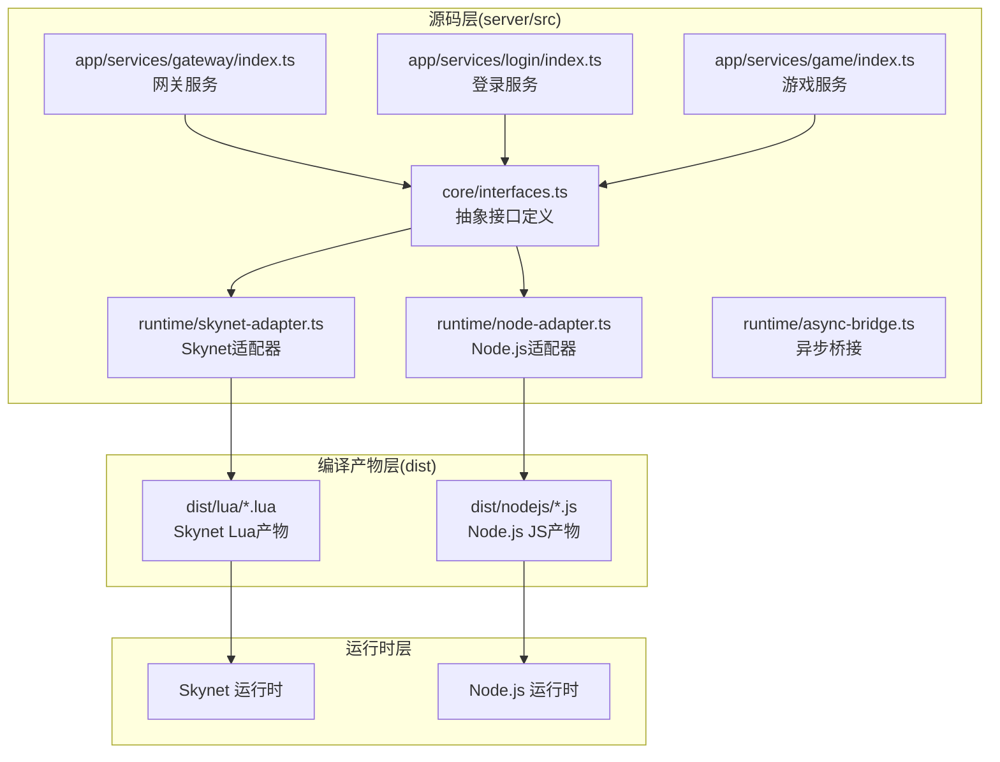
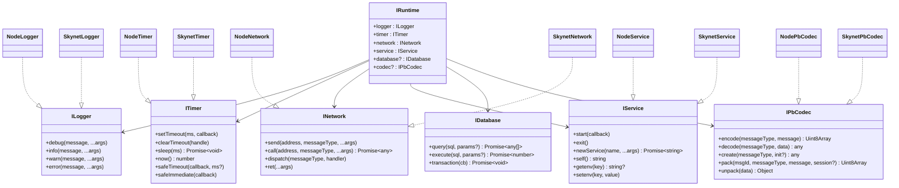
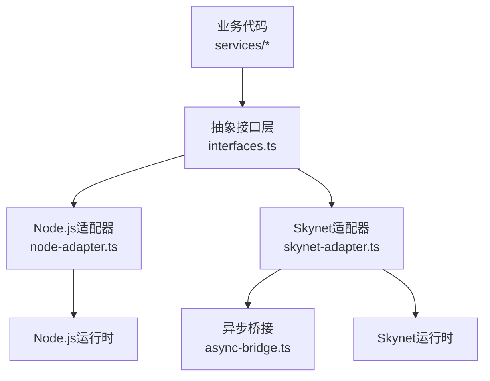
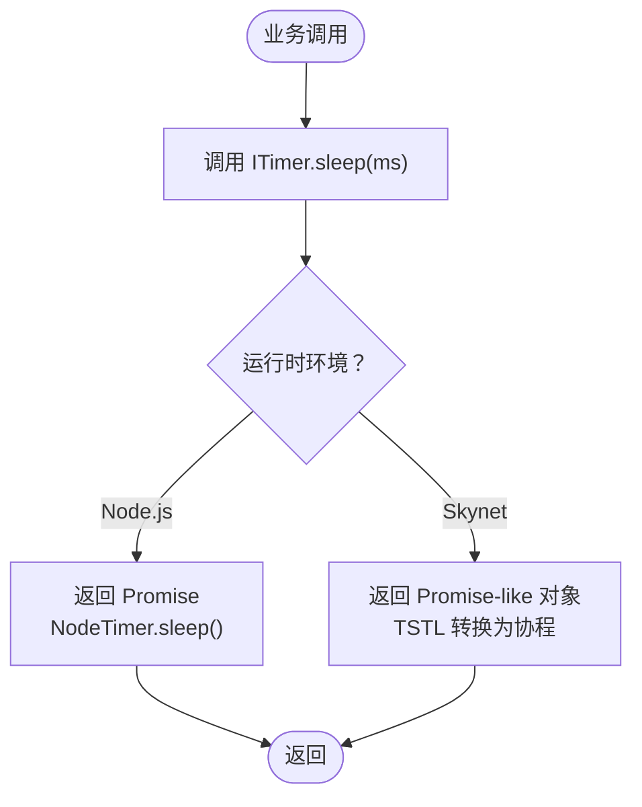
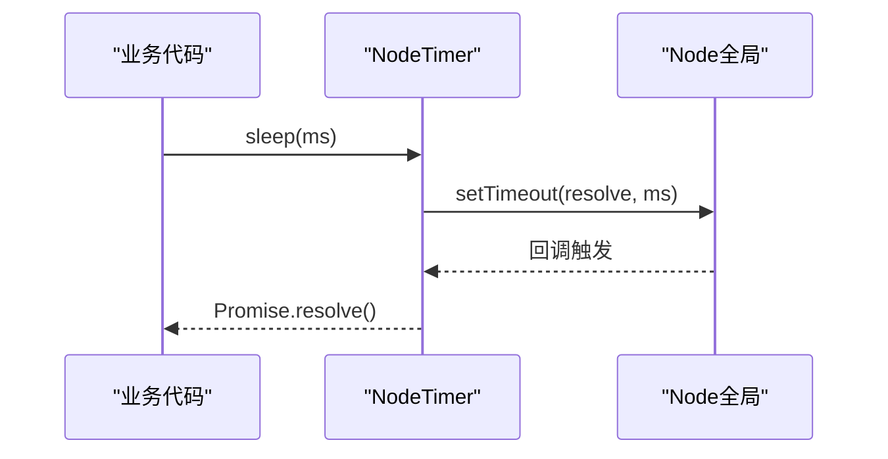
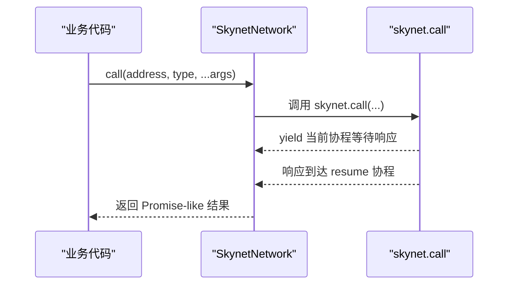
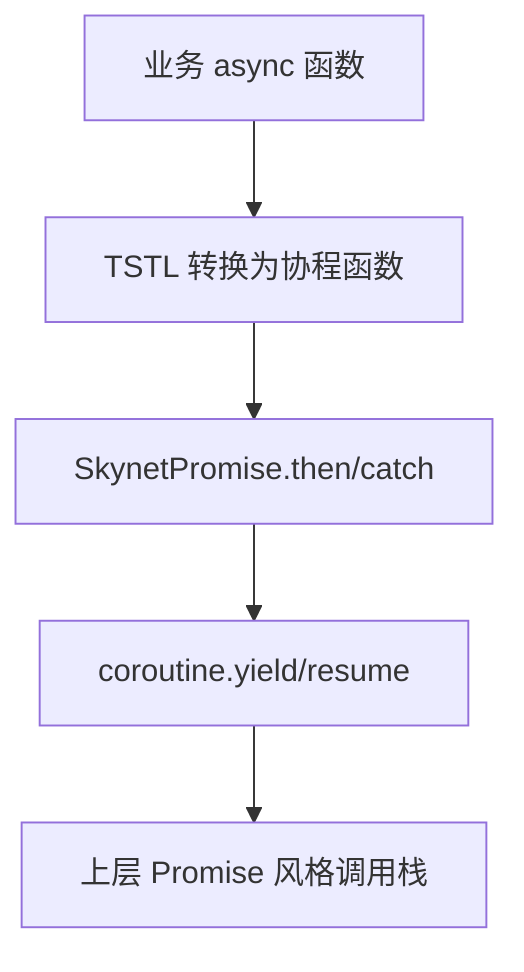
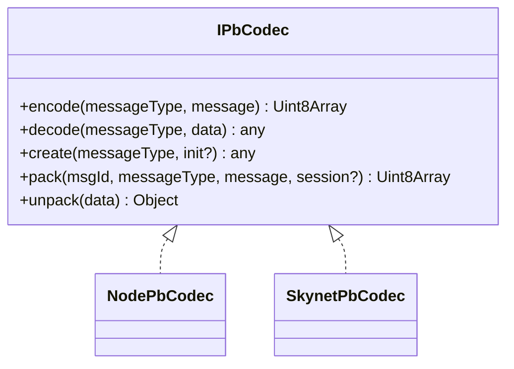
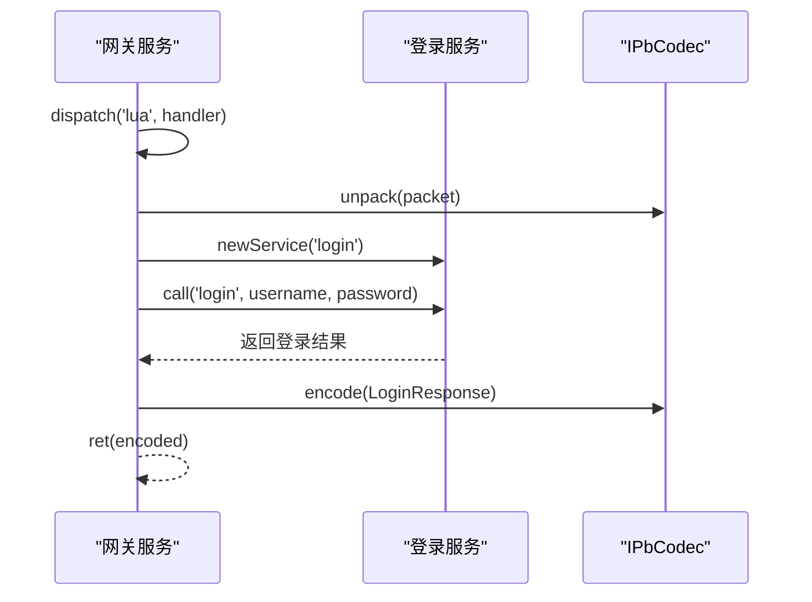
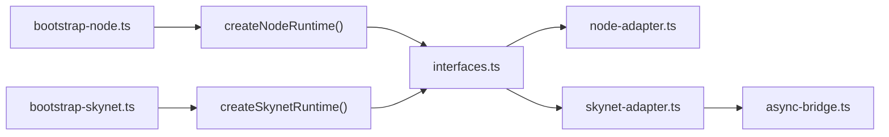

# 架构设计

<cite>
**本文引用的文件**   
- [架构设计文档.md](file://docs/架构设计文档.md)
- [interfaces.ts](file://server/src/framework/core/interfaces.ts)
- [node-adapter.ts](file://server/src/framework/runtime/node-adapter.ts)
- [skynet-adapter.ts](file://server/src/framework/runtime/skynet-adapter.ts)
- [async-bridge.ts](file://server/src/framework/runtime/async-bridge.ts)
- [node-pb-codec.ts](file://server/src/framework/runtime/node-pb-codec.ts)
- [skynet-pb-codec.ts](file://server/src/framework/runtime/skynet-pb-codec.ts)
- [bootstrap-node.ts](file://server/src/app/bootstrap-node.ts)
- [bootstrap-skynet.ts](file://server/src/app/bootstrap-skynet.ts)
- [gateway/index.ts](file://server/src/app/services/gateway/index.ts)
- [login/index.ts](file://server/src/app/services/login/index.ts)
- [game/index.ts](file://server/src/app/services/game/index.ts)
- [tslua.config.yaml](file://tslua.config.yaml)
- [package.json](file://package.json)
- [interfaces.lua](file://docker/lua/framework/core/interfaces.lua)
</cite>

## 目录
1. [引言](#引言)
2. [项目结构](#项目结构)
3. [核心组件](#核心组件)
4. [架构总览](#架构总览)
5. [详细组件分析](#详细组件分析)
6. [依赖分析](#依赖分析)
7. [性能考虑](#性能考虑)
8. [故障排查指南](#故障排查指南)
9. [结论](#结论)
10. [附录](#附录)

## 引言
本文件面向TS-Skynet混合开发框架，系统阐述其核心设计理念与架构模式，重点包括：
- 抽象接口层：统一ILogger、ITimer、INetwork、IService、IPbCodec等接口，屏蔽运行时差异
- 运行时适配器模式：分别在Node.js与Skynet环境提供一致的实现
- 双环境兼容性：通过TypeScript到Lua的编译（TSTL）与Promise/协程桥接，实现async/await在两环境的一致语义
- 异步模型统一：在Node.js映射为ES Promise，在Skynet通过TSTL转换为Lua协程yield/resume

该文档旨在帮助开发者快速理解框架的分层结构、接口抽象与异步桥接机制，并提供组件关系图、数据流图与最佳实践。

## 项目结构
TS-Skynet项目采用“源码-编译产物-运行时”三层组织：
- 源码层：server/src 下的TypeScript代码，定义抽象接口与运行时适配器
- 编译产物层：dist/lua（Skynet）与dist/nodejs（Node.js），分别对应TSTL与TSC输出
- 运行时层：Skynet框架与Node.js运行时，分别加载对应的编译产物

**图表来源**
- [interfaces.ts:1-226](file://server/src/framework/core/interfaces.ts#L1-L226)
- [node-adapter.ts:1-194](file://server/src/framework/runtime/node-adapter.ts#L1-L194)
- [skynet-adapter.ts:1-221](file://server/src/framework/runtime/skynet-adapter.ts#L1-L221)
- [async-bridge.ts:1-208](file://server/src/framework/runtime/async-bridge.ts#L1-L208)
- [gateway/index.ts:1-206](file://server/src/app/services/gateway/index.ts#L1-L206)
- [login/index.ts:1-154](file://server/src/app/services/login/index.ts#L1-L154)
- [game/index.ts:1-136](file://server/src/app/services/game/index.ts#L1-L136)

**章节来源**
- [架构设计文档.md:17-79](file://docs/架构设计文档.md#L17-L79)
- [tslua.config.yaml:1-52](file://tslua.config.yaml#L1-L52)
- [package.json:1-48](file://package.json#L1-L48)

## 核心组件
本节聚焦抽象接口层与运行时适配器，阐明其职责与协作关系。

- 抽象接口层（IRuntime聚合）：统一日志、定时器、网络、服务、数据库、协议编解码等能力
- Node.js适配器：基于原生API实现ILogger、ITimer、INetwork、IService、IPbCodec
- Skynet适配器：封装skynet.* API，实现ILogger、ITimer、INetwork、IService、IPbCodec
- 异步桥接：在Skynet环境下提供Promise风格实现，配合TSTL将async/await转换为协程

**图表来源**
- [interfaces.ts:9-196](file://server/src/framework/core/interfaces.ts#L9-L196)
- [node-adapter.ts:19-193](file://server/src/framework/runtime/node-adapter.ts#L19-L193)
- [skynet-adapter.ts:28-220](file://server/src/framework/runtime/skynet-adapter.ts#L28-L220)
- [node-pb-codec.ts:49-161](file://server/src/framework/runtime/node-pb-codec.ts#L49-L161)
- [skynet-pb-codec.ts:65-183](file://server/src/framework/runtime/skynet-pb-codec.ts#L65-L183)

**章节来源**
- [interfaces.ts:1-226](file://server/src/framework/core/interfaces.ts#L1-L226)
- [node-adapter.ts:1-194](file://server/src/framework/runtime/node-adapter.ts#L1-L194)
- [skynet-adapter.ts:1-221](file://server/src/framework/runtime/skynet-adapter.ts#L1-L221)

## 架构总览
TS-Skynet通过“抽象接口层 + 运行时适配器 + 异步桥接”的分层设计，实现跨平台一致性：
- 抽象接口层定义统一契约，业务代码只依赖接口
- 适配器层在不同运行时提供具体实现
- 异步桥接层保证async/await在Node.js（Promise）与Skynet（协程）中语义一致

**图表来源**
- [interfaces.ts:189-226](file://server/src/framework/core/interfaces.ts#L189-L226)
- [node-adapter.ts:177-193](file://server/src/framework/runtime/node-adapter.ts#L177-L193)
- [skynet-adapter.ts:204-220](file://server/src/framework/runtime/skynet-adapter.ts#L204-L220)
- [async-bridge.ts:23-186](file://server/src/framework/runtime/async-bridge.ts#L23-L186)

**章节来源**
- [架构设计文档.md:181-384](file://docs/架构设计文档.md#L181-L384)

## 详细组件分析

### 抽象接口层设计
- 设计原则：依赖倒置、接口隔离、开闭原则
- 关键点：所有异步方法返回Promise，确保在Node.js（原生Promise）与Skynet（TSTL协程）中统一语义
- 扩展点：新增接口（如IDatabase、IPbCodec）时，需同时在两个适配器中实现

**图表来源**
- [interfaces.ts:19-58](file://server/src/framework/core/interfaces.ts#L19-L58)
- [node-adapter.ts:49-51](file://server/src/framework/runtime/node-adapter.ts#L49-L51)
- [skynet-adapter.ts:81-90](file://server/src/framework/runtime/skynet-adapter.ts#L81-L90)
- [async-bridge.ts:23-103](file://server/src/framework/runtime/async-bridge.ts#L23-L103)

**章节来源**
- [interfaces.ts:1-226](file://server/src/framework/core/interfaces.ts#L1-L226)

### Node.js适配器
- ILogger：基于console.*实现
- ITimer：基于global.setTimeout/Immediate与Promise实现
- INetwork：模拟RPC调用，便于本地调试
- IService：基于setImmediate模拟服务启动
- IPbCodec：基于protobufjs实现编码解码

**图表来源**
- [node-adapter.ts:40-84](file://server/src/framework/runtime/node-adapter.ts#L40-L84)

**章节来源**
- [node-adapter.ts:1-194](file://server/src/framework/runtime/node-adapter.ts#L1-L194)

### Skynet适配器
- ILogger：通过skynet.error输出带时间戳的日志
- ITimer：使用skynet.timeout实现非阻塞sleep；safeTimeout/safeImmediate通过skynet.fork在协程中执行
- INetwork：封装skynet.send/call/dispatch/retpack
- IService：通过skynet.start/newservice/self/getenv/setenv
- IPbCodec：基于lua-protobuf加载proto描述并进行encode/decode/pack/unpack

**图表来源**
- [skynet-adapter.ts:132-154](file://server/src/framework/runtime/skynet-adapter.ts#L132-L154)

**章节来源**
- [skynet-adapter.ts:1-221](file://server/src/framework/runtime/skynet-adapter.ts#L1-L221)

### 异步桥接层
- SkynetPromise：在Skynet环境下提供Promise风格实现，确保async/await在TSTL转换后仍能正确yield/resume
- wrapSkynetCoroutine：将协程包装为Promise风格，便于上层统一处理
- 作用：解决Node.js（Promise）与Skynet（协程）的异步模型差异，使业务代码无需感知底层实现

**图表来源**
- [async-bridge.ts:23-186](file://server/src/framework/runtime/async-bridge.ts#L23-L186)

**章节来源**
- [async-bridge.ts:1-208](file://server/src/framework/runtime/async-bridge.ts#L1-L208)

### 协议编解码器
- NodePbCodec：基于protobufjs，提供encode/decode/create/pack/unpack
- SkynetPbCodec：基于lua-protobuf，动态加载proto描述文件，提供相同接口
- 作用：统一消息序列化/反序列化，支持protobuf消息在两环境一致传输

**图表来源**
- [interfaces.ts:144-183](file://server/src/framework/core/interfaces.ts#L144-L183)
- [node-pb-codec.ts:49-161](file://server/src/framework/runtime/node-pb-codec.ts#L49-L161)
- [skynet-pb-codec.ts:65-183](file://server/src/framework/runtime/skynet-pb-codec.ts#L65-L183)

**章节来源**
- [node-pb-codec.ts:1-162](file://server/src/framework/runtime/node-pb-codec.ts#L1-L162)
- [skynet-pb-codec.ts:1-184](file://server/src/framework/runtime/skynet-pb-codec.ts#L1-L184)

### 业务服务示例（网关/登录/游戏）
- 网关服务：注册lua消息处理器，转发心跳、登录等请求；使用codec进行protobuf编解码
- 登录服务：处理登录/登出/令牌校验等；定时清理过期会话
- 游戏服务：处理进入/离开游戏、玩家信息查询等

**图表来源**
- [gateway/index.ts:138-167](file://server/src/app/services/gateway/index.ts#L138-L167)
- [login/index.ts:46-101](file://server/src/app/services/login/index.ts#L46-L101)
- [interfaces.ts:144-183](file://server/src/framework/core/interfaces.ts#L144-L183)

**章节来源**
- [gateway/index.ts:1-206](file://server/src/app/services/gateway/index.ts#L1-L206)
- [login/index.ts:1-154](file://server/src/app/services/login/index.ts#L1-L154)
- [game/index.ts:1-136](file://server/src/app/services/game/index.ts#L1-L136)

## 依赖分析
- 组件内聚：每个适配器内部高度内聚，仅依赖对应运行时API
- 组件耦合：业务代码仅依赖IRuntime接口，避免对具体实现的耦合
- 外部依赖：Node.js适配器依赖原生API与protobufjs；Skynet适配器依赖skynet.*与lua-protobuf
- 运行时入口：bootstrap-node.ts与bootstrap-skynet.ts分别注入运行时并预加载服务模块

**图表来源**
- [bootstrap-node.ts:1-22](file://server/src/app/bootstrap-node.ts#L1-L22)
- [bootstrap-skynet.ts:1-20](file://server/src/app/bootstrap-skynet.ts#L1-L20)
- [interfaces.ts:216-226](file://server/src/framework/core/interfaces.ts#L216-L226)
- [node-adapter.ts:177-193](file://server/src/framework/runtime/node-adapter.ts#L177-L193)
- [skynet-adapter.ts:204-220](file://server/src/framework/runtime/skynet-adapter.ts#L204-L220)
- [async-bridge.ts:175-186](file://server/src/framework/runtime/async-bridge.ts#L175-L186)

**章节来源**
- [bootstrap-node.ts:1-22](file://server/src/app/bootstrap-node.ts#L1-L22)
- [bootstrap-skynet.ts:1-20](file://server/src/app/bootstrap-skynet.ts#L1-L20)

## 性能考虑
- 协程与事件循环：Skynet通过协程yield/resume避免阻塞，适合高并发网络服务
- Promise与协程映射：TSTL将async/await转换为协程，减少回调地狱，提升可维护性
- 编解码性能：protobuf相比JSON具有更小体积与更快解析速度，建议在高频消息中使用
- 定时器策略：safeTimeout/safeImmediate在Skynet中通过skynet.fork确保回调在协程中执行，避免阻塞主循环

## 故障排查指南
- 运行时未设置：确认bootstrap文件已调用setRuntime并传入对应运行时
- 协程未保持：Skynet服务需至少维持一个活跃协程，否则服务会退出；示例服务通过keepAlive循环保持
- Promise错误未捕获：在Node.js适配器中，safeTimeout/safeImmediate会捕获回调中的Promise错误；Skynet适配器中dispatch会捕获handler中的Promise错误
- 编解码异常：检查codec初始化与proto描述文件加载；Node端需确保编译生成的proto模块可用

**章节来源**
- [skynet-adapter.ts:100-121](file://server/src/framework/runtime/skynet-adapter.ts#L100-L121)
- [node-adapter.ts:60-84](file://server/src/framework/runtime/node-adapter.ts#L60-L84)
- [gateway/index.ts:198-206](file://server/src/app/services/gateway/index.ts#L198-L206)
- [login/index.ts:147-153](file://server/src/app/services/login/index.ts#L147-L153)
- [game/index.ts:129-135](file://server/src/app/services/game/index.ts#L129-L135)

## 结论
TS-Skynet通过抽象接口层与运行时适配器模式，成功实现了跨平台一致性；借助TSTL与异步桥接，业务代码可在Node.js与Skynet两种环境中以统一的async/await风格编写。该架构既满足高性能网络服务的需求，又保持了良好的可维护性与扩展性。

## 附录
- 构建与部署：通过package.json脚本与tslua.config.yaml配置，可一键完成编译、打包与Docker部署
- 最佳实践：
  - 业务代码仅依赖IRuntime接口，避免直接使用运行时API
  - 在Skynet中使用safeTimeout/safeImmediate确保回调在协程中执行
  - 使用IPbCodec统一消息编解码，优先采用protobuf
  - 服务需保持至少一个活跃协程，防止Skynet提前退出

**章节来源**
- [package.json:11-36](file://package.json#L11-L36)
- [tslua.config.yaml:17-30](file://tslua.config.yaml#L17-L30)