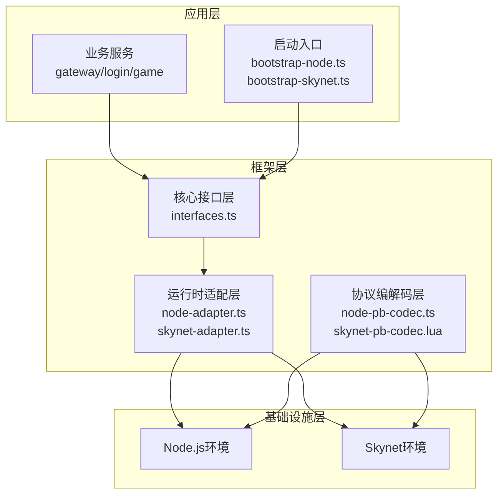
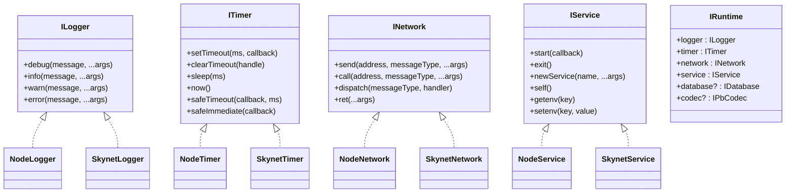
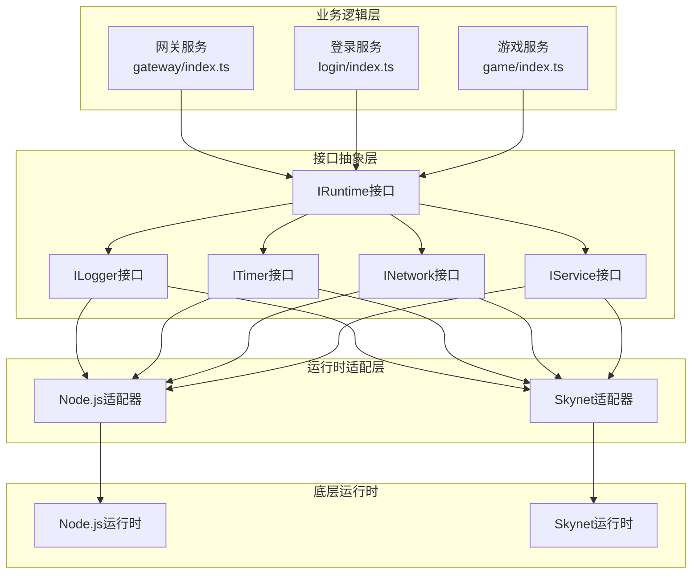
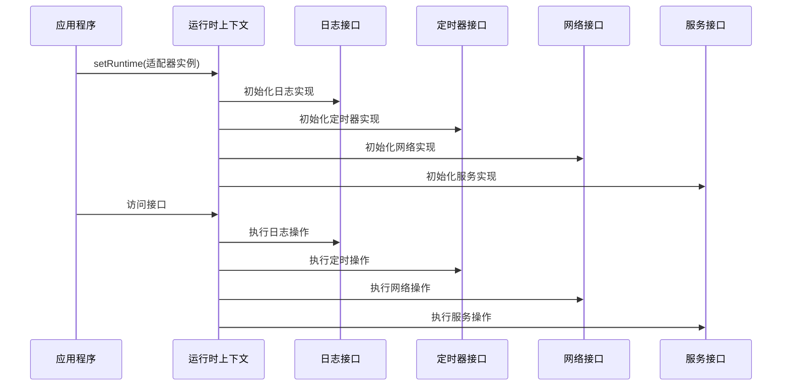
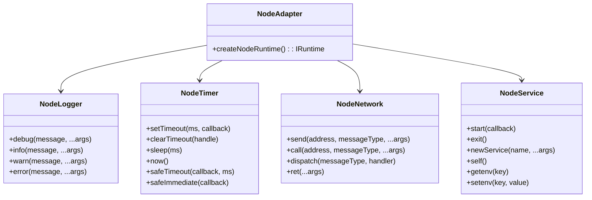
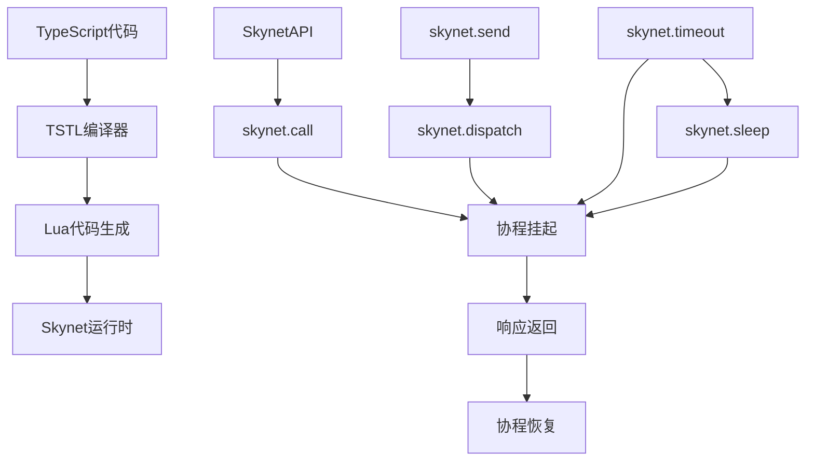
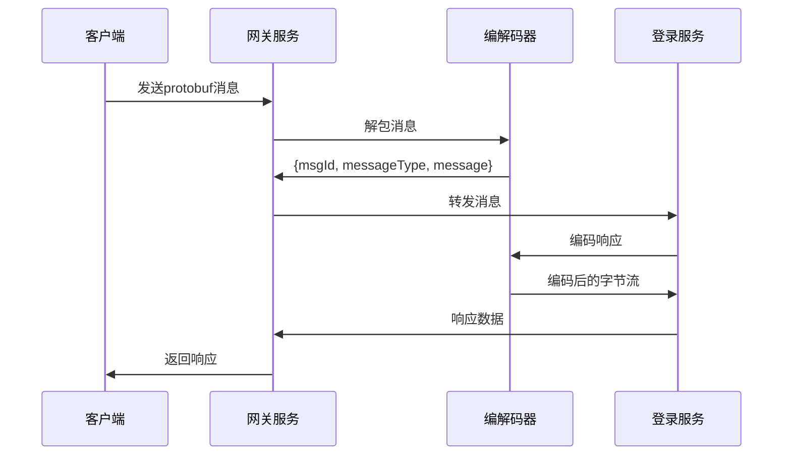
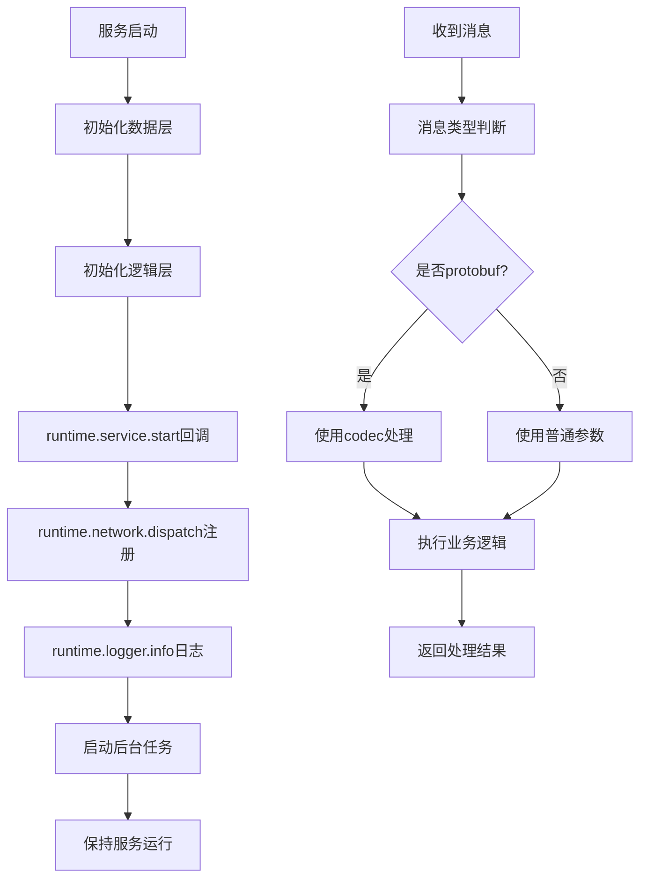
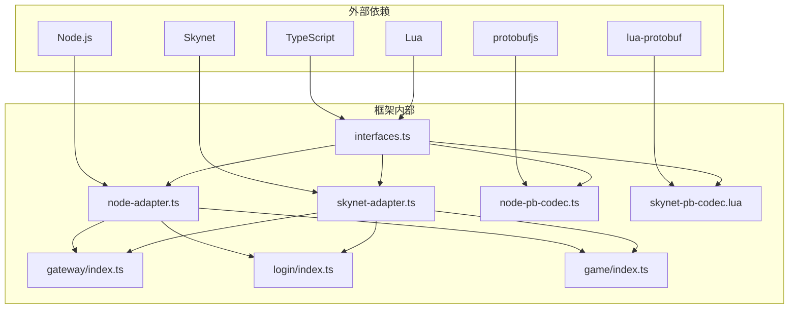
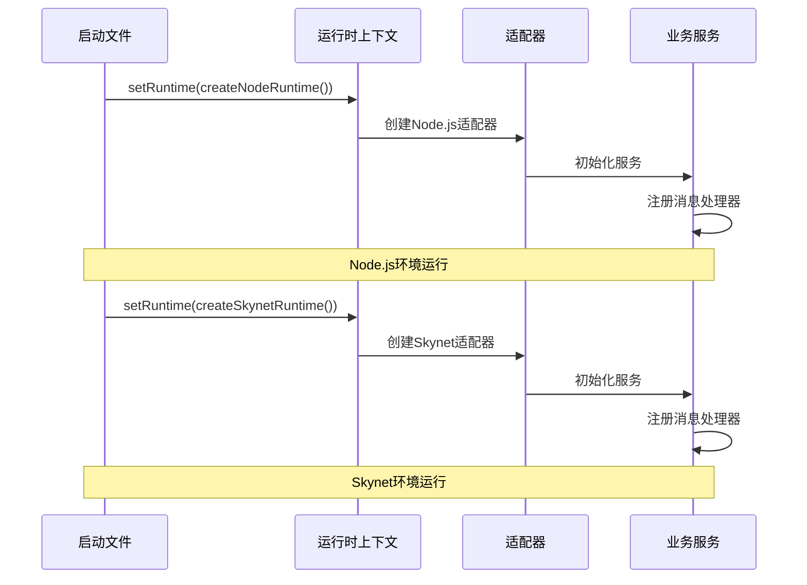

# 核心设计理念

<cite>
**本文档引用的文件**
- [interfaces.ts](file://server/src/framework/core/interfaces.ts)
- [interfaces.lua](file://docker/lua/framework/core/interfaces.lua)
- [node-adapter.ts](file://server/src/framework/runtime/node-adapter.ts)
- [skynet-adapter.ts](file://server/src/framework/runtime/skynet-adapter.ts)
- [node-pb-codec.ts](file://server/src/framework/runtime/node-pb-codec.ts)
- [skynet-pb-codec.lua](file://docker/lua/framework/runtime/skynet-pb-codec.lua)
- [bootstrap-node.ts](file://server/src/app/bootstrap-node.ts)
- [bootstrap-skynet.ts](file://server/src/app/bootstrap-skynet.ts)
- [gateway/index.ts](file://server/src/app/services/gateway/index.ts)
- [login/index.ts](file://server/src/app/services/login/index.ts)
- [game/index.ts](file://server/src/app/services/game/index.ts)
- [gateway/index.lua](file://docker/lua/app/services/gateway/index.lua)
- [tslua.config.yaml](file://tslua.config.yaml)
- [架构设计文档.md](file://docs/架构设计文档.md)
</cite>

## 目录
1. [引言](#引言)
2. [项目结构](#项目结构)
3. [核心组件](#核心组件)
4. [架构概览](#架构概览)
5. [详细组件分析](#详细组件分析)
6. [依赖关系分析](#依赖关系分析)
7. [性能考虑](#性能考虑)
8. [故障排除指南](#故障排除指南)
9. [结论](#结论)

## 引言

TS-Skynet框架的核心设计理念是通过抽象接口层实现业务代码与运行时环境的解耦，支持TypeScript代码在Node.js和Skynet两种运行时环境中的无缝切换。该框架采用分层架构设计，通过清晰的接口边界实现关注点分离，提高代码的可测试性和可维护性。

## 项目结构

TS-Skynet框架采用模块化设计，主要分为以下几个层次：

**图表来源**
- [interfaces.ts:1-226](file://server/src/framework/core/interfaces.ts#L1-L226)
- [node-adapter.ts:1-194](file://server/src/framework/runtime/node-adapter.ts#L1-L194)
- [skynet-adapter.ts:1-227](file://server/src/framework/runtime/skynet-adapter.ts#L1-L227)

**章节来源**
- [tslua.config.yaml:1-52](file://tslua.config.yaml#L1-L52)
- [架构设计文档.md:17-77](file://docs/架构设计文档.md#L17-L77)

## 核心组件

### 抽象接口层设计

框架的核心是抽象接口层，它定义了业务代码必须依赖的标准化接口：

**图表来源**
- [interfaces.ts:9-196](file://server/src/framework/core/interfaces.ts#L9-L196)

### 双环境兼容性设计

框架通过运行时适配器实现双环境兼容性：

| 组件 | Node.js实现 | Skynet实现 | 设计特点 |
|------|-------------|------------|----------|
| 日志接口 | NodeLogger | SkynetLogger | 统一日志格式，支持级别过滤 |
| 定时器接口 | NodeTimer | SkynetTimer | 时间单位转换（毫秒↔厘秒） |
| 网络接口 | NodeNetwork | SkynetNetwork | 消息路由和RPC封装 |
| 服务接口 | NodeService | SkynetService | 生命周期管理和服务创建 |

**章节来源**
- [interfaces.ts:1-226](file://server/src/framework/core/interfaces.ts#L1-L226)
- [node-adapter.ts:1-194](file://server/src/framework/runtime/node-adapter.ts#L1-L194)
- [skynet-adapter.ts:1-227](file://server/src/framework/runtime/skynet-adapter.ts#L1-L227)

## 架构概览

TS-Skynet框架采用分层架构，通过抽象接口层实现业务逻辑与运行时环境的解耦：

**图表来源**
- [gateway/index.ts:1-206](file://server/src/app/services/gateway/index.ts#L1-L206)
- [login/index.ts:1-154](file://server/src/app/services/login/index.ts#L1-L154)
- [game/index.ts:1-136](file://server/src/app/services/game/index.ts#L1-L136)
- [interfaces.ts:189-196](file://server/src/framework/core/interfaces.ts#L189-L196)

## 详细组件分析

### 接口抽象层详解

#### 核心接口设计原则

框架的接口设计遵循以下原则：

1. **依赖倒置原则**: 业务代码依赖抽象接口，不依赖具体实现
2. **接口隔离原则**: 每个接口职责单一，避免胖接口
3. **开闭原则**: 易于扩展新的运行时适配器
4. **一致性原则**: 不同运行时环境提供一致的API体验

#### 运行时上下文设计

运行时上下文是整个框架的核心，它聚合了所有接口：

**图表来源**
- [interfaces.ts:216-225](file://server/src/framework/core/interfaces.ts#L216-L225)
- [interfaces.lua:14-22](file://docker/lua/framework/core/interfaces.lua#L14-L22)

**章节来源**
- [interfaces.ts:189-225](file://server/src/framework/core/interfaces.ts#L189-L225)
- [interfaces.lua:10-22](file://docker/lua/framework/core/interfaces.lua#L10-L22)

### 双环境适配器实现

#### Node.js适配器设计

Node.js适配器实现了所有核心接口，使用Node.js原生API：

**图表来源**
- [node-adapter.ts:177-193](file://server/src/framework/runtime/node-adapter.ts#L177-L193)

#### Skynet适配器设计

Skynet适配器使用TSTL转换为Lua代码，实现Skynet原生API：

**图表来源**
- [skynet-adapter.ts:1-227](file://server/src/framework/runtime/skynet-adapter.ts#L1-L227)

**章节来源**
- [node-adapter.ts:1-194](file://server/src/framework/runtime/node-adapter.ts#L1-L194)
- [skynet-adapter.ts:1-227](file://server/src/framework/runtime/skynet-adapter.ts#L1-L227)

### 协议编解码器设计

#### 双环境编解码器实现

框架提供了统一的Protocol Buffer编解码接口，支持双环境：

| 组件 | Node.js实现 | Skynet实现 | 特点 |
|------|-------------|------------|------|
| 编解码接口 | IPbCodec | IPbCodec | 统一API接口 |
| 编码实现 | NodePbCodec | SkynetPbCodec | 环境特定实现 |
| 消息映射 | 静态映射表 | 动态映射表 | 消息ID与类型转换 |

#### 编解码流程

**图表来源**
- [gateway/index.ts:138-167](file://server/src/app/services/gateway/index.ts#L138-L167)
- [node-pb-codec.ts:130-160](file://server/src/framework/runtime/node-pb-codec.ts#L130-L160)

**章节来源**
- [node-pb-codec.ts:1-162](file://server/src/framework/runtime/node-pb-codec.ts#L1-L162)
- [skynet-pb-codec.lua:1-164](file://docker/lua/framework/runtime/skynet-pb-codec.lua#L1-L164)

### 业务服务架构

#### 服务启动流程

每个业务服务都遵循相同的启动模式：

**图表来源**
- [gateway/index.ts:172-206](file://server/src/app/services/gateway/index.ts#L172-L206)
- [login/index.ts:125-154](file://server/src/app/services/login/index.ts#L125-L154)

**章节来源**
- [gateway/index.ts:1-206](file://server/src/app/services/gateway/index.ts#L1-L206)
- [login/index.ts:1-154](file://server/src/app/services/login/index.ts#L1-L154)
- [game/index.ts:1-136](file://server/src/app/services/game/index.ts#L1-L136)

## 依赖关系分析

### 组件依赖图

**图表来源**
- [interfaces.ts:1-226](file://server/src/framework/core/interfaces.ts#L1-L226)
- [node-adapter.ts:1-194](file://server/src/framework/runtime/node-adapter.ts#L1-L194)
- [skynet-adapter.ts:1-227](file://server/src/framework/runtime/skynet-adapter.ts#L1-L227)

### 运行时切换机制

框架通过运行时切换实现双环境支持：

**图表来源**
- [bootstrap-node.ts:1-22](file://server/src/app/bootstrap-node.ts#L1-L22)
- [bootstrap-skynet.ts:1-20](file://server/src/app/bootstrap-skynet.ts#L1-L20)

**章节来源**
- [bootstrap-node.ts:1-22](file://server/src/app/bootstrap-node.ts#L1-L22)
- [bootstrap-skynet.ts:1-20](file://server/src/app/bootstrap-skynet.ts#L1-L20)

## 性能考虑

### 异步模型优化

框架通过统一的异步模型实现性能优化：

1. **Promise到协程的转换**: TSTL自动将Promise转换为Skynet协程
2. **时间单位优化**: Node.js使用毫秒，Skynet使用厘秒（0.1秒）
3. **消息编解码优化**: 缓存消息类型映射表，避免重复查找
4. **内存管理**: 使用对象池减少垃圾回收压力

### 内存使用分析

| 组件 | 内存占用 | 优化策略 |
|------|----------|----------|
| 接口实例 | 低 | 单例模式，共享实例 |
| 编解码器 | 中等 | 懒加载，按需初始化 |
| 服务实例 | 高 | 按需启动，及时清理 |
| 消息缓冲 | 可变 | 限制大小，定期清理 |

## 故障排除指南

### 常见问题及解决方案

#### 运行时适配器初始化失败

**问题描述**: `Proto module not loaded` 或 `Protobuf library not available`

**解决方案**:
1. 确认编译后的proto.js文件存在
2. 检查protobuf库依赖安装
3. 验证消息类型映射表配置

#### 异步调用超时

**问题描述**: `await network.call()` 无法返回

**解决方案**:
1. 检查目标服务是否正确启动
2. 验证消息处理器注册情况
3. 确认服务地址格式正确

#### 协程死锁

**问题描述**: 服务启动后立即退出

**解决方案**:
1. 确保至少有一个活跃的协程
2. 添加keep-alive定时器
3. 检查服务生命周期管理

**章节来源**
- [node-pb-codec.ts:53-68](file://server/src/framework/runtime/node-pb-codec.ts#L53-L68)
- [skynet-pb-codec.lua:59-89](file://docker/lua/framework/runtime/skynet-pb-codec.lua#L59-L89)

## 结论

TS-Skynet框架通过抽象接口层设计实现了业务代码与运行时环境的完全解耦，支持TypeScript代码在Node.js和Skynet两种运行时环境中的无缝切换。该框架的核心价值体现在：

1. **设计原则**: 严格遵循依赖倒置、接口隔离和开闭原则
2. **双环境兼容**: 通过运行时适配器实现统一的开发体验
3. **分层架构**: 清晰的接口边界实现关注点分离
4. **异步统一**: 通过TSTL实现Promise到协程的自动转换
5. **可维护性**: 模块化设计便于扩展和维护

这种设计理念不仅提高了代码的可测试性和可维护性，还为热更新和多运行时部署提供了坚实的基础。通过接口抽象，开发者可以专注于业务逻辑实现，而不必关心底层运行时的具体细节。