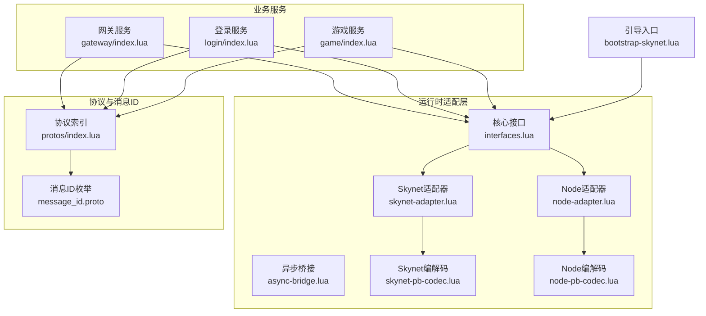
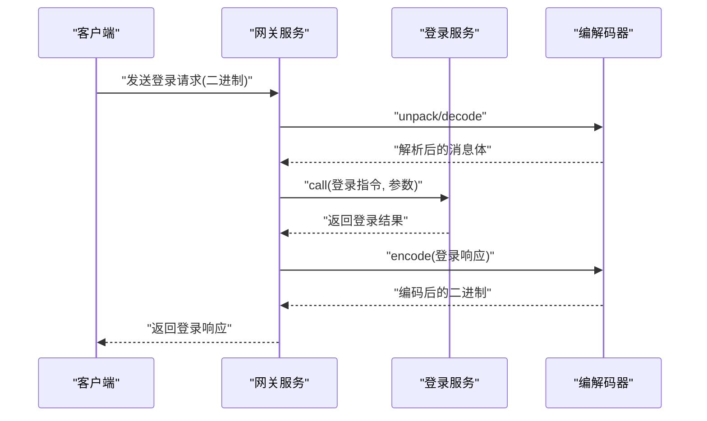
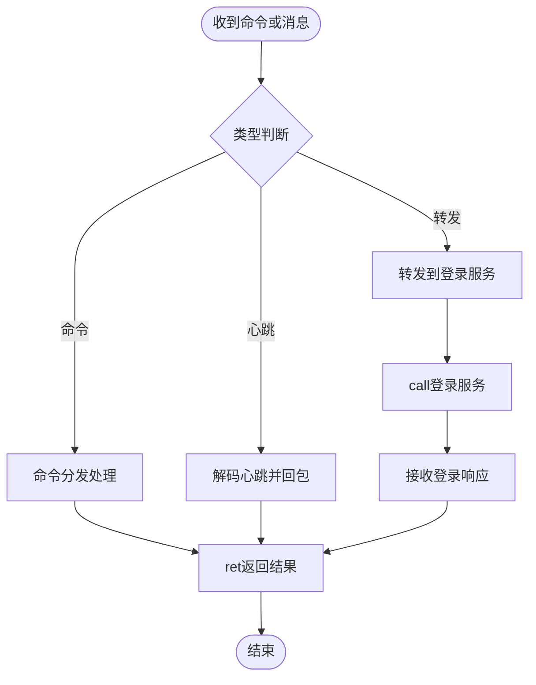
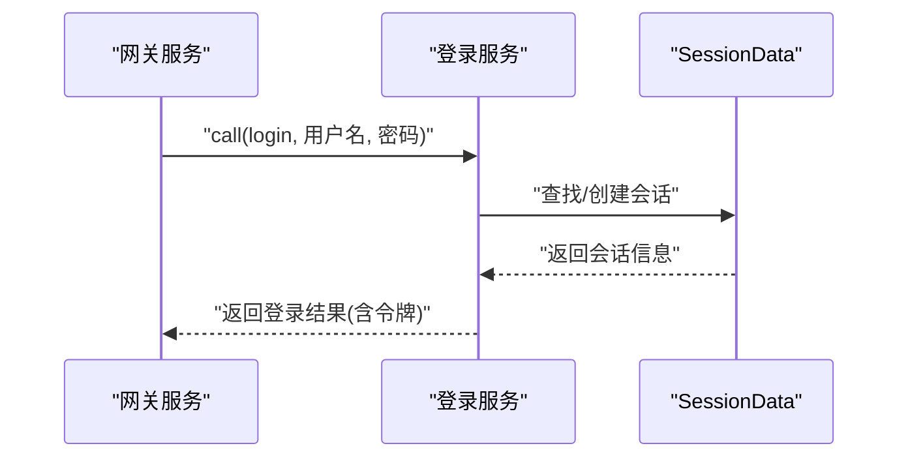
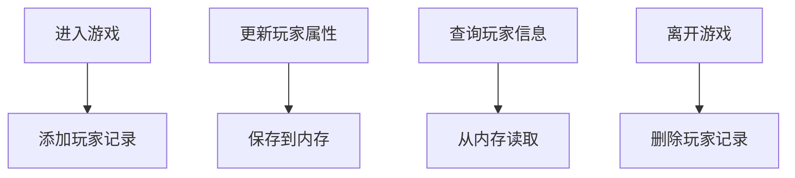
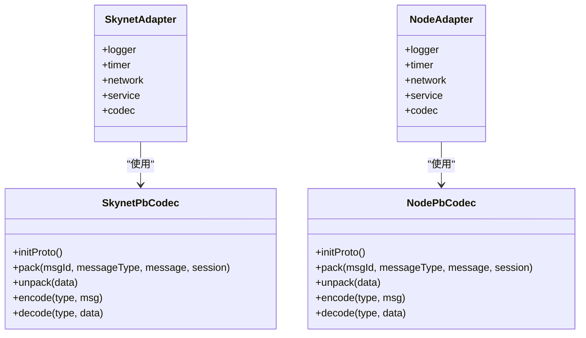
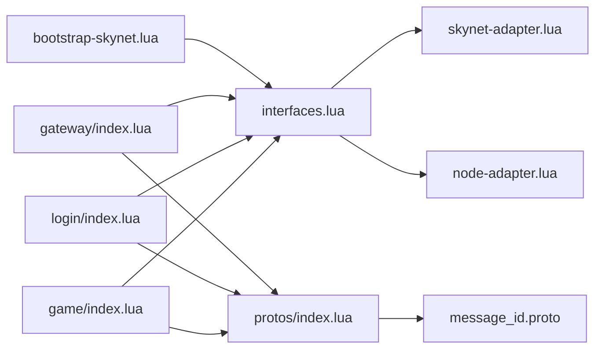

# 组件交互机制

<cite>
**本文引用的文件**
- [docker\lua\framework\core\interfaces.lua](file://docker\lua\framework\core\interfaces.lua)
- [docker\lua\framework\runtime\skynet-adapter.lua](file://docker\lua\framework\runtime\skynet-adapter.lua)
- [docker\lua\framework\runtime\node-adapter.lua](file://docker\lua\framework\runtime\node-adapter.lua)
- [docker\lua\framework\runtime\async-bridge.lua](file://docker\lua\framework\runtime\async-bridge.lua)
- [docker\lua\framework\runtime\skynet-pb-codec.lua](file://docker\lua\framework\runtime\skynet-pb-codec.lua)
- [docker\lua\framework\runtime\node-pb-codec.lua](file://docker\lua\framework\runtime\node-pb-codec.lua)
- [docker\lua\app\bootstrap-skynet.lua](file://docker\lua\app\bootstrap-skynet.lua)
- [docker\lua\app\services\gateway\index.lua](file://docker\lua\app\services\gateway\index.lua)
- [docker\lua\app\services\login\index.lua](file://docker\lua\app\services\login\index.lua)
- [docker\lua\app\services\game\index.lua](file://docker\lua\app\services\game\index.lua)
- [docker\lua\app\services\gateway\data.lua](file://docker\lua\app\services\gateway\data.lua)
- [docker\lua\app\services\login\data.lua](file://docker\lua\app\services\login\data.lua)
- [docker\lua\app\services\game\data.lua](file://docker\lua\app\services\game\data.lua)
- [docker\lua\protos\index.lua](file://docker\lua\protos\index.lua)
- [protocols\proto\message_id.proto](file://protocols\proto\message_id.proto)
</cite>

## 目录
1. [引言](#引言)
2. [项目结构](#项目结构)
3. [核心组件](#核心组件)
4. [架构总览](#架构总览)
5. [详细组件分析](#详细组件分析)
6. [依赖关系分析](#依赖关系分析)
7. [性能考量](#性能考量)
8. [故障排查指南](#故障排查指南)
9. [结论](#结论)
10. [附录](#附录)

## 引言
本文件面向TS-Skynet框架的组件交互机制，系统阐述组件间通信模式（同步调用、异步消息、事件发布订阅）、服务发现与地址解析、消息路由与负载均衡、组件生命周期管理、容错与重试策略，并结合仓库中的具体实现路径给出可操作的最佳实践。目标是帮助开发者在分布式场景下设计高可用、可扩展且易维护的服务体系。

## 项目结构
TS-Skynet采用“运行时适配层 + 核心接口 + 业务服务”的分层组织方式：
- 运行时适配层：提供Skynet与Node.js两种运行时的统一抽象（日志、定时器、网络、服务、编解码）。
- 核心接口：集中式运行时实例注册与切换，屏蔽上层差异。
- 业务服务：网关、登录、游戏等服务，通过统一的网络与服务接口进行交互。
- 协议与消息ID：基于Protobuf的消息编解码与消息ID映射，支撑跨语言/跨进程通信。

**图表来源**
- [docker\lua\framework\core\interfaces.lua:1-24](file://docker\lua\framework\core\interfaces.lua#L1-L24)
- [docker\lua\framework\runtime\skynet-adapter.lua:1-227](file://docker\lua\framework\runtime\skynet-adapter.lua#L1-L227)
- [docker\lua\framework\runtime\node-adapter.lua:1-207](file://docker\lua\framework\runtime\node-adapter.lua#L1-L207)
- [docker\lua\framework\runtime\async-bridge.lua:1-243](file://docker\lua\framework\runtime\async-bridge.lua#L1-L243)
- [docker\lua\framework\runtime\skynet-pb-codec.lua:1-164](file://docker\lua\framework\runtime\skynet-pb-codec.lua#L1-L164)
- [docker\lua\framework\runtime\node-pb-codec.lua:1-185](file://docker\lua\framework\runtime\node-pb-codec.lua#L1-L185)
- [docker\lua\app\bootstrap-skynet.lua:1-12](file://docker\lua\app\bootstrap-skynet.lua#L1-L12)
- [docker\lua\app\services\gateway\index.lua:1-225](file://docker\lua\app\services\gateway\index.lua#L1-L225)
- [docker\lua\app\services\login\index.lua:1-162](file://docker\lua\app\services\login\index.lua#L1-L162)
- [docker\lua\app\services\game\index.lua:1-156](file://docker\lua\app\services\game\index.lua#L1-L156)
- [docker\lua\protos\index.lua:1-14](file://docker\lua\protos\index.lua#L1-L14)
- [protocols\proto\message_id.proto:1-48](file://protocols\proto\message_id.proto#L1-L48)

**章节来源**
- [docker\lua\framework\core\interfaces.lua:1-24](file://docker\lua\framework\core\interfaces.lua#L1-L24)
- [docker\lua\app\bootstrap-skynet.lua:1-12](file://docker\lua\app\bootstrap-skynet.lua#L1-L12)

## 核心组件
- 运行时接口与全局实例
  - 通过集中式runtime对象注入日志、定时器、网络、服务、编解码等能力，支持在不同运行时之间无缝切换。
  - 关键路径：[runtime设置与注入:14-22](file://docker\lua\framework\core\interfaces.lua#L14-L22)、[引导加载Skynet运行时:7-9](file://docker\lua\app\bootstrap-skynet.lua#L7-L9)。

- Skynet运行时适配器
  - 提供Skynet专用的日志、定时器、网络、服务封装，以及Protobuf编解码器初始化。
  - 关键路径：[Skynet网络封装与服务封装:129-204](file://docker\lua\framework\runtime\skynet-adapter.lua#L129-L204)、[Skynet编解码器:51-162](file://docker\lua\framework\runtime\skynet-pb-codec.lua#L51-L162)。

- Node.js运行时适配器
  - 提供Node.js环境下的事件模拟网络、简单服务与编解码器占位实现，便于本地开发与测试。
  - 关键路径：[Node网络与服务封装:88-183](file://docker\lua\framework\runtime\node-adapter.lua#L88-L183)、[Node编解码器:53-183](file://docker\lua\framework\runtime\node-pb-codec.lua#L53-L183)。

- 异步桥接与Promise实现
  - 将async/await转换为Lua协程，保证在Skynet环境下以非阻塞方式执行异步逻辑。
  - 关键路径：[Skynet Promise与桥接:17-241](file://docker\lua\framework\runtime\async-bridge.lua#L17-L241)。

- 业务服务
  - 网关、登录、游戏服务均通过统一的dispatch/call/ret与newService/self等接口进行交互。
  - 关键路径：[网关服务:181-223](file://docker\lua\app\services\gateway\index.lua#L181-L223)、[登录服务:122-160](file://docker\lua\app\services\login\index.lua#L122-L160)、[游戏服务:118-154](file://docker\lua\app\services\game\index.lua#L118-L154)。

**章节来源**
- [docker\lua\framework\core\interfaces.lua:1-24](file://docker\lua\framework\core\interfaces.lua#L1-L24)
- [docker\lua\framework\runtime\skynet-adapter.lua:1-227](file://docker\lua\framework\runtime\skynet-adapter.lua#L1-L227)
- [docker\lua\framework\runtime\node-adapter.lua:1-207](file://docker\lua\framework\runtime\node-adapter.lua#L1-L207)
- [docker\lua\framework\runtime\async-bridge.lua:1-243](file://docker\lua\framework\runtime\async-bridge.lua#L1-L243)
- [docker\lua\app\services\gateway\index.lua:1-225](file://docker\lua\app\services\gateway\index.lua#L1-L225)
- [docker\lua\app\services\login\index.lua:1-162](file://docker\lua\app\services\login\index.lua#L1-L162)
- [docker\lua\app\services\game\index.lua:1-156](file://docker\lua\app\services\game\index.lua#L1-L156)

## 架构总览
TS-Skynet采用“服务即对象”的思想，每个业务模块以服务形式存在，通过消息传递完成交互。消息在服务内部以“消息类型+负载”形式流转，必要时经由编解码器进行序列化/反序列化。运行时适配层屏蔽Skynet与Node.js差异，使业务逻辑保持一致。

**图表来源**
- [docker\lua\app\services\gateway\index.lua:142-180](file://docker\lua\app\services\gateway\index.lua#L142-L180)
- [docker\lua\framework\runtime\skynet-pb-codec.lua:127-162](file://docker\lua\framework\runtime\skynet-pb-codec.lua#L127-L162)
- [docker\lua\app\services\login\index.lua:36-103](file://docker\lua\app\services\login\index.lua#L36-L103)

## 详细组件分析

### 组件A：网关服务（Gateway）
- 职责
  - 接收客户端连接与心跳，维护连接状态，转发消息至登录/游戏服务。
  - 支持命令式调用（connect/disconnect/forward/bind_user/broadcast/kick/get_state）与消息式调用（heartbeat/forward_login）。
- 交互模式
  - 同步调用：对外部命令使用dispatch/call，内部逻辑通过await等待子流程。
  - 异步消息：定时keep-alive与日志输出。
  - 事件发布订阅：通过ret向调用方返回结果；广播通过逻辑层实现。
- 数据与状态
  - 使用ConnectionData持久化连接信息，支持绑定用户、查询在线数、导出状态。
- 关键路径
  - [命令分发与处理:22-116](file://docker\lua\app\services\gateway\index.lua#L22-L116)
  - [心跳处理与protobuf解包:118-141](file://docker\lua\app\services\gateway\index.lua#L118-L141)
  - [转发到登录服务:143-180](file://docker\lua\app\services\gateway\index.lua#L143-L180)
  - [连接数据存储:19-72](file://docker\lua\app\services\gateway\data.lua#L19-L72)

**图表来源**
- [docker\lua\app\services\gateway\index.lua:181-211](file://docker\lua\app\services\gateway\index.lua#L181-L211)

**章节来源**
- [docker\lua\app\services\gateway\index.lua:1-225](file://docker\lua\app\services\gateway\index.lua#L1-L225)
- [docker\lua\app\services\gateway\data.lua:1-74](file://docker\lua\app\services\gateway\data.lua#L1-L74)

### 组件B：登录服务（Login）
- 职责
  - 处理用户认证、令牌校验、会话管理与清理。
  - 提供在线人数统计与状态导出。
- 交互模式
  - 同步调用：对外部命令使用dispatch/call，内部逻辑通过await等待数据库/缓存操作。
  - 定时任务：周期性清理过期会话。
- 数据与状态
  - 使用SessionData管理会话，支持按token查找、过期清理、导出状态。
- 关键路径
  - [命令分发与处理:36-103](file://docker\lua\app\services\login\index.lua#L36-L103)
  - [会话清理定时器:105-121](file://docker\lua\app\services\login\index.lua#L105-L121)
  - [会话数据存储:19-90](file://docker\lua\app\services\login\data.lua#L19-L90)

**图表来源**
- [docker\lua\app\services\login\index.lua:122-147](file://docker\lua\app\services\login\index.lua#L122-L147)
- [docker\lua\app\services\login\data.lua:19-73](file://docker\lua\app\services\login\data.lua#L19-L73)

**章节来源**
- [docker\lua\app\services\login\index.lua:1-162](file://docker\lua\app\services\login\index.lua#L1-L162)
- [docker\lua\app\services\login\data.lua:1-92](file://docker\lua\app\services\login\data.lua#L1-L92)

### 组件C：游戏服务（Game）
- 职责
  - 处理玩家进入/离开游戏、查询/更新玩家信息、在线人数统计。
- 交互模式
  - 同步调用：对外部命令使用dispatch/call，内部逻辑通过await等待数据层操作。
- 数据与状态
  - 使用PlayerData管理玩家信息，支持增删改查、导出状态。
- 关键路径
  - [命令分发与处理:20-116](file://docker\lua\app\services\game\index.lua#L20-L116)
  - [玩家数据存储:17-69](file://docker\lua\app\services\game\data.lua#L17-L69)

**图表来源**
- [docker\lua\app\services\game\index.lua:118-154](file://docker\lua\app\services\game\index.lua#L118-L154)
- [docker\lua\app\services\game\data.lua:17-58](file://docker\lua\app\services\game\data.lua#L17-L58)

**章节来源**
- [docker\lua\app\services\game\index.lua:1-156](file://docker\lua\app\services\game\index.lua#L1-L156)
- [docker\lua\app\services\game\data.lua:1-71](file://docker\lua\app\services\game\data.lua#L1-L71)

### 组件D：运行时适配器与编解码器
- Skynet适配器
  - 网络：send/call/dispatch/ret，封装skynet.call/send/dispatch/retpack。
  - 服务：start/newService/self/getenv/setenv/exit。
  - 编解码：SkynetPbCodec，基于lua-protobuf加载描述文件，提供pack/unpack/encode/decode。
- Node适配器
  - 网络：send/call/dispatch/ret，基于Map模拟pendingCalls与处理器注册。
  - 服务：newService/self/start/exit，模拟服务生命周期。
  - 编解码：NodePbCodec，基于生成的proto模块进行encode/decode。
- 异步桥接
  - 提供SkynetPromise与wrapSkynetCoroutine，将async/await转换为协程执行。
- 关键路径
  - [Skynet网络与服务封装:129-204](file://docker\lua\framework\runtime\skynet-adapter.lua#L129-L204)
  - [Skynet编解码器:51-162](file://docker\lua\framework\runtime\skynet-pb-codec.lua#L51-L162)
  - [Node网络与服务封装:88-183](file://docker\lua\framework\runtime\node-adapter.lua#L88-L183)
  - [Node编解码器:53-183](file://docker\lua\framework\runtime\node-pb-codec.lua#L53-L183)
  - [异步桥接:17-241](file://docker\lua\framework\runtime\async-bridge.lua#L17-L241)

**图表来源**
- [docker\lua\framework\runtime\skynet-adapter.lua:205-227](file://docker\lua\framework\runtime\skynet-adapter.lua#L205-L227)
- [docker\lua\framework\runtime\node-adapter.lua:185-206](file://docker\lua\framework\runtime\node-adapter.lua#L185-L206)
- [docker\lua\framework\runtime\skynet-pb-codec.lua:51-162](file://docker\lua\framework\runtime\skynet-pb-codec.lua#L51-L162)
- [docker\lua\framework\runtime\node-pb-codec.lua:53-183](file://docker\lua\framework\runtime\node-pb-codec.lua#L53-L183)

**章节来源**
- [docker\lua\framework\runtime\skynet-adapter.lua:1-227](file://docker\lua\framework\runtime\skynet-adapter.lua#L1-L227)
- [docker\lua\framework\runtime\node-adapter.lua:1-207](file://docker\lua\framework\runtime\node-adapter.lua#L1-L207)
- [docker\lua\framework\runtime\skynet-pb-codec.lua:1-164](file://docker\lua\framework\runtime\skynet-pb-codec.lua#L1-L164)
- [docker\lua\framework\runtime\node-pb-codec.lua:1-185](file://docker\lua\framework\runtime\node-pb-codec.lua#L1-L185)
- [docker\lua\framework\runtime\async-bridge.lua:1-243](file://docker\lua\framework\runtime\async-bridge.lua#L1-L243)

## 依赖关系分析
- 运行时依赖
  - 业务服务依赖interfaces.runtime提供的统一能力，避免直接耦合Skynet或Node API。
  - bootstrap-skynet在启动时创建并注入Skynet运行时，确保后续服务使用一致的实现。
- 协议依赖
  - protos/index.lua聚合生成的proto模块，业务服务通过它访问消息类型与枚举。
  - message_id.proto定义消息ID枚举，编解码器通过ID映射进行pack/unpack。
- 服务间依赖
  - 网关服务通过runtime.service:newService创建登录服务实例，并通过runtime.network:call发起同步调用。
  - 登录服务与游戏服务各自独立，通过网关进行编排与转发。

**图表来源**
- [docker\lua\app\bootstrap-skynet.lua:1-12](file://docker\lua\app\bootstrap-skynet.lua#L1-L12)
- [docker\lua\framework\core\interfaces.lua:1-24](file://docker\lua\framework\core\interfaces.lua#L1-L24)
- [docker\lua\app\services\gateway\index.lua:1-225](file://docker\lua\app\services\gateway\index.lua#L1-L225)
- [docker\lua\app\services\login\index.lua:1-162](file://docker\lua\app\services\login\index.lua#L1-L162)
- [docker\lua\app\services\game\index.lua:1-156](file://docker\lua\app\services\game\index.lua#L1-L156)
- [docker\lua\protos\index.lua:1-14](file://docker\lua\protos\index.lua#L1-L14)
- [protocols\proto\message_id.proto:1-48](file://protocols\proto\message_id.proto#L1-L48)

**章节来源**
- [docker\lua\app\bootstrap-skynet.lua:1-12](file://docker\lua\app\bootstrap-skynet.lua#L1-L12)
- [docker\lua\framework\core\interfaces.lua:1-24](file://docker\lua\framework\core\interfaces.lua#L1-L24)
- [docker\lua\protos\index.lua:1-14](file://docker\lua\protos\index.lua#L1-L14)
- [protocols\proto\message_id.proto:1-48](file://protocols\proto\message_id.proto#L1-L48)

## 性能考量
- 异步与协程
  - 使用异步桥接将await转换为协程，避免阻塞主线程，提升吞吐。
  - 关键路径：[异步桥接:206-241](file://docker\lua\framework\runtime\async-bridge.lua#L206-L241)。
- 编解码开销
  - Protobuf序列化/反序列化带来CPU开销，建议：
    - 对高频小消息采用二进制打包（pack/unpack），减少字符串拼接。
    - 对大对象批量处理，避免频繁分配。
  - 关键路径：[Skynet编解码器:127-162](file://docker\lua\framework\runtime\skynet-pb-codec.lua#L127-L162)、[Node编解码器:160-183](file://docker\lua\framework\runtime\node-pb-codec.lua#L160-L183)。
- 网络与消息
  - 使用ret一次性返回结果，减少往返次数。
  - 对广播场景，优先在逻辑层聚合后一次性发送，降低网络压力。
- 定时器与心跳
  - 合理设置keep-alive与清理周期，避免过度唤醒。
  - 关键路径：[网关keep-alive:214-222](file://docker\lua\app\services\gateway\index.lua#L214-L222)、[登录会话清理:105-121](file://docker\lua\app\services\login\index.lua#L105-L121)。

[本节为通用指导，无需特定文件引用]

## 故障排查指南
- 错误传播与捕获
  - dispatch回调内部使用try/catch包装，异常通过ret返回错误信息，便于上层感知。
  - 关键路径：[网关命令处理异常:199-208](file://docker\lua\app\services\gateway\index.lua#L199-L208)、[登录命令处理异常:130-144](file://docker\lua\app\services\login\index.lua#L130-L144)、[游戏命令处理异常:129-140](file://docker\lua\app\services\game\index.lua#L129-L140)。
- 编解码错误
  - 当codec不可用或消息类型未知时，抛出错误并记录日志。
  - 关键路径：[Skynet编解码器错误处理:92-120](file://docker\lua\framework\runtime\skynet-pb-codec.lua#L92-L120)、[Node编解码器错误处理:76-102](file://docker\lua\framework\runtime\node-pb-codec.lua#L76-L102)。
- 服务启动与退出
  - 通过runtime.service:start注册服务生命周期，exit触发优雅退出。
  - 关键路径：[Skynet服务封装:169-188](file://docker\lua\framework\runtime\skynet-adapter.lua#L169-L188)、[Node服务封装:142-183](file://docker\lua\framework\runtime\node-adapter.lua#L142-L183)。
- 日志级别与时序
  - Logger提供debug/info/warn/error，配合timestamp与格式化参数，便于问题定位。
  - 关键路径：[Skynet日志:20-77](file://docker\lua\framework\runtime\skynet-adapter.lua#L20-L77)、[Node日志:15-31](file://docker\lua\framework\runtime\node-adapter.lua#L15-L31)。

**章节来源**
- [docker\lua\app\services\gateway\index.lua:181-211](file://docker\lua\app\services\gateway\index.lua#L181-L211)
- [docker\lua\app\services\login\index.lua:122-147](file://docker\lua\app\services\login\index.lua#L122-L147)
- [docker\lua\app\services\game\index.lua:118-142](file://docker\lua\app\services\game\index.lua#L118-L142)
- [docker\lua\framework\runtime\skynet-pb-codec.lua:92-120](file://docker\lua\framework\runtime\skynet-pb-codec.lua#L92-L120)
- [docker\lua\framework\runtime\node-pb-codec.lua:76-102](file://docker\lua\framework\runtime\node-pb-codec.lua#L76-L102)
- [docker\lua\framework\runtime\skynet-adapter.lua:20-77](file://docker\lua\framework\runtime\skynet-adapter.lua#L20-L77)
- [docker\lua\framework\runtime\node-adapter.lua:15-31](file://docker\lua\framework\runtime\node-adapter.lua#L15-L31)

## 结论
TS-Skynet通过运行时适配层与统一接口，实现了Skynet与Node.js双环境的一致体验；通过消息驱动与Protobuf编解码，构建了清晰的服务边界与高效的数据交换通道。结合异步桥接、定时清理与完善的错误处理，整体具备良好的可扩展性与稳定性。建议在生产中进一步引入服务注册中心、熔断降级与链路追踪，以增强可观测性与弹性。

[本节为总结性内容，无需特定文件引用]

## 附录

### 服务发现与地址解析
- 地址解析
  - 服务自描述：runtime.service:self()返回当前服务地址，便于其他服务持有引用。
  - 新建服务：runtime.service:newService(name, ...)返回新服务地址，用于后续调用。
- 服务发现
  - 在当前实现中，服务间调用通过已知地址进行点对点通信；若需动态发现，可在网关层维护服务路由表或引入外部注册中心。
- 关键路径
  - [服务自描述与新建:189-196](file://docker\lua\framework\runtime\skynet-adapter.lua#L189-L196)

**章节来源**
- [docker\lua\framework\runtime\skynet-adapter.lua:189-196](file://docker\lua\framework\runtime\skynet-adapter.lua#L189-L196)

### 消息路由与负载均衡
- 路由策略
  - 点对点：网关通过runtime.network:call直接调用登录服务。
  - 广播：在逻辑层聚合所有连接后一次性发送。
- 负载均衡
  - 可在网关层根据用户ID哈希选择登录/游戏服务实例，或引入多实例部署与上游LB。
- 关键路径
  - [网关转发登录请求:156-164](file://docker\lua\app\services\gateway\index.lua#L156-L164)

**章节来源**
- [docker\lua\app\services\gateway\index.lua:142-180](file://docker\lua\app\services\gateway\index.lua#L142-L180)

### 组件生命周期管理
- 启动顺序
  - bootstrap-skynet设置运行时 → 加载各业务服务入口。
- 依赖关系
  - 业务服务依赖interfaces.runtime；网关依赖登录/游戏服务地址。
- 优雅关闭
  - 通过runtime.service:exit触发服务退出，结合日志与状态导出便于运维。
- 关键路径
  - [引导入口:7-9](file://docker\lua\app\bootstrap-skynet.lua#L7-L9)

**章节来源**
- [docker\lua\app\bootstrap-skynet.lua:1-12](file://docker\lua\app\bootstrap-skynet.lua#L1-L12)

### 容错机制与重试策略
- 容错
  - dispatch回调内使用try/catch，异常通过ret返回，避免崩溃传播。
  - 编解码失败抛出错误并记录日志，便于快速定位。
- 重试
  - 可在业务层对临时性错误（如网络抖动）进行指数退避重试，但需避免无限重试导致雪崩。
- 关键路径
  - [异常捕获与返回:199-208](file://docker\lua\app\services\gateway\index.lua#L199-L208)

**章节来源**
- [docker\lua\app\services\gateway\index.lua:181-211](file://docker\lua\app\services\gateway\index.lua#L181-L211)