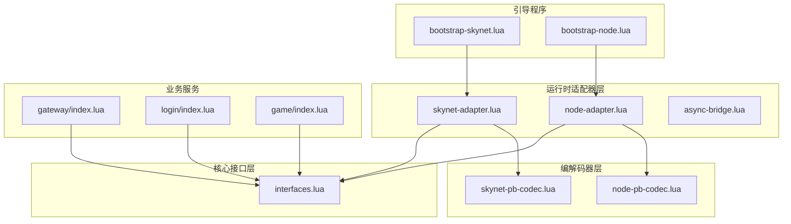
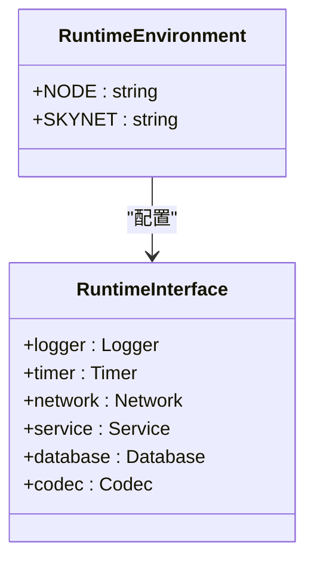
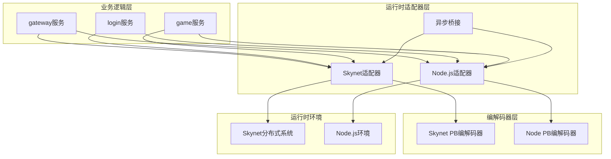
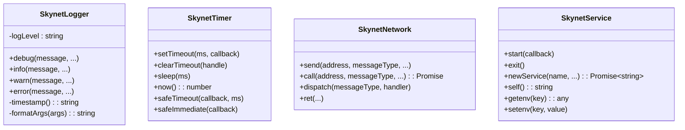
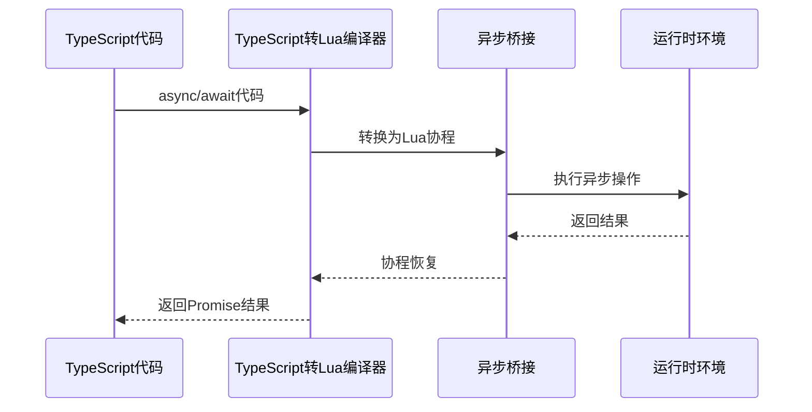
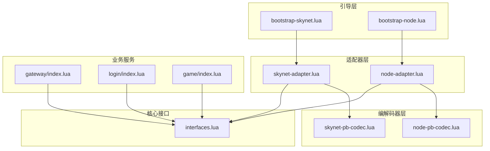
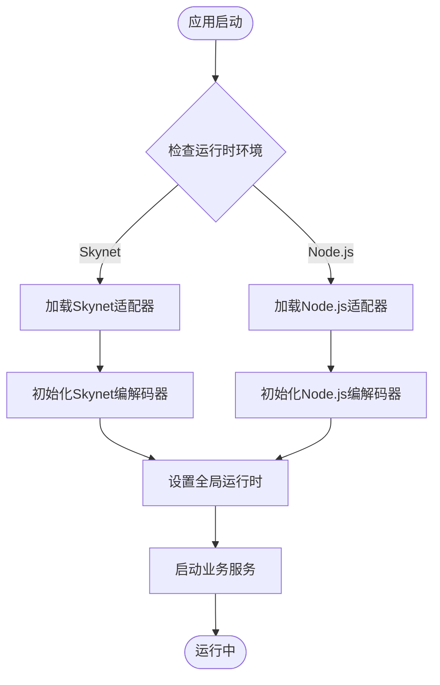

# 运行时适配器

<cite>
**本文档引用的文件**
- [skynet-adapter.lua](file://docker/lua/framework/runtime/skynet-adapter.lua)
- [node-adapter.lua](file://docker/lua/framework/runtime/node-adapter.lua)
- [async-bridge.lua](file://docker/lua/framework/runtime/async-bridge.lua)
- [skynet-pb-codec.lua](file://docker/lua/framework/runtime/skynet-pb-codec.lua)
- [node-pb-codec.lua](file://docker/lua/framework/runtime/node-pb-codec.lua)
- [interfaces.lua](file://docker/lua/framework/core/interfaces.lua)
- [bootstrap-skynet.lua](file://docker/lua/app/bootstrap-skynet.lua)
- [bootstrap-node.lua](file://docker/lua/app/bootstrap-node.lua)
- [gateway/index.lua](file://docker/lua/app/services/gateway/index.lua)
- [login/index.lua](file://docker/lua/app/services/login/index.lua)
- [game/index.lua](file://docker/lua/app/services/game/index.lua)
- [proto.lua](file://docker/lua/protos/proto.lua)
- [config.tslua](file://docker/skynet-runtime/config.tslua)
</cite>

## 目录
1. [简介](#简介)
2. [项目结构](#项目结构)
3. [核心组件](#核心组件)
4. [架构概览](#架构概览)
5. [详细组件分析](#详细组件分析)
6. [依赖关系分析](#依赖关系分析)
7. [性能考虑](#性能考虑)
8. [故障排除指南](#故障排除指南)
9. [结论](#结论)
10. [附录](#附录)

## 简介

TS-Skynet框架的运行时适配器是该框架的核心设计模式之一，它实现了适配器模式来支持不同的运行时环境。通过SkynetAdapter和NodeAdapter，框架能够在Skynet分布式游戏服务器和Node.js本地开发环境中无缝切换，同时保持业务代码的一致性和可移植性。

运行时适配器的主要目标是：
- 提供统一的API接口，屏蔽底层运行时差异
- 支持日志、定时器、网络、服务等核心功能的抽象
- 实现Protobuf消息编解码的跨平台兼容
- 确保业务逻辑在不同环境中的行为一致性

## 项目结构

TS-Skynet框架的运行时适配器位于`docker/lua/framework/runtime/`目录下，包含以下关键文件：

**图表来源**
- [skynet-adapter.lua:1-227](file://docker/lua/framework/runtime/skynet-adapter.lua#L1-L227)
- [node-adapter.lua:1-207](file://docker/lua/framework/runtime/node-adapter.lua#L1-L207)
- [interfaces.lua:1-24](file://docker/lua/framework/core/interfaces.lua#L1-L24)

**章节来源**
- [skynet-adapter.lua:1-227](file://docker/lua/framework/runtime/skynet-adapter.lua#L1-L227)
- [node-adapter.lua:1-207](file://docker/lua/framework/runtime/node-adapter.lua#L1-L207)
- [interfaces.lua:1-24](file://docker/lua/framework/core/interfaces.lua#L1-L24)

## 核心组件

### 运行时环境枚举

框架定义了两种运行时环境类型：

**图表来源**
- [interfaces.lua:6-22](file://docker/lua/framework/core/interfaces.lua#L6-L22)

### 统一运行时接口

全局运行时实例通过可变对象实现，确保在TSTL模块缓存机制下仍能正确更新：

- **logger**: 日志记录器接口
- **timer**: 定时器管理器接口  
- **network**: 网络通信接口
- **service**: 服务管理接口
- **database**: 数据库接口
- **codec**: 消息编解码器接口

**章节来源**
- [interfaces.lua:10-22](file://docker/lua/framework/core/interfaces.lua#L10-L22)

## 架构概览

TS-Skynet框架采用分层架构设计，运行时适配器位于核心层，向上提供统一接口，向下适配具体运行时环境：

**图表来源**
- [skynet-adapter.lua:205-225](file://docker/lua/framework/runtime/skynet-adapter.lua#L205-L225)
- [node-adapter.lua:185-205](file://docker/lua/framework/runtime/node-adapter.lua#L185-L205)

## 详细组件分析

### Skynet适配器实现

Skynet适配器提供了与Skynet分布式系统集成的完整运行时支持：

#### 日志系统实现

SkynetLogger类实现了完整的日志功能，支持调试级别控制和格式化输出：

**图表来源**
- [skynet-adapter.lua:19-225](file://docker/lua/framework/runtime/skynet-adapter.lua#L19-L225)

#### 定时器系统特性

Skynet定时器系统具有以下特点：
- 时间单位转换：将毫秒转换为Skynet的厘秒（1/100秒）
- 异步安全执行：safeTimeout确保回调异常不会影响主流程
- 协程支持：与Skynet协程系统无缝集成

#### 网络通信实现

Skynet网络层直接封装了Skynet的通信原语：
- `skynet.send()`: 发送无应答消息
- `skynet.call()`: 发送请求并等待响应
- `skynet.dispatch()`: 注册消息处理器
- `skynet.retpack()`: 返回打包数据

#### 服务管理功能

Skynet服务适配器提供了完整的服务生命周期管理：
- 服务启动和退出
- 新服务创建和地址管理
- 环境变量读写
- 自身服务地址获取

**章节来源**
- [skynet-adapter.lua:19-225](file://docker/lua/framework/runtime/skynet-adapter.lua#L19-L225)

### Node.js适配器实现

Node.js适配器提供了本地开发和测试环境的支持：

#### 本地日志系统

NodeLogger使用标准的console API：
- 结构化日志输出
- 控制台颜色支持
- 异步日志写入

#### 事件驱动网络

NodeNetwork使用内存中的事件系统模拟分布式通信：
- 内存中的消息路由
- 会话ID管理和超时处理
- 模拟的RPC调用机制

#### 服务模拟实现

NodeService提供了最小化的服务管理：
- 基于时间戳的服务ID生成
- 异步服务启动
- 环境变量模拟

**章节来源**
- [node-adapter.lua:14-207](file://docker/lua/framework/runtime/node-adapter.lua#L14-L207)

### 异步桥接机制

异步桥接层解决了TypeScript到Lua的异步转换问题：

**图表来源**
- [async-bridge.lua:206-241](file://docker/lua/framework/runtime/async-bridge.lua#L206-L241)

**章节来源**
- [async-bridge.lua:15-243](file://docker/lua/framework/runtime/async-bridge.lua#L15-L243)

### Protobuf编解码器

#### Skynet PB编解码器

Skynet版本使用lua-protobuf库：
- 动态加载proto描述文件
- 类型安全的消息编解码
- 性能优化的二进制序列化

#### Node.js PB编解码器

Node.js版本使用JSON回退机制：
- 兼容的API接口
- JSON序列化作为回退方案
- 与Skynet版本的完全兼容

**章节来源**
- [skynet-pb-codec.lua:51-162](file://docker/lua/framework/runtime/skynet-pb-codec.lua#L51-L162)
- [node-pb-codec.lua:53-183](file://docker/lua/framework/runtime/node-pb-codec.lua#L53-L183)

## 依赖关系分析

运行时适配器的依赖关系体现了清晰的分层设计：

**图表来源**
- [bootstrap-skynet.lua:5-9](file://docker/lua/app/bootstrap-skynet.lua#L5-L9)
- [bootstrap-node.lua:5-12](file://docker/lua/app/bootstrap-node.lua#L5-L12)

**章节来源**
- [bootstrap-skynet.lua:1-12](file://docker/lua/app/bootstrap-skynet.lua#L1-L12)
- [bootstrap-node.lua:1-17](file://docker/lua/app/bootstrap-node.lua#L1-L17)

## 性能考虑

### Skynet环境优势

1. **高并发处理能力**
   - 基于C的高性能协程调度
   - 分布式内存管理
   - 优化的网络I/O处理

2. **资源利用率**
   - 低内存占用
   - 高CPU效率
   - 可扩展的集群架构

### Node.js环境特点

1. **开发便利性**
   - 快速启动和热重载
   - 丰富的开发工具生态
   - 简单的部署流程

2. **性能限制**
   - 单进程内存限制
   - JavaScript运行时开销
   - I/O操作的异步限制

### 性能对比建议

| 特性 | Skynet | Node.js |
|------|--------|---------|
| 启动速度 | 中等 | 快速 |
| 内存占用 | 低 | 中等 |
| 并发能力 | 极高 | 中等 |
| 开发效率 | 中等 | 高 |
| 生产稳定性 | 高 | 中等 |

**选择建议**：
- **生产环境**：优先选择Skynet，获得最佳的性能和稳定性
- **开发测试**：使用Node.js，提高开发效率
- **混合部署**：核心服务使用Skynet，开发工具使用Node.js

## 故障排除指南

### 常见问题诊断

#### 编解码器初始化失败

**症状**：运行时出现"Codec not available"错误
**原因**：
- lua-protobuf库未安装
- proto文件路径配置错误
- 消息类型映射不完整

**解决方案**：
1. 确认lua-protobuf库已正确安装
2. 检查proto文件路径配置
3. 验证消息类型映射表完整性

#### 网络通信异常

**症状**：服务间通信失败或超时
**原因**：
- 服务地址解析错误
- 消息类型不匹配
- 网络适配器配置问题

**解决方案**：
1. 验证服务地址格式
2. 检查消息类型注册
3. 确认网络适配器状态

#### 定时器精度问题

**症状**：定时器触发时间不准确
**原因**：
- Skynet时间单位转换
- 系统负载过高
- 协程调度延迟

**解决方案**：
1. 使用safeTimeout确保异常处理
2. 监控系统资源使用
3. 优化协程调度策略

**章节来源**
- [skynet-pb-codec.lua:22-24](file://docker/lua/framework/runtime/skynet-pb-codec.lua#L22-L24)
- [node-pb-codec.lua:62-74](file://docker/lua/framework/runtime/node-pb-codec.lua#L62-L74)

## 结论

TS-Skynet框架的运行时适配器通过精心设计的适配器模式，成功实现了跨平台运行时环境的统一抽象。该设计具有以下优势：

1. **高度可移植性**：业务代码无需关心底层运行时差异
2. **清晰的职责分离**：每层都有明确的功能边界
3. **完善的错误处理**：各层都具备健壮的异常处理机制
4. **灵活的扩展性**：易于添加新的运行时环境支持

通过SkynetAdapter和NodeAdapter的协同工作，框架既满足了生产环境对性能和稳定性的要求，又提供了开发环境对效率和便利性的需求。这种设计为大型分布式系统的开发提供了坚实的基础。

## 附录

### 运行时切换流程

**图表来源**
- [bootstrap-skynet.lua:7-9](file://docker/lua/app/bootstrap-skynet.lua#L7-L9)
- [bootstrap-node.lua:7-12](file://docker/lua/app/bootstrap-node.lua#L7-L12)

### 配置文件说明

Skynet运行时配置文件位于`docker/skynet-runtime/config.tslua`，主要参数包括：

- **thread**: 工作线程数量（默认8）
- **bootstrap**: 启动模块（默认"snlua bootstrap"）
- **start**: 启动脚本（默认"app_main"）
- **harbor**: 单节点模式（默认0）
- **logger**: 日志输出配置
- **daemon**: 守护进程设置

**章节来源**
- [config.tslua:7-35](file://docker/skynet-runtime/config.tslua#L7-L35)