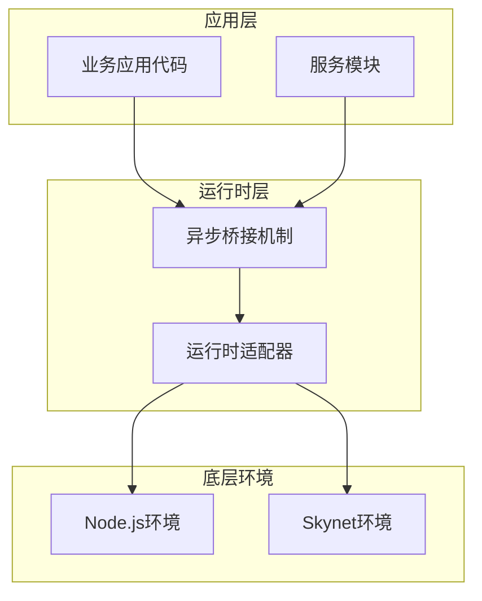
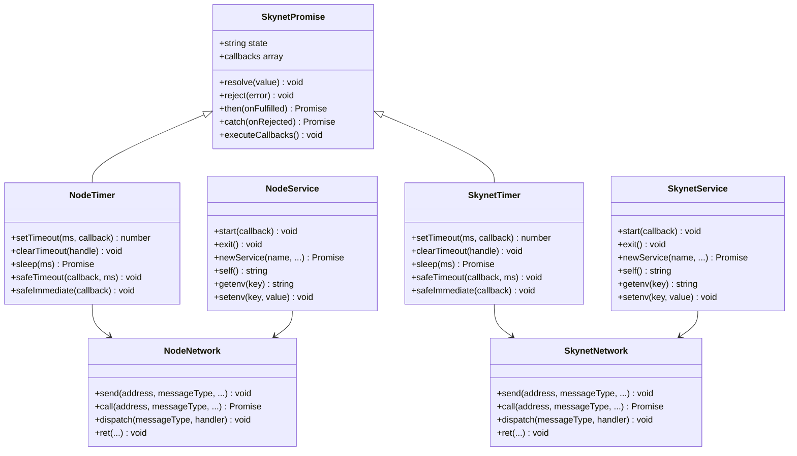
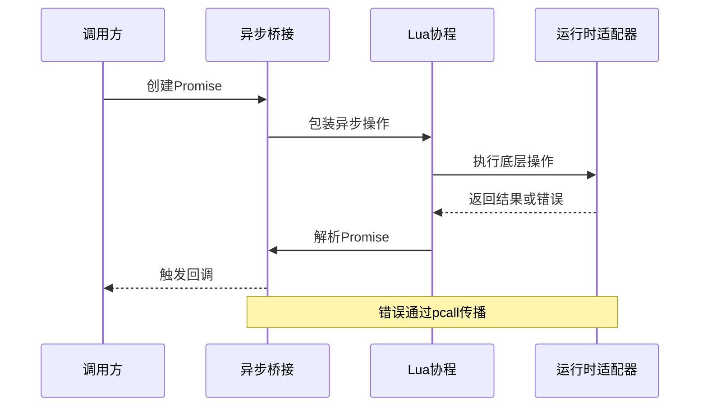
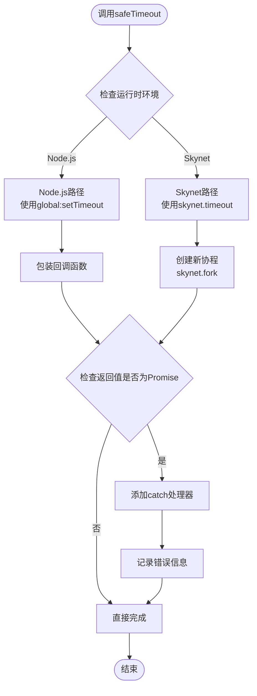
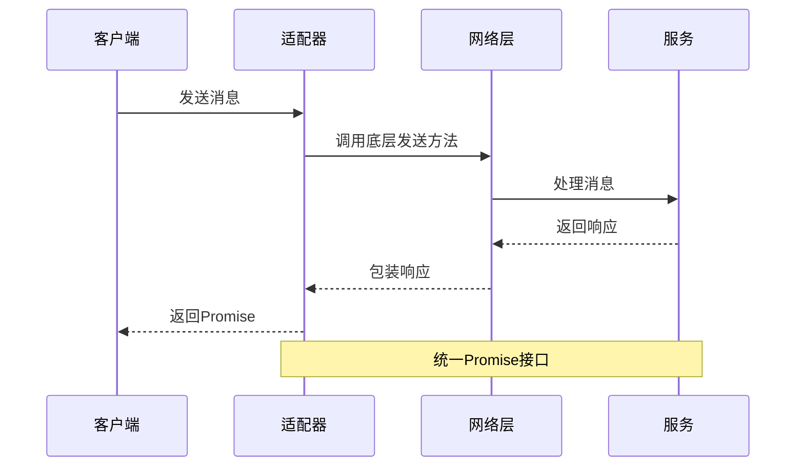
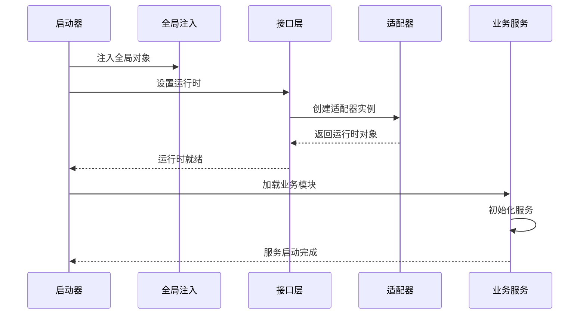
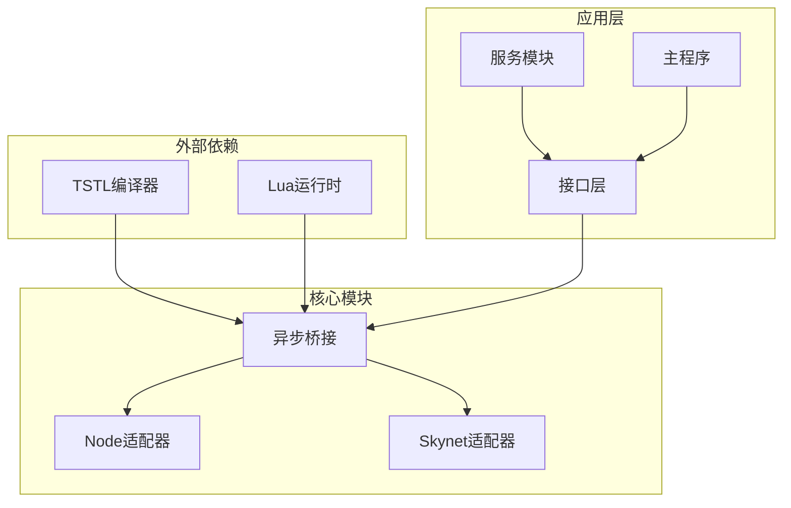

# 异步桥接机制

<cite>
**本文档引用的文件**
- [async-bridge.lua](file://docker\lua\framework\runtime\async-bridge.lua)
- [node-adapter.lua](file://docker\lua\framework\runtime\node-adapter.lua)
- [skynet-adapter.lua](file://docker\lua\framework\runtime\skynet-adapter.lua)
- [ts_launcher.lua](file://docker\native\ts_launcher.lua)
- [ts_bootstrap.lua](file://docker\native\ts_bootstrap.lua)
- [main.lua](file://docker\lua\app\main.lua)
</cite>

## 目录
1. [简介](#简介)
2. [项目结构](#项目结构)
3. [核心组件](#核心组件)
4. [架构概览](#架构概览)
5. [详细组件分析](#详细组件分析)
6. [依赖关系分析](#依赖关系分析)
7. [性能考虑](#性能考虑)
8. [故障排除指南](#故障排除指南)
9. [结论](#结论)
10. [附录](#附录)

## 简介

异步桥接机制是TS-Skynet框架中实现Promise到协程转换的核心技术，它解决了Node.js异步模型与Skynet协程模型之间的差异。该机制通过统一的运行时接口，使得TypeScript代码能够在不同的运行环境中无缝执行，同时保持一致的异步编程体验。

本机制主要包含三个核心部分：
- **Promise到协程的转换**：将JavaScript的Promise异步模型转换为Lua协程
- **跨平台适配器**：提供Node.js和Skynet两种运行时环境的统一接口
- **协程安全方法**：确保异步操作在协程环境中的安全性

## 项目结构

TS-Skynet框架采用分层架构设计，异步桥接机制位于运行时层，为上层应用提供统一的异步编程接口。



**图表来源**
- [async-bridge.lua:1-243](file://docker\lua\framework\runtime\async-bridge.lua#L1-L243)
- [node-adapter.lua:1-207](file://docker\lua\framework\runtime\node-adapter.lua#L1-L207)
- [skynet-adapter.lua:1-227](file://docker\lua\framework\runtime\skynet-adapter.lua#L1-L227)

**章节来源**
- [async-bridge.lua:1-243](file://docker\lua\framework\runtime\async-bridge.lua#L1-L243)
- [node-adapter.lua:1-207](file://docker\lua\framework\runtime\node-adapter.lua#L1-L207)
- [skynet-adapter.lua:1-227](file://docker\lua\framework\runtime\skynet-adapter.lua#L1-L227)

## 核心组件

异步桥接机制由以下核心组件构成：

### 1. SkynetPromise类
这是异步桥接机制的核心，实现了完整的Promise/A+规范，专门为Skynet协程环境设计。

### 2. 运行时适配器
提供Node.js和Skynet两种不同运行时环境的统一接口：
- **NodeAdapter**：Node.js环境适配器
- **SkynetAdapter**：Skynet环境适配器

### 3. 协程安全方法
提供安全的异步操作封装：
- **safeTimeout**：安全的定时器封装
- **safeImmediate**：安全的立即执行封装

**章节来源**
- [async-bridge.lua:17-166](file://docker\lua\framework\runtime\async-bridge.lua#L17-L166)
- [node-adapter.lua:32-86](file://docker\lua\framework\runtime\node-adapter.lua#L32-L86)
- [skynet-adapter.lua:78-127](file://docker\lua\framework\runtime\skynet-adapter.lua#L78-L127)

## 架构概览

异步桥接机制采用分层架构，通过适配器模式实现跨平台兼容性。



**图表来源**
- [async-bridge.lua:17-166](file://docker\lua\framework\runtime\async-bridge.lua#L17-L166)
- [node-adapter.lua:32-183](file://docker\lua\framework\runtime\node-adapter.lua#L32-L183)
- [skynet-adapter.lua:78-203](file://docker\lua\framework\runtime\skynet-adapter.lua#L78-L203)

## 详细组件分析

### Promise到协程转换原理

异步桥接机制的核心在于将JavaScript的Promise异步模型转换为Lua协程。这一过程通过以下步骤实现：

#### 1. Promise状态管理
SkynetPromise实现了完整的Promise状态机，包括pending、fulfilled和rejected三种状态。

#### 2. 回调队列机制
当Promise状态改变时，相关的回调函数会被依次执行，确保异步操作的正确顺序。

#### 3. 错误传播机制
通过pcall包装回调函数，确保错误能够正确传播到Promise链的catch阶段。



**图表来源**
- [async-bridge.lua:20-78](file://docker\lua\framework\runtime\async-bridge.lua#L20-L78)
- [async-bridge.lua:206-224](file://docker\lua\framework\runtime\async-bridge.lua#L206-L224)

**章节来源**
- [async-bridge.lua:20-78](file://docker\lua\framework\runtime\async-bridge.lua#L20-L78)
- [async-bridge.lua:206-224](file://docker\lua\framework\runtime\async-bridge.lua#L206-L224)

### safeTimeout和safeImmediate实现原理

这两个协程安全方法是异步桥接机制的重要组成部分，它们确保异步操作在协程环境中的安全性。

#### safeTimeout实现机制



**图表来源**
- [node-adapter.lua:64-76](file://docker\lua\framework\runtime\node-adapter.lua#L64-L76)
- [skynet-adapter.lua:109-124](file://docker\lua\framework\runtime\skynet-adapter.lua#L109-L124)

#### Node.js环境实现特点
- 使用global:setTimeout进行定时器调度
- 自动检测Promise返回值并添加错误处理
- 通过console.error记录异常信息

#### Skynet环境实现特点
- 使用skynet.timeout创建定时器
- 通过skynet.fork创建独立协程执行回调
- 使用skynet.error记录异常信息

**章节来源**
- [node-adapter.lua:64-86](file://docker\lua\framework\runtime\node-adapter.lua#L64-L86)
- [skynet-adapter.lua:109-127](file://docker\lua\framework\runtime\skynet-adapter.lua#L109-L127)

### 跨平台适配器设计

运行时适配器通过统一的接口抽象，屏蔽了不同平台的差异。

#### 接口一致性设计

| 方法 | Node.js实现 | Skynet实现 |
|------|-------------|------------|
| setTimeout | global:setTimeout | skynet.timeout |
| clearTimeout | global:clearTimeout | 无返回值 |
| sleep | Promise包装setTimeout | Promise包装skynet.timeout |
| safeTimeout | Promise包装 | fork协程包装 |
| safeImmediate | Promise包装 | fork协程包装 |

#### 网络通信适配



**图表来源**
- [node-adapter.lua:97-132](file://docker\lua\framework\runtime\node-adapter.lua#L97-L132)
- [skynet-adapter.lua:134-167](file://docker\lua\framework\runtime\skynet-adapter.lua#L134-L167)

**章节来源**
- [node-adapter.lua:88-183](file://docker\lua\framework\runtime\node-adapter.lua#L88-L183)
- [skynet-adapter.lua:128-203](file://docker\lua\framework\runtime\skynet-adapter.lua#L128-L203)

### 启动流程集成

异步桥接机制与TS-Skynet的启动流程深度集成，确保服务能够正确初始化。



**图表来源**
- [ts_launcher.lua:12-25](file://docker\native\ts_launcher.lua#L12-L25)
- [ts_bootstrap.lua:14-32](file://docker\native\ts_bootstrap.lua#L14-L32)

**章节来源**
- [ts_launcher.lua:12-25](file://docker\native\ts_launcher.lua#L12-L25)
- [ts_bootstrap.lua:14-32](file://docker\native\ts_bootstrap.lua#L14-L32)

## 依赖关系分析

异步桥接机制的依赖关系体现了清晰的分层架构设计。



**图表来源**
- [async-bridge.lua:1-14](file://docker\lua\framework\runtime\async-bridge.lua#L1-L14)
- [node-adapter.lua:12-13](file://docker\lua\framework\runtime\node-adapter.lua#L12-L13)
- [skynet-adapter.lua:14-15](file://docker\lua\framework\runtime\skynet-adapter.lua#L14-L15)

**章节来源**
- [async-bridge.lua:1-14](file://docker\lua\framework\runtime\async-bridge.lua#L1-L14)
- [node-adapter.lua:12-13](file://docker\lua\framework\runtime\node-adapter.lua#L12-L13)
- [skynet-adapter.lua:14-15](file://docker\lua\framework\runtime\skynet-adapter.lua#L14-L15)

## 性能考虑

异步桥接机制在设计时充分考虑了性能优化，主要体现在以下几个方面：

### 1. 协程切换开销最小化
- 通过wrapSkynetCoroutine减少不必要的协程切换
- 使用本地缓存避免重复的对象创建

### 2. 内存使用优化
- Promise回调队列采用数组存储，支持动态扩展
- 及时清理已完成的Promise状态，释放内存

### 3. 并发控制
- safeTimeout使用skynet.fork创建独立协程，避免阻塞主线程
- Node.js环境使用Promise链式调用，减少回调嵌套

### 4. 错误处理优化
- 通过pcall包装回调，避免错误传播导致的性能损失
- 统一的错误日志记录，便于性能监控

## 故障排除指南

### 常见问题及解决方案

#### 1. Promise链中断问题
**症状**：Promise链中的某些回调没有执行
**原因**：回调函数抛出异常被pcall捕获
**解决方案**：检查回调函数中的错误处理逻辑

#### 2. 协程死锁问题
**症状**：服务启动后无法继续执行
**原因**：异步操作未正确解析Promise
**解决方案**：确保所有异步操作都有对应的resolve或reject调用

#### 3. 内存泄漏问题
**症状**：长时间运行后内存持续增长
**原因**：Promise回调队列未及时清理
**解决方案**：定期检查和清理不再使用的Promise对象

#### 4. 跨平台兼容性问题
**症状**：在不同运行时环境中行为不一致
**原因**：时间单位或API差异
**解决方案**：使用适配器提供的统一接口

**章节来源**
- [async-bridge.lua:24-36](file://docker\lua\framework\runtime\async-bridge.lua#L24-L36)
- [skynet-adapter.lua:114-121](file://docker\lua\framework\runtime\skynet-adapter.lua#L114-L121)

## 结论

异步桥接机制成功解决了Node.js异步模型与Skynet协程模型之间的差异，通过统一的Promise接口和运行时适配器，为开发者提供了无缝的跨平台开发体验。

### 主要优势
- **统一接口**：提供一致的异步编程模型
- **跨平台兼容**：支持Node.js和Skynet两种运行环境
- **协程安全**：确保异步操作在协程环境中的安全性
- **性能优化**：最小化协程切换开销和内存使用

### 技术创新点
- 完整的Promise/A+实现，专门针对协程环境优化
- 智能的运行时检测和适配机制
- 安全的异步操作封装，防止协程阻塞

该机制为TS-Skynet框架奠定了坚实的异步编程基础，使得复杂的分布式系统开发变得更加简单和可靠。

## 附录

### 最佳实践建议

#### 1. 异步函数包装
```typescript
// 推荐：使用wrapSkynetCoroutine包装异步函数
const asyncFunc = wrapSkynetCoroutine(() => {
    // 异步操作
    return result;
});
```

#### 2. 错误处理策略
```typescript
// 推荐：使用safeTimeout处理定时任务
safeTimeout(() => {
    // 可能抛出异常的代码
}, 1000);
```

#### 3. 性能优化技巧
- 避免深层Promise链嵌套
- 及时清理不再使用的Promise对象
- 合理使用safeImmediate进行微任务调度