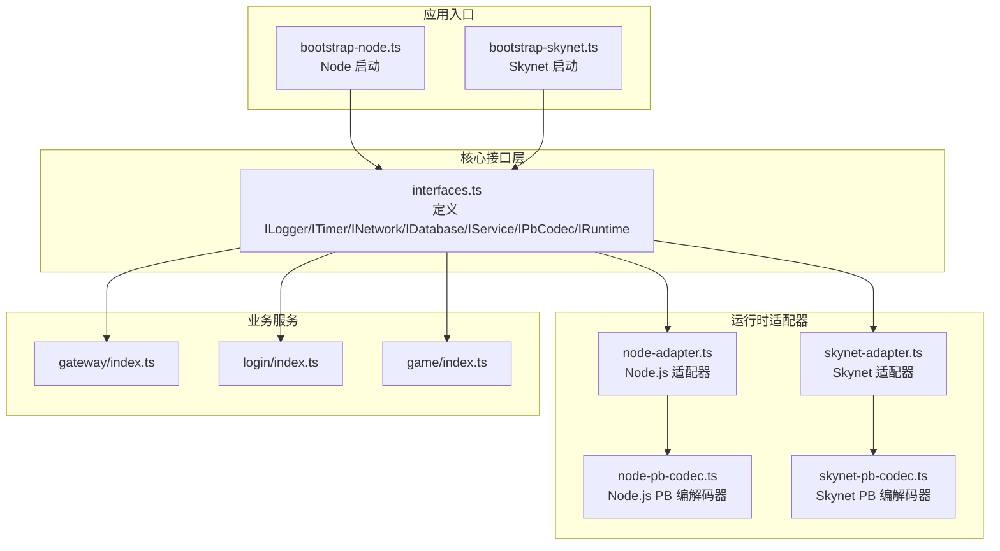
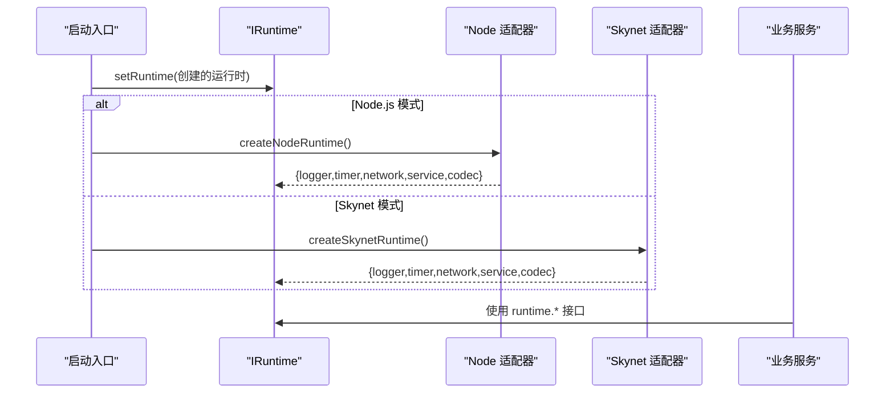
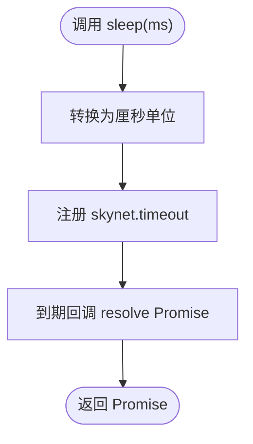
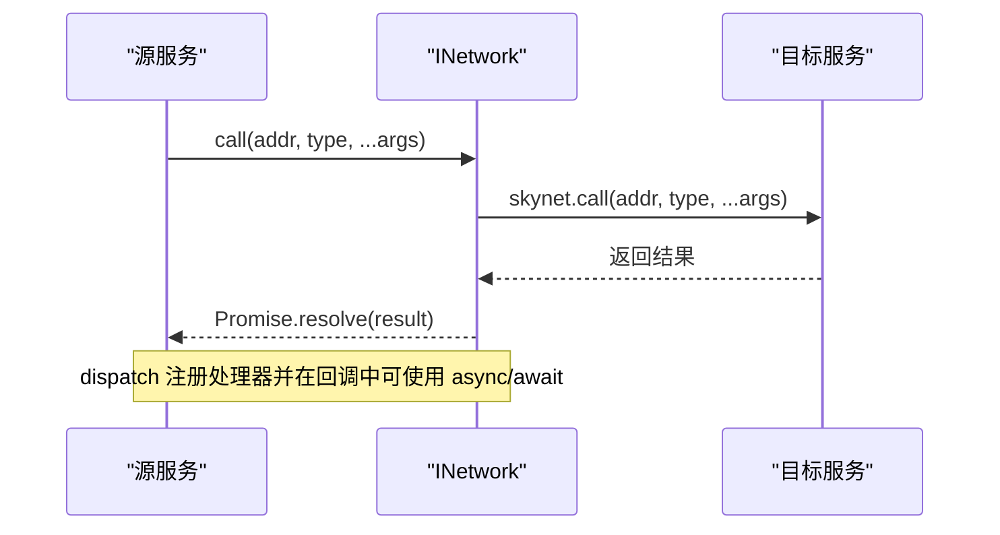
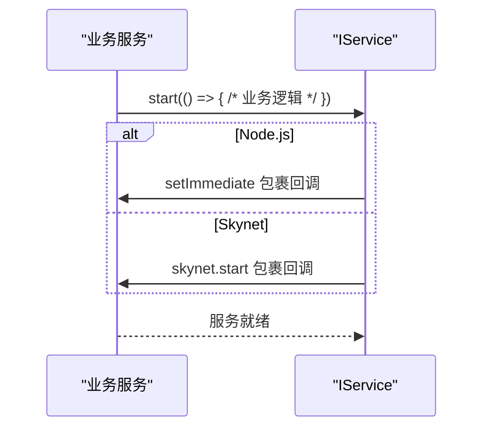
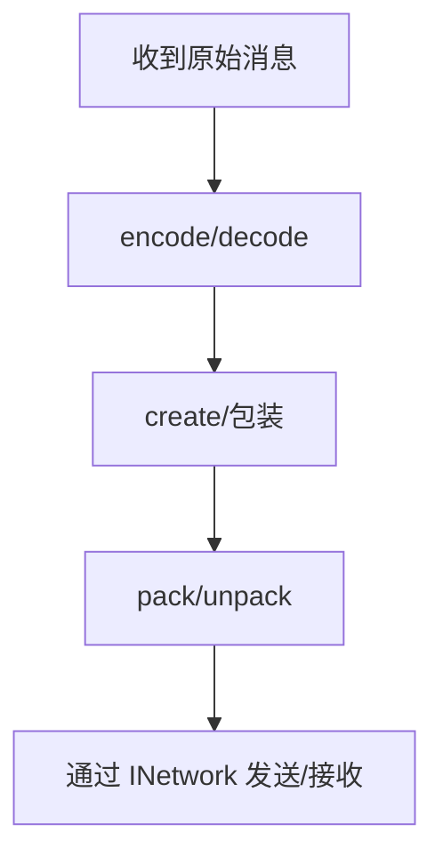
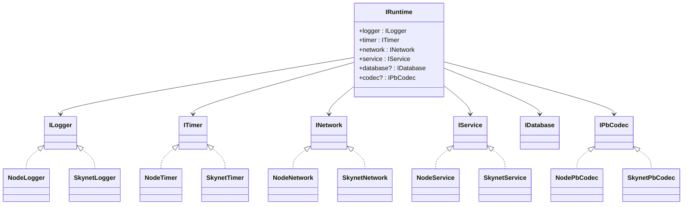

# 接口抽象层

<cite>
**本文档引用的文件**
- [interfaces.ts](file://server/src/framework/core/interfaces.ts)
- [interfaces.lua](file://docker/lua/framework/core/interfaces.lua)
- [node-adapter.ts](file://server/src/framework/runtime/node-adapter.ts)
- [skynet-adapter.ts](file://server/src/framework/runtime/skynet-adapter.ts)
- [node-pb-codec.ts](file://server/src/framework/runtime/node-pb-codec.ts)
- [skynet-pb-codec.ts](file://server/src/framework/runtime/skynet-pb-codec.ts)
- [node-adapter.lua](file://docker/lua/framework/runtime/node-adapter.lua)
- [skynet-adapter.lua](file://docker/lua/framework/runtime/skynet-adapter.lua)
- [node-pb-codec.lua](file://docker/lua/framework/runtime/node-pb-codec.lua)
- [skynet-pb-codec.lua](file://docker/lua/framework/runtime/skynet-pb-codec.lua)
- [bootstrap-node.ts](file://server/src/app/bootstrap-node.ts)
- [bootstrap-skynet.ts](file://server/src/app/bootstrap-skynet.ts)
- [gateway/index.ts](file://server/src/app/services/gateway/index.ts)
- [login/index.ts](file://server/src/app/services/login/index.ts)
- [game/index.ts](file://server/src/app/services/game/index.ts)
</cite>

## 目录
1. [简介](#简介)
2. [项目结构](#项目结构)
3. [核心组件](#核心组件)
4. [架构总览](#架构总览)
5. [详细组件分析](#详细组件分析)
6. [依赖关系分析](#依赖关系分析)
7. [性能考虑](#性能考虑)
8. [故障排除指南](#故障排除指南)
9. [结论](#结论)

## 简介
本文件系统性阐述接口抽象层的设计与实现，重点覆盖以下核心接口：
- ILogger：日志抽象
- ITimer：定时器与睡眠抽象
- INetwork：网络消息发送、调用与消息分发抽象
- IDatabase：数据库查询与事务抽象
- IService：服务生命周期与环境变量抽象
- IPbCodec：Protocol Buffer 编解码与打包解包抽象
- IRuntime：统一运行时上下文容器

该抽象层通过 Node.js 与 Skynet 两套适配器实现对不同运行时的统一抽象，使业务代码与底层运行时解耦，显著提升可移植性与可测试性。

## 项目结构
接口抽象层位于 server/src/framework 下，按功能划分为 core（接口定义）与 runtime（运行时适配器）。同时提供对应的 Lua 编译产物，便于在 Skynet 环境中直接使用。

**图表来源**
- [interfaces.ts:1-226](file://server/src/framework/core/interfaces.ts#L1-L226)
- [node-adapter.ts:1-194](file://server/src/framework/runtime/node-adapter.ts#L1-L194)
- [skynet-adapter.ts:1-221](file://server/src/framework/runtime/skynet-adapter.ts#L1-L221)
- [node-pb-codec.ts:1-162](file://server/src/framework/runtime/node-pb-codec.ts#L1-L162)
- [skynet-pb-codec.ts:1-184](file://server/src/framework/runtime/skynet-pb-codec.ts#L1-L184)
- [bootstrap-node.ts:1-22](file://server/src/app/bootstrap-node.ts#L1-L22)
- [bootstrap-skynet.ts:1-20](file://server/src/app/bootstrap-skynet.ts#L1-L20)
- [gateway/index.ts:1-206](file://server/src/app/services/gateway/index.ts#L1-L206)
- [login/index.ts:1-154](file://server/src/app/services/login/index.ts#L1-L154)
- [game/index.ts:1-136](file://server/src/app/services/game/index.ts#L1-L136)

**章节来源**
- [interfaces.ts:1-226](file://server/src/framework/core/interfaces.ts#L1-L226)
- [node-adapter.ts:1-194](file://server/src/framework/runtime/node-adapter.ts#L1-L194)
- [skynet-adapter.ts:1-221](file://server/src/framework/runtime/skynet-adapter.ts#L1-L221)

## 核心组件
本节概述各接口的设计理念、方法语义与典型使用场景，并给出跨运行时的一致性说明。

- ILogger：提供 debug/info/warn/error 四级日志能力，屏蔽底层输出差异，便于统一日志策略与格式化。
- ITimer：提供 setTimeout/clearTimeout/sleep/now，以及协程安全的 safeTimeout/safeImmediate，确保在 Skynet 协程环境中正确执行回调。
- INetwork：提供 send/call/dispatch/ret，屏蔽底层消息路由与响应模型差异；call 返回 Promise，dispatch 注册处理器。
- IDatabase：提供 query/execute/transaction，统一 SQL 访问与事务控制，便于替换不同存储后端。
- IService：提供 start/exit/newService/self/getenv/setenv，屏蔽服务生命周期与环境变量差异。
- IPbCodec：提供 encode/decode/create/pack/unpack，统一消息编解码与包体打包解包，支持 Node.js 与 Skynet 的不同 PB 实现。
- IRuntime：聚合 logger/timer/network/service/database/codec，通过 setRuntime 注入具体实现，业务代码仅依赖 runtime。

**章节来源**
- [interfaces.ts:9-196](file://server/src/framework/core/interfaces.ts#L9-L196)

## 架构总览
抽象层通过“接口 + 适配器”的模式实现对 Node.js 与 Skynet 的统一抽象。业务服务通过 runtime 访问底层能力，启动阶段由入口文件注入对应运行时。

**图表来源**
- [bootstrap-node.ts:1-22](file://server/src/app/bootstrap-node.ts#L1-L22)
- [bootstrap-skynet.ts:1-20](file://server/src/app/bootstrap-skynet.ts#L1-L20)
- [node-adapter.ts:177-194](file://server/src/framework/runtime/node-adapter.ts#L177-L194)
- [skynet-adapter.ts:204-221](file://server/src/framework/runtime/skynet-adapter.ts#L204-L221)

## 详细组件分析

### ILogger 接口
- 设计理念：统一日志级别与输出格式，屏蔽底层 console/skynet.error 的差异。
- 方法与语义：
  - debug(message, ...args): 输出调试日志
  - info(message, ...args): 输出信息日志
  - warn(message, ...args): 输出警告日志
  - error(message, ...args): 输出错误日志
- 使用场景：服务启动、命令处理、错误追踪、性能监控等。
- 运行时差异：
  - Node.js：直接使用 console.* 输出
  - Skynet：使用 skynet.error 输出并添加时间戳与格式化参数

**章节来源**
- [interfaces.ts:9-14](file://server/src/framework/core/interfaces.ts#L9-L14)
- [node-adapter.ts:19-35](file://server/src/framework/runtime/node-adapter.ts#L19-L35)
- [skynet-adapter.ts:28-63](file://server/src/framework/runtime/skynet-adapter.ts#L28-L63)

### ITimer 接口
- 设计理念：统一定时与睡眠抽象，支持协程安全回调。
- 方法与语义：
  - setTimeout(ms, callback): 注册延迟回调，返回句柄
  - clearTimeout(handle): 取消定时器（Skynet 不支持取消）
  - sleep(ms): Promise 化的睡眠
  - now(): 当前时间戳（秒）
  - safeTimeout(callback, ms?): 在 Skynet 协程中执行回调
  - safeImmediate(callback): 等价于 safeTimeout(callback, 0)
- 运行时差异：
  - Node.js：基于 global.setTimeout/global.setImmediate，Promise 化 sleep
  - Skynet：厘秒单位（1/100 秒），使用 skynet.timeout；safeTimeout 通过 skynet.fork 包裹回调

**图表来源**
- [skynet-adapter.ts:81-90](file://server/src/framework/runtime/skynet-adapter.ts#L81-L90)

**章节来源**
- [interfaces.ts:19-58](file://server/src/framework/core/interfaces.ts#L19-L58)
- [node-adapter.ts:40-85](file://server/src/framework/runtime/node-adapter.ts#L40-L85)
- [skynet-adapter.ts:69-122](file://server/src/framework/runtime/skynet-adapter.ts#L69-L122)

### INetwork 接口
- 设计理念：统一消息发送、远程调用与消息分发，屏蔽底层 send/call/dispatch/ret 的差异。
- 方法与语义：
  - send(address, messageType, ...args): 发送消息（无响应）
  - call(address, messageType, ...args): 发起调用并等待响应（Promise）
  - dispatch(messageType, handler): 注册消息处理器（session, source, ...args）
  - ret(...args): 返回响应
- 运行时差异：
  - Node.js：模拟 call 的 Promise 行为与处理器注册
  - Skynet：直接使用 skynet.send/call/dispatch/retpack

**图表来源**
- [skynet-adapter.ts:132-154](file://server/src/framework/runtime/skynet-adapter.ts#L132-L154)

**章节来源**
- [interfaces.ts:63-83](file://server/src/framework/core/interfaces.ts#L63-L83)
- [node-adapter.ts:91-128](file://server/src/framework/runtime/node-adapter.ts#L91-L128)
- [skynet-adapter.ts:127-155](file://server/src/framework/runtime/skynet-adapter.ts#L127-L155)

### IDatabase 接口
- 设计理念：统一 SQL 查询、执行与事务抽象，便于替换不同数据库驱动。
- 方法与语义：
  - query(sql, params?): 返回结果集
  - execute(sql, params?): 返回影响行数
  - transaction(callback(db)): 事务包裹
- 使用建议：在业务服务中尽量通过 runtime.database 访问，避免直接依赖具体数据库实现。

**章节来源**
- [interfaces.ts:88-103](file://server/src/framework/core/interfaces.ts#L88-L103)

### IService 接口
- 设计理念：统一服务生命周期与环境变量访问，屏蔽 start/exit/newService/self/getenv/setenv 的差异。
- 方法与语义：
  - start(callback): 启动服务（callback 必须为同步，内部可异步）
  - exit(): 退出服务
  - newService(name, ...args): 创建新服务并返回地址
  - self(): 获取当前服务地址
  - getenv(key)/setenv(key, value): 环境变量读写
- 运行时差异：
  - Node.js：start 使用 setImmediate 包裹回调；newService 返回模拟地址
  - Skynet：start 使用 skynet.start，newService 使用 skynet.newservice

**图表来源**
- [node-adapter.ts:136-146](file://server/src/framework/runtime/node-adapter.ts#L136-L146)
- [skynet-adapter.ts:161-174](file://server/src/framework/runtime/skynet-adapter.ts#L161-L174)

**章节来源**
- [interfaces.ts:108-138](file://server/src/framework/core/interfaces.ts#L108-L138)
- [node-adapter.ts:133-172](file://server/src/framework/runtime/node-adapter.ts#L133-L172)
- [skynet-adapter.ts:160-199](file://server/src/framework/runtime/skynet-adapter.ts#L160-L199)

### IPbCodec 接口
- 设计理念：统一消息编解码与包体打包解包，屏蔽 Node.js 与 Skynet 的 PB 实现差异。
- 方法与语义：
  - encode(messageType, message): 编码消息为 Uint8Array
  - decode(messageType, data): 解码 Uint8Array 为消息对象
  - create(messageType, init?): 创建消息对象
  - pack(msgId, messageType, message, session?): 打包为 Packet
  - unpack(data): 解包 Packet，返回 {msgId, messageType, message, session}
- 运行时差异：
  - Node.js：基于 protobufjs，静态导入 proto.js
  - Skynet：基于 lua-protobuf，动态加载 .desc 文件

**图表来源**
- [node-pb-codec.ts:70-160](file://server/src/framework/runtime/node-pb-codec.ts#L70-L160)
- [skynet-pb-codec.ts:116-182](file://server/src/framework/runtime/skynet-pb-codec.ts#L116-L182)

**章节来源**
- [interfaces.ts:144-183](file://server/src/framework/core/interfaces.ts#L144-L183)
- [node-pb-codec.ts:1-162](file://server/src/framework/runtime/node-pb-codec.ts#L1-L162)
- [skynet-pb-codec.ts:1-184](file://server/src/framework/runtime/skynet-pb-codec.ts#L1-L184)

### IRuntime 上下文
- 设计理念：集中承载各抽象接口实例，通过 setRuntime 注入，业务代码仅依赖 runtime。
- 成员：
  - logger: ILogger
  - timer: ITimer
  - network: INetwork
  - service: IService
  - database?: IDatabase
  - codec?: IPbCodec
- 运行时环境枚举：NODE/ SKYNET

**章节来源**
- [interfaces.ts:189-225](file://server/src/framework/core/interfaces.ts#L189-L225)

## 依赖关系分析
- 接口依赖：业务服务仅依赖 runtime.*，不直接依赖 Node.js 或 Skynet API。
- 适配器依赖：各适配器实现具体接口，注入到 IRuntime。
- 编解码器依赖：IPbCodec 由对应运行时创建并注入到 IRuntime，业务服务按需使用。

**图表来源**
- [interfaces.ts:9-196](file://server/src/framework/core/interfaces.ts#L9-L196)
- [node-adapter.ts:19-172](file://server/src/framework/runtime/node-adapter.ts#L19-L172)
- [skynet-adapter.ts:28-199](file://server/src/framework/runtime/skynet-adapter.ts#L28-L199)
- [node-pb-codec.ts:49-161](file://server/src/framework/runtime/node-pb-codec.ts#L49-L161)
- [skynet-pb-codec.ts:65-183](file://server/src/framework/runtime/skynet-pb-codec.ts#L65-L183)

**章节来源**
- [interfaces.ts:1-226](file://server/src/framework/core/interfaces.ts#L1-L226)
- [node-adapter.ts:1-194](file://server/src/framework/runtime/node-adapter.ts#L1-L194)
- [skynet-adapter.ts:1-221](file://server/src/framework/runtime/skynet-adapter.ts#L1-L221)

## 性能考虑
- 定时器与睡眠
  - Skynet 使用厘秒单位，注意换算精度；避免频繁创建短周期定时器。
  - safeTimeout/safeImmediate 在 Skynet 中通过协程执行，减少阻塞风险。
- 网络调用
  - call 返回 Promise，应避免在高频路径中串行大量 call；必要时合并或批处理。
  - dispatch 中的处理器可使用 async/await，但需捕获异常防止协程崩溃。
- 编解码
  - Node.js 侧静态导入 proto.js，构建时预处理；Skynet 侧动态加载 .desc，启动时完成初始化。
  - pack/unpack 会产生额外内存拷贝，建议在高频路径中复用对象。
- 服务保活
  - Skynet 服务需至少一个活跃协程，可通过定时器循环保持；注意降低保活频率以节省资源。

[本节为通用性能建议，无需特定文件引用]

## 故障排除指南
- 日志问题
  - Node.js：检查 console 输出是否被重定向；确认日志级别设置。
  - Skynet：确认 skynet.error 是否可用；检查日志格式化参数。
- 定时器问题
  - Skynet：clearTimeout 不支持取消，可通过标志位实现软取消。
  - safeTimeout：若回调返回 Promise，注意捕获错误，避免未处理拒绝。
- 网络问题
  - call 超时：在 Node.js 环境模拟超时，需合理设置超时时间。
  - dispatch：确保处理器内部错误被捕获并记录，避免协程退出。
- 编解码问题
  - Node.js：未加载 proto 模块时抛出错误；确保构建流程正确生成 proto.js。
  - Skynet：lua-protobuf 库缺失时禁用 codec；检查 .desc 文件路径与加载顺序。
- 服务保活
  - Skynet：若服务无活跃协程会自动退出；确保 keepAlive 循环正常运行。

**章节来源**
- [node-adapter.ts:45-84](file://server/src/framework/runtime/node-adapter.ts#L45-L84)
- [skynet-adapter.ts:76-121](file://server/src/framework/runtime/skynet-adapter.ts#L76-L121)
- [node-pb-codec.ts:57-68](file://server/src/framework/runtime/node-pb-codec.ts#L57-L68)
- [skynet-pb-codec.ts:73-114](file://server/src/framework/runtime/skynet-pb-codec.ts#L73-L114)
- [gateway/index.ts:198-206](file://server/src/app/services/gateway/index.ts#L198-L206)
- [login/index.ts:147-153](file://server/src/app/services/login/index.ts#L147-L153)
- [game/index.ts:129-135](file://server/src/app/services/game/index.ts#L129-L135)

## 结论
接口抽象层通过清晰的接口定义与双运行时适配器，实现了对 Node.js 与 Skynet 的统一抽象。业务代码仅依赖 runtime，从而获得良好的可移植性与可测试性。配合完善的错误处理与性能建议，可在两种运行时环境下稳定运行。