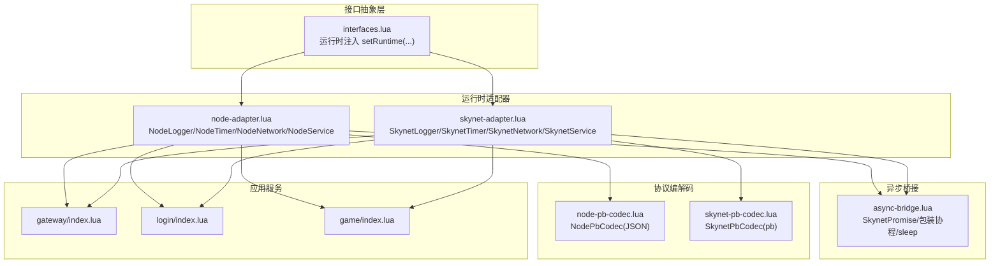
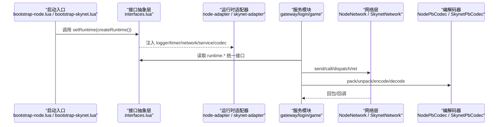
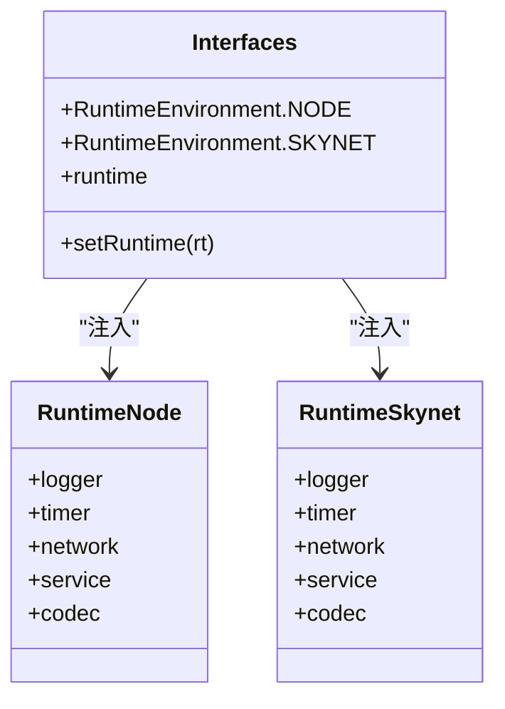
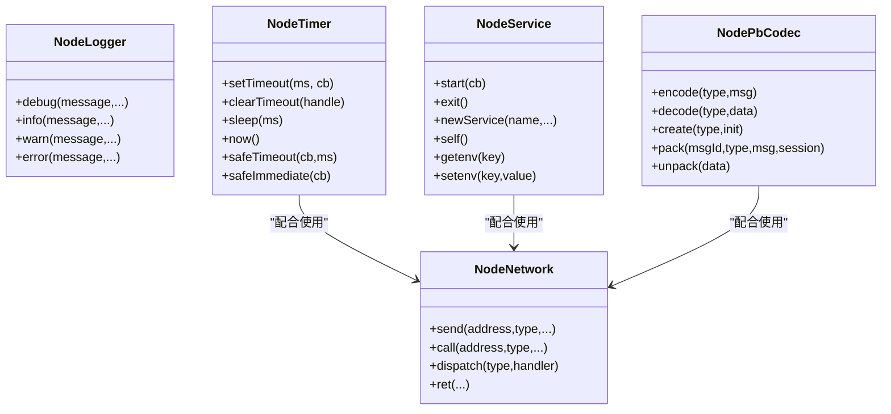
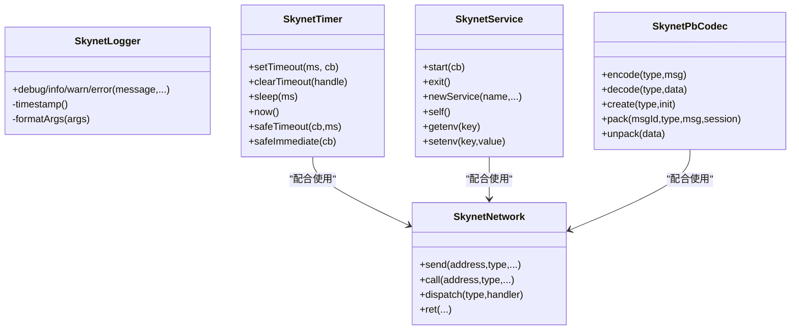
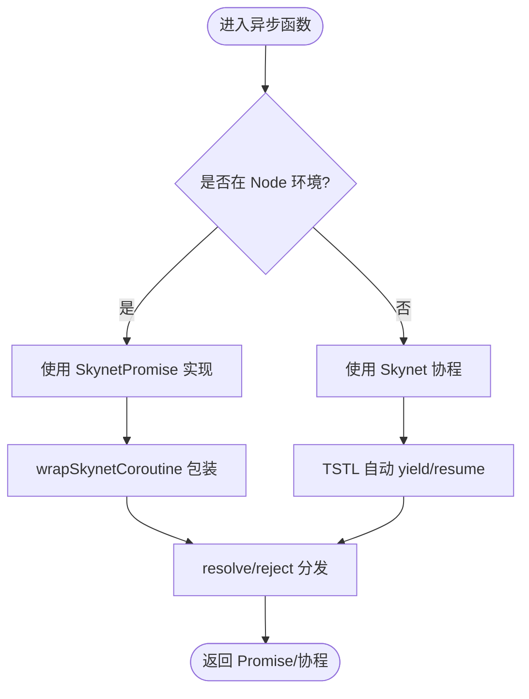
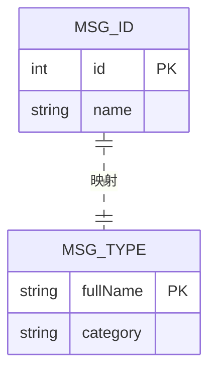
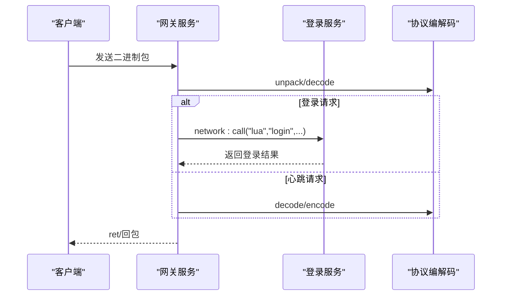
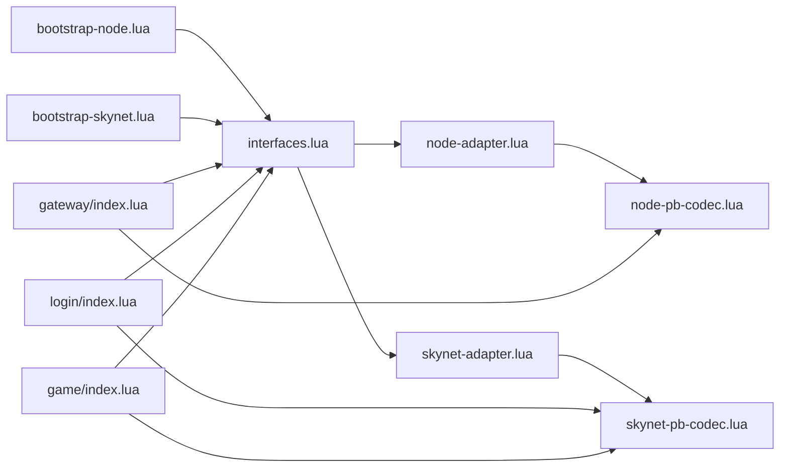

# 核心框架

<cite>
**本文引用的文件**
- [接口抽象层接口定义与运行时注入](file://docker/lua/framework/core/interfaces.lua)
- [Node.js 适配器](file://docker/lua/framework/runtime/node-adapter.lua)
- [Skynet 适配器](file://docker/lua/framework/runtime/skynet-adapter.lua)
- [异步桥接机制（Promise 到协程）](file://docker/lua/framework/runtime/async-bridge.lua)
- [Node.js Protobuf 编解码器](file://docker/lua/framework/runtime/node-pb-codec.lua)
- [Skynet Protobuf 编解码器](file://docker/lua/framework/runtime/skynet-pb-codec.lua)
- [网关服务（演示服务间通信与协议编解码）](file://docker/lua/app/services/gateway/index.lua)
- [登录服务（演示命令分发与会话管理）](file://docker/lua/app/services/login/index.lua)
- [游戏服务（演示数据与逻辑交互）](file://docker/lua/app/services/game/index.lua)
- [Node 启动入口](file://docker/lua/app/bootstrap-node.lua)
- [Skynet 启动入口](file://docker/lua/app/bootstrap-skynet.lua)
- [Protobuf 生成索引（Node/Skynet 共享）](file://docker/lua/protos/index.lua)
- [Protobuf 类型与消息 ID 映射（Node/Skynet 共享）](file://docker/lua/protos/proto.lua)
- [TS-Lua 项目配置](file://tslua.config.yaml)
</cite>

## 目录
1. [简介](#简介)
2. [项目结构](#项目结构)
3. [核心组件](#核心组件)
4. [架构总览](#架构总览)
5. [详细组件分析](#详细组件分析)
6. [依赖关系分析](#依赖关系分析)
7. [性能考量](#性能考量)
8. [故障排查指南](#故障排查指南)
9. [结论](#结论)
10. [附录](#附录)

## 简介
本文件面向高级开发者，系统性阐述核心框架的技术设计与实现要点，重点覆盖：
- 接口抽象层的设计与运行时注入机制
- Node.js 与 Skynet 两种运行时适配器的实现差异
- 异步桥接机制（Promise 到协程）的转换与错误处理
- 服务间通信、协议编解码与跨环境一致性
- 扩展点、自定义选项与最佳实践

## 项目结构
核心框架由“接口抽象层 + 运行时适配器 + 异步桥接 + 服务示例 + 协议编解码”构成，支持在 Node.js 与 Skynet 两种环境中无缝切换。

**图表来源**
- [接口抽象层接口定义与运行时注入:1-24](file://docker/lua/framework/core/interfaces.lua#L1-L24)
- [Node.js 适配器:1-207](file://docker/lua/framework/runtime/node-adapter.lua#L1-L207)
- [Skynet 适配器:1-227](file://docker/lua/framework/runtime/skynet-adapter.lua#L1-L227)
- [异步桥接机制（Promise 到协程）:1-243](file://docker/lua/framework/runtime/async-bridge.lua#L1-L243)
- [Node.js Protobuf 编解码器:1-185](file://docker/lua/framework/runtime/node-pb-codec.lua#L1-L185)
- [Skynet Protobuf 编解码器:1-164](file://docker/lua/framework/runtime/skynet-pb-codec.lua#L1-L164)
- [网关服务（演示服务间通信与协议编解码）:1-225](file://docker/lua/app/services/gateway/index.lua#L1-L225)
- [登录服务（演示命令分发与会话管理）:1-162](file://docker/lua/app/services/login/index.lua#L1-L162)
- [游戏服务（演示数据与逻辑交互）:1-156](file://docker/lua/app/services/game/index.lua#L1-L156)

**章节来源**
- [接口抽象层接口定义与运行时注入:1-24](file://docker/lua/framework/core/interfaces.lua#L1-L24)
- [Node.js 适配器:1-207](file://docker/lua/framework/runtime/node-adapter.lua#L1-L207)
- [Skynet 适配器:1-227](file://docker/lua/framework/runtime/skynet-adapter.lua#L1-L227)
- [异步桥接机制（Promise 到协程）:1-243](file://docker/lua/framework/runtime/async-bridge.lua#L1-L243)
- [Node.js Protobuf 编解码器:1-185](file://docker/lua/framework/runtime/node-pb-codec.lua#L1-L185)
- [Skynet Protobuf 编解码器:1-164](file://docker/lua/framework/runtime/skynet-pb-codec.lua#L1-L164)
- [网关服务（演示服务间通信与协议编解码）:1-225](file://docker/lua/app/services/gateway/index.lua#L1-L225)
- [登录服务（演示命令分发与会话管理）:1-162](file://docker/lua/app/services/login/index.lua#L1-L162)
- [游戏服务（演示数据与逻辑交互）:1-156](file://docker/lua/app/services/game/index.lua#L1-L156)

## 核心组件
- 接口抽象层：统一声明运行时环境枚举、全局运行时实例与注入函数，屏蔽具体实现差异。
- 运行时适配器：分别为 Node.js 与 Skynet 提供日志、定时器、网络、服务、编解码等能力的实现。
- 异步桥接：在 Node 环境下提供 Promise 实现，在 Skynet 环境下将 async/await 转换为协程，保证跨环境一致的异步语义。
- 协议编解码：Node 环境使用 JSON 文本编码，Skynet 环境使用 lua-protobuf；两者共享消息 ID 与类型映射。
- 应用服务：以网关、登录、游戏服务为例，展示命令分发、服务间调用、心跳处理与状态导出。

**章节来源**
- [接口抽象层接口定义与运行时注入:5-22](file://docker/lua/framework/core/interfaces.lua#L5-L22)
- [Node.js 适配器:14-205](file://docker/lua/framework/runtime/node-adapter.lua#L14-L205)
- [Skynet 适配器:19-225](file://docker/lua/framework/runtime/skynet-adapter.lua#L19-L225)
- [异步桥接机制（Promise 到协程）:15-241](file://docker/lua/framework/runtime/async-bridge.lua#L15-L241)
- [Protobuf 类型与消息 ID 映射（Node/Skynet 共享）:10-196](file://docker/lua/protos/proto.lua#L10-L196)

## 架构总览
下图展示了从启动入口到服务运行、再到网络与编解码的整体流程，以及 Node 与 Skynet 两条适配路径的并行存在。

**图表来源**
- [Node 启动入口](file://docker/lua/app/bootstrap-node.lua#L12)
- [Skynet 启动入口](file://docker/lua/app/bootstrap-skynet.lua#L9)
- [接口抽象层接口定义与运行时注入:14-22](file://docker/lua/framework/core/interfaces.lua#L14-L22)
- [Node.js 适配器:185-205](file://docker/lua/framework/runtime/node-adapter.lua#L185-L205)
- [Skynet 适配器:205-225](file://docker/lua/framework/runtime/skynet-adapter.lua#L205-L225)
- [网关服务（演示服务间通信与协议编解码）:181-223](file://docker/lua/app/services/gateway/index.lua#L181-L223)
- [登录服务（演示命令分发与会话管理）:122-161](file://docker/lua/app/services/login/index.lua#L122-L161)
- [游戏服务（演示数据与逻辑交互）:118-155](file://docker/lua/app/services/game/index.lua#L118-L155)

## 详细组件分析

### 接口抽象层与运行时注入
- 设计要点
  - 运行时环境枚举：NODE、SKYNET
  - 全局运行时实例 runtime：通过 setRuntime(rt) 将各子系统注入到统一命名空间
  - 注入字段：logger、timer、network、service、database、codec
- 使用方式
  - 启动入口分别创建对应运行时并调用 setRuntime
  - 业务服务通过 require("framework.core.interfaces").runtime 获取统一接口

**图表来源**
- [接口抽象层接口定义与运行时注入:6-22](file://docker/lua/framework/core/interfaces.lua#L6-L22)
- [Node.js 适配器:198-204](file://docker/lua/framework/runtime/node-adapter.lua#L198-L204)
- [Skynet 适配器:218-224](file://docker/lua/framework/runtime/skynet-adapter.lua#L218-L224)

**章节来源**
- [接口抽象层接口定义与运行时注入:5-22](file://docker/lua/framework/core/interfaces.lua#L5-L22)
- [Node 启动入口](file://docker/lua/app/bootstrap-node.lua#L12)
- [Skynet 启动入口](file://docker/lua/app/bootstrap-skynet.lua#L9)

### Node.js 适配器
- 能力清单
  - NodeLogger：基于 console 的日志封装
  - NodeTimer：基于 setTimeout/setImmediate 的定时与安全调度
  - NodeNetwork：基于 Map 的简单事件模拟，支持 call/send/dispatch/ret
  - NodeService：基于 process.env 的服务生命周期与环境变量
  - NodePbCodec：基于 JSON 的轻量编解码（fallback）
- 关键差异
  - 网络层为事件模拟，call 返回 Promise 并在 100ms 内返回 mock 响应
  - sleep 通过 Promise + setTimeout 实现，内部使用异步桥接包装
  - safeTimeout/safeImmediate 对回调中的 Promise 错误进行捕获

**图表来源**
- [Node.js 适配器:14-205](file://docker/lua/framework/runtime/node-adapter.lua#L14-L205)
- [Node.js Protobuf 编解码器:53-183](file://docker/lua/framework/runtime/node-pb-codec.lua#L53-L183)

**章节来源**
- [Node.js 适配器:14-205](file://docker/lua/framework/runtime/node-adapter.lua#L14-L205)
- [Node.js Protobuf 编解码器:53-183](file://docker/lua/framework/runtime/node-pb-codec.lua#L53-L183)

### Skynet 适配器
- 能力清单
  - SkynetLogger：基于 skynet.error 的带时间戳日志
  - SkynetTimer：基于 skynet.timeout 的定时与安全调度（safeTimeout fork 子协程）
  - SkynetNetwork：基于 skynet.send/call/dispatch/retpack 的真实 RPC
  - SkynetService：基于 skynet.start/newservice/self/getenv/setenv 的服务生命周期
  - SkynetPbCodec：基于 lua-protobuf 的高性能编解码
- 关键差异
  - 时间单位：Skynet 使用厘秒（1/100 秒），需做换算
  - 网络层：真实 RPC，call 返回协程结果，dispatch 自动处理异常
  - 编解码：优先使用 pb，缺失时打印警告并降级

**图表来源**
- [Skynet 适配器:19-225](file://docker/lua/framework/runtime/skynet-adapter.lua#L19-L225)
- [Skynet Protobuf 编解码器:51-162](file://docker/lua/framework/runtime/skynet-pb-codec.lua#L51-L162)

**章节来源**
- [Skynet 适配器:19-225](file://docker/lua/framework/runtime/skynet-adapter.lua#L19-L225)
- [Skynet Protobuf 编解码器:51-162](file://docker/lua/framework/runtime/skynet-pb-codec.lua#L51-L162)

### 异步桥接机制（Promise 到协程）
- 设计目标
  - 在 Node 环境提供 SkynetPromise 实现，使 async/await 语法可用
  - 在 Skynet 环境将 async/await 自动转为协程，保持一致的异步语义
- 核心实现
  - SkynetPromise：手动实现 then/catch/resolve/reject/all，内部使用 pcall 保护回调
  - wrapSkynetCoroutine：将同步函数包装为 Promise，异常通过 reject 抛出
  - sleep：根据环境选择 SetTimeoutSkynet 或 SkynetPromise 实现

**图表来源**
- [异步桥接机制（Promise 到协程）:15-241](file://docker/lua/framework/runtime/async-bridge.lua#L15-L241)

**章节来源**
- [异步桥接机制（Promise 到协程）:15-241](file://docker/lua/framework/runtime/async-bridge.lua#L15-L241)

### 协议编解码与消息 ID 映射
- Node 环境
  - NodePbCodec：使用 JSON 文本编码，提供 pack/unpack/encode/decode/create
  - 与 Protobuf 类型定义共享消息 ID 映射
- Skynet 环境
  - SkynetPbCodec：使用 lua-protobuf，按文件加载 .desc 描述符
  - 初始化失败会记录警告并降级
- 共享索引
  - protos/index.lua 导出 protos.proto 的所有符号
  - protos/proto.lua 定义消息类型与消息 ID 映射

**图表来源**
- [Protobuf 类型与消息 ID 映射（Node/Skynet 共享）:159-196](file://docker/lua/protos/proto.lua#L159-L196)
- [Node.js Protobuf 编解码器:18-52](file://docker/lua/framework/runtime/node-pb-codec.lua#L18-L52)
- [Skynet Protobuf 编解码器:25-50](file://docker/lua/framework/runtime/skynet-pb-codec.lua#L25-L50)

**章节来源**
- [Protobuf 类型与消息 ID 映射（Node/Skynet 共享）:10-196](file://docker/lua/protos/proto.lua#L10-L196)
- [Protobuf 生成索引（Node/Skynet 共享）:4-13](file://docker/lua/protos/index.lua#L4-L13)
- [Node.js Protobuf 编解码器:53-183](file://docker/lua/framework/runtime/node-pb-codec.lua#L53-L183)
- [Skynet Protobuf 编解码器:51-162](file://docker/lua/framework/runtime/skynet-pb-codec.lua#L51-L162)

### 服务示例：网关、登录、游戏
- 网关服务
  - 命令分发：connect/disconnect/forward/bind_user/online_count/broadcast/kick/get_state
  - 心跳处理：使用 codec 解包/打包
  - 服务间转发：newService + network:call
- 登录服务
  - 命令分发：login/logout/getUserInfo/validateToken/getOnlineCount/get_state
  - 会话清理：定时器循环清理过期会话
- 游戏服务
  - 命令分发：enterGame/leaveGame/getPlayerInfo/updatePlayer/getOnlineCount/getAllPlayers/get_state

**图表来源**
- [网关服务（演示服务间通信与协议编解码）:143-180](file://docker/lua/app/services/gateway/index.lua#L143-L180)
- [登录服务（演示命令分发与会话管理）:34-103](file://docker/lua/app/services/login/index.lua#L34-L103)
- [Protobuf 类型与消息 ID 映射（Node/Skynet 共享）:159-196](file://docker/lua/protos/proto.lua#L159-L196)

**章节来源**
- [网关服务（演示服务间通信与协议编解码）:22-223](file://docker/lua/app/services/gateway/index.lua#L22-L223)
- [登录服务（演示命令分发与会话管理）:34-161](file://docker/lua/app/services/login/index.lua#L34-L161)
- [游戏服务（演示数据与逻辑交互）:19-155](file://docker/lua/app/services/game/index.lua#L19-L155)

## 依赖关系分析
- 启动入口依赖接口抽象层与运行时适配器
- 业务服务依赖接口抽象层与协议编解码
- 网络层与编解码器相互独立，但被服务层统一调用
- Node 与 Skynet 两套实现并行存在，通过 setRuntime 切换

**图表来源**
- [Node 启动入口:7-12](file://docker/lua/app/bootstrap-node.lua#L7-L12)
- [Skynet 启动入口:7-9](file://docker/lua/app/bootstrap-skynet.lua#L7-L9)
- [接口抽象层接口定义与运行时注入:14-22](file://docker/lua/framework/core/interfaces.lua#L14-L22)
- [Node.js 适配器:185-205](file://docker/lua/framework/runtime/node-adapter.lua#L185-L205)
- [Skynet 适配器:205-225](file://docker/lua/framework/runtime/skynet-adapter.lua#L205-L225)
- [Node.js Protobuf 编解码器:53-183](file://docker/lua/framework/runtime/node-pb-codec.lua#L53-L183)
- [Skynet Protobuf 编解码器:51-162](file://docker/lua/framework/runtime/skynet-pb-codec.lua#L51-L162)
- [网关服务（演示服务间通信与协议编解码）:10-18](file://docker/lua/app/services/gateway/index.lua#L10-L18)
- [登录服务（演示命令分发与会话管理）:9-17](file://docker/lua/app/services/login/index.lua#L9-L17)
- [游戏服务（演示数据与逻辑交互）:9-17](file://docker/lua/app/services/game/index.lua#L9-L17)

**章节来源**
- [Node 启动入口:7-12](file://docker/lua/app/bootstrap-node.lua#L7-L12)
- [Skynet 启动入口:7-9](file://docker/lua/app/bootstrap-skynet.lua#L7-L9)
- [接口抽象层接口定义与运行时注入:14-22](file://docker/lua/framework/core/interfaces.lua#L14-L22)

## 性能考量
- 时间精度与单位
  - Skynet 使用厘秒（1/100 秒），注意与毫秒换算的一致性
  - Node.js 使用毫秒，sleep 与定时器直接基于 setTimeout
- 网络开销
  - Skynet 真实 RPC，延迟取决于服务间通信链路
  - Node 网络为事件模拟，call 返回 mock 数据，仅用于本地调试
- 编解码效率
  - Skynet 使用 lua-protobuf，性能优于 JSON
  - Node 使用 JSON，便于调试但吞吐较低
- 协程与 Promise
  - SkynetPromise 在 Node 环境提供一致的 async/await 体验
  - wrapSkynetCoroutine 通过 pcall 保护回调，避免异常扩散

[本节为通用性能指导，无需特定文件引用]

## 故障排查指南
- 启动阶段
  - setRuntime 未正确调用：检查启动入口是否加载对应适配器并传入 runtime
  - 编解码器初始化失败：查看 Node/Skynet 适配器中 codec 初始化日志
- 运行阶段
  - 网络调用无响应（Node）：确认 call 的 mock 逻辑与超时时间
  - 网络调用异常（Skynet）：检查 dispatch 中的异常捕获与日志
  - 心跳/协议处理报错：核对 protos/proto.lua 的消息 ID 与类型映射
- 调试技巧
  - 使用 runtime.logger 输出关键路径日志
  - 在 safeTimeout/safeImmediate 中观察回调内 Promise 的 catch 行为

**章节来源**
- [Node.js 适配器:64-86](file://docker/lua/framework/runtime/node-adapter.lua#L64-L86)
- [Skynet 适配器:109-127](file://docker/lua/framework/runtime/skynet-adapter.lua#L109-L127)
- [网关服务（演示服务间通信与协议编解码）:118-141](file://docker/lua/app/services/gateway/index.lua#L118-L141)
- [登录服务（演示命令分发与会话管理）:129-145](file://docker/lua/app/services/login/index.lua#L129-L145)

## 结论
该核心框架通过接口抽象层与运行时适配器实现了 Node.js 与 Skynet 的统一抽象，结合异步桥接与协议编解码，为上层服务提供了稳定一致的开发体验。其模块化设计便于扩展与维护，适合在不同部署环境中灵活切换。

[本节为总结性内容，无需特定文件引用]

## 附录

### 扩展点与自定义选项
- 新增运行时适配器
  - 参考现有 Node/Skynet 适配器，实现 Logger/Timer/Network/Service/Codec 接口
  - 在 createRuntime 中返回包含上述字段的对象，并在启动入口调用 setRuntime
- 自定义编解码器
  - Node 环境：实现 encode/decode/pack/unpack/create 方法
  - Skynet 环境：确保 lua-protobuf 可用或提供降级策略
- 自定义网络层
  - Node 网络层可用于本地联调；生产环境建议复用 Skynet 真实 RPC
- 自定义定时器
  - 注意时间单位换算（Skynet 厘秒 vs Node 毫秒）

**章节来源**
- [Node.js 适配器:185-205](file://docker/lua/framework/runtime/node-adapter.lua#L185-L205)
- [Skynet 适配器:205-225](file://docker/lua/framework/runtime/skynet-adapter.lua#L205-L225)
- [Node.js Protobuf 编解码器:53-183](file://docker/lua/framework/runtime/node-pb-codec.lua#L53-L183)
- [Skynet Protobuf 编解码器:51-162](file://docker/lua/framework/runtime/skynet-pb-codec.lua#L51-L162)

### 使用示例（路径指引）
- 在 Node 环境启动
  - [Node 启动入口](file://docker/lua/app/bootstrap-node.lua#L12)
  - [Node.js 适配器:185-205](file://docker/lua/framework/runtime/node-adapter.lua#L185-L205)
- 在 Skynet 环境启动
  - [Skynet 启动入口](file://docker/lua/app/bootstrap-skynet.lua#L9)
  - [Skynet 适配器:205-225](file://docker/lua/framework/runtime/skynet-adapter.lua#L205-L225)
- 服务间通信与协议编解码
  - [网关服务（转发登录请求）:143-180](file://docker/lua/app/services/gateway/index.lua#L143-L180)
  - [登录服务（命令分发）:34-103](file://docker/lua/app/services/login/index.lua#L34-L103)
  - [游戏服务（命令分发）:19-117](file://docker/lua/app/services/game/index.lua#L19-L117)
- 协议编解码使用
  - [Protobuf 类型与消息 ID 映射:159-196](file://docker/lua/protos/proto.lua#L159-L196)
  - [NodePbCodec.pack/unpack:160-183](file://docker/lua/framework/runtime/node-pb-codec.lua#L160-L183)
  - [SkynetPbCodec.pack/unpack:127-162](file://docker/lua/framework/runtime/skynet-pb-codec.lua#L127-L162)

**章节来源**
- [Node 启动入口](file://docker/lua/app/bootstrap-node.lua#L12)
- [Skynet 启动入口](file://docker/lua/app/bootstrap-skynet.lua#L9)
- [网关服务（演示服务间通信与协议编解码）:143-180](file://docker/lua/app/services/gateway/index.lua#L143-L180)
- [登录服务（演示命令分发与会话管理）:34-103](file://docker/lua/app/services/login/index.lua#L34-L103)
- [游戏服务（演示数据与逻辑交互）:19-117](file://docker/lua/app/services/game/index.lua#L19-L117)
- [Protobuf 类型与消息 ID 映射（Node/Skynet 共享）:159-196](file://docker/lua/protos/proto.lua#L159-L196)
- [Node.js Protobuf 编解码器:160-183](file://docker/lua/framework/runtime/node-pb-codec.lua#L160-L183)
- [Skynet Protobuf 编解码器:127-162](file://docker/lua/framework/runtime/skynet-pb-codec.lua#L127-L162)

### 项目配置参考
- 构建与部署路径
  - [TS-Lua 项目配置:18-30](file://tslua.config.yaml#L18-L30)

**章节来源**
- [TS-Lua 项目配置:18-30](file://tslua.config.yaml#L18-L30)