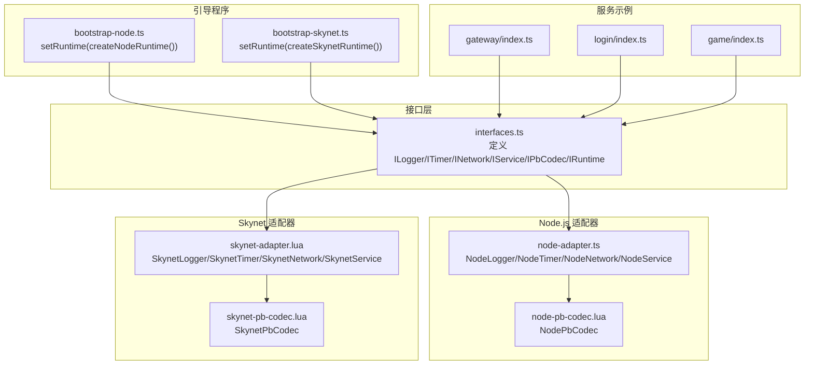
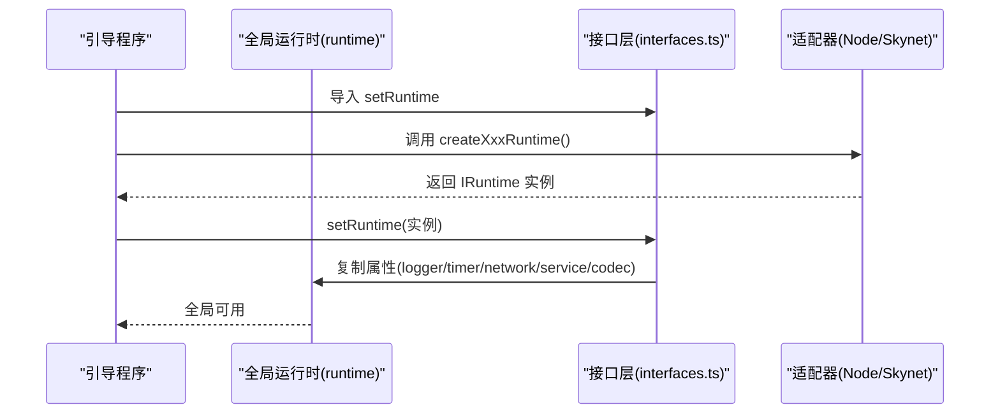
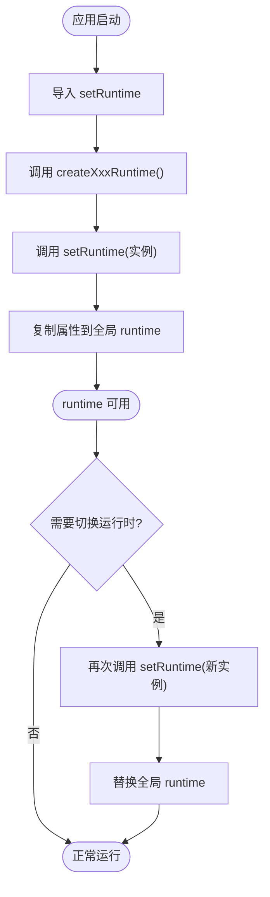
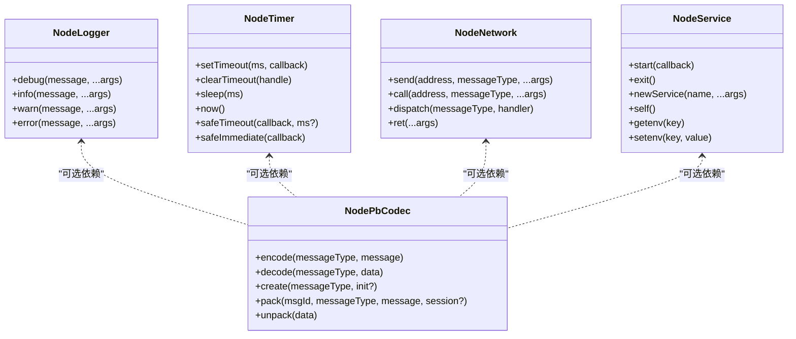
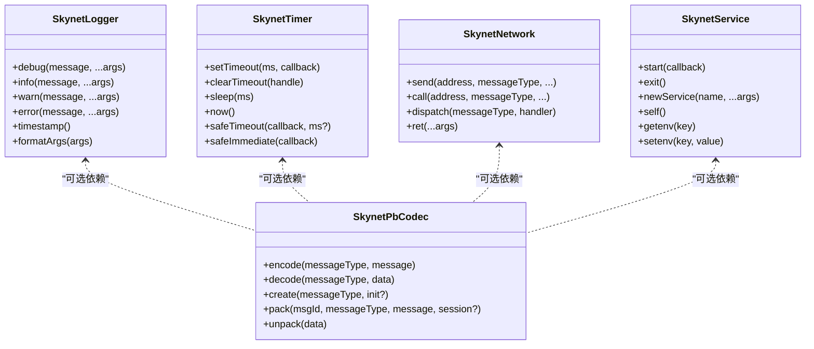
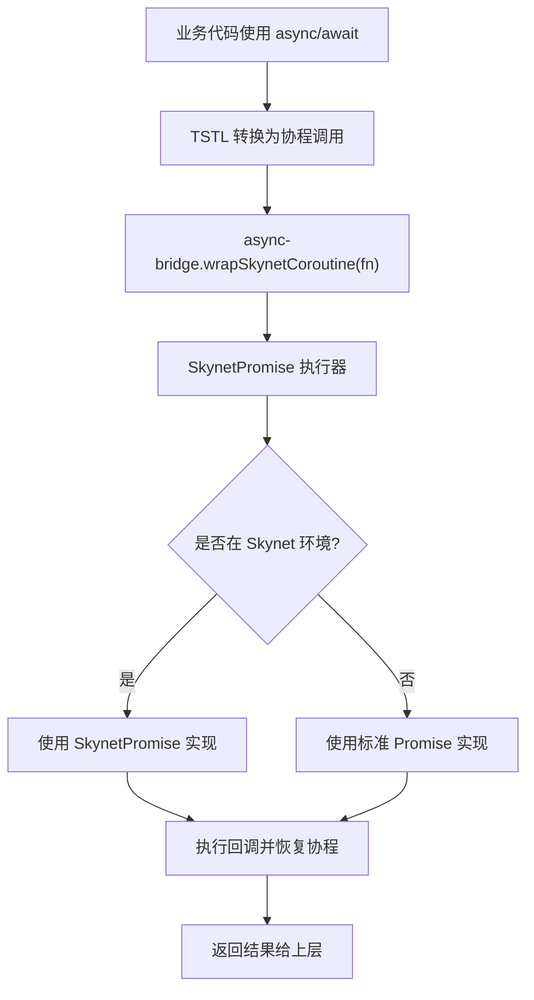
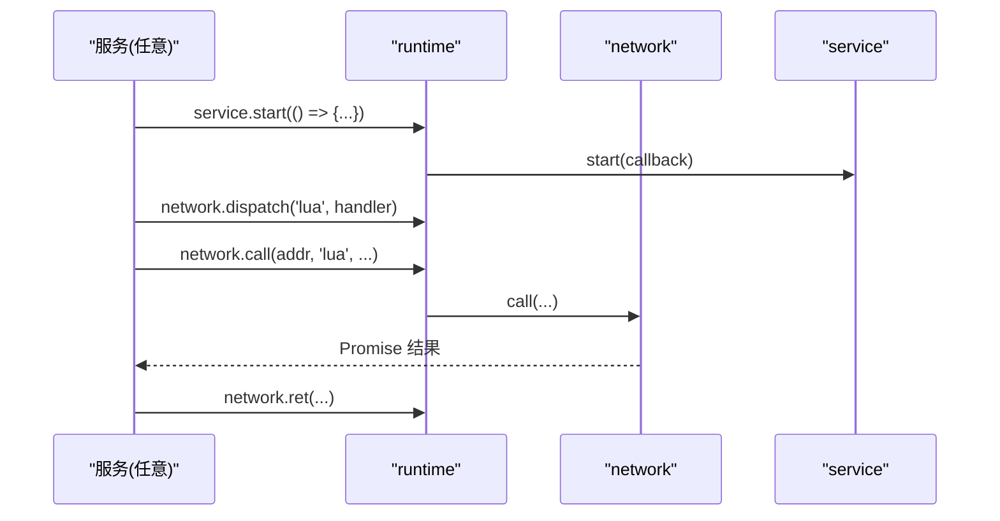
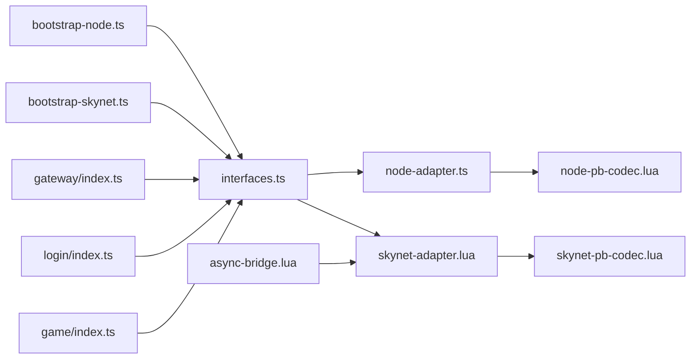

# 运行时管理

<cite>
**本文引用的文件**
- [interfaces.ts](file://server/src/framework/core/interfaces.ts)
- [node-adapter.ts](file://server/src/framework/runtime/node-adapter.ts)
- [bootstrap-node.ts](file://server/src/app/bootstrap-node.ts)
- [bootstrap-skynet.ts](file://server/src/app/bootstrap-skynet.ts)
- [skynet-adapter.lua](file://docker/lua/framework/runtime/skynet-adapter.lua)
- [node-adapter.lua](file://docker/lua/framework/runtime/node-adapter.lua)
- [async-bridge.lua](file://docker/lua/framework/runtime/async-bridge.lua)
- [skynet-pb-codec.lua](file://docker/lua/framework/runtime/skynet-pb-codec.lua)
- [node-pb-codec.lua](file://docker/lua/framework/runtime/node-pb-codec.lua)
- [gateway/index.ts](file://server/src/app/services/gateway/index.ts)
- [login/index.ts](file://server/src/app/services/login/index.ts)
- [game/index.ts](file://server/src/app/services/game/index.ts)
</cite>

## 目录
1. [简介](#简介)
2. [项目结构](#项目结构)
3. [核心组件](#核心组件)
4. [架构总览](#架构总览)
5. [详细组件分析](#详细组件分析)
6. [依赖关系分析](#依赖关系分析)
7. [性能考量](#性能考量)
8. [故障排查指南](#故障排查指南)
9. [结论](#结论)
10. [附录](#附录)

## 简介
本文件系统性阐述运行时管理的设计与实现，重点覆盖以下方面：
- 运行时全局实例的生命周期管理：初始化、配置与销毁
- setRuntime 函数的作用与使用方法，以及运行时实例的替换机制
- 不同运行时环境（Node.js 与 Skynet）下的配置差异与初始化流程
- 运行时切换的注意事项与潜在风险
- 运行时状态监控与调试技巧
- 结合服务示例给出最佳实践与参考路径

## 项目结构
运行时管理采用“接口层 + 环境适配器”的分层设计：
- 接口层定义统一抽象能力（日志、定时器、网络、服务、数据库、编解码等）
- 环境适配器分别在 Node.js 与 Skynet 下实现上述抽象
- 业务服务通过统一接口访问运行时能力，避免直接耦合具体平台

**图表来源**
- [interfaces.ts:1-226](file://server/src/framework/core/interfaces.ts#L1-L226)
- [node-adapter.ts:1-194](file://server/src/framework/runtime/node-adapter.ts#L1-L194)
- [skynet-adapter.lua:1-227](file://docker/lua/framework/runtime/skynet-adapter.lua#L1-L227)
- [node-adapter.lua:1-207](file://docker/lua/framework/runtime/node-adapter.lua#L1-L207)
- [bootstrap-node.ts:1-22](file://server/src/app/bootstrap-node.ts#L1-L22)
- [bootstrap-skynet.ts:1-20](file://server/src/app/bootstrap-skynet.ts#L1-L20)
- [gateway/index.ts:1-206](file://server/src/app/services/gateway/index.ts#L1-L206)
- [login/index.ts:1-154](file://server/src/app/services/login/index.ts#L1-L154)
- [game/index.ts:1-136](file://server/src/app/services/game/index.ts#L1-L136)

**章节来源**
- [interfaces.ts:1-226](file://server/src/framework/core/interfaces.ts#L1-L226)
- [node-adapter.ts:1-194](file://server/src/framework/runtime/node-adapter.ts#L1-L194)
- [skynet-adapter.lua:1-227](file://docker/lua/framework/runtime/skynet-adapter.lua#L1-L227)
- [node-adapter.lua:1-207](file://docker/lua/framework/runtime/node-adapter.lua#L1-L207)
- [bootstrap-node.ts:1-22](file://server/src/app/bootstrap-node.ts#L1-L22)
- [bootstrap-skynet.ts:1-20](file://server/src/app/bootstrap-skynet.ts#L1-L20)
- [gateway/index.ts:1-206](file://server/src/app/services/gateway/index.ts#L1-L206)
- [login/index.ts:1-154](file://server/src/app/services/login/index.ts#L1-L154)
- [game/index.ts:1-136](file://server/src/app/services/game/index.ts#L1-L136)

## 核心组件
- 接口层（IRuntime 及其子接口）：定义运行时统一能力边界，确保业务代码只依赖抽象
- Node.js 适配器：在 Node.js 环境下实现接口，使用原生 API；提供 NodePbCodec 作为可选编解码能力
- Skynet 适配器：在 Skynet 环境下实现接口，使用 skynet.* API；提供 SkynetPbCodec 作为可选编解码能力
- 异步桥接（async-bridge.lua）：为 Skynet 环境提供 Promise 实现与协程包装，支撑 async/await
- 引导程序：在不同环境中调用 setRuntime 完成全局运行时实例的初始化与替换

**章节来源**
- [interfaces.ts:189-226](file://server/src/framework/core/interfaces.ts#L189-L226)
- [node-adapter.ts:177-194](file://server/src/framework/runtime/node-adapter.ts#L177-L194)
- [skynet-adapter.lua:205-225](file://docker/lua/framework/runtime/skynet-adapter.lua#L205-L225)
- [node-adapter.lua:185-205](file://docker/lua/framework/runtime/node-adapter.lua#L185-L205)
- [async-bridge.lua:1-243](file://docker/lua/framework/runtime/async-bridge.lua#L1-L243)
- [bootstrap-node.ts:5-9](file://server/src/app/bootstrap-node.ts#L5-L9)
- [bootstrap-skynet.ts:6-13](file://server/src/app/bootstrap-skynet.ts#L6-L13)

## 架构总览
运行时管理遵循“单例运行时对象 + 可替换的适配器”模式。业务服务通过 runtime 访问能力，而 setRuntime 负责将具体实现注入到全局对象。

**图表来源**
- [interfaces.ts:216-225](file://server/src/framework/core/interfaces.ts#L216-L225)
- [bootstrap-node.ts:5-9](file://server/src/app/bootstrap-node.ts#L5-L9)
- [bootstrap-skynet.ts:6-13](file://server/src/app/bootstrap-skynet.ts#L6-L13)
- [node-adapter.ts:177-194](file://server/src/framework/runtime/node-adapter.ts#L177-L194)
- [skynet-adapter.lua:205-225](file://docker/lua/framework/runtime/skynet-adapter.lua#L205-L225)

## 详细组件分析

### setRuntime 与全局运行时实例
- 设计要点
  - 全局运行时对象为可变对象，便于在模块缓存机制下进行替换
  - setRuntime 将传入 IRuntime 的各子组件复制到全局对象，实现“按需注入”
- 生命周期
  - 初始化：应用启动时由引导程序调用 setRuntime 完成注入
  - 替换：在支持动态切换的场景下，可再次调用 setRuntime 替换运行时
  - 销毁：无显式销毁流程，通常随进程结束释放
- 最佳实践
  - 在应用入口尽早调用 setRuntime，确保后续模块导入时即可使用 runtime
  - 切换运行时前，确保旧运行时中的任务已停止，避免竞态

**图表来源**
- [interfaces.ts:210-225](file://server/src/framework/core/interfaces.ts#L210-L225)
- [bootstrap-node.ts:5-9](file://server/src/app/bootstrap-node.ts#L5-L9)
- [bootstrap-skynet.ts:6-13](file://server/src/app/bootstrap-skynet.ts#L6-L13)

**章节来源**
- [interfaces.ts:206-225](file://server/src/framework/core/interfaces.ts#L206-L225)
- [bootstrap-node.ts:5-9](file://server/src/app/bootstrap-node.ts#L5-L9)
- [bootstrap-skynet.ts:6-13](file://server/src/app/bootstrap-skynet.ts#L6-L13)

### Node.js 环境运行时
- 组件实现
  - NodeLogger/NodeTimer/NodeNetwork/NodeService：基于 Node.js 原生 API
  - NodePbCodec：基于本地 proto 模块，提供编码/解码与打包/解包
- 初始化流程
  - 引导程序导入 setRuntime 与 createNodeRuntime
  - 调用 setRuntime(createNodeRuntime()) 完成注入
- 特点
  - 适合开发与测试，便于本地调试
  - 定时器与异步使用原生 API，协程安全通过回调链路保证

**图表来源**
- [node-adapter.ts:19-194](file://server/src/framework/runtime/node-adapter.ts#L19-L194)
- [node-adapter.lua:15-205](file://docker/lua/framework/runtime/node-adapter.lua#L15-L205)
- [node-pb-codec.lua:53-183](file://docker/lua/framework/runtime/node-pb-codec.lua#L53-L183)

**章节来源**
- [node-adapter.ts:1-194](file://server/src/framework/runtime/node-adapter.ts#L1-L194)
- [node-adapter.lua:1-207](file://docker/lua/framework/runtime/node-adapter.lua#L1-L207)
- [node-pb-codec.lua:1-185](file://docker/lua/framework/runtime/node-pb-codec.lua#L1-L185)
- [bootstrap-node.ts:5-9](file://server/src/app/bootstrap-node.ts#L5-L9)

### Skynet 环境运行时
- 组件实现
  - SkynetLogger/SkynetTimer/SkynetNetwork/SkynetService：基于 skynet.* API
  - SkynetPbCodec：基于 lua-protobuf 加载描述文件，提供编码/解码与打包/解包
- 初始化流程
  - 引导程序导入 setRuntime 与 createSkynetRuntime
  - 调用 setRuntime(createSkynetRuntime()) 完成注入
  - 通过 _G.require 预加载服务模块
- 特点
  - 适合生产部署，具备分布式与高并发能力
  - 定时器使用厘秒单位，网络调用通过 skynet.call/dispatch

**图表来源**
- [skynet-adapter.lua:20-225](file://docker/lua/framework/runtime/skynet-adapter.lua#L20-L225)
- [skynet-pb-codec.lua:51-162](file://docker/lua/framework/runtime/skynet-pb-codec.lua#L51-L162)

**章节来源**
- [skynet-adapter.lua:1-227](file://docker/lua/framework/runtime/skynet-adapter.lua#L1-L227)
- [skynet-pb-codec.lua:1-164](file://docker/lua/framework/runtime/skynet-pb-codec.lua#L1-L164)
- [bootstrap-skynet.ts:6-13](file://server/src/app/bootstrap-skynet.ts#L6-L13)

### 异步桥接与协程支持
- Skynet 环境下的 Promise 实现与协程包装，使业务代码可使用 async/await
- 提供 wrapSkynetCoroutine 与 sleep 辅助函数，兼容不同环境

**图表来源**
- [async-bridge.lua:17-241](file://docker/lua/framework/runtime/async-bridge.lua#L17-L241)

**章节来源**
- [async-bridge.lua:1-243](file://docker/lua/framework/runtime/async-bridge.lua#L1-L243)

### 服务示例中的运行时使用
- 网关/登录/游戏服务均通过 runtime 访问日志、定时器、网络与服务能力
- 服务启动时使用 runtime.service.start 注册消息处理器，内部可使用 async
- 服务通过 runtime.network.dispatch 注册消息分发，runtime.network.call 发起跨服务调用
- 若存在 runtime.codec，则优先使用 protobuf 进行序列化与打包

**图表来源**
- [gateway/index.ts:170-196](file://server/src/app/services/gateway/index.ts#L170-L196)
- [login/index.ts:123-146](file://server/src/app/services/login/index.ts#L123-L146)
- [game/index.ts:108-136](file://server/src/app/services/game/index.ts#L108-L136)

**章节来源**
- [gateway/index.ts:1-206](file://server/src/app/services/gateway/index.ts#L1-L206)
- [login/index.ts:1-154](file://server/src/app/services/login/index.ts#L1-L154)
- [game/index.ts:1-136](file://server/src/app/services/game/index.ts#L1-L136)

## 依赖关系分析
- 接口层与适配器之间为“依赖倒置”关系：业务依赖接口，而非具体实现
- 异步桥接与适配器共同支撑 Skynet 环境下的协程与 Promise
- 编解码器作为可选组件，按需启用

**图表来源**
- [interfaces.ts:1-226](file://server/src/framework/core/interfaces.ts#L1-L226)
- [node-adapter.ts:1-194](file://server/src/framework/runtime/node-adapter.ts#L1-L194)
- [skynet-adapter.lua:1-227](file://docker/lua/framework/runtime/skynet-adapter.lua#L1-L227)
- [node-pb-codec.lua:1-185](file://docker/lua/framework/runtime/node-pb-codec.lua#L1-L185)
- [skynet-pb-codec.lua:1-164](file://docker/lua/framework/runtime/skynet-pb-codec.lua#L1-L164)
- [async-bridge.lua:1-243](file://docker/lua/framework/runtime/async-bridge.lua#L1-L243)
- [bootstrap-node.ts:1-22](file://server/src/app/bootstrap-node.ts#L1-L22)
- [bootstrap-skynet.ts:1-20](file://server/src/app/bootstrap-skynet.ts#L1-L20)
- [gateway/index.ts:1-206](file://server/src/app/services/gateway/index.ts#L1-L206)
- [login/index.ts:1-154](file://server/src/app/services/login/index.ts#L1-L154)
- [game/index.ts:1-136](file://server/src/app/services/game/index.ts#L1-L136)

**章节来源**
- [interfaces.ts:1-226](file://server/src/framework/core/interfaces.ts#L1-L226)
- [node-adapter.ts:1-194](file://server/src/framework/runtime/node-adapter.ts#L1-L194)
- [skynet-adapter.lua:1-227](file://docker/lua/framework/runtime/skynet-adapter.lua#L1-L227)
- [node-pb-codec.lua:1-185](file://docker/lua/framework/runtime/node-pb-codec.lua#L1-L185)
- [skynet-pb-codec.lua:1-164](file://docker/lua/framework/runtime/skynet-pb-codec.lua#L1-L164)
- [async-bridge.lua:1-243](file://docker/lua/framework/runtime/async-bridge.lua#L1-L243)
- [bootstrap-node.ts:1-22](file://server/src/app/bootstrap-node.ts#L1-L22)
- [bootstrap-skynet.ts:1-20](file://server/src/app/bootstrap-skynet.ts#L1-L20)
- [gateway/index.ts:1-206](file://server/src/app/services/gateway/index.ts#L1-L206)
- [login/index.ts:1-154](file://server/src/app/services/login/index.ts#L1-L154)
- [game/index.ts:1-136](file://server/src/app/services/game/index.ts#L1-L136)

## 性能考量
- Node.js 环境
  - 使用原生定时器与 setImmediate，延迟与吞吐表现良好
  - 网络模拟适合本地测试，生产建议替换为真实 RPC 框架
- Skynet 环境
  - 定时器使用厘秒单位，注意换算与精度
  - 网络调用通过 skynet.call/dispatch，注意错误处理与超时策略
- 编解码
  - 两种环境均提供可选的 protobuf 编解码，建议在跨服务通信中统一使用
- 服务保活
  - 服务需维持活跃协程，避免被框架回收；示例中通过周期性 sleep 保持运行

[本节为通用指导，无需特定文件引用]

## 故障排查指南
- 运行时未设置
  - 症状：业务模块导入后访问 runtime 报错
  - 排查：确认引导程序已先于业务模块导入并调用 setRuntime
  - 参考路径：[bootstrap-node.ts:5-9](file://server/src/app/bootstrap-node.ts#L5-L9)、[bootstrap-skynet.ts:6-13](file://server/src/app/bootstrap-skynet.ts#L6-L13)
- 编解码器不可用
  - 症状：runtime.codec 为 undefined 或抛出“codec not available”
  - 排查：检查对应环境的 codec 初始化逻辑与依赖是否存在
  - 参考路径：[node-adapter.ts:177-194](file://server/src/framework/runtime/node-adapter.ts#L177-L194)、[skynet-adapter.lua:205-225](file://docker/lua/framework/runtime/skynet-adapter.lua#L205-L225)
- Skynet 环境协程异常
  - 症状：async/await 在 Skynet 下未生效或报错
  - 排查：确认使用 async-bridge 提供的 Promise 实现与 wrapSkynetCoroutine
  - 参考路径：[async-bridge.lua:17-241](file://docker/lua/framework/runtime/async-bridge.lua#L17-L241)
- 服务未保活导致退出
  - 症状：服务启动后很快退出
  - 排查：检查是否在 runtime.service.start 回调内启动了持续运行的协程
  - 参考路径：[gateway/index.ts:198-206](file://server/src/app/services/gateway/index.ts#L198-L206)、[login/index.ts:147-153](file://server/src/app/services/login/index.ts#L147-L153)、[game/index.ts:129-136](file://server/src/app/services/game/index.ts#L129-L136)
- 日志与调试
  - Node.js：利用 console.* 输出与 NodeLogger
  - Skynet：利用 skynet.error 输出与 SkynetLogger
  - 参考路径：[node-adapter.ts:19-35](file://server/src/framework/runtime/node-adapter.ts#L19-L35)、[skynet-adapter.lua:20-44](file://docker/lua/framework/runtime/skynet-adapter.lua#L20-L44)

**章节来源**
- [bootstrap-node.ts:5-9](file://server/src/app/bootstrap-node.ts#L5-L9)
- [bootstrap-skynet.ts:6-13](file://server/src/app/bootstrap-skynet.ts#L6-L13)
- [node-adapter.ts:177-194](file://server/src/framework/runtime/node-adapter.ts#L177-L194)
- [skynet-adapter.lua:205-225](file://docker/lua/framework/runtime/skynet-adapter.lua#L205-L225)
- [async-bridge.lua:17-241](file://docker/lua/framework/runtime/async-bridge.lua#L17-L241)
- [gateway/index.ts:198-206](file://server/src/app/services/gateway/index.ts#L198-L206)
- [login/index.ts:147-153](file://server/src/app/services/login/index.ts#L147-L153)
- [game/index.ts:129-136](file://server/src/app/services/game/index.ts#L129-L136)
- [node-adapter.ts:19-35](file://server/src/framework/runtime/node-adapter.ts#L19-L35)
- [skynet-adapter.lua:20-44](file://docker/lua/framework/runtime/skynet-adapter.lua#L20-L44)

## 结论
运行时管理通过清晰的接口层与环境适配器，实现了在 Node.js 与 Skynet 之间的无缝切换。setRuntime 作为全局注入点，配合引导程序与服务示例，提供了稳定的生命周期管理与最佳实践。在生产环境中，建议：
- 明确区分开发与生产环境，合理选择运行时适配器
- 在服务启动时务必保持活跃协程，避免被框架回收
- 统一使用 protobuf 进行跨服务通信，提升一致性与性能
- 做好异常捕获与日志输出，结合异步桥接实现可靠的错误处理

[本节为总结性内容，无需特定文件引用]

## 附录
- 运行时切换注意事项
  - 切换前确保旧运行时中的任务已停止，避免竞态条件
  - 确保新运行时的编解码器与依赖可用
  - 在灰度发布场景中，先在小范围验证再全量切换
- 运行时状态监控与调试技巧
  - 使用 runtime.logger 输出关键事件与错误
  - 使用 runtime.timer.now() 记录时间戳，定位性能瓶颈
  - 在 Skynet 环境中，利用 skynet.error 输出堆栈与上下文信息

[本节为通用指导，无需特定文件引用]