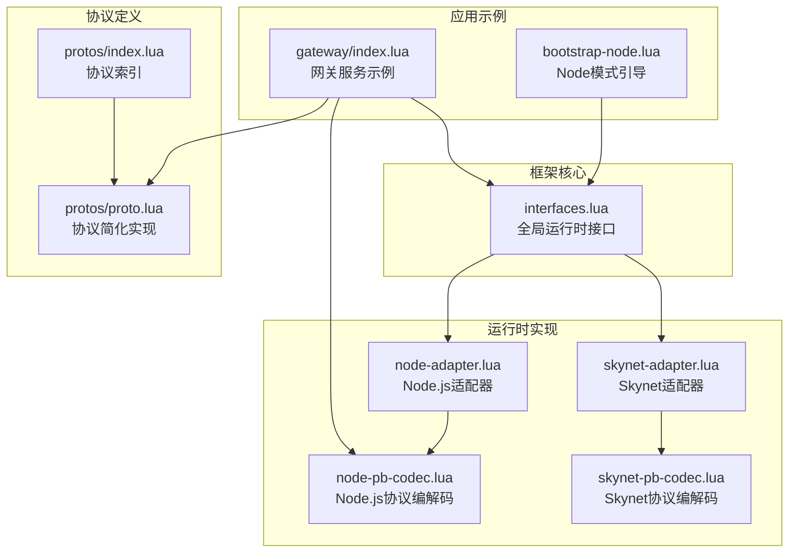
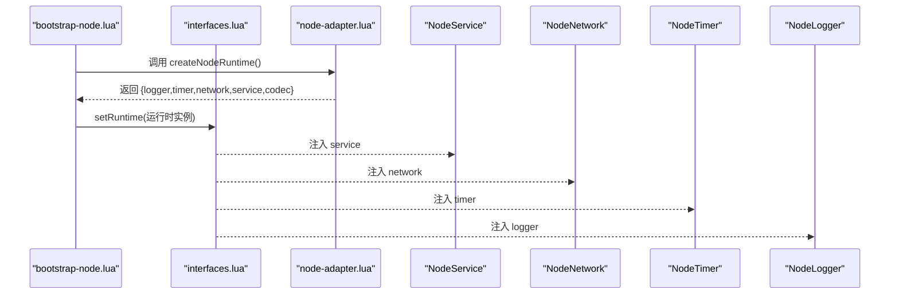
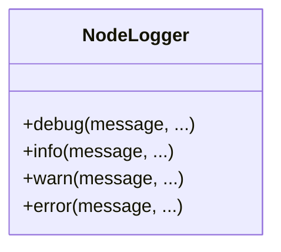
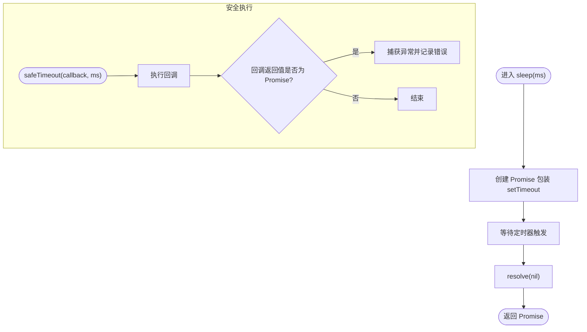
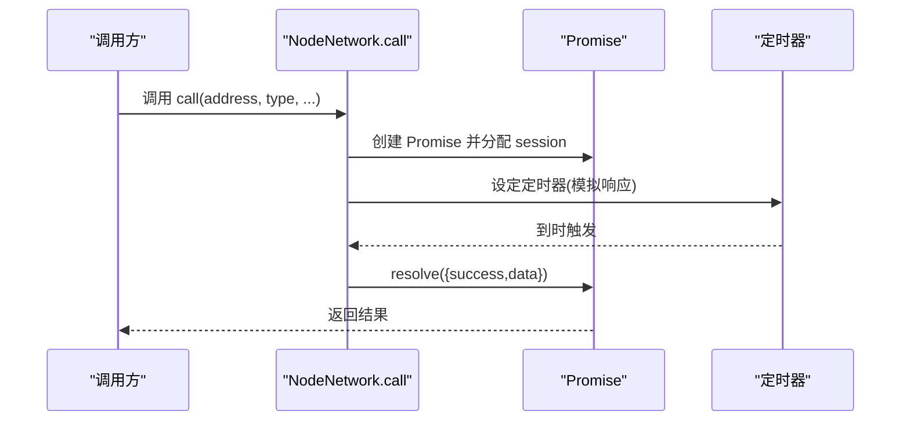
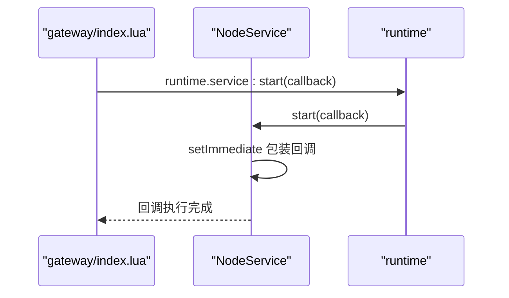
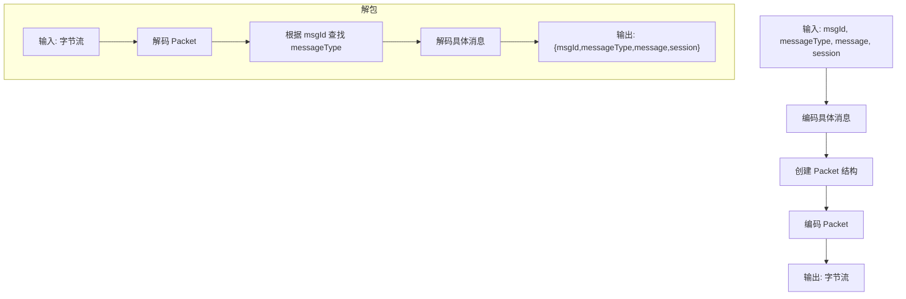
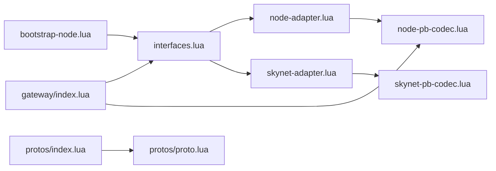

# Node.js适配器

<cite>
**本文引用的文件**
- [node-adapter.lua](file://docker/lua/framework/runtime/node-adapter.lua)
- [node-pb-codec.lua](file://docker/lua/framework/runtime/node-pb-codec.lua)
- [skynet-adapter.lua](file://docker/lua/framework/runtime/skynet-adapter.lua)
- [skynet-pb-codec.lua](file://docker/lua/framework/runtime/skynet-pb-codec.lua)
- [interfaces.lua](file://docker/lua/framework/core/interfaces.lua)
- [bootstrap-node.lua](file://docker/lua/app/bootstrap-node.lua)
- [gateway/index.lua](file://docker/lua/app/services/gateway/index.lua)
- [protos/index.lua](file://docker/lua/protos/index.lua)
- [protos/proto.lua](file://docker/lua/protos/proto.lua)
</cite>

## 目录
1. [引言](#引言)
2. [项目结构](#项目结构)
3. [核心组件](#核心组件)
4. [架构总览](#架构总览)
5. [组件详解](#组件详解)
6. [依赖关系分析](#依赖关系分析)
7. [性能考量](#性能考量)
8. [故障排查指南](#故障排查指南)
9. [结论](#结论)
10. [附录](#附录)

## 引言
本文件面向希望在Node.js运行时环境下复用TypeScript到Lua（TSTL）框架能力的开发者，系统性阐述Node.js适配器的设计与实现要点。Node.js适配器遵循与Skynet适配器一致的接口抽象层，通过统一的运行时接口对外暴露日志、定时器、网络、服务与编解码等能力，从而在Node.js环境中以最小改造成本运行同一套业务逻辑。

Node.js适配器的关键特性包括：
- 日志实现：基于Node.js控制台的级别化输出与格式化打印。
- 定时器实现：毫秒级时间控制、Promise包装与安全执行策略。
- 网络实现：消息发送、请求-响应调用、事件分发与返回封装。
- 服务实现：服务生命周期、进程环境变量管理与服务创建。
- 协议编解码：NodePbCodec基于JSON序列化的回退实现与打包/解包流程。
- 与Skynet适配器的对比：时间单位差异、底层库差异与错误处理策略。

## 项目结构
Node.js适配器位于框架运行时目录，配合接口抽象层与服务示例共同构成完整的运行时体系。

图表来源
- [interfaces.lua:1-24](file://docker/lua/framework/core/interfaces.lua#L1-L24)
- [node-adapter.lua:185-207](file://docker/lua/framework/runtime/node-adapter.lua#L185-L207)
- [skynet-adapter.lua:205-227](file://docker/lua/framework/runtime/skynet-adapter.lua#L205-L227)
- [bootstrap-node.lua:1-17](file://docker/lua/app/bootstrap-node.lua#L1-L17)
- [gateway/index.lua:181-225](file://docker/lua/app/services/gateway/index.lua#L181-L225)
- [protos/index.lua:1-14](file://docker/lua/protos/index.lua#L1-L14)
- [protos/proto.lua:1-199](file://docker/lua/protos/proto.lua#L1-L199)

章节来源
- [interfaces.lua:1-24](file://docker/lua/framework/core/interfaces.lua#L1-L24)
- [node-adapter.lua:185-207](file://docker/lua/framework/runtime/node-adapter.lua#L185-L207)
- [skynet-adapter.lua:205-227](file://docker/lua/framework/runtime/skynet-adapter.lua#L205-L227)
- [bootstrap-node.lua:1-17](file://docker/lua/app/bootstrap-node.lua#L1-L17)
- [gateway/index.lua:181-225](file://docker/lua/app/services/gateway/index.lua#L181-L225)
- [protos/index.lua:1-14](file://docker/lua/protos/index.lua#L1-L14)
- [protos/proto.lua:1-199](file://docker/lua/protos/proto.lua#L1-L199)

## 核心组件
- NodeLogger：基于Node.js控制台的日志实现，提供debug/info/warn/error四个级别，统一前缀格式化输出。
- NodeTimer：提供毫秒级定时器、睡眠等待、安全执行与当前时间查询；内部使用Node.js原生定时器与Promise包装。
- NodeNetwork：提供消息发送、请求-响应调用、处理器注册与返回封装；演示了会话管理与超时处理。
- NodeService：提供服务启动、退出、新服务创建、自服务地址查询与环境变量读写。
- NodePbCodec：Node.js环境下的协议编解码器，基于JSON序列化作为回退方案，支持打包/解包与消息类型映射。
- 接口抽象层：通过全局运行时对象注入不同运行时实现，保证上层逻辑无感切换。

章节来源
- [node-adapter.lua:14-207](file://docker/lua/framework/runtime/node-adapter.lua#L14-L207)
- [node-pb-codec.lua:18-185](file://docker/lua/framework/runtime/node-pb-codec.lua#L18-L185)
- [interfaces.lua:6-22](file://docker/lua/framework/core/interfaces.lua#L6-L22)

## 架构总览
Node.js适配器通过统一接口抽象层对外暴露能力，应用服务通过引导脚本设置运行时后即可直接使用。

图表来源
- [bootstrap-node.lua:7-12](file://docker/lua/app/bootstrap-node.lua#L7-L12)
- [interfaces.lua:14-22](file://docker/lua/framework/core/interfaces.lua#L14-L22)
- [node-adapter.lua:185-207](file://docker/lua/framework/runtime/node-adapter.lua#L185-L207)

## 组件详解

### Node.js日志实现（NodeLogger）
- 级别管理：提供debug/info/warn/error四个级别，便于按需过滤输出。
- 格式化输出：为每条日志添加统一前缀，便于识别来源与级别。
- 异步处理：日志本身不涉及异步操作，但可与上层异步流程结合使用。

图表来源
- [node-adapter.lua:18-31](file://docker/lua/framework/runtime/node-adapter.lua#L18-L31)

章节来源
- [node-adapter.lua:18-31](file://docker/lua/framework/runtime/node-adapter.lua#L18-L31)

### Node.js定时器实现（NodeTimer）
- 毫秒级时间控制：提供setTimeout/clearTimeout与sleep，支持毫秒级延迟。
- Promise包装：sleep返回Promise以便await使用。
- 错误处理策略：safeTimeout与safeImmediate在回调返回Promise时自动捕获异常并记录错误日志。

图表来源
- [node-adapter.lua:47-86](file://docker/lua/framework/runtime/node-adapter.lua#L47-L86)

章节来源
- [node-adapter.lua:38-86](file://docker/lua/framework/runtime/node-adapter.lua#L38-L86)

### Node.js网络实现（NodeNetwork）
- 消息处理：send用于单向发送；call用于请求-响应，内部维护会话号与待处理队列。
- 异步通信：call返回Promise，内部通过定时器模拟响应，便于演示与测试。
- 事件驱动：dispatch注册消息处理器，ret用于返回结果或数据。

图表来源
- [node-adapter.lua:101-132](file://docker/lua/framework/runtime/node-adapter.lua#L101-L132)

章节来源
- [node-adapter.lua:97-140](file://docker/lua/framework/runtime/node-adapter.lua#L97-L140)

### Node.js服务实现（NodeService）
- 生命周期管理：start在下一轮事件循环中异步执行用户回调；exit用于退出。
- 进程管理：self返回当前服务地址；getenv/setenv读写环境变量。
- 服务创建：newService创建新服务并返回地址，便于跨服务通信。

图表来源
- [gateway/index.lua:181-184](file://docker/lua/app/services/gateway/index.lua#L181-L184)
- [node-adapter.lua:148-183](file://docker/lua/framework/runtime/node-adapter.lua#L148-L183)

章节来源
- [node-adapter.lua:148-183](file://docker/lua/framework/runtime/node-adapter.lua#L148-L183)
- [gateway/index.lua:181-184](file://docker/lua/app/services/gateway/index.lua#L181-L184)

### NodePbCodec协议编解码器
- 类型映射：维护消息ID到消息类型的双向映射，支持pack/unpack。
- 编解码策略：Node.js环境采用JSON序列化作为回退方案，Skynet环境使用lua-protobuf。
- 打包/解包：pack将消息封装为Packet并编码；unpack解析Packet并反序列化具体消息。

图表来源
- [node-pb-codec.lua:160-183](file://docker/lua/framework/runtime/node-pb-codec.lua#L160-L183)
- [protos/proto.lua:34-158](file://docker/lua/protos/proto.lua#L34-L158)

章节来源
- [node-pb-codec.lua:53-183](file://docker/lua/framework/runtime/node-pb-codec.lua#L53-L183)
- [protos/proto.lua:1-199](file://docker/lua/protos/proto.lua#L1-L199)

### 与Skynet适配器的对比
- 时间单位：Skynet使用厘秒（1/100秒），Node.js使用毫秒（1/1000秒），定时器实现存在换算差异。
- 底层库：Skynet使用lua-protobuf，Node.js使用JSON序列化作为回退；Skynet的codec初始化更复杂且具备错误提示。
- 错误处理：Skynet的safeTimeout通过fork隔离错误，Node.js的safeTimeout/Immediate对Promise进行catch处理。
- 网络模型：Skynet的网络基于服务地址与会话，Node.js的网络为演示实现，使用定时器模拟响应。

章节来源
- [skynet-adapter.lua:78-127](file://docker/lua/framework/runtime/skynet-adapter.lua#L78-L127)
- [skynet-pb-codec.lua:59-89](file://docker/lua/framework/runtime/skynet-pb-codec.lua#L59-L89)
- [node-adapter.lua:38-86](file://docker/lua/framework/runtime/node-adapter.lua#L38-L86)
- [node-pb-codec.lua:61-74](file://docker/lua/framework/runtime/node-pb-codec.lua#L61-L74)

## 依赖关系分析
Node.js适配器依赖于接口抽象层注入运行时能力，应用服务通过引导脚本设置运行时后即可使用。

图表来源
- [interfaces.lua:14-22](file://docker/lua/framework/core/interfaces.lua#L14-L22)
- [node-adapter.lua:185-207](file://docker/lua/framework/runtime/node-adapter.lua#L185-L207)
- [skynet-adapter.lua:205-227](file://docker/lua/framework/runtime/skynet-adapter.lua#L205-L227)
- [bootstrap-node.lua:7-12](file://docker/lua/app/bootstrap-node.lua#L7-L12)
- [gateway/index.lua:181-225](file://docker/lua/app/services/gateway/index.lua#L181-L225)
- [protos/index.lua:5-12](file://docker/lua/protos/index.lua#L5-L12)
- [protos/proto.lua:34-158](file://docker/lua/protos/proto.lua#L34-L158)

章节来源
- [interfaces.lua:14-22](file://docker/lua/framework/core/interfaces.lua#L14-L22)
- [node-adapter.lua:185-207](file://docker/lua/framework/runtime/node-adapter.lua#L185-L207)
- [skynet-adapter.lua:205-227](file://docker/lua/framework/runtime/skynet-adapter.lua#L205-L227)
- [bootstrap-node.lua:7-12](file://docker/lua/app/bootstrap-node.lua#L7-L12)
- [gateway/index.lua:181-225](file://docker/lua/app/services/gateway/index.lua#L181-L225)
- [protos/index.lua:5-12](file://docker/lua/protos/index.lua#L5-L12)
- [protos/proto.lua:34-158](file://docker/lua/protos/proto.lua#L34-L158)

## 性能考量
- 定时器精度：Node.js定时器受事件循环影响，建议在高频调度场景下评估setImmediate与setInterval的组合策略。
- 编解码开销：Node.js环境采用JSON序列化，相比二进制协议存在额外开销；在高吞吐场景建议评估替换为更高效的序列化方案。
- 网络模拟：NodeNetwork的call使用定时器模拟响应，仅适用于演示；生产环境应接入真实RPC或WebSocket实现。
- 错误处理：safeTimeout/safeImmediate对Promise异常进行捕获，避免未处理拒绝导致的进程异常退出。

## 故障排查指南
- 日志级别：确认日志级别设置与输出格式，必要时调整NodeLogger的级别策略。
- 定时器异常：检查safeTimeout/safeImmediate中的回调是否返回Promise，确保异常被捕获。
- 网络调用：确认NodeNetwork的处理器已正确注册，call的session管理与超时逻辑符合预期。
- 编解码问题：当codec不可用或消息类型未知时，NodePbCodec会抛出错误；检查消息ID映射与协议加载状态。
- 运行时注入：确保bootstrap-node.lua正确调用setRuntime并传入createNodeRuntime()返回的运行时实例。

章节来源
- [node-adapter.lua:18-31](file://docker/lua/framework/runtime/node-adapter.lua#L18-L31)
- [node-adapter.lua:64-86](file://docker/lua/framework/runtime/node-adapter.lua#L64-L86)
- [node-adapter.lua:101-132](file://docker/lua/framework/runtime/node-adapter.lua#L101-L132)
- [node-pb-codec.lua:76-103](file://docker/lua/framework/runtime/node-pb-codec.lua#L76-L103)
- [bootstrap-node.lua:12](file://docker/lua/app/bootstrap-node.lua#L12)

## 结论
Node.js适配器在保持与Skynet适配器一致的接口抽象层前提下，针对Node.js运行时环境提供了轻量级实现。通过统一的运行时接口，业务服务可在两种运行时之间无缝切换。对于生产部署，建议结合实际需求对网络通信、编解码性能与错误处理策略进行针对性优化。

## 附录

### 使用示例与最佳实践
- 引导设置运行时：在应用入口调用createNodeRuntime并注入全局运行时。
- 服务启动：通过runtime.service:start启动服务，在回调中注册网络处理器与定时任务。
- 网络通信：使用runtime.network:dispatch注册消息处理器，通过runtime.network:call发起请求-响应调用。
- 编解码使用：当codec可用时，优先使用runtime.codec进行消息的encode/decode与pack/unpack。
- 最佳实践：
  - 在高频定时场景中谨慎使用sleep，考虑setImmediate与setInterval组合。
  - 对外暴露的回调函数返回Promise时，确保在safeTimeout/safeImmediate中进行异常捕获。
  - 生产环境替换NodeNetwork为真实RPC实现，避免定时器模拟带来的不确定性。

章节来源
- [bootstrap-node.lua:7-12](file://docker/lua/app/bootstrap-node.lua#L7-L12)
- [gateway/index.lua:181-225](file://docker/lua/app/services/gateway/index.lua#L181-L225)
- [node-pb-codec.lua:160-183](file://docker/lua/framework/runtime/node-pb-codec.lua#L160-L183)