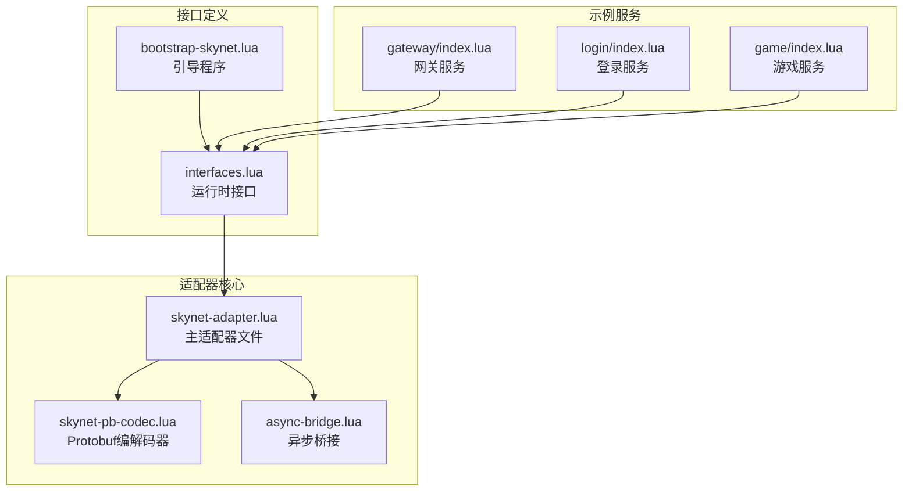
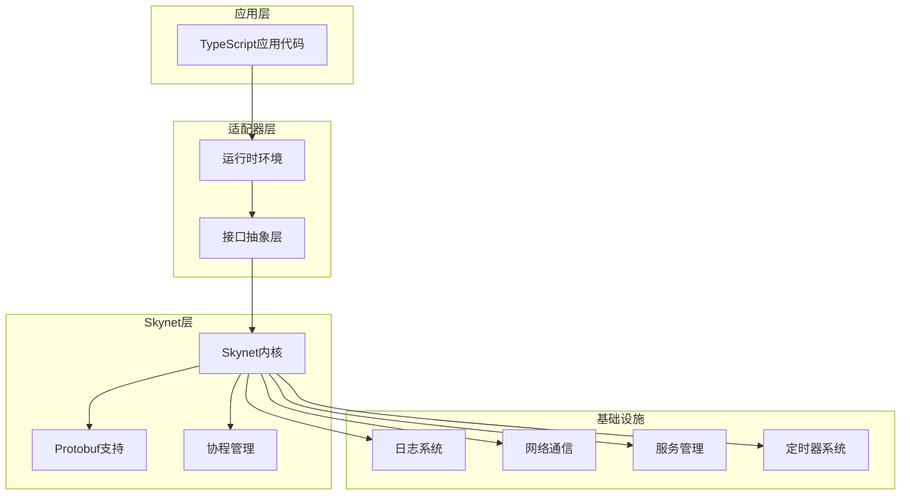
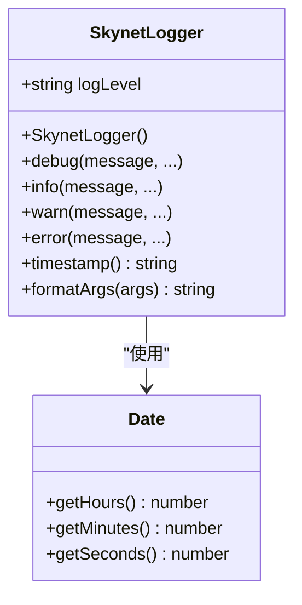
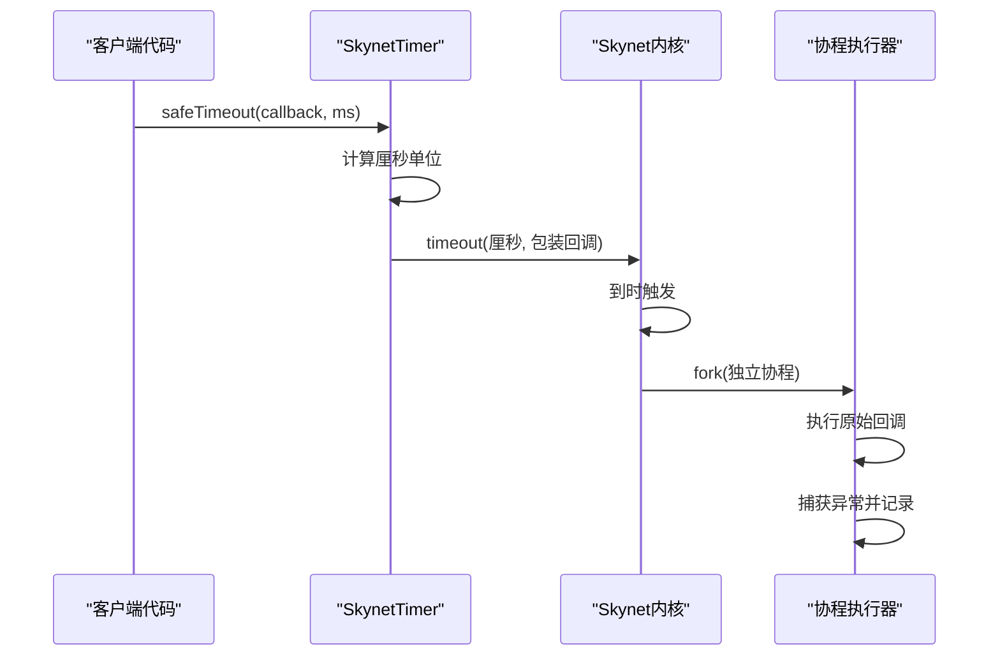
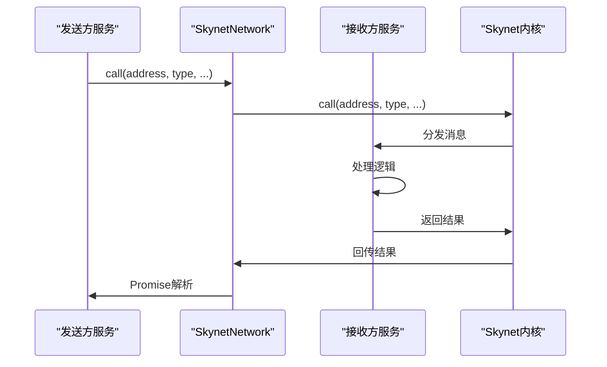
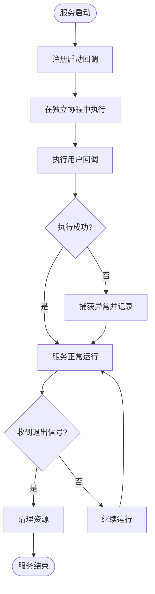
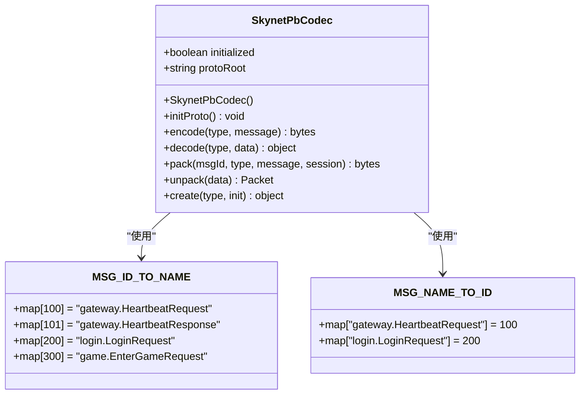
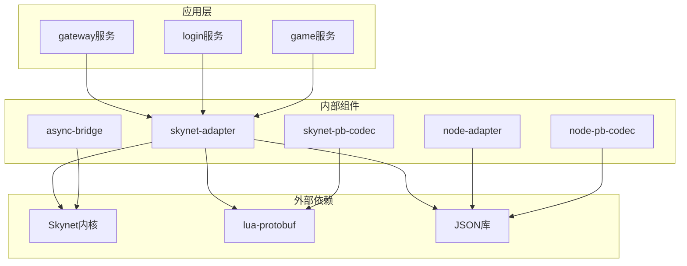

# Skynet适配器

<cite>
**本文档引用的文件**
- [skynet-adapter.lua](file://docker/lua/framework/runtime/skynet-adapter.lua)
- [skynet-pb-codec.lua](file://docker/lua/framework/runtime/skynet-pb-codec.lua)
- [interfaces.lua](file://docker/lua/framework/core/interfaces.lua)
- [bootstrap-skynet.lua](file://docker/lua/app/bootstrap-skynet.lua)
- [async-bridge.lua](file://docker/lua/framework/runtime/async-bridge.lua)
- [node-adapter.lua](file://docker/lua/framework/runtime/node-adapter.lua)
- [node-pb-codec.lua](file://docker/lua/framework/runtime/node-pb-codec.lua)
- [index.lua](file://docker/lua/app/services/gateway/index.lua)
- [login/index.lua](file://docker/lua/app/services/login/index.lua)
- [game/index.lua](file://docker/lua/app/services/game/index.lua)
- [common.proto](file://protocols/proto/common.proto)
- [gateway.proto](file://protocols/proto/gateway.proto)
- [login.proto](file://protocols/proto/login.proto)
</cite>

## 目录
1. [简介](#简介)
2. [项目结构](#项目结构)
3. [核心组件](#核心组件)
4. [架构概览](#架构概览)
5. [详细组件分析](#详细组件分析)
6. [依赖关系分析](#依赖关系分析)
7. [性能考虑](#性能考虑)
8. [故障排除指南](#故障排除指南)
9. [结论](#结论)

## 简介

Skynet适配器是TS-Lua项目中的一个关键组件，它为TypeScript代码提供了在Skynet分布式游戏服务器框架中运行的能力。该适配器实现了统一的接口抽象层，包括ILogger、ITimer、INetwork、IService等核心接口，使得开发者可以在TypeScript中使用熟悉的编程模式来开发Skynet服务。

适配器的核心价值在于：
- 提供TypeScript到Lua的无缝桥接
- 实现Skynet特有的协程调度机制
- 支持Protobuf消息编解码
- 提供完整的异步编程支持

## 项目结构

Skynet适配器位于项目的`docker/lua/framework/runtime`目录下，主要包含以下核心文件：



**图表来源**
- [skynet-adapter.lua:1-227](file://docker/lua/framework/runtime/skynet-adapter.lua#L1-L227)
- [interfaces.lua:1-24](file://docker/lua/framework/core/interfaces.lua#L1-L24)
- [bootstrap-skynet.lua:1-12](file://docker/lua/app/bootstrap-skynet.lua#L1-L12)

**章节来源**
- [skynet-adapter.lua:1-227](file://docker/lua/framework/runtime/skynet-adapter.lua#L1-L227)
- [interfaces.lua:1-24](file://docker/lua/framework/core/interfaces.lua#L1-L24)
- [bootstrap-skynet.lua:1-12](file://docker/lua/app/bootstrap-skynet.lua#L1-L12)

## 核心组件

Skynet适配器实现了四个核心接口，每个接口都有对应的Skynet实现：

### ILogger接口实现
SkynetLogger类提供了完整的日志功能，支持多种日志级别和格式化输出。

### ITimer接口实现  
SkynetTimer类实现了时间管理和定时任务功能，包括setTimeout、sleep和安全执行机制。

### INetwork接口实现
SkynetNetwork类提供了服务间通信能力，支持消息发送、异步调用和消息分发。

### IService接口实现
SkynetService类管理服务生命周期，包括启动、退出和服务创建。

**章节来源**
- [skynet-adapter.lua:19-204](file://docker/lua/framework/runtime/skynet-adapter.lua#L19-L204)

## 架构概览

Skynet适配器采用分层架构设计，确保了良好的模块化和可扩展性：



**图表来源**
- [skynet-adapter.lua:205-225](file://docker/lua/framework/runtime/skynet-adapter.lua#L205-L225)
- [interfaces.lua:6-22](file://docker/lua/framework/core/interfaces.lua#L6-L22)

## 详细组件分析

### SkynetLogger日志实现

SkynetLogger实现了完整的日志系统，具有以下特性：

#### 日志级别控制
- debug: 仅在调试模式下输出
- info: 标准信息输出
- warn: 警告信息
- error: 错误信息

#### 时间戳格式化机制
日志时间戳采用24小时制格式，精确到秒：
```
HH:mm:ss 格式的时间戳
```

#### 参数格式化策略
- 表格类型参数：使用JSON.stringify进行序列化
- 其他类型：转换为字符串表示



**图表来源**
- [skynet-adapter.lua:19-77](file://docker/lua/framework/runtime/skynet-adapter.lua#L19-L77)

**章节来源**
- [skynet-adapter.lua:23-77](file://docker/lua/framework/runtime/skynet-adapter.lua#L23-L77)

### SkynetTimer定时器实现

SkynetTimer提供了强大的定时功能，特别针对Skynet的协程模型进行了优化：

#### 时间单位转换机制
Skynet内部使用"厘秒"作为时间单位（1/100秒），适配器自动进行转换：
```
厘秒 = 毫秒 / 10
```

#### 协程安全的setTimeout实现
`safeTimeout`和`safeImmediate`方法确保回调在独立的协程中执行，避免阻塞主服务：



**图表来源**
- [skynet-adapter.lua:85-127](file://docker/lua/framework/runtime/skynet-adapter.lua#L85-L127)

**章节来源**
- [skynet-adapter.lua:85-127](file://docker/lua/framework/runtime/skynet-adapter.lua#L85-L127)

### SkynetNetwork网络实现

SkynetNetwork实现了服务间的异步通信机制：

#### 消息发送机制
- `send`: 发送无返回值的消息
- `call`: 发送带返回值的异步调用
- `ret`: 返回处理结果

#### 异步调用流程
调用过程采用Promise模式，支持链式调用和错误处理：



**图表来源**
- [skynet-adapter.lua:134-167](file://docker/lua/framework/runtime/skynet-adapter.lua#L134-L167)

**章节来源**
- [skynet-adapter.lua:134-167](file://docker/lua/framework/runtime/skynet-adapter.lua#L134-L167)

### SkynetService服务实现

SkynetService管理服务的完整生命周期：

#### 服务启动流程
- `start`: 注册服务启动回调
- 自动在独立协程中执行
- 异常捕获和错误报告

#### 服务管理功能
- `exit`: 正常退出服务
- `newService`: 动态创建新服务
- `self`: 获取当前服务地址
- `getenv/setenv`: 环境变量管理



**图表来源**
- [skynet-adapter.lua:174-203](file://docker/lua/framework/runtime/skynet-adapter.lua#L174-L203)

**章节来源**
- [skynet-adapter.lua:174-203](file://docker/lua/framework/runtime/skynet-adapter.lua#L174-L203)

### SkynetPbCodec协议编解码器

SkynetPbCodec实现了完整的Protobuf消息处理机制：

#### 初始化流程
- 自动检测lua-protobuf库可用性
- 加载所有预定义的proto描述文件
- 建立消息类型映射表

#### 编解码机制
- `encode`: 将消息对象编码为字节流
- `decode`: 将字节流解码为消息对象
- `pack/unpack`: 处理带包装的消息包



**图表来源**
- [skynet-pb-codec.lua:26-58](file://docker/lua/framework/runtime/skynet-pb-codec.lua#L26-L58)

**章节来源**
- [skynet-pb-codec.lua:59-162](file://docker/lua/framework/runtime/skynet-pb-codec.lua#L59-L162)

### 异步桥接机制

async-bridge.lua提供了TypeScript到Lua协程的桥接：

#### Promise实现
自定义的SkynetPromise类实现了完整的Promise/A+规范，支持：
- then/catch方法链式调用
- 异常捕获和传播
- 并行Promise聚合

#### 协程包装
`wrapSkynetCoroutine`函数将同步函数包装为协程安全的异步操作。

**章节来源**
- [async-bridge.lua:17-241](file://docker/lua/framework/runtime/async-bridge.lua#L17-L241)

## 依赖关系分析

Skynet适配器的依赖关系清晰明确，遵循单一职责原则：



**图表来源**
- [skynet-adapter.lua:14-15](file://docker/lua/framework/runtime/skynet-adapter.lua#L14-L15)
- [skynet-pb-codec.lua:16-21](file://docker/lua/framework/runtime/skynet-pb-codec.lua#L16-L21)

**章节来源**
- [skynet-adapter.lua:14-15](file://docker/lua/framework/runtime/skynet-adapter.lua#L14-L15)
- [skynet-pb-codec.lua:16-21](file://docker/lua/framework/runtime/skynet-pb-codec.lua#L16-L21)

## 性能考虑

Skynet适配器在设计时充分考虑了性能优化：

### 协程优化
- 使用`skynet.fork`创建轻量级协程
- 避免阻塞操作，提高并发性能
- 合理的错误处理减少异常开销

### 内存管理
- 及时释放不再使用的Promise对象
- 避免循环引用导致的内存泄漏
- 合理使用表格进行数据存储

### 网络优化
- 批量消息处理减少系统调用
- 适当的缓冲区大小平衡内存和性能
- 连接池管理提高连接复用率

## 故障排除指南

### 常见问题及解决方案

#### Protobuf编解码失败
**症状**: 编码或解码过程中抛出异常
**原因**: 
- lua-protobuf库未正确安装
- 消息类型定义不匹配
- proto文件加载失败

**解决方法**:
1. 检查lua-protobuf库是否可用
2. 验证消息类型映射表
3. 确认proto文件路径正确

#### 定时器精度问题
**症状**: setTimeout执行时间与预期不符
**原因**: Skynet内部使用厘秒单位
**解决方法**: 使用适配器提供的毫秒到厘秒转换

#### 服务启动失败
**症状**: 服务无法正常启动
**原因**: 
- 启动回调中抛出异常
- 依赖的服务未就绪
- 环境变量配置错误

**解决方法**:
1. 检查服务启动回调中的异常
2. 确认依赖服务的启动顺序
3. 验证环境变量设置

**章节来源**
- [skynet-pb-codec.lua:92-121](file://docker/lua/framework/runtime/skynet-pb-codec.lua#L92-L121)
- [skynet-adapter.lua:114-123](file://docker/lua/framework/runtime/skynet-adapter.lua#L114-L123)

## 结论

Skynet适配器成功地将TypeScript的现代编程范式引入到Skynet分布式游戏服务器框架中。通过实现统一的接口抽象层，它为开发者提供了：

1. **一致的编程体验**: TypeScript开发者可以使用熟悉的语法和工具链
2. **高性能的执行环境**: 充分利用Skynet的协程和消息传递机制
3. **完善的错误处理**: 提供全面的异常捕获和错误报告机制
4. **灵活的扩展能力**: 易于添加新的接口实现和功能模块

该适配器不仅满足了当前项目的需求，还为未来的功能扩展和技术演进奠定了坚实的基础。通过合理的架构设计和详细的错误处理策略，它为构建大规模分布式游戏服务提供了可靠的基础设施。