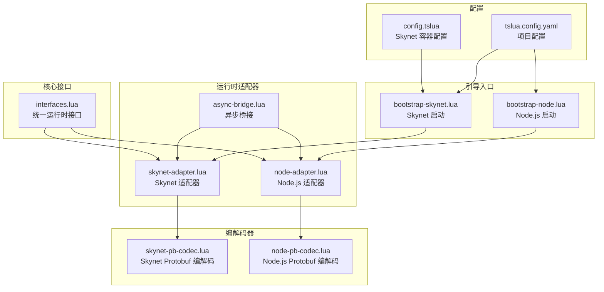
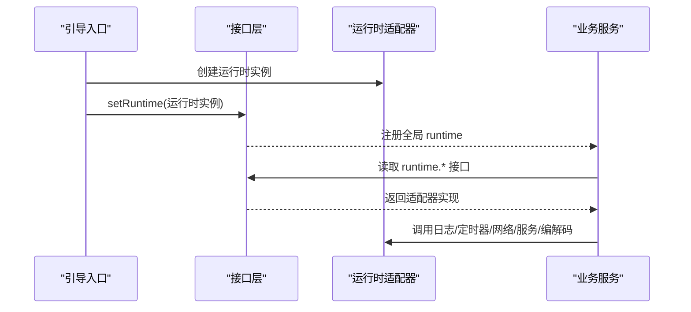
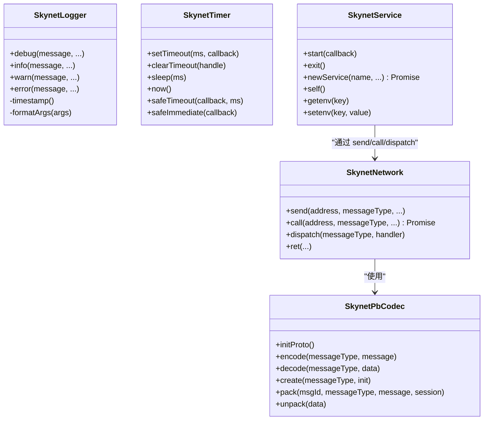
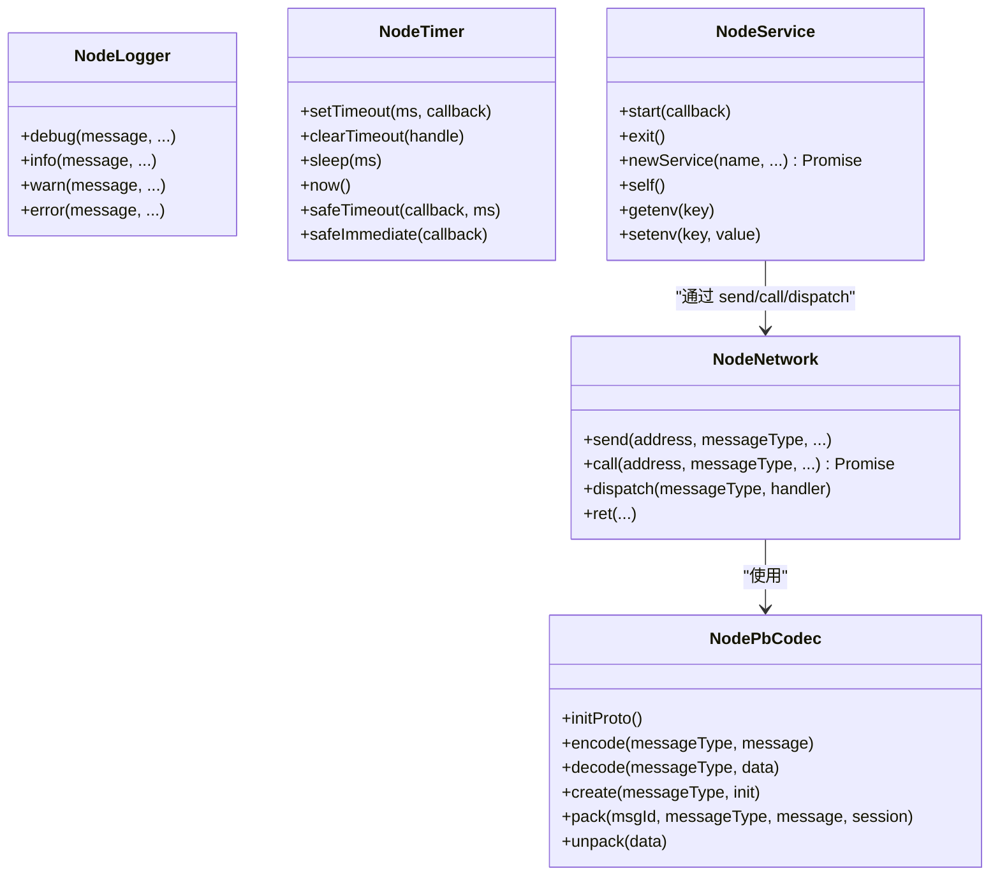
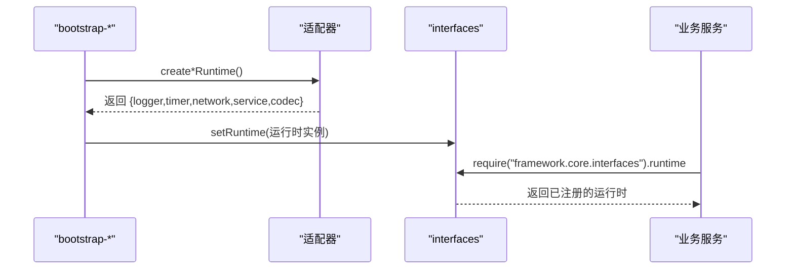
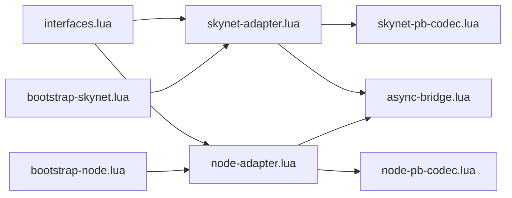

# 运行时适配器

<cite>
**本文档引用的文件**
- [skynet-adapter.lua](file://docker/lua/framework/runtime/skynet-adapter.lua)
- [node-adapter.lua](file://docker/lua/framework/runtime/node-adapter.lua)
- [async-bridge.lua](file://docker/lua/framework/runtime/async-bridge.lua)
- [interfaces.lua](file://docker/lua/framework/core/interfaces.lua)
- [skynet-pb-codec.lua](file://docker/lua/framework/runtime/skynet-pb-codec.lua)
- [node-pb-codec.lua](file://docker/lua/framework/runtime/node-pb-codec.lua)
- [bootstrap-skynet.lua](file://docker/lua/app/bootstrap-skynet.lua)
- [bootstrap-node.lua](file://docker/lua/app/bootstrap-node.lua)
- [config.tslua](file://docker/config/skynet/config.tslua)
- [tslua.config.yaml](file://tslua.config.yaml)
- [interfaces.ts](file://server/src/framework/core/interfaces.ts)
</cite>

## 目录
1. [简介](#简介)
2. [项目结构](#项目结构)
3. [核心组件](#核心组件)
4. [架构总览](#架构总览)
5. [详细组件分析](#详细组件分析)
6. [依赖关系分析](#依赖关系分析)
7. [性能考量](#性能考量)
8. [故障排查指南](#故障排查指南)
9. [结论](#结论)
10. [附录](#附录)

## 简介
本文件系统化阐述运行时适配器的设计与实现，重点对比 Skynet 与 Node.js 两种运行时环境的适配策略，解释如何通过统一的接口抽象层（日志、定时器、网络、服务、编解码）屏蔽底层差异，使上层业务逻辑以一致方式编写。文档同时给出使用示例、扩展机制、性能对比、兼容性与迁移建议。

## 项目结构
运行时适配器位于 `docker/lua/framework/runtime` 目录，配合 `docker/lua/framework/core/interfaces.lua` 提供统一的运行时注册与访问入口；业务服务通过 `bootstrap-*` 入口在启动阶段选择并安装对应运行时。



**图表来源**
- [interfaces.lua:1-24](file://docker/lua/framework/core/interfaces.lua#L1-L24)
- [skynet-adapter.lua:1-227](file://docker/lua/framework/runtime/skynet-adapter.lua#L1-L227)
- [node-adapter.lua:1-207](file://docker/lua/framework/runtime/node-adapter.lua#L1-L207)
- [async-bridge.lua:1-243](file://docker/lua/framework/runtime/async-bridge.lua#L1-L243)
- [skynet-pb-codec.lua:1-164](file://docker/lua/framework/runtime/skynet-pb-codec.lua#L1-L164)
- [node-pb-codec.lua:1-185](file://docker/lua/framework/runtime/node-pb-codec.lua#L1-L185)
- [bootstrap-skynet.lua:1-12](file://docker/lua/app/bootstrap-skynet.lua#L1-L12)
- [bootstrap-node.lua:1-17](file://docker/lua/app/bootstrap-node.lua#L1-L17)
- [config.tslua:1-54](file://docker/config/skynet/config.tslua#L1-L54)
- [tslua.config.yaml:1-52](file://tslua.config.yaml#L1-L52)

**章节来源**
- [interfaces.lua:1-24](file://docker/lua/framework/core/interfaces.lua#L1-L24)
- [skynet-adapter.lua:1-227](file://docker/lua/framework/runtime/skynet-adapter.lua#L1-L227)
- [node-adapter.lua:1-207](file://docker/lua/framework/runtime/node-adapter.lua#L1-L207)
- [async-bridge.lua:1-243](file://docker/lua/framework/runtime/async-bridge.lua#L1-L243)
- [bootstrap-skynet.lua:1-12](file://docker/lua/app/bootstrap-skynet.lua#L1-L12)
- [bootstrap-node.lua:1-17](file://docker/lua/app/bootstrap-node.lua#L1-L17)
- [config.tslua:1-54](file://docker/config/skynet/config.tslua#L1-L54)
- [tslua.config.yaml:1-52](file://tslua.config.yaml#L1-L52)

## 核心组件
- 统一接口层：通过 `interfaces.lua` 暴露 `runtime` 对象与 `setRuntime` 方法，业务代码仅依赖该接口，不直接关心底层运行时。
- Skynet 适配器：封装 Skynet 的日志、定时器、网络、服务与 Protobuf 编解码能力。
- Node.js 适配器：封装 Node.js 的日志、定时器、网络、服务与 Protobuf 编解码能力。
- 异步桥接：为 TypeScript 到 Lua 的转换提供 Promise/协程桥接，支持 `async/await` 语法在不同运行时下正确执行。
- 引导入口：根据部署环境选择对应适配器并完成运行时注册。

**章节来源**
- [interfaces.lua:1-24](file://docker/lua/framework/core/interfaces.lua#L1-L24)
- [skynet-adapter.lua:1-227](file://docker/lua/framework/runtime/skynet-adapter.lua#L1-L227)
- [node-adapter.lua:1-207](file://docker/lua/framework/runtime/node-adapter.lua#L1-L207)
- [async-bridge.lua:1-243](file://docker/lua/framework/runtime/async-bridge.lua#L1-L243)

## 架构总览
运行时适配器采用“接口抽象 + 具体实现”的分层设计。业务服务通过统一接口访问运行时能力，启动阶段由引导入口决定使用哪种适配器，并将其注入到全局 `runtime` 对象中。



**图表来源**
- [bootstrap-skynet.lua:1-12](file://docker/lua/app/bootstrap-skynet.lua#L1-L12)
- [bootstrap-node.lua:1-17](file://docker/lua/app/bootstrap-node.lua#L1-L17)
- [interfaces.lua:1-24](file://docker/lua/framework/core/interfaces.lua#L1-L24)
- [skynet-adapter.lua:205-225](file://docker/lua/framework/runtime/skynet-adapter.lua#L205-L225)
- [node-adapter.lua:185-205](file://docker/lua/framework/runtime/node-adapter.lua#L185-L205)

## 详细组件分析

### Skynet 适配器
Skynet 适配器提供与 Skynet 平台紧密集成的能力：
- 日志：基于 `skynet.error` 输出，带本地时间戳与格式化参数。
- 定时器：将毫秒转换为 Skynet 的“厘秒”单位，提供 `setTimeout/clearTimeout/sleep/safeTimeout/safeImmediate`。
- 网络：封装 `send/call/dispatch/ret`，内部使用 `__TS__AsyncAwaiterSkynet` 将阻塞调用包装为可等待。
- 服务：封装 `start/exit/newService/self/getenv/setenv`，使用 `skynet.start/fork` 管理生命周期。
- 编解码：使用 `skynet-pb-codec`，加载本地 `.desc` 描述文件，支持打包/解包与消息类型映射。



**图表来源**
- [skynet-adapter.lua:19-225](file://docker/lua/framework/runtime/skynet-adapter.lua#L19-L225)
- [skynet-pb-codec.lua:1-164](file://docker/lua/framework/runtime/skynet-pb-codec.lua#L1-L164)

**章节来源**
- [skynet-adapter.lua:19-225](file://docker/lua/framework/runtime/skynet-adapter.lua#L19-L225)
- [skynet-pb-codec.lua:1-164](file://docker/lua/framework/runtime/skynet-pb-codec.lua#L1-L164)

### Node.js 适配器
Node.js 适配器提供与 Node.js 环境一致的能力：
- 日志：基于 `console` API，输出统一前缀。
- 定时器：直接使用 `global.setTimeout/global.setImmediate`，提供 `sleep` 的异步桥接版本。
- 网络：提供简单事件模拟，维护处理器映射与待处理调用，便于本地开发与测试。
- 服务：提供服务标识、启动与环境变量访问，便于在 Node.js 下模拟服务生命周期。
- 编解码：使用 `node-pb-codec`，从协议生成模块加载 Protobuf 定义，支持打包/解包。



**图表来源**
- [node-adapter.lua:14-205](file://docker/lua/framework/runtime/node-adapter.lua#L14-L205)
- [node-pb-codec.lua:1-185](file://docker/lua/framework/runtime/node-pb-codec.lua#L1-L185)

**章节来源**
- [node-adapter.lua:14-205](file://docker/lua/framework/runtime/node-adapter.lua#L14-L205)
- [node-pb-codec.lua:1-185](file://docker/lua/framework/runtime/node-pb-codec.lua#L1-L185)

### 异步桥接与协程模型
- TypeScript 到 Lua 的转换通过 TSTL 实现，`async/await` 会被转换为协程与 Promise 的组合。
- `async-bridge.lua` 提供：
  - `SkynetPromise`：在 Skynet 环境下的 Promise 实现，支持 `then/catch/all`。
  - `wrapSkynetCoroutine`：将业务函数包装为可捕获异常的协程执行。
  - `sleep`：跨环境的睡眠辅助函数，根据是否存在 `setTimeout` 选择 Node.js 或 Skynet 路径。
- 这些机制确保业务代码在两种运行时下均能正确处理异步流程。

```mermaid
flowchart TD
Start(["进入业务函数"]) --> CheckEnv{"是否存在 setTimeout?"}
CheckEnv --> |是(Node.js)| UseNode["使用 __TS__Promise + setTimeout"]
CheckEnv --> |否(Skynet)| UseSkynet["使用 SkynetPromise + skynet.timeout"]
UseNode --> Wrap["包装回调为可等待"]
UseSkynet --> Wrap
Wrap --> Exec["执行业务逻辑"]
Exec --> End(["返回 Promise/协程"])
```

**图表来源**
- [async-bridge.lua:227-241](file://docker/lua/framework/runtime/async-bridge.lua#L227-L241)

**章节来源**
- [async-bridge.lua:1-243](file://docker/lua/framework/runtime/async-bridge.lua#L1-L243)

### 引导与运行时注册
- Skynet 引导：加载 `skynet-adapter`，创建运行时并调用 `setRuntime` 注册到全局 `runtime`。
- Node.js 引导：加载 `node-adapter`，创建运行时并调用 `setRuntime` 注册到全局 `runtime`。
- 业务服务通过 `require("framework.core.interfaces").runtime` 访问统一接口。



**图表来源**
- [bootstrap-skynet.lua:7-9](file://docker/lua/app/bootstrap-skynet.lua#L7-L9)
- [bootstrap-node.lua:7-12](file://docker/lua/app/bootstrap-node.lua#L7-L12)
- [interfaces.lua:14-22](file://docker/lua/framework/core/interfaces.lua#L14-L22)

**章节来源**
- [bootstrap-skynet.lua:1-12](file://docker/lua/app/bootstrap-skynet.lua#L1-L12)
- [bootstrap-node.lua:1-17](file://docker/lua/app/bootstrap-node.lua#L1-L17)
- [interfaces.lua:1-24](file://docker/lua/framework/core/interfaces.lua#L1-L24)

## 依赖关系分析
- 适配器依赖接口层进行运行时注册，业务服务仅依赖接口层。
- 编解码器独立于适配器，但被网络层在需要时调用。
- 异步桥接为适配器与业务代码提供统一的异步执行模型。



**图表来源**
- [interfaces.lua:1-24](file://docker/lua/framework/core/interfaces.lua#L1-L24)
- [skynet-adapter.lua:1-227](file://docker/lua/framework/runtime/skynet-adapter.lua#L1-L227)
- [node-adapter.lua:1-207](file://docker/lua/framework/runtime/node-adapter.lua#L1-L207)
- [skynet-pb-codec.lua:1-164](file://docker/lua/framework/runtime/skynet-pb-codec.lua#L1-L164)
- [node-pb-codec.lua:1-185](file://docker/lua/framework/runtime/node-pb-codec.lua#L1-L185)
- [async-bridge.lua:1-243](file://docker/lua/framework/runtime/async-bridge.lua#L1-L243)
- [bootstrap-skynet.lua:1-12](file://docker/lua/app/bootstrap-skynet.lua#L1-L12)
- [bootstrap-node.lua:1-17](file://docker/lua/app/bootstrap-node.lua#L1-L17)

**章节来源**
- [interfaces.lua:1-24](file://docker/lua/framework/core/interfaces.lua#L1-L24)
- [skynet-adapter.lua:1-227](file://docker/lua/framework/runtime/skynet-adapter.lua#L1-L227)
- [node-adapter.lua:1-207](file://docker/lua/framework/runtime/node-adapter.lua#L1-L207)
- [async-bridge.lua:1-243](file://docker/lua/framework/runtime/async-bridge.lua#L1-L243)

## 性能考量
- 时间单位差异：Skynet 定时器使用“厘秒”，Node.js 使用毫秒。适配器内部做了单位转换，避免业务层感知差异。
- 协程与事件循环：Skynet 使用协程模型，Node.js 使用事件循环。异步桥接保证了 `async/await` 在两种环境的一致行为。
- 编解码开销：Protobuf 编解码在生产环境可能成为热点，建议：
  - 在 Skynet 环境中预加载描述文件，减少 IO 开销。
  - 在 Node.js 环境中复用 Protobuf 根对象，避免重复初始化。
- 网络调用：Skynet 的 `skynet.call` 是阻塞式调用，适配器通过桥接包装为 Promise，避免业务层直接处理协程细节。

[本节为通用性能建议，无需特定文件引用]

## 故障排查指南
- 编解码不可用：当 Protobuf 库未安装或描述文件缺失时，编解码器会抛出错误或记录警告。检查对应运行时的依赖与资源路径。
  - Skynet：确认 `lua-protobuf` 可用且 `.desc` 文件存在。
  - Node.js：确认协议生成模块可被 require。
- 定时器异常：检查 `setTimeout/clearTimeout` 的使用是否匹配运行时 API；Node.js 环境下注意 `global` 上的方法。
- 网络调用失败：确认 `network:dispatch` 已注册对应消息类型的处理器；检查 `network:call` 的超时与重试策略。
- 启动失败：确认引导入口已正确调用 `setRuntime`，并在业务服务启动前完成注册。

**章节来源**
- [skynet-pb-codec.lua:22-24](file://docker/lua/framework/runtime/skynet-pb-codec.lua#L22-L24)
- [node-pb-codec.lua:62-74](file://docker/lua/framework/runtime/node-pb-codec.lua#L62-L74)
- [skynet-adapter.lua:109-127](file://docker/lua/framework/runtime/skynet-adapter.lua#L109-L127)
- [node-adapter.lua:64-86](file://docker/lua/framework/runtime/node-adapter.lua#L64-L86)

## 结论
运行时适配器通过统一接口抽象层成功屏蔽了 Skynet 与 Node.js 的底层差异，使业务逻辑可在两种运行时下保持一致的开发体验。借助异步桥接与完善的编解码支持，项目实现了良好的可移植性与可维护性。建议在生产环境中优先使用 Skynet 以获得更稳定的并发模型，在开发与测试阶段可使用 Node.js 适配器提升迭代效率。

[本节为总结性内容，无需特定文件引用]

## 附录

### 使用示例与配置选项
- 选择运行时：通过引导入口选择 `createSkynetRuntime()` 或 `createNodeRuntime()`。
- 访问运行时：业务服务通过 `require("framework.core.interfaces").runtime` 获取统一接口。
- 配置文件：
  - Skynet 容器配置：`docker/config/skynet/config.tslua`
  - 项目构建配置：`tslua.config.yaml`

**章节来源**
- [bootstrap-skynet.lua:1-12](file://docker/lua/app/bootstrap-skynet.lua#L1-L12)
- [bootstrap-node.lua:1-17](file://docker/lua/app/bootstrap-node.lua#L1-L17)
- [interfaces.lua:1-24](file://docker/lua/framework/core/interfaces.lua#L1-L24)
- [config.tslua:1-54](file://docker/config/skynet/config.tslua#L1-L54)
- [tslua.config.yaml:1-52](file://tslua.config.yaml#L1-L52)

### 扩展机制与自定义选项
- 新增运行时适配器：参照现有适配器的结构，实现 `Logger/Timer/Network/Service/Codec` 接口，并在引导入口中创建与注册。
- 自定义编解码：在 `Codec` 接口中实现 `pack/unpack/encode/decode/create`，满足业务消息格式需求。
- 自定义网络协议：在 `Network` 接口中扩展消息类型与处理器映射，支持更复杂的 RPC 场景。

**章节来源**
- [skynet-adapter.lua:19-225](file://docker/lua/framework/runtime/skynet-adapter.lua#L19-L225)
- [node-adapter.lua:14-205](file://docker/lua/framework/runtime/node-adapter.lua#L14-L205)
- [interfaces.lua:1-24](file://docker/lua/framework/core/interfaces.lua#L1-L24)

### 兼容性与迁移指南
- 兼容性：接口层提供稳定契约，新增运行时只需实现相同接口即可无缝替换。
- 迁移步骤：
  1. 在新运行时下实现 `Logger/Timer/Network/Service/Codec`。
  2. 在引导入口中创建并注册运行时。
  3. 在业务服务中仅使用 `runtime.*` 接口，避免直接依赖平台 API。
  4. 验证编解码与网络通信在新环境下的行为一致性。

**章节来源**
- [interfaces.ts:198-225](file://server/src/framework/core/interfaces.ts#L198-L225)
- [interfaces.lua:1-24](file://docker/lua/framework/core/interfaces.lua#L1-L24)