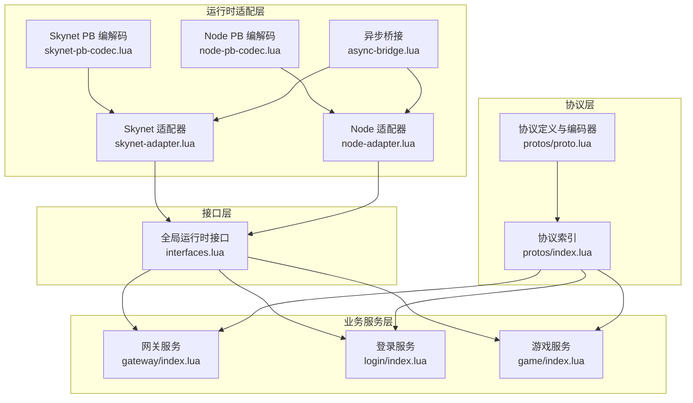
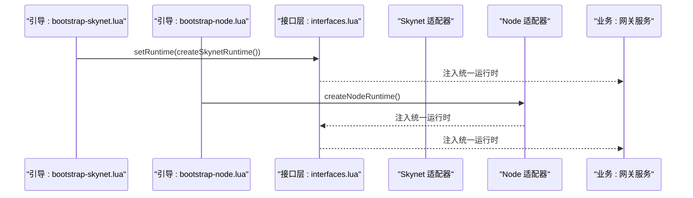
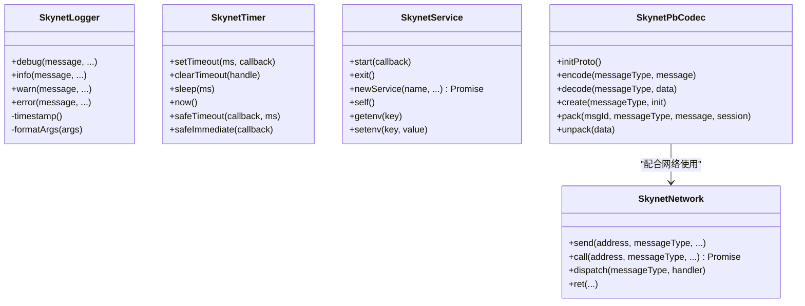
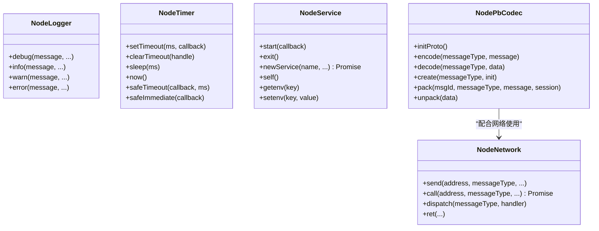
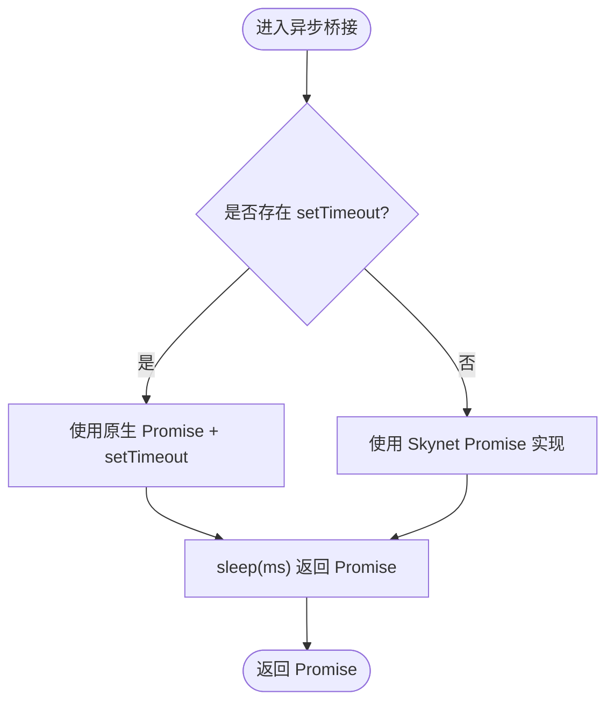
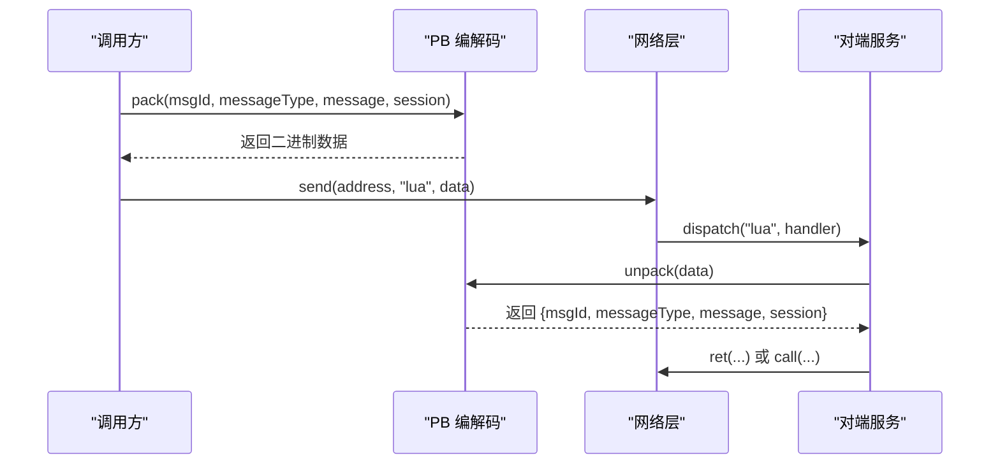
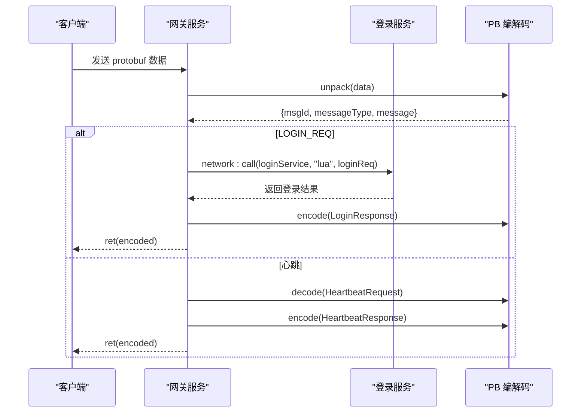
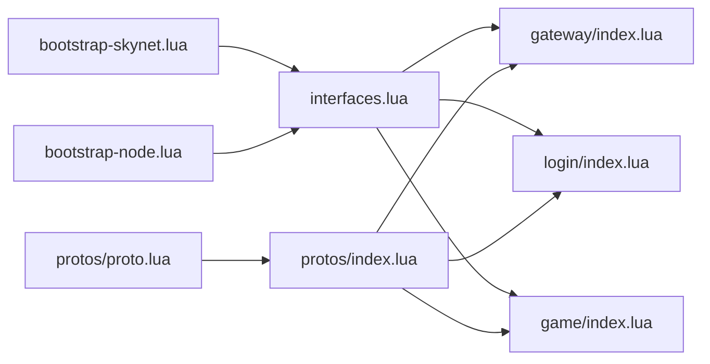

# 适配器对比与选择

<cite>
**本文引用的文件**
- [docker\lua\framework\runtime\skynet-adapter.lua](file://docker\lua\framework\runtime\skynet-adapter.lua)
- [docker\lua\framework\runtime\node-adapter.lua](file://docker\lua\framework\runtime\node-adapter.lua)
- [docker\lua\framework\runtime\skynet-pb-codec.lua](file://docker\lua\framework\runtime\skynet-pb-codec.lua)
- [docker\lua\framework\runtime\node-pb-codec.lua](file://docker\lua\framework\runtime\node-pb-codec.lua)
- [docker\lua\framework\runtime\async-bridge.lua](file://docker\lua\framework\runtime\async-bridge.lua)
- [docker\lua\framework\core\interfaces.lua](file://docker\lua\framework\core\interfaces.lua)
- [docker\lua\app\bootstrap-skynet.lua](file://docker\lua\app\bootstrap-skynet.lua)
- [docker\lua\app\bootstrap-node.lua](file://docker\lua\app\bootstrap-node.lua)
- [docker\lua\app\services\gateway\index.lua](file://docker\lua\app\services\gateway\index.lua)
- [docker\lua\app\services\login\index.lua](file://docker\lua\app\services\login\index.lua)
- [docker\lua\app\services\game\index.lua](file://docker\lua\app\services\game\index.lua)
- [docker\lua\protos\index.lua](file://docker\lua\protos\index.lua)
- [docker\lua\protos\proto.lua](file://docker\lua\protos\proto.lua)
- [docker\compose.yml](file://docker\compose.yml)
- [tslua.config.yaml](file://tslua.config.yaml)
</cite>

## 目录
1. [引言](#引言)
2. [项目结构](#项目结构)
3. [核心组件](#核心组件)
4. [架构总览](#架构总览)
5. [详细组件分析](#详细组件分析)
6. [依赖关系分析](#依赖关系分析)
7. [性能考量](#性能考量)
8. [故障排查指南](#故障排查指南)
9. [结论](#结论)
10. [附录](#附录)

## 引言
本文件面向需要在 Skynet 与 Node.js 两种运行时之间进行适配器选择与切换的工程团队，系统性对比两种运行时适配器在功能特性、性能表现、资源消耗、部署复杂度等方面的差异，并给出适用场景、选择标准、API 对比、迁移步骤、性能基准与优化建议、实际案例与经验总结，以及自定义适配器的开发指南。

## 项目结构
本项目通过“运行时适配层”抽象统一上层业务逻辑，使同一套 TypeScript 代码经由 TypeScriptToLua 转译为 Lua 后，在 Skynet 与 Node.js 两大运行时下均可运行。核心结构如下：
- 运行时适配层：分别提供 Skynet 与 Node.js 的日志、定时器、网络、服务、编码解码等实现
- 接口层：统一的全局运行时实例，屏蔽底层差异
- 业务服务层：网关、登录、游戏等服务，基于统一接口开发
- 协议层：Protobuf 定义与生成代码，支持跨语言/跨运行时的消息编解码
- 部署层：Docker Compose 提供 Skynet 运行时容器化部署

图表来源
- [docker\lua\framework\runtime\skynet-adapter.lua](file://docker\lua\framework\runtime\skynet-adapter.lua)
- [docker\lua\framework\runtime\node-adapter.lua](file://docker\lua\framework\runtime\node-adapter.lua)
- [docker\lua\framework\runtime\skynet-pb-codec.lua](file://docker\lua\framework\runtime\skynet-pb-codec.lua)
- [docker\lua\framework\runtime\node-pb-codec.lua](file://docker\lua\framework\runtime\node-pb-codec.lua)
- [docker\lua\framework\core\interfaces.lua](file://docker\lua\framework\core\interfaces.lua)
- [docker\lua\app\services\gateway\index.lua](file://docker\lua\app\services\gateway\index.lua)
- [docker\lua\app\services\login\index.lua](file://docker\lua\app\services\login\index.lua)
- [docker\lua\app\services\game\index.lua](file://docker\lua\app\services\game\index.lua)
- [docker\lua\protos\index.lua](file://docker\lua\protos\index.lua)
- [docker\lua\protos\proto.lua](file://docker\lua\protos\proto.lua)

章节来源
- [docker\lua\framework\core\interfaces.lua](file://docker\lua\framework\core\interfaces.lua)
- [docker\lua\app\bootstrap-skynet.lua](file://docker\lua\app\bootstrap-skynet.lua)
- [docker\lua\app\bootstrap-node.lua](file://docker\lua\app\bootstrap-node.lua)

## 核心组件
- 运行时接口与全局实例
  - 统一的 RuntimeEnvironment 枚举与 setRuntime 注入机制，确保业务代码只依赖接口而不感知底层实现
- Skynet 适配器
  - 日志、定时器、网络、服务、PB 编解码等完整实现，集成 Skynet 内置 API
- Node.js 适配器
  - 日志、定时器、网络、服务、PB 编解码等实现，使用 Node.js 原生能力与简单事件模拟
- 异步桥接
  - 将 async/await 与 Promise 在两种运行时下统一为可协作的协程/回调模型
- 协议层
  - Protobuf 类型与 Pack/Unpack 流程，支持 Skynet 的 lua-protobuf 与 Node 的 JSON 序列化回退

章节来源
- [docker\lua\framework\core\interfaces.lua](file://docker\lua\framework\core\interfaces.lua)
- [docker\lua\framework\runtime\skynet-adapter.lua](file://docker\lua\framework\runtime\skynet-adapter.lua)
- [docker\lua\framework\runtime\node-adapter.lua](file://docker\lua\framework\runtime\node-adapter.lua)
- [docker\lua\framework\runtime\async-bridge.lua](file://docker\lua\framework\runtime\async-bridge.lua)
- [docker\lua\framework\runtime\skynet-pb-codec.lua](file://docker\lua\framework\runtime\skynet-pb-codec.lua)
- [docker\lua\framework\runtime\node-pb-codec.lua](file://docker\lua\framework\runtime\node-pb-codec.lua)

## 架构总览
两种运行时的启动流程与职责分工如下：

图表来源
- [docker\lua\app\bootstrap-skynet.lua](file://docker\lua\app\bootstrap-skynet.lua)
- [docker\lua\app\bootstrap-node.lua](file://docker\lua\app\bootstrap-node.lua)
- [docker\lua\framework\core\interfaces.lua](file://docker\lua\framework\core\interfaces.lua)
- [docker\lua\app\services\gateway\index.lua](file://docker\lua\app\services\gateway\index.lua)

## 详细组件分析

### Skynet 适配器分析
- 日志实现
  - 使用 Skynet 错误输出接口，支持级别控制与参数格式化
- 定时器实现
  - 时间单位转换（厘秒），提供 setTimeout/clearTimeout/sleep/safeTimeout/safeImmediate
- 网络实现
  - send/call/dispatch/ret，封装 Skynet 的消息发送与回调处理
- 服务实现
  - start/exit/newService/self/getenv/setenv，封装 Skynet 服务生命周期与环境变量
- PB 编解码
  - 依赖 lua-protobuf，加载多文件描述符，完成消息打包/解包与类型映射

图表来源
- [docker\lua\framework\runtime\skynet-adapter.lua](file://docker\lua\framework\runtime\skynet-adapter.lua)
- [docker\lua\framework\runtime\skynet-pb-codec.lua](file://docker\lua\framework\runtime\skynet-pb-codec.lua)

章节来源
- [docker\lua\framework\runtime\skynet-adapter.lua](file://docker\lua\framework\runtime\skynet-adapter.lua)
- [docker\lua\framework\runtime\skynet-pb-codec.lua](file://docker\lua\framework\runtime\skynet-pb-codec.lua)

### Node.js 适配器分析
- 日志实现
  - 使用 Node.js console 接口，提供调试信息输出
- 定时器实现
  - 使用 global.setTimeout/global.setImmediate，提供 sleep/safeTimeout/safeImmediate
- 网络实现
  - 使用 Map 存储处理器与待处理调用，模拟 call/ret，便于本地开发与测试
- 服务实现
  - 以字符串标识服务 ID，提供 start/newService/self/getenv/setenv
- PB 编解码
  - 通过 require 生成的 proto 模块进行 encode/decode/create，支持 pack/unpack

图表来源
- [docker\lua\framework\runtime\node-adapter.lua](file://docker\lua\framework\runtime\node-adapter.lua)
- [docker\lua\framework\runtime\node-pb-codec.lua](file://docker\lua\framework\runtime\node-pb-codec.lua)

章节来源
- [docker\lua\framework\runtime\node-adapter.lua](file://docker\lua\framework\runtime\node-adapter.lua)
- [docker\lua\framework\runtime\node-pb-codec.lua](file://docker\lua\framework\runtime\node-pb-codec.lua)

### 异步桥接与 Promise 实现
- Skynet Promise
  - 自定义 Promise 实现，支持 then/catch/all，内部使用回调队列与状态机
- 异步桥接
  - wrapSkynetCoroutine 将协程包装为 Promise；sleep 根据运行时类型选择 setTimeout 或 Skynet Promise
- 作用
  - 统一 async/await 语义，保证在两种运行时下行为一致

图表来源
- [docker\lua\framework\runtime\async-bridge.lua](file://docker\lua\framework\runtime\async-bridge.lua)

章节来源
- [docker\lua\framework\runtime\async-bridge.lua](file://docker\lua\framework\runtime\async-bridge.lua)

### 协议编解码流程
- Skynet
  - 通过 lua-protobuf 加载 .desc 文件，完成 encode/decode；pack/unpack 基于 common.Packet 结构
- Node
  - 通过 require 的 proto 模块完成 encode/decode；pack/unpack 同样基于 common.Packet
- 两者均维护 msgId 与消息类型的双向映射

图表来源
- [docker\lua\framework\runtime\skynet-pb-codec.lua](file://docker\lua\framework\runtime\skynet-pb-codec.lua)
- [docker\lua\framework\runtime\node-pb-codec.lua](file://docker\lua\framework\runtime\node-pb-codec.lua)
- [docker\lua\protos\proto.lua](file://docker\lua\protos\proto.lua)

章节来源
- [docker\lua\framework\runtime\skynet-pb-codec.lua](file://docker\lua\framework\runtime\skynet-pb-codec.lua)
- [docker\lua\framework\runtime\node-pb-codec.lua](file://docker\lua\framework\runtime\node-pb-codec.lua)
- [docker\lua\protos\index.lua](file://docker\lua\protos\index.lua)
- [docker\lua\protos\proto.lua](file://docker\lua\protos\proto.lua)

### 业务服务使用示例
- 网关服务
  - 通过 runtime.network:dispatch 订阅命令，根据命令分发到逻辑层；支持心跳与转发到登录服务
- 登录服务
  - 处理登录/登出/校验令牌等命令，结合 codec 进行 Protobuf 序列化
- 游戏服务
  - 处理进入/离开游戏、玩家信息查询与更新等命令

图表来源
- [docker\lua\app\services\gateway\index.lua](file://docker\lua\app\services\gateway\index.lua)
- [docker\lua\app\services\login\index.lua](file://docker\lua\app\services\login\index.lua)
- [docker\lua\framework\runtime\skynet-pb-codec.lua](file://docker\lua\framework\runtime\skynet-pb-codec.lua)
- [docker\lua\framework\runtime\node-pb-codec.lua](file://docker\lua\framework\runtime\node-pb-codec.lua)

章节来源
- [docker\lua\app\services\gateway\index.lua](file://docker\lua\app\services\gateway\index.lua)
- [docker\lua\app\services\login\index.lua](file://docker\lua\app\services\login\index.lua)
- [docker\lua\app\services\game\index.lua](file://docker\lua\app\services\game\index.lua)

## 依赖关系分析
- 运行时注入
  - bootstrap-skynet.lua 与 bootstrap-node.lua 分别创建并注入对应运行时
- 业务依赖接口
  - 业务服务仅依赖 interfaces.lua 中的 runtime，不直接依赖具体适配器
- 协议依赖
  - 业务服务依赖 protos.index 与 protos.proto，二者提供统一的类型与编码器

图表来源
- [docker\lua\app\bootstrap-skynet.lua](file://docker\lua\app\bootstrap-skynet.lua)
- [docker\lua\app\bootstrap-node.lua](file://docker\lua\app\bootstrap-node.lua)
- [docker\lua\framework\core\interfaces.lua](file://docker\lua\framework\core\interfaces.lua)
- [docker\lua\app\services\gateway\index.lua](file://docker\lua\app\services\gateway\index.lua)
- [docker\lua\app\services\login\index.lua](file://docker\lua\app\services\login\index.lua)
- [docker\lua\app\services\game\index.lua](file://docker\lua\app\services\game\index.lua)
- [docker\lua\protos\index.lua](file://docker\lua\protos\index.lua)
- [docker\lua\protos\proto.lua](file://docker\lua\protos\proto.lua)

章节来源
- [docker\lua\app\bootstrap-skynet.lua](file://docker\lua\app\bootstrap-skynet.lua)
- [docker\lua\app\bootstrap-node.lua](file://docker\lua\app\bootstrap-node.lua)
- [docker\lua\framework\core\interfaces.lua](file://docker\lua\framework\core\interfaces.lua)

## 性能考量
- 时间单位与精度
  - Skynet 定时器使用“厘秒”（1/100 秒），Node.js 使用毫秒；在跨运行时迁移时需注意换算
- 编解码开销
  - Skynet 使用 lua-protobuf，Node 使用 JSON 回退；在高并发场景下，lua-protobuf 更高效但需要安装依赖
- 网络与消息
  - Node 适配器的 NodeNetwork 为本地模拟，call/ret 采用延迟模拟；生产应替换为真实 RPC
- 资源占用
  - Skynet 作为 C 语言扩展，内存与并发模型更稳定；Node.js 适合快速迭代与本地联调
- 异步桥接
  - 两种运行时均通过异步桥接统一 async/await 语义，避免业务层感知差异

章节来源
- [docker\lua\framework\runtime\skynet-adapter.lua](file://docker\lua\framework\runtime\skynet-adapter.lua)
- [docker\lua\framework\runtime\node-adapter.lua](file://docker\lua\framework\runtime\node-adapter.lua)
- [docker\lua\framework\runtime\skynet-pb-codec.lua](file://docker\lua\framework\runtime\skynet-pb-codec.lua)
- [docker\lua\framework\runtime\node-pb-codec.lua](file://docker\lua\framework\runtime\node-pb-codec.lua)
- [docker\lua\framework\runtime\async-bridge.lua](file://docker\lua\framework\runtime\async-bridge.lua)

## 故障排查指南
- 运行时未注入
  - 确认 bootstrap 脚本已调用 setRuntime 并传入对应 createXxxRuntime()
- PB 编解码不可用
  - Skynet：检查 lua-protobuf 是否可用；Node：检查 proto 模块是否成功 require
- 网络调用无响应
  - Node：确认 NodeNetwork 的 handlers 已注册；检查 pendingCalls 超时处理
- 定时器异常
  - Skynet：注意厘秒换算；Node：确认 global.setTimeout 可用
- 日志输出异常
  - Skynet：确认 skynet.error 输出正常；Node：确认 console 可用

章节来源
- [docker\lua\app\bootstrap-skynet.lua](file://docker\lua\app\bootstrap-skynet.lua)
- [docker\lua\app\bootstrap-node.lua](file://docker\lua\app\bootstrap-node.lua)
- [docker\lua\framework\runtime\skynet-pb-codec.lua](file://docker\lua\framework\runtime\skynet-pb-codec.lua)
- [docker\lua\framework\runtime\node-pb-codec.lua](file://docker\lua\framework\runtime\node-pb-codec.lua)
- [docker\lua\framework\runtime\node-adapter.lua](file://docker\lua\framework\runtime\node-adapter.lua)

## 结论
- 选择标准
  - 开发/联调阶段：Node.js 适配器更易用、启动快、便于本地调试
  - 生产/高并发阶段：Skynet 适配器在稳定性、性能与资源占用方面更具优势
- 迁移建议
  - 保持业务层只依赖接口层；先在 Node 环境验证逻辑，再切换到 Skynet
  - 关注时间单位换算、PB 编解码差异与网络实现差异
- 最佳实践
  - 明确各运行时的边界与职责；在接口层统一抽象；在适配层隔离差异

## 附录

### 适配器对比与选择矩阵
- 功能特性
  - 日志：Skynet 与 Node 均提供 debug/info/warn/error
  - 定时器：Skynet 使用厘秒，Node 使用毫秒；均提供 sleep/safeTimeout/safeImmediate
  - 网络：Skynet 使用 skynet.call/send/dispatch/ret；Node 使用 Map 模拟 call/ret
  - 服务：Skynet 使用 skynet.newservice/start/exit；Node 使用字符串标识服务
  - PB 编解码：Skynet 使用 lua-protobuf；Node 使用 JSON 回退或 require 的 proto 模块
- 性能表现
  - Skynet：C 扩展，低延迟、高吞吐；Node：V8 引擎，启动快、热更新友好
- 资源消耗
  - Skynet：进程级轻量、内存稳定；Node：多进程/集群扩展灵活
- 部署复杂度
  - Skynet：容器化部署，挂载代码与配置；Node：单进程部署，易于水平扩展
- 适用场景
  - 开发/测试：Node 适配器
  - 生产/压测：Skynet 适配器
  - 团队技能：Node 团队优先 Node；嵌入式/高性能团队优先 Skynet

章节来源
- [docker\lua\framework\runtime\skynet-adapter.lua](file://docker\lua\framework\runtime\skynet-adapter.lua)
- [docker\lua\framework\runtime\node-adapter.lua](file://docker\lua\framework\runtime\node-adapter.lua)
- [docker\compose.yml](file://docker\compose.yml)

### API 对比表（相同接口在不同运行时下的实现差异）
- 日志接口
  - Skynet：skynet.error 输出，支持级别与参数格式化
  - Node：console.debug/info/warn/error 输出
- 定时器接口
  - Skynet：setTimeout/clearTimeout 使用厘秒；sleep 返回 Skynet Promise
  - Node：setTimeout/clearTimeout 使用毫秒；sleep 返回 Promise
- 网络接口
  - Skynet：skynet.call/send/dispatch/ret，支持 session 与回调
  - Node：Map 存储 handlers/pendingCalls，模拟 call/ret
- 服务接口
  - Skynet：skynet.newservice/start/exit，支持 getenv/setenv
  - Node：字符串服务 ID，process.env getenv/setenv
- PB 编解码
  - Skynet：lua-protobuf 加载 .desc，encode/decode/pack/unpack
  - Node：require proto 模块，encode/decode/create/pack/unpack

章节来源
- [docker\lua\framework\runtime\skynet-adapter.lua](file://docker\lua\framework\runtime\skynet-adapter.lua)
- [docker\lua\framework\runtime\node-adapter.lua](file://docker\lua\framework\runtime\node-adapter.lua)
- [docker\lua\framework\runtime\skynet-pb-codec.lua](file://docker\lua\framework\runtime\skynet-pb-codec.lua)
- [docker\lua\framework\runtime\node-pb-codec.lua](file://docker\lua\framework\runtime\node-pb-codec.lua)

### 适配器切换的技术要求与迁移步骤
- 技术要求
  - 业务层仅依赖接口层 runtime，不直接依赖具体适配器
  - 确保 PB 编解码在目标运行时可用（Skynet 需 lua-protobuf，Node 需 proto 模块）
- 迁移步骤
  1) 确认当前运行时：检查 bootstrap 脚本 setRuntime 的调用
  2) 修改启动脚本：将 bootstrap-skynet.lua 或 bootstrap-node.lua 替换为另一版本
  3) 验证 PB 编解码：确保目标运行时的 PB 编解码可用且消息映射正确
  4) 验证网络：确认网络层 call/ret/dispatch 行为一致
  5) 验证定时器：注意时间单位换算（Skynet 厘秒 vs Node 毫秒）
  6) 部署与监控：按目标运行时的部署方式（Docker/单进程）进行部署
- 风险控制
  - 保留 Node 环境用于快速回归测试
  - 在 CI 中增加双运行时的回归用例

章节来源
- [docker\lua\app\bootstrap-skynet.lua](file://docker\lua\app\bootstrap-skynet.lua)
- [docker\lua\app\bootstrap-node.lua](file://docker\lua\app\bootstrap-node.lua)
- [docker\lua\framework\core\interfaces.lua](file://docker\lua\framework\core\interfaces.lua)
- [docker\compose.yml](file://docker\compose.yml)

### 性能基准与优化建议
- 基准建议
  - 使用相同硬件与网络环境，对比 Skynet 与 Node 的 QPS、延迟分布与内存占用
  - 针对 PB 编解码、网络调用与定时器进行专项压测
- 优化建议
  - Skynet：启用 lua-protobuf 并预热；合理拆分服务，减少跨服务调用
  - Node：使用集群模式；优化 JSON 序列化路径；减少不必要的序列化

[本节为通用指导，无需特定文件引用]

### 实际项目中的选择案例与经验总结
- 案例一：开发阶段优先 Node
  - 使用 Node 适配器快速迭代，本地联调与热更新便捷；生产前进行 Skynet 压测
- 案例二：高并发生产选择 Skynet
  - 在 Skynet 下完成最终压测与上线；通过 Docker Compose 管理容器与日志
- 经验总结
  - 保持接口层稳定，避免业务层耦合具体运行时
  - 在 CI 中同时验证两套运行时，确保兼容性

章节来源
- [docker\compose.yml](file://docker\compose.yml)

### 自定义适配器开发指南与扩展机制
- 设计原则
  - 保持与现有接口一致：logger/timer/network/service/codec
  - 通过 setRuntime 注入全局运行时，业务层不感知差异
- 开发步骤
  1) 新建适配器文件，实现 Logger/Timers/Network/Service/Codec
  2) 在适配器中初始化 codec（如需）
  3) 导出 createXxxRuntime() 返回包含上述组件的对象
  4) 在 bootstrap 中调用 createXxxRuntime() 并 setRuntime
  5) 在业务服务中继续使用 runtime.* 接口
- 扩展机制
  - 可在 interfaces.lua 中扩展新的运行时字段（谨慎变更）
  - 保持 async/await 语义一致，必要时复用 async-bridge 的 Promise 实现

章节来源
- [docker\lua\framework\core\interfaces.lua](file://docker\lua\framework\core\interfaces.lua)
- [docker\lua\framework\runtime\async-bridge.lua](file://docker\lua\framework\runtime\async-bridge.lua)
- [docker\lua\app\bootstrap-skynet.lua](file://docker\lua\app\bootstrap-skynet.lua)
- [docker\lua\app\bootstrap-node.lua](file://docker\lua\app\bootstrap-node.lua)