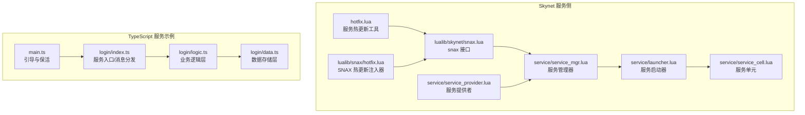
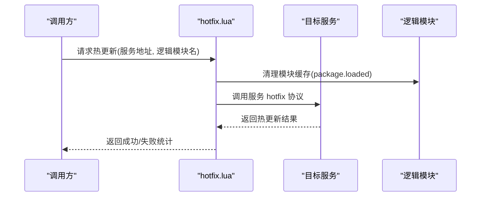
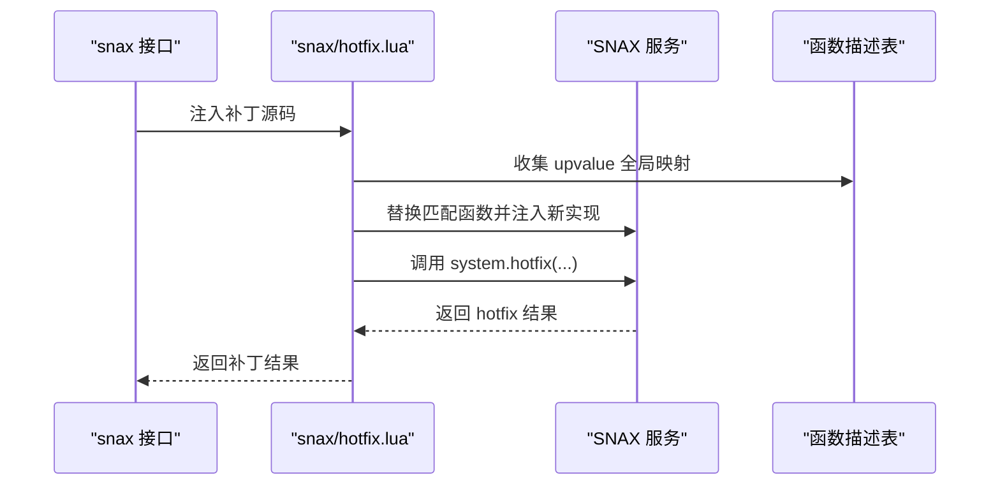
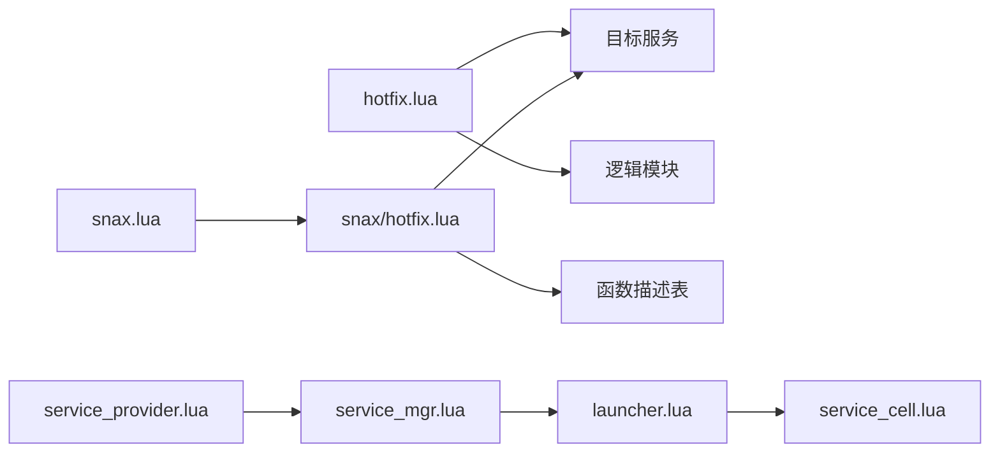

# 热更新机制

<cite>
**本文引用的文件**
- [hotfix.lua](file://docker/skynet/service/hotfix.lua)
- [hotfix.lua](file://docker/skynet/lualib/snax/hotfix.lua)
- [snax.lua](file://docker/skynet/lualib/skynet/snax.lua)
- [launcher.lua](file://docker/skynet/service/launcher.lua)
- [service_mgr.lua](file://docker/skynet/service/service_mgr.lua)
- [service_provider.lua](file://docker/skynet/service/service_provider.lua)
- [service_cell.lua](file://docker/skynet/service/service_cell.lua)
- [injectlaunch.lua](file://docker/skynet/examples/injectlaunch.lua)
- [testping.lua](file://docker/skynet/test/testping.lua)
- [index.ts](file://server/src/app/services/login/index.ts)
- [logic.ts](file://server/src/app/services/login/logic.ts)
- [data.ts](file://server/src/app/services/login/data.ts)
- [main.ts](file://server/src/app/main.ts)
</cite>

## 目录
1. [引言](#引言)
2. [项目结构](#项目结构)
3. [核心组件](#核心组件)
4. [架构总览](#架构总览)
5. [详细组件分析](#详细组件分析)
6. [依赖关系分析](#依赖关系分析)
7. [性能考量](#性能考量)
8. [故障排除指南](#故障排除指南)
9. [结论](#结论)
10. [附录](#附录)

## 引言
本技术文档系统性阐述 Skynet 框架在 TypeScript-to-Lua 场景下的热更新机制，覆盖服务热更新的触发条件、执行流程、回滚策略、配置要点、对业务逻辑的影响与注意事项、最佳实践与常见陷阱，以及与服务生命周期管理的关系。文档基于仓库中现有的热更新工具、服务管理器、服务提供者、启动器与示例代码进行深入分析，并结合 TypeScript 侧的服务组织模式给出可操作的实践建议。

## 项目结构
围绕热更新的关键代码分布在以下位置：
- Skynet 服务侧热更新工具与接口：docker/skynet/service/hotfix.lua、docker/skynet/lualib/snax/hotfix.lua、docker/skynet/lualib/skynet/snax.lua
- 服务生命周期与管理：docker/skynet/service/launcher.lua、docker/skynet/service/service_mgr.lua、docker/skynet/service/service_provider.lua、docker/skynet/service/service_cell.lua
- 示例与注入：docker/skynet/examples/injectlaunch.lua、docker/skynet/test/testping.lua
- TypeScript 服务示例：server/src/app/services/login/*.ts 及 server/src/app/main.ts

**图表来源**
- [hotfix.lua:1-72](file://docker/skynet/service/hotfix.lua#L1-L72)
- [hotfix.lua:1-119](file://docker/skynet/lualib/snax/hotfix.lua#L1-L119)
- [snax.lua:121-166](file://docker/skynet/lualib/skynet/snax.lua#L121-L166)
- [launcher.lua:1-186](file://docker/skynet/service/launcher.lua#L1-L186)
- [service_mgr.lua:1-229](file://docker/skynet/service/service_mgr.lua#L1-L229)
- [service_provider.lua:1-127](file://docker/skynet/service/service_provider.lua#L1-L127)
- [service_cell.lua:1-25](file://docker/skynet/service/service_cell.lua#L1-L25)
- [index.ts:123-154](file://server/src/app/services/login/index.ts#L123-L154)
- [logic.ts:1-48](file://server/src/app/services/login/logic.ts#L1-L48)
- [data.ts:1-127](file://server/src/app/services/login/data.ts#L1-L127)
- [main.ts:89-105](file://server/src/app/main.ts#L89-L105)

**章节来源**
- [hotfix.lua:1-72](file://docker/skynet/service/hotfix.lua#L1-L72)
- [launcher.lua:1-186](file://docker/skynet/service/launcher.lua#L1-L186)
- [service_mgr.lua:1-229](file://docker/skynet/service/service_mgr.lua#L1-L229)
- [service_provider.lua:1-127](file://docker/skynet/service/service_provider.lua#L1-L127)
- [service_cell.lua:1-25](file://docker/skynet/service/service_cell.lua#L1-L25)
- [index.ts:123-154](file://server/src/app/services/login/index.ts#L123-L154)
- [logic.ts:1-48](file://server/src/app/services/login/logic.ts#L1-L48)
- [data.ts:1-127](file://server/src/app/services/login/data.ts#L1-L127)
- [main.ts:89-105](file://server/src/app/main.ts#L89-L105)

## 核心组件
- 热更新工具（服务侧）：提供模块缓存清理、模块重载、服务热更新与批量热更新能力，用于在不中断其他服务的前提下替换逻辑模块。
- SNAX 热更新注入器：通过 upvalue 收集与函数替换实现对 SNAX 服务的在线补丁，支持在运行时注入新代码并调用 system.hotfix。
- snax 接口：封装了 snax.hotfix 调用，作为上层调用入口。
- 服务生命周期与管理：launcher 负责服务实例的创建、状态跟踪与回收；service_mgr 提供本地/全局服务查询与列表；service_provider 提供服务启动与初始化队列；service_cell 承载具体服务的初始化与启动回调。
- TypeScript 服务示例：login 服务展示了消息分发、状态导出/导入、保活机制与异步清理任务，体现热更新对业务层的友好设计。

**章节来源**
- [hotfix.lua:10-71](file://docker/skynet/service/hotfix.lua#L10-L71)
- [hotfix.lua:17-118](file://docker/skynet/lualib/snax/hotfix.lua#L17-L118)
- [snax.lua:152-155](file://docker/skynet/lualib/skynet/snax.lua#L152-L155)
- [launcher.lua:93-153](file://docker/skynet/service/launcher.lua#L93-L153)
- [service_mgr.lua:78-96](file://docker/skynet/service/service_mgr.lua#L78-L96)
- [service_provider.lua:42-92](file://docker/skynet/service/service_provider.lua#L42-L92)
- [service_cell.lua:6-18](file://docker/skynet/service/service_cell.lua#L6-L18)
- [index.ts:123-154](file://server/src/app/services/login/index.ts#L123-L154)
- [data.ts:107-127](file://server/src/app/services/login/data.ts#L107-L127)

## 架构总览
热更新在 Skynet 中通过“模块缓存清理 + 服务内部 hotfix 协议”的组合实现。对于 SNAX 服务，采用 upvalue 收集与函数替换的方式进行在线补丁。

**图表来源**
- [hotfix.lua:35-51](file://docker/skynet/service/hotfix.lua#L35-L51)

**图表来源**
- [snax.lua:152-155](file://docker/skynet/lualib/skynet/snax.lua#L152-L155)
- [hotfix.lua:99-114](file://docker/skynet/lualib/snax/hotfix.lua#L99-L114)

## 详细组件分析

### 组件一：服务热更新工具（hotfix.lua）
- 功能要点
  - 模块缓存清理：通过清除 package.loaded 对应键，强制下次 require 重新加载。
  - 模块重载：包装 pcall(require, module_name)，返回重载结果与错误信息。
  - 服务热更新：向目标服务发送 "hotfix" 协议调用，等待服务内部完成状态迁移与逻辑替换。
  - 批量热更新：遍历服务列表逐个执行热更新，并汇总统计结果。

- 关键流程
  1) 清理逻辑模块缓存
  2) 调用服务 "hotfix" 协议
  3) 记录日志并返回结果
  4) 批量场景统计成功/失败数

- 适用范围
  - 适用于 Skynet Lua 服务，特别是通过 service_cell 启动的脚本型服务。
  - 对于 SNAX 服务，推荐使用 snax.hotfix 与 snax/hotfix.lua 的在线补丁方案。

**章节来源**
- [hotfix.lua:10-71](file://docker/skynet/service/hotfix.lua#L10-L71)

### 组件二：SNAX 热更新注入器（lualib/snax/hotfix.lua）
- 功能要点
  - upvalue 收集：递归收集函数及其闭包环境，建立全局 upvalue 映射。
  - 函数替换：将补丁中的同名函数替换到原函数描述表中，并通过 debug.upvaluejoin 维持原有闭包绑定。
  - system.hotfix 调用：若补丁定义了 system.hotfix，则在注入后执行该函数并返回结果。

- 适用范围
  - 专用于 SNAX 服务的在线热补丁，适合需要在不重启服务的情况下快速修复逻辑。

**章节来源**
- [hotfix.lua:17-118](file://docker/skynet/lualib/snax/hotfix.lua#L17-L118)

### 组件三：snax 接口（lualib/skynet/snax.lua）
- 功能要点
  - 封装 snax.hotfix(obj, source, ...)，统一调用路径。
  - 通过 snax.interface 获取服务接口描述，确保函数组与名称匹配。

- 与热更新的关系
  - 作为上层调用入口，配合 snax/hotfix.lua 实现在线补丁。

**章节来源**
- [snax.lua:152-155](file://docker/skynet/lualib/skynet/snax.lua#L152-L155)

### 组件四：服务生命周期与管理
- launcher.lua
  - 负责服务实例的创建、状态跟踪（LAUNCH/LAUNCHOK/ERROR）、内存与统计查询、GC 触发、KILL 等。
  - 提供 LOGLAUNCH 等命令用于调试与日志输出。

- service_mgr.lua
  - 提供本地与全局服务查询（QUERY/GQUERY）、服务列表（LIST）、远程服务转发等。
  - 为 .service 与 SERVICE 服务注册与通信提供支撑。

- service_provider.lua
  - 以服务名为键维护启动队列、启动状态与错误信息，支持并发启动的排队与响应。

- service_cell.lua
  - 承载服务初始化：接收 init(code, ...)，执行服务主函数并调用 skynet.start 回调。

- 示例与注入
  - injectlaunch.lua 展示如何通过 debug_console 的 inject 命令对 launcher 的命令进行替换。
  - testping.lua 展示了对 SNAX 服务进行在线热补丁的完整流程。

**章节来源**
- [launcher.lua:93-153](file://docker/skynet/service/launcher.lua#L93-L153)
- [service_mgr.lua:78-96](file://docker/skynet/service/service_mgr.lua#L78-L96)
- [service_provider.lua:42-92](file://docker/skynet/service/service_provider.lua#L42-L92)
- [service_cell.lua:6-18](file://docker/skynet/service/service_cell.lua#L6-L18)
- [injectlaunch.lua:1-19](file://docker/skynet/examples/injectlaunch.lua#L1-L19)
- [testping.lua:10-26](file://docker/skynet/test/testping.lua#L10-L26)

### 组件五：TypeScript 服务示例与热更新适配
- login/index.ts
  - 服务入口：注册消息分发器，启动异步清理任务，保持服务常驻（keep-alive）。
  - 通过 runtime.service.start 启动，start 回调必须为同步函数，内部再启动异步引导流程。

- login/logic.ts
  - 业务逻辑层：不持有状态，通过依赖注入的数据层进行读写，天然支持热更新。

- login/data.ts
  - 数据存储层：不热更新，负责状态持久化；提供 exportState/importState 以便热更新时进行状态迁移。

- main.ts
  - 引导与保活：启动所有服务并在主服务中维持常驻协程，避免因 Promise 回调导致的协程问题。

- 热更新影响与注意事项
  - 业务逻辑层可热更新，数据层保持不变，需通过状态导出/导入实现迁移。
  - 服务保活机制保证热更新期间消息处理不中断。
  - start 回调必须同步，避免异步错误导致服务退出。

**章节来源**
- [index.ts:123-154](file://server/src/app/services/login/index.ts#L123-L154)
- [logic.ts:1-48](file://server/src/app/services/login/logic.ts#L1-L48)
- [data.ts:107-127](file://server/src/app/services/login/data.ts#L107-L127)
- [main.ts:89-105](file://server/src/app/main.ts#L89-L105)

## 依赖关系分析
热更新相关组件之间的依赖关系如下：

**图表来源**
- [hotfix.lua:35-51](file://docker/skynet/service/hotfix.lua#L35-L51)
- [snax.lua:152-155](file://docker/skynet/lualib/skynet/snax.lua#L152-L155)
- [hotfix.lua:99-114](file://docker/skynet/lualib/snax/hotfix.lua#L99-L114)
- [launcher.lua:93-153](file://docker/skynet/service/launcher.lua#L93-L153)
- [service_cell.lua:6-18](file://docker/skynet/service/service_cell.lua#L6-L18)
- [service_mgr.lua:78-96](file://docker/skynet/service/service_mgr.lua#L78-L96)
- [service_provider.lua:42-92](file://docker/skynet/service/service_provider.lua#L42-L92)

**章节来源**
- [hotfix.lua:35-51](file://docker/skynet/service/hotfix.lua#L35-L51)
- [snax.lua:152-155](file://docker/skynet/lualib/skynet/snax.lua#L152-L155)
- [hotfix.lua:99-114](file://docker/skynet/lualib/snax/hotfix.lua#L99-L114)
- [launcher.lua:93-153](file://docker/skynet/service/launcher.lua#L93-L153)
- [service_cell.lua:6-18](file://docker/skynet/service/service_cell.lua#L6-L18)
- [service_mgr.lua:78-96](file://docker/skynet/service/service_mgr.lua#L78-L96)
- [service_provider.lua:42-92](file://docker/skynet/service/service_provider.lua#L42-L92)

## 性能考量
- 模块缓存清理与重载的成本：频繁热更新会增加 require 开销，建议在低峰时段执行或合并多次变更。
- SNAX 在线补丁的 upvalue 收集与函数替换：对大体量闭包的递归扫描存在 CPU 成本，应控制补丁规模。
- 服务保活与消息处理：保持服务常驻的协程开销较小，但需避免在热更新期间产生大量并发请求导致阻塞。
- 内存与 GC：热更新后建议触发 GC 并观察内存变化，确保无泄漏。

## 故障排除指南
- 热更新失败
  - 检查服务是否正确实现 "hotfix" 协议处理逻辑。
  - 确认逻辑模块名与缓存键一致，避免拼写错误。
  - 查看服务日志，定位 require 重载阶段的错误。

- SNAX 补丁不生效
  - 确认补丁源码中的函数组与名称与服务接口描述一致。
  - 检查 upvalue 收集是否覆盖到关键闭包变量。
  - 验证 system.hotfix 是否被正确调用并返回预期结果。

- 服务启动异常
  - 检查 launcher 的 ERROR/LAUNCHOK 流程，确认服务初始化回调是否抛错。
  - 使用 service_mgr 的 LIST/QUERY 确认服务状态与地址映射。

- 状态丢失或不一致
  - 确保数据层提供 exportState/importState，并在热更新前后正确迁移。
  - 避免在热更新期间对共享状态进行竞态写入。

**章节来源**
- [hotfix.lua:24-28](file://docker/skynet/service/hotfix.lua#L24-L28)
- [hotfix.lua:93-97](file://docker/skynet/lualib/snax/hotfix.lua#L93-L97)
- [launcher.lua:122-145](file://docker/skynet/service/launcher.lua#L122-L145)
- [service_mgr.lua:98-131](file://docker/skynet/service/service_mgr.lua#L98-L131)
- [data.ts:107-127](file://server/src/app/services/login/data.ts#L107-L127)

## 结论
Skynet 的热更新机制通过“模块缓存清理 + 服务内部 hotfix 协议”和“SNAX 在线补丁注入器”两种路径，实现了对 Lua 服务的无感升级。结合 TypeScript 侧的业务/数据分离与状态导出/导入，可在不中断服务运行的情况下安全地演进逻辑。实践中应关注模块重载成本、补丁规模与状态迁移策略，并通过服务管理器与启动器提供的诊断能力进行监控与排障。

## 附录

### 热更新配置与限制
- 支持热更新的服务类型
  - Lua 脚本型服务（通过 service_cell 启动），可通过 hotfix.lua 的服务热更新流程。
  - SNAX 服务，可通过 snax.hotfix 与 snax/hotfix.lua 的在线补丁流程。

- 不支持热更新的服务类型
  - C 语言服务（如 service-src 中的 C 服务），需通过重启服务实现更新。

- 热更新限制与约束
  - 逻辑模块必须可被 require 且模块名唯一。
  - SNAX 补丁要求函数组与名称与服务接口描述严格匹配。
  - 服务必须实现 "hotfix" 协议处理逻辑，或使用 SNAX 的 system.hotfix。
  - 避免在热更新期间对共享状态进行竞态写入。

**章节来源**
- [hotfix.lua:35-51](file://docker/skynet/service/hotfix.lua#L35-L51)
- [hotfix.lua:93-97](file://docker/skynet/lualib/snax/hotfix.lua#L93-L97)
- [service_cell.lua:6-18](file://docker/skynet/service/service_cell.lua#L6-L18)

### 触发条件与执行流程
- 触发条件
  - 代码变更完成并通过构建流程生成新的 Lua 模块。
  - 业务需要快速修复线上问题或迭代逻辑。

- 执行流程
  - 服务热更新：清理模块缓存 → 通知服务 hotfix → 统计结果。
  - SNAX 热更新：解析补丁源码 → 收集 upvalue → 替换函数 → 调用 system.hotfix → 返回结果。

**章节来源**
- [hotfix.lua:35-51](file://docker/skynet/service/hotfix.lua#L35-L51)
- [hotfix.lua:99-114](file://docker/skynet/lualib/snax/hotfix.lua#L99-L114)

### 回滚机制
- 建议策略
  - 在热更新前导出当前状态（exportState），记录版本号。
  - 若热更新失败，通过导入旧状态（importState）恢复。
  - 对于 SNAX 补丁，保留补丁源码的备份以便快速回退。

**章节来源**
- [data.ts:107-127](file://server/src/app/services/login/data.ts#L107-L127)

### 最佳实践与常见陷阱
- 最佳实践
  - 将业务逻辑与数据存储分离，业务层支持热更新，数据层保持稳定。
  - 使用状态导出/导入实现平滑迁移，避免状态丢失。
  - 在低峰时段执行热更新，减少对在线用户的影响。
  - 对补丁进行充分测试，优先在预生产环境验证。

- 常见陷阱
  - 忘记清理模块缓存导致热更新无效。
  - SNAX 补丁函数组/名称不匹配导致注入失败。
  - 在热更新期间对共享状态进行竞态写入。
  - 未实现 "hotfix" 协议或 system.hotfix 导致回滚困难。

**章节来源**
- [hotfix.lua:10-32](file://docker/skynet/service/hotfix.lua#L10-L32)
- [hotfix.lua:93-97](file://docker/skynet/lualib/snax/hotfix.lua#L93-L97)
- [data.ts:107-127](file://server/src/app/services/login/data.ts#L107-L127)

### 实际操作示例
- 服务热更新（Lua 脚本型服务）
  - 步骤：清理模块缓存 → 调用服务 hotfix 协议 → 统计结果。
  - 参考：hotfix.lua 的服务热更新与批量热更新函数。

- SNAX 在线补丁
  - 步骤：准备补丁源码 → 调用 snax.hotfix → 验证 system.hotfix 返回值。
  - 参考：snax.lua 的 hotfix 封装与 snax/hotfix.lua 的注入流程。

- 启动器注入示例
  - 通过 debug_console 的 inject 命令对 launcher 的命令进行替换，便于演示热更新流程。
  - 参考：injectlaunch.lua。

**章节来源**
- [hotfix.lua:54-69](file://docker/skynet/service/hotfix.lua#L54-L69)
- [snax.lua:152-155](file://docker/skynet/lualib/skynet/snax.lua#L152-L155)
- [hotfix.lua:99-114](file://docker/skynet/lualib/snax/hotfix.lua#L99-L114)
- [injectlaunch.lua:1-19](file://docker/skynet/examples/injectlaunch.lua#L1-L19)

### 与服务生命周期管理的关系
- 启动阶段：launcher.lua 负责服务实例创建与状态跟踪，service_cell.lua 承载初始化回调。
- 运行阶段：service_mgr.lua 提供查询与列表功能，便于热更新前后的状态核对。
- 终止阶段：launcher.lua 的 KILL 命令用于强制终止异常服务，service_provider.lua 的 close 用于释放资源。

**章节来源**
- [launcher.lua:93-153](file://docker/skynet/service/launcher.lua#L93-L153)
- [service_cell.lua:6-18](file://docker/skynet/service/service_cell.lua#L6-L18)
- [service_mgr.lua:98-131](file://docker/skynet/service/service_mgr.lua#L98-L131)
- [service_provider.lua:94-102](file://docker/skynet/service/service_provider.lua#L94-L102)