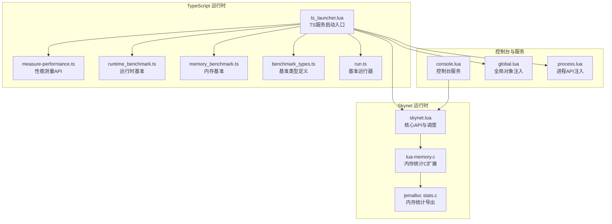
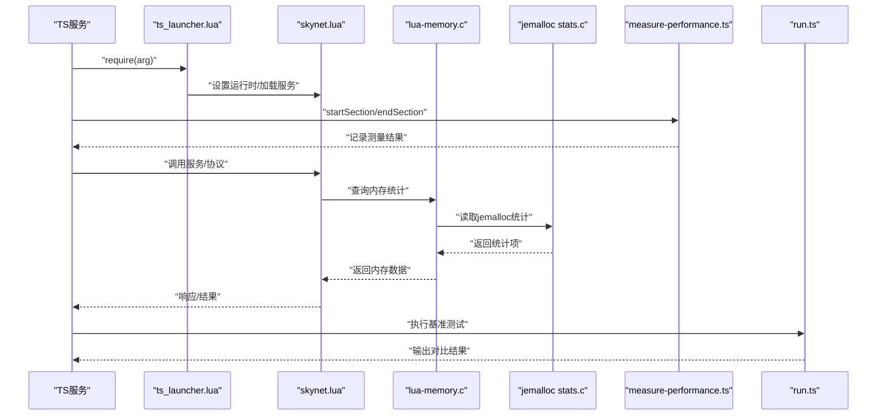
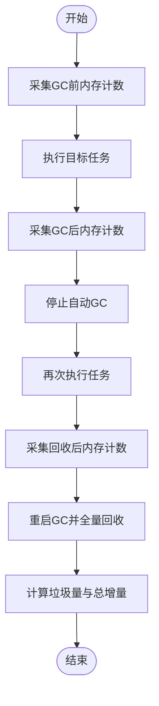
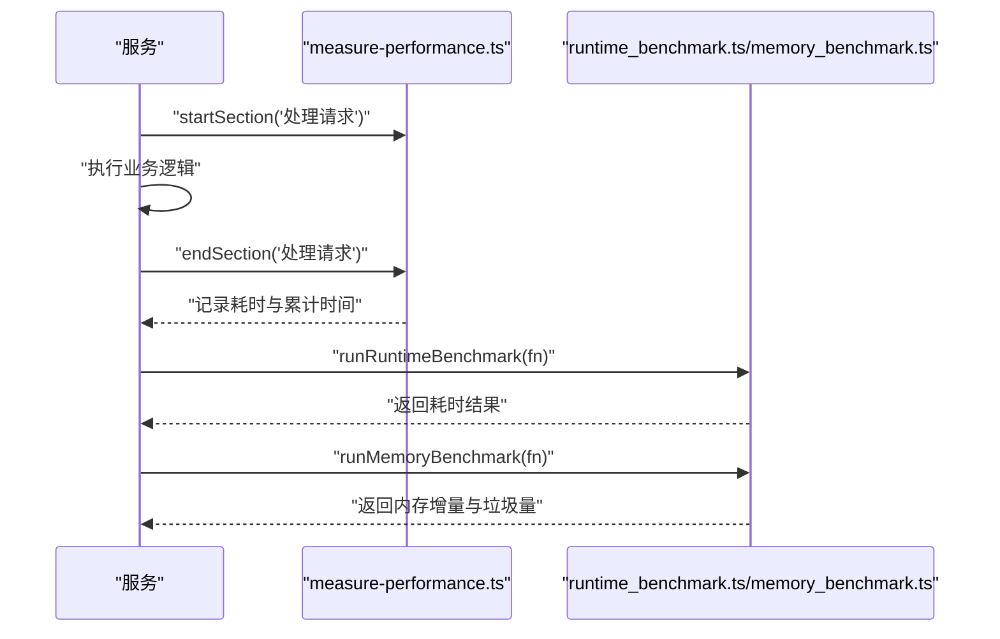
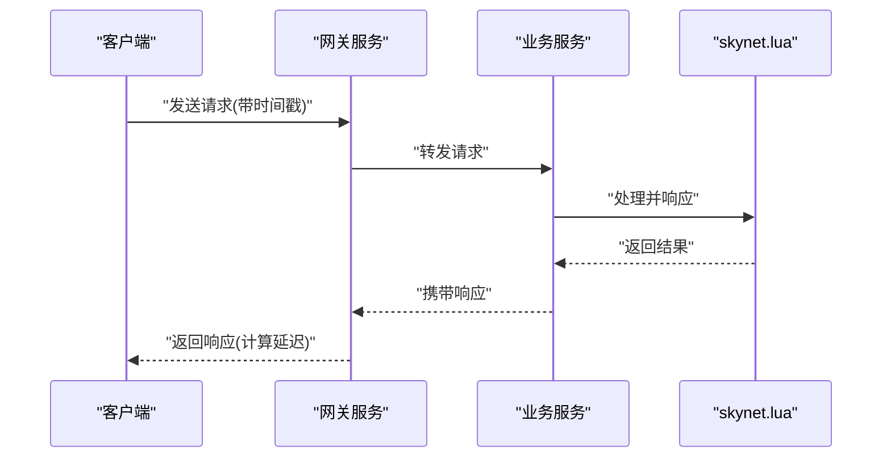
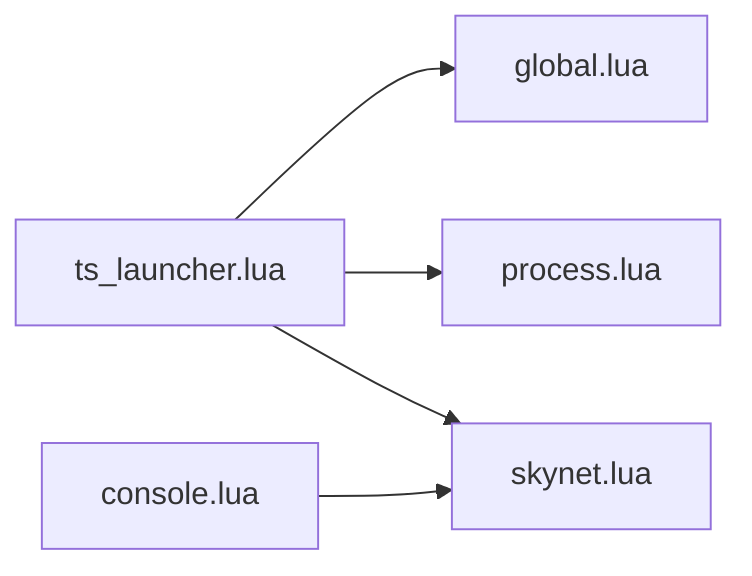
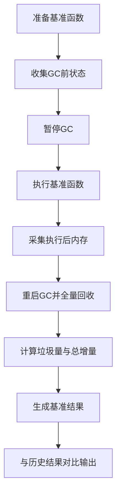
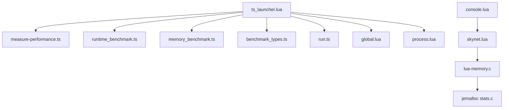

# 性能监控

<cite>
**本文引用的文件**   
- [docker\skynet\lualib\skynet.lua](file://docker/skynet/lualib/skynet.lua)
- [docker\skynet\lualib-src\lua-memory.c](file://docker/skynet/lualib-src/lua-memory.c)
- [docker\skynet\service\console.lua](file://docker/skynet/service/console.lua)
- [docker\native\ts_launcher.lua](file://docker/native/ts_launcher.lua)
- [docker\native\process.lua](file://docker/native/process.lua)
- [docker\native\global.lua](file://docker/native/global.lua)
- [tool\TypeScriptToLua_skynet\src\measure-performance.ts](file://tool/TypeScriptToLua_skynet/src/measure-performance.ts)
- [tool\TypeScriptToLua_skynet\benchmark\src\benchmark_types.ts](file://tool/TypeScriptToLua_skynet/benchmark/src/benchmark_types.ts)
- [tool\TypeScriptToLua_skynet\benchmark\src\runtime_benchmark.ts](file://tool/TypeScriptToLua_skynet/benchmark/src/runtime_benchmark.ts)
- [tool\TypeScriptToLua_skynet\benchmark\src\memory_benchmark.ts](file://tool/TypeScriptToLua_skynet/benchmark/src/memory_benchmark.ts)
- [tool\TypeScriptToLua_skynet\benchmark\src\run.ts](file://tool/TypeScriptToLua_skynet/benchmark/src/run.ts)
- [docker\skynet\3rd\jemalloc\src\stats.c](file://docker/skynet/3rd/jemalloc/src/stats.c)
- [docker\skynet\3rd\jemalloc\bin\jeprof.in](file://docker/skynet/3rd/jemalloc/bin/jeprof.in)
</cite>

## 目录
1. [简介](#简介)
2. [项目结构](#项目结构)
3. [核心组件](#核心组件)
4. [架构总览](#架构总览)
5. [详细组件分析](#详细组件分析)
6. [依赖关系分析](#依赖关系分析)
7. [性能考量](#性能考量)
8. [故障排查指南](#故障排查指南)
9. [结论](#结论)
10. [附录](#附录)

## 简介
本指南面向在 Skynet 环境下进行性能监控与优化的工程团队，覆盖内存使用监控、CPU 性能分析、网络延迟测量、Skynet 内置工具与 API 使用、TypeScriptToLua 转译后的性能特征与优化策略、性能基准测试方法与工具使用，并提供生产环境持续监控与优化实践建议。文档以仓库中的现有实现为基础，结合 Skynet 的内存统计接口、性能测量工具与基准测试框架，帮助读者建立系统化的性能保障体系。

## 项目结构
围绕性能监控的关键路径包括：
- Skynet 核心与内存统计：Lua 层通过 C 扩展暴露内存统计能力，供服务侧查询与诊断。
- TypeScriptToLua 性能测量与基准测试：提供跨语言的性能测量 API 与基准测试运行器。
- 启动与运行时注入：TS 子服务启动时注入全局对象与运行时适配器，便于统一的性能观测。
- 控制台与服务交互：控制台服务用于动态加载与调试服务，便于在运行时进行性能采样与验证。

**图示来源**
- [docker\skynet\lualib\skynet.lua:1-120](file://docker/skynet/lualib/skynet.lua#L1-L120)
- [docker\skynet\lualib-src\lua-memory.c:1-117](file://docker/skynet/lualib-src/lua-memory.c#L1-L117)
- [docker\skynet\3rd\jemalloc\src\stats.c:696-727](file://docker/skynet/3rd/jemalloc/src/stats.c#L696-L727)
- [docker\native\ts_launcher.lua:1-26](file://docker/native/ts_launcher.lua#L1-L26)
- [tool\TypeScriptToLua_skynet\src\measure-performance.ts:1-84](file://tool/TypeScriptToLua_skynet/src/measure-performance.ts#L1-L84)
- [tool\TypeScriptToLua_skynet\benchmark\src\runtime_benchmark.ts:1-44](file://tool/TypeScriptToLua_skynet/benchmark/src/runtime_benchmark.ts#L1-L44)
- [tool\TypeScriptToLua_skynet\benchmark\src\memory_benchmark.ts:1-72](file://tool/TypeScriptToLua_skynet/benchmark/src/memory_benchmark.ts#L1-L72)
- [tool\TypeScriptToLua_skynet\benchmark\src\benchmark_types.ts:1-38](file://tool/TypeScriptToLua_skynet/benchmark/src/benchmark_types.ts#L1-L38)
- [tool\TypeScriptToLua_skynet\benchmark\src\run.ts:31-65](file://tool/TypeScriptToLua_skynet/benchmark/src/run.ts#L31-L65)
- [docker\skynet\service\console.lua:1-30](file://docker/skynet/service/console.lua#L1-L30)
- [docker\native\global.lua:1-9](file://docker/native/global.lua#L1-L9)
- [docker\native\process.lua:1-65](file://docker/native/process.lua#L1-L65)

**章节来源**
- [docker\skynet\lualib\skynet.lua:1-120](file://docker/skynet/lualib/skynet.lua#L1-L120)
- [docker\skynet\lualib-src\lua-memory.c:1-117](file://docker/skynet/lualib-src/lua-memory.c#L1-L117)
- [docker\native\ts_launcher.lua:1-26](file://docker/native/ts_launcher.lua#L1-L26)
- [tool\TypeScriptToLua_skynet\src\measure-performance.ts:1-84](file://tool/TypeScriptToLua_skynet/src/measure-performance.ts#L1-L84)
- [tool\TypeScriptToLua_skynet\benchmark\src\benchmark_types.ts:1-38](file://tool/TypeScriptToLua_skynet/benchmark/src/benchmark_types.ts#L1-L38)
- [tool\TypeScriptToLua_skynet\benchmark\src\runtime_benchmark.ts:1-44](file://tool/TypeScriptToLua_skynet/benchmark/src/runtime_benchmark.ts#L1-L44)
- [tool\TypeScriptToLua_skynet\benchmark\src\memory_benchmark.ts:1-72](file://tool/TypeScriptToLua_skynet/benchmark/src/memory_benchmark.ts#L1-L72)
- [tool\TypeScriptToLua_skynet\benchmark\src\run.ts:31-65](file://tool/TypeScriptToLua_skynet/benchmark/src/run.ts#L31-L65)
- [docker\skynet\service\console.lua:1-30](file://docker/skynet/service/console.lua#L1-L30)
- [docker\native\global.lua:1-9](file://docker/native/global.lua#L1-L9)
- [docker\native\process.lua:1-65](file://docker/native/process.lua#L1-L65)

## 核心组件
- Skynet 内存统计与诊断
  - 通过 C 扩展提供内存总量、当前使用量、堆栈信息导出、jemalloc 统计项查询等能力，便于在服务内或控制台进行内存诊断。
- TypeScriptToLua 性能测量
  - 提供基于浏览器性能 API 的封装，支持标记与测量、启用/禁用、遍历与汇总，便于在 TS 代码中进行细粒度性能采样。
- 基准测试框架
  - 支持运行时与内存两类基准，提供对比输出与 JSON 结果，便于版本间回归对比。
- TS 服务启动与运行时注入
  - 启动入口负责注入全局对象与运行时适配器，确保 TS 服务在 Skynet 环境中具备一致的性能观测能力。
- 控制台服务
  - 提供交互式服务加载与调试入口，便于在运行时快速验证性能改动与问题定位。

**章节来源**
- [docker\skynet\lualib-src\lua-memory.c:1-117](file://docker/skynet/lualib-src/lua-memory.c#L1-L117)
- [tool\TypeScriptToLua_skynet\src\measure-performance.ts:1-84](file://tool/TypeScriptToLua_skynet/src/measure-performance.ts#L1-L84)
- [tool\TypeScriptToLua_skynet\benchmark\src\runtime_benchmark.ts:1-44](file://tool/TypeScriptToLua_skynet/benchmark/src/runtime_benchmark.ts#L1-L44)
- [tool\TypeScriptToLua_skynet\benchmark\src\memory_benchmark.ts:1-72](file://tool/TypeScriptToLua_skynet/benchmark/src/memory_benchmark.ts#L1-L72)
- [docker\native\ts_launcher.lua:1-26](file://docker/native/ts_launcher.lua#L1-L26)
- [docker\skynet\service\console.lua:1-30](file://docker/skynet/service/console.lua#L1-L30)

## 架构总览
下图展示从 TS 服务到 Skynet 核心与内存统计的调用链路，以及基准测试与性能测量在整体架构中的位置。

**图示来源**
- [docker\native\ts_launcher.lua:1-26](file://docker/native/ts_launcher.lua#L1-L26)
- [docker\skynet\lualib\skynet.lua:1-120](file://docker/skynet/lualib/skynet.lua#L1-L120)
- [docker\skynet\lualib-src\lua-memory.c:1-117](file://docker/skynet/lualib-src/lua-memory.c#L1-L117)
- [docker\skynet\3rd\jemalloc\src\stats.c:696-727](file://docker/skynet/3rd/jemalloc/src/stats.c#L696-L727)
- [tool\TypeScriptToLua_skynet\src\measure-performance.ts:1-84](file://tool/TypeScriptToLua_skynet/src/measure-performance.ts#L1-L84)
- [tool\TypeScriptToLua_skynet\benchmark\src\run.ts:31-65](file://tool/TypeScriptToLua_skynet/benchmark/src/run.ts#L31-L65)

## 详细组件分析

### 内存使用监控
- Skynet 内存统计接口
  - 提供总内存、当前内存、块数、jemalloc 统计项查询、堆栈信息导出、剖析开关与触发等能力，便于在服务内或控制台进行内存诊断。
- jemalloc 统计导出
  - 在内存统计模块中导出多项 jemalloc 统计指标，可用于更深入的内存分配行为分析。
- 实践要点
  - 在关键路径前后采集内存快照，结合 GC 行为与对象生命周期评估内存峰值与泄漏风险。
  - 利用堆栈信息导出与剖析工具对热点路径进行定位。

**图示来源**
- [tool\TypeScriptToLua_skynet\benchmark\src\memory_benchmark.ts:1-72](file://tool/TypeScriptToLua_skynet/benchmark/src/memory_benchmark.ts#L1-L72)
- [docker\skynet\lualib-src\lua-memory.c:1-117](file://docker/skynet/lualib-src/lua-memory.c#L1-L117)
- [docker\skynet\3rd\jemalloc\src\stats.c:696-727](file://docker/skynet/3rd/jemalloc/src/stats.c#L696-L727)

**章节来源**
- [docker\skynet\lualib-src\lua-memory.c:1-117](file://docker/skynet/lualib-src/lua-memory.c#L1-L117)
- [docker\skynet\3rd\jemalloc\src\stats.c:696-727](file://docker/skynet/3rd/jemalloc/src/stats.c#L696-L727)
- [tool\TypeScriptToLua_skynet\benchmark\src\memory_benchmark.ts:1-72](file://tool/TypeScriptToLua_skynet/benchmark/src/memory_benchmark.ts#L1-L72)

### CPU 性能分析
- 性能测量 API
  - 提供 startSection/endSection 与 measure/mark 能力，支持启用/禁用、遍历与总耗时统计，便于在 TS 代码中进行细粒度性能采样。
- 基准测试
  - 运行时基准使用高精度计时器进行任务耗时统计；内存基准通过暂停 GC、前后计数差值计算垃圾量与总增量。
- 实践要点
  - 在协议处理、序列化/反序列化、数据库/缓存调用等关键路径使用性能测量 API 进行打点。
  - 使用基准测试框架对比不同版本或配置下的性能变化，形成回归基线。

**图示来源**
- [tool\TypeScriptToLua_skynet\src\measure-performance.ts:1-84](file://tool/TypeScriptToLua_skynet/src/measure-performance.ts#L1-L84)
- [tool\TypeScriptToLua_skynet\benchmark\src\runtime_benchmark.ts:1-44](file://tool/TypeScriptToLua_skynet/benchmark/src/runtime_benchmark.ts#L1-L44)
- [tool\TypeScriptToLua_skynet\benchmark\src\memory_benchmark.ts:1-72](file://tool/TypeScriptToLua_skynet/benchmark/src/memory_benchmark.ts#L1-L72)

**章节来源**
- [tool\TypeScriptToLua_skynet\src\measure-performance.ts:1-84](file://tool/TypeScriptToLua_skynet/src/measure-performance.ts#L1-L84)
- [tool\TypeScriptToLua_skynet\benchmark\src\runtime_benchmark.ts:1-44](file://tool/TypeScriptToLua_skynet/benchmark/src/runtime_benchmark.ts#L1-L44)
- [tool\TypeScriptToLua_skynet\benchmark\src\memory_benchmark.ts:1-72](file://tool/TypeScriptToLua_skynet/benchmark/src/memory_benchmark.ts#L1-L72)

### 网络延迟测量
- Skynet 时间与高精度计数
  - 提供高精度计数器与时间函数，可用于计算消息往返延迟、定时器触发延迟等。
- 实践要点
  - 在网关/协议层对请求进入与响应发出的时间戳进行记录，计算端到端延迟分布。
  - 结合服务内部 trace 能力，定位延迟热点与阻塞点。

**图示来源**
- [docker\skynet\lualib\skynet.lua:609-645](file://docker/skynet/lualib/skynet.lua#L609-L645)

**章节来源**
- [docker\skynet\lualib\skynet.lua:609-645](file://docker/skynet/lualib/skynet.lua#L609-L645)

### Skynet 内置性能监控工具与 API
- 控制台服务
  - 提供交互式服务加载与调试入口，便于在运行时进行性能采样与验证。
- 进程与全局对象注入
  - 注入 Node.js 风格的 process 与 global 对象，统一运行时 API，便于在 TS 服务中进行环境感知与退出处理。
- 启动入口
  - TS 服务启动时注入全局对象与运行时适配器，确保 TS 服务在 Skynet 环境中具备一致的性能观测能力。

**图示来源**
- [docker\native\ts_launcher.lua:1-26](file://docker/native/ts_launcher.lua#L1-L26)
- [docker\native\global.lua:1-9](file://docker/native/global.lua#L1-L9)
- [docker\native\process.lua:1-65](file://docker/native/process.lua#L1-L65)
- [docker\skynet\service\console.lua:1-30](file://docker/skynet/service/console.lua#L1-L30)

**章节来源**
- [docker\skynet\service\console.lua:1-30](file://docker/skynet/service/console.lua#L1-L30)
- [docker\native\ts_launcher.lua:1-26](file://docker/native/ts_launcher.lua#L1-L26)
- [docker\native\global.lua:1-9](file://docker/native/global.lua#L1-L9)
- [docker\native\process.lua:1-65](file://docker/native/process.lua#L1-L65)

### TypeScriptToLua 转译后的性能特征与优化策略
- 性能测量 API
  - 通过封装浏览器性能 API，提供易用的标记与测量能力，便于在 TS 代码中进行细粒度性能采样。
- 基准测试框架
  - 提供运行时与内存两类基准，支持对比输出与 JSON 结果，便于版本间回归对比。
- 优化策略
  - 在高频路径避免频繁对象创建与闭包捕获，减少 GC 压力。
  - 使用性能测量 API 对热点路径进行打点，结合内存基准定位内存增长点。
  - 利用基准测试框架形成回归基线，确保优化不会引入新的性能退化。

**章节来源**
- [tool\TypeScriptToLua_skynet\src\measure-performance.ts:1-84](file://tool/TypeScriptToLua_skynet/src/measure-performance.ts#L1-L84)
- [tool\TypeScriptToLua_skynet\benchmark\src\benchmark_types.ts:1-38](file://tool/TypeScriptToLua_skynet/benchmark/src/benchmark_types.ts#L1-L38)
- [tool\TypeScriptToLua_skynet\benchmark\src\runtime_benchmark.ts:1-44](file://tool/TypeScriptToLua_skynet/benchmark/src/runtime_benchmark.ts#L1-L44)
- [tool\TypeScriptToLua_skynet\benchmark\src\memory_benchmark.ts:1-72](file://tool/TypeScriptToLua_skynet/benchmark/src/memory_benchmark.ts#L1-L72)

### 性能基准测试方法与工具使用
- 运行时基准
  - 使用高精度计时器测量任务耗时，支持规范化 GC 行为，确保结果稳定。
- 内存基准
  - 通过暂停 GC、前后计数差值计算垃圾量与总增量，抑制 GC 对结果的影响。
- 基准运行器
  - 支持读取历史基准结果，排序比较，输出摘要与 JSON 文本，便于版本对比。

**图示来源**
- [tool\TypeScriptToLua_skynet\benchmark\src\runtime_benchmark.ts:1-44](file://tool/TypeScriptToLua_skynet/benchmark/src/runtime_benchmark.ts#L1-L44)
- [tool\TypeScriptToLua_skynet\benchmark\src\memory_benchmark.ts:1-72](file://tool/TypeScriptToLua_skynet/benchmark/src/memory_benchmark.ts#L1-L72)
- [tool\TypeScriptToLua_skynet\benchmark\src\run.ts:31-65](file://tool/TypeScriptToLua_skynet/benchmark/src/run.ts#L31-L65)

**章节来源**
- [tool\TypeScriptToLua_skynet\benchmark\src\runtime_benchmark.ts:1-44](file://tool/TypeScriptToLua_skynet/benchmark/src/runtime_benchmark.ts#L1-L44)
- [tool\TypeScriptToLua_skynet\benchmark\src\memory_benchmark.ts:1-72](file://tool/TypeScriptToLua_skynet/benchmark/src/memory_benchmark.ts#L1-L72)
- [tool\TypeScriptToLua_skynet\benchmark\src\run.ts:31-65](file://tool/TypeScriptToLua_skynet/benchmark/src/run.ts#L31-L65)

### 生产环境持续性能监控与优化
- 内存监控
  - 定期采集 jemalloc 统计与内存总量，结合 GC 行为与业务高峰时段进行对比分析。
- CPU 监控
  - 在关键路径使用性能测量 API 进行打点，形成时间分布与热点识别。
- 网络延迟
  - 在网关与协议层记录端到端延迟，结合服务 trace 能力定位瓶颈。
- 基准回归
  - 使用基准测试框架定期运行，形成基线，发现回归并及时修复。
- 工具链
  - 结合控制台服务与 TS 启动入口，实现运行时动态采样与验证。

**章节来源**
- [docker\skynet\lualib-src\lua-memory.c:1-117](file://docker/skynet/lualib-src/lua-memory.c#L1-L117)
- [tool\TypeScriptToLua_skynet\src\measure-performance.ts:1-84](file://tool/TypeScriptToLua_skynet/src/measure-performance.ts#L1-L84)
- [tool\TypeScriptToLua_skynet\benchmark\src\run.ts:31-65](file://tool/TypeScriptToLua_skynet/benchmark/src/run.ts#L31-L65)
- [docker\skynet\service\console.lua:1-30](file://docker/skynet/service/console.lua#L1-L30)
- [docker\native\ts_launcher.lua:1-26](file://docker/native/ts_launcher.lua#L1-L26)

## 依赖关系分析
- TS 服务启动依赖全局对象与运行时适配器，确保在 Skynet 环境中具备一致的性能观测能力。
- 内存统计依赖 C 扩展与 jemalloc 统计导出，提供底层内存数据。
- 基准测试依赖性能测量 API 与运行时计时器，形成稳定的对比基线。

**图示来源**
- [docker\native\ts_launcher.lua:1-26](file://docker/native/ts_launcher.lua#L1-L26)
- [tool\TypeScriptToLua_skynet\src\measure-performance.ts:1-84](file://tool/TypeScriptToLua_skynet/src/measure-performance.ts#L1-L84)
- [tool\TypeScriptToLua_skynet\benchmark\src\runtime_benchmark.ts:1-44](file://tool/TypeScriptToLua_skynet/benchmark/src/runtime_benchmark.ts#L1-L44)
- [tool\TypeScriptToLua_skynet\benchmark\src\memory_benchmark.ts:1-72](file://tool/TypeScriptToLua_skynet/benchmark/src/memory_benchmark.ts#L1-L72)
- [tool\TypeScriptToLua_skynet\benchmark\src\benchmark_types.ts:1-38](file://tool/TypeScriptToLua_skynet/benchmark/src/benchmark_types.ts#L1-L38)
- [tool\TypeScriptToLua_skynet\benchmark\src\run.ts:31-65](file://tool/TypeScriptToLua_skynet/benchmark/src/run.ts#L31-L65)
- [docker\native\global.lua:1-9](file://docker/native/global.lua#L1-L9)
- [docker\native\process.lua:1-65](file://docker/native/process.lua#L1-L65)
- [docker\skynet\lualib\skynet.lua:1-120](file://docker/skynet/lualib/skynet.lua#L1-L120)
- [docker\skynet\lualib-src\lua-memory.c:1-117](file://docker/skynet/lualib-src/lua-memory.c#L1-L117)
- [docker\skynet\3rd\jemalloc\src\stats.c:696-727](file://docker/skynet/3rd/jemalloc/src/stats.c#L696-L727)
- [docker\skynet\service\console.lua:1-30](file://docker/skynet/service/console.lua#L1-L30)

**章节来源**
- [docker\native\ts_launcher.lua:1-26](file://docker/native/ts_launcher.lua#L1-L26)
- [tool\TypeScriptToLua_skynet\src\measure-performance.ts:1-84](file://tool/TypeScriptToLua_skynet/src/measure-performance.ts#L1-L84)
- [tool\TypeScriptToLua_skynet\benchmark\src\runtime_benchmark.ts:1-44](file://tool/TypeScriptToLua_skynet/benchmark/src/runtime_benchmark.ts#L1-L44)
- [tool\TypeScriptToLua_skynet\benchmark\src\memory_benchmark.ts:1-72](file://tool/TypeScriptToLua_skynet/benchmark/src/memory_benchmark.ts#L1-L72)
- [tool\TypeScriptToLua_skynet\benchmark\src\benchmark_types.ts:1-38](file://tool/TypeScriptToLua_skynet/benchmark/src/benchmark_types.ts#L1-L38)
- [tool\TypeScriptToLua_skynet\benchmark\src\run.ts:31-65](file://tool/TypeScriptToLua_skynet/benchmark/src/run.ts#L31-L65)
- [docker\native\global.lua:1-9](file://docker/native/global.lua#L1-L9)
- [docker\native\process.lua:1-65](file://docker/native/process.lua#L1-L65)
- [docker\skynet\lualib\skynet.lua:1-120](file://docker/skynet/lualib/skynet.lua#L1-L120)
- [docker\skynet\lualib-src\lua-memory.c:1-117](file://docker/skynet/lualib-src/lua-memory.c#L1-L117)
- [docker\skynet\3rd\jemalloc\src\stats.c:696-727](file://docker/skynet/3rd/jemalloc/src/stats.c#L696-L727)
- [docker\skynet\service\console.lua:1-30](file://docker/skynet/service/console.lua#L1-L30)

## 性能考量
- 内存管理
  - 在高频路径避免临时对象创建，减少 GC 触发频率与压力。
  - 使用内存基准测试评估优化效果，关注垃圾量与总增量。
- CPU 效率
  - 使用性能测量 API 对热点路径进行打点，识别长尾与阻塞点。
  - 在协议处理与序列化/反序列化等关键路径进行优化。
- 网络延迟
  - 在网关与协议层记录端到端延迟，结合服务 trace 能力定位瓶颈。
- 基准回归
  - 定期运行基准测试，形成基线，发现回归并及时修复。

## 故障排查指南
- 内存异常
  - 使用内存统计接口与 jemalloc 统计导出定位异常增长点，结合堆栈信息与剖析工具进行根因分析。
- 性能退化
  - 使用性能测量 API 对比优化前后的关键路径耗时，结合基准测试输出进行回归分析。
- 网络延迟
  - 在网关与协议层记录时间戳，计算端到端延迟分布，结合服务 trace 能力定位瓶颈。

**章节来源**
- [docker\skynet\lualib-src\lua-memory.c:1-117](file://docker/skynet/lualib-src/lua-memory.c#L1-L117)
- [tool\TypeScriptToLua_skynet\src\measure-performance.ts:1-84](file://tool/TypeScriptToLua_skynet/src/measure-performance.ts#L1-L84)
- [tool\TypeScriptToLua_skynet\benchmark\src\run.ts:31-65](file://tool/TypeScriptToLua_skynet/benchmark/src/run.ts#L31-L65)
- [docker\skynet\lualib\skynet.lua:609-645](file://docker/skynet/lualib/skynet.lua#L609-L645)

## 结论
通过整合 Skynet 的内存统计与性能测量 API、TypeScriptToLua 的基准测试框架与 TS 启动入口，可以在开发与生产环境中构建完善的性能监控体系。建议将性能测量与基准测试纳入 CI/CD 流程，形成持续回归基线，配合内存与网络延迟监控，实现对系统性能的全周期保障。

## 附录
- jeprof 使用参考
  - 可使用 jeprof 工具解析 jemalloc 生成的剖析文件，进行热点分析与优化指导。

**章节来源**
- [docker\skynet\3rd\jemalloc\bin\jeprof.in:4035-4437](file://docker/skynet/3rd/jemalloc/bin/jeprof.in#L4035-L4437)