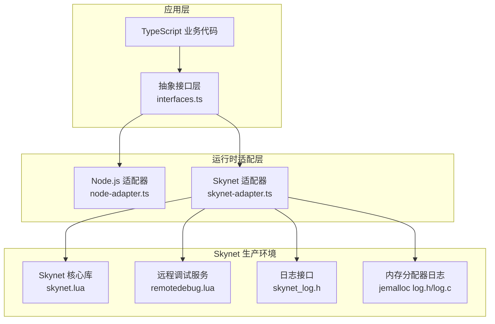
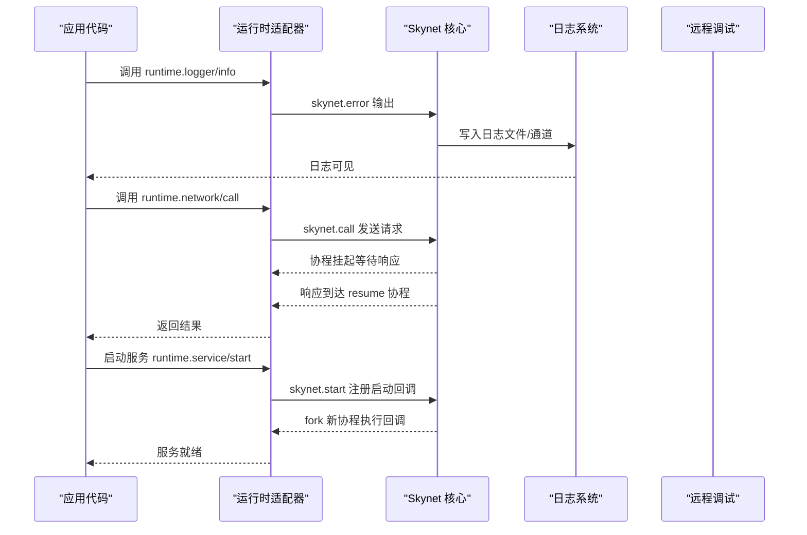
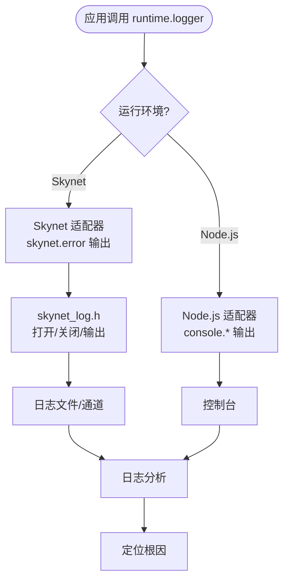
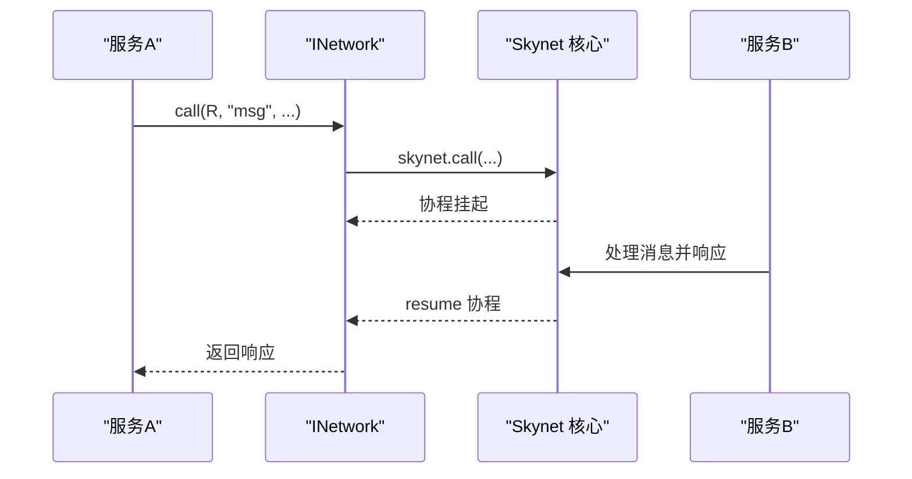
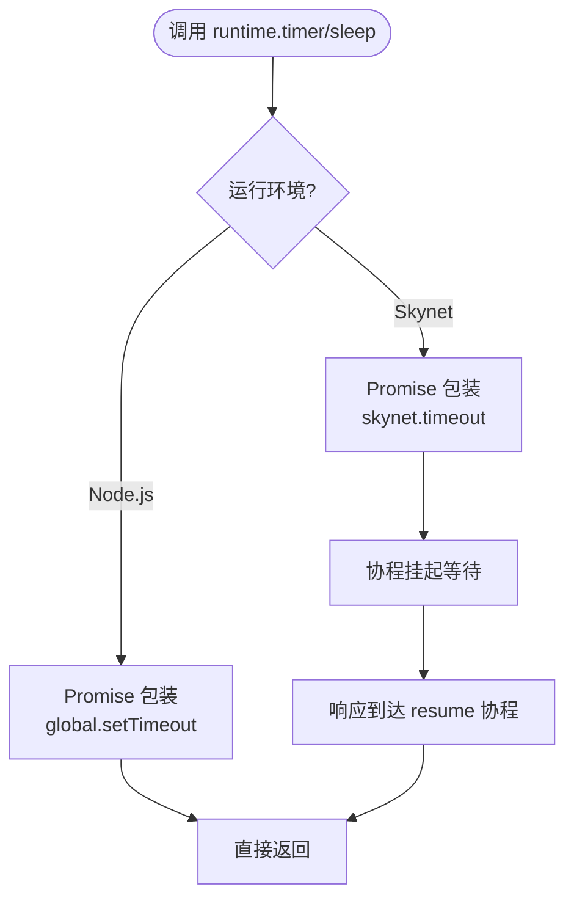
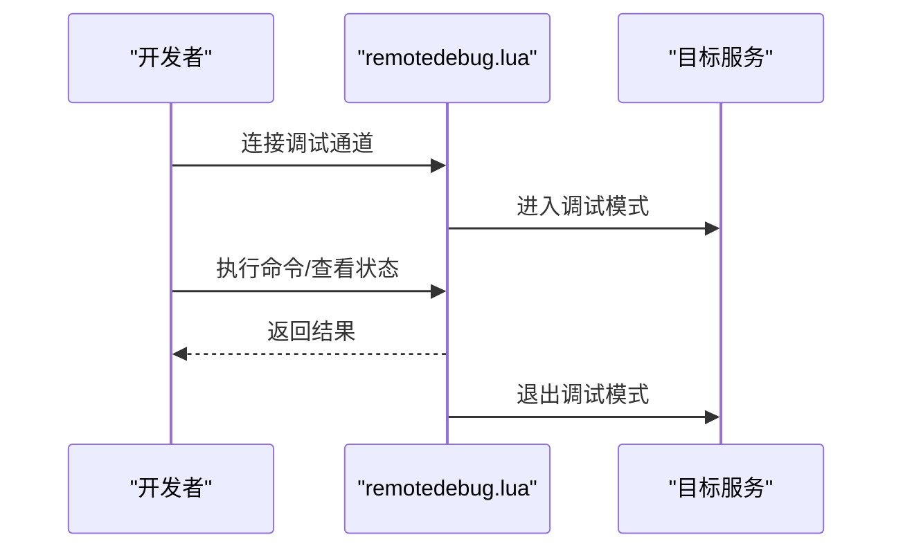
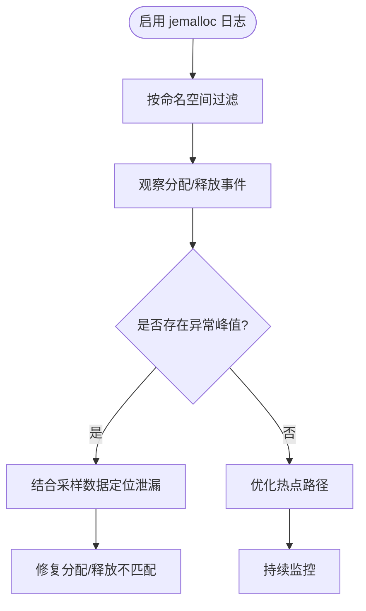
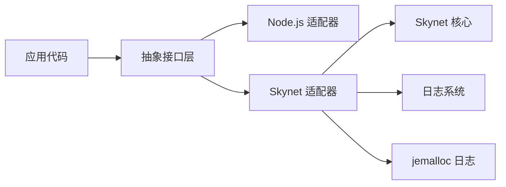

# 故障诊断

<cite>
**本文引用的文件**   
- [README.md](file://README.md)
- [架构设计文档.md](file://docs/架构设计文档.md)
- [interfaces.ts](file://server/src/framework/core/interfaces.ts)
- [skynet-adapter.ts](file://server/src/framework/runtime/skynet-adapter.ts)
- [node-adapter.ts](file://server/src/framework/runtime/node-adapter.ts)
- [skynet.lua](file://docker/skynet/lualib/skynet.lua)
- [remotedebug.lua](file://docker/skynet/lualib/skynet/remotedebug.lua)
- [skynet_log.h](file://docker/skynet/skynet-src/skynet_log.h)
- [log.h](file://docker/skynet/3rd/jemalloc/include/jemalloc/internal/log.h)
- [log.c](file://docker/skynet/3rd/jemalloc/src/log.c)
- [prof_data.c](file://docker/skynet/3rd/jemalloc/src/prof_data.c)
- [main_log.lua](file://docker/skynet/examples/main_log.lua)
- [nlog.xml](file://tables/tools/luban/Luban/nlog.xml)
</cite>

## 目录
1. [引言](#引言)
2. [项目结构](#项目结构)
3. [核心组件](#核心组件)
4. [架构总览](#架构总览)
5. [详细组件分析](#详细组件分析)
6. [依赖分析](#依赖分析)
7. [性能考量](#性能考量)
8. [故障排查指南](#故障排查指南)
9. [结论](#结论)
10. [附录](#附录)

## 引言
本指南面向使用 TS-Skynet 混合开发框架的工程师，提供系统性的故障诊断方法与步骤，覆盖日志分析、性能分析、内存泄漏检测、常见问题定位与解决策略，并结合框架内置工具与第三方工具给出实操建议。文档同时强调根因分析与预防性维护，帮助团队快速定位问题、稳定交付。

## 项目结构
TS-Skynet 将 TypeScript 业务代码与 Skynet 生产环境解耦，通过抽象接口层与运行时适配器实现“一套代码双环境运行”。生产环境由 Skynet 框架承载，开发与测试可在 Node.js 环境运行。该结构使得日志、网络、定时器、服务生命周期等关键能力在不同环境下保持一致的 API 表面，便于统一诊断。

**图表来源**
- [interfaces.ts:1-226](file://server/src/framework/core/interfaces.ts#L1-L226)
- [node-adapter.ts:1-194](file://server/src/framework/runtime/node-adapter.ts#L1-L194)
- [skynet-adapter.ts:1-221](file://server/src/framework/runtime/skynet-adapter.ts#L1-L221)
- [skynet.lua:158-191](file://docker/skynet/lualib/skynet.lua#L158-L191)
- [remotedebug.lua:189-270](file://docker/skynet/lualib/skynet/remotedebug.lua#L189-L270)
- [skynet_log.h:1-14](file://docker/skynet/skynet-src/skynet_log.h#L1-L14)
- [log.h:1-80](file://docker/skynet/3rd/jemalloc/include/jemalloc/internal/log.h#L1-L80)
- [log.c:1-46](file://docker/skynet/3rd/jemalloc/src/log.c#L1-L46)

**章节来源**
- [README.md:136-193](file://README.md#L136-L193)
- [架构设计文档.md:17-79](file://docs/架构设计文档.md#L17-L79)

## 核心组件
- 抽象接口层：统一日志、定时器、网络、服务、数据库、协议编解码等能力，屏蔽环境差异。
- Node.js 适配器：在 Node.js 环境下提供对应实现，便于本地开发与测试。
- Skynet 适配器：在 Skynet 环境下对接 Lua API，实现协程安全的异步模型转换。
- Skynet 核心库：提供服务生命周期、消息派发、超时与危险区保护等基础设施。
- 远程调试服务：支持在生产环境接入调试通道，辅助定位协程与消息处理问题。
- 日志与内存分配器日志：提供日志输出与内存分配跟踪能力，支撑性能与内存问题诊断。

**章节来源**
- [interfaces.ts:1-226](file://server/src/framework/core/interfaces.ts#L1-L226)
- [node-adapter.ts:1-194](file://server/src/framework/runtime/node-adapter.ts#L1-L194)
- [skynet-adapter.ts:1-221](file://server/src/framework/runtime/skynet-adapter.ts#L1-L221)
- [skynet.lua:158-191](file://docker/skynet/lualib/skynet.lua#L158-L191)
- [remotedebug.lua:189-270](file://docker/skynet/lualib/skynet/remotedebug.lua#L189-L270)
- [skynet_log.h:1-14](file://docker/skynet/skynet-src/skynet_log.h#L1-L14)
- [log.h:1-80](file://docker/skynet/3rd/jemalloc/include/jemalloc/internal/log.h#L1-L80)
- [log.c:1-46](file://docker/skynet/3rd/jemalloc/src/log.c#L1-L46)

## 架构总览
下图展示从应用层到 Skynet 生产环境的关键交互路径，以及日志与调试链路：

**图表来源**
- [skynet-adapter.ts:28-63](file://server/src/framework/runtime/skynet-adapter.ts#L28-L63)
- [skynet-adapter.ts:127-155](file://server/src/framework/runtime/skynet-adapter.ts#L127-L155)
- [skynet-adapter.ts:160-174](file://server/src/framework/runtime/skynet-adapter.ts#L160-L174)
- [skynet.lua:158-191](file://docker/skynet/lualib/skynet.lua#L158-L191)
- [skynet_log.h:10-12](file://docker/skynet/skynet-src/skynet_log.h#L10-L12)

## 详细组件分析

### 日志系统与日志分析
- 应用侧日志：通过抽象接口输出，Node.js 适配器使用 console.*，Skynet 适配器使用 skynet.error 输出到日志系统。
- Skynet 日志接口：提供打开/关闭日志文件与输出日志的能力，便于集中收集与持久化。
- jemalloc 内存分配器日志：支持按命名空间开启/过滤日志，便于定位内存相关问题。
- 配置示例：NLog 控制台输出规则可用于本地开发环境的快速观测。

**图表来源**
- [interfaces.ts:9-14](file://server/src/framework/core/interfaces.ts#L9-L14)
- [node-adapter.ts:19-35](file://server/src/framework/runtime/node-adapter.ts#L19-L35)
- [skynet-adapter.ts:28-63](file://server/src/framework/runtime/skynet-adapter.ts#L28-L63)
- [skynet_log.h:10-12](file://docker/skynet/skynet-src/skynet_log.h#L10-L12)
- [log.h:17-37](file://docker/skynet/3rd/jemalloc/include/jemalloc/internal/log.h#L17-L37)
- [nlog.xml:14-24](file://tables/tools/luban/Luban/nlog.xml#L14-L24)

**章节来源**
- [interfaces.ts:9-14](file://server/src/framework/core/interfaces.ts#L9-L14)
- [node-adapter.ts:19-35](file://server/src/framework/runtime/node-adapter.ts#L19-L35)
- [skynet-adapter.ts:28-63](file://server/src/framework/runtime/skynet-adapter.ts#L28-L63)
- [skynet_log.h:1-14](file://docker/skynet/skynet-src/skynet_log.h#L1-L14)
- [log.h:1-80](file://docker/skynet/3rd/jemalloc/include/jemalloc/internal/log.h#L1-L80)
- [nlog.xml:1-25](file://tables/tools/luban/Luban/nlog.xml#L1-L25)

### 网络与消息处理
- 网络接口：提供发送、调用（等待响应）、注册处理器、返回响应等能力。
- Skynet 适配器：call 会触发协程挂起等待响应；dispatch 注册消息处理器并在回调中自动处理 Promise 错误。
- 危险区保护：Skynet 核心库对会话号进行危险区保护，防止冲突与死锁风险。

**图表来源**
- [interfaces.ts:63-83](file://server/src/framework/core/interfaces.ts#L63-L83)
- [skynet-adapter.ts:127-155](file://server/src/framework/runtime/skynet-adapter.ts#L127-L155)
- [skynet.lua:158-191](file://docker/skynet/lualib/skynet.lua#L158-L191)

**章节来源**
- [interfaces.ts:63-83](file://server/src/framework/core/interfaces.ts#L63-L83)
- [skynet-adapter.ts:127-155](file://server/src/framework/runtime/skynet-adapter.ts#L127-L155)
- [skynet.lua:158-191](file://docker/skynet/lualib/skynet.lua#L158-L191)

### 定时器与协程安全
- 定时器接口：支持 setTimeout、sleep、safeTimeout、safeImmediate 等。
- Skynet 适配器：sleep 通过 Promise + timeout 实现非阻塞等待；safeTimeout 使用 skynet.fork 在协程中执行回调并捕获错误。
- Node.js 适配器：直接映射到全局定时器 API。

**图表来源**
- [interfaces.ts:19-58](file://server/src/framework/core/interfaces.ts#L19-L58)
- [skynet-adapter.ts:76-122](file://server/src/framework/runtime/skynet-adapter.ts#L76-L122)
- [node-adapter.ts:40-85](file://server/src/framework/runtime/node-adapter.ts#L40-L85)

**章节来源**
- [interfaces.ts:19-58](file://server/src/framework/core/interfaces.ts#L19-L58)
- [skynet-adapter.ts:76-122](file://server/src/framework/runtime/skynet-adapter.ts#L76-L122)
- [node-adapter.ts:40-85](file://server/src/framework/runtime/node-adapter.ts#L40-L85)

### 远程调试与问题定位
- 远程调试服务：通过 remotedebug.lua 提供调试通道，进入调试模式后可逐行执行、观察协程状态。
- 使用场景：生产环境定位协程卡顿、消息处理异常、长时间未返回等问题。

**图表来源**
- [remotedebug.lua:260-270](file://docker/skynet/lualib/skynet/remotedebug.lua#L260-L270)

**章节来源**
- [remotedebug.lua:189-270](file://docker/skynet/lualib/skynet/remotedebug.lua#L189-L270)

### 内存与性能分析
- jemalloc 日志：支持按命名空间开启日志，便于定位内存分配热点与异常。
- 性能采样：jemalloc 提供泄漏检测与采样数据，可用于评估内存增长趋势。
- 建议：结合日志与采样数据，定位高频分配、长生命周期对象与泄漏路径。

**图表来源**
- [log.h:17-37](file://docker/skynet/3rd/jemalloc/include/jemalloc/internal/log.h#L17-L37)
- [log.c:1-46](file://docker/skynet/3rd/jemalloc/src/log.c#L1-L46)
- [prof_data.c:995-1011](file://docker/skynet/3rd/jemalloc/src/prof_data.c#L995-L1011)

**章节来源**
- [log.h:1-80](file://docker/skynet/3rd/jemalloc/include/jemalloc/internal/log.h#L1-L80)
- [log.c:1-46](file://docker/skynet/3rd/jemalloc/src/log.c#L1-L46)
- [prof_data.c:995-1011](file://docker/skynet/3rd/jemalloc/src/prof_data.c#L995-L1011)

## 依赖分析
- 应用代码依赖抽象接口层，不直接依赖 Node.js 或 Skynet API，降低耦合度。
- 运行时适配器分别对接 Node.js 与 Skynet，保证 API 表面一致。
- Skynet 核心库提供服务生命周期、消息派发、超时与危险区保护等基础设施。
- 日志与内存分配器日志为诊断提供基础能力。

**图表来源**
- [interfaces.ts:1-226](file://server/src/framework/core/interfaces.ts#L1-L226)
- [node-adapter.ts:1-194](file://server/src/framework/runtime/node-adapter.ts#L1-L194)
- [skynet-adapter.ts:1-221](file://server/src/framework/runtime/skynet-adapter.ts#L1-L221)
- [skynet.lua:158-191](file://docker/skynet/lualib/skynet.lua#L158-L191)
- [skynet_log.h:1-14](file://docker/skynet/skynet-src/skynet_log.h#L1-L14)
- [log.h:1-80](file://docker/skynet/3rd/jemalloc/include/jemalloc/internal/log.h#L1-L80)

**章节来源**
- [interfaces.ts:1-226](file://server/src/framework/core/interfaces.ts#L1-L226)
- [node-adapter.ts:1-194](file://server/src/framework/runtime/node-adapter.ts#L1-L194)
- [skynet-adapter.ts:1-221](file://server/src/framework/runtime/skynet-adapter.ts#L1-L221)
- [skynet.lua:158-191](file://docker/skynet/lualib/skynet.lua#L158-L191)
- [skynet_log.h:1-14](file://docker/skynet/skynet-src/skynet_log.h#L1-L14)
- [log.h:1-80](file://docker/skynet/3rd/jemalloc/include/jemalloc/internal/log.h#L1-L80)

## 性能考量
- 异步模型统一：通过 TSTL 将 async/await 转换为 Lua 协程，减少阻塞与上下文切换成本。
- 协程安全：safeTimeout/safeImmediate 确保回调在受控协程中执行，避免竞态。
- 危险区保护：Skynet 核心库对会话号进行保护，降低死锁与冲突风险。
- 日志与内存：合理使用日志级别与 jemalloc 日志，避免诊断开销影响线上性能。

[本节为通用指导，无需列出具体文件来源]

## 故障排查指南

### 通用排查步骤
- 快速确认：使用命令查看状态与日志，定位异常范围。
- 环境验证：区分 Node.js 与 Skynet 环境差异，确认是否为环境特有问题。
- 日志分析：结合应用日志与 Skynet 日志，定位异常时间点与调用栈。
- 网络与消息：检查 call/ret 是否匹配，是否存在长时间未返回的消息。
- 定时器与协程：确认 safeTimeout/sleep 是否正确使用，避免协程泄漏。
- 内存与性能：启用 jemalloc 日志与采样，观察分配峰值与泄漏迹象。
- 远程调试：在生产环境接入调试通道，逐步执行与观察协程状态。

**章节来源**
- [README.md:56-92](file://README.md#L56-L92)
- [skynet-adapter.ts:100-121](file://server/src/framework/runtime/skynet-adapter.ts#L100-L121)
- [skynet.lua:158-191](file://docker/skynet/lualib/skynet.lua#L158-L191)
- [log.h:17-37](file://docker/skynet/3rd/jemalloc/include/jemalloc/internal/log.h#L17-L37)
- [remotedebug.lua:260-270](file://docker/skynet/lualib/skynet/remotedebug.lua#L260-L270)

### 常见问题与诊断

#### 服务启动失败
- 现象：服务无法启动或启动后立即退出。
- 诊断要点：
  - 检查服务启动回调是否抛出异常。
  - 确认服务地址与参数传递是否正确。
  - 观察日志输出，定位异常堆栈。
- 解决建议：
  - 在启动回调中包裹 try/catch 并记录错误。
  - 使用 safeTimeout/safeImmediate 执行异步初始化，避免阻塞启动。
  - 确保 newService 参数格式正确。

**章节来源**
- [skynet-adapter.ts:160-174](file://server/src/framework/runtime/skynet-adapter.ts#L160-L174)
- [skynet-adapter.ts:180-186](file://server/src/framework/runtime/skynet-adapter.ts#L180-L186)
- [skynet_log.h:10-12](file://docker/skynet/skynet-src/skynet_log.h#L10-L12)

#### 网络连接问题
- 现象：调用远端服务无响应或报错。
- 诊断要点：
  - 检查消息类型与处理器是否匹配。
  - 确认目标服务地址与消息格式。
  - 观察 call 是否触发协程挂起且未恢复。
- 解决建议：
  - 使用 dispatch 注册处理器并捕获 Promise 错误。
  - 确保 ret 调用与响应格式一致。
  - 结合危险区保护与日志定位冲突原因。

**章节来源**
- [interfaces.ts:63-83](file://server/src/framework/core/interfaces.ts#L63-L83)
- [skynet-adapter.ts:127-155](file://server/src/framework/runtime/skynet-adapter.ts#L127-L155)
- [skynet.lua:158-191](file://docker/skynet/lualib/skynet.lua#L158-L191)

#### 内存溢出/内存泄漏
- 现象：内存持续增长，GC 后仍不回落。
- 诊断要点：
  - 启用 jemalloc 日志，按命名空间过滤观察分配/释放。
  - 结合采样数据评估泄漏规模与趋势。
  - 定位高频分配与长生命周期对象。
- 解决建议：
  - 修复分配/释放不匹配，确保资源及时回收。
  - 优化大对象复用与缓存策略。
  - 定期巡检与压测，建立基线。

**章节来源**
- [log.h:17-37](file://docker/skynet/3rd/jemalloc/include/jemalloc/internal/log.h#L17-L37)
- [log.c:1-46](file://docker/skynet/3rd/jemalloc/src/log.c#L1-L46)
- [prof_data.c:995-1011](file://docker/skynet/3rd/jemalloc/src/prof_data.c#L995-L1011)

#### 协程卡顿/死锁
- 现象：服务响应缓慢或完全无响应。
- 诊断要点：
  - 使用远程调试服务进入调试模式，观察协程状态。
  - 检查是否存在长时间未返回的 call。
  - 确认 safeTimeout/safeImmediate 的使用是否正确。
- 解决建议：
  - 将耗时操作放入 safeTimeout，避免阻塞主协程。
  - 为关键路径设置超时与降级策略。
  - 通过调试逐步执行定位阻塞点。

**章节来源**
- [skynet-adapter.ts:100-121](file://server/src/framework/runtime/skynet-adapter.ts#L100-L121)
- [remotedebug.lua:189-270](file://docker/skynet/lualib/skynet/remotedebug.lua#L189-L270)

### 故障案例与解决过程（模板）
- 案例背景：服务启动后无法接收消息。
- 诊断步骤：
  - 查看启动日志，确认启动回调执行成功。
  - 检查 dispatch 注册是否生效。
  - 使用远程调试观察协程状态与消息处理路径。
- 根因分析：消息类型不匹配导致处理器未注册。
- 解决方案：修正消息类型与处理器绑定，重新部署验证。

[本小节为模板示例，不直接分析具体文件]

### 工具使用指南
- 内置工具：
  - 日志系统：通过 runtime.logger 输出，Skynet 适配器使用 skynet.error。
  - 远程调试：remotedebug.lua 提供调试通道。
  - 危险区保护：Skynet 核心库自动保护会话号。
- 第三方工具：
  - jemalloc 日志与采样：按命名空间过滤与泄漏检测。
  - NLog：本地开发环境控制台输出与规则配置。

**章节来源**
- [skynet-adapter.ts:28-63](file://server/src/framework/runtime/skynet-adapter.ts#L28-L63)
- [remotedebug.lua:260-270](file://docker/skynet/lualib/skynet/remotedebug.lua#L260-L270)
- [skynet.lua:158-191](file://docker/skynet/lualib/skynet.lua#L158-L191)
- [log.h:17-37](file://docker/skynet/3rd/jemalloc/include/jemalloc/internal/log.h#L17-L37)
- [nlog.xml:14-24](file://tables/tools/luban/Luban/nlog.xml#L14-L24)

### 预防性维护与监控告警
- 建立基线：记录正常运行时的日志级别、内存曲线与响应延迟。
- 告警策略：基于日志异常、内存增长速率、RPC 延迟与超时比例设置阈值。
- 定期巡检：检查服务健康状态、消息积压与协程数量。
- 版本与热更新：严格测试与灰度发布，保留回滚路径。

[本节为通用指导，无需列出具体文件来源]

## 结论
通过抽象接口层与运行时适配器，TS-Skynet 在 Node.js 与 Skynet 之间实现了统一的 API 表面，极大降低了跨环境故障的复杂度。配合日志系统、远程调试、危险区保护与 jemalloc 日志/采样，团队可以高效地进行根因分析与问题定位。建议在日常运维中建立基线与告警体系，结合预防性维护与演练，持续提升系统的稳定性与可观测性。

## 附录
- 常用命令速查：状态、日志、启动、停止、构建等。
- 目录结构概览：应用层、运行时适配层、Skynet 生产环境与工具链。

**章节来源**
- [README.md:56-92](file://README.md#L56-L92)
- [架构设计文档.md:17-79](file://docs/架构设计文档.md#L17-L79)