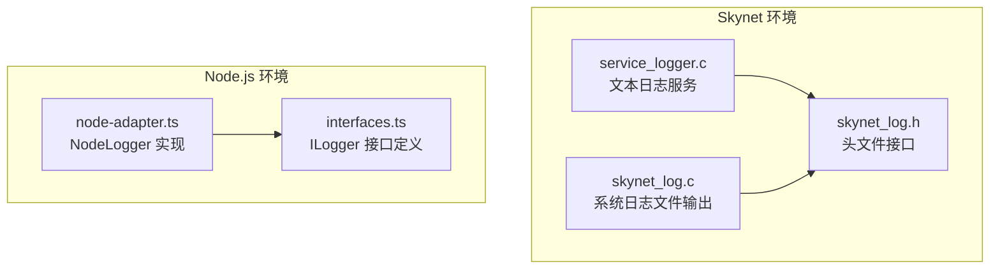
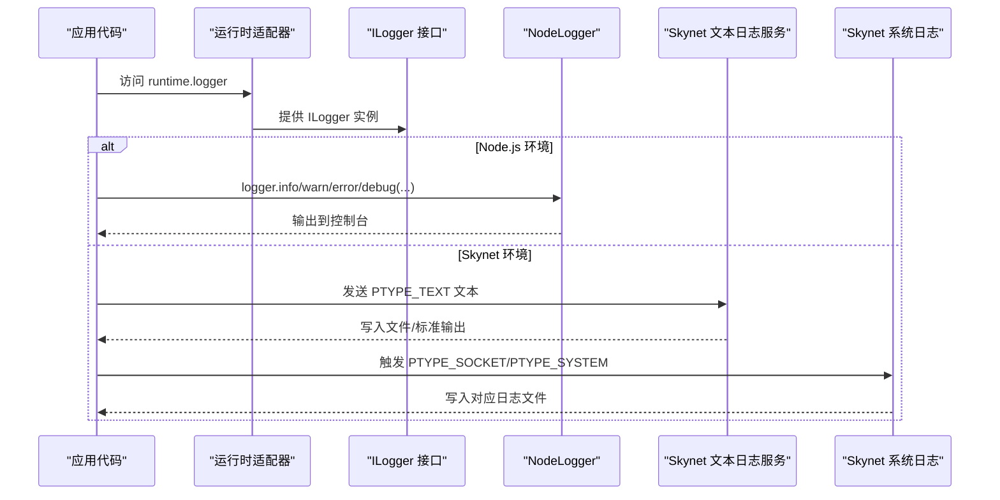
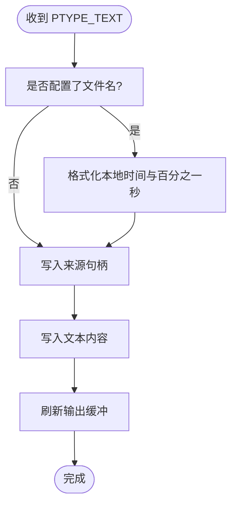
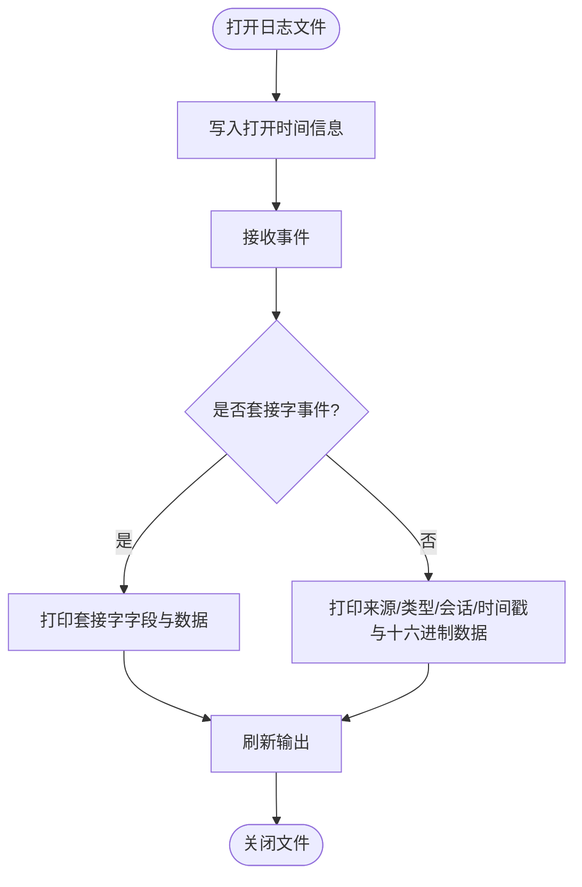
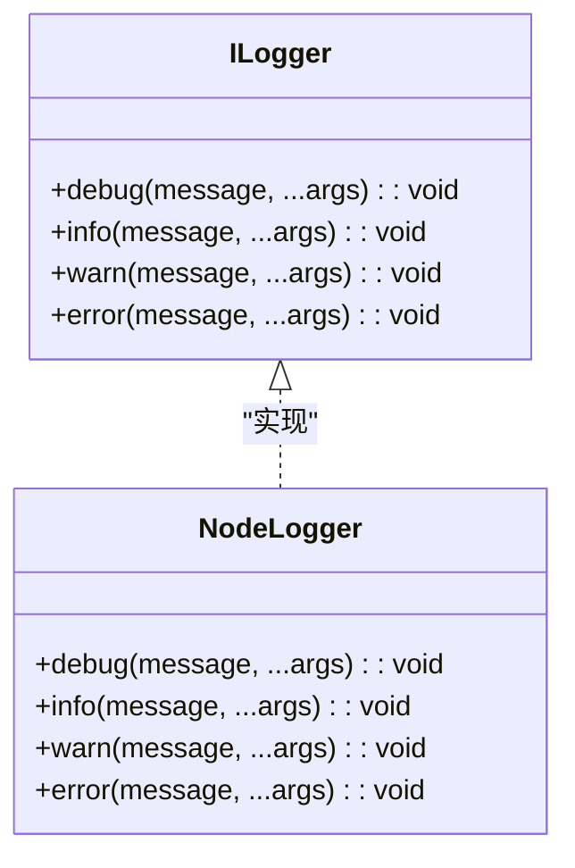
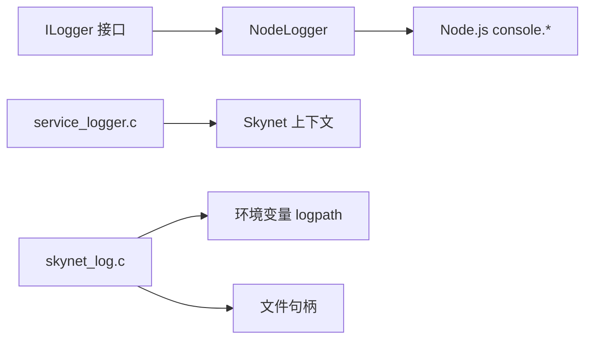

# 日志系统

<cite>
**本文引用的文件**
- [service_logger.c](file://docker/skynet/service-src/service_logger.c)
- [skynet_log.c](file://docker/skynet/skynet-src/skynet_log.c)
- [skynet_log.h](file://docker/skynet/skynet-src/skynet_log.h)
- [node-adapter.ts](file://server/src/framework/runtime/node-adapter.ts)
- [interfaces.ts](file://server/src/framework/core/interfaces.ts)
</cite>

## 目录
1. [简介](#简介)
2. [项目结构](#项目结构)
3. [核心组件](#核心组件)
4. [架构总览](#架构总览)
5. [详细组件分析](#详细组件分析)
6. [依赖关系分析](#依赖关系分析)
7. [性能考虑](#性能考虑)
8. [故障排查指南](#故障排查指南)
9. [结论](#结论)
10. [附录](#附录)

## 简介
本文件系统性阐述 Skynet 日志系统的实现与使用方法，覆盖以下要点：
- Skynet 环境下日志服务的架构与实现细节，包括日志级别、时间戳格式化、参数/二进制数据格式化策略
- Node.js 环境下的日志适配器与配置方法，以及与 Skynet 的差异
- 日志配置最佳实践，包括日志级别选择、格式定制、性能优化
- 实际日志记录示例与常见问题的解决方案
- 不同运行时环境下的日志调试与故障排查方法

## 项目结构
日志系统由两部分组成：
- Skynet C 语言侧：提供系统级日志文件输出能力与文本日志服务
- Node.js TypeScript 侧：提供统一的 ILogger 接口与运行时适配器

**图表来源**
- [service_logger.c:1-93](file://docker/skynet/service-src/service_logger.c#L1-L93)
- [skynet_log.c:1-78](file://docker/skynet/skynet-src/skynet_log.c#L1-L78)
- [skynet_log.h:1-14](file://docker/skynet/skynet-src/skynet_log.h#L1-L14)
- [node-adapter.ts:1-55](file://server/src/framework/runtime/node-adapter.ts#L1-L55)
- [interfaces.ts:1-226](file://server/src/framework/core/interfaces.ts#L1-L226)

**章节来源**
- [service_logger.c:1-93](file://docker/skynet/service-src/service_logger.c#L1-L93)
- [skynet_log.c:1-78](file://docker/skynet/skynet-src/skynet_log.c#L1-L78)
- [skynet_log.h:1-14](file://docker/skynet/skynet-src/skynet_log.h#L1-L14)
- [node-adapter.ts:1-55](file://server/src/framework/runtime/node-adapter.ts#L1-L55)
- [interfaces.ts:1-226](file://server/src/framework/core/interfaces.ts#L1-L226)

## 核心组件
- Skynet 文本日志服务（PTYPE_TEXT）：负责将文本消息写入文件或标准输出，带本地时间戳与毫秒级精度
- Skynet 系统日志文件输出（PTYPE_SOCKET/PTYPE_SYSTEM）：按服务句柄分文件输出二进制/套接字事件，便于网络与协议调试
- Node.js 日志适配器（NodeLogger）：实现统一 ILogger 接口，基于 Node.js console.* 输出

关键职责与行为：
- 时间戳：Skynet 文本日志以本地时间格式化并包含百分之一秒（秒的小数部分前两位），系统日志以单调时钟毫秒计数输出
- 参数格式化：文本日志直接写入原始字节流；系统日志对二进制数据以十六进制打印，便于网络/协议分析
- 文件管理：Skynet 文本日志支持重定向到指定文件或 stdout；系统日志按服务句柄命名文件并追加写入

**章节来源**
- [service_logger.c:35-70](file://docker/skynet/service-src/service_logger.c#L35-L70)
- [skynet_log.c:37-77](file://docker/skynet/skynet-src/skynet_log.c#L37-L77)
- [node-adapter.ts:19-35](file://server/src/framework/runtime/node-adapter.ts#L19-L35)

## 架构总览
Skynet 与 Node.js 的日志路径分别如下：

**图表来源**
- [interfaces.ts:9-14](file://server/src/framework/core/interfaces.ts#L9-L14)
- [node-adapter.ts:19-35](file://server/src/framework/runtime/node-adapter.ts#L19-L35)
- [service_logger.c:48-70](file://docker/skynet/service-src/service_logger.c#L48-L70)
- [skynet_log.c:66-77](file://docker/skynet/skynet-src/skynet_log.c#L66-L77)

## 详细组件分析

### Skynet 文本日志服务（service_logger.c）
- 功能概述
  - 接收 PTYPE_TEXT 文本消息，格式化为“本地时间.百分之一秒 + 来源服务句柄 + 文本内容”，并刷新输出
  - 支持 PTYPE_SYSTEM 事件用于重新打开日志文件（当配置文件名变化时）
- 关键点
  - 时间格式化：使用本地时间字符串与秒内百分之一秒（秒的小数部分前两位）
  - 输出目标：若提供文件名则写入文件，否则写入标准输出
  - 刷新策略：每次输出后立即刷新，确保实时可见

**图表来源**
- [service_logger.c:37-70](file://docker/skynet/service-src/service_logger.c#L37-L70)

**章节来源**
- [service_logger.c:16-92](file://docker/skynet/service-src/service_logger.c#L16-L92)

### Skynet 系统日志输出（skynet_log.c / skynet_log.h）
- 功能概述
  - 按服务句柄创建独立日志文件（logpath/XXXXXXX.log），追加模式写入
  - 输出二进制/套接字事件：以十六进制打印原始字节，便于网络协议与内存数据分析
  - 输出格式包含来源句柄、消息类型、会话号、时间戳（单调时钟毫秒）
- 关键点
  - 文件命名：基于服务句柄的 8 位十六进制标识
  - 二进制打印：逐字节十六进制输出，避免非可读字符干扰
  - 套接字消息：区分无缓冲区与有缓冲区两种情形，处理终止符与长度

**图表来源**
- [skynet_log.c:8-35](file://docker/skynet/skynet-src/skynet_log.c#L8-L35)
- [skynet_log.c:46-77](file://docker/skynet/skynet-src/skynet_log.c#L46-L77)

**章节来源**
- [skynet_log.c:1-78](file://docker/skynet/skynet-src/skynet_log.c#L1-L78)
- [skynet_log.h:1-14](file://docker/skynet/skynet-src/skynet_log.h#L1-L14)

### Node.js 日志适配器（node-adapter.ts）
- 功能概述
  - 实现 ILogger 接口，封装 Node.js console.* 方法，统一日志级别
  - 通过 setRuntime 将运行时实例注入全局 runtime，供业务代码使用
- 关键点
  - 日志级别：debug/info/warn/error 映射到 console.debug/info/warn/error
  - 参数传递：支持多参数扩展，便于结构化日志

**图表来源**
- [interfaces.ts:9-14](file://server/src/framework/core/interfaces.ts#L9-L14)
- [node-adapter.ts:19-35](file://server/src/framework/runtime/node-adapter.ts#L19-L35)

**章节来源**
- [node-adapter.ts:1-55](file://server/src/framework/runtime/node-adapter.ts#L1-L55)
- [interfaces.ts:189-226](file://server/src/framework/core/interfaces.ts#L189-L226)

## 依赖关系分析
- Skynet 文本日志服务依赖 Skynet 上下文回调机制与时间源，输出到文件或标准输出
- Skynet 系统日志依赖环境变量 logpath 与服务句柄，输出到独立文件
- Node.js 日志适配器依赖 Node.js 控制台 API，实现统一接口

**图表来源**
- [interfaces.ts:9-14](file://server/src/framework/core/interfaces.ts#L9-L14)
- [node-adapter.ts:19-35](file://server/src/framework/runtime/node-adapter.ts#L19-L35)
- [service_logger.c:48-92](file://docker/skynet/service-src/service_logger.c#L48-L92)
- [skynet_log.c:8-35](file://docker/skynet/skynet-src/skynet_log.c#L8-L35)

**章节来源**
- [interfaces.ts:1-226](file://server/src/framework/core/interfaces.ts#L1-L226)
- [node-adapter.ts:1-55](file://server/src/framework/runtime/node-adapter.ts#L1-L55)
- [service_logger.c:1-93](file://docker/skynet/service-src/service_logger.c#L1-L93)
- [skynet_log.c:1-78](file://docker/skynet/skynet-src/skynet_log.c#L1-L78)

## 性能考虑
- 输出刷新策略
  - Skynet 文本日志与系统日志均在每次输出后刷新，保证实时性但可能影响吞吐量
  - 建议在高并发场景下减少日志量或降低 debug/info 级别频率
- 文件 I/O
  - 独立文件按服务句柄拆分，避免跨服务争用，但需关注文件描述符上限
  - 建议在生产环境启用轮转策略，避免单文件过大
- 时间格式化
  - 文本日志包含本地时间与百分之一秒，格式化开销较小
  - 系统日志输出十六进制数据，对大数据包会有额外开销
- Node.js 环境
  - console.* 输出受终端/管道性能限制，建议配合外部日志收集系统

[本节为通用性能建议，无需特定文件引用]

## 故障排查指南
- 日志文件无法打开
  - 检查 logpath 环境变量是否正确设置
  - 确认目标目录存在且具有写权限
  - 参考系统日志文件打开流程与错误输出
- 日志内容异常
  - 文本日志：确认消息类型为 PTYPE_TEXT，检查回调注册是否生效
  - 系统日志：确认消息类型为 PTYPE_SOCKET 或 PTYPE_SYSTEM，检查文件命名规则
- 输出不及时
  - 确保输出后已刷新（默认行为），或在业务侧增加必要刷新
- Node.js 日志级别不匹配
  - 确认运行时已通过 setRuntime 注入 NodeLogger 实例
  - 检查业务代码是否直接调用 console.*

**章节来源**
- [skynet_log.c:8-35](file://docker/skynet/skynet-src/skynet_log.c#L8-L35)
- [service_logger.c:72-92](file://docker/skynet/service-src/service_logger.c#L72-L92)
- [node-adapter.ts:19-35](file://server/src/framework/runtime/node-adapter.ts#L19-L35)
- [interfaces.ts:213-226](file://server/src/framework/core/interfaces.ts#L213-L226)

## 结论
Skynet 日志系统在不同运行时提供了清晰一致的日志能力：
- Skynet 环境下，文本日志适合业务日志，系统日志适合网络与协议调试
- Node.js 环境下，ILogger 抽象屏蔽了平台差异，便于统一开发与测试
- 建议结合业务场景选择合适的日志级别与格式，配合外部日志系统实现集中化管理与轮转

[本节为总结性内容，无需特定文件引用]

## 附录

### 日志级别与使用建议
- Skynet 文本日志
  - 适用：业务日志、状态记录、调试信息
  - 建议：仅在必要时使用 debug/info，warn/error 用于异常与告警
- Skynet 系统日志
  - 适用：网络事件、协议数据、内存/缓冲区分析
  - 建议：仅在定位网络/协议问题时开启，避免生产环境产生大量二进制日志
- Node.js 日志
  - 适用：全栈日志统一输出
  - 建议：结合业务日志级别与运行时注入，保持一致性

**章节来源**
- [service_logger.c:48-70](file://docker/skynet/service-src/service_logger.c#L48-L70)
- [skynet_log.c:66-77](file://docker/skynet/skynet-src/skynet_log.c#L66-L77)
- [node-adapter.ts:19-35](file://server/src/framework/runtime/node-adapter.ts#L19-L35)

### 时间戳与格式化
- Skynet 文本日志
  - 本地时间格式化，包含百分之一秒（秒的小数部分前两位）
- Skynet 系统日志
  - 以单调时钟毫秒计数输出，便于事件排序与性能分析
- Node.js 日志
  - 使用 console.* 的时间戳，业务可自行添加格式化

**章节来源**
- [service_logger.c:37-45](file://docker/skynet/service-src/service_logger.c#L37-L45)
- [skynet_log.c:66-77](file://docker/skynet/skynet-src/skynet_log.c#L66-L77)
- [node-adapter.ts:19-35](file://server/src/framework/runtime/node-adapter.ts#L19-L35)

### 配置与部署建议
- 环境变量
  - logpath：系统日志文件根目录，按服务句柄拆分文件
- 运行时注入
  - Node.js 环境通过 setRuntime 注入 NodeLogger 实例
- 最佳实践
  - 生产环境优先使用 warn/error，必要时临时提升至 info
  - 高频日志建议采样或聚合，避免 I/O 压力
  - 结合外部日志系统实现集中化采集、检索与告警

**章节来源**
- [skynet_log.c:8-28](file://docker/skynet/skynet-src/skynet_log.c#L8-L28)
- [interfaces.ts:213-226](file://server/src/framework/core/interfaces.ts#L213-L226)
- [node-adapter.ts:19-35](file://server/src/framework/runtime/node-adapter.ts#L19-L35)