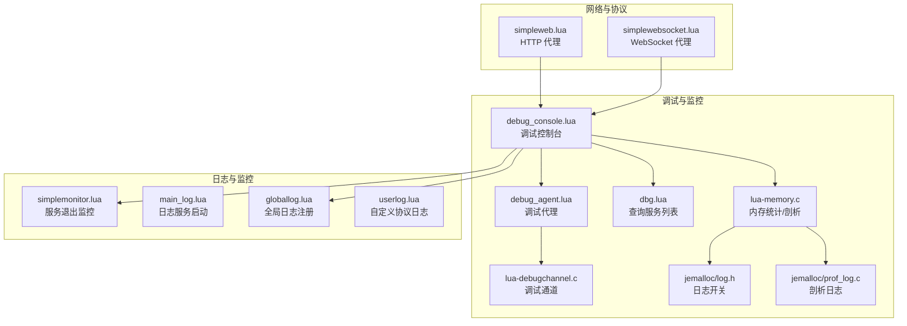
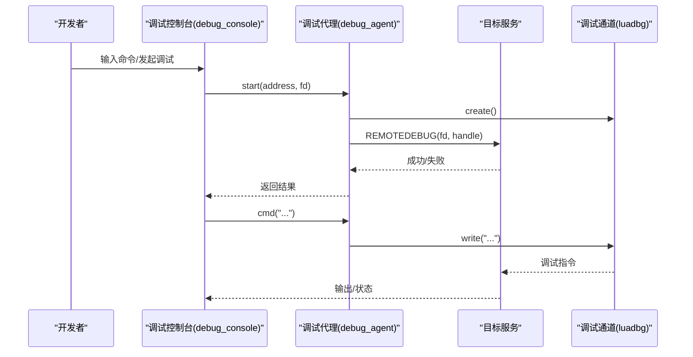
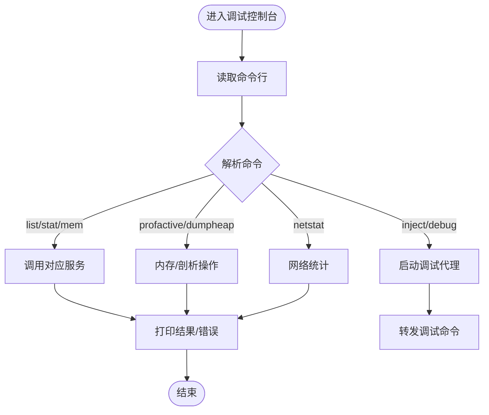
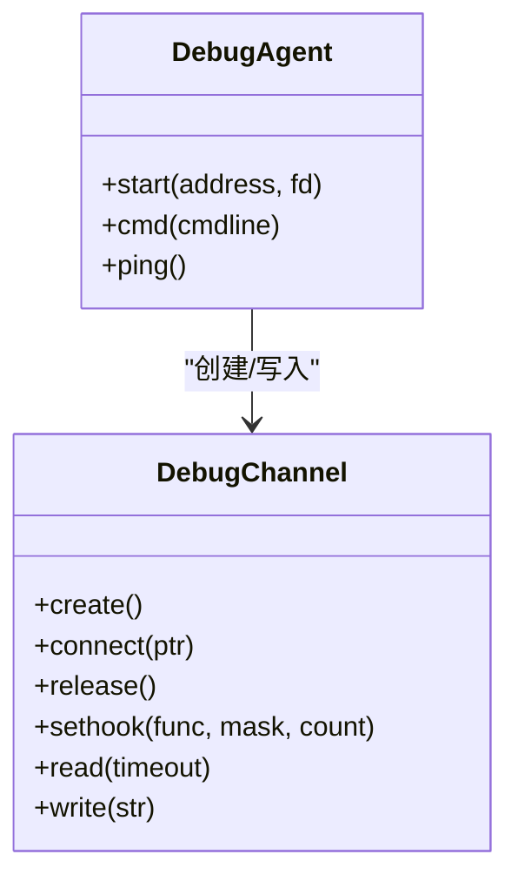
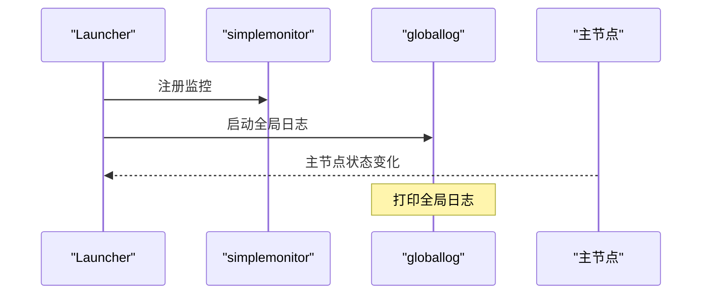
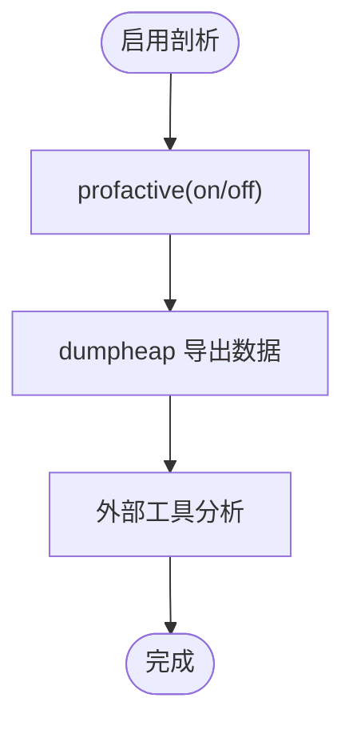
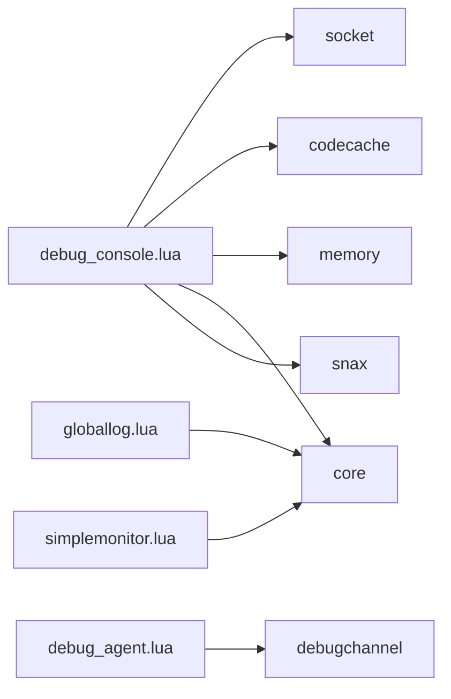

# 监控和调试

<cite>
**本文引用的文件**
- [README.md](file://README.md)
- [debug_console.lua](file://docker/skynet/service/debug_console.lua)
- [debug_agent.lua](file://docker/skynet/service/debug_agent.lua)
- [dbg.lua](file://docker/skynet/service/dbg.lua)
- [lua-debugchannel.c](file://docker/skynet/lualib-src/lua-debugchannel.c)
- [lua-memory.c](file://docker/skynet/lualib-src/lua-memory.c)
- [simplemonitor.lua](file://docker/skynet/examples/simplemonitor.lua)
- [main_log.lua](file://docker/skynet/examples/main_log.lua)
- [globallog.lua](file://docker/skynet/examples/globallog.lua)
- [userlog.lua](file://docker/skynet/examples/userlog.lua)
- [simpleweb.lua](file://docker/skynet/examples/simpleweb.lua)
- [simplewebsocket.lua](file://docker/skynet/examples/simplewebsocket.lua)
- [skynet.lua](file://docker/skynet/lualib/skynet.lua)
- [log.h](file://docker/skynet/3rd/jemalloc/include/jemalloc/internal/log.h)
- [log.c](file://docker/skynet/3rd/jemalloc/src/log.c)
- [prof_log.c](file://docker/skynet/3rd/jemalloc/src/prof_log.c)
</cite>

## 目录
1. [引言](#引言)
2. [项目结构](#项目结构)
3. [核心组件](#核心组件)
4. [架构总览](#架构总览)
5. [详细组件分析](#详细组件分析)
6. [依赖分析](#依赖分析)
7. [性能考虑](#性能考虑)
8. [故障排查指南](#故障排查指南)
9. [结论](#结论)
10. [附录](#附录)

## 引言
本指南面向 TS-Skynet 混合开发框架的监控与调试场景，覆盖日志系统配置与使用、性能监控与分析、调试技巧与工具、错误处理与异常捕获、故障诊断方法以及监控告警与运维建议。内容基于仓库中的 Skynet 框架与示例服务，结合 jemalloc 内存剖析能力，帮助开发者在 Node.js 开发环境与 Skynet 生产环境之间建立一致的可观测性与可维护性。

## 项目结构
围绕监控与调试的关键目录与文件：
- 调试控制台与代理：debug_console.lua、debug_agent.lua、dbg.lua、lua-debugchannel.c
- 日志与监控：simplemonitor.lua、main_log.lua、globallog.lua、userlog.lua
- 内存与性能：lua-memory.c、jemalloc 日志与剖析头文件与实现
- 网络与协议：simpleweb.lua、simplewebsocket.lua
- 核心运行时：skynet.lua

**图表来源**
- [debug_console.lua:126-141](file://docker/skynet/service/debug_console.lua#L126-L141)
- [debug_agent.lua:1-37](file://docker/skynet/service/debug_agent.lua#L1-L37)
- [dbg.lua:37-43](file://docker/skynet/service/dbg.lua#L37-L43)
- [lua-debugchannel.c:273-286](file://docker/skynet/lualib-src/lua-debugchannel.c#L273-L286)
- [lua-memory.c:95-117](file://docker/skynet/lualib-src/lua-memory.c#L95-L117)
- [log.h:42-80](file://docker/skynet/3rd/jemalloc/include/jemalloc/internal/log.h#L42-L80)
- [prof_log.c:98-130](file://docker/skynet/3rd/jemalloc/src/prof_log.c#L98-L130)
- [simplemonitor.lua:37-40](file://docker/skynet/examples/simplemonitor.lua#L37-L40)
- [main_log.lua:11-18](file://docker/skynet/examples/main_log.lua#L11-L18)
- [globallog.lua:4-11](file://docker/skynet/examples/globallog.lua#L4-L11)
- [userlog.lua:4-25](file://docker/skynet/examples/userlog.lua#L4-L25)
- [simpleweb.lua:55-99](file://docker/skynet/examples/simpleweb.lua#L55-L99)
- [simplewebsocket.lua:45-52](file://docker/skynet/examples/simplewebsocket.lua#L45-L52)

**章节来源**
- [README.md:136-193](file://README.md#L136-L193)

## 核心组件
- 调试控制台：提供命令行与 HTTP 接口，支持列出服务、查看统计、内存信息、注入脚本、远程调试、信号与网络统计等。
- 调试代理：负责与目标服务建立远程调试通道，转发调试命令。
- 日志系统：包含全局日志服务、服务退出监控、用户自定义协议日志。
- 内存与剖析：封装 jemalloc 统计与剖析接口，支持堆剖析开关、导出剖析数据。
- 网络代理：HTTP/WebSocket 代理示例，便于观测请求与连接状态。

**章节来源**
- [debug_console.lua:143-178](file://docker/skynet/service/debug_console.lua#L143-L178)
- [debug_agent.lua:8-21](file://docker/skynet/service/debug_agent.lua#L8-L21)
- [globallog.lua:4-11](file://docker/skynet/examples/globallog.lua#L4-L11)
- [simplemonitor.lua:22-35](file://docker/skynet/examples/simplemonitor.lua#L22-L35)
- [lua-memory.c:95-117](file://docker/skynet/lualib-src/lua-memory.c#L95-L117)
- [simpleweb.lua:55-99](file://docker/skynet/examples/simpleweb.lua#L55-L99)
- [simplewebsocket.lua:45-52](file://docker/skynet/examples/simplewebsocket.lua#L45-L52)

## 架构总览
调试与监控的整体流程：调试控制台通过 socket 接收命令，调用相应服务执行；远程调试通过调试代理与目标服务建立调试通道；日志系统通过注册协议或服务进行集中输出；内存与剖析通过 C 扩展与 jemalloc 集成。

**图表来源**
- [debug_console.lua:306-342](file://docker/skynet/service/debug_console.lua#L306-L342)
- [debug_agent.lua:8-21](file://docker/skynet/service/debug_agent.lua#L8-L21)
- [lua-debugchannel.c:112-130](file://docker/skynet/lualib-src/lua-debugchannel.c#L112-L130)

## 详细组件分析

### 调试控制台（debug_console）
- 功能要点
  - 命令解析与执行：支持 list、stat、mem、task、uniqtask、inject、logon/logoff、debug、trace、netstat、profactive/dumpheap、dbgcmd 等。
  - 远程调试：通过 debug 命令启动调试代理，转发命令至目标服务。
  - 内存与剖析：提供 jemalloc 相关命令，如 profactive、dumpheap、jmem、cmem。
  - 网络统计：netstat 展示连接读写字节与时延等。
- 关键命令路径
  - 帮助与命令清单：[help:143-178](file://docker/skynet/service/debug_console.lua#L143-L178)
  - 服务列表与统计：[list:234-236](file://docker/skynet/service/debug_console.lua#L234-L236)、[stat:250-252](file://docker/skynet/service/debug_console.lua#L250-L252)、[mem:254-256](file://docker/skynet/service/debug_console.lua#L254-L256)
  - 注入脚本与调试：[inject:270-283](file://docker/skynet/service/debug_console.lua#L270-L283)、[debug:306-342](file://docker/skynet/service/debug_console.lua#L306-L342)
  - 内存与剖析：[profactive:471-480](file://docker/skynet/service/debug_console.lua#L471-L480)、[dumpheap:467-469](file://docker/skynet/service/debug_console.lua#L467-L469)、[jmem:375-382](file://docker/skynet/service/debug_console.lua#L375-L382)、[cmem:363-373](file://docker/skynet/service/debug_console.lua#L363-L373)
  - 网络统计：[netstat:459-465](file://docker/skynet/service/debug_console.lua#L459-L465)

**图表来源**
- [debug_console.lua:59-90](file://docker/skynet/service/debug_console.lua#L59-L90)
- [debug_console.lua:306-342](file://docker/skynet/service/debug_console.lua#L306-L342)
- [debug_console.lua:471-480](file://docker/skynet/service/debug_console.lua#L471-L480)

**章节来源**
- [debug_console.lua:126-141](file://docker/skynet/service/debug_console.lua#L126-L141)
- [debug_console.lua:143-178](file://docker/skynet/service/debug_console.lua#L143-L178)
- [debug_console.lua:234-236](file://docker/skynet/service/debug_console.lua#L234-L236)
- [debug_console.lua:250-256](file://docker/skynet/service/debug_console.lua#L250-L256)
- [debug_console.lua:270-283](file://docker/skynet/service/debug_console.lua#L270-L283)
- [debug_console.lua:306-342](file://docker/skynet/service/debug_console.lua#L306-L342)
- [debug_console.lua:363-382](file://docker/skynet/service/debug_console.lua#L363-L382)
- [debug_console.lua:459-465](file://docker/skynet/service/debug_console.lua#L459-L465)
- [debug_console.lua:471-480](file://docker/skynet/service/debug_console.lua#L471-L480)

### 调试代理与调试通道（debug_agent、lua-debugchannel）
- 调试代理
  - 启动远程调试：创建调试通道句柄，向目标服务发送 REMOTEDEBUG 请求。
  - 命令转发：将控制台输入的调试命令写入通道。
- 调试通道（C 扩展）
  - 提供 create/connect/release 与 sethook 接口，内部使用自旋锁与队列实现线程安全的命令传递。
  - 支持超时读取与内存回收。

**图表来源**
- [debug_agent.lua:8-21](file://docker/skynet/service/debug_agent.lua#L8-L21)
- [lua-debugchannel.c:172-187](file://docker/skynet/lualib-src/lua-debugchannel.c#L172-L187)
- [lua-debugchannel.c:111-130](file://docker/skynet/lualib-src/lua-debugchannel.c#L111-L130)
- [lua-debugchannel.c:243-271](file://docker/skynet/lualib-src/lua-debugchannel.c#L243-L271)

**章节来源**
- [debug_agent.lua:1-37](file://docker/skynet/service/debug_agent.lua#L1-L37)
- [lua-debugchannel.c:1-286](file://docker/skynet/lualib-src/lua-debugchannel.c#L1-L286)

### 日志系统与监控
- 全局日志服务
  - 注册 .log 与 LOG 名称，接收并打印来自各服务的日志消息。
- 服务退出监控
  - 监听 CLIENT 协议，当被监视的服务退出时，向观察者广播 error。
- 用户自定义日志
  - 注册 text/system 协议，按地址与时间戳输出消息，支持信号重开事件。
- 日志服务启动
  - 启动时注册监控器与全局日志服务，并监控主节点状态。

**图表来源**
- [main_log.lua:11-18](file://docker/skynet/examples/main_log.lua#L11-L18)
- [simplemonitor.lua:7-20](file://docker/skynet/examples/simplemonitor.lua#L7-L20)
- [globallog.lua:4-11](file://docker/skynet/examples/globallog.lua#L4-L11)
- [userlog.lua:4-25](file://docker/skynet/examples/userlog.lua#L4-L25)

**章节来源**
- [globallog.lua:4-11](file://docker/skynet/examples/globallog.lua#L4-L11)
- [simplemonitor.lua:22-35](file://docker/skynet/examples/simplemonitor.lua#L22-L35)
- [userlog.lua:4-25](file://docker/skynet/examples/userlog.lua#L4-L25)
- [main_log.lua:11-18](file://docker/skynet/examples/main_log.lua#L11-L18)

### 内存与性能监控
- 内存统计与剖析
  - 提供 total/block/current/info/dump 等接口，支持 jemalloc 统计与 profactive 控制。
  - dumpheap 导出剖析数据，便于后续分析。
- jemalloc 日志与剖析
  - 日志变量通过配置字符串控制启用范围，支持直接匹配与前缀匹配。
  - 剖析日志记录回溯栈、线程与分配信息，配合锁保护链表存储。

**图表来源**
- [lua-memory.c:76-93](file://docker/skynet/lualib-src/lua-memory.c#L76-L93)
- [log.h:42-80](file://docker/skynet/3rd/jemalloc/include/jemalloc/internal/log.h#L42-L80)
- [log.c:43-86](file://docker/skynet/3rd/jemalloc/src/log.c#L43-L86)
- [prof_log.c:98-130](file://docker/skynet/3rd/jemalloc/src/prof_log.c#L98-L130)

**章节来源**
- [lua-memory.c:95-117](file://docker/skynet/lualib-src/lua-memory.c#L95-L117)
- [log.h:42-80](file://docker/skynet/3rd/jemalloc/include/jemalloc/internal/log.h#L42-L80)
- [log.c:43-86](file://docker/skynet/3rd/jemalloc/src/log.c#L43-L86)
- [prof_log.c:98-130](file://docker/skynet/3rd/jemalloc/src/prof_log.c#L98-L130)

### 网络与协议监控
- HTTP 代理
  - 读取请求头与正文，输出解析结果，便于调试 HTTP 流量。
- WebSocket 代理
  - 处理握手、消息、心跳、关闭与错误事件，便于调试 WebSocket 通信。

**章节来源**
- [simpleweb.lua:55-99](file://docker/skynet/examples/simpleweb.lua#L55-L99)
- [simplewebsocket.lua:45-52](file://docker/skynet/examples/simplewebsocket.lua#L45-L52)

## 依赖分析
- 调试控制台依赖
  - socket：网络输入输出与 HTTP 解析。
  - codecache/memory/core：代码缓存、内存统计、内核命令。
  - snax/socket/httpd/sockethelper：服务管理与网络辅助。
- 调试代理依赖
  - debugchannel：C 扩展提供的调试通道。
- 日志与监控
  - skynet.core：底层内核命令与服务注册。
  - skynet.manager：服务管理与监控注册。
- 内存与剖析
  - jemalloc：内存分配与剖析库，通过 C 扩展暴露接口。

**图表来源**
- [debug_console.lua:1-11](file://docker/skynet/service/debug_console.lua#L1-L11)
- [debug_agent.lua:1-3](file://docker/skynet/service/debug_agent.lua#L1-L3)
- [globallog.lua:1-3](file://docker/skynet/examples/globallog.lua#L1-L3)
- [simplemonitor.lua:1-4](file://docker/skynet/examples/simplemonitor.lua#L1-L4)

**章节来源**
- [debug_console.lua:1-11](file://docker/skynet/service/debug_console.lua#L1-L11)
- [debug_agent.lua:1-3](file://docker/skynet/service/debug_agent.lua#L1-L3)
- [globallog.lua:1-3](file://docker/skynet/examples/globallog.lua#L1-L3)
- [simplemonitor.lua:1-4](file://docker/skynet/examples/simplemonitor.lua#L1-L4)

## 性能考虑
- 使用调试控制台的 netstat、mem、stat 等命令进行快速性能评估。
- 合理开启 jemalloc 剖析，仅在定位问题时启用，避免长期开启带来的开销。
- 利用注入脚本与远程调试在不中断服务的情况下观测行为。
- 对于高并发网络服务，优先使用代理示例中的连接复用与均衡策略。

## 故障排查指南
- 服务崩溃与退出
  - 使用 simplemonitor 监控服务退出并向观察者广播错误，结合全局日志定位原因。
- 远程调试
  - 通过 debug_console 的 debug 命令启动调试代理，转发命令至目标服务，逐步缩小问题范围。
- 内存泄漏与异常增长
  - 使用 cmem/jmem/profactive/dumpheap 分析内存使用与剖析数据，定位热点与回溯栈。
- 网络问题
  - 使用 netstat 观察连接读写字节与时延，结合 HTTP/WebSocket 代理输出排查请求与响应。

**章节来源**
- [simplemonitor.lua:22-35](file://docker/skynet/examples/simplemonitor.lua#L22-L35)
- [debug_console.lua:306-342](file://docker/skynet/service/debug_console.lua#L306-L342)
- [lua-memory.c:95-117](file://docker/skynet/lualib-src/lua-memory.c#L95-L117)
- [simpleweb.lua:55-99](file://docker/skynet/examples/simpleweb.lua#L55-L99)
- [simplewebsocket.lua:45-52](file://docker/skynet/examples/simplewebsocket.lua#L45-L52)

## 结论
本指南基于仓库中的 Skynet 调试与监控组件，提供了从日志、性能、网络到远程调试的完整实践路径。建议在开发阶段充分利用调试控制台与代理，在生产阶段结合全局日志与监控服务，配合 jemalloc 剖析工具进行问题定位与优化。

## 附录
- 实际调试案例
  - 远程调试某登录服务：使用 debug_console 的 debug 命令启动调试代理，连接目标服务，逐步执行命令观察状态。
  - 定位内存峰值：启用 profactive，复现问题后 dumpheap，使用外部工具分析热点分配。
  - 排查网络异常：使用 netstat 与 HTTP/WebSocket 代理输出，确认请求与响应是否符合预期。
- 最佳实践
  - 在 Node.js 与 Skynet 双环境中保持一致的日志格式与级别。
  - 将调试命令与日志输出规范化，便于自动化分析。
  - 对关键路径添加 trace 与统计，形成持续监控基线。