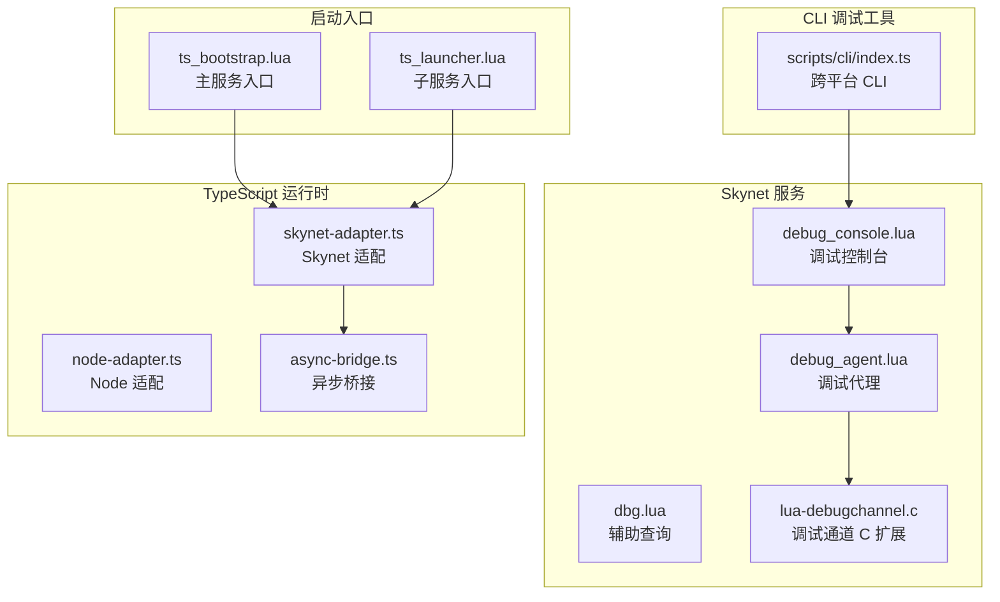
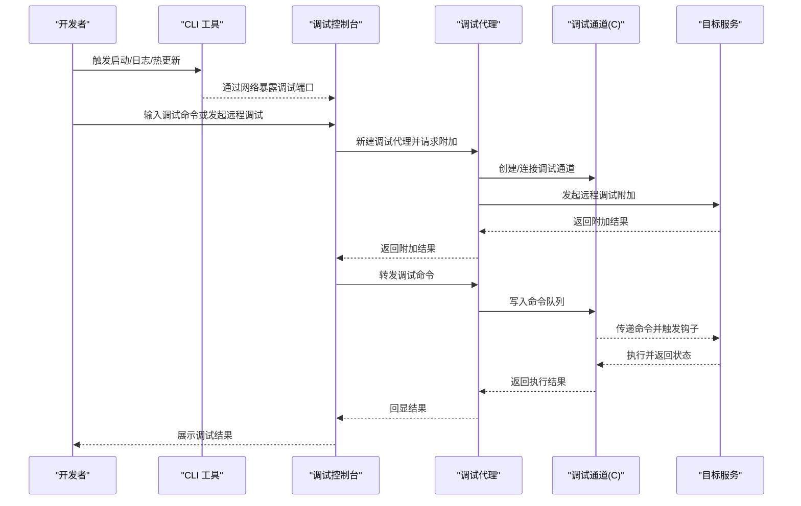
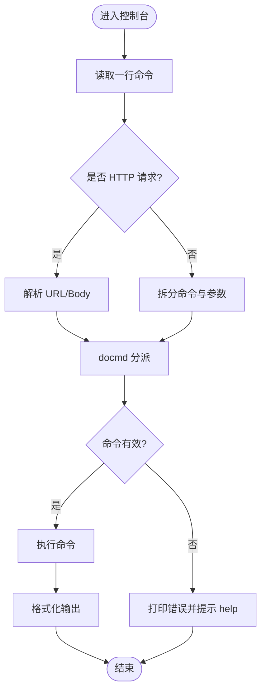
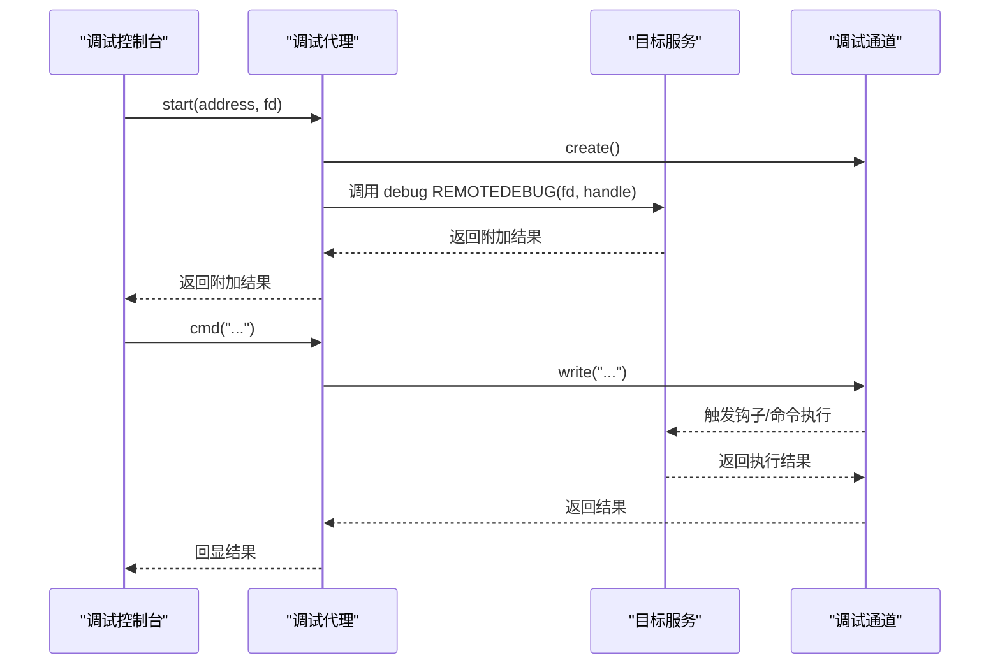
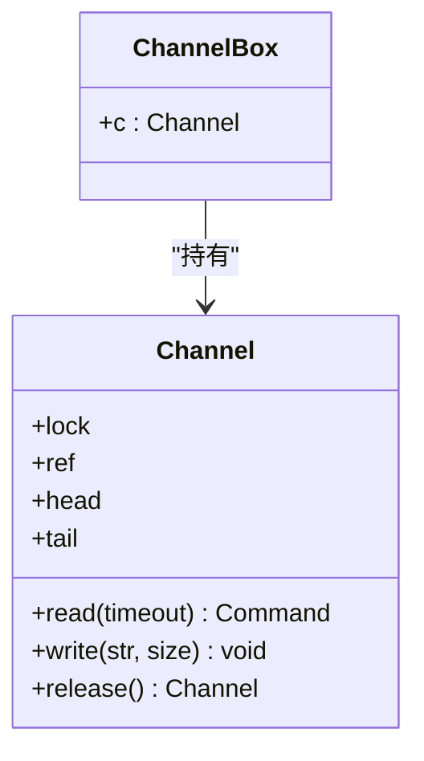
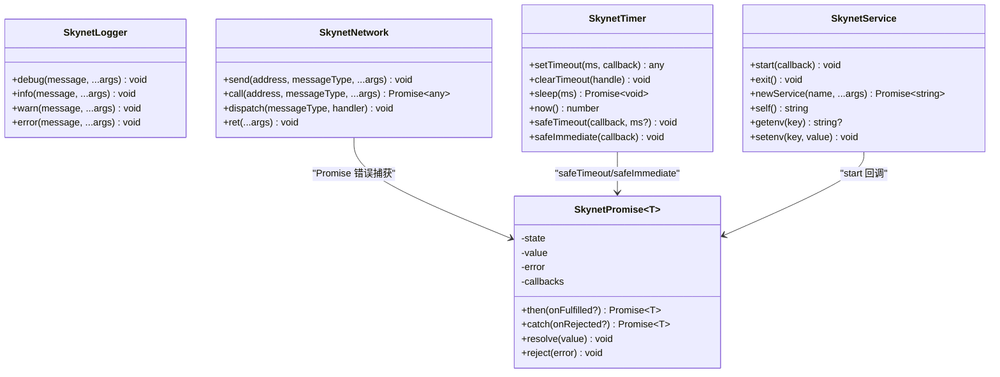
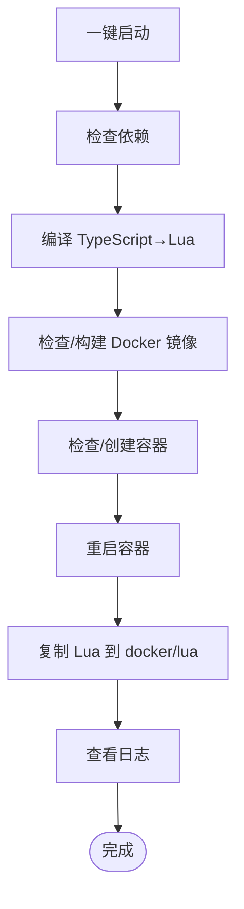
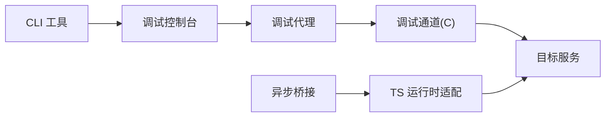

# 调试工具

<cite>
**本文引用的文件**   
- [docker\skynet\service\debug_console.lua](file://docker\skynet\service\debug_console.lua)
- [docker\skynet\service\debug_agent.lua](file://docker\skynet\service\debug_agent.lua)
- [docker\skynet\service\dbg.lua](file://docker\skynet\service\dbg.lua)
- [docker\skynet\lualib-src\lua-debugchannel.c](file://docker\skynet\lualib-src\lua-debugchannel.c)
- [docker\native\ts_bootstrap.lua](file://docker\native\ts_bootstrap.lua)
- [docker\native\ts_launcher.lua](file://docker\native\ts_launcher.lua)
- [server\src\framework\runtime\skynet-adapter.ts](file://server\src\framework\runtime\skynet-adapter.ts)
- [server\src\framework\runtime\node-adapter.ts](file://server\src\framework\runtime\node-adapter.ts)
- [server\src\framework\runtime\async-bridge.ts](file://server\src\framework\runtime\async-bridge.ts)
- [docker\skynet\test\testcoroutine.lua](file://docker\skynet\test\testcoroutine.lua)
- [server\scripts\cli\index.ts](file://server\scripts\cli\index.ts)
</cite>

## 目录
1. [简介](#简介)
2. [项目结构](#项目结构)
3. [核心组件](#核心组件)
4. [架构总览](#架构总览)
5. [详细组件分析](#详细组件分析)
6. [依赖关系分析](#依赖关系分析)
7. [性能考量](#性能考量)
8. [故障排查指南](#故障排查指南)
9. [结论](#结论)
10. [附录](#附录)

## 简介
本指南聚焦于本项目的调试工具与技巧，覆盖以下主题：
- SourceMap 调试：面向 TypeScript 到 Lua 的 SourceMap 生成与调试流程（含配置要点与注意事项）。
- Skynet 环境调试：断点调试、远程调试、控制台调试命令与通道机制。
- CLI 工具调试：服务启动调试、日志输出调试、热更新与一键启动流程。
- Promise 与协程调试：异步错误追踪、堆栈分析与协程状态观察。
- 实战案例与常见问题：从配置到排障的完整闭环。

## 项目结构
围绕调试相关的代码主要分布在如下位置：
- Skynet 服务侧：调试控制台、调试代理、调试通道 C 扩展、辅助查询服务。
- TypeScript 运行时适配层：Skynet 与 Node.js 两套运行时适配，以及异步桥接层。
- TypeScript 启动入口：主服务与子服务启动脚本。
- CLI 调试工具：一键启动、日志查看、热更新、构建与状态管理。

**图表来源**
- [docker\skynet\service\debug_console.lua:126-141](file://docker\skynet\service\debug_console.lua#L126-L141)
- [docker\skynet\service\debug_agent.lua:1-37](file://docker\skynet\service\debug_agent.lua#L1-L37)
- [docker\skynet\lualib-src\lua-debugchannel.c:273-286](file://docker\skynet\lualib-src\lua-debugchannel.c#L273-L286)
- [docker\native\ts_bootstrap.lua:1-33](file://docker\native\ts_bootstrap.lua#L1-L33)
- [docker\native\ts_launcher.lua:1-26](file://docker\native\ts_launcher.lua#L1-L26)
- [server\src\framework\runtime\skynet-adapter.ts:1-221](file://server\src\framework\runtime\skynet-adapter.ts#L1-L221)
- [server\src\framework\runtime\node-adapter.ts:1-194](file://server\src\framework\runtime\node-adapter.ts#L1-L194)
- [server\src\framework\runtime\async-bridge.ts:1-208](file://server\src\framework\runtime\async-bridge.ts#L1-L208)
- [server\scripts\cli\index.ts:300-354](file://server\scripts\cli\index.ts#L300-L354)

**章节来源**
- [docker\skynet\service\debug_console.lua:126-141](file://docker\skynet\service\debug_console.lua#L126-L141)
- [docker\skynet\service\debug_agent.lua:1-37](file://docker\skynet\service\debug_agent.lua#L1-L37)
- [docker\skynet\lualib-src\lua-debugchannel.c:273-286](file://docker\skynet\lualib-src\lua-debugchannel.c#L273-L286)
- [docker\native\ts_bootstrap.lua:1-33](file://docker\native\ts_bootstrap.lua#L1-L33)
- [docker\native\ts_launcher.lua:1-26](file://docker\native\ts_launcher.lua#L1-L26)
- [server\src\framework\runtime\skynet-adapter.ts:1-221](file://server\src\framework\runtime\skynet-adapter.ts#L1-L221)
- [server\src\framework\runtime\node-adapter.ts:1-194](file://server\src\framework\runtime\node-adapter.ts#L1-L194)
- [server\src\framework\runtime\async-bridge.ts:1-208](file://server\src\framework\runtime\async-bridge.ts#L1-L208)
- [server\scripts\cli\index.ts:300-354](file://server\scripts\cli\index.ts#L300-L354)

## 核心组件
- 调试控制台：提供命令行与 HTTP 接口，支持列出服务、统计信息、内存、任务详情、注入脚本、日志开关、远程调试等。
- 调试代理：负责建立与目标服务的调试通道，转发命令并处理连接生命周期。
- 调试通道 C 扩展：提供线程安全的命令队列与钩子设置能力，支撑断点与单步调试。
- TypeScript 运行时适配：在 Skynet 环境下将 async/await 转换为协程，保证 Promise 错误可追踪。
- 启动入口：主服务与子服务统一注入全局对象、初始化运行时并加载对应模块。
- CLI 调试工具：一键启动、日志查看、热更新、状态查询与构建流程。

**章节来源**
- [docker\skynet\service\debug_console.lua:143-178](file://docker\skynet\service\debug_console.lua#L143-L178)
- [docker\skynet\service\debug_agent.lua:8-21](file://docker\skynet\service\debug_agent.lua#L8-L21)
- [docker\skynet\lualib-src\lua-debugchannel.c:13-105](file://docker\skynet\lualib-src\lua-debugchannel.c#L13-L105)
- [server\src\framework\runtime\skynet-adapter.ts:28-122](file://server\src\framework\runtime\skynet-adapter.ts#L28-L122)
- [docker\native\ts_bootstrap.lua:9-32](file://docker\native\ts_bootstrap.lua#L9-L32)
- [docker\native\ts_launcher.lua:9-25](file://docker\native\ts_launcher.lua#L9-L25)
- [server\scripts\cli\index.ts:427-496](file://server\scripts\cli\index.ts#L427-L496)

## 架构总览
调试体系由“控制台—代理—通道—目标服务”构成，配合运行时适配与 CLI 工具形成端到端调试闭环。

**图表来源**
- [server\scripts\cli\index.ts:498-514](file://server\scripts\cli\index.ts#L498-L514)
- [docker\skynet\service\debug_console.lua:306-342](file://docker\skynet\service\debug_console.lua#L306-L342)
- [docker\skynet\service\debug_agent.lua:8-21](file://docker\skynet\service\debug_agent.lua#L8-L21)
- [docker\skynet\lualib-src\lua-debugchannel.c:172-187](file://docker\skynet\lualib-src\lua-debugchannel.c#L172-L187)

## 详细组件分析

### 调试控制台（debug_console）
- 功能要点
  - 命令解析与分发：支持 help、list、stat、mem、task、uniqtask、inject、logon/logoff、debug、trace、netstat、profactive/dumpheap、getenv/setenv 等。
  - 控制台主循环：读取输入，区分 HTTP GET/POST 与普通命令，统一 docmd 分派。
  - 地址解析：支持本地名与十六进制地址，自动补齐 harbor。
  - 远程调试：通过 debug 命令创建代理，转发命令至目标服务。
- 调试命令示例
  - 列出服务：list
  - 查看统计：stat
  - 查看内存：mem
  - 查看任务详情：task、uniqtask
  - 注入脚本：inject
  - 日志开关：logon、logoff
  - 远程调试：debug
  - 网络统计：netstat
  - 堆分析：profactive、dumpheap
  - 环境变量：getenv、setenv

**图表来源**
- [docker\skynet\service\debug_console.lua:59-90](file://docker\skynet\service\debug_console.lua#L59-L90)
- [docker\skynet\service\debug_console.lua:126-141](file://docker\skynet\service\debug_console.lua#L126-L141)

**章节来源**
- [docker\skynet\service\debug_console.lua:143-178](file://docker\skynet\service\debug_console.lua#L143-L178)
- [docker\skynet\service\debug_console.lua:180-222](file://docker\skynet\service\debug_console.lua#L180-L222)
- [docker\skynet\service\debug_console.lua:306-342](file://docker\skynet\service\debug_console.lua#L306-L342)
- [docker\skynet\service\debug_console.lua:396-406](file://docker\skynet\service\debug_console.lua#L396-L406)

### 调试代理（debug_agent）
- 功能要点
  - 创建调试通道：与目标服务建立双向通信。
  - 命令转发：将控制台输入写入通道，驱动目标服务执行。
  - 生命周期：attach 成功后返回，支持 ping 检测存活。
- 关键流程
  - start(address, fd)：创建通道句柄并请求目标服务 REMOTEDEBUG。
  - cmd(cmdline)：写入命令到通道。
  - ping()：确认代理存活。

**图表来源**
- [docker\skynet\service\debug_agent.lua:8-21](file://docker\skynet\service\debug_agent.lua#L8-L21)
- [docker\skynet\service\debug_agent.lua:23-25](file://docker\skynet\service\debug_agent.lua#L23-L25)
- [docker\skynet\lualib-src\lua-debugchannel.c:172-187](file://docker\skynet\lualib-src\lua-debugchannel.c#L172-L187)

**章节来源**
- [docker\skynet\service\debug_agent.lua:1-37](file://docker\skynet\service\debug_agent.lua#L1-L37)

### 调试通道 C 扩展（lua-debugchannel）
- 功能要点
  - 命令队列：线程安全的命令链表，支持读写与超时。
  - 通道连接：支持多端连接与引用计数释放。
  - 钩子设置：注册 Lua 级别的钩子函数，按掩码触发。
- 关键导出
  - create/connect/release：创建/连接/释放通道。
  - sethook：设置钩子函数与掩码。
  - read/write：读写命令。

**图表来源**
- [docker\skynet\lualib-src\lua-debugchannel.c:13-105](file://docker\skynet\lualib-src\lua-debugchannel.c#L13-L105)
- [docker\skynet\lualib-src\lua-debugchannel.c:172-187](file://docker\skynet\lualib-src\lua-debugchannel.c#L172-L187)

**章节来源**
- [docker\skynet\lualib-src\lua-debugchannel.c:1-286](file://docker\skynet\lualib-src\lua-debugchannel.c#L1-L286)

### TypeScript 运行时适配与异步桥接
- Skynet 适配
  - 日志：统一输出到 skynet.error，并带时间戳与级别。
  - 定时器：setTimeout/sleep 基于 skynet.timeout；safeTimeout/safeImmediate 在协程内执行回调并捕获 Promise 错误。
  - 网络：send/call/dispatch 封装 skynet API；dispatch 中对 Promise 错误进行捕获。
  - 服务：start 使用 skynet.fork 包裹回调，确保异步错误可追踪。
- Node 适配
  - 提供与 Skynet 一致的接口，便于本地开发与测试。
- 异步桥接
  - SkynetPromise：在 Skynet 环境下实现 Promise 语义，配合 TSTL 将 async/await 转为协程。
  - wrapSkynetCoroutine：包装函数执行，确保 await 底层使用 skynet.call 等阻塞操作时协程正确 yield/resume。

**图表来源**
- [server\src\framework\runtime\skynet-adapter.ts:28-122](file://server\src\framework\runtime\skynet-adapter.ts#L28-L122)
- [server\src\framework\runtime\skynet-adapter.ts:127-155](file://server\src\framework\runtime\skynet-adapter.ts#L127-L155)
- [server\src\framework\runtime\skynet-adapter.ts:160-199](file://server\src\framework\runtime\skynet-adapter.ts#L160-L199)
- [server\src\framework\runtime\async-bridge.ts:23-139](file://server\src\framework\runtime\async-bridge.ts#L23-L139)

**章节来源**
- [server\src\framework\runtime\skynet-adapter.ts:1-221](file://server\src\framework\runtime\skynet-adapter.ts#L1-L221)
- [server\src\framework\runtime\node-adapter.ts:1-194](file://server\src\framework\runtime\node-adapter.ts#L1-L194)
- [server\src\framework\runtime\async-bridge.ts:1-208](file://server\src\framework\runtime\async-bridge.ts#L1-L208)

### TypeScript 启动入口
- 主服务入口：注入全局对象、初始化 TS Runtime、加载 app.main。
- 子服务入口：注入全局对象、初始化 TS Runtime、加载指定服务模块。

**章节来源**
- [docker\native\ts_bootstrap.lua:9-32](file://docker\native\ts_bootstrap.lua#L9-L32)
- [docker\native\ts_launcher.lua:9-25](file://docker\native\ts_launcher.lua#L9-L25)

### CLI 调试工具
- 命令集：menu、quick、start、stop、restart、status、logs、build:ts、build:all、build:clean、dev、setup、hotfix。
- 一键启动：检查依赖、编译 TS→Lua、构建/检查镜像、创建/重启容器、自动复制 Lua 至 docker、查看日志。
- 日志查看：实时跟踪容器日志。
- 热更新：编译后复制到 dist/lua，再通过 docker cp 部署到容器指定路径。

**图表来源**
- [server\scripts\cli\index.ts:427-496](file://server\scripts\cli\index.ts#L427-L496)
- [server\scripts\cli\index.ts:547-571](file://server\scripts\cli\index.ts#L547-L571)
- [server\scripts\cli\index.ts:694-707](file://server\scripts\cli\index.ts#L694-L707)

**章节来源**
- [server\scripts\cli\index.ts:300-354](file://server\scripts\cli\index.ts#L300-L354)
- [server\scripts\cli\index.ts:427-496](file://server\scripts\cli\index.ts#L427-L496)
- [server\scripts\cli\index.ts:547-571](file://server\scripts\cli\index.ts#L547-L571)
- [server\scripts\cli\index.ts:694-707](file://server\scripts\cli\index.ts#L694-L707)

## 依赖关系分析
- 控制台依赖代理与通道扩展，代理依赖通道扩展与目标服务的 debug 协议。
- 运行时适配层为 TypeScript 代码提供 Skynet/Node 环境一致的 API，异步桥接层保证 Promise 在协程中正确执行。
- CLI 工具贯穿“构建→复制→启动→日志”的调试流水线。

**图表来源**
- [server\scripts\cli\index.ts:498-514](file://server\scripts\cli\index.ts#L498-L514)
- [docker\skynet\service\debug_console.lua:306-342](file://docker\skynet\service\debug_console.lua#L306-L342)
- [docker\skynet\service\debug_agent.lua:8-21](file://docker\skynet\service\debug_agent.lua#L8-L21)
- [docker\skynet\lualib-src\lua-debugchannel.c:172-187](file://docker\skynet\lualib-src\lua-debugchannel.c#L172-L187)
- [server\src\framework\runtime\skynet-adapter.ts:204-221](file://server\src\framework\runtime\skynet-adapter.ts#L204-L221)
- [server\src\framework\runtime\async-bridge.ts:175-186](file://server\src\framework\runtime\async-bridge.ts#L175-L186)

**章节来源**
- [server\scripts\cli\index.ts:498-514](file://server\scripts\cli\index.ts#L498-L514)
- [docker\skynet\service\debug_console.lua:306-342](file://docker\skynet\service\debug_console.lua#L306-L342)
- [docker\skynet\service\debug_agent.lua:8-21](file://docker\skynet\service\debug_agent.lua#L8-L21)
- [docker\skynet\lualib-src\lua-debugchannel.c:172-187](file://docker\skynet\lualib-src\lua-debugchannel.c#L172-L187)
- [server\src\framework\runtime\skynet-adapter.ts:204-221](file://server\src\framework\runtime\skynet-adapter.ts#L204-L221)
- [server\src\framework\runtime\async-bridge.ts:175-186](file://server\src\framework\runtime\async-bridge.ts#L175-L186)

## 性能考量
- 调试通道采用自旋锁与命令队列，注意避免高并发下阻塞主线程。
- 控制台与代理间命令转发应尽量短小精悍，避免大块数据传输。
- 日志开关与 trace 功能在生产环境需谨慎开启，避免影响吞吐。
- 热更新时建议批量复制并结合容器健康检查，减少停机窗口。

## 故障排查指南
- 远程调试无法附加
  - 检查目标服务是否支持 debug 协议与 REMOTEDEBUG。
  - 确认代理与通道创建成功，fd 有效。
  - 使用 ping 检测代理存活。
- 命令执行无响应
  - 控制台与代理是否在同一事件循环中被阻塞。
  - 通道是否正确写入命令，目标服务是否触发钩子。
- 日志缺失
  - 使用 logon/logoff 切换目标服务日志。
  - 通过 CLI logs 实时查看容器日志。
- 热更新失败
  - 确认 dist/lua 已生成且复制成功。
  - 检查容器名称与路径匹配。
- 协程/异步错误
  - 检查 Skynet 适配中的 Promise 错误捕获逻辑。
  - 使用 safeTimeout/safeImmediate 包裹回调，避免未捕获异常。

**章节来源**
- [docker\skynet\service\debug_agent.lua:8-21](file://docker\skynet\service\debug_agent.lua#L8-L21)
- [docker\skynet\service\debug_console.lua:306-342](file://docker\skynet\service\debug_console.lua#L306-L342)
- [server\scripts\cli\index.ts:542-545](file://server\scripts\cli\index.ts#L542-L545)
- [server\src\framework\runtime\skynet-adapter.ts:100-121](file://server\src\framework\runtime\skynet-adapter.ts#L100-L121)

## 结论
本项目提供了从 CLI 到 Skynet 服务的全链路调试能力：控制台命令、远程调试、通道钩子、运行时适配与异步桥接，辅以一键启动与热更新流程。遵循本文档的配置与最佳实践，可在 TypeScript→Lua 的复杂链路上快速定位问题并提升开发效率。

## 附录

### SourceMap 调试：配置与使用
- 生成与启用
  - 使用 TypeScriptToLua 的配置生成 SourceMap（如启用 sourceMap 字段），确保输出目录包含 .map 文件。
  - 在 Skynet 环境中，SourceMap 通常用于定位 Lua 源码对应的 TypeScript 源码行号。
- 调试流程
  - 在调试控制台中启用 trace 或 logon/logoff，观察目标服务的调用链与日志。
  - 若 IDE 支持 Lua SourceMap，可结合 SourceMap 映射到原始 TypeScript 源码。
- 注意事项
  - SourceMap 依赖编译器与运行时支持；若 IDE 不识别，可结合日志与断点进行交叉验证。
  - 生产环境建议关闭 SourceMap 以减少开销。

[本节为通用指导，不直接分析具体文件，故无“章节来源”]

### Skynet 断点与远程调试技巧
- 断点调试
  - 使用调试通道的 sethook 设置行级钩子，结合通道命令队列实现单步与断点。
  - 在目标服务中插入临时日志，定位协程切换点。
- 远程调试
  - 通过 debug_console 的 debug 命令附加到远端服务，代理与通道负责命令转发。
  - 使用 task/uniqtask 查看协程状态，结合协程测试脚本观察状态变化。

**章节来源**
- [docker\skynet\lualib-src\lua-debugchannel.c:243-271](file://docker\skynet\lualib-src\lua-debugchannel.c#L243-L271)
- [docker\skynet\service\debug_console.lua:290-300](file://docker\skynet\service\debug_console.lua#L290-L300)
- [docker\skynet\test\testcoroutine.lua:6-18](file://docker\skynet\test\testcoroutine.lua#L6-L18)

### CLI 调试功能使用指南
- 服务启动调试
  - 使用 quick 命令自动完成依赖检查、编译、镜像构建与容器启动。
  - 使用 status 查看容器状态，logs 实时查看日志。
- 日志输出调试
  - 使用 logon/logoff 切换目标服务日志。
  - 通过 CLI logs 实时查看容器日志流。
- 热更新
  - 使用 hotfix 命令编译并复制到容器，无需重启即可生效。

**章节来源**
- [server\scripts\cli\index.ts:427-496](file://server\scripts\cli\index.ts#L427-L496)
- [server\scripts\cli\index.ts:516-545](file://server\scripts\cli\index.ts#L516-L545)
- [server\scripts\cli\index.ts:694-707](file://server\scripts\cli\index.ts#L694-L707)

### Promise 与协程调试方法
- 异步错误追踪
  - 在 Skynet 适配中，dispatch/safeTimeout/safeImmediate 对 Promise 错误进行捕获并记录。
  - 使用 SkynetPromise 实现统一的 then/catch 语义，便于在协程中处理异步。
- 堆栈分析
  - 在调试控制台中使用 task/uniqtask 查看协程任务详情。
  - 结合协程测试脚本观察协程状态与切换行为。

**章节来源**
- [server\src\framework\runtime\skynet-adapter.ts:100-121](file://server\src\framework\runtime\skynet-adapter.ts#L100-L121)
- [server\src\framework\runtime\skynet-adapter.ts:139-150](file://server\src\framework\runtime\skynet-adapter.ts#L139-L150)
- [server\src\framework\runtime\async-bridge.ts:23-139](file://server\src\framework\runtime\async-bridge.ts#L23-L139)
- [docker\skynet\test\testcoroutine.lua:31-54](file://docker\skynet\test\testcoroutine.lua#L31-L54)

### 实际调试案例与常见问题
- 案例：远程调试某登录服务
  - 步骤：在调试控制台输入 debug :xxxxxx，代理附加成功后输入断点/单步命令，观察通道返回。
  - 排查：若无响应，检查代理 ping 与通道 read/write。
- 案例：热更新游戏服务
  - 步骤：修改 TypeScript 源码 → build:ts → hotfix → 观察容器日志。
  - 排查：若更新无效，确认 dist/lua 是否复制到容器目标路径。
- 常见问题
  - Docker 未安装：CLI 会提示并终止后续步骤。
  - 镜像/容器不存在：自动构建与创建。
  - SourceMap 不生效：确认编译器配置与 IDE 支持。

**章节来源**
- [server\scripts\cli\index.ts:448-470](file://server\scripts\cli\index.ts#L448-L470)
- [server\scripts\cli\index.ts:573-613](file://server\scripts\cli\index.ts#L573-L613)
- [server\scripts\cli\index.ts:694-707](file://server\scripts\cli\index.ts#L694-L707)

### 配置与最佳实践
- 调试控制台
  - 通过命令行参数或配置文件指定监听 IP/端口。
  - 合理使用 trace 与日志开关，避免过度输出。
- 调试代理与通道
  - 保持代理存活检测，及时发现断连。
  - 通道命令队列不宜过大，避免阻塞。
- 运行时适配
  - 在回调中使用 safeTimeout/safeImmediate，确保 Promise 错误被捕获。
  - 在服务 start 中使用 skynet.fork 包裹异步初始化。
- CLI
  - 一键启动前确保依赖与镜像可用。
  - 热更新前后核对 dist/lua 与容器目标路径一致性。

**章节来源**
- [docker\skynet\service\debug_console.lua:12-14](file://docker\skynet\service\debug_console.lua#L12-L14)
- [server\src\framework\runtime\skynet-adapter.ts:162-173](file://server\src\framework\runtime\skynet-adapter.ts#L162-L173)
- [server\scripts\cli\index.ts:427-496](file://server\scripts\cli\index.ts#L427-L496)