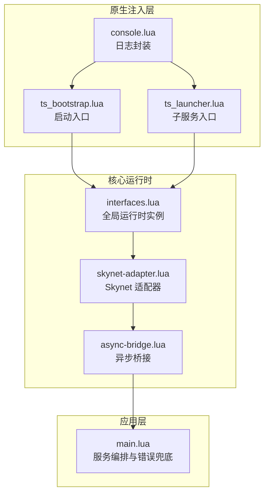
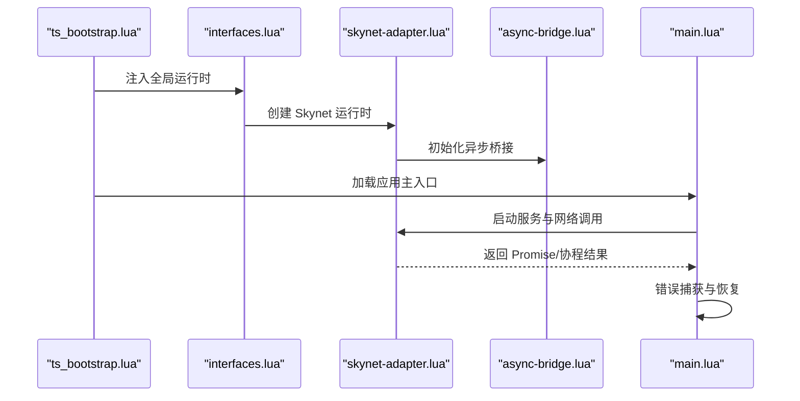
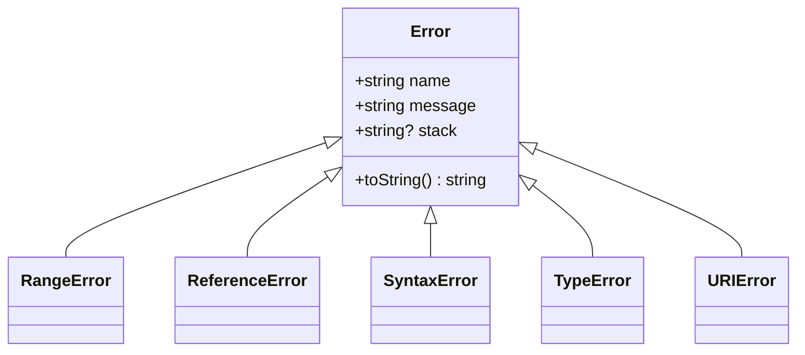
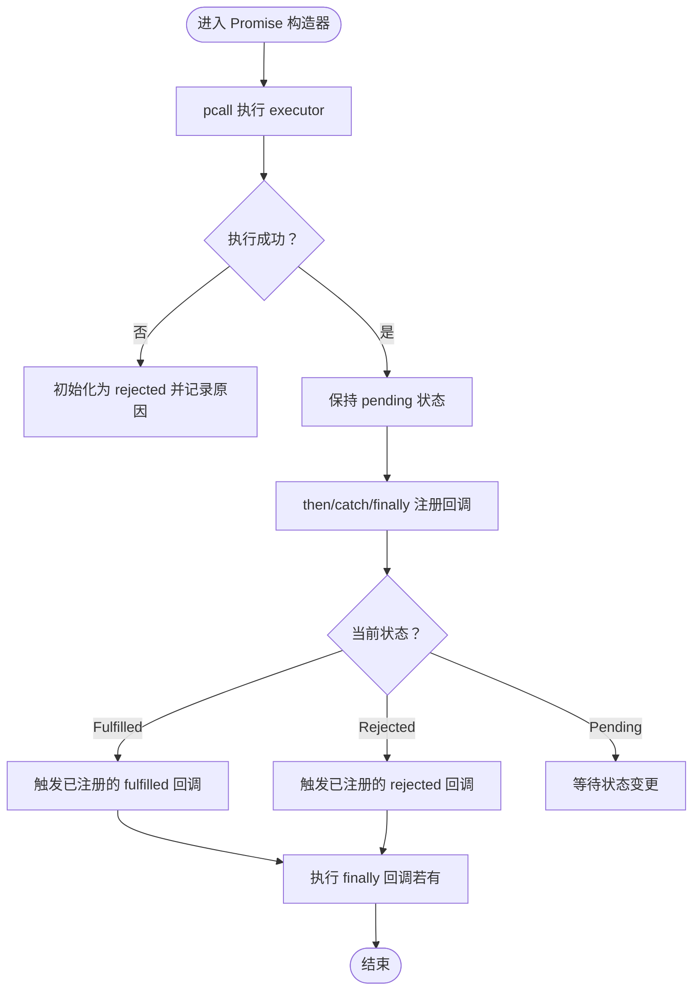
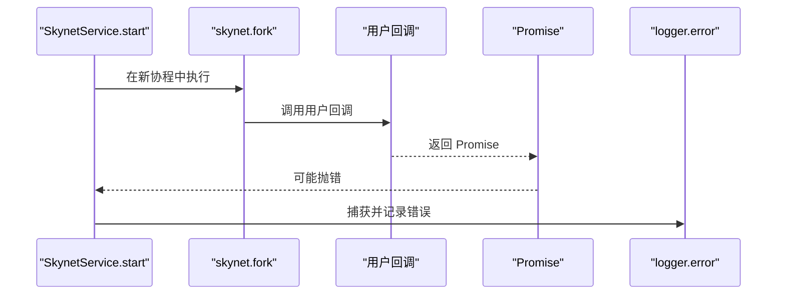
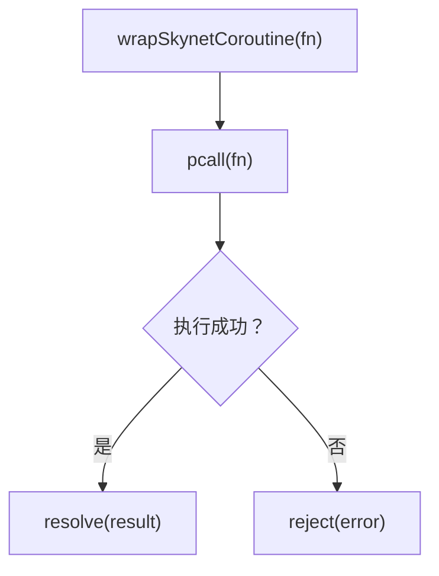
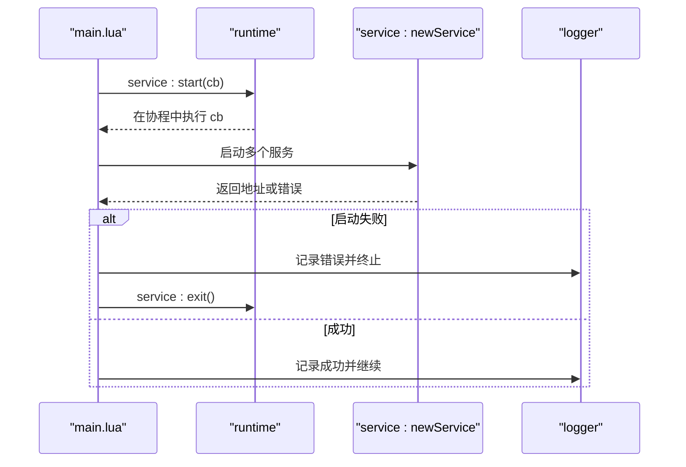
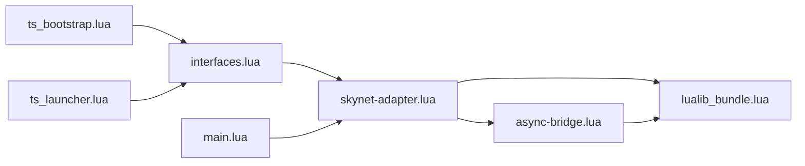

# 错误处理

<cite>
**本文引用的文件**
- [错误.ts](file://tool\TypeScriptToLua_skynet\src\lualib\Error.ts)
- [Promise.ts](file://tool\TypeScriptToLua_skynet\src\lualib\Promise.ts)
- [ts_bootstrap.lua](file://docker\native\ts_bootstrap.lua)
- [ts_launcher.lua](file://docker\native\ts_launcher.lua)
- [console.lua](file://docker\native\console.lua)
- [lualib_bundle.lua](file://docker\lua\lualib_bundle.lua)
- [skynet-adapter.lua](file://docker\lua\framework\runtime\skynet-adapter.lua)
- [async-bridge.lua](file://docker\lua\framework\runtime\async-bridge.lua)
- [main.lua](file://docker\lua\app\main.lua)
- [interfaces.lua](file://docker\lua\framework\core\interfaces.lua)
</cite>

## 目录
1. [简介](#简介)
2. [项目结构](#项目结构)
3. [核心组件](#核心组件)
4. [架构总览](#架构总览)
5. [详细组件分析](#详细组件分析)
6. [依赖关系分析](#依赖关系分析)
7. [性能考量](#性能考量)
8. [故障排查指南](#故障排查指南)
9. [结论](#结论)
10. [附录](#附录)

## 简介
本指南聚焦于在 Skynet 环境下进行错误处理与异常捕获的最佳实践，涵盖以下主题：
- 协程错误传播与恢复
- Promise 错误处理与链式调用
- 网络调用错误与服务间通信错误
- 错误分类与处理策略（同步、异步、网络）
- 错误日志记录与格式化
- TypeScriptToLua 转换中的错误一致性保障
- 实际案例与异常恢复策略

## 项目结构
本项目在容器化 Skynet 环境中运行，TypeScript 经由 TypeScriptToLua 转换为 Lua，并通过适配层桥接 Skynet 协程、定时器、网络与服务生命周期。错误处理涉及如下层次：
- 运行时适配层：封装 Skynet 的日志、定时器、网络与服务接口
- 异步桥接层：提供 Skynet 环境下的 Promise 实现与协程包装
- 核心运行时接口：统一注入全局运行时实例
- 应用主入口：服务编排与错误兜底
- 原生注入层：全局对象注入与启动流程

**图表来源**
- [ts_bootstrap.lua:1-33](file://docker\native\ts_bootstrap.lua#L1-L33)
- [ts_launcher.lua:1-26](file://docker\native\ts_launcher.lua#L1-L26)
- [console.lua:1-98](file://docker\native\console.lua#L1-L98)
- [interfaces.lua:1-24](file://docker\lua\framework\core\interfaces.lua#L1-L24)
- [skynet-adapter.lua:1-227](file://docker\lua\framework\runtime\skynet-adapter.lua#L1-L227)
- [async-bridge.lua:1-243](file://docker\lua\framework\runtime\async-bridge.lua#L1-L243)
- [main.lua:1-91](file://docker\lua\app\main.lua#L1-L91)

**章节来源**
- [ts_bootstrap.lua:1-33](file://docker\native\ts_bootstrap.lua#L1-L33)
- [ts_launcher.lua:1-26](file://docker\native\ts_launcher.lua#L1-L26)
- [console.lua:1-98](file://docker\native\console.lua#L1-L98)
- [interfaces.lua:1-24](file://docker\lua\framework\core\interfaces.lua#L1-L24)
- [skynet-adapter.lua:1-227](file://docker\lua\framework\runtime\skynet-adapter.lua#L1-L227)
- [async-bridge.lua:1-243](file://docker\lua\framework\runtime\async-bridge.lua#L1-L243)
- [main.lua:1-91](file://docker\lua\app\main.lua#L1-L91)

## 核心组件
- 错误类与堆栈：提供标准 JavaScript Error 类型与堆栈生成，兼容不同 Lua 版本
- Promise 实现：基于 pcall 的安全执行与回调链式传播
- Skynet 适配器：日志、定时器、网络、服务的统一封装
- 异步桥接：将 async/await 映射为协程，提供 Skynet 环境下的 Promise
- 控制台日志：格式化输出与 trace 支持
- 应用主入口：服务启动与错误兜底，确保异常不冒泡至系统级

**章节来源**
- [错误.ts:1-94](file://tool\TypeScriptToLua_skynet\src\lualib\Error.ts#L1-L94)
- [Promise.ts:1-246](file://tool\TypeScriptToLua_skynet\src\lualib\Promise.ts#L1-L246)
- [skynet-adapter.lua:1-227](file://docker\lua\framework\runtime\skynet-adapter.lua#L1-L227)
- [async-bridge.lua:1-243](file://docker\lua\framework\runtime\async-bridge.lua#L1-L243)
- [console.lua:1-98](file://docker\native\console.lua#L1-L98)
- [main.lua:1-91](file://docker\lua\app\main.lua#L1-L91)

## 架构总览
Skynet 环境下的错误处理遵循“捕获即恢复”的原则：任何异步或网络操作均通过 pcall 或适配器的错误处理机制包裹，避免异常向上传播导致服务崩溃；同时通过日志与 trace 提供可观测性。

**图表来源**
- [ts_bootstrap.lua:22-32](file://docker\native\ts_bootstrap.lua#L22-L32)
- [interfaces.lua:14-22](file://docker\lua\framework\core\interfaces.lua#L14-L22)
- [skynet-adapter.lua:205-225](file://docker\lua\framework\runtime\skynet-adapter.lua#L205-L225)
- [async-bridge.lua:206-224](file://docker\lua\framework\runtime\async-bridge.lua#L206-L224)
- [main.lua:75-89](file://docker\lua\app\main.lua#L75-L89)

## 详细组件分析

### 错误类与堆栈（Error）
- 功能要点
  - 标准化错误类型：Error、RangeError、ReferenceError、SyntaxError、TypeError、URIError
  - 堆栈生成：兼容 Lua 5.0/5.1/LuaJIT，按调用层级截取
  - toString 扩展：在特定上下文中附加堆栈信息
- 设计模式
  - 工厂函数创建派生错误类
  - 元表劫持 __tostring 实现条件化堆栈输出
- 复杂度
  - 堆栈生成为线性复杂度 O(n)，n 为调用层级
- 错误处理策略
  - 优先捕获并记录，再决定是否抛出
  - 在日志中保留堆栈以便定位

**图表来源**
- [错误.ts:52-94](file://tool\TypeScriptToLua_skynet\src\lualib\Error.ts#L52-L94)

**章节来源**
- [错误.ts:1-94](file://tool\TypeScriptToLua_skynet\src\lualib\Error.ts#L1-L94)

### Promise 实现与错误传播（Promise）
- 功能要点
  - 基于 pcall 的构造器与回调执行，确保异常被捕获
  - then/catch/finally 链式传播，支持尾调优化
  - 回调返回值与 PromiseLike 的透传
- 错误传播路径
  - executor 抛错 → reject
  - 回调抛错 → reject
  - 子 Promise 状态透传 → 父 Promise
- 性能特性
  - 尾调优化减少中间态开销
  - 内部数组存储回调，按需触发

**图表来源**
- [Promise.ts:74-86](file://tool\TypeScriptToLua_skynet\src\lualib\Promise.ts#L74-L86)
- [Promise.ts:88-103](file://tool\TypeScriptToLua_skynet\src\lualib\Promise.ts#L88-L103)
- [Promise.ts:106-137](file://tool\TypeScriptToLua_skynet\src\lualib\Promise.ts#L106-L137)
- [Promise.ts:139-167](file://tool\TypeScriptToLua_skynet\src\lualib\Promise.ts#L139-L167)

**章节来源**
- [Promise.ts:1-246](file://tool\TypeScriptToLua_skynet\src\lualib\Promise.ts#L1-L246)

### Skynet 适配器（日志、定时器、网络、服务）
- 日志（SkynetLogger）
  - 统一前缀与时间戳格式
  - 参数序列化为字符串，表格转 JSON
- 定时器（SkynetTimer）
  - setTimeout/clearTimeout：毫秒换算为厘秒
  - sleep：返回 Promise，内部使用 skynet.timeout
  - safeTimeout/safeImmediate：在独立协程中执行，捕获 Promise 错误
- 网络（SkynetNetwork）
  - send/call：封装 skynet.send/call
  - dispatch：注册消息处理器，自动捕获 Promise 错误
  - ret：返回包封装
- 服务（SkynetService）
  - start：在 skynet.start 中 fork 协程，捕获 Promise 错误
  - newService/self/getenv/setenv：服务生命周期与环境变量

**图表来源**
- [skynet-adapter.lua:174-184](file://docker\lua\framework\runtime\skynet-adapter.lua#L174-L184)
- [skynet-adapter.lua:117-123](file://docker\lua\framework\runtime\skynet-adapter.lua#L117-L123)

**章节来源**
- [skynet-adapter.lua:1-227](file://docker\lua\framework\runtime\skynet-adapter.lua#L1-L227)

### 异步桥接（协程与 Promise）
- SkynetPromise
  - 与 __TS__Promise 类似，但针对 Skynet 环境
  - pcall 包裹 executor 与回调，避免异常冒泡
  - then/catch/all：串行与并行组合
- wrapSkynetCoroutine
  - 将任意函数包裹为 Promise，捕获异常并拒绝
- sleep
  - 在 Node 与 Skynet 环境分别使用不同实现

**图表来源**
- [async-bridge.lua:206-224](file://docker\lua\framework\runtime\async-bridge.lua#L206-L224)

**章节来源**
- [async-bridge.lua:1-243](file://docker\lua\framework\runtime\async-bridge.lua#L1-L243)

### 控制台日志与格式化（Console）
- 格式化规则
  - 表格序列化：键值拼接，字符串加引号
  - 基本类型：直接转换为字符串
  - 时间测量：time/timeEnd 记录毫秒差
- trace 输出：使用 debug.traceback 获取调用栈
- 与 Skynet 集成：统一通过 skynet.error 输出

**章节来源**
- [console.lua:1-98](file://docker\native\console.lua#L1-L98)

### 应用主入口（错误兜底）
- 服务编排：逐个启动服务，失败时记录并终止
- 错误兜底：bootstrap():catch 捕获启动阶段异常并退出
- 保活：周期性日志与递归 keepAlive

**图表来源**
- [main.lua:14-64](file://docker\lua\app\main.lua#L14-L64)
- [main.lua:75-89](file://docker\lua\app\main.lua#L75-L89)

**章节来源**
- [main.lua:1-91](file://docker\lua\app\main.lua#L1-L91)

## 依赖关系分析
- 运行时注入
  - ts_bootstrap.lua 与 ts_launcher.lua 注入全局对象并设置运行时
  - interfaces.lua 提供全局运行时实例，避免模块缓存导致的不可变问题
- 适配层依赖
  - skynet-adapter.lua 依赖 lualib_bundle.lua 中的 __TS__Promise 与工具函数
  - async-bridge.lua 同样依赖 lualib_bundle.lua 的协程与 Promise 实现
- 应用层依赖
  - main.lua 通过 runtime 接口访问日志、定时器、网络与服务

**图表来源**
- [ts_bootstrap.lua:22-24](file://docker\native\ts_bootstrap.lua#L22-L24)
- [ts_launcher.lua:18-20](file://docker\native\ts_launcher.lua#L18-L20)
- [interfaces.lua:14-22](file://docker\lua\framework\core\interfaces.lua#L14-L22)
- [skynet-adapter.lua:1-12](file://docker\lua\framework\runtime\skynet-adapter.lua#L1-L12)
- [async-bridge.lua:1-14](file://docker\lua\framework\runtime\async-bridge.lua#L1-L14)
- [main.lua:9-10](file://docker\lua\app\main.lua#L9-L10)

**章节来源**
- [ts_bootstrap.lua:1-33](file://docker\native\ts_bootstrap.lua#L1-L33)
- [ts_launcher.lua:1-26](file://docker\native\ts_launcher.lua#L1-L26)
- [interfaces.lua:1-24](file://docker\lua\framework\core\interfaces.lua#L1-L24)
- [skynet-adapter.lua:1-227](file://docker\lua\framework\runtime\skynet-adapter.lua#L1-L227)
- [async-bridge.lua:1-243](file://docker\lua\framework\runtime\async-bridge.lua#L1-L243)
- [main.lua:1-91](file://docker\lua\app\main.lua#L1-L91)

## 性能考量
- pcall 使用：在 Promise 构造器与回调中广泛使用 pcall，避免异常中断协程链路，带来稳定的吞吐
- 尾调优化：Promise 回调链末端直接调用，减少中间态与栈帧
- 延迟捕获：dispatch/start 中对 Promise 的错误捕获延迟到协程外层，避免阻塞主循环
- 日志格式化：console 的格式化逻辑避免深度嵌套表格带来的性能损耗

[本节为通用指导，无需列出具体文件来源]

## 故障排查指南
- 常见错误类型与处理策略
  - 同步错误：在构造器与回调中使用 pcall 包裹，确保立即捕获并记录
  - 异步错误：通过 Promise 链式 catch 或 SkynetPromise 的错误回调处理
  - 网络错误：在 dispatch/call 中捕获 Promise 错误，记录并上报
- 日志与追踪
  - 使用 console.trace 输出调用栈
  - SkynetLogger 自动添加时间戳与前缀，便于检索
- 恢复策略
  - 服务启动失败：记录错误后调用 service:exit() 优雅退出
  - 定时任务失败：safeTimeout 在独立协程中执行，避免影响主线程
  - 网络调用失败：在 dispatch 中统一 catch，防止异常扩散

**章节来源**
- [skynet-adapter.lua:117-123](file://docker\lua\framework\runtime\skynet-adapter.lua#L117-L123)
- [skynet-adapter.lua:148-163](file://docker\lua\framework\runtime\skynet-adapter.lua#L148-L163)
- [main.lua:36-42](file://docker\lua\app\main.lua#L36-L42)

## 结论
本项目在 Skynet 环境下通过“捕获即恢复”的策略实现了稳健的错误处理体系：以 pcall 与 Promise 链为基础，结合适配器的日志、定时器、网络与服务封装，确保异常不会导致服务崩溃；配合 console 的格式化与 trace 能力，提供良好的可观测性。在 TypeScriptToLua 转换过程中，通过统一的运行时接口与桥接层，保证了错误处理的一致性与有效性。

[本节为总结性内容，无需列出具体文件来源]

## 附录

### TypeScriptToLua 转换中的错误一致性
- 运行时接口
  - interfaces.lua 提供全局运行时实例，避免模块缓存导致的不可变问题
- 适配层
  - skynet-adapter.lua 与 async-bridge.lua 将 TypeScript 的 Promise/async/await 映射为 Skynet 的协程与 Promise
- 原生注入
  - ts_bootstrap.lua 与 ts_launcher.lua 注入全局对象并设置运行时，确保错误处理在统一环境中生效

**章节来源**
- [interfaces.lua:14-22](file://docker\lua\framework\core\interfaces.lua#L14-L22)
- [skynet-adapter.lua:205-225](file://docker\lua\framework\runtime\skynet-adapter.lua#L205-L225)
- [async-bridge.lua:206-224](file://docker\lua\framework\runtime\async-bridge.lua#L206-L224)
- [ts_bootstrap.lua:22-24](file://docker\native\ts_bootstrap.lua#L22-L24)
- [ts_launcher.lua:18-20](file://docker\native\ts_launcher.lua#L18-L20)