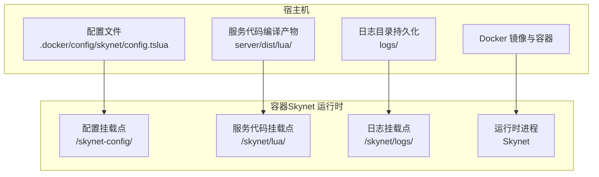
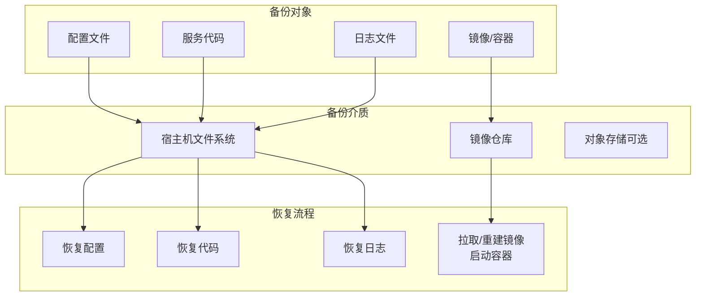
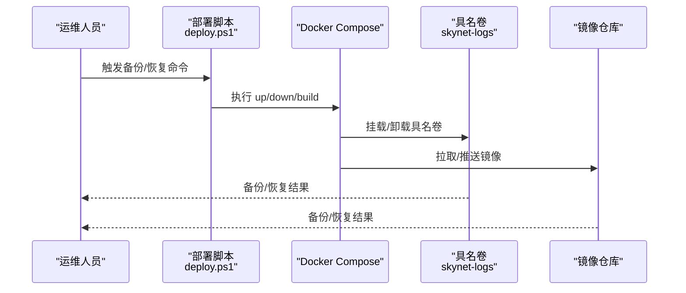
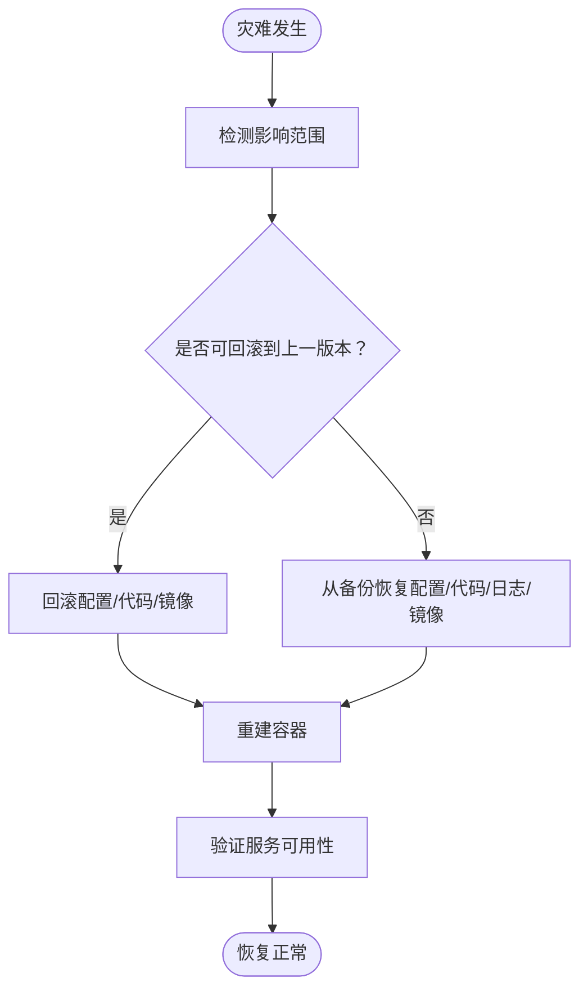
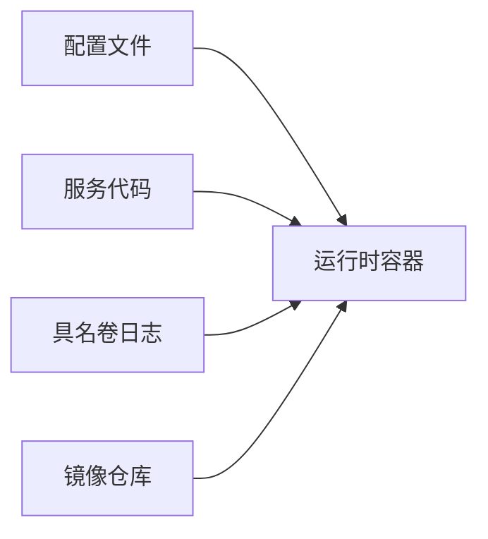

# 备份恢复

<cite>
**本文引用的文件**
- [compose.yml](file://docker/compose.yml)
- [Dockerfile（运行时）](file://docker/skynet-runtime/Dockerfile)
- [Dockerfile（服务器）](file://server/Dockerfile)
- [daemon.json](file://docker/daemon.json)
- [tslua.config.yaml](file://tslua.config.yaml)
- [deploy.ps1](file://docker/scripts/deploy.ps1)
- [deploy.bat](file://docker/scripts/deploy.bat)
- [Windows Docker 部署指南.md](file://docs/Windows Docker 部署指南.md)
- [config.tslua（容器）](file://docker/config/skynet/config.tslua)
- [config.tslua（服务端）](file://server/config/skynet/config.tslua)
- [start.sh（通用）](file://start.sh)
- [start.sh（服务端）](file://server/start.sh)
</cite>

## 目录
1. [简介](#简介)
2. [项目结构](#项目结构)
3. [核心组件](#核心组件)
4. [架构总览](#架构总览)
5. [详细组件分析](#详细组件分析)
6. [依赖关系分析](#依赖关系分析)
7. [性能考量](#性能考量)
8. [故障排查指南](#故障排查指南)
9. [结论](#结论)
10. [附录](#附录)

## 简介
本指南面向运维与开发团队，提供一套完整的备份与恢复操作方法论，覆盖数据库备份、配置文件备份、日志文件备份、容器与镜像备份、以及灾难恢复计划与验证测试流程。结合项目现有的 Docker Compose 与部署脚本，明确各层级备份对象、备份介质、恢复步骤与验证手段，确保在发生故障或灾难时能够快速、可重复地恢复业务。

## 项目结构
本项目采用容器化部署，核心运行时由 Skynet 运行时镜像提供，服务代码通过挂载或复制方式注入容器；日志通过具名卷持久化；配置文件通过只读挂载注入容器。下图展示与备份恢复相关的关键结构与路径映射：

图表来源
- [compose.yml:11-28](file://docker/compose.yml#L11-L28)
- [config.tslua（容器）:1-54](file://docker/config/skynet/config.tslua#L1-L54)

章节来源
- [compose.yml:1-70](file://docker/compose.yml#L1-L70)
- [Windows Docker 部署指南.md:116-140](file://docs/Windows Docker 部署指南.md#L116-L140)

## 核心组件
- 配置文件
  - 容器配置：位于 docker/config/skynet/config.tslua，通过只读挂载注入容器，是运行时行为的关键。
  - 服务端配置：位于 server/config/skynet/config.tslua，用于本地/CI 环境的配置模板或参考。
- 服务代码
  - 开发模式：通过挂载 server/dist/lua/ 到容器 /skynet/lua/ 实现热更新。
  - 生产模式：通过复制编译产物到 docker/lua/ 并随镜像分发。
- 日志
  - 通过具名卷 skynet-logs 持久化到宿主机，便于备份与审计。
- 镜像与容器
  - 运行时镜像：docker/skynet-runtime/Dockerfile。
  - 服务器镜像：server/Dockerfile（包含工具链与 SSH 等）。
- 部署与运维
  - Windows 部署脚本：docker/scripts/deploy.ps1 与 docker/scripts/deploy.bat。
  - 通用启动脚本：start.sh（通用）与 server/start.sh（服务端）。

章节来源
- [config.tslua（容器）:1-54](file://docker/config/skynet/config.tslua#L1-L54)
- [config.tslua（服务端）:1-54](file://server/config/skynet/config.tslua#L1-L54)
- [compose.yml:11-28](file://docker/compose.yml#L11-L28)
- [Dockerfile（运行时）:65-72](file://docker/skynet-runtime/Dockerfile#L65-L72)
- [Dockerfile（服务器）:1-51](file://server/Dockerfile#L1-L51)
- [deploy.ps1:1-430](file://docker/scripts/deploy.ps1#L1-L430)
- [deploy.bat:1-58](file://docker/scripts/deploy.bat#L1-L58)
- [start.sh（通用）:1-7](file://start.sh#L1-L7)
- [start.sh（服务端）:1-66](file://server/start.sh#L1-L66)

## 架构总览
下图展示容器化部署与备份恢复相关的交互关系，强调“配置—代码—日志—镜像”的备份对象与恢复路径。

图表来源
- [compose.yml:11-28](file://docker/compose.yml#L11-L28)
- [Dockerfile（运行时）:65-72](file://docker/skynet-runtime/Dockerfile#L65-L72)
- [Dockerfile（服务器）:1-51](file://server/Dockerfile#L1-L51)

## 详细组件分析

### 数据备份策略
- 配置文件备份
  - 对象：docker/config/skynet/config.tslua 与 server/config/skynet/config.tslua。
  - 方法：定期归档至版本化存储，建议纳入 CI/CD 的工件备份。
  - 关键点：容器内配置通过只读挂载，恢复时需保持挂载路径与权限一致。
- 服务代码备份
  - 对象：server/dist/lua/（开发模式挂载）与 docker/lua/（生产镜像包含）。
  - 方法：对 docker/lua/ 进行差异备份；开发模式下可直接备份宿主机 server/dist/lua/。
- 日志文件备份
  - 对象：具名卷 skynet-logs 挂载的 /skynet/logs/。
  - 方法：定期 tar/zip 归档至安全存储；建议保留最近 N 天的日志以便回溯。
- 数据库备份（概念性说明）
  - 若项目集成数据库，应遵循数据库厂商的备份策略（逻辑/物理、增量/全量、校验与恢复演练）。
  - 本仓库未包含数据库实现，此处为通用指导。

章节来源
- [config.tslua（容器）:1-54](file://docker/config/skynet/config.tslua#L1-L54)
- [config.tslua（服务端）:1-54](file://server/config/skynet/config.tslua#L1-L54)
- [compose.yml:20-28](file://docker/compose.yml#L20-L28)
- [Dockerfile（运行时）:65-72](file://docker/skynet-runtime/Dockerfile#L65-L72)

### 容器备份与恢复方法
- 具名卷备份（日志与状态）
  - 使用 docker cp 或备份工具对 skynet-logs 进行归档。
  - 恢复时将归档内容还原到同名具名卷挂载点，或通过新具名卷挂载到相同容器路径。
- 镜像备份与恢复
  - 备份：docker save 或 docker image export。
  - 恢复：docker load 或 docker image import；随后使用 docker-compose up 启动。
- 容器快照（概念性说明）
  - Docker 原生不提供容器快照；可通过镜像层快照（构建缓存）与具名卷备份实现近似效果。
  - 本项目通过多阶段构建与具名卷实现可重复构建与日志持久化。

图表来源
- [deploy.ps1:175-211](file://docker/scripts/deploy.ps1#L175-L211)
- [compose.yml:68-70](file://docker/compose.yml#L68-L70)

章节来源
- [compose.yml:68-70](file://docker/compose.yml#L68-L70)
- [deploy.ps1:175-211](file://docker/scripts/deploy.ps1#L175-L211)

### 配置备份的重要性与保护
- 运行时配置
  - 容器配置文件决定线程数、启动模块、日志输出、守护进程等关键行为。
  - 建议对 config.tslua 进行版本化管理与变更审批。
- 环境变量
  - 通过 compose.yml 的 environment 字段注入（如时区、配置文件路径），恢复时需保持一致。
- 密钥文件
  - 本项目未内置密钥管理；若引入密钥，建议使用机密管理工具（如 KMS/密钥库）与只读挂载，避免写入镜像。
- 变更流程
  - 任何配置变更均需在受控环境中验证，再通过部署脚本应用。

章节来源
- [config.tslua（容器）:6-41](file://docker/config/skynet/config.tslua#L6-L41)
- [compose.yml:29-31](file://docker/compose.yml#L29-L31)

### 灾难恢复计划
- 数据恢复流程
  - 优先恢复配置文件与服务代码，再恢复日志与镜像。
  - 使用版本化配置与代码，确保可回滚到上一稳定版本。
- 服务重建
  - 通过 docker-compose up 重建容器；若镜像不可用，先从镜像仓库拉取或本地导入。
- 业务连续性保障
  - 通过多阶段构建与具名卷持久化，缩短恢复时间。
  - 建议在不同区域/云上保留镜像与日志副本，提升容灾能力。

图表来源
- [compose.yml:6-62](file://docker/compose.yml#L6-L62)
- [Dockerfile（运行时）:65-91](file://docker/skynet-runtime/Dockerfile#L65-L91)

章节来源
- [compose.yml:6-62](file://docker/compose.yml#L6-L62)
- [Dockerfile（运行时）:65-91](file://docker/skynet-runtime/Dockerfile#L65-L91)

### 备份验证与恢复测试
- 验证清单
  - 配置文件完整性与语法正确性。
  - 服务代码与镜像一致性（版本号/哈希）。
  - 日志可读性与时间范围。
  - 容器启动与健康检查。
- 测试流程
  - 在隔离环境执行“离线恢复”演练：拉取镜像、恢复具名卷、启动容器、端到端连通性测试。
  - 使用部署脚本的 status/logs 能力进行自动化验证。
- 回归测试
  - 恢复后执行最小化回归测试（登录、网关、游戏服务），确保业务功能正常。

章节来源
- [deploy.ps1:299-327](file://docker/scripts/deploy.ps1#L299-L327)
- [start.sh（服务端）:35-37](file://server/start.sh#L35-L37)

## 依赖关系分析
- 组件耦合
  - 配置文件与容器运行时强耦合（只读挂载）。
  - 服务代码与容器路径映射（/skynet/lua/）强耦合。
  - 日志与具名卷（skynet-logs）强耦合。
- 外部依赖
  - Docker 与 Docker Compose。
  - 镜像仓库（私有/公有）。
  - 对象存储（可选，用于长期归档）。

图表来源
- [compose.yml:11-28](file://docker/compose.yml#L11-L28)
- [compose.yml:68-70](file://docker/compose.yml#L68-L70)

章节来源
- [compose.yml:11-28](file://docker/compose.yml#L11-L28)
- [compose.yml:68-70](file://docker/compose.yml#L68-L70)

## 性能考量
- 多阶段构建
  - 运行时镜像仅包含运行所需文件，减小镜像体积，提升拉取与启动速度。
- 具名卷与日志
  - 将日志持久化到具名卷，避免日志写入容器层导致性能下降。
- 构建缓存
  - daemon.json 中配置了构建缓存保留策略，有助于加速重复构建。

章节来源
- [Dockerfile（运行时）:37-91](file://docker/skynet-runtime/Dockerfile#L37-L91)
- [daemon.json:1-17](file://docker/daemon.json#L1-L17)

## 故障排查指南
- 常见问题定位
  - 配置文件缺失：容器启动脚本会检查配置文件是否存在，若不存在则退出。
  - 端口冲突：修改 compose.yml 中的端口映射。
  - 权限错误：以管理员身份运行 PowerShell。
- 快速诊断
  - 使用部署脚本 status/logs 查看容器状态与日志尾部。
  - 使用 shell 进入容器检查挂载点与进程状态。

章节来源
- [Dockerfile（运行时）:77-86](file://docker/skynet-runtime/Dockerfile#L77-L86)
- [deploy.ps1:101-143](file://docker/scripts/deploy.ps1#L101-L143)
- [deploy.ps1:299-327](file://docker/scripts/deploy.ps1#L299-L327)
- [deploy.ps1:371-386](file://docker/scripts/deploy.ps1#L371-L386)

## 结论
通过将配置、代码、日志与镜像进行分层备份，并结合具名卷与多阶段构建的优势，本项目可在发生故障时快速恢复。建议将备份纳入自动化流程，定期演练恢复测试，确保业务连续性与数据安全。

## 附录
- 快速命令参考
  - 启动开发/生产容器、查看状态、查看日志、进入容器 Shell、清理环境等，详见部署脚本与文档。
- 路径映射参考
  - Windows 路径与容器路径映射、日志挂载点、配置挂载点，详见部署指南与 compose.yml。

章节来源
- [Windows Docker 部署指南.md:88-114](file://docs/Windows Docker 部署指南.md#L88-L114)
- [Windows Docker 部署指南.md:116-140](file://docs/Windows Docker 部署指南.md#L116-L140)
- [compose.yml:11-28](file://docker/compose.yml#L11-L28)