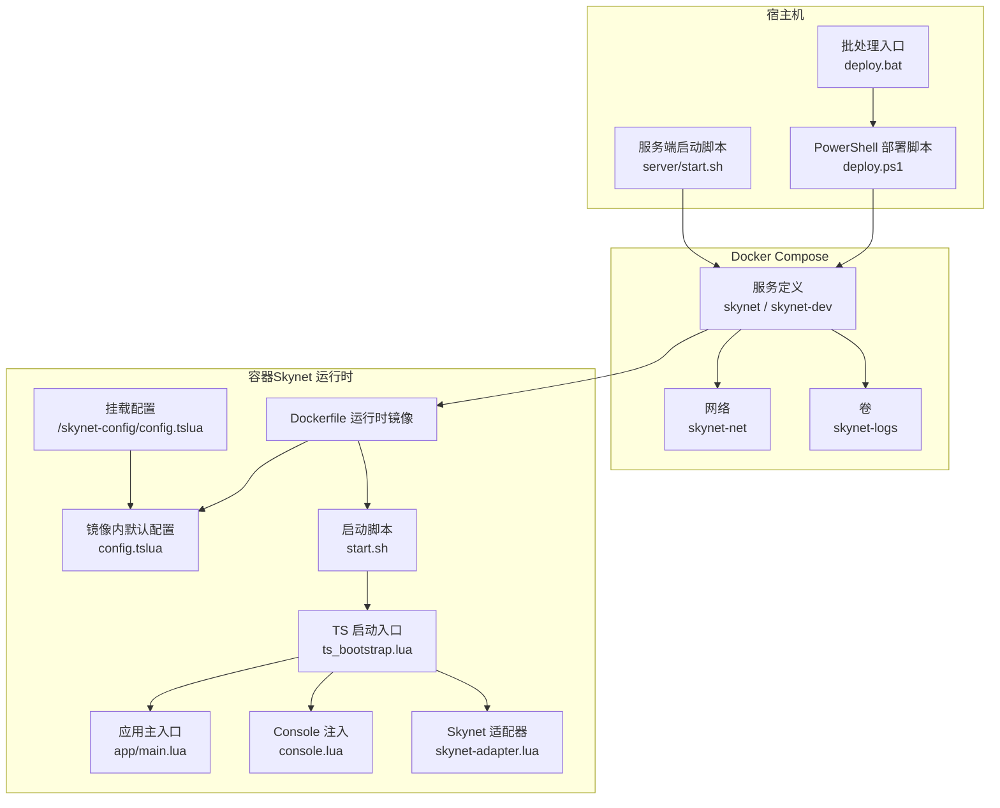
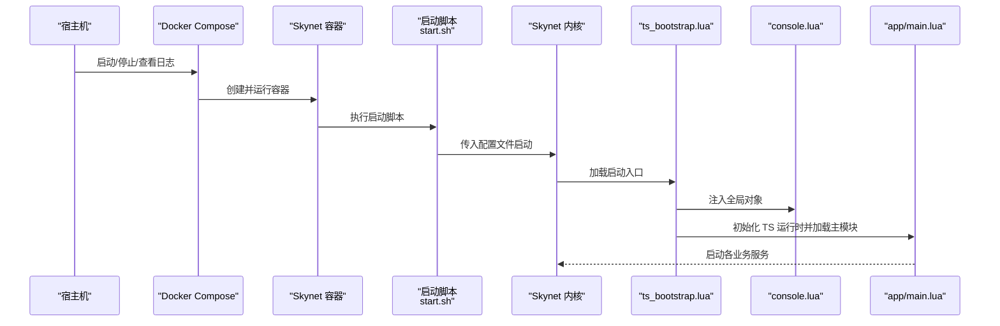
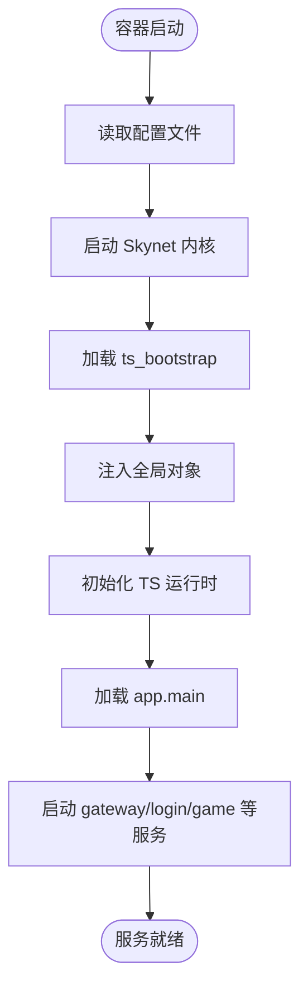
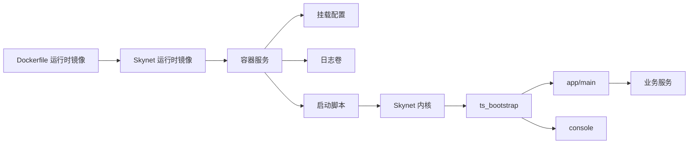

# 故障排查

<cite>
**本文引用的文件**
- [compose.yml](file://docker/compose.yml)
- [Dockerfile（运行时镜像）](file://docker/skynet-runtime/Dockerfile)
- [Skynet 默认配置（镜像内）](file://docker/skynet-runtime/config.tslua)
- [Skynet 容器配置（挂载卷）](file://docker/config/skynet/config.tslua)
- [TS 启动入口（ts_bootstrap）](file://docker/native/ts_bootstrap.lua)
- [控制台注入（console）](file://docker/native/console.lua)
- [应用主入口（main.lua）](file://docker/lua/app/main.lua)
- [Skynet 适配器（运行时）](file://docker/lua/framework/runtime/skynet-adapter.lua)
- [Windows 部署脚本（PowerShell）](file://docker/scripts/deploy.ps1)
- [Windows 部署脚本（批处理）](file://docker/scripts/deploy.bat)
- [服务端启动脚本（start.sh）](file://server/start.sh)
</cite>

## 目录
1. [简介](#简介)
2. [项目结构](#项目结构)
3. [核心组件](#核心组件)
4. [架构总览](#架构总览)
5. [详细组件分析](#详细组件分析)
6. [依赖关系分析](#依赖关系分析)
7. [性能考量](#性能考量)
8. [故障排查指南](#故障排查指南)
9. [结论](#结论)
10. [附录](#附录)

## 简介
本手册面向运维与开发人员，提供基于本仓库的系统化故障排查流程与实操指引。内容覆盖问题分类、症状分析、根因定位、日志分析技巧、调试工具使用（SSH/容器 Shell/远程调试）、常见问题排查（服务无法启动、连接超时、内存泄漏、性能下降）以及最佳实践与预防措施。

## 项目结构
该系统采用 Docker 容器化部署，Skynet 运行时镜像由项目自带的 skynet 源码编译而来；应用层通过 TypeScript 编译为 Lua 后挂载至容器内运行。核心结构要点：
- 容器镜像与运行时：基于 Ubuntu 22.04，编译并打包 Skynet 与 lua-protobuf，暴露游戏端口与调试端口。
- 配置管理：镜像内提供默认配置，生产环境通过卷挂载覆盖容器内的配置文件。
- 应用入口：容器启动后由 ts_bootstrap 注入全局对象、初始化 TS 运行时并加载 app.main。
- 日志策略：默认输出到 stdout，便于 docker logs 查看；支持日志级别与守护进程关闭（Docker 必须）。
- 部署与调试：提供 Windows 下的 PowerShell/批处理部署脚本，支持启动/停止/查看日志/进入 Shell/热更新等操作。

**图示来源**
- [compose.yml:6-70](file://docker/compose.yml#L6-L70)
- [Dockerfile（运行时镜像）:40-91](file://docker/skynet-runtime/Dockerfile#L40-L91)
- [Skynet 默认配置（镜像内）:1-35](file://docker/skynet-runtime/config.tslua#L1-L35)
- [Skynet 容器配置（挂载卷）:1-54](file://docker/config/skynet/config.tslua#L1-L54)
- [TS 启动入口（ts_bootstrap）:1-33](file://docker/native/ts_bootstrap.lua#L1-L33)
- [控制台注入（console）:1-98](file://docker/native/console.lua#L1-L98)
- [应用主入口（main.lua）:1-91](file://docker/lua/app/main.lua#L1-L91)
- [Skynet 适配器（运行时）:1-227](file://docker/lua/framework/runtime/skynet-adapter.lua#L1-L227)

**章节来源**
- [compose.yml:6-70](file://docker/compose.yml#L6-L70)
- [Dockerfile（运行时镜像）:40-91](file://docker/skynet-runtime/Dockerfile#L40-L91)
- [Skynet 默认配置（镜像内）:1-35](file://docker/skynet-runtime/config.tslua#L1-L35)
- [Skynet 容器配置（挂载卷）:1-54](file://docker/config/skynet/config.tslua#L1-L54)
- [TS 启动入口（ts_bootstrap）:1-33](file://docker/native/ts_bootstrap.lua#L1-L33)
- [控制台注入（console）:1-98](file://docker/native/console.lua#L1-L98)
- [应用主入口（main.lua）:1-91](file://docker/lua/app/main.lua#L1-L91)
- [Skynet 适配器（运行时）:1-227](file://docker/lua/framework/runtime/skynet-adapter.lua#L1-L227)

## 核心组件
- 容器与镜像
  - 运行时镜像基于 Ubuntu 22.04，编译 Skynet 与 lua-protobuf，暴露 8888（游戏端口）、9999（调试/管理端口），默认不启用守护进程，日志输出到 stdout。
- 配置体系
  - 镜像内默认配置文件提供线程数、启动模块、Lua/C 服务路径、日志输出、守护进程等基础项；生产环境通过卷挂载覆盖容器内配置。
- 应用启动链路
  - 容器启动脚本读取配置文件并执行 skynet；ts_bootstrap 注入全局对象、初始化 TS 运行时、加载 app.main；app.main 启动 gateway/login/game 等服务。
- 日志与可观测性
  - 默认输出到 stdout，便于 docker logs 查看；console 提供 Node.js 风格的日志 API；Skynet 适配器封装了日志格式与级别。
- 部署与调试工具
  - Windows 提供 PowerShell/批处理脚本，支持构建镜像、启动/停止/重启、查看状态/日志、进入容器 Shell、部署代码、热更新等。

**章节来源**
- [Dockerfile（运行时镜像）:40-91](file://docker/skynet-runtime/Dockerfile#L40-L91)
- [Skynet 默认配置（镜像内）:1-35](file://docker/skynet-runtime/config.tslua#L1-L35)
- [Skynet 容器配置（挂载卷）:1-54](file://docker/config/skynet/config.tslua#L1-L54)
- [TS 启动入口（ts_bootstrap）:1-33](file://docker/native/ts_bootstrap.lua#L1-L33)
- [应用主入口（main.lua）:1-91](file://docker/lua/app/main.lua#L1-L91)
- [控制台注入（console）:1-98](file://docker/native/console.lua#L1-L98)
- [Skynet 适配器（运行时）:1-227](file://docker/lua/framework/runtime/skynet-adapter.lua#L1-L227)
- [Windows 部署脚本（PowerShell）:1-430](file://docker/scripts/deploy.ps1#L1-L430)
- [Windows 部署脚本（批处理）:1-58](file://docker/scripts/deploy.bat#L1-L58)
- [服务端启动脚本（start.sh）:1-66](file://server/start.sh#L1-L66)

## 架构总览
下图展示容器启动到应用服务启动的关键交互：

**图示来源**
- [compose.yml:6-70](file://docker/compose.yml#L6-L70)
- [Dockerfile（运行时镜像）:77-91](file://docker/skynet-runtime/Dockerfile#L77-L91)
- [Skynet 默认配置（镜像内）:1-35](file://docker/skynet-runtime/config.tslua#L1-L35)
- [Skynet 容器配置（挂载卷）:1-54](file://docker/config/skynet/config.tslua#L1-L54)
- [TS 启动入口（ts_bootstrap）:1-33](file://docker/native/ts_bootstrap.lua#L1-L33)
- [控制台注入（console）:1-98](file://docker/native/console.lua#L1-L98)
- [应用主入口（main.lua）:1-91](file://docker/lua/app/main.lua#L1-L91)

## 详细组件分析

### 组件一：容器与镜像（Docker）
- 关键点
  - 运行时镜像基于 Ubuntu 22.04，仅安装运行时依赖；编译 Skynet 与 lua-protobuf 并打包进镜像；暴露 8888/9999 端口；默认不启用守护进程，日志输出到 stdout。
  - 开发/生产两种容器配置：开发容器通过卷挂载代码与配置，便于热更新；生产容器将代码与配置打包进镜像。
- 常见故障与定位
  - 镜像构建失败：检查编译依赖与网络；确认 Skynet 源码路径与权限。
  - 容器无法启动：检查配置文件是否存在、路径是否正确、端口是否被占用。
  - 日志为空：确认日志输出到 stdout 且未被容器日志驱动覆盖。

**章节来源**
- [Dockerfile（运行时镜像）:40-91](file://docker/skynet-runtime/Dockerfile#L40-L91)
- [compose.yml:6-70](file://docker/compose.yml#L6-L70)

### 组件二：配置体系（Skynet）
- 关键点
  - 镜像内默认配置提供线程数、启动模块、Lua/C 服务路径、日志输出、守护进程等；生产环境通过卷挂载覆盖容器内配置。
  - 容器内默认配置将 logger 设为 nil（输出到 stdout），daemon 设为 nil（关闭守护进程），harbor=0（单节点）。
- 常见故障与定位
  - 配置未生效：确认卷挂载路径与文件名一致；确认容器内工作目录为 /skynet。
  - 端口冲突：修改 compose.yml 中的端口映射或宿主机端口。
  - 日志级别：可在挂载配置中设置 loglevel（如 debug/info/warn/error）。

**章节来源**
- [Skynet 默认配置（镜像内）:1-35](file://docker/skynet-runtime/config.tslua#L1-L35)
- [Skynet 容器配置（挂载卷）:1-54](file://docker/config/skynet/config.tslua#L1-L54)
- [compose.yml:20-62](file://docker/compose.yml#L20-L62)

### 组件三：应用启动链路（ts_bootstrap → app.main）
- 关键点
  - ts_bootstrap 注入全局对象（console、process、global、Date 等），初始化 TS 运行时，加载 app.main。
  - app.main 启动 gateway/login/game 服务，记录启动日志与服务地址。
- 常见故障与定位
  - 启动失败：查看 Skynet 错误日志（stdout）；检查 ts_bootstrap 是否成功加载；确认 app.main 中的服务路径与数量配置。
  - 服务未启动：检查 app.main 的服务配置列表与启动顺序；确认服务模块存在且可加载。

**图示来源**
- [TS 启动入口（ts_bootstrap）:1-33](file://docker/native/ts_bootstrap.lua#L1-L33)
- [应用主入口（main.lua）:1-91](file://docker/lua/app/main.lua#L1-L91)

**章节来源**
- [TS 启动入口（ts_bootstrap）:1-33](file://docker/native/ts_bootstrap.lua#L1-L33)
- [应用主入口（main.lua）:1-91](file://docker/lua/app/main.lua#L1-L91)

### 组件四：日志与可观测性（console、适配器、容器）
- 关键点
  - console 提供 Node.js 风格的日志 API（log/info/debug/warn/error/trace），内部统一通过 skynet.error 输出。
  - Skynet 适配器封装日志级别、时间戳与参数格式化；默认输出到 stdout。
  - 容器默认关闭守护进程，日志输出到 stdout，便于 docker logs 查看。
- 常见故障与定位
  - 无日志：确认容器未关闭守护进程、日志输出到 stdout；使用 docker logs 或部署脚本 logs 子命令查看。
  - 日志过多/过少：调整挂载配置中的 loglevel；在业务代码中合理使用不同级别日志。

**章节来源**
- [控制台注入（console）:1-98](file://docker/native/console.lua#L1-L98)
- [Skynet 适配器（运行时）:1-227](file://docker/lua/framework/runtime/skynet-adapter.lua#L1-L227)
- [Skynet 默认配置（镜像内）:31-40](file://docker/skynet-runtime/config.tslua#L31-L40)

### 组件五：部署与调试工具（Windows 脚本）
- 关键点
  - PowerShell 脚本提供 setup/build/start/dev/stop/restart/status/logs/deploy/shell/clean 等命令。
  - 支持后台运行（-Daemon）、禁用缓存构建（-NoCache）、查看帮助（-Help）。
  - 批处理脚本作为入口，调用 PowerShell 脚本。
- 常见故障与定位
  - Docker Desktop 未启动：根据脚本提示启动 Docker Desktop 并重试。
  - 端口被占用：修改 compose.yml 中的端口映射。
  - 以管理员身份运行：遇到权限错误时以管理员身份运行 PowerShell。

**章节来源**
- [Windows 部署脚本（PowerShell）:1-430](file://docker/scripts/deploy.ps1#L1-L430)
- [Windows 部署脚本（批处理）:1-58](file://docker/scripts/deploy.bat#L1-L58)

## 依赖关系分析
- 组件耦合
  - 容器镜像与配置解耦：镜像内默认配置 + 卷挂载覆盖，降低变更成本。
  - 启动链路清晰：start.sh → Skynet → ts_bootstrap → app.main，职责单一。
  - 日志统一：console → skynet.error → stdout，便于集中采集。
- 外部依赖
  - Docker 与 Docker Compose；Windows 环境要求 Docker Desktop（WSL2 后端更佳）。
- 潜在风险
  - 配置覆盖不当导致行为异常；卷挂载权限问题；端口冲突；日志级别不当导致性能影响。

**图示来源**
- [Dockerfile（运行时镜像）:40-91](file://docker/skynet-runtime/Dockerfile#L40-L91)
- [compose.yml:6-70](file://docker/compose.yml#L6-L70)
- [Skynet 容器配置（挂载卷）:1-54](file://docker/config/skynet/config.tslua#L1-L54)
- [TS 启动入口（ts_bootstrap）:1-33](file://docker/native/ts_bootstrap.lua#L1-L33)
- [应用主入口（main.lua）:1-91](file://docker/lua/app/main.lua#L1-L91)
- [控制台注入（console）:1-98](file://docker/native/console.lua#L1-L98)

**章节来源**
- [compose.yml:6-70](file://docker/compose.yml#L6-L70)
- [Dockerfile（运行时镜像）:40-91](file://docker/skynet-runtime/Dockerfile#L40-L91)
- [Skynet 容器配置（挂载卷）:1-54](file://docker/config/skynet/config.tslua#L1-L54)
- [TS 启动入口（ts_bootstrap）:1-33](file://docker/native/ts_bootstrap.lua#L1-L33)
- [应用主入口（main.lua）:1-91](file://docker/lua/app/main.lua#L1-L91)
- [控制台注入（console）:1-98](file://docker/native/console.lua#L1-L98)

## 性能考量
- 线程数与负载
  - 配置文件提供 thread 参数，可根据 CPU 核心数调整；线程数过高可能导致上下文切换开销增加。
- 日志级别
  - 在高并发场景建议使用 info/warn 级别，避免 debug 产生大量日志。
- 端口与网络
  - 确保宿主机与容器端口映射正确；避免端口冲突导致额外的失败重试与延迟。
- 容器资源
  - 为容器设置合理的 CPU/内存限制，防止 OOM 或资源争抢。

[本节为通用指导，无需列出具体文件来源]

## 故障排查指南

### 一、问题分类与症状分析
- 服务无法启动
  - 症状：容器启动后很快退出；日志显示启动失败或模块加载错误。
  - 可能原因：配置文件缺失或路径错误；ts_bootstrap 加载失败；app.main 服务模块不可用。
- 连接超时
  - 症状：客户端连接失败或超时；服务端无请求日志。
  - 可能原因：端口未映射或被占用；防火墙阻断；服务未监听指定端口。
- 内存泄漏
  - 症状：容器内存持续增长；GC 不回收或对象未释放。
  - 可能原因：长生命周期对象未释放；事件回调未清理；第三方库问题。
- 性能下降
  - 症状：响应时间变长；吞吐量下降；CPU 占用升高。
  - 可能原因：线程数不合理；日志级别过高；数据库/缓存慢查询；网络抖动。

### 二、系统化排查流程
- 第一步：确认容器状态与日志
  - 使用部署脚本 status 查看容器状态；使用 logs 查看最近日志。
  - 若无日志，确认容器未启用守护进程且日志输出到 stdout。
- 第二步：验证配置与端口
  - 检查挂载配置文件是否存在且路径正确；确认端口映射未被占用。
- 第三步：检查启动链路
  - 确认启动脚本执行成功；ts_bootstrap 是否加载；app.main 是否启动服务。
- 第四步：定位根因
  - 结合日志级别与业务日志，逐步缩小范围；必要时进入容器 Shell 进行进一步诊断。

### 三、常见问题与排查方法
- 服务无法启动
  - 检查镜像构建与容器启动日志；确认配置文件存在且可读。
  - 使用部署脚本 dev 模式启动，便于观察实时日志。
- 连接超时
  - 使用 netstat/ss 查看端口监听状态；检查防火墙规则。
  - 在容器内使用 telnet/curl 测试连通性。
- 内存泄漏
  - 观察容器内存曲线；减少 debug 日志级别；检查长生命周期对象。
  - 使用 Skynet 内置监控或外部指标采集工具。
- 性能下降
  - 调整线程数；优化日志级别；分析慢查询与慢接口。
  - 使用容器资源监控工具对比基线。

### 四、日志分析技巧
- Docker 日志
  - 使用 docker logs 或部署脚本 logs 子命令查看；支持 -f 实时跟踪。
- Skynet 日志
  - console 提供统一日志 API；适配器封装级别与格式；默认输出到 stdout。
- 应用程序日志
  - 在业务代码中使用 runtime.logger 记录关键路径与错误堆栈；结合 trace/时间测量 API 定位耗时点。

**章节来源**
- [Windows 部署脚本（PowerShell）:321-327](file://docker/scripts/deploy.ps1#L321-L327)
- [控制台注入（console）:1-98](file://docker/native/console.lua#L1-L98)
- [Skynet 适配器（运行时）:1-227](file://docker/lua/framework/runtime/skynet-adapter.lua#L1-L227)

### 五、调试工具使用
- SSH 连接
  - 容器内默认非 root 用户运行；若需 SSH，请在镜像中安装并配置。
- 容器 Shell 访问
  - 使用部署脚本 shell 子命令进入容器 Bash；在容器内使用 ps/netstat/tail 等工具。
- 远程调试
  - 通过日志与 traceback 定位问题；必要时在开发模式下挂载代码以便快速迭代。

**章节来源**
- [Dockerfile（运行时镜像）:49-88](file://docker/skynet-runtime/Dockerfile#L49-L88)
- [Windows 部署脚本（PowerShell）:368-386](file://docker/scripts/deploy.ps1#L368-L386)

### 六、最佳实践与预防措施
- 配置管理
  - 将配置与代码分离；生产环境通过卷挂载覆盖；保留默认配置作为兜底。
- 日志策略
  - 合理设置日志级别；避免在生产环境开启 debug；统一日志格式与时间戳。
- 部署流程
  - 使用部署脚本进行标准化操作；开发模式优先；生产镜像包含编译后的 Lua 代码。
- 监控与告警
  - 集成容器资源监控与业务指标；设置健康检查与告警阈值。
- 回滚与热更新
  - 使用热更新能力进行小范围修复；保留回滚方案与备份配置。

**章节来源**
- [compose.yml:6-70](file://docker/compose.yml#L6-L70)
- [Skynet 容器配置（挂载卷）:1-54](file://docker/config/skynet/config.tslua#L1-L54)
- [Windows 部署脚本（PowerShell）:1-430](file://docker/scripts/deploy.ps1#L1-L430)

## 结论
本手册提供了从容器、配置、启动链路到日志与调试工具的全链路故障排查方法。遵循“先状态、后配置、再链路、最后根因”的流程，结合日志分析与容器工具，可高效定位并解决问题。建议在生产环境中严格执行配置分离、日志分级与标准化部署流程，以降低故障概率并提升恢复效率。

## 附录
- 快速命令参考
  - 部署脚本常用命令：setup/build/start/dev/stop/restart/status/logs/deploy/shell/clean。
  - 服务端脚本：start.sh 提供 build/tables/status/stop/restart/logs 等子命令。
- 端口说明
  - 8888：游戏服务端口；9999：调试/管理端口。
- 常见错误提示
  - 配置文件不存在：检查 SKYNET_CONFIG 环境变量与挂载路径。
  - Docker Desktop 未启动：根据脚本提示启动并重试。

**章节来源**
- [Windows 部署脚本（PowerShell）:38-96](file://docker/scripts/deploy.ps1#L38-L96)
- [服务端启动脚本（start.sh）:35-61](file://server/start.sh#L35-L61)