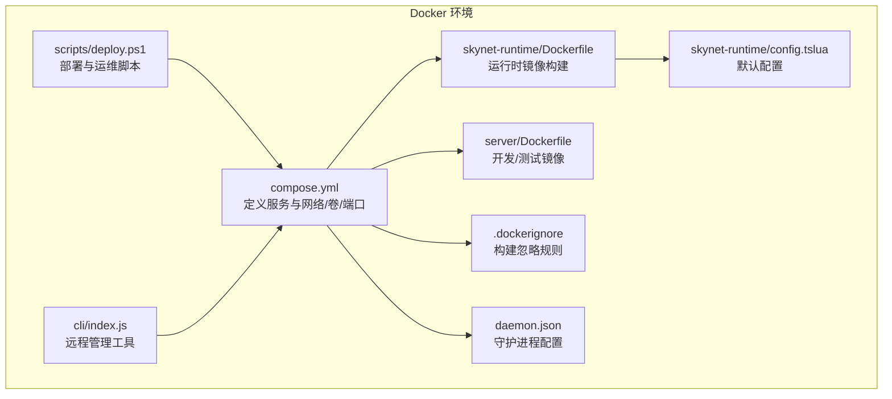
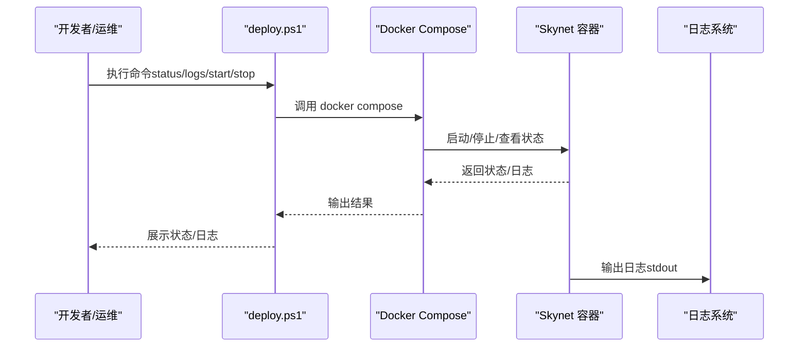
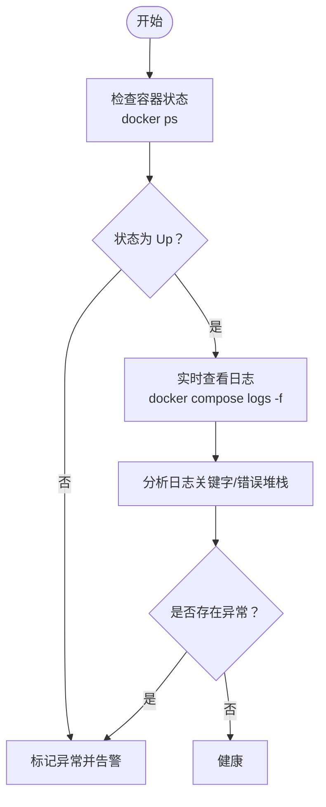
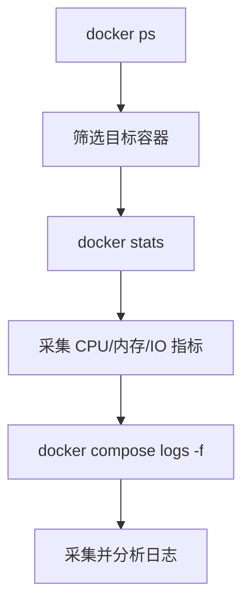
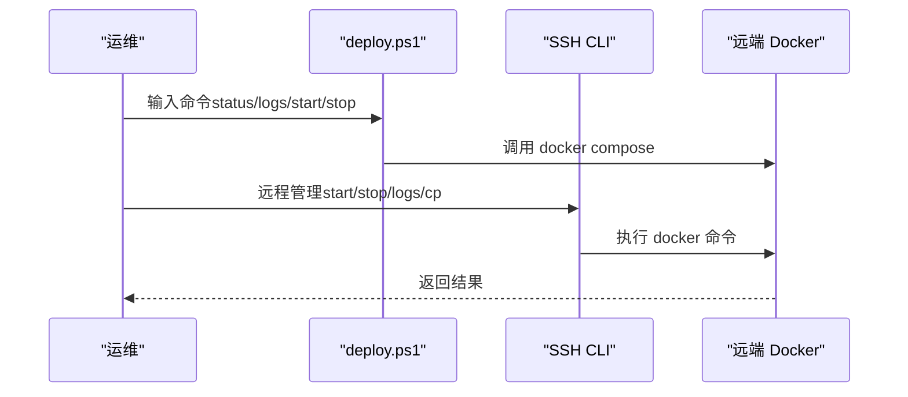
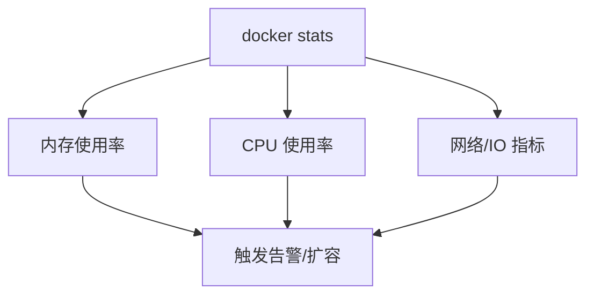
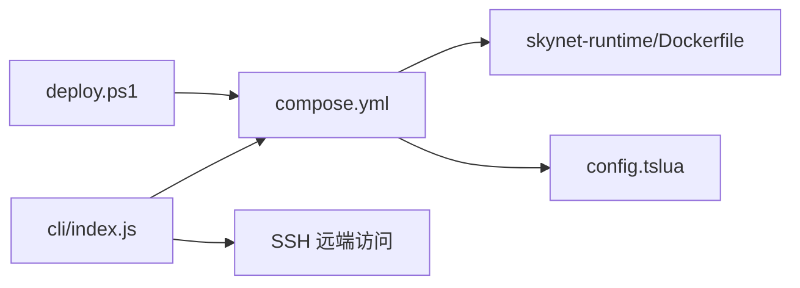
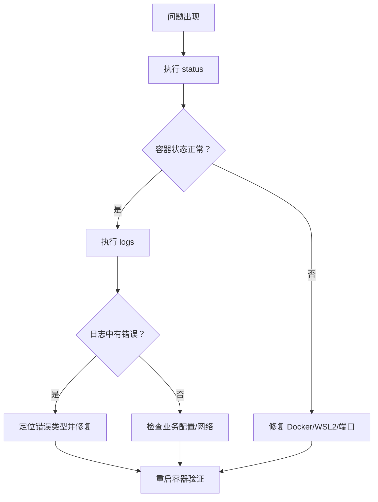

# 服务监控

<cite>
**本文引用的文件**
- [compose.yml](file://docker/compose.yml)
- [Dockerfile（运行时镜像）](file://docker/skynet-runtime/Dockerfile)
- [默认配置 config.tslua](file://docker/skynet-runtime/config.tslua)
- [Dockerfile（Server 镜像）](file://server/Dockerfile)
- [部署脚本 deploy.ps1](file://docker/scripts/deploy.ps1)
- [.dockerignore](file://docker/.dockerignore)
- [守护进程配置 daemon.json](file://docker/daemon.json)
- [CLI 管理工具 index.js](file://docker/cli/index.js)
- [CLI 包配置 package.json](file://docker/cli/package.json)
</cite>

## 目录
1. [简介](#简介)
2. [项目结构](#项目结构)
3. [核心组件](#核心组件)
4. [架构总览](#架构总览)
5. [详细组件分析](#详细组件分析)
6. [依赖关系分析](#依赖关系分析)
7. [性能考量](#性能考量)
8. [故障排查指南](#故障排查指南)
9. [结论](#结论)
10. [附录](#附录)

## 简介
本指南面向运维与开发人员，系统性讲解如何对基于 Skynet 的服务进行监控与告警，覆盖容器健康检查、服务进程监控、内存使用、日志采集与可视化、以及自动化脚本与阈值告警策略。文档结合仓库内的 Docker Compose、Dockerfile、部署脚本与 CLI 工具，给出可落地的监控实践与排障方法。

## 项目结构
围绕服务监控的关键文件与职责如下：
- docker/compose.yml：定义开发与生产两个 Skynet 容器服务，暴露游戏与调试端口，挂载配置、原生脚本、Lua 服务代码与日志卷。
- docker/skynet-runtime/Dockerfile：构建 Skynet 运行时镜像，设置非 root 用户、启动脚本与端口暴露。
- docker/skynet-runtime/config.tslua：默认配置文件，包含线程数、启动模块、Lua/C 服务路径、日志输出与守护进程设置。
- server/Dockerfile：提供可交互的开发/测试环境镜像（含 SSH、htop、curl 等工具），便于在宿主机侧进行容器外监控。
- docker/scripts/deploy.ps1：Windows 下的统一部署与运维脚本，支持状态查询、日志查看、启动/停止/重启、代码部署等。
- docker/.dockerignore：构建阶段忽略项，避免无关文件进入镜像，减少体积与构建时间。
- docker/daemon.json：Docker 守护进程配置，包含镜像/构建垃圾回收策略与镜像加速源。
- docker/cli/index.js：远程管理工具，通过 SSH 远程执行 docker 命令，实现状态检查、日志拉取、代码同步等。

**图表来源**
- [compose.yml:1-70](file://docker/compose.yml#L1-L70)
- [Dockerfile（运行时镜像）:1-91](file://docker/skynet-runtime/Dockerfile#L1-L91)
- [默认配置 config.tslua:1-35](file://docker/skynet-runtime/config.tslua#L1-L35)
- [Dockerfile（Server 镜像）:1-51](file://server/Dockerfile#L1-L51)
- [.dockerignore:1-48](file://docker/.dockerignore#L1-L48)
- [守护进程配置 daemon.json:1-17](file://docker/daemon.json#L1-L17)
- [部署脚本 deploy.ps1:1-430](file://docker/scripts/deploy.ps1#L1-L430)
- [CLI 管理工具 index.js:1-310](file://docker/cli/index.js#L1-L310)

**章节来源**
- [compose.yml:1-70](file://docker/compose.yml#L1-L70)
- [Dockerfile（运行时镜像）:1-91](file://docker/skynet-runtime/Dockerfile#L1-L91)
- [默认配置 config.tslua:1-35](file://docker/skynet-runtime/config.tslua#L1-L35)
- [Dockerfile（Server 镜像）:1-51](file://server/Dockerfile#L1-L51)
- [.dockerignore:1-48](file://docker/.dockerignore#L1-L48)
- [守护进程配置 daemon.json:1-17](file://docker/daemon.json#L1-L17)
- [部署脚本 deploy.ps1:1-430](file://docker/scripts/deploy.ps1#L1-L430)
- [CLI 管理工具 index.js:1-310](file://docker/cli/index.js#L1-L310)

## 核心组件
- 容器服务与端口
  - 开发与生产服务均暴露游戏端口与调试/管理端口，便于外部接入与远程调试。
  - 日志通过挂载卷持久化，便于容器外采集与分析。
- 运行时镜像与启动流程
  - 非 root 用户运行，启动脚本读取配置文件并执行 Skynet。
  - 默认配置中日志输出至 stdout，利于容器日志系统采集。
- 远程管理与运维脚本
  - 提供状态查询、日志查看、启动/停止/重启、代码部署、进入容器 Shell 等能力。
  - CLI 工具通过 SSH 远程执行 docker 命令，适合跨主机运维场景。

**章节来源**
- [compose.yml:11-62](file://docker/compose.yml#L11-L62)
- [Dockerfile（运行时镜像）:77-91](file://docker/skynet-runtime/Dockerfile#L77-L91)
- [默认配置 config.tslua:31-35](file://docker/skynet-runtime/config.tslua#L31-L35)
- [部署脚本 deploy.ps1:299-327](file://docker/scripts/deploy.ps1#L299-L327)
- [CLI 管理工具 index.js:85-132](file://docker/cli/index.js#L85-L132)

## 架构总览
下图展示容器生命周期与监控触点：

**图表来源**
- [部署脚本 deploy.ps1:299-327](file://docker/scripts/deploy.ps1#L299-L327)
- [compose.yml:11-62](file://docker/compose.yml#L11-L62)

## 详细组件分析

### 组件一：容器健康检查与进程监控
- 健康检查策略
  - 使用容器状态作为基础健康度：通过 docker ps 查看容器是否处于 Up 状态。
  - 结合日志流：通过 docker compose logs -f 实时观察服务日志，定位异常。
- 进程监控要点
  - Skynet 在容器内以单进程运行，健康检查应关注容器存活与日志输出。
  - 若需更细粒度，可在容器内集成轻量探针（例如定时输出健康态到文件或端口），由外部采集器轮询。

**图表来源**
- [部署脚本 deploy.ps1:299-327](file://docker/scripts/deploy.ps1#L299-L327)
- [compose.yml:11-62](file://docker/compose.yml#L11-L62)

**章节来源**
- [部署脚本 deploy.ps1:299-327](file://docker/scripts/deploy.ps1#L299-L327)
- [compose.yml:11-62](file://docker/compose.yml#L11-L62)

### 组件二：Docker 容器监控方法
- docker ps
  - 用于列出运行中的容器，筛选目标服务名称，确认容器存活与端口映射。
- docker stats
  - 用于查看容器 CPU、内存、网络、IO 等实时指标，便于发现资源瓶颈。
- 日志监控
  - docker compose logs -f 实时跟踪日志；支持 --since/--until 指定时间段。
  - 通过挂载卷将日志持久化到宿主机，配合集中式日志系统（如 ELK/Fluentd/Loki）采集。

**图表来源**
- [部署脚本 deploy.ps1:299-327](file://docker/scripts/deploy.ps1#L299-L327)
- [compose.yml:11-62](file://docker/compose.yml#L11-L62)

**章节来源**
- [部署脚本 deploy.ps1:299-327](file://docker/scripts/deploy.ps1#L299-L327)
- [compose.yml:11-62](file://docker/compose.yml#L11-L62)

### 组件三：服务状态检查自动化脚本
- Windows 脚本
  - 提供 status/logs/start/stop/restart/deploy/shell 等常用运维命令，支持 -Daemon 后台运行与 -NoCache 构建选项。
  - 通过 docker compose up/down、logs、cp 等命令实现一键化运维。
- 远程管理 CLI
  - 通过 SSH 远程执行 docker start/stop/restart、docker logs、docker cp 等，适合跨主机场景。
  - 支持配置远端主机、用户名、密钥、容器名与路径映射。

**图表来源**
- [部署脚本 deploy.ps1:416-429](file://docker/scripts/deploy.ps1#L416-L429)
- [CLI 管理工具 index.js:72-133](file://docker/cli/index.js#L72-L133)

**章节来源**
- [部署脚本 deploy.ps1:416-429](file://docker/scripts/deploy.ps1#L416-L429)
- [CLI 管理工具 index.js:72-133](file://docker/cli/index.js#L72-L133)

### 组件四：内存使用情况与资源监控
- 容器级监控
  - 使用 docker stats 观察 CPU/内存/IO，识别异常峰值。
- 运行时配置
  - 默认配置中日志输出至 stdout，便于容器日志系统采集；若需更精细的内存指标，可在 Skynet 内部埋点或引入外部探针。
- 构建与运行时优化
  - .dockerignore 限制构建上下文，减少镜像体积与构建时间。
  - daemon.json 配置镜像/构建垃圾回收与镜像加速，提升资源利用率。

**图表来源**
- [.dockerignore:1-48](file://docker/.dockerignore#L1-L48)
- [守护进程配置 daemon.json:1-17](file://docker/daemon.json#L1-L17)

**章节来源**
- [.dockerignore:1-48](file://docker/.dockerignore#L1-L48)
- [守护进程配置 daemon.json:1-17](file://docker/daemon.json#L1-L17)

### 组件五：健康检查端点与性能指标采集
- 健康检查端点
  - 若 Skynet 服务对外暴露健康检查接口，可使用 curl 或定时任务轮询该端点，记录响应时间与状态码。
- 性能指标采集
  - 结合 docker stats 与日志关键字（如错误堆栈、超时、队列积压等）进行综合评估。
  - 将指标导出至监控系统（如 Prometheus/Grafana），建立可视化面板。

**章节来源**
- [Dockerfile（运行时镜像）:77-91](file://docker/skynet-runtime/Dockerfile#L77-L91)
- [默认配置 config.tslua:31-35](file://docker/skynet-runtime/config.tslua#L31-L35)

## 依赖关系分析
- 组件耦合
  - compose.yml 依赖 Dockerfile（运行时镜像）与默认配置文件。
  - 运维脚本与 CLI 工具依赖 Docker 环境与远端 SSH 访问。
- 外部依赖
  - Docker Desktop（Windows）、WSL2 后端（Windows 特有）。
  - 远端服务器具备 SSH 与 Docker 权限。

**图表来源**
- [compose.yml:11-62](file://docker/compose.yml#L11-L62)
- [Dockerfile（运行时镜像）:1-91](file://docker/skynet-runtime/Dockerfile#L1-L91)
- [默认配置 config.tslua:1-35](file://docker/skynet-runtime/config.tslua#L1-L35)
- [部署脚本 deploy.ps1:1-430](file://docker/scripts/deploy.ps1#L1-L430)
- [CLI 管理工具 index.js:1-310](file://docker/cli/index.js#L1-L310)

**章节来源**
- [compose.yml:11-62](file://docker/compose.yml#L11-L62)
- [Dockerfile（运行时镜像）:1-91](file://docker/skynet-runtime/Dockerfile#L1-L91)
- [默认配置 config.tslua:1-35](file://docker/skynet-runtime/config.tslua#L1-L35)
- [部署脚本 deploy.ps1:1-430](file://docker/scripts/deploy.ps1#L1-L430)
- [CLI 管理工具 index.js:1-310](file://docker/cli/index.js#L1-L310)

## 性能考量
- 构建优化
  - 使用 .dockerignore 减少构建上下文，缩短构建时间。
  - daemon.json 启用构建垃圾回收与镜像加速，降低存储压力与下载耗时。
- 运行时优化
  - 非 root 用户运行，提升安全性；合理设置线程数与日志级别，平衡性能与可观测性。
  - 通过挂载卷持久化日志，避免容器重启导致日志丢失。

**章节来源**
- [.dockerignore:1-48](file://docker/.dockerignore#L1-L48)
- [守护进程配置 daemon.json:1-17](file://docker/daemon.json#L1-L17)
- [Dockerfile（运行时镜像）:49-91](file://docker/skynet-runtime/Dockerfile#L49-L91)
- [默认配置 config.tslua:7-35](file://docker/skynet-runtime/config.tslua#L7-L35)

## 故障排查指南
- 常见问题与处理
  - Docker Desktop 未启动：根据脚本提示启动 Docker Desktop。
  - 端口被占用：修改 compose.yml 中的端口映射。
  - 权限错误：以管理员身份运行 PowerShell。
  - WSL2 后端缺失：在 Docker Desktop 设置中启用 WSL2。
- 快速诊断步骤
  - 使用 status 命令查看容器状态与镜像列表。
  - 使用 logs 命令查看实时日志，定位错误堆栈。
  - 使用 shell 命令进入容器内部，检查进程与文件系统。
  - 使用 CLI 工具远程执行 docker 命令，验证远端连通性与权限。

**图表来源**
- [部署脚本 deploy.ps1:98-143](file://docker/scripts/deploy.ps1#L98-L143)
- [部署脚本 deploy.ps1:299-327](file://docker/scripts/deploy.ps1#L299-L327)
- [CLI 管理工具 index.js:72-133](file://docker/cli/index.js#L72-L133)

**章节来源**
- [部署脚本 deploy.ps1:98-143](file://docker/scripts/deploy.ps1#L98-L143)
- [部署脚本 deploy.ps1:299-327](file://docker/scripts/deploy.ps1#L299-L327)
- [CLI 管理工具 index.js:72-133](file://docker/cli/index.js#L72-L133)

## 结论
通过本指南，您可以基于仓库提供的 Compose、Dockerfile、部署脚本与 CLI 工具，建立一套完整的 Skynet 服务监控体系：以容器状态与日志为核心，辅以 docker stats 的资源观测与自动化脚本的运维能力，并结合健康检查端点与性能指标采集，形成闭环的监控与告警机制。建议在生产环境中进一步引入集中式日志与指标系统，完善可视化与告警策略。

## 附录
- 监控配置示例（概念性说明）
  - 健康检查端点：在服务中暴露 /health，返回 200 且包含健康状态字段。
  - 性能指标采集：定时抓取 docker stats 输出并写入监控系统。
  - 告警阈值建议：CPU 使用率 > 80% 持续 5 分钟；内存使用率 > 85%；日志中错误关键字出现频率阈值。
- 故障检测方法
  - 定时巡检：每分钟调用 docker ps 与 docker stats，记录异常。
  - 日志关键字：在日志中搜索致命错误、超时、队列积压等关键词。
  - 远程巡检：通过 CLI 工具定期执行 docker logs --tail=100，比对最近日志变化。