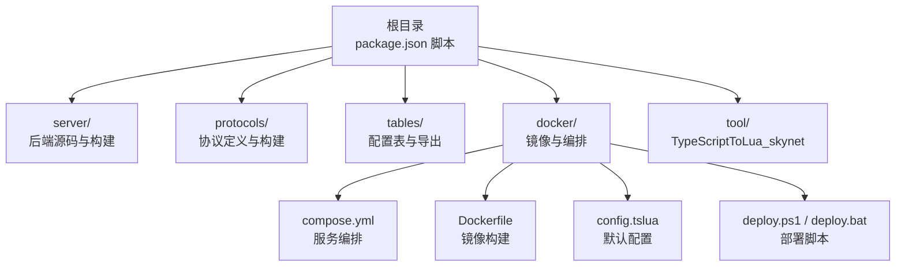
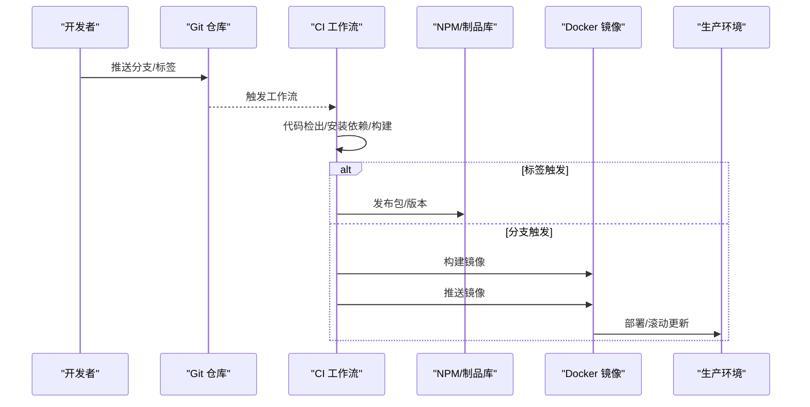
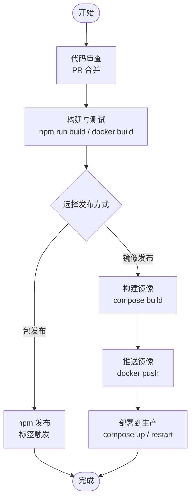
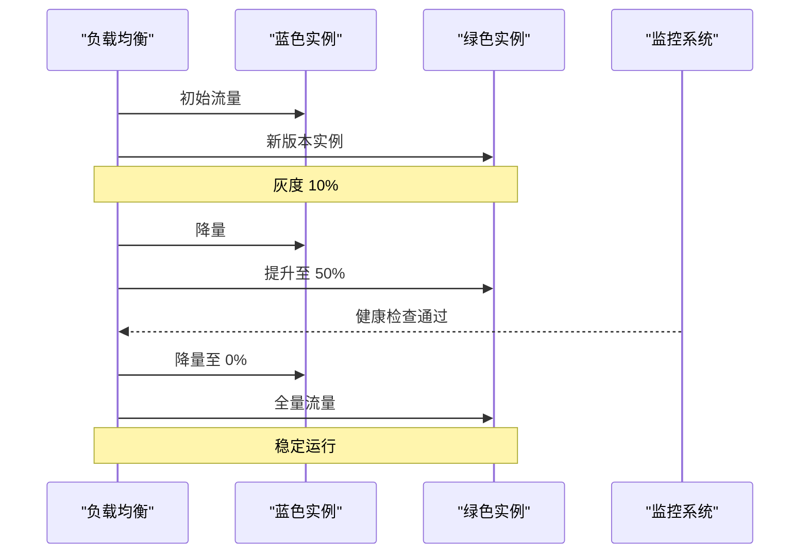
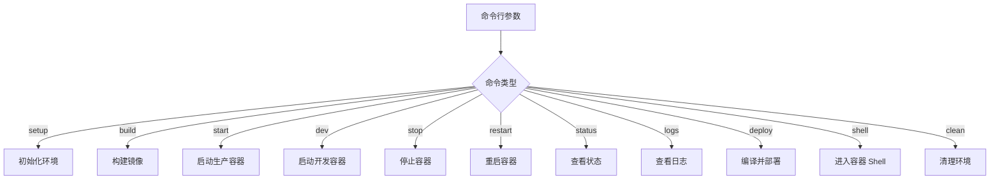
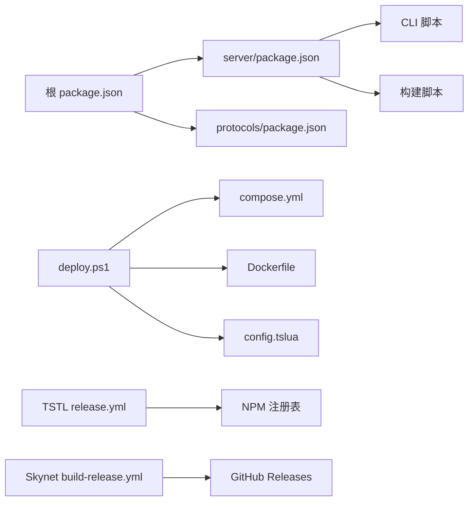

# 版本管理

<cite>
**本文引用的文件**
- [package.json](file://package.json)
- [server/package.json](file://server/package.json)
- [protocols/package.json](file://protocols/package.json)
- [README.md](file://README.md)
- [docker/scripts/deploy.ps1](file://docker/scripts/deploy.ps1)
- [docker/scripts/deploy.bat](file://docker/scripts/deploy.bat)
- [docker/compose.yml](file://docker/compose.yml)
- [docker/skynet-runtime/Dockerfile](file://docker/skynet-runtime/Dockerfile)
- [docker/skynet-runtime/config.tslua](file://docker/skynet-runtime/config.tslua)
- [server/start.sh](file://server/start.sh)
- [tool/TypeScriptToLua_skynet/.github/workflows/release.yml](file://tool/TypeScriptToLua_skynet/.github/workflows/release.yml)
- [docker/skynet/.github/workflows/build-release.yml](file://docker/skynet/.github/.github/workflows/build-release.yml)
</cite>

## 目录
1. [引言](#引言)
2. [项目结构](#项目结构)
3. [核心组件](#核心组件)
4. [架构总览](#架构总览)
5. [详细组件分析](#详细组件分析)
6. [依赖分析](#依赖分析)
7. [性能考虑](#性能考虑)
8. [故障排查指南](#故障排查指南)
9. [结论](#结论)
10. [附录](#附录)

## 引言
本指南面向版本管理与发布流程，结合仓库现有脚本与配置，给出可落地的策略与操作步骤。内容覆盖：
- 版本控制策略：分支管理、标签命名、版本号规范
- 发布流程：代码审查、构建测试、打包发布
- 灰度与蓝绿发布：流量切换、回滚、监控验证
- 自动化部署：CI/CD 流水线、部署参数、环境配置
- 兼容性与升级：向后兼容、破坏性变更、升级注意事项

## 项目结构
本仓库采用多包工作区组织，核心目录与职责如下：
- 根目录：聚合脚本与顶层配置，转发命令至子包
- server：TypeScript 后端源码与构建产物，包含 Node.js 开发与 Skynet 生产运行所需的适配层
- protocols：Protocol Buffers 协议定义与构建脚本
- tables：策划配置表与导出工具链
- docker：Docker 镜像构建、Compose 编排与部署脚本
- tool：TypeScriptToLua_skynet 子模块（TSTL），含 CI/CD 工作流

图表来源
- [package.json:11-37](file://package.json#L11-L37)
- [server/package.json:6-25](file://server/package.json#L6-L25)
- [docker/compose.yml:6-62](file://docker/compose.yml#L6-L62)
- [docker/skynet-runtime/Dockerfile:1-91](file://docker/skynet-runtime/Dockerfile#L1-L91)
- [docker/skynet-runtime/config.tslua:1-35](file://docker/skynet-runtime/config.tslua#L1-L35)
- [docker/scripts/deploy.ps1:1-430](file://docker/scripts/deploy.ps1#L1-L430)

章节来源
- [README.md:136-193](file://README.md#L136-L193)
- [package.json:1-52](file://package.json#L1-L52)

## 核心组件
- 版本号与工作区
  - 根包与 server 包均声明版本号，便于统一管理与发布
  - protocols 包独立版本，便于协议演进与消费方对齐
- 构建与发布脚本
  - 根包脚本统一转发到 server，server 提供 CLI 与构建命令
  - Docker 部署脚本提供环境检查、镜像构建、容器启停、日志查看、热部署等功能
- CI/CD 工作流
  - TSTL 子模块提供发布工作流，基于标签触发 npm 发布
  - Skynet 子模块提供多平台构建与发布工作流，基于标签或主分支触发

章节来源
- [server/package.json:1-51](file://server/package.json#L1-L51)
- [protocols/package.json:1-28](file://protocols/package.json#L1-L28)
- [package.json:11-37](file://package.json#L11-L37)
- [docker/scripts/deploy.ps1:1-430](file://docker/scripts/deploy.ps1#L1-L430)
- [tool/TypeScriptToLua_skynet/.github/workflows/release.yml:1-25](file://tool/TypeScriptToLua_skynet/.github/workflows/release.yml#L1-L25)
- [docker/skynet/.github/workflows/build-release.yml:1-172](file://docker/skynet/.github/workflows/build-release.yml#L1-L172)

## 架构总览
下图展示从代码提交到生产部署的关键路径，以及版本号与标签在 CI/CD 中的作用。

图表来源
- [tool/TypeScriptToLua_skynet/.github/workflows/release.yml:3-25](file://tool/TypeScriptToLua_skynet/.github/workflows/release.yml#L3-L25)
- [docker/skynet/.github/workflows/build-release.yml:3-172](file://docker/skynet/.github/workflows/build-release.yml#L3-L172)

## 详细组件分析

### 版本控制策略
- 分支管理
  - 主分支用于稳定发布；功能开发在特性分支进行，合并前需通过 CI
  - 参考贡献指南的分支流程
- 标签命名
  - TSTL 子模块使用标签触发发布
  - Skynet 子模块使用 v* 标签触发多平台构建与发布
- 版本号规范
  - 语义化版本（SemVer）：主版本.次版本.修订号
  - 根包与 server 包版本保持一致，便于整体发布
  - protocols 包独立版本，便于协议演进与消费者对齐

章节来源
- [README.md:544-554](file://README.md#L544-L554)
- [tool/TypeScriptToLua_skynet/.github/workflows/release.yml:4-5](file://tool/TypeScriptToLua_skynet/.github/workflows/release.yml#L4-L5)
- [docker/skynet/.github/workflows/build-release.yml:5-6](file://docker/skynet/.github/workflows/build-release.yml#L5-L6)

### 发布流程（标准化操作）
- 代码审查
  - 通过 Pull Request 提交流程，确保代码质量与一致性
- 构建与测试
  - 根包脚本统一转发到 server，server 提供构建与测试命令
  - Docker 部署脚本内置环境检查与镜像构建流程
- 打包与发布
  - TSTL 子模块通过标签触发 npm 发布
  - Skynet 子模块通过标签触发多平台构建与 GitHub Release

图表来源
- [package.json:11-37](file://package.json#L11-L37)
- [server/package.json:6-25](file://server/package.json#L6-L25)
- [docker/scripts/deploy.ps1:175-211](file://docker/scripts/deploy.ps1#L175-L211)
- [docker/compose.yml:6-62](file://docker/compose.yml#L6-L62)
- [tool/TypeScriptToLua_skynet/.github/workflows/release.yml:16-25](file://tool/TypeScriptToLua_skynet/.github/workflows/release.yml#L16-L25)
- [docker/skynet/.github/workflows/build-release.yml:135-172](file://docker/skynet/.github/workflows/build-release.yml#L135-L172)

章节来源
- [README.md:544-554](file://README.md#L544-L554)
- [package.json:11-37](file://package.json#L11-L37)
- [docker/scripts/deploy.ps1:175-211](file://docker/scripts/deploy.ps1#L175-L211)

### 灰度发布与蓝绿部署
- 流量切换
  - 通过负载均衡或编排工具（如 docker-compose profiles）逐步切换流量
  - 开发/生产容器分离，便于蓝绿切换
- 回滚机制
  - 生产容器镜像版本化，回滚只需切换镜像标签
  - Docker Compose 支持快速启停与重启
- 监控验证
  - 通过日志查看与健康检查确认新版本稳定性
  - Docker 日志输出到 stdout，便于集中采集

图表来源
- [docker/compose.yml:6-62](file://docker/compose.yml#L6-L62)
- [docker/scripts/deploy.ps1:216-238](file://docker/scripts/deploy.ps1#L216-L238)
- [docker/scripts/deploy.ps1:289-294](file://docker/scripts/deploy.ps1#L289-L294)
- [docker/scripts/deploy.ps1:324-327](file://docker/scripts/deploy.ps1#L324-L327)

章节来源
- [docker/compose.yml:6-62](file://docker/compose.yml#L6-L62)
- [docker/scripts/deploy.ps1:216-238](file://docker/scripts/deploy.ps1#L216-L238)
- [docker/scripts/deploy.ps1:324-327](file://docker/scripts/deploy.ps1#L324-L327)

### 自动化部署脚本使用指南
- CI/CD 流水线
  - TSTL 子模块：标签触发 npm 发布
  - Skynet 子模块：标签或主分支触发多平台构建与发布
- 部署参数
  - Docker 部署脚本支持命令与选项：setup、build、start、dev、stop、restart、status、logs、deploy、shell、clean
  - 选项：-Daemon 后台运行；-NoCache 构建时不使用缓存
- 环境配置
  - Docker Compose 定义开发/生产服务，端口映射与卷挂载
  - 默认配置文件打包在镜像内，可通过卷覆盖

图表来源
- [docker/scripts/deploy.ps1:7-15](file://docker/scripts/deploy.ps1#L7-L15)
- [docker/scripts/deploy.ps1:416-429](file://docker/scripts/deploy.ps1#L416-L429)
- [docker/scripts/deploy.bat:14-53](file://docker/scripts/deploy.bat#L14-L53)
- [docker/compose.yml:6-62](file://docker/compose.yml#L6-L62)
- [docker/skynet-runtime/Dockerfile:68-91](file://docker/skynet-runtime/Dockerfile#L68-L91)

章节来源
- [docker/scripts/deploy.ps1:38-96](file://docker/scripts/deploy.ps1#L38-L96)
- [docker/scripts/deploy.ps1:416-429](file://docker/scripts/deploy.ps1#L416-L429)
- [docker/scripts/deploy.bat:14-53](file://docker/scripts/deploy.bat#L14-L53)
- [docker/compose.yml:6-62](file://docker/compose.yml#L6-L62)
- [docker/skynet-runtime/Dockerfile:68-91](file://docker/skynet-runtime/Dockerfile#L68-L91)

### 版本兼容性管理与升级注意事项
- 语义化版本
  - 主版本：破坏性变更
  - 次版本：新增功能且向后兼容
  - 修订号：修复问题且向后兼容
- 协议与数据表
  - protocols 包独立版本，升级时需评估消费方影响
  - tables 配置表升级遵循向后兼容原则，避免破坏已有数据
- 运行时与适配层
  - server 包版本与根包保持一致，确保发布一致性
  - Docker 镜像版本化，回滚与迁移可控

章节来源
- [server/package.json:1-51](file://server/package.json#L1-L51)
- [protocols/package.json:1-28](file://protocols/package.json#L1-L28)
- [package.json:1-52](file://package.json#L1-L52)

## 依赖分析
- 组件耦合
  - 根包脚本依赖 server 包命令；server 包命令依赖 CLI 与构建脚本
  - docker 部署脚本依赖 Docker 与 Compose；镜像构建依赖 skynet 源码与配置
- 外部依赖
  - TSTL 子模块提供 CI/CD 与发布能力
  - Skynet 子模块提供多平台构建与发布能力

图表来源
- [package.json:11-37](file://package.json#L11-L37)
- [server/package.json:6-25](file://server/package.json#L6-L25)
- [docker/scripts/deploy.ps1:175-211](file://docker/scripts/deploy.ps1#L175-L211)
- [docker/compose.yml:6-62](file://docker/compose.yml#L6-L62)
- [docker/skynet-runtime/Dockerfile:1-91](file://docker/skynet-runtime/Dockerfile#L1-L91)
- [docker/skynet-runtime/config.tslua:1-35](file://docker/skynet-runtime/config.tslua#L1-L35)
- [tool/TypeScriptToLua_skynet/.github/workflows/release.yml:16-25](file://tool/TypeScriptToLua_skynet/.github/workflows/release.yml#L16-L25)
- [docker/skynet/.github/workflows/build-release.yml:135-172](file://docker/skynet/.github/workflows/build-release.yml#L135-L172)

章节来源
- [package.json:11-37](file://package.json#L11-L37)
- [server/package.json:6-25](file://server/package.json#L6-L25)
- [docker/scripts/deploy.ps1:175-211](file://docker/scripts/deploy.ps1#L175-L211)
- [docker/compose.yml:6-62](file://docker/compose.yml#L6-L62)
- [docker/skynet-runtime/Dockerfile:1-91](file://docker/skynet-runtime/Dockerfile#L1-L91)
- [docker/skynet-runtime/config.tslua:1-35](file://docker/skynet-runtime/config.tslua#L1-L35)
- [tool/TypeScriptToLua_skynet/.github/workflows/release.yml:16-25](file://tool/TypeScriptToLua_skynet/.github/workflows/release.yml#L16-L25)
- [docker/skynet/.github/workflows/build-release.yml:135-172](file://docker/skynet/.github/workflows/build-release.yml#L135-L172)

## 性能考虑
- 构建缓存
  - Docker 构建支持 --no-cache 选项，必要时禁用缓存以确保一致性
- 镜像体积
  - 运行时镜像仅包含必要依赖，减少攻击面与启动时间
- 日志与监控
  - Docker 日志输出到 stdout，便于集中采集与分析

章节来源
- [docker/scripts/deploy.ps1:196-203](file://docker/scripts/deploy.ps1#L196-L203)
- [docker/skynet-runtime/Dockerfile:44-47](file://docker/skynet-runtime/Dockerfile#L44-L47)
- [docker/skynet-runtime/config.tslua:31-35](file://docker/skynet-runtime/config.tslua#L31-L35)

## 故障排查指南
- 环境检查
  - Docker 与 Compose 可用性检查；WSL2 后端提示
- 常见问题
  - 未找到编译后的 Lua 代码：先执行编译再构建镜像
  - 未运行中的容器：先启动容器再部署代码
  - 权限错误：以管理员身份运行 PowerShell
- 日志定位
  - 使用 logs 命令查看容器日志；关注 stdout 输出

章节来源
- [docker/scripts/deploy.ps1:101-143](file://docker/scripts/deploy.ps1#L101-L143)
- [docker/scripts/deploy.ps1:180-194](file://docker/scripts/deploy.ps1#L180-L194)
- [docker/scripts/deploy.ps1:345-354](file://docker/scripts/deploy.ps1#L345-L354)
- [docker/scripts/deploy.ps1:324-327](file://docker/scripts/deploy.ps1#L324-L327)

## 结论
本指南基于仓库现有脚本与配置，给出了版本控制、发布流程、灰度与蓝绿部署、自动化部署与兼容性管理的完整方案。建议在实际落地时：
- 明确分支与标签策略，严格执行代码审查
- 使用 CI/CD 工作流自动化构建与发布
- 通过 Docker 编排实现蓝绿/灰度切换与回滚
- 严格遵循语义化版本与兼容性约定，保障升级平滑

## 附录
- 快速命令参考
  - 根包脚本：统一转发到 server
  - server 脚本：CLI、构建、启动、停止、状态、日志、热更新
  - Docker 部署：setup、build、start、dev、stop、restart、status、logs、deploy、shell、clean

章节来源
- [package.json:11-37](file://package.json#L11-L37)
- [server/start.sh:7-65](file://server/start.sh#L7-L65)
- [docker/scripts/deploy.ps1:416-429](file://docker/scripts/deploy.ps1#L416-L429)