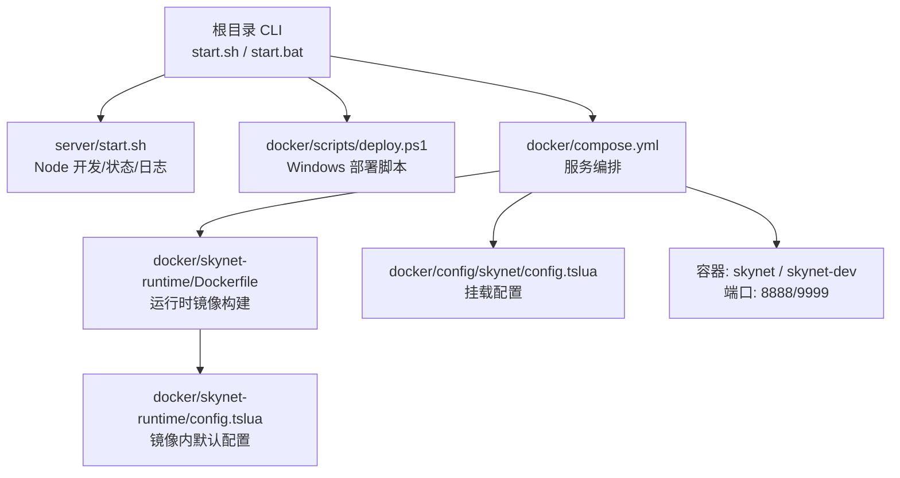
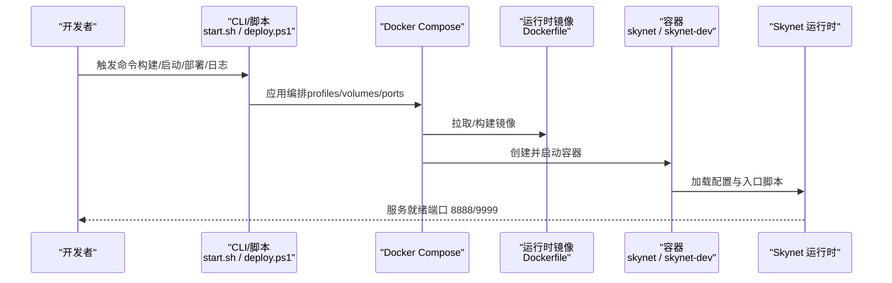
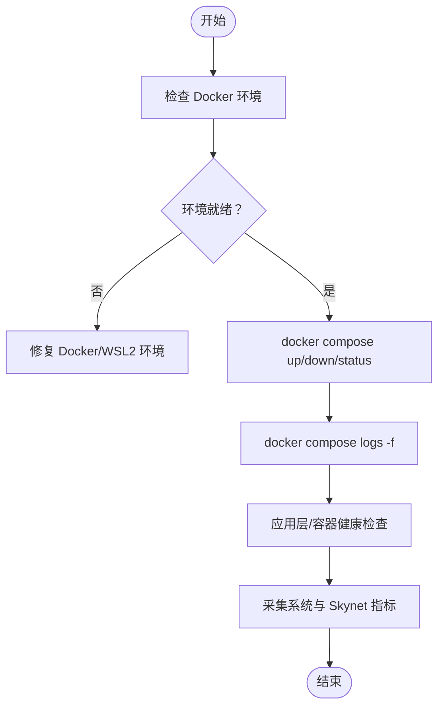
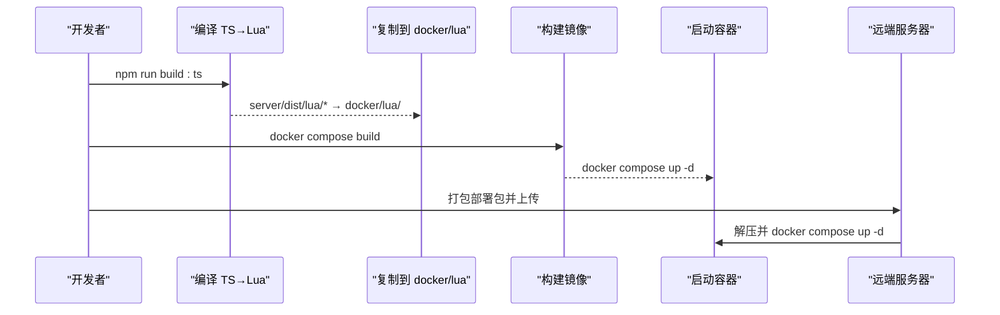
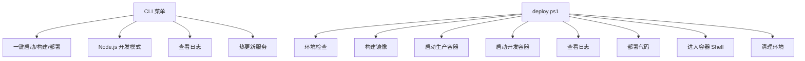
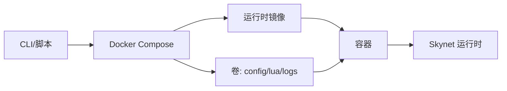
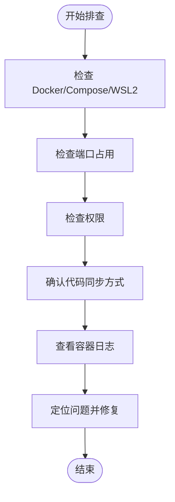

# 运维管理

<cite>
**本文引用的文件**
- [README.md](file://README.md)
- [DEPLOY.md](file://DEPLOY.md)
- [compose.yml](file://docker/compose.yml)
- [Dockerfile](file://docker/skynet-runtime/Dockerfile)
- [config.tslua（容器内默认配置）](file://docker/skynet-runtime/config.tslua)
- [config.tslua（Docker 挂载配置）](file://docker/config/skynet/config.tslua)
- [deploy.ps1](file://docker/scripts/deploy.ps1)
- [deploy.bat](file://docker/scripts/deploy.bat)
- [start.sh（server）](file://server/start.sh)
- [start.sh（根目录）](file://start.sh)
- [start.bat](file://start.bat)
- [tslua.config.yaml](file://tslua.config.yaml)
</cite>

## 目录
1. [引言](#引言)
2. [项目结构](#项目结构)
3. [核心组件](#核心组件)
4. [架构总览](#架构总览)
5. [详细组件分析](#详细组件分析)
6. [依赖分析](#依赖分析)
7. [性能考虑](#性能考虑)
8. [故障排查指南](#故障排查指南)
9. [结论](#结论)
10. [附录](#附录)

## 引言
本指南面向运维工程师与平台团队，围绕服务监控与状态管理、健康检查、性能指标、服务发现、故障排查、备份与恢复、版本管理与发布（灰度、回滚、蓝绿）、自动化工具与脚本、安全管理与权限控制、监控与告警配置以及实际运维案例与最佳实践进行系统化说明。结合仓库中的 CLI、Docker Compose、PowerShell/批处理部署脚本与 Skynet 运行时配置，给出可落地的操作流程与可视化图示。

## 项目结构
本项目采用“TypeScript 开发 + TypeScriptToLua 转译为 Lua + Skynet 生产运行”的混合架构。运维相关的关键位置包括：
- 根目录 CLI 入口与跨平台启动脚本
- server 目录的 Node.js 开发与日志查看
- docker 目录的 Docker 化运行、配置挂载与镜像构建
- Skynet 运行时配置文件与容器端口映射

图表来源
- [start.sh（根目录）:1-7](file://start.sh#L1-L7)
- [start.bat:1-39](file://start.bat#L1-L39)
- [start.sh（server）:1-66](file://server/start.sh#L1-L66)
- [compose.yml:1-70](file://docker/compose.yml#L1-L70)
- [Dockerfile:1-91](file://docker/skynet-runtime/Dockerfile#L1-L91)
- [config.tslua（容器内默认配置）:1-35](file://docker/skynet-runtime/config.tslua#L1-L35)
- [config.tslua（Docker 挂载配置）:1-54](file://docker/config/skynet/config.tslua#L1-L54)

章节来源
- [README.md:1-578](file://README.md#L1-L578)
- [DEPLOY.md:1-108](file://DEPLOY.md#L1-L108)
- [compose.yml:1-70](file://docker/compose.yml#L1-L70)
- [Dockerfile:1-91](file://docker/skynet-runtime/Dockerfile#L1-L91)
- [config.tslua（Docker 挂载配置）:1-54](file://docker/config/skynet/config.tslua#L1-L54)
- [config.tslua（容器内默认配置）:1-35](file://docker/skynet-runtime/config.tslua#L1-L35)
- [deploy.ps1:1-430](file://docker/scripts/deploy.ps1#L1-L430)
- [deploy.bat:1-58](file://docker/scripts/deploy.bat#L1-L58)
- [start.sh（server）:1-66](file://server/start.sh#L1-L66)
- [start.sh（根目录）:1-7](file://start.sh#L1-L7)
- [start.bat:1-39](file://start.bat#L1-L39)

## 核心组件
- CLI 与跨平台启动入口：提供统一命令集，覆盖构建、启动、停止、状态、日志、热更新等。
- Docker Compose 编排：定义开发与生产两种模式，挂载配置、原生脚本与 Lua 服务代码，持久化日志卷。
- Skynet 运行时镜像：内置编译好的 Skynet 与 lua-protobuf，容器内以非 root 用户运行，端口暴露 8888/9999。
- 配置体系：镜像内默认配置 + Docker 卷挂载覆盖，便于多环境差异化配置。
- Windows 部署脚本：封装环境检查、镜像构建、容器启停、日志查看、代码部署等操作。

章节来源
- [README.md:15-93](file://README.md#L15-L93)
- [DEPLOY.md:1-108](file://DEPLOY.md#L1-L108)
- [compose.yml:1-70](file://docker/compose.yml#L1-L70)
- [Dockerfile:1-91](file://docker/skynet-runtime/Dockerfile#L1-L91)
- [config.tslua（容器内默认配置）:1-35](file://docker/skynet-runtime/config.tslua#L1-L35)
- [config.tslua（Docker 挂载配置）:1-54](file://docker/config/skynet/config.tslua#L1-L54)
- [deploy.ps1:1-430](file://docker/scripts/deploy.ps1#L1-L430)
- [deploy.bat:1-58](file://docker/scripts/deploy.bat#L1-L58)

## 架构总览
下图展示从开发者命令到容器内 Skynet 运行时的全链路：

图表来源
- [start.sh（根目录）:1-7](file://start.sh#L1-L7)
- [deploy.ps1:1-430](file://docker/scripts/deploy.ps1#L1-L430)
- [compose.yml:1-70](file://docker/compose.yml#L1-L70)
- [Dockerfile:1-91](file://docker/skynet-runtime/Dockerfile#L1-L91)

## 详细组件分析

### 组件一：服务监控与状态管理
- 状态查询
  - 本地 Node.js 模式：通过 server 目录的启动脚本查看状态与日志。
  - Docker 模式：通过 compose 状态查看容器运行情况；通过日志命令查看实时日志。
- 健康检查
  - 建议在生产环境增加容器健康检查探针（例如 TCP 端口探测），或在应用层暴露轻量 HTTP 探针。
- 性能指标
  - 结合 Skynet 自身的内存、消息队列、定时器等运行时统计，配合系统层面的 CPU/内存/IO 监控。
- 服务发现
  - 当前配置为单节点模式，Harbor 关闭；若扩展集群，需开启 Harbor 并配置集群通信。

图表来源
- [deploy.ps1:98-143](file://docker/scripts/deploy.ps1#L98-L143)
- [compose.yml:1-70](file://docker/compose.yml#L1-L70)
- [config.tslua（Docker 挂载配置）:1-54](file://docker/config/skynet/config.tslua#L1-L54)

章节来源
- [start.sh（server）:20-37](file://server/start.sh#L20-L37)
- [deploy.ps1:299-327](file://docker/scripts/deploy.ps1#L299-L327)
- [compose.yml:1-70](file://docker/compose.yml#L1-L70)
- [config.tslua（Docker 挂载配置）:1-54](file://docker/config/skynet/config.tslua#L1-L54)

### 组件二：部署与发布流程
- 本地开发（Volume 挂载）
  - 使用开发模式容器，修改 TS 后编译，代码自动同步至容器。
- 生产部署（镜像内嵌）
  - 先编译 TS→Lua，复制到 docker/lua，构建镜像并启动生产容器。
- 远程部署
  - CLI 工具初始化远端环境，或打包 compose.yml、config、lua、skynet-runtime 后上传部署。

图表来源
- [DEPLOY.md:1-108](file://DEPLOY.md#L1-L108)
- [compose.yml:1-70](file://docker/compose.yml#L1-L70)
- [Dockerfile:1-91](file://docker/skynet-runtime/Dockerfile#L1-L91)
- [deploy.ps1:175-211](file://docker/scripts/deploy.ps1#L175-L211)

章节来源
- [DEPLOY.md:1-108](file://DEPLOY.md#L1-L108)
- [compose.yml:1-70](file://docker/compose.yml#L1-L70)
- [Dockerfile:1-91](file://docker/skynet-runtime/Dockerfile#L1-L91)
- [deploy.ps1:175-211](file://docker/scripts/deploy.ps1#L175-L211)

### 组件三：备份与恢复策略
- 数据备份
  - 若业务涉及数据库，应在 CI/CD 中加入数据库快照/导出任务，并纳入备份校验。
- 配置备份
  - 持久化保存 docker/config/skynet/config.tslua 与运行时环境变量，定期归档。
- 代码备份
  - docker/lua 目录即为编译产物，应纳入版本控制或制品库。
- 灾难恢复
  - 通过打包部署包快速在新环境恢复；或基于镜像 + 卷恢复。

章节来源
- [DEPLOY.md:54-75](file://DEPLOY.md#L54-L75)
- [config.tslua（Docker 挂载配置）:1-54](file://docker/config/skynet/config.tslua#L1-L54)

### 组件四：版本管理与发布
- 灰度发布
  - 通过多实例部署与反向代理权重切换，逐步放量。
- 回滚机制
  - 保留最近 N 个镜像版本；回滚时切换镜像标签。
- 蓝绿部署
  - 使用两套容器组，切换流量指向新/旧组。

章节来源
- [compose.yml:1-70](file://docker/compose.yml#L1-L70)
- [Dockerfile:1-91](file://docker/skynet-runtime/Dockerfile#L1-L91)

### 组件五：运维自动化工具与脚本
- 跨平台 CLI
  - 统一命令：构建、启动、停止、状态、日志、热更新等。
- Windows 部署脚本
  - 自动化环境检查、镜像构建、容器启停、日志查看、代码部署、Shell 进入、清理。
- 批处理脚本
  - 作为 PowerShell 脚本的简化入口，提供常用命令别名。

图表来源
- [README.md:15-93](file://README.md#L15-L93)
- [deploy.ps1:1-430](file://docker/scripts/deploy.ps1#L1-L430)
- [deploy.bat:1-58](file://docker/scripts/deploy.bat#L1-L58)
- [start.sh（server）:1-66](file://server/start.sh#L1-L66)

章节来源
- [README.md:15-93](file://README.md#L15-L93)
- [deploy.ps1:1-430](file://docker/scripts/deploy.ps1#L1-L430)
- [deploy.bat:1-58](file://docker/scripts/deploy.bat#L1-L58)
- [start.sh（server）:1-66](file://server/start.sh#L1-L66)

### 组件六：安全管理与权限控制
- 镜像与容器
  - 使用非 root 用户运行；最小化安装依赖；仅暴露必要端口。
- 配置隔离
  - 通过 Docker 卷挂载覆盖默认配置，避免明文硬编码在镜像中。
- 访问控制
  - 限制对容器 Shell 与调试端口的访问；生产环境关闭调试端口或加网关保护。

章节来源
- [Dockerfile:49-88](file://docker/skynet-runtime/Dockerfile#L49-L88)
- [config.tslua（容器内默认配置）:31-35](file://docker/skynet-runtime/config.tslua#L31-L35)
- [config.tslua（Docker 挂载配置）:32-40](file://docker/config/skynet/config.tslua#L32-L40)

### 组件七：监控与告警系统配置
- 容器日志
  - Docker 环境下推荐 logger 为空（输出到 stdout），便于 docker logs 与集中日志收集。
- 端口暴露
  - 8888 对外游戏端口，9999 为内部调试端口；建议仅内网访问或加认证。
- 指标采集
  - 结合系统监控（CPU/内存/磁盘/网络）与 Skynet 运行时指标（消息队列长度、定时器数量、内存使用）。

章节来源
- [config.tslua（Docker 挂载配置）:32-40](file://docker/config/skynet/config.tslua#L32-L40)
- [compose.yml:17-20](file://docker/compose.yml#L17-L20)

## 依赖分析
- 组件耦合
  - CLI/脚本与 Docker Compose 强耦合；Docker Compose 与运行时镜像弱耦合（通过卷挂载实现配置与代码解耦）。
- 外部依赖
  - Docker、Docker Compose、Ubuntu 基础镜像、Skynet 源码、lua-protobuf。
- 潜在环路
  - 无直接循环依赖；发布流程中编译产物与容器启动存在顺序依赖。

图表来源
- [start.sh（根目录）:1-7](file://start.sh#L1-L7)
- [compose.yml:1-70](file://docker/compose.yml#L1-L70)
- [Dockerfile:1-91](file://docker/skynet-runtime/Dockerfile#L1-L91)

章节来源
- [start.sh（根目录）:1-7](file://start.sh#L1-L7)
- [compose.yml:1-70](file://docker/compose.yml#L1-L70)
- [Dockerfile:1-91](file://docker/skynet-runtime/Dockerfile#L1-L91)

## 性能考虑
- 线程数与 CPU：根据宿主机核数调整 Skynet 线程数。
- 端口与网络：减少不必要的端口暴露，降低网络攻击面。
- 日志与 IO：避免高频同步日志；生产环境使用 stdout + 集中日志收集。
- 镜像体积：仅包含运行时所需依赖，减少镜像层大小。

章节来源
- [config.tslua（容器内默认配置）:7-8](file://docker/skynet-runtime/config.tslua#L7-L8)
- [config.tslua（Docker 挂载配置）:6-7](file://docker/config/skynet/config.tslua#L6-L7)
- [Dockerfile:44-47](file://docker/skynet-runtime/Dockerfile#L44-L47)

## 故障排查指南
- 环境问题
  - Docker 未启动、Compose 不可用、WSL2 后端缺失：按脚本提示修复。
- 端口冲突
  - 修改 compose.yml 中的端口映射。
- 权限错误
  - 以管理员身份运行 PowerShell；检查非 root 用户权限。
- 代码未生效
  - 开发模式下由卷挂载自动同步；生产模式需手动复制或重新构建镜像。
- 日志定位
  - 使用 docker compose logs -f 实时查看；或进入容器 Shell 检查本地日志。

图表来源
- [deploy.ps1:98-143](file://docker/scripts/deploy.ps1#L98-L143)
- [deploy.ps1:299-327](file://docker/scripts/deploy.ps1#L299-L327)
- [compose.yml:17-20](file://docker/compose.yml#L17-L20)

章节来源
- [deploy.ps1:98-143](file://docker/scripts/deploy.ps1#L98-L143)
- [deploy.ps1:299-327](file://docker/scripts/deploy.ps1#L299-L327)
- [compose.yml:17-20](file://docker/compose.yml#L17-L20)

## 结论
本项目通过 CLI 与 Docker 化方案实现了“开发—测试—生产”的闭环运维。建议在现有基础上完善健康检查、指标采集与告警、灰度与蓝绿发布策略、配置与代码制品化管理，以及安全加固（最小权限、端口收敛、访问控制）。以上流程与图示可直接用于日常运维与故障处置。

## 附录
- 常用命令速查
  - 一键启动、构建、启动/停止容器、查看状态与日志、热更新等。
- 配置文件
  - 镜像内默认配置与 Docker 卷挂载覆盖配置，便于多环境差异化。
- 部署包结构
  - 包含 compose.yml、config、lua、skynet-runtime，便于远程部署。

章节来源
- [README.md:56-93](file://README.md#L56-L93)
- [DEPLOY.md:79-108](file://DEPLOY.md#L79-L108)
- [config.tslua（容器内默认配置）:1-35](file://docker/skynet-runtime/config.tslua#L1-L35)
- [config.tslua（Docker 挂载配置）:1-54](file://docker/config/skynet/config.tslua#L1-L54)