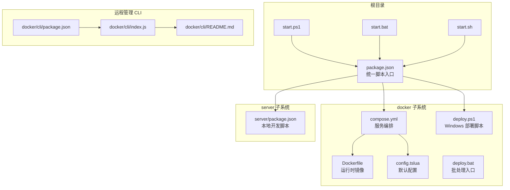
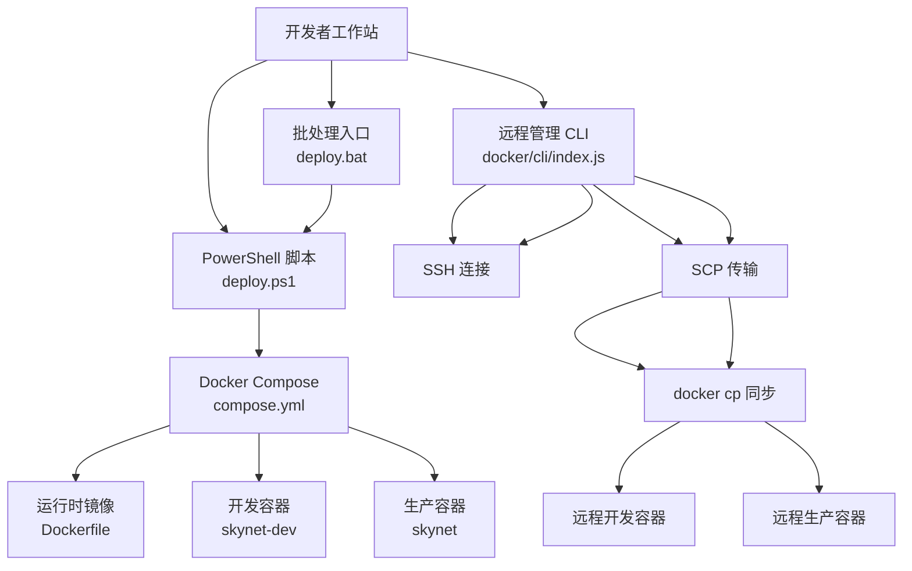
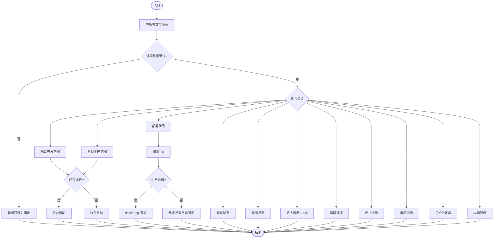
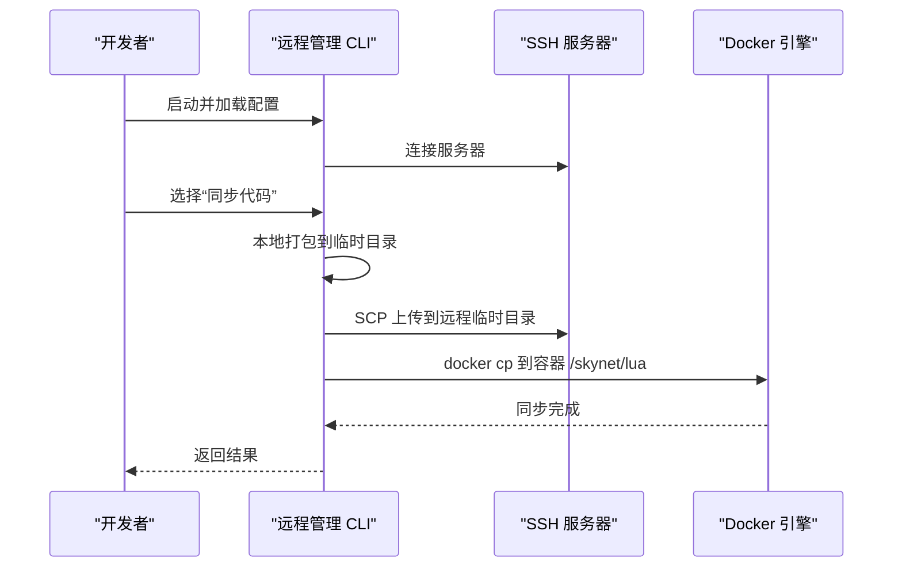
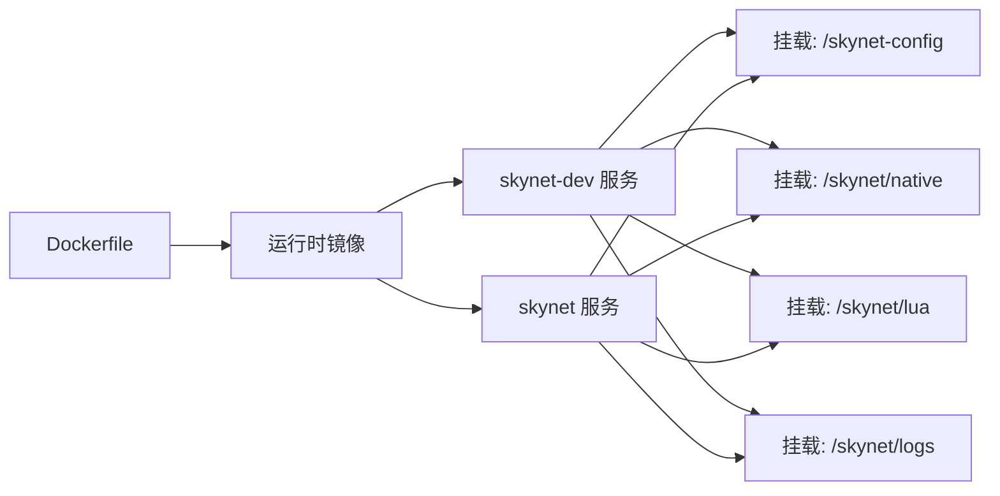
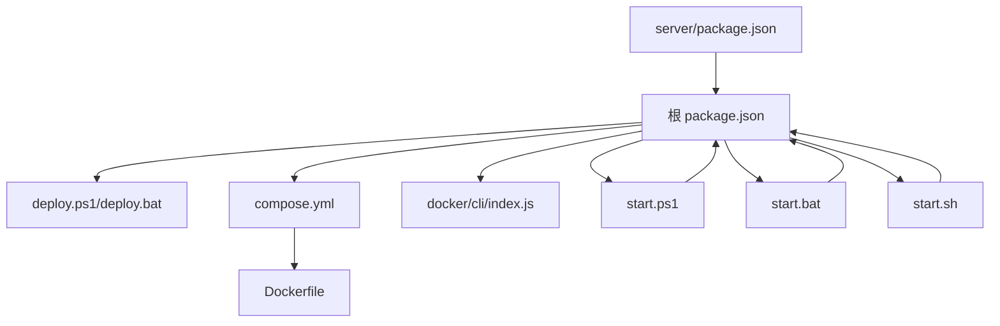

# 运维自动化

<cite>
**本文引用的文件**
- [docker/scripts/deploy.ps1](file://docker/scripts/deploy.ps1)
- [docker/scripts/deploy.bat](file://docker/scripts/deploy.bat)
- [start.ps1](file://start.ps1)
- [start.bat](file://start.bat)
- [start.sh](file://start.sh)
- [docker/compose.yml](file://docker/compose.yml)
- [docker/skynet-runtime/Dockerfile](file://docker/skynet-runtime/Dockerfile)
- [docker/skynet-runtime/config.tslua](file://docker/skynet-runtime/config.tslua)
- [package.json](file://package.json)
- [server/package.json](file://server/package.json)
- [docker/cli/README.md](file://docker/cli/README.md)
- [docker/cli/index.js](file://docker/cli/index.js)
- [docker/cli/package.json](file://docker/cli/package.json)
</cite>

## 目录
1. [简介](#简介)
2. [项目结构](#项目结构)
3. [核心组件](#核心组件)
4. [架构总览](#架构总览)
5. [详细组件分析](#详细组件分析)
6. [依赖关系分析](#依赖关系分析)
7. [性能考量](#性能考量)
8. [故障排查指南](#故障排查指南)
9. [结论](#结论)
10. [附录](#附录)

## 简介
本指南聚焦于运维自动化，围绕以下目标展开：
- Docker 管理工具：本地与远程容器管理、代码同步、日志查看、容器生命周期控制
- 部署脚本：PowerShell、批处理、Shell 脚本的使用方法与最佳实践
- 自动化监控与告警：定时任务、健康检查、通知机制的落地思路
- 运维脚本编写规范：错误处理、日志记录、参数校验、幂等性与可维护性
- 实际自动化场景与解决方案：开发/生产环境一键启动、热更新、远程运维

## 项目结构
本项目采用多工作区与分层组织方式：
- 根目录提供统一的 npm 脚本入口，封装 CLI、Docker 管理、构建与启动流程
- docker 目录包含运行时镜像构建、Compose 编排、Windows 部署脚本与远程管理 CLI
- server 目录承载 TypeScript 业务代码与本地开发脚本
- docker/cli 提供 Node.js 实现的远程 Docker 管理工具，支持 SSH+SCP+Docker cp 的一体化运维

**图表来源**
- [package.json:11-36](file://package.json#L11-L36)
- [docker/compose.yml:6-70](file://docker/compose.yml#L6-L70)
- [docker/skynet-runtime/Dockerfile:1-91](file://docker/skynet-runtime/Dockerfile#L1-L91)
- [docker/skynet-runtime/config.tslua:1-35](file://docker/skynet-runtime/config.tslua#L1-L35)
- [docker/scripts/deploy.ps1:1-430](file://docker/scripts/deploy.ps1#L1-L430)
- [docker/scripts/deploy.bat:1-58](file://docker/scripts/deploy.bat#L1-L58)
- [start.ps1:1-36](file://start.ps1#L1-L36)
- [start.bat:1-32](file://start.bat#L1-L32)
- [start.sh:1-7](file://start.sh#L1-L7)
- [docker/cli/README.md:1-177](file://docker/cli/README.md#L1-L177)
- [docker/cli/index.js:1-310](file://docker/cli/index.js#L1-L310)
- [docker/cli/package.json:1-15](file://docker/cli/package.json#L1-L15)

**章节来源**
- [package.json:11-36](file://package.json#L11-L36)
- [docker/compose.yml:6-70](file://docker/compose.yml#L6-L70)
- [docker/skynet-runtime/Dockerfile:1-91](file://docker/skynet-runtime/Dockerfile#L1-L91)
- [docker/skynet-runtime/config.tslua:1-35](file://docker/skynet-runtime/config.tslua#L1-L35)
- [docker/scripts/deploy.ps1:1-430](file://docker/scripts/deploy.ps1#L1-L430)
- [docker/scripts/deploy.bat:1-58](file://docker/scripts/deploy.bat#L1-L58)
- [start.ps1:1-36](file://start.ps1#L1-L36)
- [start.bat:1-32](file://start.bat#L1-L32)
- [start.sh:1-7](file://start.sh#L1-L7)
- [docker/cli/README.md:1-177](file://docker/cli/README.md#L1-L177)
- [docker/cli/index.js:1-310](file://docker/cli/index.js#L1-L310)
- [docker/cli/package.json:1-15](file://docker/cli/package.json#L1-L15)

## 核心组件
- 统一脚本入口与跨平台启动
  - 根目录通过 npm 脚本统一调度 CLI、Docker 管理与服务启停，Windows 提供 PowerShell 与 CMD 入口，Linux/macOS 提供 Shell 入口
  - server/package.json 提供本地开发脚本，便于在子工作区直接执行构建、启动、日志等命令
- Docker 编排与镜像
  - compose.yml 定义开发/生产两套服务，分别挂载代码与日志卷，暴露游戏与调试端口
  - Dockerfile 分阶段构建运行时镜像，内置 lua-protobuf 编译产物，CMD 启动脚本负责加载配置
- Windows 部署脚本
  - deploy.ps1 提供 setup/build/start/dev/stop/restart/status/logs/deploy/shell/clean 等命令，支持后台运行与缓存控制
  - deploy.bat 作为 PowerShell 脚本的轻量入口，透传参数并调用 PowerShell
- 远程管理 CLI
  - docker/cli/index.js 提供 SSH+SCP+Docker cp 的一体化远程运维，支持状态查询、日志查看、容器启停、代码同步、Shell 进入与自定义命令执行
  - README.md 提供初始化、配置与使用说明

**章节来源**
- [package.json:11-36](file://package.json#L11-L36)
- [server/package.json:6-25](file://server/package.json#L6-L25)
- [docker/compose.yml:6-70](file://docker/compose.yml#L6-L70)
- [docker/skynet-runtime/Dockerfile:1-91](file://docker/skynet-runtime/Dockerfile#L1-L91)
- [docker/scripts/deploy.ps1:1-430](file://docker/scripts/deploy.ps1#L1-L430)
- [docker/scripts/deploy.bat:1-58](file://docker/scripts/deploy.bat#L1-L58)
- [docker/cli/README.md:1-177](file://docker/cli/README.md#L1-L177)
- [docker/cli/index.js:1-310](file://docker/cli/index.js#L1-L310)

## 架构总览
下图展示本地与远程两种运维路径：本地通过 Windows PowerShell 脚本与 Docker Compose 控制容器；远程通过 Node.js CLI 通过 SSH 访问远端服务器，实现代码同步与容器管理。

**图表来源**
- [docker/scripts/deploy.ps1:1-430](file://docker/scripts/deploy.ps1#L1-L430)
- [docker/scripts/deploy.bat:1-58](file://docker/scripts/deploy.bat#L1-L58)
- [docker/compose.yml:6-70](file://docker/compose.yml#L6-L70)
- [docker/skynet-runtime/Dockerfile:1-91](file://docker/skynet-runtime/Dockerfile#L1-L91)
- [docker/cli/index.js:1-310](file://docker/cli/index.js#L1-L310)

## 详细组件分析

### Windows 部署脚本（PowerShell/批处理）
- 功能覆盖
  - 环境检查：Docker、Docker Compose、WSL2 后端检测
  - 初始化：创建必要目录
  - 构建镜像：支持缓存控制
  - 启动容器：生产/开发模式，支持前台/后台
  - 停止/重启/状态/日志/Shell/清理
  - 代码部署：编译 TS 后复制到生产容器或利用开发挂载自动同步
- 参数与行为
  - 命令集：setup/build/start/dev/stop/restart/status/logs/deploy/shell/clean
  - 选项：-Daemon（后台）、-NoCache（构建禁用缓存）、-Help
  - 路径映射：Windows 路径与容器路径的约定（lua 与 config）
- 错误处理与提示
  - 对 Docker 未启动、权限不足、端口冲突等常见问题给出明确提示与修复建议

**图表来源**
- [docker/scripts/deploy.ps1:1-430](file://docker/scripts/deploy.ps1#L1-L430)

**章节来源**
- [docker/scripts/deploy.ps1:1-430](file://docker/scripts/deploy.ps1#L1-L430)
- [docker/scripts/deploy.bat:1-58](file://docker/scripts/deploy.bat#L1-L58)

### 远程管理 CLI（Node.js）
- 功能覆盖
  - SSH 登录（支持私钥/密码）
  - 容器启停/重启/状态查询/日志查看
  - 代码同步：本地 Lua → 远程临时目录 → docker cp 到容器
  - Shell 进入容器
  - 自定义命令执行
  - 配置文件编辑
- 工作流
  - 初始化配置文件 → 编辑远程主机与容器信息 → 启动交互菜单 → 选择操作
- 安全与兼容
  - Windows 私钥路径需使用正斜杠或双反斜杠
  - 建议优先使用 SSH 密钥认证

**图表来源**
- [docker/cli/index.js:115-132](file://docker/cli/index.js#L115-L132)
- [docker/cli/README.md:76-104](file://docker/cli/README.md#L76-L104)

**章节来源**
- [docker/cli/README.md:1-177](file://docker/cli/README.md#L1-L177)
- [docker/cli/index.js:1-310](file://docker/cli/index.js#L1-L310)
- [docker/cli/package.json:1-15](file://docker/cli/package.json#L1-L15)

### Docker 编排与镜像
- Compose 服务
  - skynet-dev：开发模式，挂载配置、原生脚本、Lua 代码与日志卷，支持 volume 只读挂载
  - skynet：生产模式，镜像内嵌 Lua 代码，端口映射与日志卷同上
- 运行时镜像
  - 分阶段构建：builder 阶段编译 Skynet 与 lua-protobuf，运行时镜像仅含运行时依赖与产物
  - CMD 启动脚本负责加载配置文件，支持通过环境变量覆盖
- 默认配置
  - config.tslua 定义线程数、启动模块、Lua 路径、Harbor 单节点模式、日志输出策略等

**图表来源**
- [docker/compose.yml:6-70](file://docker/compose.yml#L6-L70)
- [docker/skynet-runtime/Dockerfile:1-91](file://docker/skynet-runtime/Dockerfile#L1-L91)
- [docker/skynet-runtime/config.tslua:1-35](file://docker/skynet-runtime/config.tslua#L1-L35)

**章节来源**
- [docker/compose.yml:6-70](file://docker/compose.yml#L6-L70)
- [docker/skynet-runtime/Dockerfile:1-91](file://docker/skynet-runtime/Dockerfile#L1-L91)
- [docker/skynet-runtime/config.tslua:1-35](file://docker/skynet-runtime/config.tslua#L1-L35)

### 跨平台启动入口
- start.ps1/start.bat/start.sh 统一设置配置文件环境变量并转发到跨平台 CLI
- 无参数时显示菜单，有参数时执行对应命令，便于快速启动与构建

**章节来源**
- [start.ps1:1-36](file://start.ps1#L1-L36)
- [start.bat:1-32](file://start.bat#L1-L32)
- [start.sh:1-7](file://start.sh#L1-L7)

## 依赖关系分析
- npm 脚本耦合
  - 根 package.json 将 Docker 管理、CLI、构建与服务启停脚本聚合，形成统一入口
  - server/package.json 提供本地开发脚本，避免跨目录调用复杂度
- 组件内聚与解耦
  - docker/scripts 与 docker/cli 独立性强，既可本地也可远程使用
  - Compose 与 Dockerfile 抽象出镜像构建与运行时细节，降低使用门槛
- 外部依赖
  - Windows 部署依赖 Docker Desktop 与 WSL2 后端
  - 远程管理依赖 SSH、SCP、Docker 客户端

**图表来源**
- [package.json:11-36](file://package.json#L11-L36)
- [server/package.json:6-25](file://server/package.json#L6-L25)
- [docker/scripts/deploy.ps1:1-430](file://docker/scripts/deploy.ps1#L1-L430)
- [docker/scripts/deploy.bat:1-58](file://docker/scripts/deploy.bat#L1-L58)
- [docker/compose.yml:6-70](file://docker/compose.yml#L6-L70)
- [docker/skynet-runtime/Dockerfile:1-91](file://docker/skynet-runtime/Dockerfile#L1-L91)
- [docker/cli/index.js:1-310](file://docker/cli/index.js#L1-L310)
- [start.ps1:1-36](file://start.ps1#L1-L36)
- [start.bat:1-32](file://start.bat#L1-L32)
- [start.sh:1-7](file://start.sh#L1-L7)

**章节来源**
- [package.json:11-36](file://package.json#L11-L36)
- [server/package.json:6-25](file://server/package.json#L6-L25)
- [docker/scripts/deploy.ps1:1-430](file://docker/scripts/deploy.ps1#L1-L430)
- [docker/scripts/deploy.bat:1-58](file://docker/scripts/deploy.bat#L1-L58)
- [docker/compose.yml:6-70](file://docker/compose.yml#L6-L70)
- [docker/skynet-runtime/Dockerfile:1-91](file://docker/skynet-runtime/Dockerfile#L1-L91)
- [docker/cli/index.js:1-310](file://docker/cli/index.js#L1-L310)
- [start.ps1:1-36](file://start.ps1#L1-L36)
- [start.bat:1-32](file://start.bat#L1-L32)
- [start.sh:1-7](file://start.sh#L1-L7)

## 性能考量
- Windows 开发体验
  - 建议启用 WSL2 后端以提升文件系统与网络性能
  - 开发容器使用只读挂载减少写放大，提高同步效率
- 镜像构建
  - 合理使用 --no-cache 构建选项以解决缓存导致的问题，但会增加构建时间
  - 分阶段构建减少最终镜像体积，缩短拉取与启动时间
- 日志与监控
  - 运行时日志输出至 stdout 符合容器化最佳实践，便于集中采集
  - 建议结合外部日志系统（如 ELK/Fluentd）进行日志聚合与检索

[本节为通用指导，无需具体文件引用]

## 故障排查指南
- Windows 部署脚本
  - Docker 未启动：启动 Docker Desktop 后重试
  - 端口被占用：调整 compose.yml 中的端口映射
  - 权限错误：以管理员身份运行 PowerShell
  - 镜像构建失败：检查编译产物是否存在，必要时使用 -NoCache 重建
- 远程管理 CLI
  - SSH 连接失败：确认主机可达、凭据正确、私钥路径格式
  - 代码同步失败：确保本地 Lua 已编译，远程容器运行中
  - 日志查看异常：检查容器状态与日志卷挂载
- 通用建议
  - 使用 -Daemon 启动生产容器时，配合 logs 命令观察实时日志
  - 开发容器通过 volume 挂载自动同步，减少手动复制步骤

**章节来源**
- [docker/scripts/deploy.ps1:90-142](file://docker/scripts/deploy.ps1#L90-L142)
- [docker/scripts/deploy.ps1:324-366](file://docker/scripts/deploy.ps1#L324-L366)
- [docker/cli/README.md:151-177](file://docker/cli/README.md#L151-L177)

## 结论
本项目提供了完善的运维自动化能力：
- 本地：Windows PowerShell/批处理脚本与 Docker Compose 实现一键构建、启动、日志与清理
- 远程：Node.js CLI 通过 SSH/SCP/Docker cp 实现代码同步与容器管理
- 跨平台：统一的 npm 脚本与 Shell 入口，保证不同平台一致的使用体验
建议在生产环境中结合外部日志与监控系统，完善自动化监控与告警体系。

[本节为总结，无需具体文件引用]

## 附录

### 部署脚本使用方法
- Windows
  - PowerShell：使用 deploy.ps1 的命令集与选项
  - 批处理：通过 deploy.bat 透传参数，适合快速调用
- Linux/macOS
  - 通过 start.sh 调用跨平台 CLI，参数与 Windows 保持一致

**章节来源**
- [docker/scripts/deploy.ps1:46-96](file://docker/scripts/deploy.ps1#L46-L96)
- [docker/scripts/deploy.bat:24-54](file://docker/scripts/deploy.bat#L24-L54)
- [start.sh:1-7](file://start.sh#L1-L7)

### 自动化监控与告警配置思路
- 定时任务
  - 使用系统计划任务或容器内定时器定期执行健康检查脚本
- 健康检查
  - 通过 docker inspect/healthcheck 或应用内接口探测服务状态
- 通知机制
  - 将日志与指标接入统一平台，配置阈值告警与通知渠道

[本节为概念性内容，无需具体文件引用]

### 运维脚本编写规范与最佳实践
- 错误处理
  - 对外部命令返回码进行判断，失败时输出明确错误信息并优雅退出
- 日志记录
  - 使用统一的颜色输出与分级日志，便于区分信息、警告与错误
- 参数验证
  - 对必选参数进行校验，提供帮助信息与示例
- 幂等性
  - 确保重复执行不会产生副作用，例如重复构建镜像、重复挂载卷
- 可维护性
  - 将配置外置到独立文件，支持环境变量覆盖
  - 将长流程拆分为小函数，增强可读性与复用性

[本节为通用指导，无需具体文件引用]