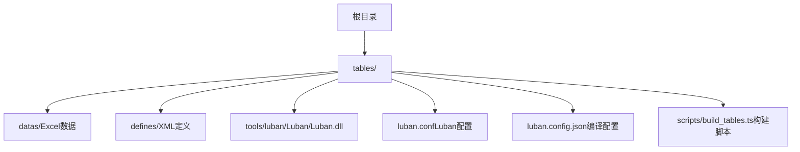
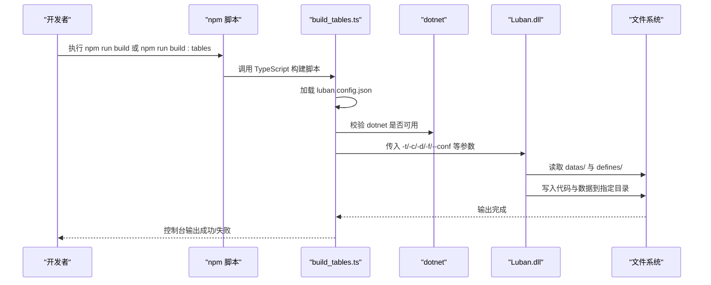
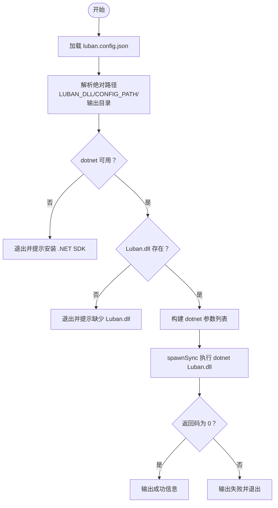
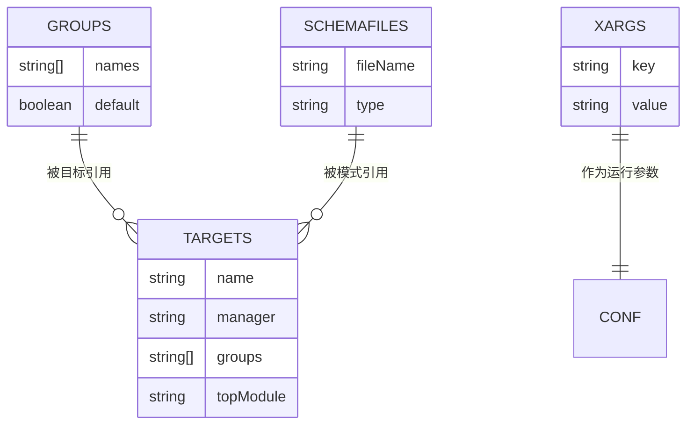
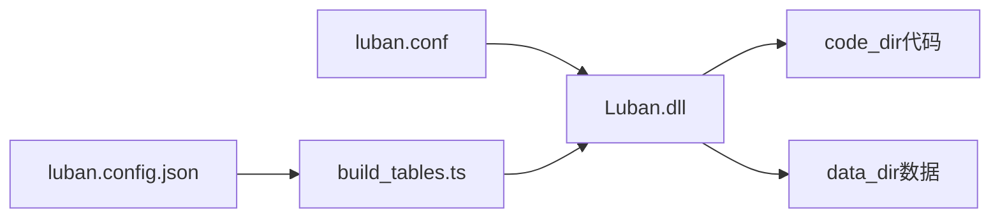

# Luban工具使用

<cite>
**本文引用的文件**
- [build_tables.ts](file://tables/scripts/build_tables.ts)
- [luban.conf](file://tables/luban.conf)
- [luban.config.json](file://tables/luban.config.json)
- [tables/README.md](file://tables/README.md)
- [package.json](file://package.json)
- [server/package.json](file://server/package.json)
- [__tables__.xlsx](file://tables/datas/__tables__.xlsx)
- [__beans__.xlsx](file://tables/datas/__beans__.xlsx)
- [__enums__.xlsx](file://tables/datas/__enums__.xlsx)
- [common.xml](file://tables/defines/common.xml)
- [builtin.xml](file://tables/defines/builtin.xml)
- [l10n.xml](file://tables/defines/l10n.xml)
</cite>

## 目录
1. [简介](#简介)
2. [项目结构](#项目结构)
3. [核心组件](#核心组件)
4. [架构总览](#架构总览)
5. [详细组件分析](#详细组件分析)
6. [依赖关系分析](#依赖关系分析)
7. [性能考虑](#性能考虑)
8. [故障排除指南](#故障排除指南)
9. [结论](#结论)
10. [附录](#附录)

## 简介
本文件为Luban配置表工具的完整使用指南，覆盖安装与配置、命令行使用、配置文件参数详解（groups、schemaFiles、targets等）、从安装到生成最终代码的全流程、常见问题解决以及性能优化建议。Luban在本项目中用于将Excel配置表转换为TypeScript/Lua代码与JSON数据，供游戏服务器端使用。

## 项目结构
Luban相关的核心位置位于`tables/`目录，包含：
- 配置表Excel数据：`datas/`（含系统内置表与业务表）
- XML定义文件：`defines/`（类型与字段约束定义）
- Luban工具DLL：`tools/luban/Luban/Luban.dll`
- 配置文件：`luban.conf`（Luban运行时配置）、`luban.config.json`（编译脚本输入输出路径）
- 编译脚本：`scripts/build_tables.ts`（TypeScript实现的构建入口）

图表来源
- [tables/README.md:1-33](file://tables/README.md#L1-L33)
- [luban.config.json:1-33](file://tables/luban.config.json#L1-L33)

章节来源
- [tables/README.md:1-33](file://tables/README.md#L1-L33)
- [package.json:1-48](file://package.json#L1-L48)

## 核心组件
- 构建脚本：负责加载编译配置、校验环境、拼接Luban命令参数并执行dotnet运行Luban.dll。
- Luban配置：定义分组、模式文件、数据目录与目标产物。
- 编译配置：定义输入输出路径、目标语言与启用的目标集。
- 数据与定义：Excel表格与XML定义共同构成Schema，驱动代码与数据生成。

章节来源
- [build_tables.ts:48-54](file://tables/scripts/build_tables.ts#L48-L54)
- [luban.conf:1-27](file://tables/luban.conf#L1-L27)
- [luban.config.json:1-33](file://tables/luban.config.json#L1-L33)

## 架构总览
下图展示了从命令行触发到生成最终代码与数据的端到端流程：

图表来源
- [build_tables.ts:155-166](file://tables/scripts/build_tables.ts#L155-L166)
- [build_tables.ts:168-184](file://tables/scripts/build_tables.ts#L168-L184)
- [luban.config.json:10-28](file://tables/luban.config.json#L10-L28)

## 详细组件分析

### 构建脚本 build_tables.ts
- 职责：加载编译配置、校验Luban.dll与dotnet环境、解析输出目录、拼接并执行Luban命令。
- 关键行为：
  - 读取luban.config.json，解析输入输出路径与目标集合。
  - 校验Luban.dll存在性与dotnet可用性。
  - 通过spawnSync调用dotnet Luban.dll，并传递必要的-x参数。
  - 支持多目标（lua/json/all），按配置启用或禁用。

图表来源
- [build_tables.ts:86-195](file://tables/scripts/build_tables.ts#L86-L195)

章节来源
- [build_tables.ts:48-54](file://tables/scripts/build_tables.ts#L48-L54)
- [build_tables.ts:109-140](file://tables/scripts/build_tables.ts#L109-L140)
- [build_tables.ts:155-166](file://tables/scripts/build_tables.ts#L155-L166)
- [build_tables.ts:168-184](file://tables/scripts/build_tables.ts#L168-L184)

### Luban配置文件 luban.conf
- groups：定义分组及其默认状态，影响哪些表参与生成。
- schemaFiles：声明模式文件来源（XML定义目录与Excel表）。
- dataDir：数据目录，配合schemaFiles中的相对路径使用。
- targets：定义生成目标（如lua、json、all），以及分组与顶层模块名。
- xargs：额外参数（如本地化文本提供文件）。

图表来源
- [luban.conf:1-27](file://tables/luban.conf#L1-L27)

章节来源
- [luban.conf:1-27](file://tables/luban.conf#L1-L27)

### 编译配置文件 luban.config.json
- luban_dll：Luban.dll的相对路径。
- input：data_dir、define_dir、config_file。
- output：code_dir、data_dir、targets（每个目标包含name、code_type、data_type、enabled）。
- luban_args：传递给Luban的额外参数（如l10n_text_provider_file）。

章节来源
- [luban.config.json:1-33](file://tables/luban.config.json#L1-L33)

### 数据与定义文件
- datas/：包含系统内置表与业务表，如：
  - __tables__.xlsx：注册所有表的元信息
  - __beans__.xlsx：Bean定义
  - __enums__.xlsx：枚举定义
  - 其他业务表（如item、role、mail等）
- defines/：XML定义文件，如common.xml、builtin.xml、l10n.xml等，用于约束字段类型与规则。

章节来源
- [__tables__.xlsx](file://tables/datas/__tables__.xlsx)
- [__beans__.xlsx](file://tables/datas/__beans__.xlsx)
- [__enums__.xlsx](file://tables/datas/__enums__.xlsx)
- [common.xml](file://tables/defines/common.xml)
- [builtin.xml](file://tables/defines/builtin.xml)
- [l10n.xml](file://tables/defines/l10n.xml)

## 依赖关系分析
- 构建脚本依赖luban.config.json提供的输入输出路径与目标集合。
- Luban运行时依赖luban.conf中的分组、模式文件与目标配置。
- 输出产物由Luban根据输入数据与定义生成，写入到指定的code_dir与data_dir。

图表来源
- [luban.config.json:10-28](file://tables/luban.config.json#L10-L28)
- [luban.conf:16-22](file://tables/luban.conf#L16-L22)
- [build_tables.ts:155-166](file://tables/scripts/build_tables.ts#L155-L166)

章节来源
- [luban.config.json:10-28](file://tables/luban.config.json#L10-L28)
- [luban.conf:16-22](file://tables/luban.conf#L16-L22)
- [build_tables.ts:155-166](file://tables/scripts/build_tables.ts#L155-L166)

## 性能考虑
- 并行生成：Luban支持多目标并行处理，可通过targets配置启用多个目标以提升效率。
- 减少无效扫描：合理设置groups与schemaFiles，避免不必要的表与定义参与生成。
- 输出目录分离：将code_dir与data_dir置于高性能磁盘，减少I/O瓶颈。
- 缓存与增量：在CI环境中复用dotnet缓存与Luban中间结果，缩短构建时间。
- 环境优化：确保dotnet版本与Luban.dll版本匹配，避免兼容性导致的重试与失败。

## 故障排除指南
- 缺少 .NET SDK
  - 现象：提示dotnet不可用或安装指引。
  - 处理：根据操作系统安装.NET SDK 8.0+。
- 缺少 Luban.dll
  - 现象：提示Luban.dll未找到。
  - 处理：确认tools/luban/Luban/Luban.dll存在且路径正确。
- 配置文件缺失
  - 现象：提示luban.conf未找到。
  - 处理：确认luban.config.json中的config_file指向正确。
- 构建失败
  - 现象：Luban执行返回非零状态。
  - 处理：检查Excel数据格式、XML定义是否符合Schema；查看控制台输出定位具体错误。
- 输出目录权限不足
  - 现象：无法写入code_dir或data_dir。
  - 处理：确保当前用户对输出目录具有写权限。

章节来源
- [build_tables.ts:118-139](file://tables/scripts/build_tables.ts#L118-L139)
- [build_tables.ts:141-145](file://tables/scripts/build_tables.ts#L141-L145)
- [build_tables.ts:174-184](file://tables/scripts/build_tables.ts#L174-L184)

## 结论
Luban在本项目中承担了配置表到代码与数据的自动化生成职责。通过合理的配置文件组织与构建脚本调用，可高效地产出TypeScript/Lua代码与JSON数据，支撑服务端开发。遵循本文档的安装、配置与使用流程，并结合性能优化与故障排除建议，可显著提升开发效率与稳定性。

## 附录

### 安装与配置步骤
- 安装 .NET SDK 8.0+
- 确保Luban.dll存在于tools/luban/Luban/Luban.dll
- 配置luban.config.json的输入输出路径
- 配置luban.conf的groups、schemaFiles、targets与xargs
- 运行npm脚本进行构建

章节来源
- [tables/README.md:68-84](file://tables/README.md#L68-L84)
- [tables/README.md:86-108](file://tables/README.md#L86-L108)
- [tables/README.md:110-131](file://tables/README.md#L110-L131)

### 命令行使用方法
- 推荐方式：在tables目录执行npm run build
- 从根目录执行：npm run build:tables
- 从server目录执行：cd server && npm run build:tables

章节来源
- [tables/README.md:35-62](file://tables/README.md#L35-L62)
- [package.json:19](file://package.json#L19)
- [server/package.json:14](file://server/package.json#L14)

### 关键配置项说明
- groups
  - 作用：定义分组名称与默认是否参与生成。
  - 设置：在luban.conf中添加或修改分组对象数组。
- schemaFiles
  - 作用：声明模式文件来源（XML定义目录与Excel表）。
  - 设置：在luban.conf中添加或修改文件条目。
- targets
  - 作用：定义生成目标（lua/json/all），以及分组与顶层模块名。
  - 设置：在luban.conf中添加或修改目标对象数组。
- xargs
  - 作用：传递额外运行参数（如本地化文本提供文件）。
  - 设置：在luban.conf中添加或修改xargs数组。

章节来源
- [luban.conf:2-8](file://tables/luban.conf#L2-L8)
- [luban.conf:9-15](file://tables/luban.conf#L9-L15)
- [luban.conf:17-22](file://tables/luban.conf#L17-L22)
- [luban.conf:23-26](file://tables/luban.conf#L23-L26)

### 实际使用示例与最佳实践
- 示例：新增一个业务表
  - 在datas/下创建Excel文件
  - 在defines/下创建对应XML定义（如需要）
  - 在__tables__.xlsx中注册新表
  - 运行npm run build生成代码与数据
- 最佳实践
  - 将常用配置放入luban.config.json，便于团队统一管理
  - 合理拆分groups，按模块划分生成范围
  - 使用XML定义严格约束字段类型与规则，减少运行期错误
  - 在CI中缓存dotnet与Luban依赖，加速构建

章节来源
- [tables/README.md:133-139](file://tables/README.md#L133-L139)
- [tables/README.md:140-151](file://tables/README.md#L140-L151)