# 多语言导出机制

<cite>
**本文档引用的文件**
- [luban.config.json](file://tables/luban.config.json)
- [luban.conf](file://tables/luban.conf)
- [build_tables.ts](file://tables/scripts/build_tables.ts)
- [Luban.dll](file://tables/tools/luban/Luban/Luban.dll)
- [Luban.Core.dll](file://tables/tools/luban/Luban/Luban.Core.dll)
- [Luban.CSharp.dll](file://tables/tools/luban/Luban/Luban.CSharp.dll)
- [Luban.Cpp.dll](file://tables/tools/luban/Luban/Luban.Cpp.dll)
- [Luban.Golang.dll](file://tables/tools/luban/Luban/Luban.Golang.dll)
- [Luban.Java.dll](file://tables/tools/luban/Luban/Luban.Java.dll)
- [Luban.Javascript.dll](file://tables/tools/luban/Luban/Luban.Javascript.dll)
- [Luban.Typescript.dll](file://tables/tools/luban/Luban/Luban.Typescript.dll)
- [Luban.Rust.dll](file://tables/tools/luban/Luban/Luban.Rust.dll)
- [Luban.Dart.dll](file://tables/tools/luban/Luban/Luban.Dart.dll)
- [Luban.FlatBuffers.dll](file://tables/tools/luban/Luban/Luban.FlatBuffers.dll)
- [Luban.Protobuf.dll](file://tables/tools/luban/Luban/Luban.Protobuf.dll)
- [Luban.PHP.dll](file://tables/tools/luban/Luban/Luban.PHP.dll)
- [Luban.Python.dll](file://tables/tools/luban/Luban/Luban.Python.dll)
- [Luban.Gdscript.dll](file://tables/tools/luban/Luban/Luban.Gdscript.dll)
- [Luban.Bson.dll](file://tables/tools/luban/Luban/Luban.Bson.dll)
- [Luban.DataTarget.Builtin.dll](file://tables/tools/luban/Luban/Luban.DataTarget.Builtin.dll)
- [Luban.DataLoader.Builtin.dll](file://tables/tools/luban/Luban/Luban.DataLoader.Builtin.dll)
- [Luban.DataValidator.Builtin.dll](file://tables/tools/luban/Luban/Luban.DataValidator.Builtin.dll)
- [Luban.Schema.Builtin.dll](file://tables/tools/luban/Luban/Luban.Schema.Builtin.dll)
- [L10N.dll](file://tables/tools/luban/Luban/Luban.L10N.dll)
- [enum.sbn](file://tables/tools/luban/Luban/Templates/common/cpp/enum.sbn)
- [bean.sbn](file://tables/tools/luban/Luban/Templates/cpp-rawptr-bin/bean.sbn)
- [schema_cpp.sbn](file://tables/tools/luban/Luban/Templates/cpp-rawptr-bin/schema_cpp.sbn)
- [schema_h.sbn](file://tables/tools/luban/Luban/Templates/cpp-rawptr-bin/schema_h.sbn)
- [table.sbn](file://tables/tools/luban/Luban/Templates/cpp-rawptr-bin/table.sbn)
- [tables.sbn](file://tables/tools/luban/Luban/Templates/cpp-rawptr-bin/tables.sbn)
- [目录结构说明.md](file://docs/目录结构说明.md)
- [Luban配置表指南.md](file://docs/Luban配置表指南.md)
</cite>

## 目录
1. [简介](#简介)
2. [项目结构](#项目结构)
3. [核心组件](#核心组件)
4. [架构概览](#架构概览)
5. [详细组件分析](#详细组件分析)
6. [依赖关系分析](#依赖关系分析)
7. [性能考虑](#性能考虑)
8. [故障排除指南](#故障排除指南)
9. [结论](#结论)
10. [附录](#附录)

## 简介

Luban是一个强大的多语言数据表导出工具，专门用于游戏开发中的配置表和数据表处理。该工具支持多种编程语言的代码生成，包括C++、C#、Java、JavaScript、TypeScript、Go、Rust、Dart、PHP、Python等，并提供了丰富的模板系统来满足不同项目的需求。

Luban的核心功能是将Excel格式的数据表转换为各种编程语言的强类型代码和序列化数据格式。通过灵活的模板系统，开发者可以定制生成的代码风格、数据格式和注释规范，从而适应不同的项目架构和编码标准。

## 项目结构

Luban工具在项目中的组织结构如下：

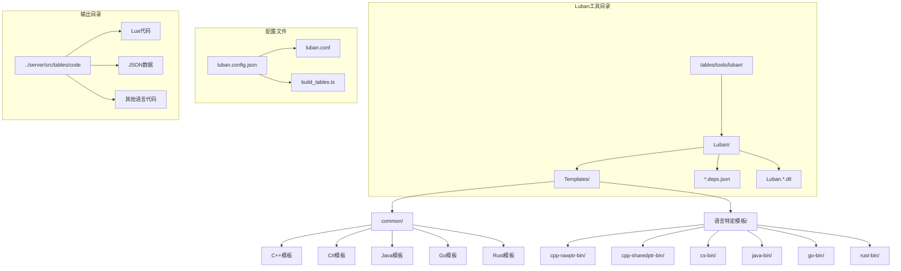

**图表来源**
- [目录结构说明.md:96](file://docs/目录结构说明.md#L96)
- [luban.config.json:1-33](file://tables/luban.config.json#L1-L33)

**章节来源**
- [目录结构说明.md:96](file://docs/目录结构说明.md#L96)
- [luban.config.json:1-33](file://tables/luban.config.json#L1-L33)

## 核心组件

### 配置管理系统

Luban使用双层配置系统来管理导出设置：

1. **luban.config.json**: 主配置文件，定义输入输出目录和目标语言设置
2. **luban.conf**: 详细配置文件，定义数据表结构和导出目标

### 导出目标管理

系统支持以下主要导出目标：

| 目标名称 | 语言支持 | 数据格式 | 使用场景 |
|---------|----------|----------|----------|
| lua | Lua | Lua代码 + JSON数据 | 游戏逻辑层 |
| json | JSON | 序列化数据 | 跨平台兼容性 |
| cpp-rawptr-bin | C++ | 原始指针二进制 | 性能敏感场景 |
| cpp-sharedptr-bin | C++ | 智能指针二进制 | 内存安全场景 |
| cs-bin | C# | 二进制格式 | Unity游戏 |
| cs-json | C# | JSON格式 | Web服务 |
| java-bin | Java | 二进制格式 | Android应用 |
| java-json | Java | JSON格式 | 跨平台应用 |
| go-bin | Go | 二进制格式 | 后端服务 |
| go-json | Go | JSON格式 | 微服务 |
| rust-bin | Rust | 二进制格式 | 系统级编程 |
| rust-json | Rust | JSON格式 | 安全关键应用 |
| typescript-bin | TypeScript | 二进制格式 | 前端应用 |
| typescript-json | TypeScript | JSON格式 | Web前端 |

**章节来源**
- [luban.config.json:14-28](file://tables/luban.config.json#L14-L28)
- [luban.conf:17-22](file://tables/luban.conf#L17-L22)

## 架构概览

Luban采用模块化的插件架构，核心组件包括：

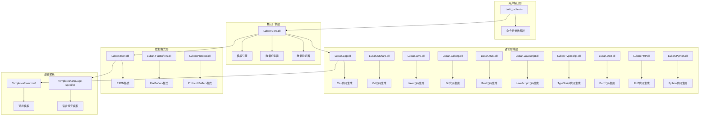

**图表来源**
- [Luban.dll:1](file://tables/tools/luban/Luban/Luban.dll#L1)
- [Luban.Core.dll:1](file://tables/tools/luban/Luban/Luban.Core.dll#L1)
- [Luban.Cpp.dll:1](file://tables/tools/luban/Luban/Luban.Cpp.dll#L1)
- [Luban.CSharp.dll:1](file://tables/tools/luban/Luban/Luban.CSharp.dll#L1)

### 模板系统架构

Luban的模板系统采用分层设计：

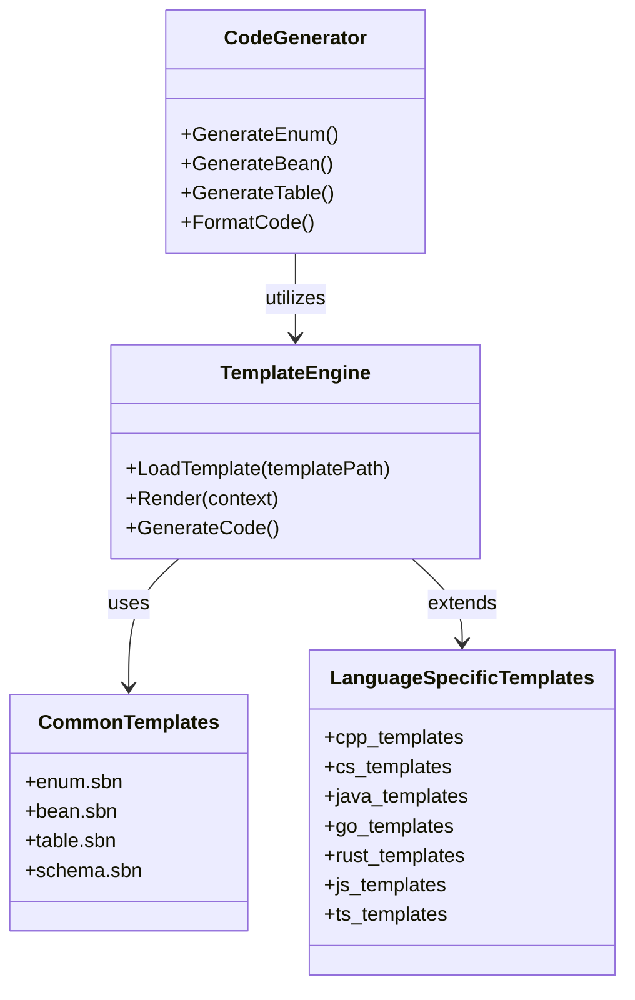

**图表来源**
- [enum.sbn:1](file://tables/tools/luban/Luban/Templates/common/cpp/enum.sbn#L1)
- [bean.sbn:1](file://tables/tools/luban/Luban/Templates/cpp-rawptr-bin/bean.sbn#L1)

**章节来源**
- [Luban.dll:1](file://tables/tools/luban/Luban/Luban.dll#L1)
- [Luban.Core.dll:1](file://tables/tools/luban/Luban/Luban.Core.dll#L1)

## 详细组件分析

### C++导出机制

#### 模板配置
C++支持两种内存管理模式：

1. **原始指针模式 (cpp-rawptr-bin)**：直接使用原始指针，内存管理责任在调用方
2. **智能指针模式 (cpp-sharedptr-bin)**：使用std::shared_ptr，自动内存管理

#### 代码生成流程
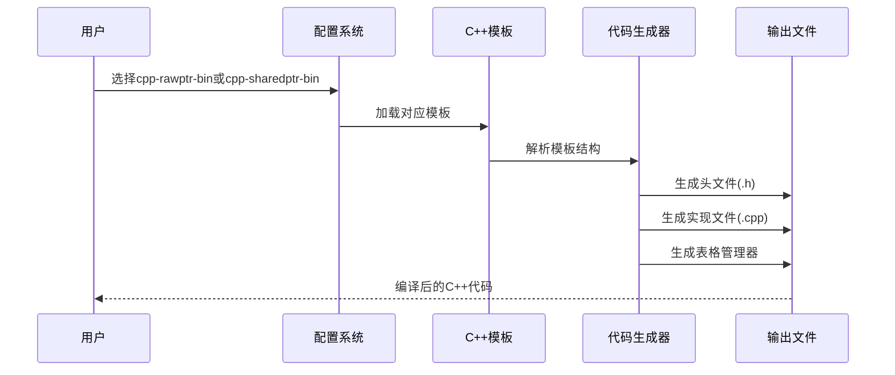

**图表来源**
- [schema_h.sbn:1](file://tables/tools/luban/Luban/Templates/cpp-rawptr-bin/schema_h.sbn#L1)
- [schema_cpp.sbn:1](file://tables/tools/luban/Luban/Templates/cpp-rawptr-bin/schema_cpp.sbn#L1)

#### 数据类型映射
| Excel类型 | C++类型 | 备注 |
|-----------|---------|------|
| string | std::string | UTF-8编码 |
| int32/int64 | int32_t/int64_t | 固定宽度整数 |
| float/double | float/double | 浮点精度 |
| bool | bool | 布尔值 |
| array/list | std::vector<T> | 动态数组 |
| map/dict | std::unordered_map<string,T> | 键值对 |
| enum | 枚举类 | 自动枚举生成 |

**章节来源**
- [bean.sbn:1](file://tables/tools/luban/Luban/Templates/cpp-rawptr-bin/bean.sbn#L1)
- [table.sbn:1](file://tables/tools/luban/Luban/Templates/cpp-rawptr-bin/table.sbn#L1)
- [tables.sbn:1](file://tables/tools/luban/Luban/Templates/cpp-rawptr-bin/tables.sbn#L1)

### C#导出机制

#### 模板类型
C#支持以下导出格式：

1. **二进制格式 (cs-bin)**：高性能，适合游戏逻辑
2. **JSON格式 (cs-json)**：跨平台兼容，调试友好
3. **Newtonsoft JSON (cs-newtonsoft-json)**：第三方库支持
4. **Simple JSON (cs-simple-json)**：轻量级JSON处理

#### 代码生成特性
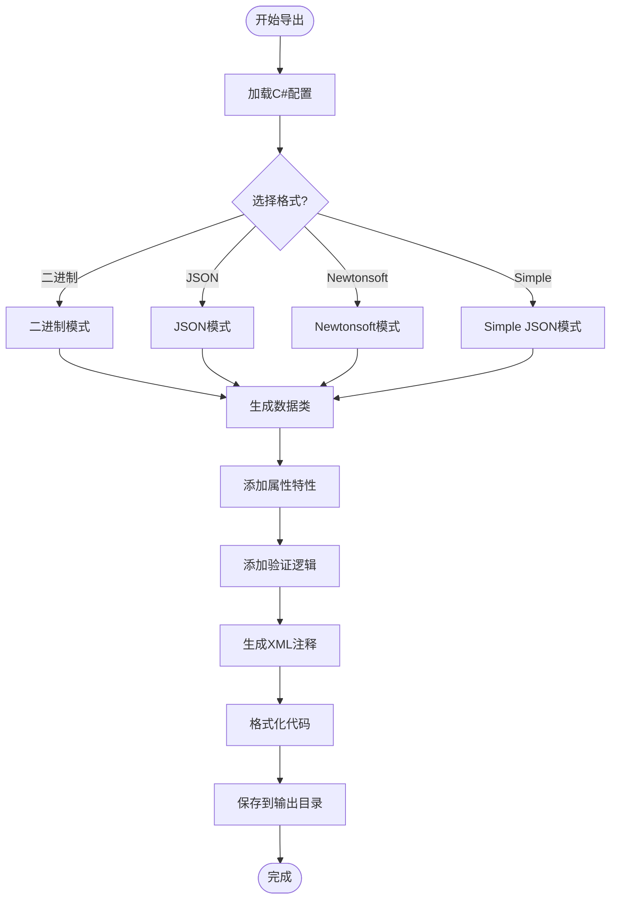

**图表来源**
- [Luban.CSharp.dll:1](file://tables/tools/luban/Luban/Luban.CSharp.dll#L1)

#### 类型映射规则
| Excel类型 | C#类型 | 特殊处理 |
|-----------|--------|----------|
| string | string | Unicode支持 |
| int32/int64 | int/int64 | 范围检查 |
| float/double | float/double | 精度控制 |
| bool | bool | 布尔转换 |
| array | List<T> | 泛型集合 |
| map | Dictionary<string,T> | 字典映射 |
| enum | 枚举类型 | 自动枚举生成 |

**章节来源**
- [Luban.CSharp.dll:1](file://tables/tools/luban/Luban/Luban.CSharp.dll#L1)

### Java导出机制

#### 导出格式
Java支持两种主要格式：

1. **二进制格式 (java-bin)**：使用Java序列化
2. **JSON格式 (java-json)**：使用Jackson库

#### 代码结构
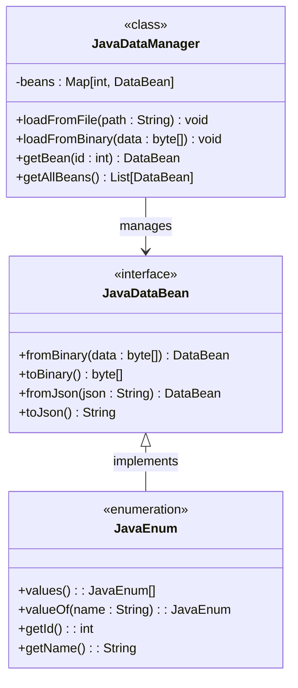

**图表来源**
- [Luban.Java.dll:1](file://tables/tools/luban/Luban/Luban.Java.dll#L1)

**章节来源**
- [Luban.Java.dll:1](file://tables/tools/luban/Luban/Luban.Java.dll#L1)

### JavaScript/TypeScript导出机制

#### 模板类型
JavaScript和TypeScript共享相同的模板系统：

1. **二进制格式 (javascript-bin/typescript-bin)**：二进制协议
2. **JSON格式 (javascript-json/typescript-json)**：JSON数据格式

#### 代码生成特点
- 自动生成TypeScript声明文件
- 支持模块化导入导出
- 提供完整的类型定义
- 包含注释和文档字符串

**章节来源**
- [Luban.Javascript.dll:1](file://tables/tools/luban/Luban/Luban.Javascript.dll#L1)
- [Luban.Typescript.dll:1](file://tables/tools/luban/Luban/Luban.Typescript.dll#L1)

### Go导出机制

#### 导出格式
Go语言支持以下格式：

1. **二进制格式 (go-bin)**：使用Go的encoding/gob
2. **JSON格式 (go-json)**：标准JSON处理

#### 并发安全设计
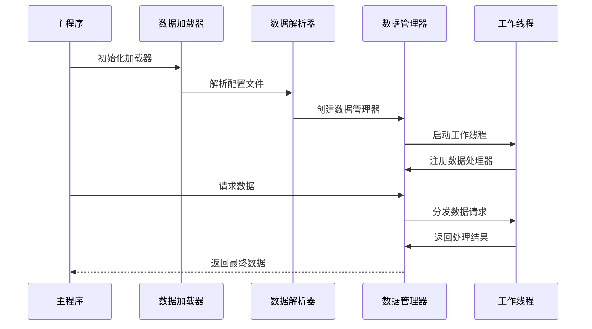

**图表来源**
- [Luban.Golang.dll:1](file://tables/tools/luban/Luban/Luban.Golang.dll#L1)

**章节来源**
- [Luban.Golang.dll:1](file://tables/tools/luban/Luban/Luban.Golang.dll#L1)

### Rust导出机制

#### 内存安全保证
Rust导出机制专注于内存安全：

1. **二进制格式 (rust-bin)**：零拷贝访问
2. **JSON格式 (rust-json)**：安全的JSON处理

#### 类型系统集成
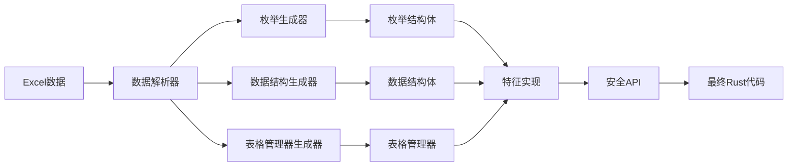

**图表来源**
- [Luban.Rust.dll:1](file://tables/tools/luban/Luban/Luban.Rust.dll#L1)

**章节来源**
- [Luban.Rust.dll:1](file://tables/tools/luban/Luban/Luban.Rust.dll#L1)

## 依赖关系分析

### 核心依赖链

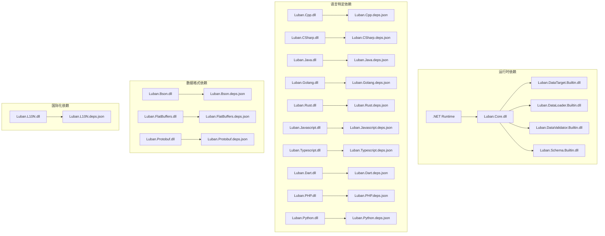

**图表来源**
- [Luban.Core.deps.json:1](file://tables/tools/luban/Luban/Luban.Core.deps.json#L1)
- [Luban.Cpp.deps.json:1](file://tables/tools/luban/Luban/Luban.Cpp.deps.json#L1)
- [Luban.CSharp.deps.json:1](file://tables/tools/luban/Luban/Luban.CSharp.deps.json#L1)

### 模块间通信

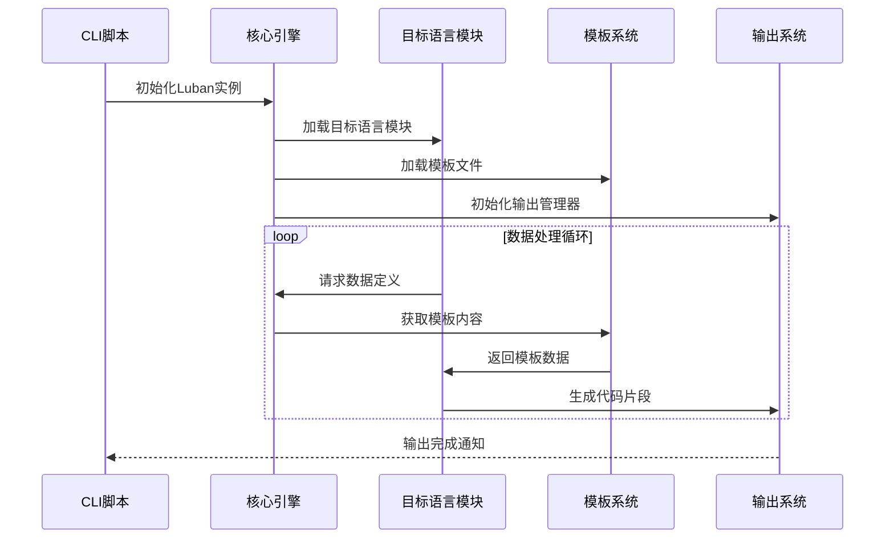

**图表来源**
- [build_tables.ts:155](file://tables/scripts/build_tables.ts#L155)

**章节来源**
- [Luban.Core.deps.json:1](file://tables/tools/luban/Luban/Luban.Core.deps.json#L1)
- [build_tables.ts:155](file://tables/scripts/build_tables.ts#L155)

## 性能考虑

### 内存使用优化

| 语言 | 内存模型 | 性能特点 | 适用场景 |
|------|----------|----------|----------|
| C++ | 原始指针 | 最低内存占用 | 游戏引擎 |
| C# | GC管理 | 自动内存回收 | Unity游戏 |
| Java | GC管理 | 跨平台兼容 | Android应用 |
| Go | GC管理 | 并发友好 | 服务器端 |
| Rust | 所有权系统 | 零成本抽象 | 系统编程 |
| JavaScript | V8引擎 | 动态类型 | Web前端 |

### 序列化性能对比

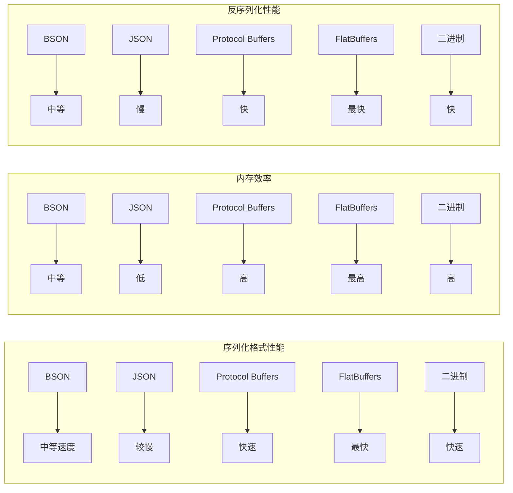

### 编译时间优化

1. **增量编译**：只重新编译变更的数据表
2. **并行处理**：多核CPU并行处理多个语言目标
3. **缓存机制**：缓存中间结果减少重复计算

## 故障排除指南

### 常见问题及解决方案

#### .NET运行时问题
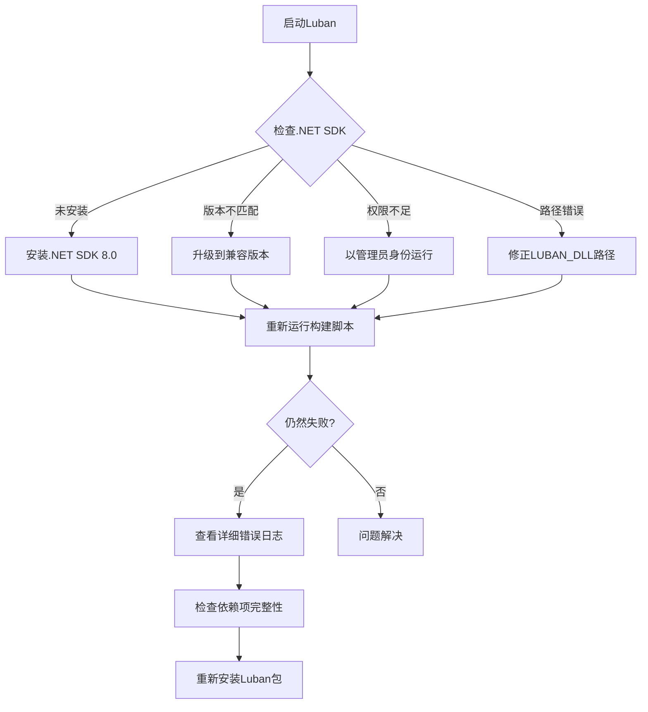

**图表来源**
- [build_tables.ts:118](file://tables/scripts/build_tables.ts#L118)

#### 模板加载失败
1. **检查模板路径**：确认Templates目录存在且可访问
2. **验证模板语法**：检查.sbn文件的语法正确性
3. **清理缓存**：删除bin目录下的临时文件

#### 数据验证错误
1. **检查Excel格式**：确保数据表符合预期格式
2. **验证数据类型**：确认字段类型与模板匹配
3. **查看约束条件**：检查枚举值和范围限制

**章节来源**
- [build_tables.ts:118](file://tables/scripts/build_tables.ts#L118)

### 性能调优建议

1. **优化模板复杂度**：简化复杂的模板逻辑
2. **启用增量编译**：利用Luban的增量编译功能
3. **合理配置并发**：根据硬件资源调整并发数量
4. **监控内存使用**：定期检查内存使用情况

## 结论

Luban多语言导出机制通过其模块化架构和丰富的模板系统，为游戏开发提供了强大而灵活的数据表处理解决方案。该工具不仅支持主流的编程语言，还提供了多种数据格式和内存管理模式，能够满足不同项目的需求。

关键优势包括：
- **高度可定制**：通过模板系统实现完全的代码风格控制
- **多语言支持**：覆盖从系统编程到Web开发的广泛语言
- **性能优化**：提供多种序列化格式以满足不同性能需求
- **开发友好**：完善的错误处理和调试支持

未来发展方向可能包括：
- 更多语言的支持扩展
- 更智能的模板生成算法
- 更好的IDE集成支持
- 云端协作功能

## 附录

### 使用示例

#### 基本配置示例
```json
{
  "luban_dll": "tools/luban/Luban/Luban.dll",
  "input": {
    "data_dir": "datas",
    "define_dir": "defines",
    "config_file": "luban.conf"
  },
  "output": {
    "code_dir": "../server/src/tables",
    "data_dir": "../server/src/tables/data",
    "targets": [
      {
        "name": "lua",
        "code_type": "lua-lua",
        "data_type": "lua",
        "enabled": true
      }
    ]
  }
}
```

#### 命令行参数说明
- `-t`: 指定目标类型
- `-c`: 指定代码类型
- `-d`: 指定数据类型
- `-f`: 强制覆盖输出
- `--conf`: 指定配置文件路径
- `-x`: 传递额外参数

### 最佳实践

1. **模板维护**：定期更新模板以支持新的语言特性和编码标准
2. **版本控制**：将生成的代码纳入版本控制系统
3. **测试策略**：为生成的代码编写单元测试
4. **文档同步**：保持数据表文档与生成代码的一致性
5. **性能监控**：定期评估生成代码的性能表现

### 扩展开发

#### 自定义语言后端开发步骤
1. **创建新模块**：基于现有语言模块创建新模块
2. **实现接口**：实现必要的接口和抽象类
3. **开发模板**：创建对应的模板文件
4. **测试验证**：进行全面的功能和性能测试
5. **文档编写**：编写使用文档和示例代码

#### 自定义模板开发要点
1. **模板语法**：遵循Luban模板语法规则
2. **类型映射**：正确处理数据类型转换
3. **错误处理**：实现健壮的错误处理机制
4. **性能优化**：考虑生成代码的执行效率
5. **代码风格**：遵循目标语言的编码规范