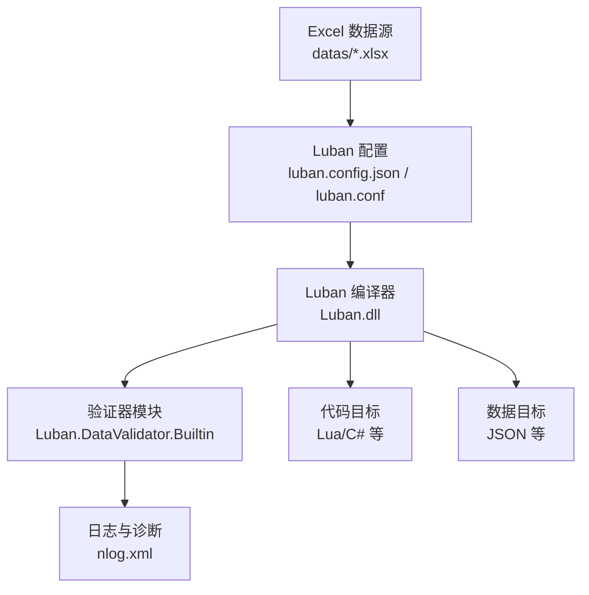
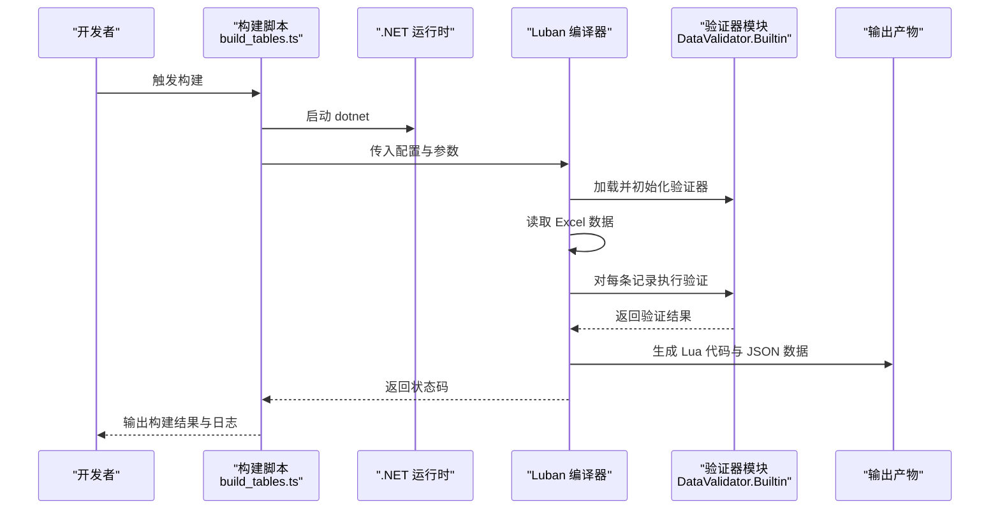
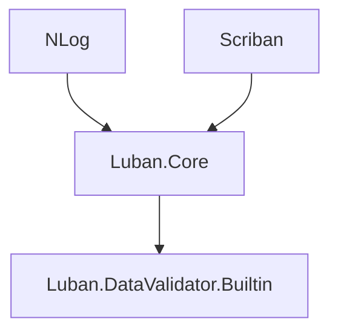

# 数据验证规则

<cite>
**本文引用的文件**
- [luban.config.json](file://tables/luban.config.json)
- [luban.conf](file://tables/luban.conf)
- [build_tables.ts](file://tables/scripts/build_tables.ts)
- [common.xml](file://tables/defines/common.xml)
- [item.xml](file://tables/defines/item.xml)
- [tag.xml](file://tables/defines/tag.xml)
- [nlog.xml](file://tables/tools/luban/Luban/nlog.xml)
- [Luban.DataValidator.Builtin.deps.json](file://tables/tools/luban/Luban/Luban.DataValidator.Builtin.deps.json)
</cite>

## 目录
1. [引言](#引言)
2. [项目结构](#项目结构)
3. [核心组件](#核心组件)
4. [架构总览](#架构总览)
5. [详细组件分析](#详细组件分析)
6. [依赖关系分析](#依赖关系分析)
7. [性能考量](#性能考量)
8. [故障排查指南](#故障排查指南)
9. [结论](#结论)
10. [附录](#附录)

## 引言
本文件聚焦于配置表数据验证规则，系统性阐述 XML 定义文件中的验证规则配置与实现机制。内容涵盖必填字段检查、数据范围验证、格式校验、字段间关联与条件验证、验证器使用与配置选项（如长度限制、数值范围、正则表达式）、验证失败反馈与调试方法，并总结设计原则与最佳实践。

## 项目结构
配置表体系由“定义文件（XML）+ 编译器（Luban）+ 输出（Lua/JSON）”构成。验证能力由 Luban 的内置验证器模块提供，通过构建脚本统一触发。

图表来源
- [luban.config.json:1-33](file://tables/luban.config.json#L1-L33)
- [luban.conf:1-27](file://tables/luban.conf#L1-L27)
- [build_tables.ts:155-184](file://tables/scripts/build_tables.ts#L155-L184)
- [nlog.xml:1-26](file://tables/tools/luban/Luban/nlog.xml#L1-L26)

章节来源
- [luban.config.json:1-33](file://tables/luban.config.json#L1-L33)
- [luban.conf:1-27](file://tables/luban.conf#L1-L27)
- [build_tables.ts:155-184](file://tables/scripts/build_tables.ts#L155-L184)

## 核心组件
- 验证器模块：Luban 内置验证器，负责在数据导入阶段执行各类校验规则。
- 定义文件：XML 中的 bean/enum/table 声明为验证提供结构化约束。
- 构建脚本：封装 dotnet 与 Luban 的调用流程，统一输出代码与数据。
- 日志系统：NLog 配置用于输出验证过程中的信息、警告与错误。

章节来源
- [Luban.DataValidator.Builtin.deps.json:457-467](file://tables/tools/luban/Luban/Luban.DataValidator.Builtin.deps.json#L457-L467)
- [nlog.xml:1-26](file://tables/tools/luban/Luban/nlog.xml#L1-L26)

## 架构总览
以下序列图展示从 Excel 到最终数据与代码的验证与生成流程：

图表来源
- [build_tables.ts:155-184](file://tables/scripts/build_tables.ts#L155-L184)
- [luban.config.json:14-28](file://tables/luban.config.json#L14-L28)
- [Luban.DataValidator.Builtin.deps.json:457-467](file://tables/tools/luban/Luban/Luban.DataValidator.Builtin.deps.json#L457-L467)

## 详细组件分析

### XML 定义与验证基础
- Bean 与 Enum：作为数据模型的基础单元，为验证提供字段类型与取值范围约束。
- Table：声明具体配置表的输入路径与映射关系，驱动验证器对整表进行扫描与校验。
- 组标记（group）：用于控制不同目标（客户端/服务端/导出）的可见性与生成范围。

示例定位
- 全局配置 Bean 与表：[common.xml:33-47](file://tables/defines/common.xml#L33-L47)
- 道具表与配置表：[item.xml:149-172](file://tables/defines/item.xml#L149-L172)
- 标签测试表：[tag.xml:6-6](file://tables/defines/tag.xml#L6-L6)

章节来源
- [common.xml:1-48](file://tables/defines/common.xml#L1-L48)
- [item.xml:1-175](file://tables/defines/item.xml#L1-L175)
- [tag.xml:1-13](file://tables/defines/tag.xml#L1-L13)

### 验证器类型与配置选项
- 数值范围验证：基于 IntRange/FloatRange 等结构，对整数或浮点数字段执行最小/最大值校验。
- 字符串格式验证：通过分隔符、列表项等约定，实现复合字符串的结构化校验。
- 枚举取值验证：对枚举字段进行合法值集合校验，避免非法枚举值进入数据层。
- 时间与日期验证：基于 datetime 类型与时间范围结构，确保起止时间的合法性与时序正确性。
- 条件与关联验证：通过表级规则与跨字段约束，实现字段间依赖关系的校验。

示例定位
- 时间范围与时间段：[common.xml:2-16](file://tables/defines/common.xml#L2-L16)
- 整数/浮点范围：[common.xml:23-31](file://tables/defines/common.xml#L23-L31)
- 道具主/子类型枚举：[item.xml:21-85](file://tables/defines/item.xml#L21-L85)

章节来源
- [common.xml:2-16](file://tables/defines/common.xml#L2-L16)
- [common.xml:23-31](file://tables/defines/common.xml#L23-L31)
- [item.xml:21-85](file://tables/defines/item.xml#L21-L85)

### 验证规则设计原则与最佳实践
- 明确边界：为数值型字段设置明确的上下界，避免极端值导致运行期异常。
- 语义一致：枚举值应与业务语义保持一致，避免歧义或未覆盖的取值。
- 结构清晰：使用 Bean 将相关字段组织在一起，便于批量校验与复用。
- 可观测性：利用日志系统输出验证失败详情，便于快速定位问题。
- 可维护性：将验证规则集中在 XML 定义中，减少硬编码，提升可读性与可修改性。

### 验证失败反馈与调试
- 构建脚本输出：构建脚本会捕获 Luban 的返回状态并在控制台输出结果与错误信息。
- 日志系统：NLog 配置将 Info/Warn/Error/Fatal 级别日志输出到控制台，便于区分严重程度。
- 参数传递：构建脚本通过命令行参数向 Luban 传递输出目录与本地化文本提供者路径，确保验证上下文完整。

示例定位
- 构建命令拼装与执行：[build_tables.ts:155-184](file://tables/scripts/build_tables.ts#L155-L184)
- 日志目标与规则：[nlog.xml:14-24](file://tables/tools/luban/Luban/nlog.xml#L14-L24)

章节来源
- [build_tables.ts:155-184](file://tables/scripts/build_tables.ts#L155-L184)
- [nlog.xml:1-26](file://tables/tools/luban/Luban/nlog.xml#L1-L26)

## 依赖关系分析
验证器模块作为 Luban 的一部分被加载与使用，其依赖的核心库通过依赖清单体现。

图表来源
- [Luban.DataValidator.Builtin.deps.json:457-467](file://tables/tools/luban/Luban/Luban.DataValidator.Builtin.deps.json#L457-L467)
- [Luban.DataValidator.Builtin.deps.json:17-44](file://tables/tools/luban/Luban/Luban.DataValidator.Builtin.deps.json#L17-L44)

章节来源
- [Luban.DataValidator.Builtin.deps.json:457-467](file://tables/tools/luban/Luban/Luban.DataValidator.Builtin.deps.json#L457-L467)
- [Luban.DataValidator.Builtin.deps.json:17-44](file://tables/tools/luban/Luban/Luban.DataValidator.Builtin.deps.json#L17-L44)

## 性能考量
- 验证批处理：日志系统采用异步包装器以降低 I/O 对验证流程的影响。
- 并发与吞吐：构建脚本直接调用 dotnet 与 Luban，建议在 CI 环境中合理配置资源以提升吞吐。
- 数据规模：对于大规模 Excel 表，建议拆分表或分组验证，减少单次验证压力。

章节来源
- [nlog.xml:6-12](file://tables/tools/luban/Luban/nlog.xml#L6-L12)

## 故障排查指南
- 环境准备
  - 确认已安装 .NET SDK，构建脚本会检测 dotnet 命令可用性。
  - 确认 Luban.dll 存在且路径正确。
- 配置核对
  - 检查 luban.config.json 与 luban.conf 的输入/输出路径是否匹配。
  - 确认 Excel 数据源路径与定义文件中的 input 路径一致。
- 日志定位
  - 关注控制台输出的 Info/Warn/Error/Fatal 级别信息，结合 Excel 行号与字段名定位问题。
- 常见问题
  - 枚举值不在定义范围内：检查枚举定义与 Excel 输入值。
  - 数值越界：检查 IntRange/FloatRange 的边界与 Excel 输入。
  - 时间格式不合法：检查 datetime 字段格式与顺序。

章节来源
- [build_tables.ts:118-139](file://tables/scripts/build_tables.ts#L118-L139)
- [build_tables.ts:141-146](file://tables/scripts/build_tables.ts#L141-L146)
- [nlog.xml:22-24](file://tables/tools/luban/Luban/nlog.xml#L22-L24)

## 结论
通过将验证规则集中于 XML 定义文件，并借助 Luban 的内置验证器与构建脚本，项目实现了对配置表数据的结构化、可维护、可观测的验证。遵循本文提出的设计原则与最佳实践，可在保证数据质量的同时提升开发与运维效率。

## 附录
- 示例定位
  - 全局配置表定义：[common.xml:46-47](file://tables/defines/common.xml#L46-L47)
  - 道具配置表定义：[item.xml:172-172](file://tables/defines/item.xml#L172-L172)
  - 标签测试表定义：[tag.xml:6-6](file://tables/defines/tag.xml#L6-L6)