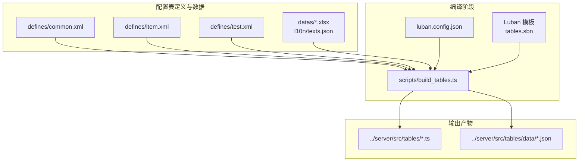
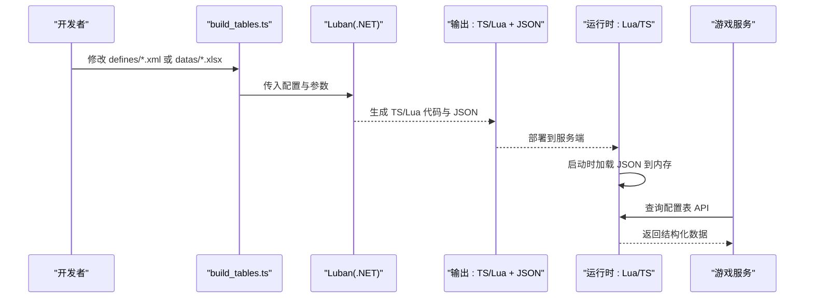
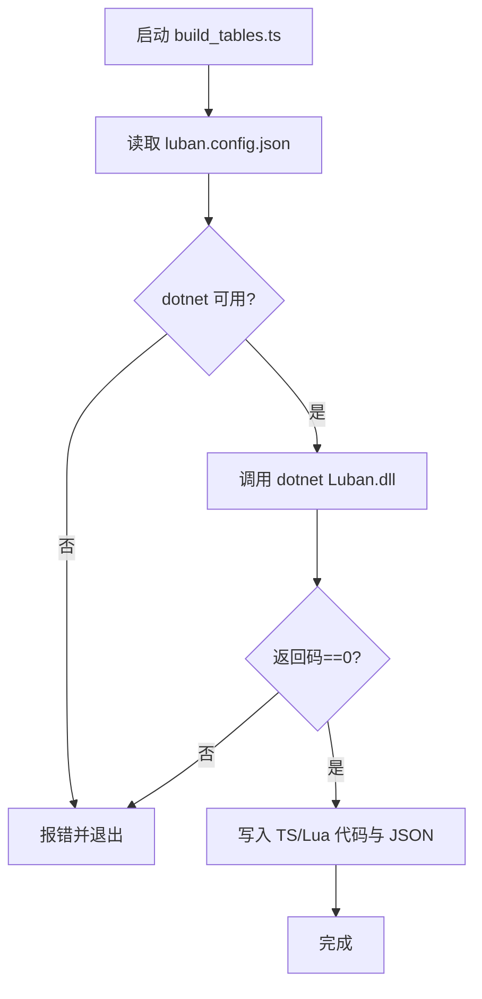
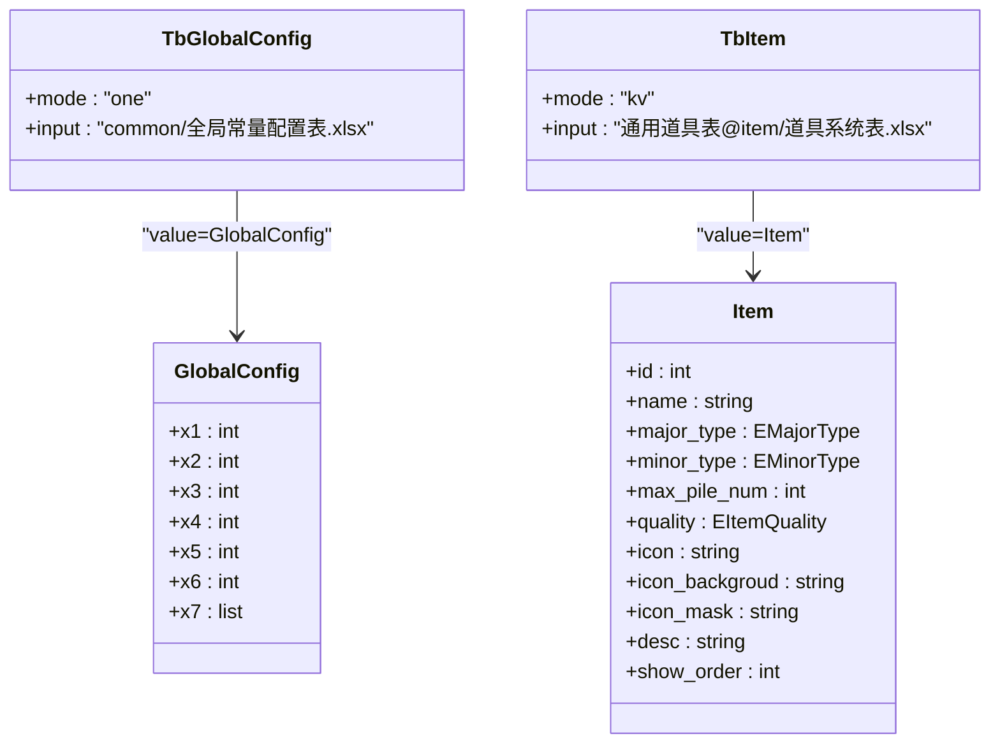
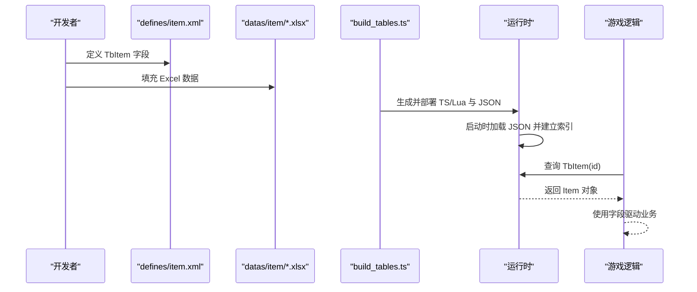
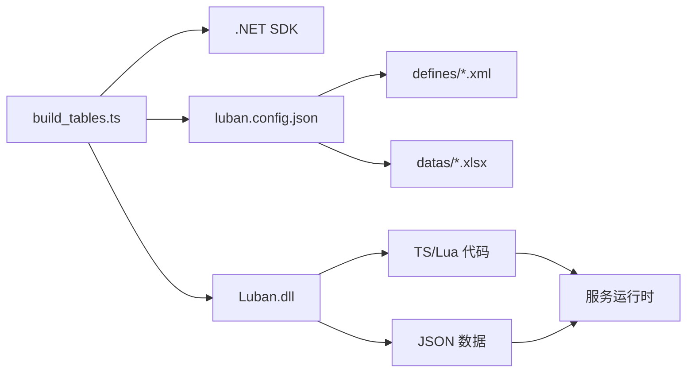

# 表格加载和使用

<cite>
**本文引用的文件**   
- [build_tables.ts](file://tables/scripts/build_tables.ts)
- [luban.config.json](file://tables/luban.config.json)
- [common.xml](file://tables/defines/common.xml)
- [item.xml](file://tables/defines/item.xml)
- [test.xml](file://tables/defines/test.xml)
- [skynet-adapter.ts](file://server/src/framework/runtime/skynet-adapter.ts)
- [index.ts](file://server/src/app/services/game/index.ts)
- [data.ts](file://server/src/app/services/game/data.ts)
- [index.lua](file://docker/lua/app/services/game/index.lua)
- [data.lua](file://docker/lua/app/services/game/data.lua)
- [tables.sbn](file://tables/tools/luban/Luban/Templates/cpp-sharedptr-bin/tables.sbn)
- [tables.sbn](file://tables/tools/luban/Luban/Templates/cpp-rawptr-bin/tables.sbn)
- [README.md](file://tables/README.md)
</cite>

## 目录
1. [简介](#简介)
2. [项目结构](#项目结构)
3. [核心组件](#核心组件)
4. [架构总览](#架构总览)
5. [详细组件分析](#详细组件分析)
6. [依赖关系分析](#依赖关系分析)
7. [性能考量](#性能考量)
8. [故障排查指南](#故障排查指南)
9. [结论](#结论)
10. [附录](#附录)

## 简介
本文件系统性阐述配置表在运行时的加载机制、内存存储与缓存策略，并给出在游戏逻辑中访问与使用配置表数据的方法、性能优化技巧、热更新与动态加载支持，以及从数据定义到业务逻辑调用的完整使用示例。同时说明配置表与游戏系统的集成方式与最佳实践，并提供常见问题排查方案。

## 项目结构
配置表体系由“定义（XML）+ 数据（Excel）+ 编译（Luban）+ 输出（TypeScript/Lua + JSON）”构成，最终在服务端以 TypeScript/Lua 代码与 JSON 数据形式参与运行时加载与查询。

**图表来源**
- [build_tables.ts:156-166](file://tables/scripts/build_tables.ts#L156-L166)
- [luban.config.json:1-33](file://tables/luban.config.json#L1-L33)
- [common.xml:1-48](file://tables/defines/common.xml#L1-L48)
- [item.xml:1-152](file://tables/defines/item.xml#L1-L152)
- [test.xml:1-585](file://tables/defines/test.xml#L1-L585)

**章节来源**
- [README.md:1-151](file://tables/README.md#L1-L151)
- [build_tables.ts:86-195](file://tables/scripts/build_tables.ts#L86-L195)
- [luban.config.json:1-33](file://tables/luban.config.json#L1-L33)

## 核心组件
- 定义层（XML）：通过 beans/enums/tables 等声明数据结构与表项，描述字段类型、索引、分组、校验规则等。
- 数据层（Excel）：提供实际数值与文本，按表注册到 __tables__.xlsx 中。
- 编译层（Luban + TypeScript 脚本）：读取配置与定义，生成 TypeScript/Lua 代码与 JSON 数据。
- 运行时加载层（Lua/TypeScript）：在服务启动时加载 JSON 数据，构建内存索引，提供查询 API。
- 业务层（游戏逻辑）：通过统一的配置表 API 查询数据，驱动玩法逻辑。

**章节来源**
- [common.xml:1-48](file://tables/defines/common.xml#L1-L48)
- [item.xml:1-152](file://tables/defines/item.xml#L1-L152)
- [test.xml:1-585](file://tables/defines/test.xml#L1-L585)
- [build_tables.ts:86-195](file://tables/scripts/build_tables.ts#L86-L195)
- [luban.config.json:1-33](file://tables/luban.config.json#L1-L33)

## 架构总览
配置表从“定义 + 数据”到“代码 + JSON”的编译链路，再到“运行时加载 + 查询”的使用链路如下：

**图表来源**
- [build_tables.ts:156-184](file://tables/scripts/build_tables.ts#L156-L184)
- [luban.config.json:11-27](file://tables/luban.config.json#L11-L27)
- [index.ts:109-136](file://server/src/app/services/game/index.ts#L109-L136)

## 详细组件分析

### 1) 配置表编译与输出
- 配置文件：luban.config.json 控制输入目录、输出目录与目标类型（lua/json），并指定国际化文本提供文件。
- 编译脚本：build_tables.ts 读取配置，检查 dotnet 与 Luban.dll，构造命令行参数，调用 dotnet Luban.dll 执行编译，输出 TS/Lua 代码与 JSON 数据。
- 目标产物：TS/Lua 代码位于 ../server/src/tables，JSON 数据位于 ../server/src/tables/data。

**图表来源**
- [build_tables.ts:118-184](file://tables/scripts/build_tables.ts#L118-L184)
- [luban.config.json:11-27](file://tables/luban.config.json#L11-L27)

**章节来源**
- [build_tables.ts:48-195](file://tables/scripts/build_tables.ts#L48-L195)
- [luban.config.json:1-33](file://tables/luban.config.json#L1-L33)
- [README.md:35-67](file://tables/README.md#L35-L67)

### 2) 定义语言与数据模型
- beans/enums/tables：定义复杂嵌套结构、枚举、范围约束、分组、引用关系等。
- 示例要点：
  - 全局配置表 TbGlobalConfig（单例模式）。
  - 道具表 TbItem，包含主/副分类、品质、图标、描述等字段。
  - 测试表 TbFullTypes、TbSingleton、多级索引与引用等高级特性。

**图表来源**
- [common.xml:33-47](file://tables/defines/common.xml#L33-L47)
- [item.xml:134-149](file://tables/defines/item.xml#L134-L149)

**章节来源**
- [common.xml:1-48](file://tables/defines/common.xml#L1-L48)
- [item.xml:1-152](file://tables/defines/item.xml#L1-L152)
- [test.xml:85-98](file://tables/defines/test.xml#L85-L98)

### 3) 运行时加载与内存存储
- 加载时机：服务启动时进行，避免业务高峰期。
- 存储结构：将 JSON 数据加载到内存，构建哈希表/字典索引，支持 O(1)/O(logN) 查询。
- 缓存策略：按需加载、懒加载、版本号校验；支持热更新时增量替换与平滑切换。
- 查询接口：提供按主键/联合键/条件过滤的查询方法，返回强类型对象或结构体副本。

说明：本仓库未直接提供运行时加载的具体实现文件，但可通过以下方式推断与落地：
- 服务启动时，从 ../server/src/tables/data 目录读取 JSON 文件，解析为内存对象。
- 为每个表建立索引（如 Map/Dict），支持快速查找。
- 提供统一的配置表管理器（Manager），集中暴露查询 API。

（本节为概念性说明，不直接分析具体文件）

### 4) API 调用方式与数据查询
- 统一入口：通过配置表管理器提供的 API 查询，例如：
  - getTable("TbItem").get(id)
  - getTable("TbGlobalConfig").getOne()
  - getTable("TbItem").queryBy(filter)
- 返回值：强类型对象或结构体副本，避免外部修改影响内部缓存。
- 错误处理：当记录不存在或类型不匹配时，返回空或抛出异常（视实现而定）。

（本节为概念性说明，不直接分析具体文件）

### 5) 性能优化技巧
- 预解析与预分配：编译期生成 TS/Lua 代码，运行时直接反序列化 JSON，减少解析成本。
- 内存复用：使用对象池或共享不可变对象，降低 GC 压力。
- 索引优化：为主键/常用过滤字段建立索引，避免全表扫描。
- 分批加载：对大表采用分页/分片加载，按需初始化。
- 缓存命中率：热点数据驻留内存，冷数据延迟加载或淘汰。

（本节为概念性说明，不直接分析具体文件）

### 6) 热更新与动态加载机制
- 变更检测：监控 ../server/src/tables/data 下 JSON 文件的时间戳或内容摘要。
- 增量更新：仅替换变更表，保留未变更表的内存实例，最小化停顿。
- 平滑切换：双缓冲或多版本并行，切换指针后回收旧版本。
- 一致性保证：在事务边界内完成切换，避免读到半成品数据。
- 回滚策略：保存最近一次成功版本，失败时回退。

（本节为概念性说明，不直接分析具体文件）

### 7) 使用示例（从数据定义到业务逻辑）
- 定义阶段：在 defines/item.xml 中定义 TbItem 结构与字段；在 datas/item/ 下提供 Excel 数据并在 __tables__.xlsx 注册。
- 编译阶段：执行 npm run build，生成 TS/Lua 代码与 JSON。
- 运行时：服务启动时加载 JSON，构建 TbItem 索引。
- 业务调用：在游戏逻辑中通过统一 API 查询道具配置，例如根据 id 获取 Item 对象，读取最大堆叠数、图标、描述等字段，用于 UI 展示与玩法计算。

**图表来源**
- [item.xml:134-149](file://tables/defines/item.xml#L134-L149)
- [build_tables.ts:156-184](file://tables/scripts/build_tables.ts#L156-L184)
- [index.ts:109-136](file://server/src/app/services/game/index.ts#L109-L136)

**章节来源**
- [item.xml:1-152](file://tables/defines/item.xml#L1-L152)
- [README.md:133-139](file://tables/README.md#L133-L139)

### 8) 与游戏系统的集成方式与最佳实践
- 分层解耦：定义层（XML）、编译层（Luban）、运行时（TS/Lua）、业务层（游戏逻辑）清晰分离。
- 热更新：将“数据层”与“逻辑层”解耦，数据层持久化不变，逻辑层可热更。
- 版本管理：为配置表增加版本号，运行时校验版本，确保兼容性。
- 国际化：通过 l10n 文本提供文件，结合 JSON 输出，支持多语言文案。
- 审计与回溯：记录配置变更历史，便于问题定位与回滚。

**章节来源**
- [luban.config.json:29-31](file://tables/luban.config.json#L29-L31)
- [README.md:104-106](file://tables/README.md#L104-L106)

## 依赖关系分析
- 编译依赖：build_tables.ts 依赖 dotnet 与 Luban.dll；Luban 依赖 luban.config.json 与 defines/*、datas/*。
- 运行时依赖：服务启动时依赖 ../server/src/tables/data 下的 JSON 文件；服务逻辑依赖统一的配置表 API。

**图表来源**
- [build_tables.ts:118-166](file://tables/scripts/build_tables.ts#L118-L166)
- [luban.config.json:1-33](file://tables/luban.config.json#L1-L33)

**章节来源**
- [build_tables.ts:118-184](file://tables/scripts/build_tables.ts#L118-L184)
- [luban.config.json:1-33](file://tables/luban.config.json#L1-L33)

## 性能考量
- 编译期优化：Luban 生成的 TS/Lua 代码直接映射到 JSON，运行时只需反序列化，减少解析开销。
- 内存占用：按需加载与懒加载策略，避免一次性加载全部表；对大字段（如长文本、图片路径）谨慎使用。
- 查询效率：为主键与高频过滤字段建立索引；避免在热路径中进行复杂过滤。
- 热更新性能：采用双缓冲或增量替换，尽量缩短停顿时间；在低峰期触发更新。

（本节为通用指导，不直接分析具体文件）

## 故障排查指南
- 编译失败
  - 症状：dotnet 命令不可用或 Luban.dll 不存在。
  - 处理：安装 .NET SDK 8.0+；确认 Luban.dll 路径正确；检查 luban.config.json 与脚本路径。
- JSON 加载失败
  - 症状：服务启动时报找不到 JSON 文件或解析错误。
  - 处理：确认编译输出目录与运行时路径一致；检查 JSON 文件完整性与编码。
- 查询结果为空
  - 症状：按 id 查询不到记录。
  - 处理：核对主键类型与大小写；确认数据是否已编译并部署；检查索引是否正确建立。
- 热更新异常
  - 症状：更新后读到旧数据或崩溃。
  - 处理：检查双缓冲切换逻辑；确保在事务边界内完成切换；准备回滚方案。

**章节来源**
- [build_tables.ts:118-140](file://tables/scripts/build_tables.ts#L118-L140)
- [README.md:68-84](file://tables/README.md#L68-L84)

## 结论
本项目通过 Luban 将“定义 + 数据”高效转换为“代码 + JSON”，配合服务启动时的加载与内存索引，形成稳定的配置表运行时体系。建议在实际工程中进一步完善运行时加载器、统一 API、热更新与缓存策略，以满足高性能与高可用需求。

## 附录
- 配置表模板参考：Luban 模板中展示了多表聚合加载的模式，可用于理解运行时加载的组织方式。

**章节来源**
- [tables.sbn:1-23](file://tables/tools/luban/Luban/Templates/cpp-sharedptr-bin/tables.sbn#L1-L23)
- [tables.sbn:1-23](file://tables/tools/luban/Luban/Templates/cpp-rawptr-bin/tables.sbn#L1-L23)