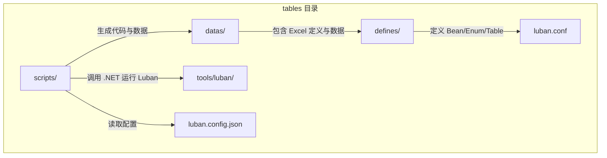
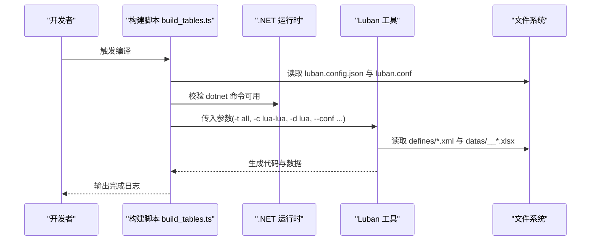
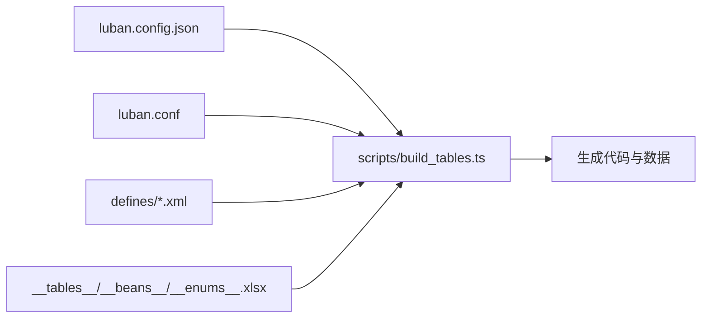
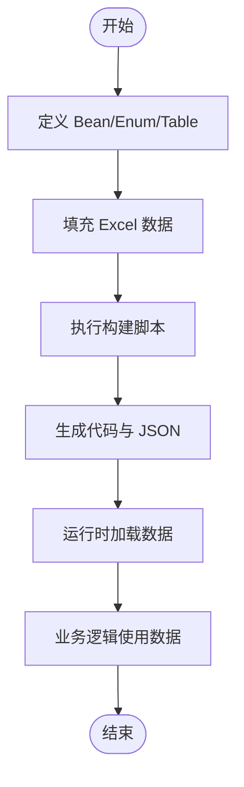

# 表格定义规范

<cite>
**本文引用的文件**   
- [README.md](file://tables/README.md)
- [luban.config.json](file://tables/luban.config.json)
- [luban.conf](file://tables/luban.conf)
- [build_tables.ts](file://tables/scripts/build_tables.ts)
- [common.xml](file://tables/defines/common.xml)
- [builtin.xml](file://tables/defines/builtin.xml)
- [item.xml](file://tables/defines/item.xml)
- [test.xml](file://tables/defines/test.xml)
</cite>

## 目录
1. [简介](#简介)
2. [项目结构](#项目结构)
3. [核心组件](#核心组件)
4. [架构总览](#架构总览)
5. [详细组件分析](#详细组件分析)
6. [依赖分析](#依赖分析)
7. [性能考虑](#性能考虑)
8. [故障排查指南](#故障排查指南)
9. [结论](#结论)
10. [附录](#附录)

## 简介
本规范文档面向游戏或应用项目的“配置表”设计与实现，基于 Luban 工具链，系统化阐述 Excel 表格文件的编写规范、字段类型与约束、索引与模式、Bean 与 Enum 的定义方式与使用场景，并给出最佳实践、常见错误规避方法以及表格与业务逻辑的对应关系与数据流转机制。本文档同时覆盖 __tables__.xlsx、__beans__.xlsx、__enums__.xlsx 等核心定义表的作用与协作方式。

## 项目结构
tables 目录是配置表体系的核心，包含三类关键内容：
- datas：Excel 数据文件与本地化文本资源
- defines：XML 定义文件，描述 Bean、Enum、Table 的结构与映射规则
- tools/luban：Luban 编译工具与模板
- scripts：构建脚本，封装 .NET 运行与 Luban 调用流程
- 配置文件：luban.conf、luban.config.json 控制输入输出与目标语言

图表来源
- [README.md: 1-157:1-157](file://tables/README.md#L1-L157)
- [luban.conf: 1-27:1-27](file://tables/luban.conf#L1-L27)
- [luban.config.json: 1-33:1-33](file://tables/luban.config.json#L1-L33)
- [build_tables.ts: 1-195:1-195](file://tables/scripts/build_tables.ts#L1-L195)

章节来源
- [README.md: 1-157:1-157](file://tables/README.md#L1-L157)
- [luban.conf: 1-27:1-27](file://tables/luban.conf#L1-L27)
- [luban.config.json: 1-33:1-33](file://tables/luban.config.json#L1-L33)
- [build_tables.ts: 1-195:1-195](file://tables/scripts/build_tables.ts#L1-L195)

## 核心组件
- __tables__.xlsx：注册所有 Table，声明其值类型（Bean）、输入数据路径、索引与模式（单例/列表）等元信息。
- __beans__.xlsx：集中定义 Bean 结构，字段类型、分组、引用、序列化分隔符等。
- __enums__.xlsx：集中定义 Enum，支持别名、枚举值、位标志、映射到客户端/服务端类型等。
- defines/*.xml：模块化的结构定义，包含内置类型、业务 Bean/Enum/Table 的声明与映射。
- 构建脚本 build_tables.ts：负责加载配置、检查 .NET 与 Luban 工具、执行编译并生成目标代码与 JSON 数据。

章节来源
- [README.md: 10-13:10-13](file://tables/README.md#L10-L13)
- [luban.conf: 9-14:9-14](file://tables/luban.conf#L9-L14)
- [build_tables.ts: 155-184:155-184](file://tables/scripts/build_tables.ts#L155-L184)

## 架构总览
Luban 编译流程由配置驱动，通过 XML 定义与 Excel 数据协同，生成目标语言代码与 JSON 数据，供运行时加载使用。

图表来源
- [build_tables.ts: 109-184:109-184](file://tables/scripts/build_tables.ts#L109-L184)
- [luban.config.json: 5-32:5-32](file://tables/luban.config.json#L5-L32)
- [luban.conf: 17-22:17-22](file://tables/luban.conf#L17-L22)

## 详细组件分析

### __tables__.xlsx：表注册与元信息
- 作用：登记所有 Table，指定其值类型（Bean 名称）、输入数据路径、索引与模式（单例/列表/字典等）。
- 关键列（示例）：表名、值类型、输入路径、索引、模式、分组等。
- 与 __beans__.xlsx、__enums__.xlsx 的关系：通过值类型名称关联到 Bean/Enum 定义；索引与模式决定运行时数据结构与访问方式。

章节来源
- [README.md: 10-13:10-13](file://tables/README.md#L10-L13)
- [luban.conf: 12-14:12-14](file://tables/luban.conf#L12-L14)

### __beans__.xlsx：Bean 定义与字段规范
- 字段类型：支持基础类型、数组/列表/集合/映射、嵌套 Bean、可空类型、时间类型、向量类型等。
- 序列化分隔符：通过分隔符控制复杂字段的序列化格式。
- 引用约束：字段可声明对其他表的引用（ref），用于建立表间关系与校验。
- 索引与列表：可在集合元素上声明索引，便于按子字段快速定位。
- 示例要点（来自 test.xml 中的 DemoType2）：数组、列表、集合、映射、嵌套 Bean、DateTimeRange、可空类型、分隔符与引用等。

章节来源
- [test.xml: 19-83:19-83](file://tables/defines/test.xml#L19-L83)
- [test.xml: 100-125:100-125](file://tables/defines/test.xml#L100-L125)
- [builtin.xml: 14-52:14-52](file://tables/defines/builtin.xml#L14-L52)

### __enums__.xlsx：枚举定义与映射
- 基础枚举：支持别名、显式值、注释。
- 位标志枚举：支持 flags 属性，用于组合标记。
- 映射到外部类型：可为客户端/服务端映射到特定类型（如 Unity Vector 或自定义类型）。
- 示例要点（来自 item.xml、builtin.xml、test.xml）：品质枚举、货币类型、服装标签、向量类型等。

章节来源
- [item.xml: 3-98:3-98](file://tables/defines/item.xml#L3-L98)
- [builtin.xml: 2-52:2-52](file://tables/defines/builtin.xml#L2-L52)
- [test.xml: 3-17:3-17](file://tables/defines/test.xml#L3-L17)

### defines/*.xml：模块化结构定义
- Bean：定义字段、类型、分隔符、注释、分组、引用等。
- Enum：定义枚举项、别名、值、flags、映射等。
- Table：绑定 Bean/Enum 与输入数据路径，声明索引、模式（单例/列表/字典）、分组等。
- 内置类型：如 vec2/vec3/vec4、DateTimeRange 等，支持跨模块复用。
- 示例要点（来自 common.xml、item.xml、test.xml、builtin.xml）：全局配置、道具系统、测试用例、Unity 类型映射等。

章节来源
- [common.xml: 1-48:1-48](file://tables/defines/common.xml#L1-L48)
- [item.xml: 1-152:1-152](file://tables/defines/item.xml#L1-L152)
- [test.xml: 1-585:1-585](file://tables/defines/test.xml#L1-L585)
- [builtin.xml: 1-53:1-53](file://tables/defines/builtin.xml#L1-L53)

### 构建脚本 build_tables.ts：编译流程与参数
- 配置加载：读取 luban.config.json 与 luban.conf。
- 环境检查：验证 .NET SDK 与 Luban 工具存在性。
- 参数构建：组装 -t/-c/-d/-f/--conf 等参数，传递输出目录与本地化文本提供者。
- 输出生成：生成 Lua 代码与 JSON 数据至 server/src/tables 与 server/src/tables/data。

章节来源
- [build_tables.ts: 48-184:48-184](file://tables/scripts/build_tables.ts#L48-L184)
- [luban.config.json: 5-32:5-32](file://tables/luban.config.json#L5-L32)
- [luban.conf: 17-22:17-22](file://tables/luban.conf#L17-L22)

## 依赖分析
- 配置文件依赖：luban.config.json 决定输入/输出目录与目标类型；luban.conf 决定 schemaFiles、groups、targets 等。
- 定义文件依赖：defines/*.xml 为 __tables__.xlsx、__beans__.xlsx、__enums__.xlsx 提供结构约束与类型映射。
- 构建脚本依赖：依赖 .NET SDK 与 Luban 工具，生成代码与数据。

图表来源
- [luban.config.json: 5-32:5-32](file://tables/luban.config.json#L5-L32)
- [luban.conf: 1-27:1-27](file://tables/luban.conf#L1-L27)
- [build_tables.ts: 109-184:109-184](file://tables/scripts/build_tables.ts#L109-L184)

章节来源
- [luban.config.json: 5-32:5-32](file://tables/luban.config.json#L5-L32)
- [luban.conf: 1-27:1-27](file://tables/luban.conf#L1-L27)
- [build_tables.ts: 109-184:109-184](file://tables/scripts/build_tables.ts#L109-L184)

## 性能考虑
- 数据规模与索引：合理设置索引与模式（单例/列表/字典），避免全表扫描；对高频查询字段建立唯一索引。
- 序列化开销：复杂字段（数组/列表/映射/嵌套 Bean）应控制层级与长度，减少序列化与反序列化成本。
- 分组与目标：按客户端/服务端分组输出，避免不必要的数据传输。
- 本地化与文本：通过本地化提供者集中管理文本，减少重复存储。

## 故障排查指南
- .NET SDK 未安装：脚本会检测 dotnet 命令，若不可用则提示安装路径与命令。
- Luban 工具缺失：检查 luban.dll 是否存在于配置路径。
- 配置文件缺失：确认 luban.conf 与 luban.config.json 存在且路径正确。
- 构建失败：查看脚本输出的错误信息，核对输入数据与定义是否匹配。

章节来源
- [build_tables.ts: 118-139:118-139](file://tables/scripts/build_tables.ts#L118-L139)
- [build_tables.ts: 141-145:141-145](file://tables/scripts/build_tables.ts#L141-L145)
- [build_tables.ts: 178-184:178-184](file://tables/scripts/build_tables.ts#L178-L184)

## 结论
通过 __tables__.xlsx、__beans__.xlsx、__enums__.xlsx 与 defines/*.xml 的协同，结合 Luban 工具链与构建脚本，可以高效地将 Excel 数据转换为运行时可用的代码与数据。遵循本文档的字段类型、约束、索引与模式规范，配合合理的命名与版本管理策略，可显著提升配置表的可维护性与性能表现。

## 附录

### 字段类型与约束规范摘要
- 基础类型：整数、浮点、布尔、字符串、文本、时间等。
- 复合类型：数组、列表、集合、映射、嵌套 Bean、可空类型。
- 特殊类型：向量（vec2/vec3/vec4）、日期时间范围等。
- 约束与修饰：大小限制、取值范围、集合约束、分隔符、引用、别名、注释等。
- 分组与映射：针对客户端/服务端的类型映射与分组输出。

章节来源
- [test.xml: 19-83:19-83](file://tables/defines/test.xml#L19-L83)
- [test.xml: 355-390:355-390](file://tables/defines/test.xml#L355-L390)
- [builtin.xml: 14-52:14-52](file://tables/defines/builtin.xml#L14-L52)
- [common.xml: 23-44:23-44](file://tables/defines/common.xml#L23-L44)

### 索引与模式规范摘要
- 单例表：仅一条记录，适合全局配置。
- 列表表：多条记录，支持联合唯一索引与独立唯一索引。
- 联合索引：多字段组合唯一。
- 子字段索引：集合元素上的索引。
- 模式选择：根据业务需求选择 one/list/map 等模式。

章节来源
- [test.xml: 98-125:98-125](file://tables/defines/test.xml#L98-L125)
- [test.xml: 431-433:431-433](file://tables/defines/test.xml#L431-L433)
- [common.xml: 46](file://tables/defines/common.xml#L46)

### Bean 与 Enum 的定义与使用场景
- Bean：用于承载业务实体结构，支持嵌套、集合、映射与引用，适用于复杂数据模型。
- Enum：用于离散取值与标志位，支持别名与映射，适用于状态、品质、类型等标识。

章节来源
- [item.xml: 134-149:134-149](file://tables/defines/item.xml#L134-L149)
- [item.xml: 3-98:3-98](file://tables/defines/item.xml#L3-L98)
- [test.xml: 19-83:19-83](file://tables/defines/test.xml#L19-L83)

### 表格设计最佳实践
- 命名规范：采用清晰的模块前缀与语义化命名，避免缩写歧义。
- 数据组织：按功能域拆分 Excel 文件，统一在 __tables__.xlsx 注册；Bean/Enum 集中管理。
- 版本管理：通过 Git 管理 Excel 与 XML 定义，变更时同步更新 __tables__.xlsx 与相关依赖。
- 约束与校验：利用范围、集合、引用等约束减少运行时错误。
- 本地化：统一管理文案，避免硬编码字符串。

### 表格与业务逻辑的对应关系与数据流转机制
- 定义阶段：XML 定义 Bean/Enum/Table，Excel 提供数据。
- 编译阶段：Luban 读取定义与数据，生成目标代码与 JSON。
- 运行阶段：服务端/客户端加载 JSON 或代码，按索引与模式访问数据，驱动业务逻辑。

