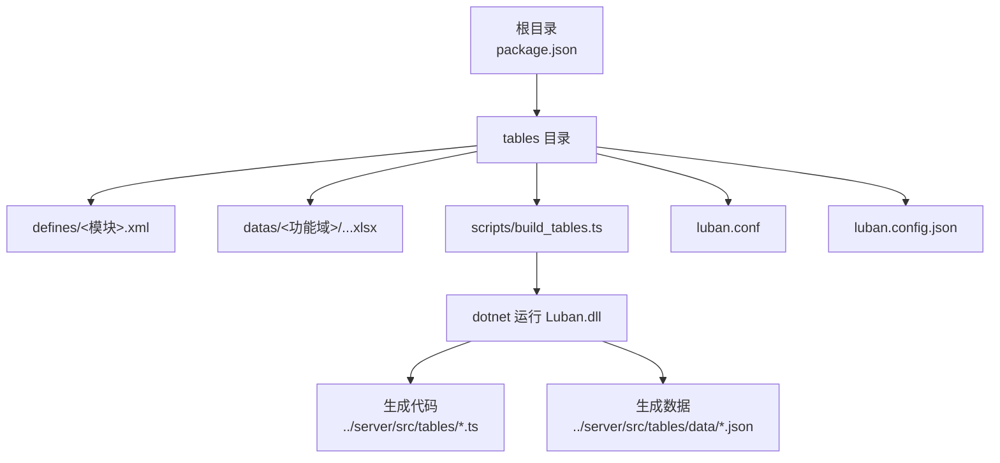
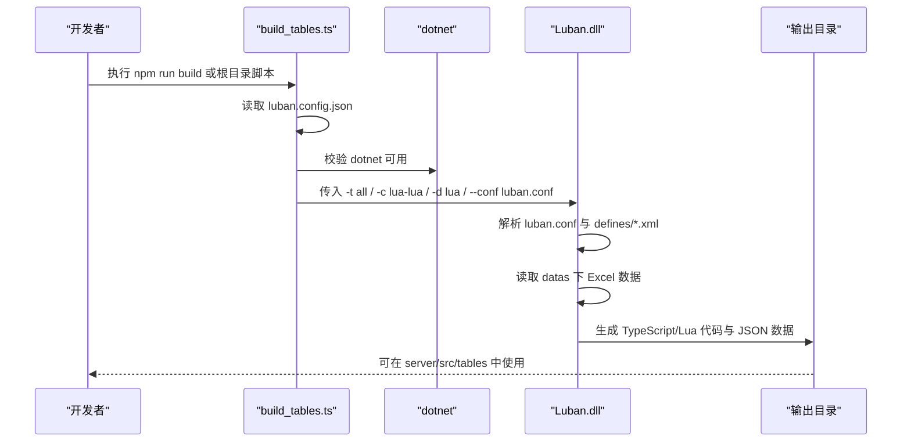
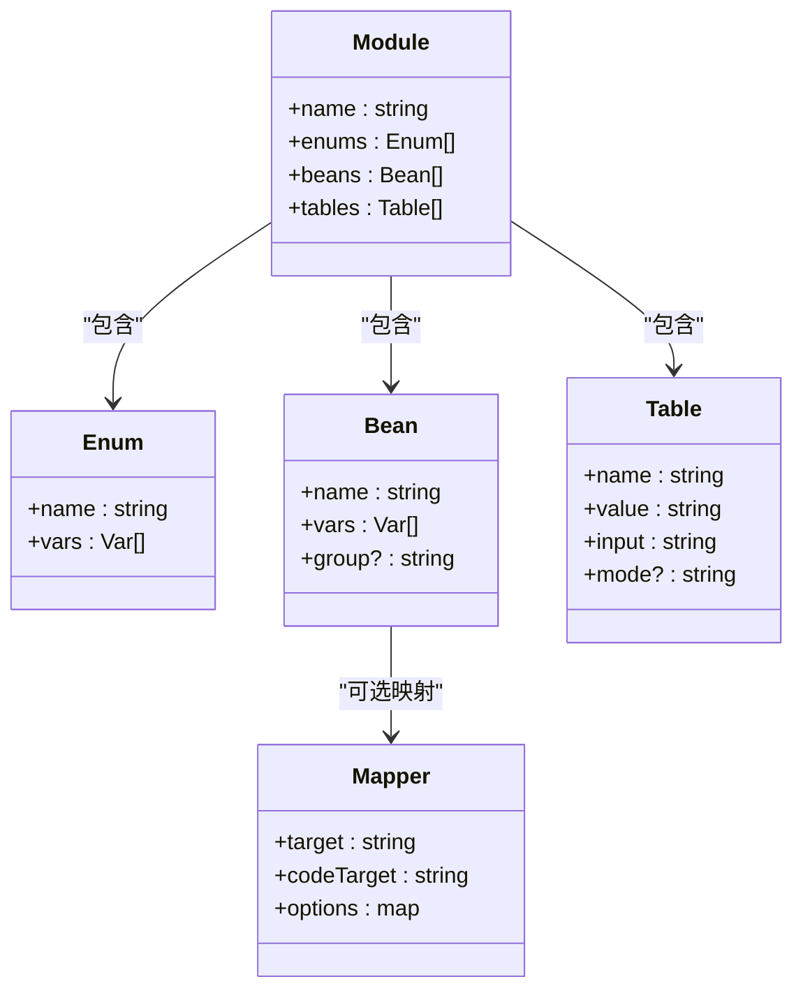
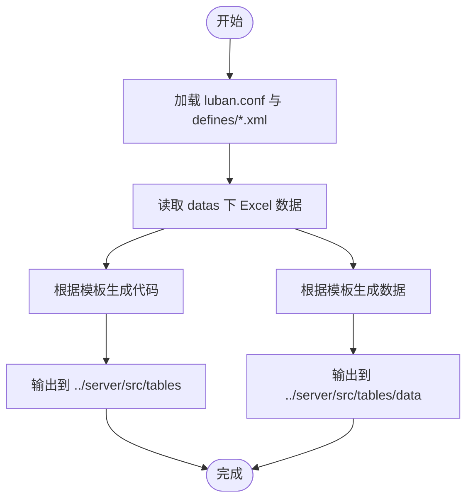
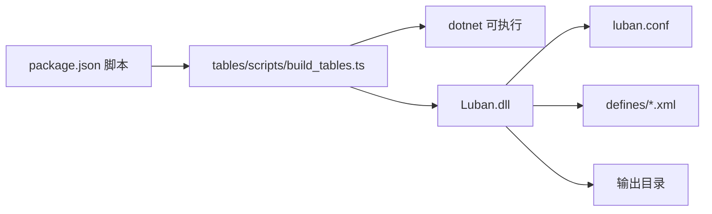

# 配置表系统

<cite>
**本文引用的文件**
- [tables/README.md](file://tables/README.md)
- [tables/luban.conf](file://tables/luban.conf)
- [tables/luban.config.json](file://tables/luban.config.json)
- [tables/scripts/build_tables.ts](file://tables/scripts/build_tables.ts)
- [tables/defines/common.xml](file://tables/defines/common.xml)
- [tables/defines/item.xml](file://tables/defines/item.xml)
- [tables/defines/builtin.xml](file://tables/defines/builtin.xml)
- [tables/defines/l10n.xml](file://tables/defines/l10n.xml)
- [package.json](file://package.json)
</cite>

## 目录
1. [简介](#简介)
2. [项目结构](#项目结构)
3. [核心组件](#核心组件)
4. [架构总览](#架构总览)
5. [详细组件分析](#详细组件分析)
6. [依赖关系分析](#依赖关系分析)
7. [性能考虑](#性能考虑)
8. [故障排查指南](#故障排查指南)
9. [结论](#结论)
10. [附录](#附录)

## 简介
本文件系统性阐述基于 Luban 的配置表工具链在本项目中的使用与集成方式，覆盖以下主题：
- Excel 数据文件的编写规范与组织
- XML 定义文件的配置方式与模块化组织
- 多语言导出机制（C++、C#、Java、JavaScript、TypeScript 等）的生成策略
- 表格数据验证规则与业务逻辑约束的实现方法
- 配置表的加载与使用流程（运行时数据访问与缓存策略）
- 配置表版本管理与热更新支持现状
- 实际开发示例与最佳实践
- 与游戏逻辑的集成方式与性能优化建议

## 项目结构
配置表系统位于仓库的 tables 目录，采用“定义文件 + 数据文件 + 编译脚本”的三层结构：
- defines：集中定义枚举、Bean、Table 的 XML 模块
- datas：按功能域分组的 Excel 数据文件
- scripts：Luban 编译脚本，负责调用 dotnet 运行 Luban.dll 并生成目标代码与数据
- 配置文件：luban.conf 控制 schema 与目标；luban.config.json 控制输入输出路径与目标类型

图表来源
- [package.json:11-37](file://package.json#L11-L37)
- [tables/README.md:35-67](file://tables/README.md#L35-L67)
- [tables/luban.config.json:1-33](file://tables/luban.config.json#L1-L33)
- [tables/scripts/build_tables.ts:155-166](file://tables/scripts/build_tables.ts#L155-L166)

章节来源
- [tables/README.md:1-157](file://tables/README.md#L1-L157)
- [package.json:1-48](file://package.json#L1-L48)

## 核心组件
- Luban 编译器与模板
  - 通过 dotnet 运行 Luban.dll，依据 luban.conf 与 luban.config.json 的配置进行编译
  - 支持多种目标语言与序列化格式（如 lua、json、protobuf 等），模板位于 tools/luban/Luban/Templates
- 编译脚本 build_tables.ts
  - 负责解析配置、校验 dotnet 与 Luban.dll 可用性、构建命令参数并执行
  - 输出代码与数据分别写入 ../server/src/tables 与 ../server/src/tables/data
- 定义文件（XML）
  - defines 下的各模块文件定义枚举、Bean、Table，以及可选的类型映射与分组标记
- 数据文件（Excel）
  - datas 下按功能域组织的 Excel 表，通过 __tables__.xlsx 注册并驱动生成

章节来源
- [tables/scripts/build_tables.ts:86-195](file://tables/scripts/build_tables.ts#L86-L195)
- [tables/luban.conf:1-27](file://tables/luban.conf#L1-L27)
- [tables/luban.config.json:1-33](file://tables/luban.config.json#L1-L33)

## 架构总览
下图展示从 Excel 数据到多语言代码与 JSON 数据的完整生成链路：

图表来源
- [tables/scripts/build_tables.ts:155-184](file://tables/scripts/build_tables.ts#L155-L184)
- [tables/luban.conf:17-22](file://tables/luban.conf#L17-L22)
- [tables/luban.config.json:14-28](file://tables/luban.config.json#L14-L28)

## 详细组件分析

### Excel 数据文件编写规范
- 组织方式
  - 按功能域分目录存放 Excel，例如 common、item、role、test 等
  - 通过 __tables__.xlsx 注册表，指定每个表对应的数据文件路径
- 字段命名与注释
  - 建议字段具备清晰语义与注释，便于自动生成代码与文档
  - 对客户端/服务端差异字段，可通过分组标记进行差异化生成
- 数据校验
  - 在 XML 定义中声明类型与范围约束，Luban 将在生成阶段进行基础校验
  - 复杂业务规则建议在生成后的代码中补充运行时校验

章节来源
- [tables/README.md:8-33](file://tables/README.md#L8-L33)
- [tables/defines/common.xml:46-47](file://tables/defines/common.xml#L46-L47)
- [tables/defines/item.xml:149-152](file://tables/defines/item.xml#L149-L152)

### XML 定义文件配置方式
- 模块化组织
  - 每个模块以 <module name="..."> 开始，内部可定义多个 enum、bean、table
  - 通过 <mapper> 为不同目标语言或运行环境映射类型与构造器
- Bean 与 Table
  - Bean 描述复合数据结构，Table 关联具体数据文件
  - 支持分组标记（如 group="c,s"），用于区分客户端/服务端/公共数据
- 内置类型与映射
  - builtin.xml 提供向量等内置类型的跨语言映射，便于在不同语言间复用

图表来源
- [tables/defines/common.xml:1-48](file://tables/defines/common.xml#L1-L48)
- [tables/defines/item.xml:1-152](file://tables/defines/item.xml#L1-L152)
- [tables/defines/builtin.xml:1-53](file://tables/defines/builtin.xml#L1-L53)

章节来源
- [tables/defines/common.xml:1-48](file://tables/defines/common.xml#L1-L48)
- [tables/defines/item.xml:1-152](file://tables/defines/item.xml#L1-L152)
- [tables/defines/builtin.xml:1-53](file://tables/defines/builtin.xml#L1-L53)

### 多语言导出机制与生成策略
- 目标类型与模板
  - 通过 luban.conf 的 targets 字段声明目标（如 lua、json、all）
  - templates 目录提供多种语言/序列化组合（cpp、cs、java、js、ts、go、rust 等）
- 分组与差异化生成
  - 在 XML 中对变量标注 group（如 c/s/e），控制哪些数据在哪些目标中生成
- 多语言映射
  - 使用 <mapper> 为特定目标语言映射到第三方类型（如 Unity Vector2/Vector3）

图表来源
- [tables/luban.conf:17-22](file://tables/luban.conf#L17-L22)
- [tables/luban.config.json:14-28](file://tables/luban.config.json#L14-L28)
- [tables/scripts/build_tables.ts:155-184](file://tables/scripts/build_tables.ts#L155-L184)

章节来源
- [tables/luban.conf:1-27](file://tables/luban.conf#L1-L27)
- [tables/luban.config.json:1-33](file://tables/luban.config.json#L1-L33)
- [tables/scripts/build_tables.ts:155-184](file://tables/scripts/build_tables.ts#L155-L184)

### 表格数据验证规则与业务逻辑约束
- 结构级约束
  - 在 XML 中定义字段类型、可空性、范围等，Luban 会在生成阶段进行基础校验
- 业务级约束
  - 建议在生成后的代码中补充复杂业务规则校验（如互斥条件、依赖关系）
  - 对于国际化文本，可在 XML 中声明 text 类型并在生成后进行本地化处理
- 多语言一致性
  - 通过 <mapper> 保持跨语言类型一致，减少业务层重复校验

章节来源
- [tables/defines/common.xml:23-44](file://tables/defines/common.xml#L23-L44)
- [tables/defines/item.xml:134-147](file://tables/defines/item.xml#L134-L147)
- [tables/defines/l10n.xml:1-14](file://tables/defines/l10n.xml#L1-L14)

### 配置表的加载与使用流程（运行时数据访问与缓存策略）
- 生成产物
  - 代码：位于 ../server/src/tables，包含表管理器与数据模型
  - 数据：位于 ../server/src/tables/data，包含 JSON 数据文件
- 加载与访问
  - 启动时由服务端加载 JSON 数据并初始化表管理器
  - 业务逻辑通过表管理器提供的接口查询数据，避免直接读取文件
- 缓存策略
  - 建议在内存中维护只读快照，提供 O(1) 查询
  - 对大表可采用延迟加载或分片加载策略
  - 对频繁变更的小表可采用增量更新与版本号管理

章节来源
- [tables/README.md:64-67](file://tables/README.md#L64-L67)
- [tables/luban.config.json:11-14](file://tables/luban.config.json#L11-L14)

### 版本管理与热更新支持
- 版本管理
  - 建议在表头或元数据中加入版本号字段，配合发布流程进行灰度
- 热更新
  - 当前配置表系统主要面向构建期生成，未见内置运行时热更新机制
  - 如需热更新，可在业务层引入“双缓冲 + 原子切换”策略，结合版本号与校验和进行安全替换

章节来源
- [tables/README.md:133-157](file://tables/README.md#L133-L157)

### 实际开发示例与最佳实践
- 新增表流程
  - 在 datas 下创建 Excel 数据文件，更新 __tables__.xlsx 注册
  - 在 defines 下新增或复用 XML 模块，定义 enum/bean/table
  - 运行 npm run build:tables 生成代码与数据
- 字段分组与差异化
  - 对仅客户端使用的字段标注 group="c"，对仅服务端使用的字段标注 group="s"
- 复杂类型映射
  - 使用 <mapper> 将通用 Bean 映射到目标语言的第三方类型，提升一致性
- 国际化文本
  - 在 l10n 模块中定义 text 类型字段，配合多语言文本提供器进行本地化

章节来源
- [tables/README.md:133-157](file://tables/README.md#L133-L157)
- [tables/defines/builtin.xml:14-52](file://tables/defines/builtin.xml#L14-L52)
- [tables/defines/l10n.xml:1-14](file://tables/defines/l10n.xml#L1-L14)

## 依赖关系分析
- 构建链路依赖
  - build_tables.ts 依赖 dotnet 与 Luban.dll
  - Luban.dll 依赖 luban.conf 与 defines/*.xml
  - 生成结果依赖输出目录配置
- 目录与脚本
  - package.json 提供统一入口脚本，便于在根目录一键触发 tables 编译

图表来源
- [package.json:11-37](file://package.json#L11-L37)
- [tables/scripts/build_tables.ts:119-139](file://tables/scripts/build_tables.ts#L119-L139)
- [tables/luban.conf:1-27](file://tables/luban.conf#L1-L27)

章节来源
- [package.json:1-48](file://package.json#L1-L48)
- [tables/scripts/build_tables.ts:119-139](file://tables/scripts/build_tables.ts#L119-L139)

## 性能考虑
- 生成阶段
  - 优先使用二进制序列化（如 lua-bin、cs-bin、java-bin）以降低运行时解析开销
  - 对超大表拆分至多个小表，减少单文件体积
- 运行阶段
  - 使用哈希索引（如 ID 到记录的映射）实现 O(1) 查询
  - 对频繁访问的字段进行预计算或派生缓存
  - 避免在热路径中进行字符串拼接与正则匹配

## 故障排查指南
- dotnet 未安装或不可用
  - 现象：脚本报错提示找不到 dotnet
  - 处理：安装 .NET SDK 8.0+ 并确保命令可用
- Luban.dll 不存在
  - 现象：脚本报错提示找不到 Luban.dll
  - 处理：确认 tools/luban/Luban/Luban.dll 存在且路径正确
- luban.conf 或配置文件缺失
  - 现象：编译失败或找不到配置
  - 处理：检查 luban.conf 与 luban.config.json 是否存在且路径正确
- 输出目录权限问题
  - 现象：生成失败或无输出
  - 处理：确保输出目录存在且具有写权限

章节来源
- [tables/scripts/build_tables.ts:119-139](file://tables/scripts/build_tables.ts#L119-L139)
- [tables/scripts/build_tables.ts:141-146](file://tables/scripts/build_tables.ts#L141-L146)
- [tables/scripts/build_tables.ts:147-150](file://tables/scripts/build_tables.ts#L147-L150)

## 结论
本配置表系统通过 Luban 工具链实现了从 Excel 到多语言代码与数据的自动化生成，具备良好的扩展性与跨语言一致性。建议在实际项目中结合业务需求完善运行时校验、缓存策略与版本管理，并在必要时引入热更新方案以满足线上快速迭代的需求。

## 附录
- 常用命令
  - 在根目录执行 npm run build:tables 触发 tables 编译
  - 在 tables 目录执行 npm run build 直接编译
- 参考资料
  - Luban 官方文档与 GitHub 仓库

章节来源
- [tables/README.md:35-67](file://tables/README.md#L35-L67)
- [tables/README.md:153-157](file://tables/README.md#L153-L157)