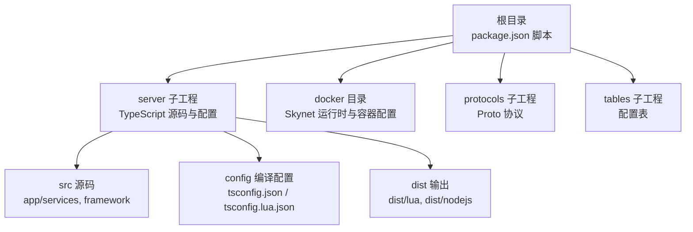
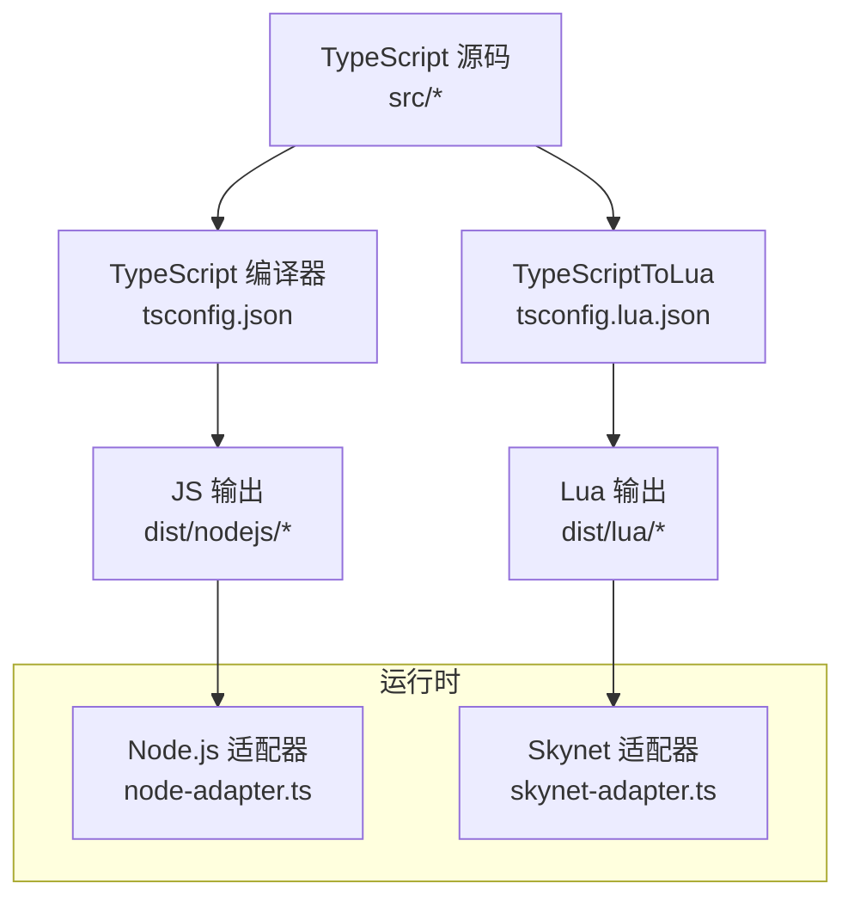
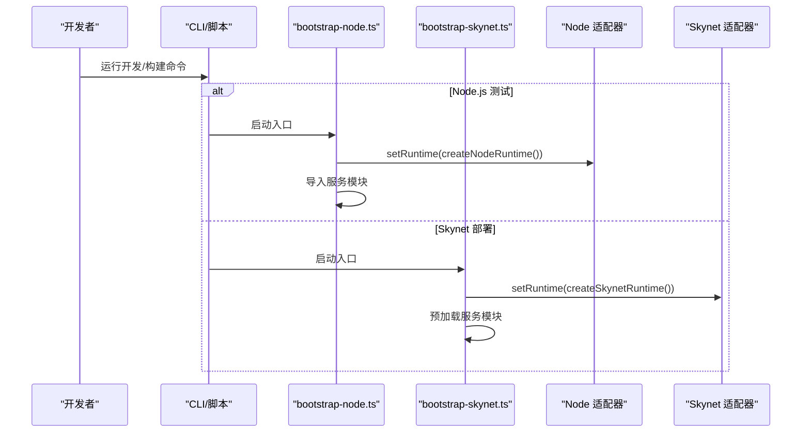
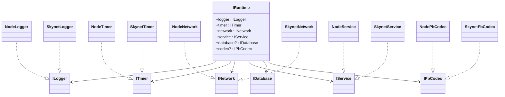
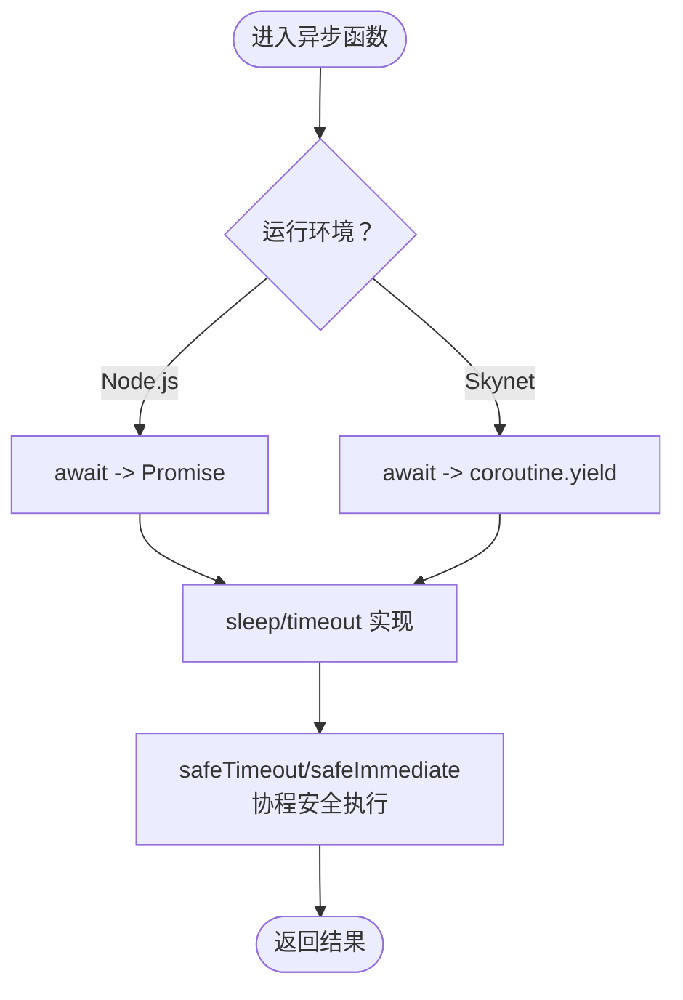
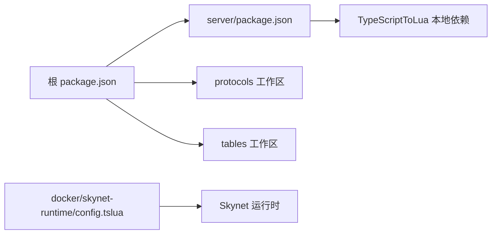

# 开发工作流

<cite>
**本文引用的文件**
- [README.md](file://README.md)
- [package.json](file://package.json)
- [tslua.config.yaml](file://tslua.config.yaml)
- [server/start.sh](file://server/start.sh)
- [server/package.json](file://server/package.json)
- [server/config/tsconfig.json](file://server/config/tsconfig.json)
- [server/config/tsconfig.lua.json](file://server/config/tsconfig.lua.json)
- [server/src/app/bootstrap-node.ts](file://server/src/app/bootstrap-node.ts)
- [server/src/app/bootstrap-skynet.ts](file://server/src/app/bootstrap-skynet.ts)
- [server/src/framework/core/interfaces.ts](file://server/src/framework/core/interfaces.ts)
- [server/src/framework/runtime/node-adapter.ts](file://server/src/framework/runtime/node-adapter.ts)
- [server/src/framework/runtime/skynet-adapter.ts](file://server/src/framework/runtime/skynet-adapter.ts)
- [docker/skynet-runtime/config.tslua](file://docker/skynet-runtime/config.tslua)
</cite>

## 目录
1. [引言](#引言)
2. [项目结构](#项目结构)
3. [核心组件](#核心组件)
4. [架构总览](#架构总览)
5. [详细组件分析](#详细组件分析)
6. [依赖分析](#依赖分析)
7. [性能考虑](#性能考虑)
8. [故障排查指南](#故障排查指南)
9. [结论](#结论)
10. [附录](#附录)

## 引言
本指南面向使用 TS-Skynet 混合开发框架的开发者，提供从编写 TypeScript 到在 Skynet 中运行的完整开发流程与调试策略。内容涵盖：
- 日常开发步骤与命令体系
- Node.js 环境下的快速测试与 VS Code 断点调试配置
- Skynet 环境下的调试策略（SourceMap、编译后 Lua 观察、TS→Lua 映射关系）
- 常见问题与最佳实践（异步模型差异、接口使用规范、第三方库兼容性）
- 高效工作流建议与实用调试技巧

## 项目结构
项目采用多工作区组织方式，核心目录与职责如下：
- 根目录：聚合脚本与顶层配置，转发命令至 server 子工程
- server：TypeScript 源码、编译配置、运行时适配器、业务服务
- docker：Skynet 框架与运行时容器化配置
- protocols/tables：协议与配置表的独立工作区（可由主工程统一构建）

图表来源
- [package.json:11-37](file://package.json#L11-L37)
- [tslua.config.yaml:11-29](file://tslua.config.yaml#L11-L29)

章节来源
- [README.md:136-193](file://README.md#L136-L193)
- [package.json:6-10](file://package.json#L6-L10)
- [tslua.config.yaml:11-29](file://tslua.config.yaml#L11-L29)

## 核心组件
- 抽象接口层：通过 IRuntime 与各接口（ILogger、ITimer、INetwork、IService、IPbCodec）屏蔽 Node.js 与 Skynet 的差异，业务代码只依赖接口
- Node.js 适配器：在 Node.js 环境下以原生 API 实现接口，便于本地快速测试
- Skynet 适配器：在 Skynet 环境下封装 skynet.* API，实现协程安全与异步模型统一
- 启动入口：bootstrap-node.ts 与 bootstrap-skynet.ts 分别设置运行时并加载服务模块

章节来源
- [server/src/framework/core/interfaces.ts:6-226](file://server/src/framework/core/interfaces.ts#L6-L226)
- [server/src/framework/runtime/node-adapter.ts:1-194](file://server/src/framework/runtime/node-adapter.ts#L1-L194)
- [server/src/framework/runtime/skynet-adapter.ts:1-221](file://server/src/framework/runtime/skynet-adapter.ts#L1-L221)
- [server/src/app/bootstrap-node.ts:1-22](file://server/src/app/bootstrap-node.ts#L1-L22)
- [server/src/app/bootstrap-skynet.ts:1-20](file://server/src/app/bootstrap-skynet.ts#L1-L20)

## 架构总览
TS 代码通过 TypeScriptToLua 编译为 Lua，同时保留 SourceMap；在 Node.js 环境下直接运行 JS 输出进行快速验证，在 Skynet 环境下运行编译后的 Lua。

图表来源
- [server/config/tsconfig.lua.json:12-19](file://server/config/tsconfig.lua.json#L12-L19)
- [server/config/tsconfig.json:1-26](file://server/config/tsconfig.json#L1-L26)
- [server/src/framework/runtime/node-adapter.ts:177-194](file://server/src/framework/runtime/node-adapter.ts#L177-L194)
- [server/src/framework/runtime/skynet-adapter.ts:204-221](file://server/src/framework/runtime/skynet-adapter.ts#L204-L221)

## 详细组件分析

### 启动与运行时切换
- Node.js 模式：通过 bootstrap-node.ts 设置 Node 运行时，导入服务模块后自动启动
- Skynet 模式：通过 bootstrap-skynet.ts 设置 Skynet 运行时，预加载服务并通过 runtime.service.start 启动

图表来源
- [server/src/app/bootstrap-node.ts:5-22](file://server/src/app/bootstrap-node.ts#L5-L22)
- [server/src/app/bootstrap-skynet.ts:6-20](file://server/src/app/bootstrap-skynet.ts#L6-L20)
- [server/src/framework/runtime/node-adapter.ts:177-194](file://server/src/framework/runtime/node-adapter.ts#L177-L194)
- [server/src/framework/runtime/skynet-adapter.ts:204-221](file://server/src/framework/runtime/skynet-adapter.ts#L204-L221)

章节来源
- [server/src/app/bootstrap-node.ts:1-22](file://server/src/app/bootstrap-node.ts#L1-L22)
- [server/src/app/bootstrap-skynet.ts:1-20](file://server/src/app/bootstrap-skynet.ts#L1-L20)

### 抽象接口层与运行时实现
- 接口定义：ILogger、ITimer、INetwork、IService、IPbCodec、IRuntime
- Node 适配器：日志、定时器、网络、服务、编码器均以 Node 原生能力实现
- Skynet 适配器：日志、定时器、网络、服务、编码器均以 skynet.* API 实现，并保证协程安全

图表来源
- [server/src/framework/core/interfaces.ts:6-226](file://server/src/framework/core/interfaces.ts#L6-L226)
- [server/src/framework/runtime/node-adapter.ts:19-194](file://server/src/framework/runtime/node-adapter.ts#L19-L194)
- [server/src/framework/runtime/skynet-adapter.ts:28-221](file://server/src/framework/runtime/skynet-adapter.ts#L28-L221)

章节来源
- [server/src/framework/core/interfaces.ts:1-226](file://server/src/framework/core/interfaces.ts#L1-L226)
- [server/src/framework/runtime/node-adapter.ts:1-194](file://server/src/framework/runtime/node-adapter.ts#L1-L194)
- [server/src/framework/runtime/skynet-adapter.ts:1-221](file://server/src/framework/runtime/skynet-adapter.ts#L1-L221)

### 异步模型与协程安全
- Node.js：await 直接映射为 Promise
- Skynet：await 转换为 coroutine.yield，调用 skynet.call 等函数时自动挂起协程，响应返回时自动恢复
- 定时器安全：提供 safeTimeout/safeImmediate，确保回调在 Skynet 协程中执行，内部可使用 async/await

图表来源
- [README.md:299-326](file://README.md#L299-L326)
- [server/src/framework/runtime/skynet-adapter.ts:69-122](file://server/src/framework/runtime/skynet-adapter.ts#L69-L122)
- [server/src/framework/runtime/node-adapter.ts:40-85](file://server/src/framework/runtime/node-adapter.ts#L40-L85)

章节来源
- [README.md:299-326](file://README.md#L299-L326)
- [server/src/framework/runtime/skynet-adapter.ts:69-122](file://server/src/framework/runtime/skynet-adapter.ts#L69-L122)
- [server/src/framework/runtime/node-adapter.ts:40-85](file://server/src/framework/runtime/node-adapter.ts#L40-L85)

### 编译配置与输出
- tsconfig.json：Node.js 环境编译配置，开启 sourceMap、declarationMap、declaration
- tsconfig.lua.json：TSTL 编译配置，luaTarget=5.4、启用 sourceMapTraceback、skynetCompat
- 输出目录：dist/lua（Skynet）、dist/nodejs（Node.js）

章节来源
- [server/config/tsconfig.json:1-26](file://server/config/tsconfig.json#L1-L26)
- [server/config/tsconfig.lua.json:12-19](file://server/config/tsconfig.lua.json#L12-L19)

### 命令与脚本
- 根 package.json 脚本：统一转发到 server 子工程，提供 dev、build:ts、server:*、hotfix、quick 等常用命令
- server/start.sh：提供 build、node、hotfix、logs 等便捷命令入口

章节来源
- [package.json:11-37](file://package.json#L11-L37)
- [server/start.sh:7-66](file://server/start.sh#L7-L66)

## 依赖分析
- 根工程通过 workspaces 管理 server、protocols、tables 三个子工程
- server 依赖 TypeScriptToLua（本地安装），并使用 ts-node、tsx 等工具链
- docker/skynet-runtime/config.tslua 为 Skynet 容器默认配置，指定启动模块与 Lua 路径

图表来源
- [package.json:6-10](file://package.json#L6-L10)
- [server/package.json:48-48](file://server/package.json#L48-L48)
- [docker/skynet-runtime/config.tslua:10-23](file://docker/skynet-runtime/config.tslua#L10-L23)

章节来源
- [package.json:6-10](file://package.json#L6-L10)
- [server/package.json:48-48](file://server/package.json#L48-L48)
- [docker/skynet-runtime/config.tslua:10-23](file://docker/skynet-runtime/config.tslua#L10-L23)

## 性能考虑
- 使用抽象接口层避免直接依赖平台 API，减少条件分支与运行时开销
- Skynet 环境下优先使用 runtime.timer.safeTimeout/safeImmediate，确保协程安全与可控调度
- 在 Node.js 环境下利用 Promise 的轻量特性，减少不必要的异步包装
- 编译时启用 sourceMapTraceback，便于定位问题；生产部署可按需关闭以减小体积

## 故障排查指南
- Node.js 断点调试
  - 使用 VS Code 调试配置指向 Node.js 入口文件，配合 preLaunchTask 与 outFiles 指向 dist/nodejs 输出
  - 参考路径：[README.md:370-382](file://README.md#L370-L382)
- Skynet 调试
  - 确保 tsconfig.lua.json 启用 sourceMapTraceback
  - 查看编译后的 Lua 代码理解 TS→Lua 映射关系
  - 参考路径：[README.md:384-389](file://README.md#L384-L389)
- 常见问题
  - 直接使用 Node.js API 或浏览器 API：应改为通过 runtime.* 接口访问
  - 不兼容第三方库：优先选择 Node.js 通用或纯 TypeScript 库，避免依赖浏览器/Node 特定 API
  - 异步模型差异：在 Skynet 中注意厘秒单位与协程挂起语义，使用 runtime.timer.sleep 与 safeTimeout
  - 接口使用规范：严格遵循 interfaces.ts 定义的方法签名与行为约束
- 命令与状态
  - 使用 server/start.sh 或根脚本查看状态、日志、热更新等
  - 参考路径：[server/start.sh:7-66](file://server/start.sh#L7-L66)

章节来源
- [README.md:370-389](file://README.md#L370-L389)
- [README.md:484-505](file://README.md#L484-L505)
- [server/start.sh:7-66](file://server/start.sh#L7-L66)

## 结论
TS-Skynet 混合开发框架通过抽象接口层与双环境适配器，实现了“一套代码、双环境运行”。开发者可在 Node.js 环境快速迭代与调试，再编译到 Skynet 高性能运行。遵循本文提供的开发流程、调试策略与最佳实践，可显著提升开发效率与稳定性。

## 附录
- 快速命令参考（来自 README 与脚本）
  - 开发与构建：dev、build:ts、build:all、build:clean
  - 服务控制：server:start、server:stop、server:restart、server:status、server:logs
  - 热更新：hotfix
  - 一键启动：quick
  - 参考路径：[README.md:56-85](file://README.md#L56-L85)、[package.json:11-37](file://package.json#L11-L37)