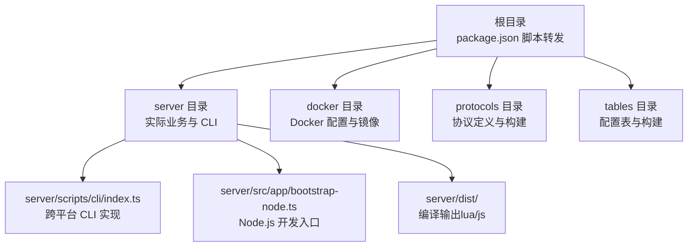
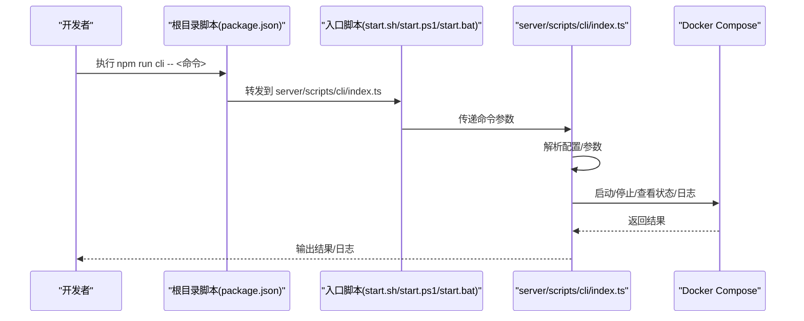
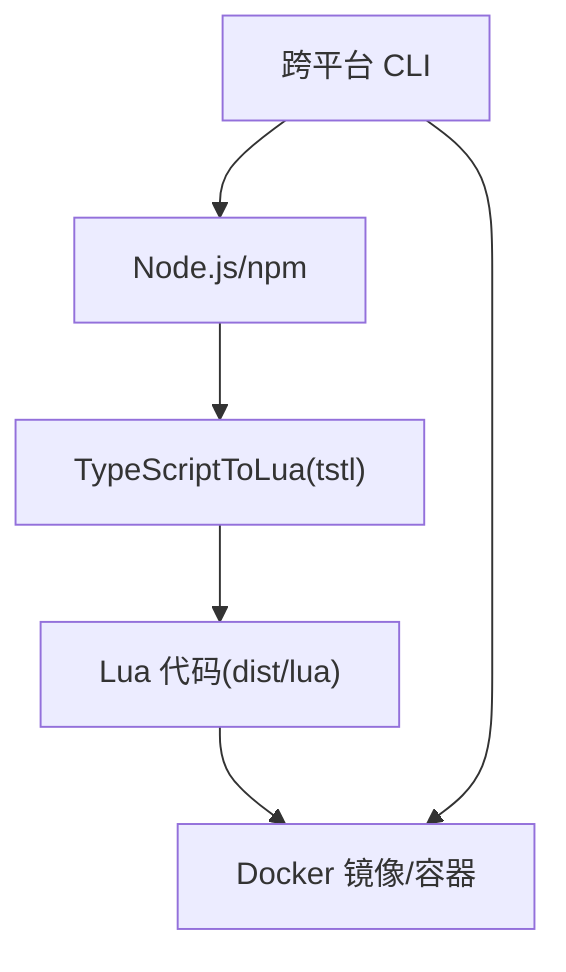

# 快速开始

<cite>
**本文引用的文件**
- [README.md](file://README.md)
- [package.json](file://package.json)
- [server/package.json](file://server/package.json)
- [cli.js](file://cli.js)
- [server/scripts/cli/index.ts](file://server/scripts/cli/index.ts)
- [start.sh](file://start.sh)
- [start.ps1](file://start.ps1)
- [start.bat](file://start.bat)
- [tslua.config.yaml](file://tslua.config.yaml)
- [docs/脚本使用指南.md](file://docs/脚本使用指南.md)
- [docker/scripts/deploy.ps1](file://docker/scripts/deploy.ps1)
</cite>

## 目录
1. [引言](#引言)
2. [项目结构](#项目结构)
3. [核心组件](#核心组件)
4. [架构总览](#架构总览)
5. [详细组件分析](#详细组件分析)
6. [依赖分析](#依赖分析)
7. [性能考虑](#性能考虑)
8. [故障排查指南](#故障排查指南)
9. [结论](#结论)
10. [附录](#附录)

## 引言
本指南面向初学者，带你从零开始搭建 TS-Skynet 混合开发框架的开发环境，并成功运行第一个服务。你将学会：
- 完整的环境准备流程（Node.js、npm 依赖、Docker）
- 两种启动方式：跨平台 CLI 工具与直接运行入口脚本
- Windows、Linux、macOS 三平台的具体命令与注意事项
- 常用命令的作用与使用场景（一键启动、开发模式、构建编译、服务启停等）

## 项目结构
TS-Skynet 采用“根目录统一脚本 + server 子项目”的组织方式，核心入口与命令转发集中在根目录与 server 目录，便于跨平台统一管理。

图表来源
- [package.json:11-37](file://package.json#L11-L37)
- [server/package.json:6-25](file://server/package.json#L6-L25)

章节来源
- [README.md:136-193](file://README.md#L136-L193)
- [package.json:1-48](file://package.json#L1-L48)
- [server/package.json:1-51](file://server/package.json#L1-L51)

## 核心组件
- 跨平台 CLI 工具：统一命令入口，支持菜单、一键启动、编译、服务启停、日志查看、热更新等。
- 入口脚本：start.sh/start.ps1/start.bat 作为跨平台入口，内部调用 CLI。
- 根目录脚本转发：package.json 将命令转发至 server 目录，保证跨平台一致性。
- 配置文件：tslua.config.yaml 支持自定义路径、构建与 Docker 配置。

章节来源
- [server/scripts/cli/index.ts:301-354](file://server/scripts/cli/index.ts#L301-L354)
- [cli.js:12-57](file://cli.js#L12-L57)
- [start.sh:1-7](file://start.sh#L1-L7)
- [start.ps1:1-36](file://start.ps1#L1-L36)
- [start.bat:1-39](file://start.bat#L1-L39)
- [tslua.config.yaml:1-52](file://tslua.config.yaml#L1-L52)

## 架构总览
下面的序列图展示了“跨平台 CLI”如何在不同平台上统一调度命令，以及与 Docker 的协作关系。

图表来源
- [package.json:11-37](file://package.json#L11-L37)
- [cli.js:12-57](file://cli.js#L12-L57)
- [server/scripts/cli/index.ts:709-745](file://server/scripts/cli/index.ts#L709-L745)

## 详细组件分析

### 跨平台 CLI 工具（推荐）
- 作用：统一命令入口，支持菜单交互、一键启动、编译、服务启停、日志查看、热更新、环境初始化等。
- 特性：自动检测 tsx/ts-node/npx，跨平台执行，支持配置文件与命令行参数覆盖。
- 常用命令：
  - 显示帮助：npm run cli -- help
  - 一键启动：npm run cli -- quick
  - 启动服务：npm run cli -- start
  - 停止服务：npm run cli -- stop
  - 查看状态：npm run cli -- status
  - 查看日志：npm run cli -- logs
  - 编译 TS→Lua：npm run cli -- build:ts
  - 完整构建：npm run cli -- build:all
  - 清理构建产物：npm run cli -- build:clean
  - Node.js 开发模式：npm run cli -- dev
  - 初始化环境：npm run cli -- setup
  - 热更新代码：npm run cli -- hotfix

章节来源
- [server/scripts/cli/index.ts:301-354](file://server/scripts/cli/index.ts#L301-L354)
- [server/scripts/cli/index.ts:709-745](file://server/scripts/cli/index.ts#L709-L745)
- [README.md:69-85](file://README.md#L69-L85)

### 入口脚本（直接运行）
- Linux/macOS：./start.sh 或 ./start.sh quick
- Windows（PowerShell）：.\start.ps1 或 .\start.ps1 quick
- Windows（CMD）：start.bat 或 start.bat quick
- 注意：这些脚本内部同样调用 CLI，提供更便捷的入口。

章节来源
- [start.sh:1-7](file://start.sh#L1-L7)
- [start.ps1:1-36](file://start.ps1#L1-L36)
- [start.bat:1-39](file://start.bat#L1-L39)
- [README.md:34-54](file://README.md#L34-L54)

### 根目录脚本转发
- package.json 将命令转发到 server 目录，确保跨平台命令一致。
- 常用转发命令：cli、dev、build、server:*、hotfix、setup、quick、clean 等。

章节来源
- [package.json:11-37](file://package.json#L11-L37)
- [server/package.json:6-25](file://server/package.json#L6-L25)

### 配置文件（可选）
- 支持 YAML/JSON 配置文件，默认读取项目根目录的 tslua.config.yaml/yml/json。
- 可自定义 server、docker、protocols、tables 路径，以及构建输出目录与 Docker 配置。

章节来源
- [tslua.config.yaml:1-52](file://tslua.config.yaml#L1-L52)
- [server/scripts/cli/index.ts:122-193](file://server/scripts/cli/index.ts#L122-L193)

### Windows Docker 部署脚本（可选）
- 提供 Windows 下的完整部署流程：初始化环境、构建镜像、启动/停止/重启、查看状态/日志、部署代码、进入容器 Shell、清理。
- 与跨平台 CLI 协同，满足 Windows 用户的完整开发与运维需求。

章节来源
- [docker/scripts/deploy.ps1:1-430](file://docker/scripts/deploy.ps1#L1-L430)

## 依赖分析
- Node.js 与 npm：用于安装依赖、运行 CLI、编译 TypeScript。
- TypeScriptToLua（TSTL）：将 TypeScript 编译为 Lua。
- Docker 与 Docker Compose：用于生产/开发容器编排与部署。
- tsx/ts-node：CLI 启动时的运行器选择（优先 tsx，其次 ts-node，最后 npx）。

图表来源
- [server/scripts/cli/index.ts:547-571](file://server/scripts/cli/index.ts#L547-L571)
- [cli.js:15-43](file://cli.js#L15-L43)

章节来源
- [server/scripts/cli/index.ts:547-571](file://server/scripts/cli/index.ts#L547-L571)
- [cli.js:15-43](file://cli.js#L15-L43)

## 性能考虑
- 开发阶段优先使用 Node.js 模式（npm run dev），快速迭代与调试。
- 生产阶段使用 Docker 容器，结合镜像构建与热更新，提升部署效率。
- 使用配置文件自定义路径与构建输出，减少不必要的文件复制与清理开销。

## 故障排查指南
- 启动失败：请先确保已安装依赖（npm install），并检查 Docker 是否已安装且运行。
- 编译失败：确认 TypeScriptToLua 已安装，或使用根目录脚本进行安装后再试。
- Windows 环境：若 Docker Desktop 未启动或未使用 WSL2 后端，可能导致性能下降或无法运行。
- 热更新失败：确认容器正在运行，或先启动服务再执行热更新。

章节来源
- [server/scripts/cli/index.ts:427-496](file://server/scripts/cli/index.ts#L427-L496)
- [cli.js:51-57](file://cli.js#L51-L57)
- [docker/scripts/deploy.ps1:101-143](file://docker/scripts/deploy.ps1#L101-L143)

## 结论
通过本指南，你可以：
- 在任意平台（Windows/Linux/macOS）上完成环境准备与依赖安装
- 使用跨平台 CLI 或入口脚本快速启动服务
- 理解常用命令的职责与使用场景
- 在开发与生产环境中高效地进行构建、启停与运维

## 附录

### 环境准备步骤（全流程）
- 安装 Node.js 与 npm（确保版本满足要求）
- 在项目根目录执行依赖安装
- 如需 Docker，确保 Docker Desktop 已安装并运行
- 首次运行可使用初始化命令完成环境准备

章节来源
- [README.md:199-203](file://README.md#L199-L203)
- [server/scripts/cli/index.ts:653-692](file://server/scripts/cli/index.ts#L653-L692)

### 两种启动方式与平台命令示例
- 跨平台 CLI（推荐）
  - 显示菜单：npm run menu
  - 一键启动：npm run quick
  - 查看状态：npm run cli -- status
  - 编译 TS→Lua：npm run cli -- build:ts
  - 启动服务：npm run cli -- start
  - 停止服务：npm run cli -- stop
  - 查看日志：npm run cli -- logs
- 直接运行入口脚本
  - Linux/macOS：./start.sh、./start.sh quick
  - Windows（PowerShell）：.\start.ps1、.\start.ps1 quick
  - Windows（CMD）：start.bat、start.bat quick

章节来源
- [README.md:17-54](file://README.md#L17-L54)
- [start.sh:1-7](file://start.sh#L1-L7)
- [start.ps1:1-36](file://start.ps1#L1-L36)
- [start.bat:1-39](file://start.bat#L1-L39)

### 常用命令速查（按用途）
- 一键启动：npm run quick
- Node.js 开发模式：npm run dev
- 编译 TypeScript→Lua：npm run build:ts
- 启动 Skynet 服务：npm run server:start
- 停止服务：npm run server:stop
- 查看状态：npm run server:status
- 查看日志：npm run server:logs
- 热更新代码：npm run hotfix

章节来源
- [README.md:56-68](file://README.md#L56-L68)
- [package.json:11-37](file://package.json#L11-L37)

### 开发工作流（建议）
- 开发调试（Node.js 模式）：npm run dev
- 完整开发（自动编译 + 前台运行）：npm run quick
- 修改代码后热更新：npm run hotfix
- 查看状态：npm run server:status

章节来源
- [docs/脚本使用指南.md:116-132](file://docs/脚本使用指南.md#L116-L132)
- [README.md:354-366](file://README.md#L354-L366)