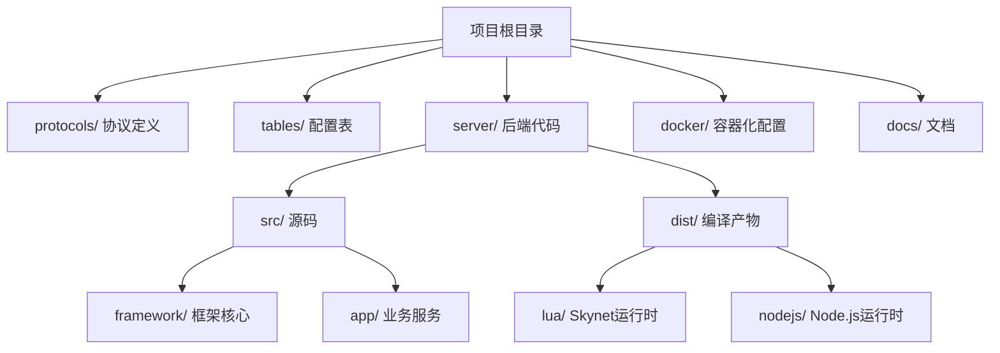
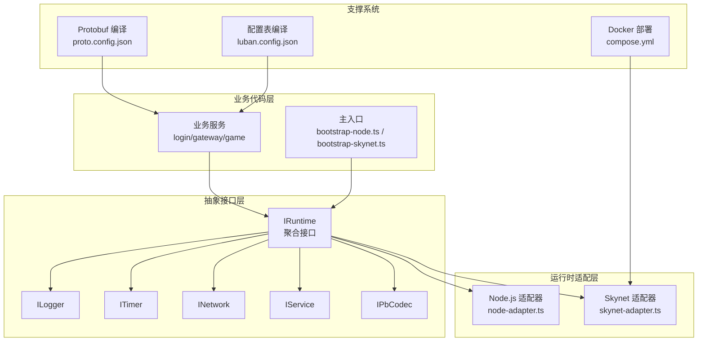
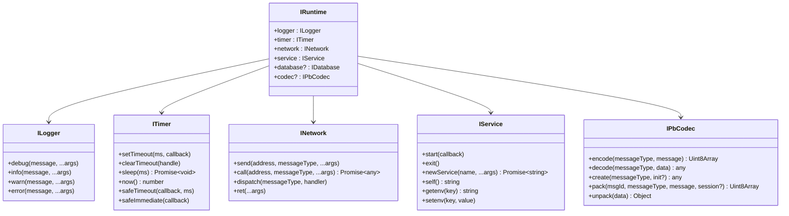
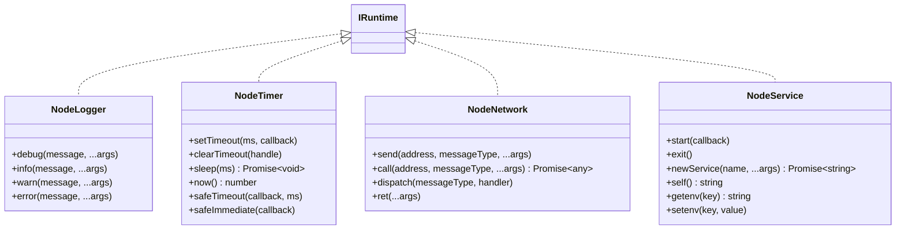
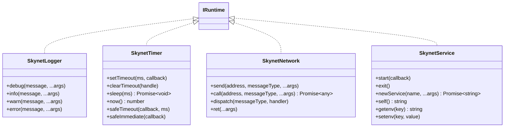
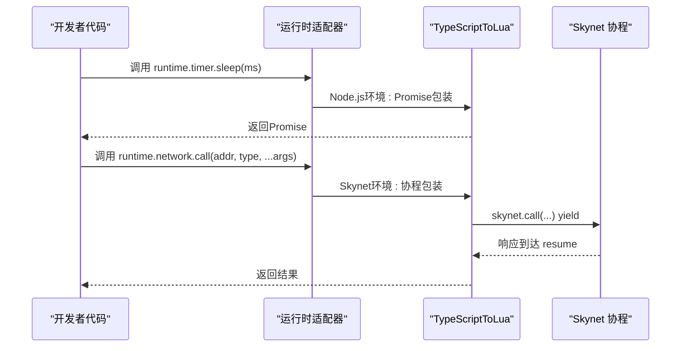
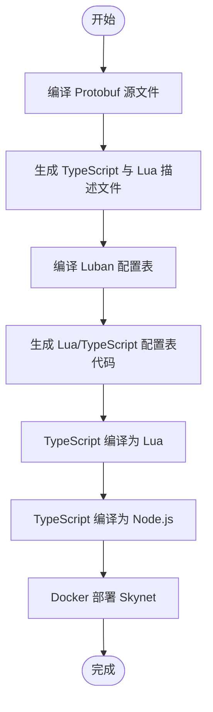
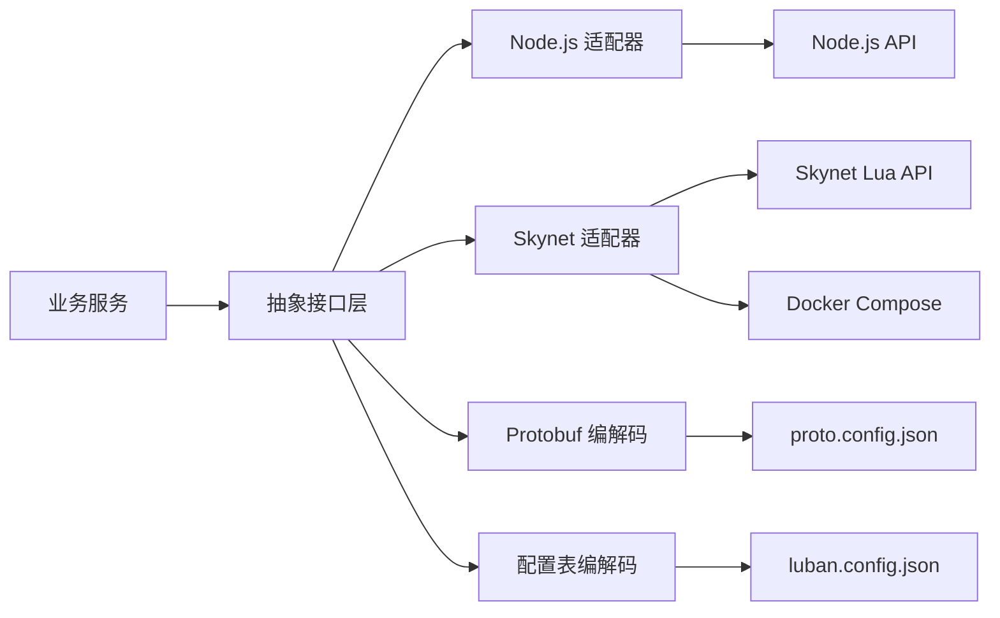

# 架构概览

<cite>
**本文档引用的文件**
- [README.md](file://README.md)
- [架构设计文档.md](file://docs/架构设计文档.md)
- [目录结构说明.md](file://docs/目录结构说明.md)
- [tslua.config.yaml](file://tslua.config.yaml)
- [interfaces.ts](file://server/src/framework/core/interfaces.ts)
- [node-adapter.ts](file://server/src/framework/runtime/node-adapter.ts)
- [skynet-adapter.ts](file://server/src/framework/runtime/skynet-adapter.ts)
- [bootstrap-node.ts](file://server/src/app/bootstrap-node.ts)
- [bootstrap-skynet.ts](file://server/src/app/bootstrap-skynet.ts)
- [proto.config.json](file://protocols/proto.config.json)
- [luban.config.json](file://tables/luban.config.json)
- [compose.yml](file://docker/compose.yml)
- [package.json](file://server/package.json)
</cite>

## 目录
1. [引言](#引言)
2. [项目结构](#项目结构)
3. [核心组件](#核心组件)
4. [架构总览](#架构总览)
5. [详细组件分析](#详细组件分析)
6. [依赖关系分析](#依赖关系分析)
7. [性能考虑](#性能考虑)
8. [故障排除指南](#故障排除指南)
9. [结论](#结论)
10. [附录](#附录)

## 引言
本文件面向TS-Skynet混合开发框架的使用者与贡献者，系统性阐述框架的三层架构设计理念与核心组件关系，重点解释“一套代码，双环境运行”的实现路径，以及抽象接口层如何在Node.js与Skynet之间实现跨平台兼容。文档还提供清晰的架构图与组件交互流程，帮助开发者快速建立对框架的整体认知。

## 项目结构
TS-Skynet混合开发框架采用“协议-配置表-业务代码-运行时适配”的工程化组织方式，目录结构遵循“源码与产物分离、环境与工具解耦”的原则，便于在Node.js开发测试与Skynet生产部署之间无缝切换。

- 核心目录职责
  - protocols：存放Proto Buffer源文件与编译配置，支撑前后端协议一致性
  - tables：存放Luban配置表的XML定义与Excel数据，统一策划、客户端与后端的数据契约
  - server：TypeScript源码与构建产物，包含业务服务、框架核心与运行时适配
  - docker：Docker相关配置与Skynet运行时镜像构建材料
  - docs：架构设计与使用指南文档

- 目录结构示意

**图表来源**
- [目录结构说明.md:5-74](file://docs/目录结构说明.md#L5-L74)

**章节来源**
- [目录结构说明.md:1-174](file://docs/目录结构说明.md#L1-L174)
- [README.md:136-193](file://README.md#L136-L193)

## 核心组件
框架的核心由三层组成：TypeScript业务代码层、抽象接口层、运行时适配层。这种分层确保业务逻辑与平台细节解耦，通过统一的抽象接口实现跨平台兼容。

- 三层架构设计
  - TypeScript业务代码层：编写业务逻辑，依赖抽象接口而非具体平台API
  - 抽象接口层：定义ILogger、ITimer、INetwork、IService、IPbCodec等接口，统一跨平台能力
  - 运行时适配层：分别为Node.js与Skynet提供具体实现，屏蔽底层差异

- 关键接口定义
  - 日志接口：统一debug/info/warn/error输出
  - 定时器接口：统一setTimeout/clearTimeout/sleep/now，支持协程安全的safeTimeout/safeImmediate
  - 网络接口：统一send/call/dispatch/ret，支持消息分发与响应返回
  - 服务接口：统一start/exit/newService/self/getenv/setenv
  - 协议编解码接口：统一encode/decode/create/pack/unpack，支持Packet消息打包解包

**章节来源**
- [interfaces.ts:1-226](file://server/src/framework/core/interfaces.ts#L1-L226)
- [README.md:283-326](file://README.md#L283-L326)

## 架构总览
下图展示了TS-Skynet混合开发框架的总体架构与组件交互关系，体现“一套代码，双环境运行”的核心思想。

**图表来源**
- [interfaces.ts:189-226](file://server/src/framework/core/interfaces.ts#L189-L226)
- [node-adapter.ts:177-194](file://server/src/framework/runtime/node-adapter.ts#L177-L194)
- [skynet-adapter.ts:204-221](file://server/src/framework/runtime/skynet-adapter.ts#L204-L221)
- [bootstrap-node.ts:1-22](file://server/src/app/bootstrap-node.ts#L1-L22)
- [bootstrap-skynet.ts:1-20](file://server/src/app/bootstrap-skynet.ts#L1-L20)
- [proto.config.json:1-15](file://protocols/proto.config.json#L1-L15)
- [luban.config.json:1-33](file://tables/luban.config.json#L1-L33)
- [compose.yml:1-70](file://docker/compose.yml#L1-L70)

## 详细组件分析

### 抽象接口层（Interfaces）
抽象接口层是跨平台兼容的核心，所有业务代码必须通过这些接口访问系统能力，避免直接依赖Node.js或Skynet的具体API。

- 设计原则
  - 依赖倒置：业务代码依赖接口，不依赖具体实现
  - 接口隔离：每个接口职责单一，降低耦合
  - 开闭原则：易于扩展新的适配器与能力

- 关键接口要点
  - ITimer：提供sleep与协程安全的safeTimeout/safeImmediate，满足Skynet协程模型
  - INetwork：提供call/dispatch/ret，统一RPC调用与消息分发
  - IService：提供start/newService/self/getenv/setenv，统一服务生命周期管理
  - IPbCodec：提供encode/decode/create/pack/unpack，统一协议编解码

**图表来源**
- [interfaces.ts:6-226](file://server/src/framework/core/interfaces.ts#L6-L226)

**章节来源**
- [interfaces.ts:1-226](file://server/src/framework/core/interfaces.ts#L1-L226)
- [架构设计文档.md:80-179](file://docs/架构设计文档.md#L80-L179)

### Node.js 适配器（Node.js Runtime Adapter）
Node.js适配器为开发与测试提供便利，使用Node.js原生API实现抽象接口，支持在本地快速验证业务逻辑。

- 实现要点
  - NodeLogger：基于console实现日志输出
  - NodeTimer：基于global.setTimeout/Date实现定时与睡眠
  - NodeNetwork：模拟RPC调用，支持注册处理器与响应返回
  - NodeService：基于setImmediate模拟服务启动，支持创建新服务与环境变量

- 与抽象接口的对应关系
  - ILogger → NodeLogger
  - ITimer → NodeTimer
  - INetwork → NodeNetwork
  - IService → NodeService

**图表来源**
- [node-adapter.ts:19-194](file://server/src/framework/runtime/node-adapter.ts#L19-L194)

**章节来源**
- [node-adapter.ts:1-194](file://server/src/framework/runtime/node-adapter.ts#L1-L194)
- [bootstrap-node.ts:1-22](file://server/src/app/bootstrap-node.ts#L1-L22)

### Skynet 适配器（Skynet Runtime Adapter）
Skynet适配器将抽象接口映射到Skynet的Lua API，利用协程模型实现非阻塞的异步调用，保证高性能与高并发。

- 实现要点
  - SkynetLogger：基于skynet.error实现日志输出，并格式化时间戳与参数
  - SkynetTimer：基于skynet.timeout实现定时与sleep，使用协程yield/resume
  - SkynetNetwork：基于skynet.send/call/dispatch/ret实现消息发送与RPC调用
  - SkynetService：基于skynet.start/newservice/self/getenv/setenv实现服务管理

- 协程安全机制
  - safeTimeout/safeImmediate通过skynet.fork在独立协程中执行回调，确保回调内部可使用async/await

**图表来源**
- [skynet-adapter.ts:28-221](file://server/src/framework/runtime/skynet-adapter.ts#L28-L221)

**章节来源**
- [skynet-adapter.ts:1-221](file://server/src/framework/runtime/skynet-adapter.ts#L1-L221)
- [bootstrap-skynet.ts:1-20](file://server/src/app/bootstrap-skynet.ts#L1-L20)

### 异步处理与跨环境统一
框架通过TypeScriptToLua（TSTL）与Skynet协程机制，实现了“一套代码，双环境运行”的异步统一。

- Node.js环境
  - async/await直接映射为ES Promise
  - safeTimeout/safeImmediate在Node.js环境下直接使用setImmediate/setTimeout

- Skynet环境
  - TSTL将async/await转换为Lua协程，await调用映射为skynet.call/skynet.sleep等
  - 协程通过yield挂起，响应到达后自动resume，保证非阻塞执行

**图表来源**
- [架构设计文档.md:181-384](file://docs/架构设计文档.md#L181-L384)
- [skynet-adapter.ts:132-137](file://server/src/framework/runtime/skynet-adapter.ts#L132-L137)

**章节来源**
- [架构设计文档.md:181-384](file://docs/架构设计文档.md#L181-L384)

### 目录结构设计原则
- protocols与tables分离：源文件与生成文件分离，便于版本控制与工具链管理
- server/src与server/dist分离：源码与编译产物分离，支持多环境输出
- docker独立：Docker配置与Skynet运行时材料集中管理，支持开发与生产两种模式
- docs集中：架构文档与使用指南集中存放，便于维护与查阅

**图表来源**
- [目录结构说明.md:80-127](file://docs/目录结构说明.md#L80-L127)

**章节来源**
- [目录结构说明.md:1-174](file://docs/目录结构说明.md#L1-L174)
- [proto.config.json:1-15](file://protocols/proto.config.json#L1-L15)
- [luban.config.json:1-33](file://tables/luban.config.json#L1-L33)

## 依赖关系分析
- 组件耦合与内聚
  - 业务代码仅依赖IRuntime与各接口，内聚度高、耦合度低
  - 适配器实现与抽象接口松耦合，便于替换与扩展
- 直接与间接依赖
  - Node.js适配器依赖Node.js全局API
  - Skynet适配器依赖Skynet Lua模块
- 外部依赖与集成点
  - TypeScriptToLua（TSTL）负责TS→Lua转换
  - Protobuf与Luban分别负责协议与配置表的跨语言生成
  - Docker Compose负责Skynet容器化部署

**图表来源**
- [interfaces.ts:189-226](file://server/src/framework/core/interfaces.ts#L189-L226)
- [node-adapter.ts:1-194](file://server/src/framework/runtime/node-adapter.ts#L1-L194)
- [skynet-adapter.ts:1-221](file://server/src/framework/runtime/skynet-adapter.ts#L1-L221)
- [proto.config.json:1-15](file://protocols/proto.config.json#L1-L15)
- [luban.config.json:1-33](file://tables/luban.config.json#L1-L33)
- [compose.yml:1-70](file://docker/compose.yml#L1-L70)

**章节来源**
- [interfaces.ts:1-226](file://server/src/framework/core/interfaces.ts#L1-L226)
- [node-adapter.ts:1-194](file://server/src/framework/runtime/node-adapter.ts#L1-L194)
- [skynet-adapter.ts:1-221](file://server/src/framework/runtime/skynet-adapter.ts#L1-L221)

## 性能考虑
- 协程模型优势：Skynet的Actor模型与协程结合，避免线程切换开销，适合高并发网络服务
- 非阻塞I/O：网络调用与定时器均采用非阻塞实现，提升吞吐量
- 编译优化：TSTL将async/await转换为高效的协程yield/resume序列
- 资源隔离：Docker容器化部署便于资源限制与弹性伸缩

## 故障排除指南
- Node.js开发模式问题
  - 确认已安装依赖并使用npm run dev启动
  - 检查bootstrap-node.ts导入的服务模块是否正确
- Skynet部署问题
  - 确认已编译TS为Lua并复制到docker/lua目录
  - 检查compose.yml中的卷挂载与环境变量配置
- 协议与配置表问题
  - 确认proto.config.json与luban.config.json路径正确
  - 重新执行编译脚本并检查生成文件是否存在

**章节来源**
- [README.md:197-277](file://README.md#L197-L277)
- [compose.yml:1-70](file://docker/compose.yml#L1-L70)
- [package.json:1-51](file://server/package.json#L1-L51)

## 结论
TS-Skynet混合开发框架通过“抽象接口层+运行时适配层”的双层适配设计，成功实现了“一套代码，双环境运行”。抽象接口层屏蔽了Node.js与Skynet的差异，运行时适配层则针对各自平台特性进行高效实现。配合Protobuf与Luban工具链，框架在开发效率、跨平台兼容性与生产性能之间取得了良好平衡，为游戏与高并发服务端开发提供了可靠的技术基座。

## 附录
- 配置文件位置
  - 运行时配置：tslua.config.yaml
  - Protobuf编译：protocols/proto.config.json
  - 配置表编译：tables/luban.config.json
  - Docker部署：docker/compose.yml
- 常用命令
  - npm run dev：Node.js开发模式
  - npm run build:ts：编译TypeScript为Lua
  - npm run server:start：启动Skynet服务
  - npm run cli -- quick：一键启动（检查+编译+启动）

**章节来源**
- [tslua.config.yaml:1-52](file://tslua.config.yaml#L1-L52)
- [proto.config.json:1-15](file://protocols/proto.config.json#L1-L15)
- [luban.config.json:1-33](file://tables/luban.config.json#L1-L33)
- [compose.yml:1-70](file://docker/compose.yml#L1-L70)
- [package.json:1-51](file://server/package.json#L1-L51)