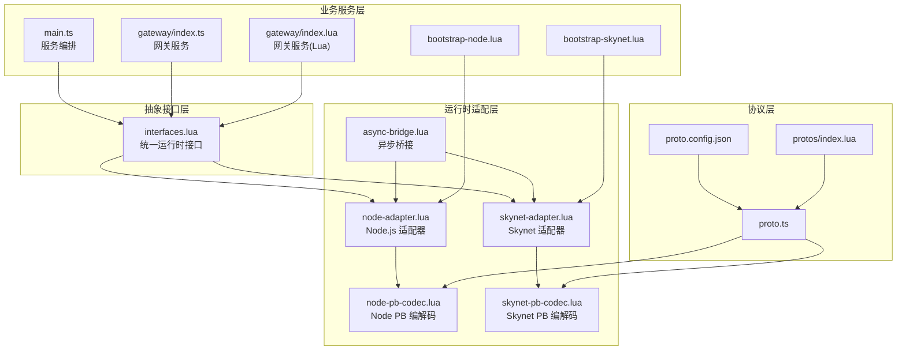
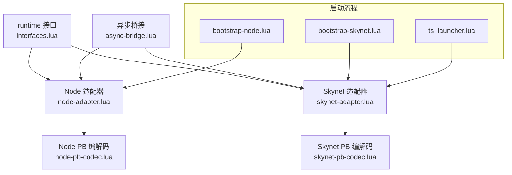
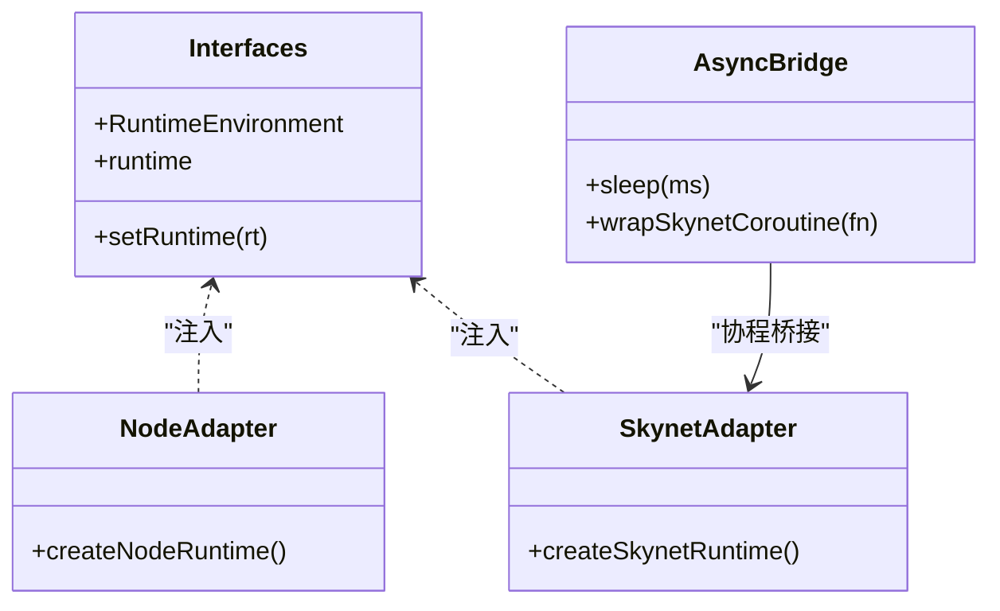
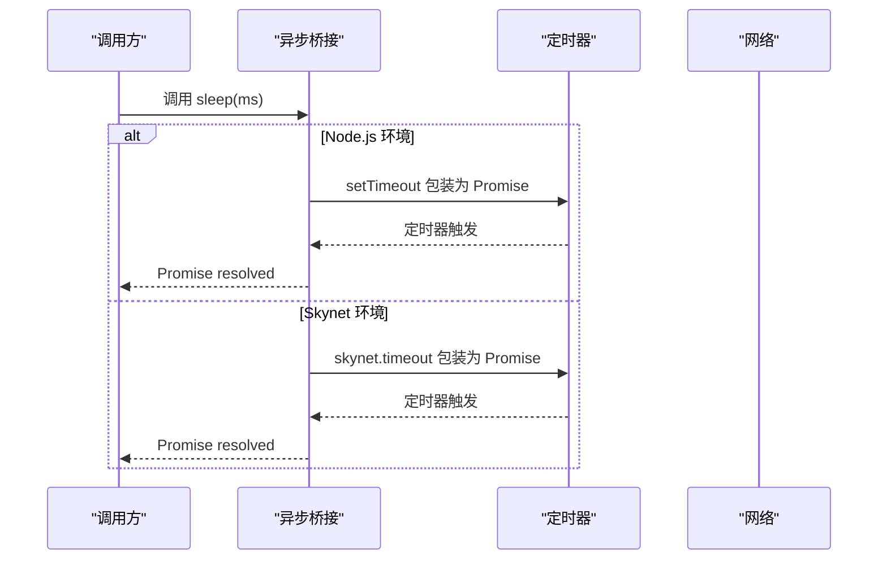
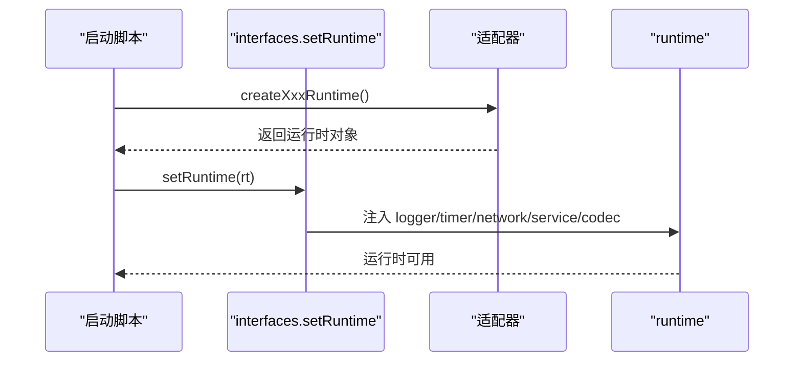
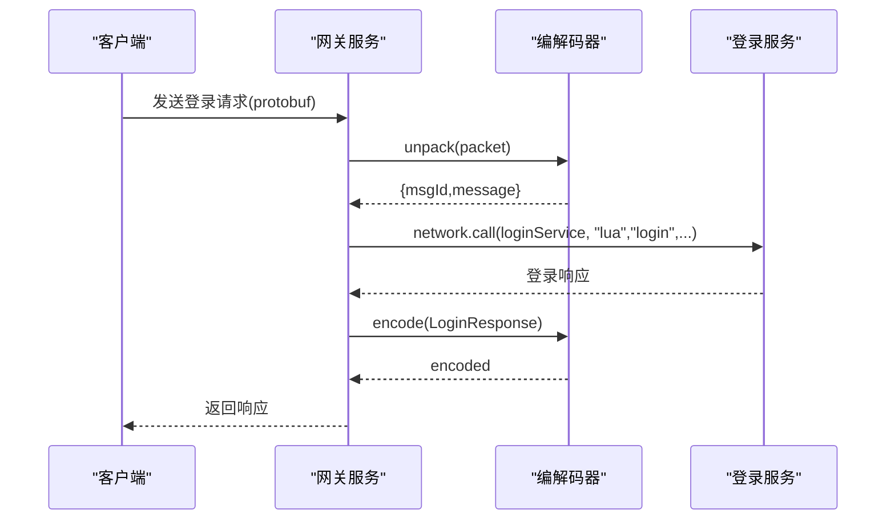
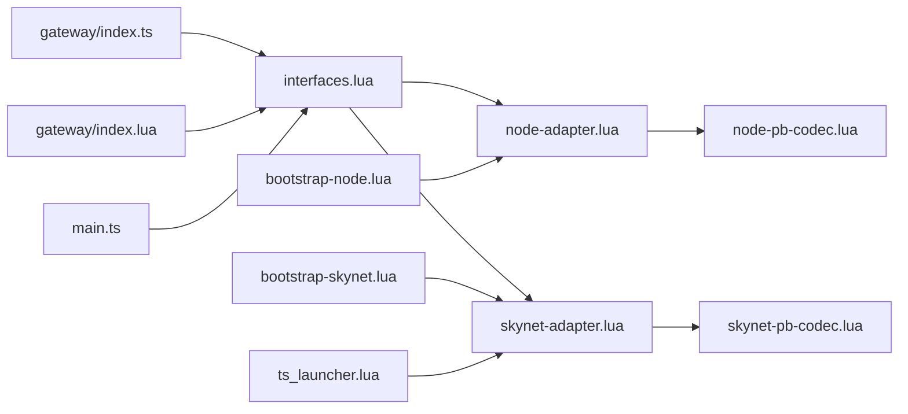

# 核心功能

<cite>
**本文引用的文件**
- [interfaces.lua](file://docker/lua/framework/core/interfaces.lua)
- [node-adapter.lua](file://docker/lua/framework/runtime/node-adapter.lua)
- [skynet-adapter.lua](file://docker/lua/framework/runtime/skynet-adapter.lua)
- [async-bridge.lua](file://docker/lua/framework/runtime/async-bridge.lua)
- [node-pb-codec.lua](file://docker/lua/framework/runtime/node-pb-codec.lua)
- [skynet-pb-codec.lua](file://docker/lua/framework/runtime/skynet-pb-codec.lua)
- [ts_launcher.lua](file://docker/native/ts_launcher.lua)
- [bootstrap-skynet.lua](file://docker/lua/app/bootstrap-skynet.lua)
- [bootstrap-node.lua](file://docker/lua/app/bootstrap-node.lua)
- [main.ts](file://server/src/app/main.ts)
- [gateway/index.ts](file://server/src/app/services/gateway/index.ts)
- [gateway/index.lua](file://docker/lua/app/services/gateway/index.lua)
- [proto.config.json](file://protocols/proto.config.json)
- [protos/index.lua](file://docker/lua/protos/index.lua)
- [proto.ts](file://server/src/protos/proto.ts)
</cite>

## 目录
1. [引言](#引言)
2. [项目结构](#项目结构)
3. [核心组件](#核心组件)
4. [架构总览](#架构总览)
5. [详细组件分析](#详细组件分析)
6. [依赖关系分析](#依赖关系分析)
7. [性能考量](#性能考量)
8. [故障排查指南](#故障排查指南)
9. [结论](#结论)
10. [附录](#附录)

## 引言
本文件系统性阐述 TS-Skynet 混合开发框架的四大核心功能：抽象接口层设计、异步模型统一、双模式运行时切换、完整业务示例。目标是帮助读者快速掌握如何在 Node.js 与 Skynet 两种运行环境中编写一致的业务代码，同时理解跨平台兼容性保障、异步/await 映射机制、运行时适配器选择策略，以及消息分发、异步 RPC 调用、定时任务等典型场景的实现方式。

## 项目结构
TS-Skynet 框架采用“TypeScript 业务逻辑 + TypeScriptToLua 转换 + Lua 运行时适配”的分层组织：
- 抽象接口层：通过统一的 runtime 接口屏蔽底层差异
- 运行时适配层：分别针对 Node.js 与 Skynet 提供适配器
- 业务服务层：以服务为单位组织业务逻辑（网关、登录、游戏等）
- 协议编解码层：基于 Protocol Buffers 的跨语言消息编解码

**图表来源**
- [interfaces.lua:1-24](file://docker/lua/framework/core/interfaces.lua#L1-L24)
- [node-adapter.lua:185-205](file://docker/lua/framework/runtime/node-adapter.lua#L185-L205)
- [skynet-adapter.lua:205-225](file://docker/lua/framework/runtime/skynet-adapter.lua#L205-L225)
- [async-bridge.lua:1-243](file://docker/lua/framework/runtime/async-bridge.lua#L1-L243)
- [node-pb-codec.lua:1-185](file://docker/lua/framework/runtime/node-pb-codec.lua#L1-L185)
- [skynet-pb-codec.lua:1-164](file://docker/lua/framework/runtime/skynet-pb-codec.lua#L1-L164)
- [bootstrap-skynet.lua:1-12](file://docker/lua/app/bootstrap-skynet.lua#L1-L12)
- [bootstrap-node.lua:1-17](file://docker/lua/app/bootstrap-node.lua#L1-L17)
- [main.ts:1-106](file://server/src/app/main.ts#L1-L106)
- [gateway/index.ts:1-206](file://server/src/app/services/gateway/index.ts#L1-L206)
- [gateway/index.lua:1-225](file://docker/lua/app/services/gateway/index.lua#L1-L225)
- [proto.config.json:1-15](file://protocols/proto.config.json#L1-L15)
- [protos/index.lua:1-14](file://docker/lua/protos/index.lua#L1-L14)
- [proto.ts:1-333](file://server/src/protos/proto.ts#L1-L333)

**章节来源**
- [interfaces.lua:1-24](file://docker/lua/framework/core/interfaces.lua#L1-L24)
- [bootstrap-skynet.lua:1-12](file://docker/lua/app/bootstrap-skynet.lua#L1-L12)
- [bootstrap-node.lua:1-17](file://docker/lua/app/bootstrap-node.lua#L1-L17)
- [main.ts:1-106](file://server/src/app/main.ts#L1-L106)
- [gateway/index.ts:1-206](file://server/src/app/services/gateway/index.ts#L1-L206)
- [gateway/index.lua:1-225](file://docker/lua/app/services/gateway/index.lua#L1-L225)
- [proto.config.json:1-15](file://protocols/proto.config.json#L1-L15)
- [protos/index.lua:1-14](file://docker/lua/protos/index.lua#L1-L14)
- [proto.ts:1-333](file://server/src/protos/proto.ts#L1-L333)

## 核心组件
本节聚焦四大核心功能的具体实现与协作方式。

- 抽象接口层设计
  - 统一运行时接口：通过集中式接口导出运行时环境枚举与全局运行时实例，屏蔽 Node.js 与 Skynet 的差异
  - 运行时设置：提供设置运行时的方法，注入日志、定时器、网络、服务、数据库、编解码等子系统
  - 跨平台兼容性：通过适配器注入，保证业务代码无需感知底层差异

- 异步模型统一
  - Promise 实现：在 Skynet 环境下提供自定义 Promise 实现，支持 then/catch/all 等标准语义
  - 协程桥接：通过桥接函数包装协程，使 async/await 在两种环境下均能正确调度
  - 睡眠与超时：提供跨环境 sleep 函数，内部根据当前环境选择 setTimeout 或 skynet.timeout

- 双模式运行时切换
  - Node.js 适配器：提供 NodeLogger、NodeTimer、NodeNetwork、NodeService 等实现
  - Skynet 适配器：提供 SkynetLogger、SkynetTimer、SkynetNetwork、SkynetService 等实现
  - 启动入口：分别在 Skynet 与 Node.js 下加载对应适配器并设置运行时

- 完整业务示例
  - 服务编排：主入口负责批量启动多个服务实例，使用 newService 创建子服务并通过 ts_launcher 注入全局对象
  - 网关服务：演示消息分发、心跳处理、服务间 RPC 调用、定时保活等典型场景
  - 协议编解码：基于 protobuf 的消息打包/解包，支持 Node 与 Skynet 两端

**章节来源**
- [interfaces.lua:5-22](file://docker/lua/framework/core/interfaces.lua#L5-L22)
- [async-bridge.lua:15-241](file://docker/lua/framework/runtime/async-bridge.lua#L15-L241)
- [node-adapter.lua:185-205](file://docker/lua/framework/runtime/node-adapter.lua#L185-L205)
- [skynet-adapter.lua:205-225](file://docker/lua/framework/runtime/skynet-adapter.lua#L205-L225)
- [main.ts:31-87](file://server/src/app/main.ts#L31-L87)
- [gateway/index.ts:169-206](file://server/src/app/services/gateway/index.ts#L169-L206)

## 架构总览
TS-Skynet 的整体架构围绕“抽象接口层 + 运行时适配层 + 业务服务层 + 协议编解码层”展开，通过统一的 runtime 接口实现跨平台一致性。

**图表来源**
- [interfaces.lua:10-22](file://docker/lua/framework/core/interfaces.lua#L10-L22)
- [node-adapter.lua:185-205](file://docker/lua/framework/runtime/node-adapter.lua#L185-L205)
- [skynet-adapter.lua:205-225](file://docker/lua/framework/runtime/skynet-adapter.lua#L205-L225)
- [async-bridge.lua:206-241](file://docker/lua/framework/runtime/async-bridge.lua#L206-L241)
- [node-pb-codec.lua:53-183](file://docker/lua/framework/runtime/node-pb-codec.lua#L53-L183)
- [skynet-pb-codec.lua:51-162](file://docker/lua/framework/runtime/skynet-pb-codec.lua#L51-L162)
- [bootstrap-skynet.lua:5-9](file://docker/lua/app/bootstrap-skynet.lua#L5-L9)
- [bootstrap-node.lua:5-12](file://docker/lua/app/bootstrap-node.lua#L5-L12)
- [ts_launcher.lua:17-20](file://docker/native/ts_launcher.lua#L17-L20)

## 详细组件分析

### 抽象接口层设计
- 设计要点
  - 运行时环境枚举：提供 NODE 与 SKYNET 两种环境标识
  - 全局运行时实例：使用可变对象保存注入的子系统（logger/timer/network/service/database/codec）
  - 运行时设置：将适配器创建的运行时对象注入到全局 runtime 中

- 跨平台兼容性保障
  - 业务代码仅依赖 runtime.* 接口，不直接调用 Node.js 或 Skynet 的具体 API
  - 通过 setRuntime 动态切换适配器，实现同一套业务代码在不同环境运行

- 错误的直接 API 调用对比
  - 正确做法：使用 runtime.timer.sleep、runtime.network.call、runtime.service.newService 等统一封装
  - 错误做法：直接调用 Node.js 的 global:setTimeout 或 Skynet 的 skynet.timeout、skynet.call 等底层 API

**图表来源**
- [interfaces.lua:5-22](file://docker/lua/framework/core/interfaces.lua#L5-L22)
- [node-adapter.lua:185-205](file://docker/lua/framework/runtime/node-adapter.lua#L185-L205)
- [skynet-adapter.lua:205-225](file://docker/lua/framework/runtime/skynet-adapter.lua#L205-L225)
- [async-bridge.lua:206-241](file://docker/lua/framework/runtime/async-bridge.lua#L206-L241)

**章节来源**
- [interfaces.lua:5-22](file://docker/lua/framework/core/interfaces.lua#L5-L22)

### 异步模型统一
- 实现原理
  - Skynet 环境下的 Promise：自定义实现 then/catch/all，内部使用协程与回调队列管理状态转换
  - 协程桥接：将业务函数包装为 Promise，利用 __TS__AsyncAwaiterSkynet 与 __TS__AwaitSkynet 实现 await 在协程中的正确调度
  - 睡眠与超时：跨环境 sleep 函数根据是否存在 setTimeout 自动选择 Node 或 Skynet 的 sleep 实现

- Node.js 与 Skynet 的 async/await 映射
  - Node.js：通过 __TS__AsyncAwaiterSkynet 将 async/await 映射为 Promise 链式调用
  - Skynet：通过自定义 Promise 与 wrapSkynetCoroutine，将 async/await 映射为 Lua 协程

**图表来源**
- [async-bridge.lua:227-241](file://docker/lua/framework/runtime/async-bridge.lua#L227-L241)
- [node-adapter.lua:47-60](file://docker/lua/framework/runtime/node-adapter.lua#L47-L60)
- [skynet-adapter.lua:92-104](file://docker/lua/framework/runtime/skynet-adapter.lua#L92-L104)

**章节来源**
- [async-bridge.lua:15-241](file://docker/lua/framework/runtime/async-bridge.lua#L15-L241)
- [node-adapter.lua:38-60](file://docker/lua/framework/runtime/node-adapter.lua#L38-L60)
- [skynet-adapter.lua:85-104](file://docker/lua/framework/runtime/skynet-adapter.lua#L85-L104)

### 双模式运行时切换
- 切换机制
  - Node.js 模式：加载 node-adapter，创建 NodeRuntime 并注入 runtime
  - Skynet 模式：加载 skynet-adapter，创建 SkynetRuntime 并注入 runtime；ts_launcher 注入全局对象后加载 TS 服务模块

- 适配器职责
  - Node 适配器：提供 NodeLogger、NodeTimer、NodeNetwork、NodeService 等实现
  - Skynet 适配器：提供 SkynetLogger、SkynetTimer、SkynetNetwork、SkynetService 等实现

**图表来源**
- [bootstrap-skynet.lua:5-9](file://docker/lua/app/bootstrap-skynet.lua#L5-L9)
- [bootstrap-node.lua:5-12](file://docker/lua/app/bootstrap-node.lua#L5-L12)
- [ts_launcher.lua:17-20](file://docker/native/ts_launcher.lua#L17-L20)
- [interfaces.lua:14-22](file://docker/lua/framework/core/interfaces.lua#L14-L22)
- [node-adapter.lua:185-205](file://docker/lua/framework/runtime/node-adapter.lua#L185-L205)
- [skynet-adapter.lua:205-225](file://docker/lua/framework/runtime/skynet-adapter.lua#L205-L225)

**章节来源**
- [bootstrap-skynet.lua:5-9](file://docker/lua/app/bootstrap-skynet.lua#L5-L9)
- [bootstrap-node.lua:5-12](file://docker/lua/app/bootstrap-node.lua#L5-L12)
- [ts_launcher.lua:17-20](file://docker/native/ts_launcher.lua#L17-L20)
- [interfaces.lua:14-22](file://docker/lua/framework/core/interfaces.lua#L14-L22)

### 完整业务示例
- 服务编排（主入口）
  - 批量启动多个服务实例，使用 runtime.service.newService 创建子服务
  - 通过 ts_launcher 在 Skynet 环境注入全局对象并加载 TS 服务模块
  - 使用 runtime.timer.sleep 控制启动节奏，避免初始化竞争

- 网关服务（消息分发与 RPC）
  - 消息分发：注册网络处理器，根据命令类型分发到不同处理函数
  - 心跳处理：使用 protobuf 解包/编码，返回服务器时间与客户端时间
  - 服务间 RPC：调用 login 服务进行认证，演示跨服务异步调用
  - 定时保活：使用 runtime.timer.sleep 启动后台协程，保持服务活跃

- 协议编解码
  - Node 环境：基于 proto.ts 的 JSON 序列化实现，提供 create/encode/decode
  - Skynet 环境：基于 lua-protobuf，提供 pb.encode/pb.decode
  - 通用接口：runtime.codec.pack/unpack 统一封装消息打包/解包

**图表来源**
- [gateway/index.ts:138-167](file://server/src/app/services/gateway/index.ts#L138-L167)
- [gateway/index.lua:143-179](file://docker/lua/app/services/gateway/index.lua#L143-L179)
- [node-pb-codec.lua:160-183](file://docker/lua/framework/runtime/node-pb-codec.lua#L160-L183)
- [skynet-pb-codec.lua:127-162](file://docker/lua/framework/runtime/skynet-pb-codec.lua#L127-L162)

**章节来源**
- [main.ts:31-87](file://server/src/app/main.ts#L31-L87)
- [gateway/index.ts:169-206](file://server/src/app/services/gateway/index.ts#L169-L206)
- [gateway/index.lua:181-223](file://docker/lua/app/services/gateway/index.lua#L181-L223)
- [node-pb-codec.lua:76-183](file://docker/lua/framework/runtime/node-pb-codec.lua#L76-L183)
- [skynet-pb-codec.lua:91-162](file://docker/lua/framework/runtime/skynet-pb-codec.lua#L91-L162)

## 依赖关系分析
- 组件耦合
  - 业务服务依赖 runtime 接口，与具体适配器解耦
  - 编解码器与协议定义分离，便于跨语言共享
  - 启动脚本与适配器强关联，但通过 setRuntime 与接口层弱耦合

- 外部依赖
  - Node.js：global.setTimeout、global.setImmediate、console、process
  - Skynet：skynet.*、pb、protoc、JSON、Date、table 等

**图表来源**
- [gateway/index.ts:7-13](file://server/src/app/services/gateway/index.ts#L7-L13)
- [gateway/index.lua:10-18](file://docker/lua/app/services/gateway/index.lua#L10-L18)
- [main.ts](file://server/src/app/main.ts#L8)
- [interfaces.lua:10-22](file://docker/lua/framework/core/interfaces.lua#L10-L22)
- [node-adapter.lua:12-13](file://docker/lua/framework/runtime/node-adapter.lua#L12-L13)
- [skynet-adapter.lua:14-15](file://docker/lua/framework/runtime/skynet-adapter.lua#L14-L15)
- [node-pb-codec.lua:12-13](file://docker/lua/framework/runtime/node-pb-codec.lua#L12-L13)
- [skynet-pb-codec.lua:15-21](file://docker/lua/framework/runtime/skynet-pb-codec.lua#L15-L21)
- [bootstrap-skynet.lua:7-9](file://docker/lua/app/bootstrap-skynet.lua#L7-L9)
- [bootstrap-node.lua:7-12](file://docker/lua/app/bootstrap-node.lua#L7-L12)
- [ts_launcher.lua:18-20](file://docker/native/ts_launcher.lua#L18-L20)

**章节来源**
- [gateway/index.ts:7-13](file://server/src/app/services/gateway/index.ts#L7-L13)
- [gateway/index.lua:10-18](file://docker/lua/app/services/gateway/index.lua#L10-L18)
- [main.ts](file://server/src/app/main.ts#L8)
- [interfaces.lua:10-22](file://docker/lua/framework/core/interfaces.lua#L10-L22)

## 性能考量
- 异步调度
  - Skynet 环境使用协程与 timeout/fork，避免线程阻塞
  - Node.js 环境使用 setTimeout/setImmediate，注意回调队列与事件循环

- 网络与编解码
  - Skynet 环境建议启用 lua-protobuf，减少序列化开销
  - Node 环境使用 JSON 序列化作为回退方案，注意字符串化/反序列化的成本

- 定时器精度
  - Skynet 使用厘秒（1/100 秒），需注意毫秒到厘秒的换算
  - Node.js 使用毫秒，注意与 Skynet 的差异

- 服务启动顺序
  - 使用 runtime.timer.sleep 控制启动节奏，避免并发初始化导致的资源竞争

## 故障排查指南
- 运行时未设置
  - 症状：调用 runtime.* 时报空指针或未定义
  - 处理：确认已通过 setRuntime 注入对应适配器

- 编解码器不可用
  - 症状：codec 为 nil 或抛出“codec not available”
  - 处理：检查 Skynet 环境是否安装 lua-protobuf，Node 环境是否正确加载 proto.ts

- 网络调用失败
  - 症状：network.call 返回错误或超时
  - 处理：确认目标服务地址有效，消息类型与协议一致，服务已启动

- 定时器异常
  - 症状：sleep 不生效或定时器精度异常
  - 处理：检查环境时间单位换算（Skynet 厘秒 vs Node.js 毫秒）

**章节来源**
- [interfaces.lua:14-22](file://docker/lua/framework/core/interfaces.lua#L14-L22)
- [skynet-pb-codec.lua:22-24](file://docker/lua/framework/runtime/skynet-pb-codec.lua#L22-L24)
- [node-pb-codec.lua:61-74](file://docker/lua/framework/runtime/node-pb-codec.lua#L61-L74)
- [skynet-adapter.lua:85-104](file://docker/lua/framework/runtime/skynet-adapter.lua#L85-L104)
- [node-adapter.lua:38-60](file://docker/lua/framework/runtime/node-adapter.lua#L38-L60)

## 结论
TS-Skynet 框架通过抽象接口层、异步桥接、运行时适配与协议编解码四层设计，实现了在 Node.js 与 Skynet 两种环境下的统一开发体验。业务代码只需依赖 runtime 接口，即可在不同运行时之间无缝切换。结合服务编排、消息分发、异步 RPC 与定时任务等典型场景，开发者可以快速构建高性能、可维护的分布式服务。

## 附录
- 协议配置
  - proto.config.json 指定 proto 源目录与输出目录，确保 TypeScript 与 Lua 两端生成的协议一致

- 协议索引
  - protos/index.lua 将生成的 proto 导出为统一入口，便于业务模块按需导入

**章节来源**
- [proto.config.json:1-15](file://protocols/proto.config.json#L1-L15)
- [protos/index.lua:5-12](file://docker/lua/protos/index.lua#L5-L12)
- [proto.ts:154-332](file://server/src/protos/proto.ts#L154-L332)