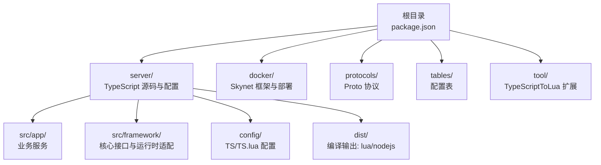
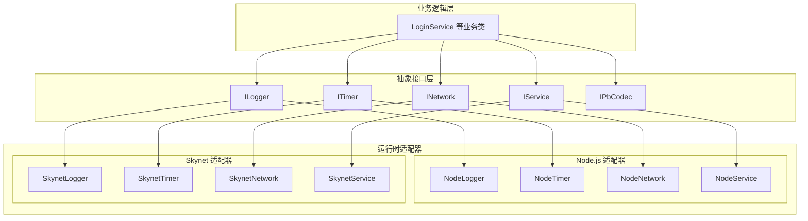
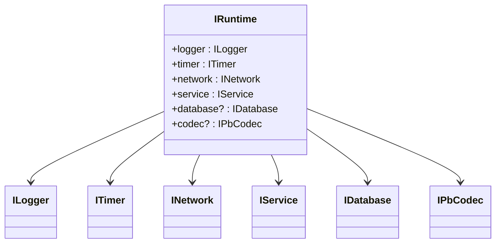
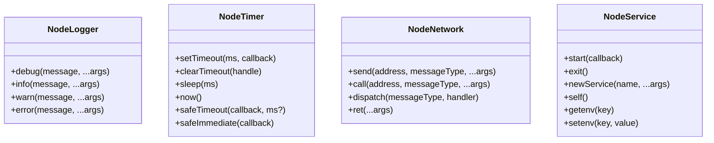
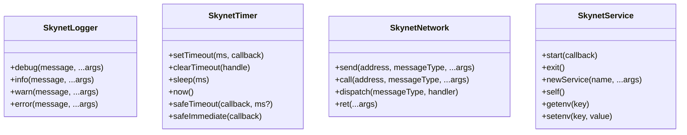
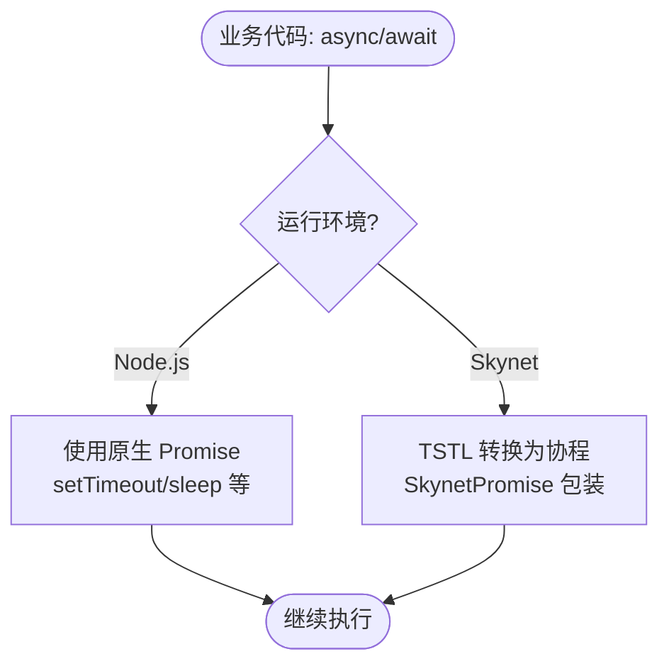
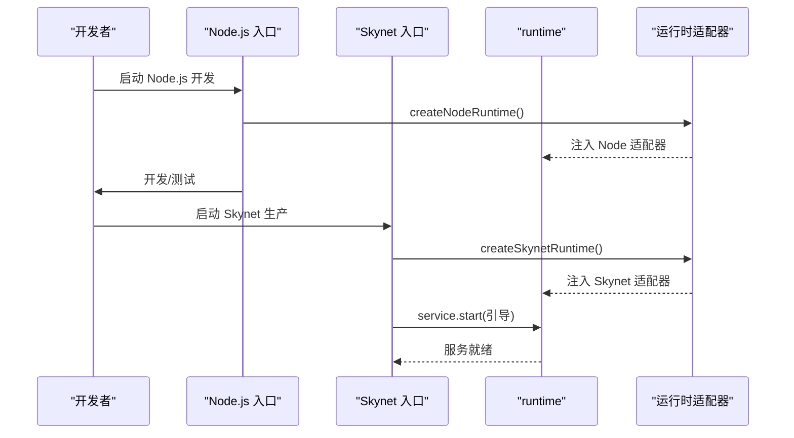
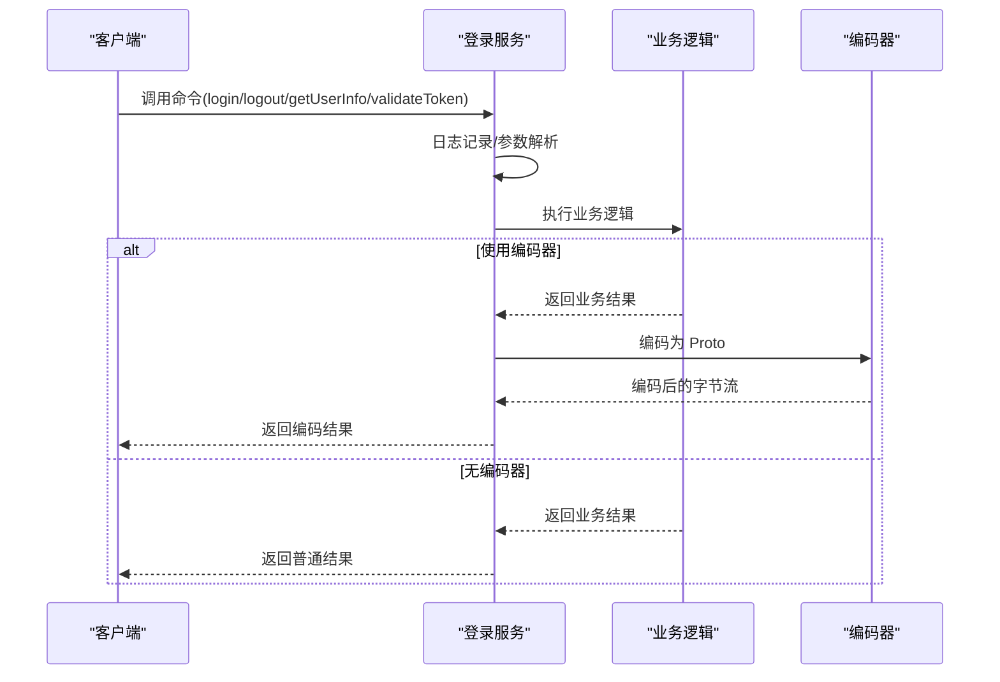
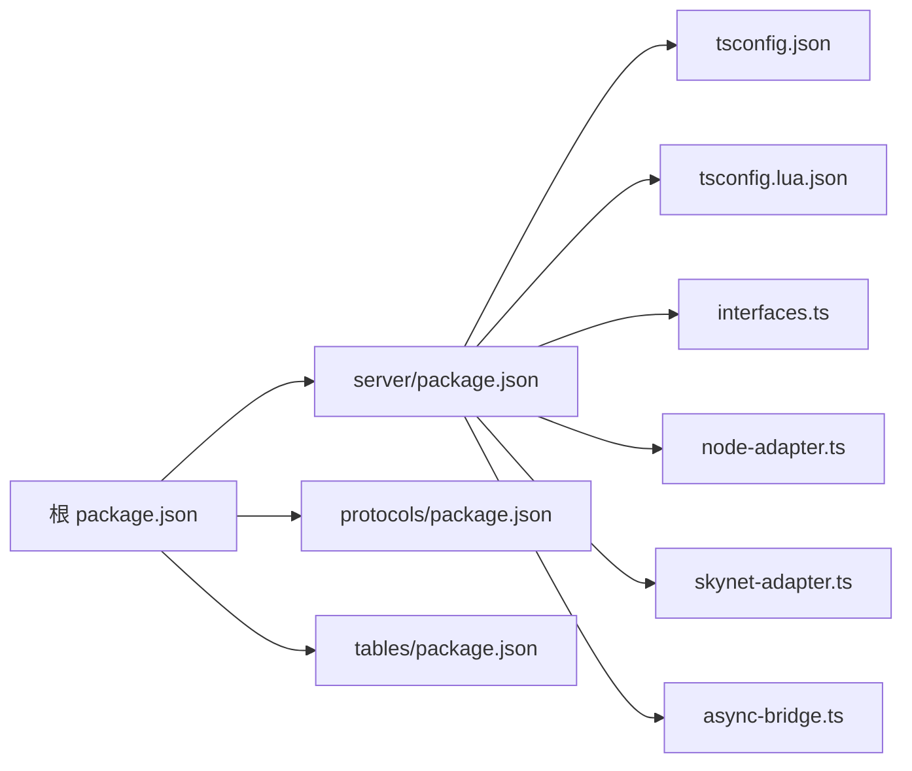

# 项目概述

<cite>
**本文引用的文件**
- [README.md](file://README.md)
- [OVERVIEW.md](file://docs/OVERVIEW.md)
- [PROJECT_SUMMARY.md](file://docs/PROJECT_SUMMARY.md)
- [package.json](file://package.json)
- [server/package.json](file://server/package.json)
- [server/config/tsconfig.json](file://server/config/tsconfig.json)
- [server/config/tsconfig.lua.json](file://server/config/tsconfig.lua.json)
- [server/src/framework/core/interfaces.ts](file://server/src/framework/core/interfaces.ts)
- [server/src/framework/runtime/node-adapter.ts](file://server/src/framework/runtime/node-adapter.ts)
- [server/src/framework/runtime/skynet-adapter.ts](file://server/src/framework/runtime/skynet-adapter.ts)
- [server/src/framework/runtime/async-bridge.ts](file://server/src/framework/runtime/async-bridge.ts)
- [server/src/app/main.ts](file://server/src/app/main.ts)
- [server/src/app/services/login/index.ts](file://server/src/app/services/login/index.ts)
- [tslua.config.yaml](file://tslua.config.yaml)
</cite>

## 目录
1. [引言](#引言)
2. [项目结构](#项目结构)
3. [核心组件](#核心组件)
4. [架构总览](#架构总览)
5. [详细组件分析](#详细组件分析)
6. [依赖分析](#依赖分析)
7. [性能考量](#性能考量)
8. [故障排查指南](#故障排查指南)
9. [结论](#结论)
10. [附录](#附录)

## 引言
TS-Skynet 混合开发框架旨在解决两大技术痛点：
- Skynet 性能卓越但 Lua 缺乏类型安全与现代工程化能力
- TypeScript 开发体验优秀但直接运行在 Node.js 缺少 Skynet 的 Actor 模型

框架通过“一套代码，双环境运行”的理念，让开发者使用 TypeScript 编写业务逻辑，既能快速在 Node.js 环境进行开发与测试，又能编译为 Lua 在 Skynet 生产环境中高性能运行。核心技术栈包括 TypeScript、Skynet、TypeScriptToLua（TSTL），并辅以协议与配置表工具链。

## 项目结构
项目采用多工作区组织，核心目录与职责如下：
- server：TypeScript 后端源码与构建配置，包含业务服务、框架核心与运行时适配器
- docker：Skynet 框架与容器化部署配置
- protocols：Protocol Buffers 协议定义与构建脚本
- tables：Luban 配置表定义与构建脚本
- tool：TypeScriptToLua 扩展工具链（本地开发与基准测试）

图表来源
- [OVERVIEW.md:136-193](file://docs/OVERVIEW.md#L136-L193)
- [tslua.config.yaml:10-16](file://tslua.config.yaml#L10-L16)

章节来源
- [OVERVIEW.md:20-60](file://docs/OVERVIEW.md#L20-L60)
- [tslua.config.yaml:6-16](file://tslua.config.yaml#L6-L16)

## 核心组件
- 抽象接口层：定义 ILogger、ITimer、INetwork、IService、IPbCodec 等统一系统能力接口，业务代码仅依赖接口，不直接绑定平台 API
- Node.js 适配器：实现接口以 Node.js 原生 API 为基础，便于本地开发与测试
- Skynet 适配器：实现接口以 Skynet Lua API 为基础，提供生产环境运行能力
- 异步桥接层：在 Skynet 环境下提供 Promise 兼容实现，使 TSTL 能将 async/await 转换为 Lua 协程
- 业务服务示例：登录服务等完整示例，展示消息分发、RPC 调用、定时任务与热更新架构

章节来源
- [server/src/framework/core/interfaces.ts:1-226](file://server/src/framework/core/interfaces.ts#L1-L226)
- [server/src/framework/runtime/node-adapter.ts:1-194](file://server/src/framework/runtime/node-adapter.ts#L1-L194)
- [server/src/framework/runtime/skynet-adapter.ts:1-221](file://server/src/framework/runtime/skynet-adapter.ts#L1-L221)
- [server/src/framework/runtime/async-bridge.ts:1-208](file://server/src/framework/runtime/async-bridge.ts#L1-L208)
- [server/src/app/services/login/index.ts:1-154](file://server/src/app/services/login/index.ts#L1-L154)

## 架构总览
框架采用分层架构，业务逻辑层完全解耦运行环境，通过抽象接口层与两套运行时适配器实现“一套代码，双环境运行”。

图表来源
- [OVERVIEW.md:76-116](file://docs/OVERVIEW.md#L76-L116)
- [server/src/framework/core/interfaces.ts:1-226](file://server/src/framework/core/interfaces.ts#L1-L226)
- [server/src/framework/runtime/node-adapter.ts:1-194](file://server/src/framework/runtime/node-adapter.ts#L1-L194)
- [server/src/framework/runtime/skynet-adapter.ts:1-221](file://server/src/framework/runtime/skynet-adapter.ts#L1-L221)

## 详细组件分析

### 抽象接口层设计
- 设计原则：业务代码仅依赖接口，不感知底层实现差异
- 关键接口：
  - ILogger：统一日志能力（debug/info/warn/error）
  - ITimer：统一定时与睡眠能力（setTimeout/clearTimeout/sleep/now/safeTimeout/safeImmediate）
  - INetwork：统一网络通信（send/call/dispatch/ret）
  - IService：统一服务生命周期（start/exit/newService/self/getenv/setenv）
  - IPbCodec：统一 Protobuf 编解码（encode/decode/create/pack/unpack）
  - IRuntime：运行时上下文聚合，统一注入各子系统

图表来源
- [server/src/framework/core/interfaces.ts:189-226](file://server/src/framework/core/interfaces.ts#L189-L226)

章节来源
- [server/src/framework/core/interfaces.ts:1-226](file://server/src/framework/core/interfaces.ts#L1-L226)

### Node.js 适配器
- NodeLogger：基于 console.* 输出日志
- NodeTimer：基于 setTimeout/setImmediate 与 Promise 实现 sleep
- NodeNetwork：模拟网络通信，支持注册处理器与异步调用
- NodeService：模拟服务生命周期，支持创建新服务与环境变量

图表来源
- [server/src/framework/runtime/node-adapter.ts:19-194](file://server/src/framework/runtime/node-adapter.ts#L19-L194)

章节来源
- [server/src/framework/runtime/node-adapter.ts:1-194](file://server/src/framework/runtime/node-adapter.ts#L1-L194)

### Skynet 适配器
- SkynetLogger：基于 skynet.error 输出日志，带时间戳与格式化
- SkynetTimer：基于 skynet.timeout/skynet.time/skynet.sleep 实现定时与睡眠；safeTimeout 使用 skynet.fork 在协程中执行
- SkynetNetwork：基于 skynet.send/skynet.call/skynet.dispatch/skynet.retpack 实现 RPC
- SkynetService：基于 skynet.start/skynet.exit/skynet.newservice/skynet.self 实现服务管理

图表来源
- [server/src/framework/runtime/skynet-adapter.ts:28-221](file://server/src/framework/runtime/skynet-adapter.ts#L28-L221)

章节来源
- [server/src/framework/runtime/skynet-adapter.ts:1-221](file://server/src/framework/runtime/skynet-adapter.ts#L1-L221)

### 异步模型统一
- Node.js 环境：async/await 直接映射为 ES Promise
- Skynet 环境：TSTL 将 async/await 转换为 Lua 协程，配合 SkynetPromise 实现 Promise 兼容语义
- 关键点：SkynetPromise 提供 then/catch/all 等 Promise API，wrapSkynetCoroutine 将协程包装为 Promise，保证业务代码在两种环境下行为一致

图表来源
- [server/src/framework/runtime/async-bridge.ts:19-208](file://server/src/framework/runtime/async-bridge.ts#L19-L208)
- [OVERVIEW.md:120-154](file://docs/OVERVIEW.md#L120-L154)

章节来源
- [server/src/framework/runtime/async-bridge.ts:1-208](file://server/src/framework/runtime/async-bridge.ts#L1-L208)
- [OVERVIEW.md:120-154](file://docs/OVERVIEW.md#L120-L154)

### 双模式运行时切换
- Node.js 入口：创建 Node.js 运行时并注入 runtime
- Skynet 入口：创建 Skynet 运行时并注入 runtime
- 主服务引导：在 Skynet 中通过 service.start 启动异步引导流程，保持主服务存活

图表来源
- [server/src/app/main.ts:82-106](file://server/src/app/main.ts#L82-L106)
- [server/src/framework/runtime/node-adapter.ts:177-194](file://server/src/framework/runtime/node-adapter.ts#L177-L194)
- [server/src/framework/runtime/skynet-adapter.ts:204-221](file://server/src/framework/runtime/skynet-adapter.ts#L204-L221)

章节来源
- [server/src/app/main.ts:1-106](file://server/src/app/main.ts#L1-L106)
- [server/src/framework/runtime/node-adapter.ts:177-194](file://server/src/framework/runtime/node-adapter.ts#L177-L194)
- [server/src/framework/runtime/skynet-adapter.ts:204-221](file://server/src/framework/runtime/skynet-adapter.ts#L204-L221)

### 业务服务示例：登录服务
- 服务职责：处理登录/登出/用户信息查询/令牌校验/在线人数统计等命令
- 消息分发：通过 runtime.network.dispatch 注册消息处理器，支持异步处理
- 定时任务：启动会话清理定时器，周期性清理过期会话
- 状态导出：支持导出内部状态供外部查询

图表来源
- [server/src/app/services/login/index.ts:46-101](file://server/src/app/services/login/index.ts#L46-L101)

章节来源
- [server/src/app/services/login/index.ts:1-154](file://server/src/app/services/login/index.ts#L1-L154)

## 依赖分析
- 根级 package.json：聚合 server/protocols/tables 三个工作区，提供跨平台 CLI 与构建脚本
- server/package.json：定义 TypeScript/TS.lua 编译、开发工具链与脚本命令
- 配置文件：
  - tsconfig.json：Node.js 环境编译配置
  - tsconfig.lua.json：Skynet/Lua 环境编译配置（含 TSTL 选项）
- 运行时切换：通过 setRuntime 注入不同适配器，实现双环境无缝切换

图表来源
- [package.json:6-10](file://package.json#L6-L10)
- [server/package.json:1-51](file://server/package.json#L1-L51)
- [server/config/tsconfig.json:1-26](file://server/config/tsconfig.json#L1-L26)
- [server/config/tsconfig.lua.json:1-23](file://server/config/tsconfig.lua.json#L1-L23)

章节来源
- [package.json:1-48](file://package.json#L1-L48)
- [server/package.json:1-51](file://server/package.json#L1-L51)
- [server/config/tsconfig.json:1-26](file://server/config/tsconfig.json#L1-L26)
- [server/config/tsconfig.lua.json:1-23](file://server/config/tsconfig.lua.json#L1-L23)

## 性能考量
- Node.js 环境：事件循环模型，适合开发测试与本地压力验证
- Skynet 环境：Actor 模型与 Lua 协程，具备更高并发与更低延迟
- 性能对比（示例）：内存占用、RPC 延迟、单服 QPS 等指标在生产环境显著优于 Node.js

章节来源
- [OVERVIEW.md:316-325](file://docs/OVERVIEW.md#L316-L325)

## 故障排查指南
- 构建失败
  - 确认 Node.js 与 TypeScript 版本满足要求
  - 检查 tsconfig.json 与 tsconfig.lua.json 配置是否正确
- 运行时异常
  - 在 Node.js 环境下，检查 console 输出与 Promise 错误处理
  - 在 Skynet 环境下，检查日志输出与协程错误捕获
- 网络通信问题
  - 确认消息类型与处理器注册一致
  - 检查 ret/retPack 是否正确返回响应
- 热更新与服务生命周期
  - 确保 service.start 回调为同步函数，内部异步逻辑通过协程管理
  - 保持主服务存活，避免进程提前退出

章节来源
- [server/src/framework/runtime/node-adapter.ts:136-152](file://server/src/framework/runtime/node-adapter.ts#L136-L152)
- [server/src/framework/runtime/skynet-adapter.ts:160-174](file://server/src/framework/runtime/skynet-adapter.ts#L160-L174)
- [server/src/app/services/login/index.ts:124-154](file://server/src/app/services/login/index.ts#L124-L154)

## 结论
TS-Skynet 混合开发框架通过抽象接口层与双运行时适配器，成功实现了“一套代码，双环境运行”。它既保留了 TypeScript 的类型安全与现代开发体验，又继承了 Skynet 的高性能 Actor 模型，适用于高并发游戏与实时通信服务端场景。配合 TSTL、协议与配置表工具链，开发者可以在 Node.js 上快速迭代，在 Skynet 上稳定发布。

## 附录
- 快速开始与常用命令参见根 README 与文档
- 项目总览与架构设计参见 docs/OVERVIEW.md 与 docs/PROJECT_SUMMARY.md
- 配置文件与构建流程参见 server/config 与各工作区 package.json